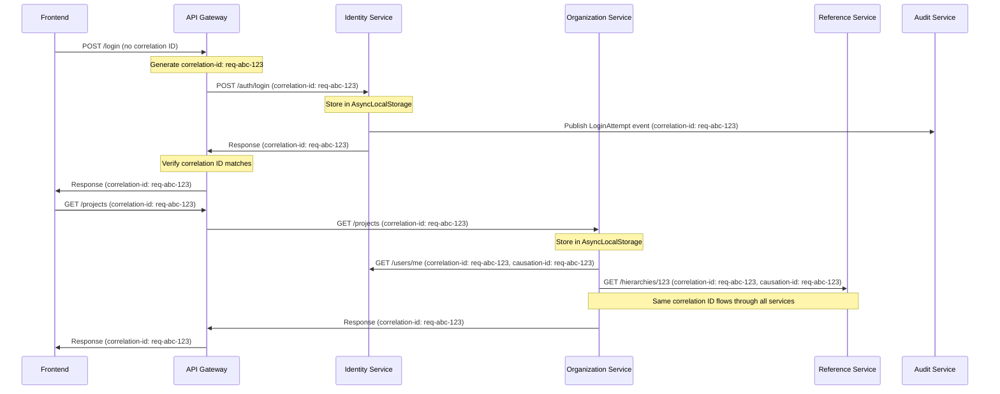

# Correlation ID Implementation Pattern

## Overview

This document provides a complete implementation guide for correlation IDs in the Clenergize V3 microservices architecture. Correlation IDs enable distributed tracing across all services, making it possible to track a single request through its entire lifecycle.

## Why Correlation IDs?

In a microservices architecture with 7 backend services, a single user action can trigger:
- Multiple HTTP requests across services
- Several database operations
- Event publications and consumption
- External API calls
- Cache operations

Without correlation IDs, debugging issues becomes nearly impossible. With them, you can:
- Trace the complete path of a request
- Identify which service caused an error
- Measure end-to-end latency
- Debug production issues quickly
- Generate distributed traces

## Architecture Pattern

### Correlation ID Flow



## Implementation Guide

### 1. Core Service: Correlation Service

Create a shared correlation service that all microservices use.

**Location**: `NEW/shared/correlation/correlation.service.ts`

```typescript
import { Injectable } from '@nestjs/common';
import { AsyncLocalStorage } from 'async_hooks';

export interface CorrelationContext {
  correlationId: string;
  causationId?: string;
  userId?: string;
  startTime: number;
  metadata?: Record<string, any>;
}

@Injectable()
export class CorrelationService {
  // AsyncLocalStorage provides context isolation per request
  private static storage = new AsyncLocalStorage<CorrelationContext>();

  /**
   * Get the AsyncLocalStorage instance
   * Used by middleware to create new contexts
   */
  static getStorage(): AsyncLocalStorage<CorrelationContext> {
    return this.storage;
  }

  /**
   * Get the current correlation context
   * Returns undefined if not in a correlation context
   */
  getContext(): CorrelationContext | undefined {
    return CorrelationService.storage.getStore();
  }

  /**
   * Get the correlation ID for the current request
   * Returns 'UNKNOWN' if not in a correlation context (shouldn't happen)
   */
  getCorrelationId(): string {
    const context = this.getContext();
    if (!context) {
      console.warn('No correlation context found - this should not happen!');
      return 'UNKNOWN';
    }
    return context.correlationId;
  }

  /**
   * Get the causation ID (the ID of the event/request that caused this one)
   */
  getCausationId(): string | undefined {
    return this.getContext()?.causationId;
  }

  /**
   * Get the user ID associated with this request
   */
  getUserId(): string | undefined {
    return this.getContext()?.userId;
  }

  /**
   * Get the request start time (for duration calculation)
   */
  getStartTime(): number | undefined {
    return this.getContext()?.startTime;
  }

  /**
   * Get request duration in milliseconds
   */
  getDuration(): number {
    const startTime = this.getStartTime();
    return startTime ? Date.now() - startTime : 0;
  }

  /**
   * Add metadata to the current correlation context
   */
  addMetadata(key: string, value: any): void {
    const context = this.getContext();
    if (context) {
      if (!context.metadata) {
        context.metadata = {};
      }
      context.metadata[key] = value;
    }
  }

  /**
   * Get metadata from the current correlation context
   */
  getMetadata(key?: string): any {
    const context = this.getContext();
    if (!context?.metadata) return undefined;
    return key ? context.metadata[key] : context.metadata;
  }
}
```

### 2. Middleware: Correlation ID Injection

Create middleware to inject correlation IDs into incoming HTTP requests.

**Location**: `NEW/shared/correlation/correlation.middleware.ts`

```typescript
import { Injectable, NestMiddleware } from '@nestjs/common';
import { Request, Response, NextFunction } from 'express';
import { v4 as uuidv4 } from 'uuid';
import { CorrelationService } from './correlation.service';

// Extend Express Request type to include correlation properties
declare global {
  namespace Express {
    interface Request {
      correlationId?: string;
      causationId?: string;
    }
  }
}

@Injectable()
export class CorrelationMiddleware implements NestMiddleware {
  use(req: Request, res: Response, next: NextFunction) {
    // Extract or generate correlation ID
    const correlationId =
      req.headers['x-correlation-id'] as string ||
      req.headers['x-request-id'] as string ||
      uuidv4();

    // Extract causation ID if present
    const causationId = req.headers['x-causation-id'] as string;

    // Extract user ID from authenticated request
    const userId = (req as any).user?.id || (req as any).user?.sub;

    // Create correlation context
    const context = {
      correlationId,
      causationId,
      userId,
      startTime: Date.now(),
      metadata: {}
    };

    // Store context in AsyncLocalStorage for this request
    CorrelationService.getStorage().run(context, () => {
      // Attach to request object for easy access
      req.correlationId = correlationId;
      req.causationId = causationId;

      // Add correlation ID to response headers
      res.setHeader('X-Correlation-ID', correlationId);
      if (causationId) {
        res.setHeader('X-Causation-ID', causationId);
      }

      // Log request start
      console.log(`[${correlationId}] ${req.method} ${req.path} - Request started`);

      // Hook into response finish to log duration
      res.on('finish', () => {
        const duration = Date.now() - context.startTime;
        console.log(
          `[${correlationId}] ${req.method} ${req.path} - ` +
          `Completed in ${duration}ms with status ${res.statusCode}`
        );
      });

      next();
    });
  }
}
```

**Register middleware in AppModule**:

```typescript
// src/app.module.ts
import { Module, NestModule, MiddlewareConsumer } from '@nestjs/common';
import { CorrelationMiddleware } from '@/shared/correlation/correlation.middleware';
import { CorrelationService } from '@/shared/correlation/correlation.service';

@Module({
  providers: [CorrelationService],
  exports: [CorrelationService]
})
export class AppModule implements NestModule {
  configure(consumer: MiddlewareConsumer) {
    // Apply to all routes
    consumer
      .apply(CorrelationMiddleware)
      .forRoutes('*');
  }
}
```

### 3. Logger Integration

Enhance Winston logger to automatically include correlation IDs.

**Location**: `NEW/shared/logger/logger.service.ts`

```typescript
import { Injectable, LoggerService as NestLoggerService, Scope } from '@nestjs/common';
import winston from 'winston';
import { CorrelationService } from '@/shared/correlation/correlation.service';

@Injectable({ scope: Scope.TRANSIENT })
export class LoggerService implements NestLoggerService {
  private logger: winston.Logger;
  private context?: string;

  constructor(private correlationService: CorrelationService) {
    this.logger = winston.createLogger({
      level: process.env.LOG_LEVEL || 'info',
      format: winston.format.combine(
        winston.format.timestamp({ format: 'YYYY-MM-DD HH:mm:ss' }),
        winston.format.errors({ stack: true }),
        winston.format.json()
      ),
      defaultMeta: {
        service: process.env.SERVICE_NAME || 'unknown-service',
        environment: process.env.NODE_ENV || 'development',
        version: process.env.VERSION || '1.0.0'
      },
      transports: [
        new winston.transports.Console({
          format: winston.format.combine(
            winston.format.colorize(),
            winston.format.printf(({ timestamp, level, message, context, ...meta }) => {
              const correlationId = meta.correlationId || 'NO-CORRELATION-ID';
              const contextStr = context ? `[${context}]` : '';
              return `${timestamp} ${level} [${correlationId}] ${contextStr} ${message}`;
            })
          )
        }),
        new winston.transports.File({
          filename: 'logs/error.log',
          level: 'error',
          maxsize: 5242880, // 5MB
          maxFiles: 5
        }),
        new winston.transports.File({
          filename: 'logs/combined.log',
          maxsize: 5242880,
          maxFiles: 5
        })
      ]
    });
  }

  /**
   * Set the context (usually the class name) for log messages
   */
  setContext(context: string) {
    this.context = context;
    return this;
  }

  /**
   * Enrich log message with correlation context
   */
  private enrichWithContext(message: string, meta?: any) {
    return {
      message,
      context: this.context,
      correlationId: this.correlationService.getCorrelationId(),
      causationId: this.correlationService.getCausationId(),
      userId: this.correlationService.getUserId(),
      duration: this.correlationService.getDuration(),
      ...this.correlationService.getMetadata(),
      ...meta
    };
  }

  log(message: string, meta?: any) {
    this.logger.info(this.enrichWithContext(message, meta));
  }

  info(message: string, meta?: any) {
    this.logger.info(this.enrichWithContext(message, meta));
  }

  error(message: string, trace?: string, meta?: any) {
    this.logger.error(this.enrichWithContext(message, { ...meta, trace }));
  }

  warn(message: string, meta?: any) {
    this.logger.warn(this.enrichWithContext(message, meta));
  }

  debug(message: string, meta?: any) {
    this.logger.debug(this.enrichWithContext(message, meta));
  }

  verbose(message: string, meta?: any) {
    this.logger.verbose(this.enrichWithContext(message, meta));
  }
}

/**
 * Factory to create logger instances with context
 */
export function createLogger(context: string): LoggerService {
  const logger = new LoggerService(new CorrelationService());
  logger.setContext(context);
  return logger;
}
```

**Usage in Services**:

```typescript
import { Injectable } from '@nestjs/common';
import { LoggerService } from '@/shared/logger/logger.service';

@Injectable()
export class UserService {
  constructor(private logger: LoggerService) {
    this.logger.setContext(UserService.name);
  }

  async createUser(userData: CreateUserDto) {
    this.logger.info('Creating new user', { email: userData.email });

    try {
      const user = await this.userRepository.create(userData);
      this.logger.info('User created successfully', { userId: user.id });
      return user;
    } catch (error) {
      this.logger.error('Failed to create user', error.stack, {
        email: userData.email
      });
      throw error;
    }
  }
}
```

### 4. HTTP Client Integration

Propagate correlation IDs to downstream services.

**Location**: `NEW/shared/http/base-api-client.ts`

```typescript
import { Injectable } from '@nestjs/common';
import { CorrelationService } from '@/shared/correlation/correlation.service';
import { LoggerService } from '@/shared/logger/logger.service';

export interface RequestConfig extends RequestInit {
  url: string;
  timeout?: number;
  retries?: number;
}

@Injectable()
export class BaseAPIClient {
  constructor(
    private correlationService: CorrelationService,
    private logger: LoggerService
  ) {
    this.logger.setContext(BaseAPIClient.name);
  }

  /**
   * Make HTTP request with automatic correlation ID propagation
   */
  async request<T>(config: RequestConfig): Promise<T> {
    const correlationId = this.correlationService.getCorrelationId();
    const causationId = this.correlationService.getCausationId();

    // Prepare headers with correlation IDs
    const headers = {
      'Content-Type': 'application/json',
      'X-Correlation-ID': correlationId,
      ...(causationId && { 'X-Causation-ID': causationId }),
      ...config.headers
    };

    this.logger.debug(`Making ${config.method || 'GET'} request`, {
      url: config.url,
      headers: Object.keys(headers)
    });

    try {
      const response = await fetch(config.url, {
        ...config,
        headers,
        signal: AbortSignal.timeout(config.timeout || 30000)
      });

      // Verify correlation ID is returned
      const returnedCorrelationId = response.headers.get('X-Correlation-ID');
      if (returnedCorrelationId && returnedCorrelationId !== correlationId) {
        this.logger.warn('Correlation ID mismatch', {
          sent: correlationId,
          received: returnedCorrelationId
        });
      }

      if (!response.ok) {
        throw new Error(`HTTP ${response.status}: ${response.statusText}`);
      }

      return await response.json();
    } catch (error) {
      this.logger.error('HTTP request failed', error.stack, {
        url: config.url,
        method: config.method || 'GET'
      });
      throw error;
    }
  }

  async get<T>(url: string, config?: Partial<RequestConfig>): Promise<T> {
    return this.request<T>({ ...config, url, method: 'GET' });
  }

  async post<T>(url: string, body: any, config?: Partial<RequestConfig>): Promise<T> {
    return this.request<T>({
      ...config,
      url,
      method: 'POST',
      body: JSON.stringify(body)
    });
  }

  async put<T>(url: string, body: any, config?: Partial<RequestConfig>): Promise<T> {
    return this.request<T>({
      ...config,
      url,
      method: 'PUT',
      body: JSON.stringify(body)
    });
  }

  async delete<T>(url: string, config?: Partial<RequestConfig>): Promise<T> {
    return this.request<T>({ ...config, url, method: 'DELETE' });
  }
}
```

### 5. Event Bus Integration

Propagate correlation IDs through events.

**Location**: `NEW/shared/messaging/event-bus.service.ts`

```typescript
import { Injectable } from '@nestjs/common';
import { EventBridgeClient, PutEventsCommand } from '@aws-sdk/client-eventbridge';
import { DomainEvent } from '@/domain/events/base.event';
import { CorrelationService } from '@/shared/correlation/correlation.service';
import { LoggerService } from '@/shared/logger/logger.service';

@Injectable()
export class EventBusService {
  constructor(
    private eventBridge: EventBridgeClient,
    private correlationService: CorrelationService,
    private logger: LoggerService
  ) {
    this.logger.setContext(EventBusService.name);
  }

  /**
   * Publish domain event with automatic correlation ID enrichment
   */
  async publish(event: DomainEvent): Promise<void> {
    // Automatically enrich event with correlation IDs
    const enrichedEvent = {
      ...event,
      correlationId: this.correlationService.getCorrelationId(),
      causationId: event.id, // This event becomes the cause of future events
      userId: this.correlationService.getUserId(),
      timestamp: event.occurredAt || new Date().toISOString()
    };

    this.logger.info('Publishing domain event', {
      eventType: event.type,
      eventId: event.id,
      aggregateId: event.aggregateId
    });

    try {
      await this.eventBridge.send(new PutEventsCommand({
        Entries: [{
          Source: `clenergize.${process.env.SERVICE_NAME}`,
          DetailType: event.type,
          Detail: JSON.stringify(enrichedEvent),
          EventBusName: process.env.EVENT_BUS_NAME || 'clenergize-events'
        }]
      }));

      this.logger.debug('Event published successfully', {
        eventType: event.type,
        eventId: event.id
      });
    } catch (error) {
      this.logger.error('Failed to publish event', error.stack, {
        eventType: event.type,
        eventId: event.id
      });
      throw error;
    }
  }

  /**
   * Subscribe to events and propagate correlation context
   */
  async consumeEvent(event: DomainEvent, handler: (event: DomainEvent) => Promise<void>): Promise<void> {
    // Create new correlation context from event
    const context = {
      correlationId: event.correlationId || 'EVENT-NO-CORRELATION-ID',
      causationId: event.id,
      userId: event.userId,
      startTime: Date.now()
    };

    // Run handler in correlation context
    await CorrelationService.getStorage().run(context, async () => {
      this.logger.info('Consuming domain event', {
        eventType: event.type,
        eventId: event.id
      });

      try {
        await handler(event);
        this.logger.info('Event consumed successfully', {
          eventType: event.type,
          eventId: event.id,
          duration: this.correlationService.getDuration()
        });
      } catch (error) {
        this.logger.error('Failed to consume event', error.stack, {
          eventType: event.type,
          eventId: event.id
        });
        throw error;
      }
    });
  }
}
```

### 6. Database Integration (Optional)

Store correlation IDs with database records for audit purposes.

```typescript
import { Injectable } from '@nestjs/common';
import { InjectModel } from '@nestjs/mongoose';
import { Model } from 'mongoose';
import { CorrelationService } from '@/shared/correlation/correlation.service';

@Injectable()
export class UserRepository {
  constructor(
    @InjectModel('User') private userModel: Model<User>,
    private correlationService: CorrelationService
  ) {}

  async create(userData: CreateUserDto): Promise<User> {
    const user = new this.userModel({
      ...userData,
      // Audit fields
      createdBy: this.correlationService.getUserId(),
      createdAt: new Date(),
      correlationId: this.correlationService.getCorrelationId()
    });

    return user.save();
  }

  async update(id: string, updateData: UpdateUserDto): Promise<User> {
    return this.userModel.findByIdAndUpdate(
      id,
      {
        ...updateData,
        // Audit fields
        updatedBy: this.correlationService.getUserId(),
        updatedAt: new Date(),
        lastCorrelationId: this.correlationService.getCorrelationId()
      },
      { new: true }
    );
  }
}
```

## Testing with Correlation IDs

### Unit Tests

```typescript
import { Test } from '@nestjs/testing';
import { CorrelationService } from '@/shared/correlation/correlation.service';
import { UserService } from './user.service';

describe('UserService', () => {
  let userService: UserService;
  let correlationService: CorrelationService;

  beforeEach(async () => {
    const module = await Test.createTestingModule({
      providers: [UserService, CorrelationService]
    }).compile();

    userService = module.get(UserService);
    correlationService = module.get(CorrelationService);
  });

  it('should use correlation ID from context', async () => {
    const testCorrelationId = 'test-correlation-id';

    // Create correlation context for test
    await CorrelationService.getStorage().run(
      {
        correlationId: testCorrelationId,
        startTime: Date.now()
      },
      async () => {
        // Call service method
        await userService.createUser({ email: 'test@example.com' });

        // Verify correlation ID was used
        expect(correlationService.getCorrelationId()).toBe(testCorrelationId);
      }
    );
  });
});
```

### Integration Tests

```typescript
import * as request from 'supertest';
import { INestApplication } from '@nestjs/common';

describe('User API (e2e)', () => {
  let app: INestApplication;

  it('should return correlation ID in response', async () => {
    const testCorrelationId = 'test-e2e-correlation';

    const response = await request(app.getHttpServer())
      .post('/users')
      .set('X-Correlation-ID', testCorrelationId)
      .send({ email: 'test@example.com' });

    expect(response.status).toBe(201);
    expect(response.headers['x-correlation-id']).toBe(testCorrelationId);
  });

  it('should generate correlation ID if not provided', async () => {
    const response = await request(app.getHttpServer())
      .post('/users')
      .send({ email: 'test@example.com' });

    expect(response.status).toBe(201);
    expect(response.headers['x-correlation-id']).toMatch(/^[0-9a-f-]{36}$/);
  });
});
```

## Monitoring and Troubleshooting

### CloudWatch Logs Insights Queries

**Find all logs for a specific request**:
```
fields @timestamp, @message, context, message
| filter correlationId = "req-abc-123"
| sort @timestamp asc
```

**Find slow requests**:
```
fields @timestamp, correlationId, duration, message
| filter duration > 1000
| sort duration desc
| limit 100
```

**Find errors by correlation ID**:
```
fields @timestamp, correlationId, level, message, trace
| filter level = "error"
| filter correlationId = "req-abc-123"
| sort @timestamp asc
```

**Track request across services**:
```
fields @timestamp, service, correlationId, message
| filter correlationId = "req-abc-123"
| sort @timestamp asc
```

### Grafana Dashboard

Create dashboards to visualize correlation ID flows:

```json
{
  "dashboard": {
    "title": "Request Tracing by Correlation ID",
    "panels": [
      {
        "title": "Request Flow Timeline",
        "targets": [
          {
            "expr": "sum by (service, correlationId) (rate(http_requests_total[5m]))"
          }
        ]
      },
      {
        "title": "Average Request Duration by Service",
        "targets": [
          {
            "expr": "avg(request_duration_milliseconds) by (service)"
          }
        ]
      }
    ]
  }
}
```

## Best Practices

1. **Always Generate at Entry Point**: API Gateway or first service should always generate a correlation ID if not present

2. **Never Modify**: Once created, never change the correlation ID during the request lifecycle

3. **Propagate Everywhere**: Pass correlation IDs to:
   - All downstream HTTP requests
   - All event publications
   - All log messages
   - Database audit fields (optional)

4. **Use Causation IDs**: When one request triggers another, the first correlation ID becomes the causation ID of the second

5. **Log at Boundaries**: Always log when entering/exiting a service boundary

6. **Include in Errors**: Always include correlation ID in error responses for debugging

7. **Monitor Missing IDs**: Alert when logs appear without correlation IDs

8. **Use Standard Headers**: Stick to `X-Correlation-ID` and `X-Causation-ID` headers

## Common Pitfalls

### ❌ Don't: Forget to propagate to async operations

```typescript
// WRONG - loses correlation context
async function processAsync() {
  setTimeout(() => {
    logger.info('Processing complete'); // No correlation ID!
  }, 1000);
}
```

```typescript
// CORRECT - maintain correlation context
async function processAsync() {
  const correlationId = correlationService.getCorrelationId();
  setTimeout(() => {
    // Context is still available because we're in the same async chain
    logger.info('Processing complete'); // Has correlation ID
  }, 1000);
}
```

### ❌ Don't: Create new correlation IDs mid-request

```typescript
// WRONG - breaks tracing
function handleRequest() {
  const newId = uuidv4(); // Don't do this!
  logger.info('Processing', { correlationId: newId });
}
```

### ❌ Don't: Log without correlation context

```typescript
// WRONG - bypasses correlation enrichment
console.log('User created'); // Use logger service instead!
```

```typescript
// CORRECT
logger.info('User created'); // Automatically includes correlation ID
```

## Checklist for Implementation

- [ ] CorrelationService created and registered
- [ ] CorrelationMiddleware applied to all routes
- [ ] LoggerService integrated with correlation service
- [ ] BaseAPIClient propagates correlation IDs
- [ ] EventBusService enriches events with correlation IDs
- [ ] All services use correlation-aware logger
- [ ] Tests verify correlation ID propagation
- [ ] CloudWatch Logs Insights queries created
- [ ] Grafana dashboards configured
- [ ] Team trained on correlation ID usage

## Reference Implementation

See working implementation in:
- `NEW/shared/correlation/` - Core services
- `NEW/identity-service/` - Reference implementation
- `Docs/MONITORING_AND_ALERTING_SPEC.md` - Monitoring setup

## Support

For questions about correlation ID implementation:
- Contact: Architecture Agent
- Documentation: This file
- Examples: See NEW/identity-service for reference

---

**Last Updated**: November 18, 2025
**Version**: 1.0.0
**Maintained by**: Architecture Team
