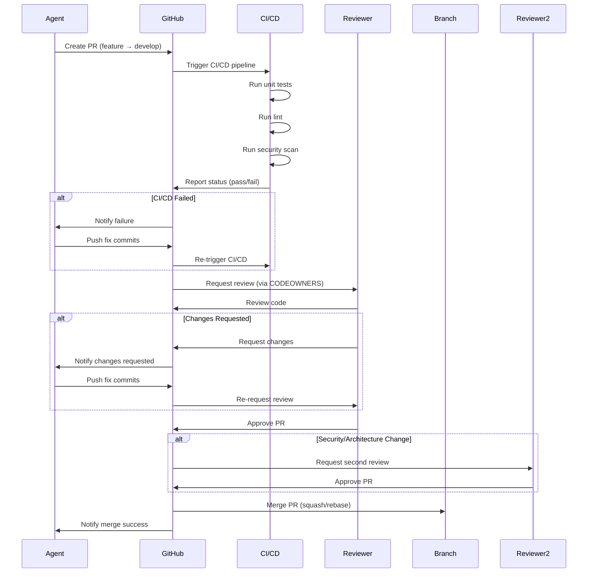

# Code Review Policy

**Project**: Clenergize V3 Rebuild
**Version**: 1.0.0
**Last Updated**: November 19, 2025
**Status**: ACTIVE
**Priority**: CRITICAL

---

## Executive Summary

All code changes in the Clenergize V3 project **MUST** go through mandatory human code review before being merged into protected branches. This policy applies to **ALL contributors**, including AI agents (Claude Code, specialized agents) and human developers.

**Key Principle**: **ZERO TRUST** - No code is merged without explicit human approval.

---

## Table of Contents

1. [Scope and Applicability](#scope-and-applicability)
2. [Review Requirements](#review-requirements)
3. [Protected Branches](#protected-branches)
4. [CODEOWNERS Configuration](#codeowners-configuration)
5. [Pull Request Process](#pull-request-process)
6. [Review Criteria](#review-criteria)
7. [Emergency Procedures](#emergency-procedures)
8. [Enforcement](#enforcement)

---

## 1. Scope and Applicability

### 1.1 Who Must Follow This Policy

**ALL Contributors**:
- ✅ AI Agents (Claude Code agents, specialized service agents)
- ✅ Human Developers (full-time, contractors, external contributors)
- ✅ DevOps Engineers
- ✅ Security Team Members
- ⚠️ **Exception**: Project administrators during critical outages (see [Emergency Procedures](#emergency-procedures))

### 1.2 What Requires Review

**ALL Code Changes**:
- ✅ Application code (TypeScript, JavaScript)
- ✅ Infrastructure code (Terraform, Dockerfiles, docker-compose.yml)
- ✅ Configuration files (.env.example, package.json)
- ✅ Database schemas and migrations
- ✅ CI/CD pipelines (.github/workflows/*)
- ✅ Documentation with code examples (*.md with code blocks)

**Exemptions**:
- ❌ README updates (no code)
- ❌ Markdown-only documentation changes (no code blocks)
- ❌ .gitignore updates

---

## 2. Review Requirements

### 2.1 Minimum Approval Requirements

| Change Type | Minimum Reviewers | Required Reviewer Role |
|-------------|-------------------|------------------------|
| **Agent-Generated PR** | 1 human | Any team member |
| **Non-Critical Change** | 1 human | Any team member |
| **Security-Critical Change** | 2 humans | 1 Security Lead + 1 Team Member |
| **Architecture Change** | 2 humans | 1 Architect + 1 Team Member |
| **Infrastructure Change** | 1 human | DevOps Engineer or Architect |
| **Database Migration** | 2 humans | 1 Database Expert + 1 Team Member |

**Security-Critical Changes Include**:
- JWT/JWKS authentication code
- Authorization/permission checks
- Secrets management
- Encryption/decryption logic
- Input validation and sanitization
- File upload handling
- Database query construction

**Architecture Changes Include**:
- New service creation
- Service boundary modifications
- Event schema changes
- API contract changes
- Database schema changes affecting multiple services

---

### 2.2 Review Timeline

| Priority | First Review SLA | Approval SLA |
|----------|------------------|--------------|
| **CRITICAL** (production hotfix) | 1 hour | 2 hours |
| **HIGH** (Sprint 0.1-0.2 P0 tasks) | 4 hours | 8 hours |
| **MEDIUM** (Sprint backlog items) | 1 day | 2 days |
| **LOW** (technical debt, refactoring) | 2 days | 5 days |

**Escalation**: If SLA is not met, escalate to project lead.

---

## 3. Protected Branches

### 3.1 Branch Protection Rules

#### `main` Branch
- ✅ Require pull request reviews before merging
- ✅ Require 1+ approving review (2+ for security/architecture)
- ✅ Dismiss stale pull request approvals when new commits are pushed
- ✅ Require review from Code Owners
- ✅ Require status checks to pass before merging:
  - `ci/unit-tests`
  - `ci/integration-tests`
  - `ci/security-scan` (npm audit, Semgrep)
  - `ci/lint`
- ✅ Require branches to be up to date before merging
- ✅ Require conversation resolution before merging
- ❌ Allow force pushes (DISABLED)
- ❌ Allow deletions (DISABLED)
- ✅ Restrict who can push to matching branches (Administrators only)

#### `develop` Branch
- ✅ Require pull request reviews before merging
- ✅ Require 1+ approving review
- ✅ Require review from Code Owners
- ✅ Require status checks to pass before merging:
  - `ci/unit-tests`
  - `ci/lint`
- ✅ Require branches to be up to date before merging
- ❌ Allow force pushes (DISABLED for non-admins)
- ❌ Allow deletions (DISABLED)

#### `sprint/*` Branches (e.g., `sprint/0.1`, `sprint/0.2`)
- ✅ Require pull request reviews before merging
- ✅ Require 1+ approving review
- ✅ Require status checks to pass before merging:
  - `ci/unit-tests`
  - `ci/lint`
- ✅ Require branches to be up to date before merging
- ❌ Allow force pushes (DISABLED)
- ❌ Allow deletions (DISABLED)

---

### 3.2 GitHub Branch Protection Configuration

**Setup Instructions**:

1. **Navigate to Repository Settings**:
   ```
   GitHub Repository → Settings → Branches → Branch protection rules
   ```

2. **Add Rule for `main`**:
   ```yaml
   Branch name pattern: main

   Protect matching branches:
     ☑ Require a pull request before merging
       ☑ Require approvals: 1 (2 for security/architecture via CODEOWNERS)
       ☑ Dismiss stale pull request approvals when new commits are pushed
       ☑ Require review from Code Owners
       ☑ Require approval of the most recent reviewable push

     ☑ Require status checks to pass before merging
       ☑ Require branches to be up to date before merging
       Status checks required:
         - ci/unit-tests
         - ci/integration-tests
         - ci/security-scan
         - ci/lint

     ☑ Require conversation resolution before merging

     ☑ Require signed commits (recommended)

     ☐ Require linear history (optional)

     ☑ Require deployments to succeed before merging (optional, for staging)

     ☐ Lock branch (only for release branches)

     ☐ Do not allow bypassing the above settings (enforce for administrators)

     Rules applied to administrators:
       ☑ Include administrators (administrators must follow these rules)
   ```

3. **Add Rule for `develop`**:
   ```yaml
   Branch name pattern: develop

   [Same as main, but without integration-tests and security-scan requirements]
   ```

4. **Add Rule for `sprint/*`**:
   ```yaml
   Branch name pattern: sprint/*

   [Same as develop]
   ```

---

## 4. CODEOWNERS Configuration

### 4.1 CODEOWNERS File

**Location**: `.github/CODEOWNERS`

**Purpose**: Automatically assign reviewers based on file paths.

**Contents**:
```bash
# CODEOWNERS for Clenergize V3
# Documentation: https://docs.github.com/en/repositories/managing-your-repositorys-settings-and-features/customizing-your-repository/about-code-owners

# Global fallback (requires 1 reviewer from any team member)
* @clenergize-team

# ============================================================================
# SECURITY-CRITICAL CODE (requires Security Lead approval)
# ============================================================================

# Authentication & Authorization
NEW/identity-service/src/domain/services/**/*.ts @security-lead @clenergize-team
NEW/identity-service/src/application/commands/auth/**/*.ts @security-lead @clenergize-team
NEW/*/src/infrastructure/auth/**/*.ts @security-lead @clenergize-team

# JWT/JWKS Implementation
NEW/*/src/infrastructure/auth/jwt*.ts @security-lead @clenergize-team

# Secrets Management
NEW/*/src/infrastructure/secrets/**/*.ts @security-lead @clenergize-team
**/.env.example @security-lead @clenergize-team

# Input Validation & Sanitization
NEW/*/src/application/validators/**/*.ts @security-lead @clenergize-team

# MCP Executor (code injection risk)
mcp-servers/clenergize-executor/**/*.js @security-lead @architecture-lead @clenergize-team

# ============================================================================
# ARCHITECTURE-CRITICAL CODE (requires Architect approval)
# ============================================================================

# Service Boundaries & API Contracts
NEW/*/src/infrastructure/http/controllers/**/*.ts @architecture-lead @clenergize-team
NEW/shared/contracts/**/*.ts @architecture-lead @clenergize-team

# Event Schemas
NEW/shared/contracts/src/events/**/*.ts @architecture-lead @clenergize-team
Docs/EVENT_SCHEMA_REGISTRY.md @architecture-lead @clenergize-team

# Database Schemas & Migrations
NEW/*/src/infrastructure/database/schemas/**/*.ts @architecture-lead @database-expert @clenergize-team
NEW/*/src/infrastructure/database/migrations/**/*.ts @architecture-lead @database-expert @clenergize-team

# Service Creation (new microservices)
NEW/*-service/package.json @architecture-lead @clenergize-team

# ============================================================================
# INFRASTRUCTURE & DEVOPS (requires DevOps approval)
# ============================================================================

# Docker Configuration
**/Dockerfile @devops-lead @clenergize-team
**/docker-compose*.yml @devops-lead @clenergize-team

# CI/CD Pipelines
.github/workflows/**/*.yml @devops-lead @clenergize-team

# Terraform Infrastructure
terraform/**/*.tf @devops-lead @architecture-lead @clenergize-team

# Kubernetes Manifests
k8s/**/*.yaml @devops-lead @clenergize-team

# Environment Configuration
**/.env.example @devops-lead @clenergize-team

# ============================================================================
# DATA & DATABASE (requires Database Expert approval)
# ============================================================================

# Database Migrations
NEW/*/src/infrastructure/database/migrations/**/*.ts @database-expert @clenergize-team

# Data Migration Scripts
NEW/migration-scripts/**/*.ts @database-expert @architecture-lead @clenergize-team

# Seeder Scripts
NEW/*/src/infrastructure/database/seeders/**/*.ts @database-expert @clenergize-team

# ============================================================================
# SERVICE-SPECIFIC OWNERSHIP
# ============================================================================

# Identity Service
NEW/identity-service/** @identity-agent-owner @clenergize-team

# Organization Service
NEW/organization-service/** @organization-agent-owner @clenergize-team

# Reference Service
NEW/reference-service/** @reference-agent-owner @clenergize-team

# Activity Service
NEW/activity-service/** @activity-agent-owner @clenergize-team

# Calculation Service
NEW/calculation-service/** @calculation-agent-owner @clenergize-team

# Reporting Service
NEW/reporting-service/** @reporting-agent-owner @clenergize-team

# Audit Service
NEW/audit-service/** @audit-agent-owner @clenergize-team

# ============================================================================
# DOCUMENTATION (requires minimal review)
# ============================================================================

# Architecture Documentation
Docs/PHASE*.md @architecture-lead
Docs/SERVICE_DEPENDENCY_DIAGRAM.md @architecture-lead

# Security Documentation
Docs/*SECURITY*.md @security-lead
Docs/STRIDE*.md @security-lead

# General Documentation (any team member can approve)
*.md @clenergize-team

# ============================================================================
# CONFIGURATION & BUILD
# ============================================================================

# Package Dependencies
**/package.json @architecture-lead @clenergize-team
**/package-lock.json @clenergize-team

# TypeScript Configuration
**/tsconfig.json @architecture-lead @clenergize-team

# ESLint & Prettier
**/.eslintrc.js @clenergize-team
**/.prettierrc @clenergize-team

# Git Configuration
.gitignore @clenergize-team
.gitattributes @clenergize-team
```

---

### 4.2 Team Assignments

**GitHub Teams to Create**:

```yaml
@clenergize-team:
  - All team members (human developers)
  - Purpose: Default reviewers for non-critical changes

@security-lead:
  - Security specialist(s)
  - Purpose: Required for security-critical changes

@architecture-lead:
  - System architect(s)
  - Purpose: Required for architecture changes

@devops-lead:
  - DevOps engineer(s)
  - Purpose: Required for infrastructure changes

@database-expert:
  - Database specialist(s)
  - Purpose: Required for database migrations

@identity-agent-owner:
  - Identity service lead developer
  - Purpose: Domain expert for Identity Service

@organization-agent-owner:
  - Organization service lead developer
  - Purpose: Domain expert for Organization Service

[... similar for other services ...]
```

**Setup Instructions**:
1. Navigate to: `GitHub Organization → Teams`
2. Create each team listed above
3. Add appropriate team members
4. Grant teams `Write` access to repository

---

## 5. Pull Request Process

### 5.1 Agent-Generated Pull Request Template

**Location**: `.github/PULL_REQUEST_TEMPLATE.md`

**Contents**:
```markdown
## Description

<!-- Brief description of what this PR does -->

## Change Type

- [ ] Agent-Generated Code (requires 1 human approval)
- [ ] Human-Written Code
- [ ] Security-Critical Change (requires Security Lead approval)
- [ ] Architecture Change (requires Architect approval)
- [ ] Infrastructure Change (requires DevOps approval)
- [ ] Database Migration (requires Database Expert approval)

## Agent Information (if applicable)

- **Agent Type**: [Master Coordinator / Architecture / Security / Identity / Organization / etc.]
- **Agent Task**: [Brief description of the agent's task]
- **Related Jira Ticket**: [CLNZ-XXX]
- **Sprint**: [Sprint 0.1 / 0.2 / etc.]

## Changes Made

<!-- List of specific changes -->
-
-
-

## Testing

- [ ] Unit tests added/updated
- [ ] Integration tests added/updated
- [ ] Manual testing performed
- [ ] Security tests passed (if applicable)

## Review Checklist

### Code Quality
- [ ] Code follows project conventions
- [ ] No hardcoded secrets or credentials
- [ ] Error handling implemented
- [ ] Logging added for important operations
- [ ] Comments added for complex logic

### Security (for security-critical changes)
- [ ] Input validation implemented
- [ ] Authentication/authorization checked
- [ ] No SQL/NoSQL injection vulnerabilities
- [ ] No code injection vulnerabilities
- [ ] Secrets managed via AWS Secrets Manager

### Architecture (for architecture changes)
- [ ] Service boundaries respected
- [ ] Event schemas documented
- [ ] API contracts defined
- [ ] No circular dependencies introduced

### Testing
- [ ] Unit test coverage ≥80%
- [ ] Integration tests cover happy path
- [ ] Edge cases tested
- [ ] Error scenarios tested

### Documentation
- [ ] API documentation updated (Swagger)
- [ ] README updated (if applicable)
- [ ] Architecture docs updated (if applicable)

## Deployment Plan

<!-- How will this be deployed? Any special steps? -->

## Rollback Plan

<!-- How to rollback if this causes issues? -->

## Related Issues

<!-- Link to Jira tickets, GitHub issues, etc. -->
- Jira: CLNZ-XXX
- Related PRs: #XXX

## Screenshots (if applicable)

<!-- Add screenshots for UI changes -->

---

**For Reviewers**:
1. Verify all checklist items are completed
2. Run code locally if possible
3. Check for security vulnerabilities
4. Ensure tests pass in CI/CD
5. Approve only if confident in code quality

**Agent Signature**:
```
Generated by: [Agent Name]
Date: [YYYY-MM-DD HH:MM:SS UTC]
Correlation ID: [correlation-id]
```
```

---

### 5.2 Pull Request Workflow



---

## 6. Review Criteria

### 6.1 Code Quality Checklist

**Reviewers MUST verify**:

#### General Code Quality
- [ ] Code follows TypeScript/JavaScript style guide
- [ ] Variables/functions have meaningful names
- [ ] Complex logic has explanatory comments
- [ ] No commented-out code (use git history)
- [ ] No console.log() in production code (use proper logger)
- [ ] No hardcoded URLs/credentials/secrets
- [ ] Error handling is comprehensive
- [ ] Functions are small and focused (< 50 lines)
- [ ] No code duplication (DRY principle)

#### Security
- [ ] Input validation on all user inputs
- [ ] Authentication checks on protected endpoints
- [ ] Authorization checks (role-based permissions)
- [ ] No SQL/NoSQL injection vulnerabilities
- [ ] No command injection vulnerabilities
- [ ] No XSS vulnerabilities
- [ ] Secrets accessed via AWS Secrets Manager
- [ ] Sensitive data encrypted at rest
- [ ] HTTPS/TLS enforced for external calls

#### Testing
- [ ] Unit tests cover happy path
- [ ] Unit tests cover edge cases
- [ ] Unit tests cover error scenarios
- [ ] Unit test coverage ≥80% (per file)
- [ ] Integration tests added (if applicable)
- [ ] Tests are deterministic (no flaky tests)
- [ ] Mock external dependencies in tests

#### Performance
- [ ] No N+1 query issues
- [ ] Database queries use indexes
- [ ] Large datasets paginated
- [ ] Timeouts configured for external calls
- [ ] Circuit breakers used for external dependencies

#### Documentation
- [ ] API endpoints documented in Swagger
- [ ] Complex algorithms explained in comments
- [ ] README updated if public API changed
- [ ] Architecture docs updated if service boundaries changed

---

### 6.2 Automated Review Tools

**CI/CD Pipeline Must Include**:

1. **ESLint** (Code Quality)
   ```bash
   npm run lint
   ```
   - Enforce consistent code style
   - Catch common bugs
   - Enforce best practices

2. **Prettier** (Code Formatting)
   ```bash
   npm run format:check
   ```
   - Consistent formatting across codebase

3. **Jest** (Unit Tests)
   ```bash
   npm run test:unit
   ```
   - Minimum 80% coverage
   - Must pass all tests

4. **Supertest** (Integration Tests)
   ```bash
   npm run test:integration
   ```
   - API endpoint tests
   - Database integration tests

5. **npm audit** (Dependency Vulnerabilities)
   ```bash
   npm audit --audit-level=high
   ```
   - Block PRs with high/critical vulnerabilities

6. **Semgrep** (Security Scan)
   ```bash
   semgrep --config=auto
   ```
   - Detect security vulnerabilities
   - Check for OWASP Top 10 issues

7. **TruffleHog** (Secret Detection)
   ```bash
   trufflehog filesystem . --json
   ```
   - Scan for accidentally committed secrets

8. **TypeScript** (Type Checking)
   ```bash
   npm run build
   ```
   - Ensure type safety
   - Catch type errors before runtime

---

## 7. Emergency Procedures

### 7.1 Production Hotfix Process

**When**: Critical production bug requiring immediate fix

**Procedure**:
1. **Create Hotfix Branch**:
   ```bash
   git checkout main
   git checkout -b hotfix/CLNZ-XXX-critical-bug-description
   ```

2. **Implement Fix**:
   - Keep changes minimal
   - Add tests to prevent regression

3. **Fast-Track Review**:
   - Label PR with `priority: critical`
   - Notify `@security-lead` and `@architecture-lead` immediately
   - Target 1-hour review SLA

4. **Merge & Deploy**:
   - Merge to `main` after 1 approval (if low-risk)
   - Merge to `main` after 2 approvals (if security/architecture impact)
   - Deploy to production immediately

5. **Post-Incident**:
   - Create postmortem document
   - Backport fix to `develop` branch
   - Add automated test to prevent recurrence

---

### 7.2 Emergency Admin Override

**When**: Critical production outage, no reviewers available

**Authorization**: Project Administrator ONLY

**Procedure**:
1. **Document Override**:
   - Create incident ticket (Jira)
   - Document reason for override
   - Tag `@security-lead` and `@architecture-lead`

2. **Bypass Review**:
   - Use admin privileges to merge without approval
   - Add `[EMERGENCY OVERRIDE]` to commit message

3. **Post-Incident Review**:
   - Within 24 hours: Post-incident code review
   - Security team validates no vulnerabilities introduced
   - Architecture team validates no design issues
   - If issues found: Create follow-up tickets

**Logging**:
```
Commit Message Format:
[EMERGENCY OVERRIDE] Fix critical production outage

Incident: INC-12345
Override Authorized By: [Name]
Date: 2025-11-19 03:45 UTC
Reason: Database connection pool exhaustion causing 100% error rate
Postmortem: https://link-to-postmortem

This commit bypassed normal code review process due to critical production impact.
Post-incident review scheduled for 2025-11-20.
```

---

## 8. Enforcement

### 8.1 GitHub Branch Protection Enforcement

**Configuration**:
- ✅ "Include administrators" checkbox ENABLED
- ✅ Administrators MUST follow review process
- ❌ NO bypass allowed except emergency override (see [Emergency Procedures](#emergency-procedures))

### 8.2 Agent Compliance

**Agent Configuration** (in `.claude/CLAUDE.md`):
```markdown
## Code Review Policy Compliance

ALL agents MUST follow the mandatory code review policy:

1. ✅ NEVER merge PRs directly
2. ✅ ALWAYS create feature branch PRs targeting `develop`
3. ✅ ALWAYS wait for human approval before considering task complete
4. ✅ ALWAYS fill out PR template completely
5. ✅ ALWAYS respond to reviewer feedback promptly

**Agent Workflow**:
1. Create feature branch: `feature/CLNZ-XXX-description`
2. Make code changes
3. Run tests locally: `npm test`
4. Create PR with filled template
5. Wait for CI/CD to pass
6. Notify reviewer: "PR ready for review: [PR URL]"
7. Wait for human approval
8. DO NOT MERGE - human will merge after approval
```

### 8.3 Violations & Consequences

**Violation Types**:
1. **Bypassing Review**: Merging code without approval
2. **Force Pushing**: Force push to protected branch
3. **Incomplete PR**: PR missing critical checklist items
4. **Failing Tests**: Merging PR with failing CI/CD tests

**Consequences**:
- **First Violation**: Warning + required team training
- **Second Violation**: Suspend write access for 1 sprint
- **Third Violation**: Remove from project

**Exceptions**: Emergency overrides (properly documented) are NOT violations.

---

## 9. Appendix

### 9.1 Quick Reference

**Agent PR Creation**:
```bash
# 1. Create feature branch
git checkout -b feature/CLNZ-XXX-description

# 2. Make changes

# 3. Run tests
npm test

# 4. Commit changes
git add .
git commit -m "feat: add JWT verification

Implements JWT signature verification with JWKS.

Fixes: CLNZ-101
Sprint: 0.1

🤖 Generated with Claude Code
Co-Authored-By: Claude <noreply@anthropic.com>"

# 5. Push branch
git push -u origin feature/CLNZ-XXX-description

# 6. Create PR via GitHub UI or gh CLI
gh pr create --title "feat: add JWT verification" --body "..." --base develop
```

**Reviewer Checklist**:
```
☐ PR template filled completely
☐ CI/CD tests passing
☐ Code follows style guide
☐ Security vulnerabilities checked
☐ Tests cover happy + edge + error paths
☐ Documentation updated
☐ No hardcoded secrets
☐ Deployment plan documented
☐ Rollback plan documented
☐ Approve PR
```

---

## 10. Change Log

| Date | Version | Changes | Author |
|------|---------|---------|--------|
| 2025-11-19 | 1.0.0 | Initial policy creation | Architecture Agent |

---

**Policy Status**: ✅ ACTIVE
**Next Review**: Sprint 0.2
**Approved By**: Master Coordinator Agent, Security Agent, Architecture Agent

