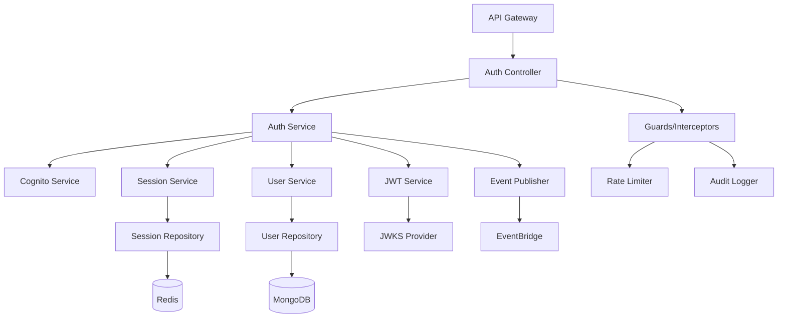

# Service Specification: Identity Service

## Service Overview

**Service Name**: Identity Service
**Port**: 3001
**Purpose**: Manages user identities, authentication, authorization, and session management
**Domain**: Identity & Access Management
**Team Ownership**: Platform Team

## 1. Functional Requirements

### 1.1 Core Features

#### Authentication
- User registration with email validation
- Login with email/password
- Multi-factor authentication (MFA) via TOTP/SMS
- Password reset flow with secure tokens
- Social login (future: Google, Microsoft)
- JWT token generation with JWKS verification
- Refresh token rotation
- Session management with Redis

#### Authorization
- Role-based access control (RBAC)
- Permission management
- Dynamic permission evaluation
- API key management for service accounts
- OAuth 2.0 / OIDC compliance

#### User Management
- User profile CRUD operations
- Profile picture upload (S3)
- Email/phone verification
- Account suspension/reactivation
- User search and filtering
- Bulk user import (CSV)
- Password policy enforcement

#### Security Features
- Brute force protection
- Account lockout after failed attempts
- Password complexity requirements
- Password history (prevent reuse)
- Session invalidation on password change
- Suspicious activity detection
- IP allowlisting (enterprise accounts)

### 1.2 API Endpoints

#### Authentication Endpoints
```yaml
POST /v1/auth/register
  Request:
    - email: string (required, email format)
    - password: string (required, min 12 chars)
    - firstName: string (required)
    - lastName: string (required)
    - companyCode: string (optional)
  Response:
    - userId: string
    - email: string
    - status: "pending_verification"
    - message: string

POST /v1/auth/login
  Request:
    - email: string (required)
    - password: string (required)
    - mfaCode: string (optional)
  Response:
    - accessToken: string (JWT)
    - refreshToken: string
    - expiresIn: number (seconds)
    - user: UserProfile

POST /v1/auth/logout
  Request:
    - refreshToken: string (required)
  Response:
    - success: boolean
    - message: string

POST /v1/auth/refresh
  Request:
    - refreshToken: string (required)
  Response:
    - accessToken: string
    - refreshToken: string (rotated)
    - expiresIn: number

POST /v1/auth/forgot-password
  Request:
    - email: string (required)
  Response:
    - success: boolean
    - message: string

POST /v1/auth/reset-password
  Request:
    - token: string (required)
    - newPassword: string (required)
  Response:
    - success: boolean
    - message: string

POST /v1/auth/verify-email
  Request:
    - token: string (required)
  Response:
    - success: boolean
    - user: UserProfile

GET /v1/auth/jwks
  Response:
    - keys: JWKS[]
```

#### User Management Endpoints
```yaml
GET /v1/users/me
  Response:
    - user: UserProfile

GET /v1/users/:userId
  Response:
    - user: UserProfile

PUT /v1/users/:userId
  Request:
    - firstName: string (optional)
    - lastName: string (optional)
    - phone: string (optional)
    - timezone: string (optional)
    - locale: string (optional)
  Response:
    - user: UserProfile

DELETE /v1/users/:userId
  Response:
    - success: boolean
    - message: string

POST /v1/users/:userId/change-password
  Request:
    - currentPassword: string (required)
    - newPassword: string (required)
  Response:
    - success: boolean
    - message: string

POST /v1/users/:userId/mfa/enable
  Request:
    - method: "totp" | "sms"
  Response:
    - secret: string (for TOTP)
    - qrCode: string (base64)
    - backupCodes: string[]

POST /v1/users/:userId/mfa/verify
  Request:
    - code: string (required)
  Response:
    - success: boolean
    - backupCodes: string[]

GET /v1/users
  Query:
    - search: string
    - status: "active" | "suspended" | "deleted"
    - page: number
    - limit: number
  Response:
    - users: UserProfile[]
    - total: number
    - page: number
```

#### Role & Permission Endpoints
```yaml
GET /v1/roles
  Response:
    - roles: Role[]

GET /v1/roles/:roleId
  Response:
    - role: Role
    - permissions: Permission[]

POST /v1/roles
  Request:
    - name: string (required)
    - description: string
    - permissions: string[] (permission IDs)
  Response:
    - role: Role

PUT /v1/roles/:roleId
  Request:
    - name: string
    - description: string
    - permissions: string[]
  Response:
    - role: Role

DELETE /v1/roles/:roleId
  Response:
    - success: boolean

POST /v1/users/:userId/roles
  Request:
    - roleId: string (required)
  Response:
    - success: boolean

GET /v1/permissions
  Response:
    - permissions: Permission[]

GET /v1/users/:userId/effective-permissions
  Response:
    - permissions: Permission[]
    - roles: Role[]
```

#### Session Management Endpoints
```yaml
GET /v1/sessions
  Response:
    - sessions: Session[]

DELETE /v1/sessions/:sessionId
  Response:
    - success: boolean

POST /v1/sessions/invalidate-all
  Response:
    - invalidated: number
```

### 1.3 Business Rules

#### Registration Rules
1. Email must be unique across active users
2. Email domain validation for enterprise accounts
3. Password must meet complexity requirements:
   - Minimum 12 characters
   - At least 1 uppercase, 1 lowercase, 1 number, 1 special character
   - Not in common password dictionary
   - Not similar to email/name
4. Account verification required within 72 hours
5. Invitation codes required for closed beta

#### Authentication Rules
1. Account locked after 5 failed login attempts (15 min)
2. MFA required for admin roles
3. Session timeout after 8 hours of inactivity
4. Concurrent session limit: 3 per user
5. Refresh tokens expire after 30 days
6. Password reset tokens expire after 1 hour

#### Authorization Rules
1. System roles cannot be modified or deleted
2. At least one admin must exist in the system
3. Users cannot modify their own admin privileges
4. Service accounts have non-expiring tokens
5. API rate limits: 100 req/min per user

### 1.4 Error Handling

```yaml
Error Responses:
  400 Bad Request:
    - INVALID_EMAIL_FORMAT
    - PASSWORD_TOO_WEAK
    - MISSING_REQUIRED_FIELD

  401 Unauthorized:
    - INVALID_CREDENTIALS
    - TOKEN_EXPIRED
    - MFA_REQUIRED
    - SESSION_EXPIRED

  403 Forbidden:
    - ACCOUNT_LOCKED
    - EMAIL_NOT_VERIFIED
    - INSUFFICIENT_PERMISSIONS

  404 Not Found:
    - USER_NOT_FOUND
    - ROLE_NOT_FOUND

  409 Conflict:
    - EMAIL_ALREADY_EXISTS
    - ROLE_NAME_DUPLICATE

  429 Too Many Requests:
    - RATE_LIMIT_EXCEEDED
    - LOGIN_ATTEMPTS_EXCEEDED
```

## 2. Data Model

### 2.1 MongoDB Collections

#### users Collection
```javascript
{
  _id: ObjectId,
  email: String (unique, indexed),
  emailVerified: Boolean,
  emailVerificationToken: String,
  emailVerificationExpiry: Date,

  profile: {
    firstName: String,
    lastName: String,
    displayName: String,
    phone: String,
    phoneVerified: Boolean,
    profilePicture: String (S3 URL),
    timezone: String (default: "UTC"),
    locale: String (default: "en-US"),
    department: String,
    jobTitle: String
  },

  auth: {
    cognitoUserId: String (indexed),
    passwordHash: String,
    passwordHistory: [String], // Last 5 hashes
    lastPasswordChange: Date,

    mfa: {
      enabled: Boolean,
      method: String ("totp" | "sms"),
      secret: String (encrypted),
      backupCodes: [String] (encrypted),
      phoneNumber: String
    },

    loginAttempts: Number,
    lockoutUntil: Date,
    lastLogin: Date,
    lastLoginIp: String
  },

  roles: [ObjectId], // References to roles collection

  status: String ("active" | "suspended" | "deleted"),
  suspensionReason: String,

  metadata: {
    createdAt: Date (indexed),
    createdBy: ObjectId,
    updatedAt: Date,
    updatedBy: ObjectId,
    deletedAt: Date,
    source: String ("registration" | "import" | "sso")
  },

  preferences: {
    notifications: {
      email: Boolean,
      sms: Boolean,
      inApp: Boolean
    },
    privacy: {
      profileVisibility: String ("public" | "company" | "private")
    }
  }
}

// Indexes
- email: unique
- auth.cognitoUserId: unique
- metadata.createdAt: -1
- status: 1
```

#### roles Collection
```javascript
{
  _id: ObjectId,
  name: String (unique, indexed),
  displayName: String,
  description: String,

  permissions: [{
    resource: String, // e.g., "projects", "users", "reports"
    actions: [String], // e.g., ["read", "create", "update", "delete"]
    constraints: {
      scope: String, // e.g., "own", "company", "all"
      conditions: Object // Additional constraints
    }
  }],

  isSystem: Boolean, // Cannot be modified/deleted
  priority: Number, // For permission conflict resolution

  metadata: {
    createdAt: Date,
    createdBy: ObjectId,
    updatedAt: Date,
    updatedBy: ObjectId
  }
}

// Indexes
- name: unique
- isSystem: 1
```

#### sessions Collection (Redis)
```javascript
{
  sessionId: String (UUID),
  userId: String,
  tokenFamily: String (UUID),

  device: {
    userAgent: String,
    ip: String,
    fingerprint: String
  },

  auth: {
    accessToken: String,
    refreshToken: String,
    issuedAt: Number (timestamp),
    expiresAt: Number (timestamp)
  },

  activity: {
    lastActivity: Number (timestamp),
    requestCount: Number
  }
}

// TTL: 8 hours for inactive sessions
```

#### api_keys Collection
```javascript
{
  _id: ObjectId,
  keyId: String (unique, indexed),
  keyHash: String, // SHA-256 hash of actual key
  keyPrefix: String, // First 8 chars for identification

  name: String,
  description: String,

  owner: {
    type: String ("user" | "service"),
    id: ObjectId
  },

  permissions: [{
    resource: String,
    actions: [String]
  }],

  usage: {
    lastUsed: Date,
    requestCount: Number,
    rateLimit: Number // Requests per minute
  },

  expiry: Date,
  status: String ("active" | "revoked"),

  metadata: {
    createdAt: Date,
    createdBy: ObjectId,
    revokedAt: Date,
    revokedBy: ObjectId,
    revokeReason: String
  }
}

// Indexes
- keyId: unique
- keyPrefix: 1
- owner.id: 1
- status: 1
- expiry: 1
```

#### audit_auth Collection
```javascript
{
  _id: ObjectId,
  timestamp: Date (indexed),

  event: {
    type: String, // "login", "logout", "password_change", etc.
    success: Boolean,
    reason: String // For failures
  },

  user: {
    id: ObjectId,
    email: String,
    ip: String,
    userAgent: String
  },

  session: {
    id: String,
    tokenFamily: String
  },

  metadata: Object // Event-specific data
}

// Indexes
- timestamp: -1
- user.id: 1
- event.type: 1

// TTL: 90 days
```

### 2.2 Redis Data Structures

#### Password Reset Tokens
```
Key: password_reset:{token}
Value: {
  userId: string,
  email: string,
  createdAt: timestamp,
  ip: string
}
TTL: 1 hour
```

#### Email Verification Tokens
```
Key: email_verify:{token}
Value: {
  userId: string,
  email: string,
  createdAt: timestamp
}
TTL: 72 hours
```

#### Rate Limiting
```
Key: rate_limit:{userId}:{endpoint}
Value: request_count
TTL: 1 minute

Key: login_attempts:{email}
Value: attempt_count
TTL: 15 minutes
```

#### Session Cache
```
Key: session:{sessionId}
Value: Session object (full)
TTL: 8 hours (sliding window)
```

## 3. Non-Functional Requirements

### 3.1 Performance
- **Login response time**: < 500ms (p95)
- **Token validation**: < 50ms (p95)
- **User search**: < 200ms for 10K users
- **Concurrent sessions**: 10K active sessions
- **JWT signing**: 1000 ops/sec
- **Bulk import**: 1000 users/minute

### 3.2 Scalability
- **Horizontal scaling**: Stateless service, scale to N instances
- **Database**: MongoDB replica set with 1 primary, 2 secondaries
- **Cache**: Redis cluster with 3 nodes
- **Session storage**: 100K concurrent sessions
- **User capacity**: 100K total users

### 3.3 Availability
- **Uptime SLA**: 99.9% (43 min/month downtime)
- **RTO**: 1 hour
- **RPO**: 5 minutes
- **Graceful degradation**: Cache failures don't block authentication
- **Circuit breakers**: For Cognito, Redis connections

### 3.4 Security
- **Encryption at rest**: AES-256 for sensitive fields
- **Encryption in transit**: TLS 1.3
- **Secret management**: AWS Secrets Manager
- **Token signing**: RS256 with rotating keys
- **OWASP compliance**: Top 10 protections
- **PCI compliance**: No credit card data stored
- **GDPR compliance**: Right to erasure, data portability

### 3.5 Observability
- **Metrics**:
  - Login success/failure rates
  - Token validation latency
  - MFA adoption rate
  - Password reset requests
  - Active sessions count
  - API endpoint latencies

- **Logs**:
  - Authentication events (success/failure)
  - Authorization decisions
  - Password changes
  - Role modifications
  - Suspicious activities

- **Alerts**:
  - Failed login spike (> 100/min)
  - Cognito service degradation
  - Redis connection failures
  - JWT signing failures
  - Unusual geographic access

### 3.6 Compliance & Audit
- **Audit logging**: All authentication events
- **Data retention**: 90 days for auth logs
- **PII handling**: Masked in logs
- **Password storage**: bcrypt with cost factor 12
- **Token rotation**: Refresh tokens rotate on use
- **Session management**: Explicit logout required

## 4. Module Architecture

### 4.1 Internal Structure
```
identity-service/
├── src/
│   ├── main.ts                 # Service bootstrap
│   ├── app.module.ts           # Root module
│   │
│   ├── auth/                   # Authentication module
│   │   ├── auth.module.ts
│   │   ├── auth.controller.ts
│   │   ├── auth.service.ts
│   │   ├── strategies/
│   │   │   ├── jwt.strategy.ts
│   │   │   ├── local.strategy.ts
│   │   │   └── api-key.strategy.ts
│   │   ├── guards/
│   │   │   ├── jwt.guard.ts
│   │   │   ├── roles.guard.ts
│   │   │   └── mfa.guard.ts
│   │   └── dto/
│   │       ├── login.dto.ts
│   │       ├── register.dto.ts
│   │       └── token.dto.ts
│   │
│   ├── users/                  # User management module
│   │   ├── users.module.ts
│   │   ├── users.controller.ts
│   │   ├── users.service.ts
│   │   ├── users.repository.ts
│   │   ├── entities/
│   │   │   └── user.entity.ts
│   │   └── dto/
│   │       ├── create-user.dto.ts
│   │       └── update-user.dto.ts
│   │
│   ├── roles/                  # RBAC module
│   │   ├── roles.module.ts
│   │   ├── roles.controller.ts
│   │   ├── roles.service.ts
│   │   ├── permissions.service.ts
│   │   └── entities/
│   │       ├── role.entity.ts
│   │       └── permission.entity.ts
│   │
│   ├── sessions/               # Session management
│   │   ├── sessions.module.ts
│   │   ├── sessions.service.ts
│   │   └── session.repository.ts
│   │
│   ├── cognito/                # AWS Cognito integration
│   │   ├── cognito.module.ts
│   │   ├── cognito.service.ts
│   │   └── cognito.config.ts
│   │
│   ├── notifications/          # Internal notification module
│   │   ├── notifications.module.ts
│   │   ├── email.service.ts
│   │   └── templates/
│   │       ├── welcome.hbs
│   │       ├── password-reset.hbs
│   │       └── mfa-code.hbs
│   │
│   ├── common/                 # Shared utilities
│   │   ├── decorators/
│   │   │   ├── current-user.decorator.ts
│   │   │   └── permissions.decorator.ts
│   │   ├── filters/
│   │   │   └── auth-exception.filter.ts
│   │   ├── interceptors/
│   │   │   ├── audit.interceptor.ts
│   │   │   └── rate-limit.interceptor.ts
│   │   └── utils/
│   │       ├── password.util.ts
│   │       ├── token.util.ts
│   │       └── crypto.util.ts
│   │
│   ├── events/                 # Event publishing
│   │   ├── events.module.ts
│   │   ├── event-publisher.service.ts
│   │   └── schemas/
│   │       ├── user-registered.schema.ts
│   │       ├── user-authenticated.schema.ts
│   │       └── role-assigned.schema.ts
│   │
│   └── config/                 # Configuration
│       ├── configuration.ts
│       ├── database.config.ts
│       ├── redis.config.ts
│       └── jwt.config.ts
│
├── test/                       # Tests
│   ├── unit/
│   ├── integration/
│   └── e2e/
│
├── .env.example
├── Dockerfile
├── package.json
└── tsconfig.json
```

### 4.2 Dependencies

```json
{
  "dependencies": {
    "@nestjs/common": "^10.0.0",
    "@nestjs/core": "^10.0.0",
    "@nestjs/jwt": "^10.0.0",
    "@nestjs/passport": "^10.0.0",
    "@nestjs/mongoose": "^10.0.0",
    "@nestjs/config": "^3.0.0",
    "@nestjs/swagger": "^7.0.0",
    "@aws-sdk/client-cognito-identity-provider": "^3.0.0",
    "@aws-sdk/client-eventbridge": "^3.0.0",
    "@aws-sdk/client-secrets-manager": "^3.0.0",
    "mongoose": "^8.0.0",
    "ioredis": "^5.0.0",
    "passport": "^0.6.0",
    "passport-jwt": "^4.0.0",
    "passport-local": "^1.0.0",
    "bcrypt": "^5.0.0",
    "class-validator": "^0.14.0",
    "class-transformer": "^0.5.0",
    "jsonwebtoken": "^9.0.0",
    "jwks-rsa": "^3.0.0",
    "otplib": "^12.0.0",
    "qrcode": "^1.5.0",
    "handlebars": "^4.7.0",
    "rate-limiter-flexible": "^2.4.0",
    "helmet": "^7.0.0"
  }
}
```

### 4.3 Module Interaction



## 5. Event Contracts

### 5.1 Published Events

#### UserRegistered
```json
{
  "eventType": "identity.user.created.v1",
  "version": "v1",
  "payload": {
    "userId": "string",
    "email": "string",
    "firstName": "string",
    "lastName": "string",
    "source": "registration|import|sso",
    "timestamp": "ISO8601"
  }
}
```

#### UserAuthenticated
```json
{
  "eventType": "identity.user.authenticated.v1",
  "version": "v1",
  "payload": {
    "userId": "string",
    "sessionId": "string",
    "method": "password|mfa|sso",
    "ip": "string",
    "timestamp": "ISO8601"
  }
}
```

#### UserProfileUpdated
```json
{
  "eventType": "identity.user.updated.v1",
  "version": "v1",
  "payload": {
    "userId": "string",
    "changes": {
      "field": "before|after"
    },
    "updatedBy": "string",
    "timestamp": "ISO8601"
  }
}
```

#### RoleAssigned
```json
{
  "eventType": "identity.user.role-assigned.v1",
  "version": "v1",
  "payload": {
    "userId": "string",
    "roleId": "string",
    "roleName": "string",
    "assignedBy": "string",
    "timestamp": "ISO8601"
  }
}
```

#### UserDeleted
```json
{
  "eventType": "identity.user.deleted.v1",
  "version": "v1",
  "payload": {
    "userId": "string",
    "email": "string",
    "deletedBy": "string",
    "reason": "string",
    "timestamp": "ISO8601"
  }
}
```

### 5.2 Consumed Events
This service does not consume events from other services (it's the source of identity truth).

## 6. Integration Points

### 6.1 AWS Cognito
- User pool management
- MFA configuration
- Password policies
- Social identity providers

### 6.2 AWS Secrets Manager
- JWT signing keys
- Database credentials
- API keys

### 6.3 AWS EventBridge
- Publish user lifecycle events
- Audit event streaming

### 6.4 Brevo (Email Service)
- Welcome emails
- Password reset emails
- MFA codes
- Account notifications

### 6.5 Redis
- Session storage
- Token blacklisting
- Rate limiting counters
- Cache layer

## 7. Testing Requirements

### 7.1 Unit Tests (80% coverage)
- Password hashing/validation
- JWT token generation/validation
- Permission evaluation logic
- Rate limiting logic

### 7.2 Integration Tests
- Authentication flows
- Cognito integration
- Redis session management
- MongoDB operations

### 7.3 E2E Tests
- Complete registration flow
- Login with MFA
- Password reset flow
- Session expiration

### 7.4 Performance Tests
- Load testing: 1000 concurrent logins
- Token validation throughput
- Session lookup performance

### 7.5 Security Tests
- Penetration testing
- OWASP Top 10 validation
- JWT security validation
- Brute force protection

## 8. Deployment Configuration

### 8.1 Environment Variables
```yaml
NODE_ENV: production
PORT: 3001

# MongoDB
MONGODB_URI: mongodb://...
MONGODB_DB_NAME: clenergize_identity

# Redis
REDIS_HOST: redis-cluster.aws.com
REDIS_PORT: 6379
REDIS_PASSWORD: encrypted

# JWT
JWT_PUBLIC_KEY: RS256 public key
JWT_PRIVATE_KEY: RS256 private key (from Secrets Manager)
JWT_EXPIRY: 3600
REFRESH_TOKEN_EXPIRY: 2592000

# AWS
AWS_REGION: us-east-1
AWS_COGNITO_USER_POOL_ID: us-east-1_xxx
AWS_COGNITO_CLIENT_ID: xxx
AWS_EVENTBRIDGE_BUS: clenergize-events

# Email
BREVO_API_KEY: encrypted
FROM_EMAIL: noreply@clenergize.com

# Security
BCRYPT_ROUNDS: 12
RATE_LIMIT_WINDOW: 60000
RATE_LIMIT_MAX: 100
```

### 8.2 Resource Requirements
- **CPU**: 0.5 vCPU baseline, 2 vCPU burst
- **Memory**: 1 GB
- **Storage**: 10 GB for logs
- **Instances**: Min 2, Max 5 (auto-scaling)

### 8.3 Health Checks
```yaml
Liveness: GET /health/live
  - MongoDB connection
  - Redis connection

Readiness: GET /health/ready
  - Cognito reachable
  - EventBridge accessible
  - Cache warmed up
```

## 9. Migration Considerations

### From Current System
1. Migrate existing users with password reset required
2. Map current roles to new RBAC model
3. Preserve user IDs for data consistency
4. Import active sessions
5. Maintain backward compatible JWT claims (temporary)

### Data Migration Steps
1. Export users from current MongoDB
2. Transform to new schema
3. Import to new Identity Service DB
4. Validate user counts and data integrity
5. Test authentication with subset
6. Gradual traffic migration

## 10. Future Enhancements

### Phase 2 (Months 4-6)
- Social login providers (Google, Microsoft)
- Advanced MFA methods (WebAuthn, FIDO2)
- Single Sign-On (SAML 2.0)
- Password-less authentication

### Phase 3 (Months 7-9)
- User behavior analytics
- Adaptive authentication (risk-based)
- Delegation and impersonation
- Advanced audit reporting

### Phase 4 (Months 10-12)
- Identity federation
- B2B customer identity management
- Compliance reporting (SOC2)
- Advanced threat detection