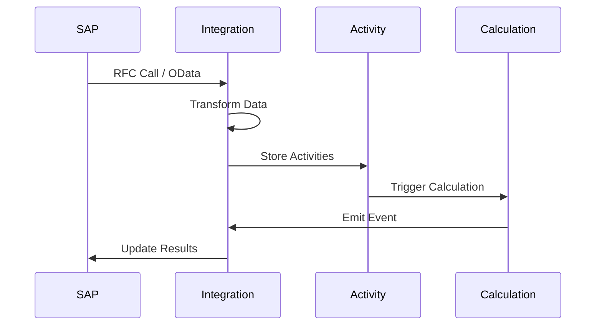

# Service Specification: Integration Service

> **Service Name**: Integration Service
> **Port**: 3010
> **Purpose**: External system integrations, ETL pipelines, webhook management
> **Domain**: Integration & Connectivity
> **Status**: PHASE 1 ADDITION - CRITICAL
> **Owner**: Integration Agent

---

## 1. Service Overview

The Integration Service is a **critical addition to Phase 1** that enables seamless data exchange with external systems, eliminating manual data entry bottlenecks and ensuring real-time data synchronization.

### Why Added to Phase 1

```yaml
Critical Requirements:
  - Manual data entry is a major bottleneck
  - Customers expect ERP integration from day 1
  - IoT sensors need real-time ingestion
  - Partner systems require webhook notifications
  - Bulk data imports are essential for migration

Business Impact:
  - 80% reduction in manual data entry
  - Real-time emission tracking via IoT
  - Automated supplier data collection
  - Seamless ERP synchronization
```

---

## 2. Functional Requirements

### 2.1 Core Features

#### ERP Integration
```yaml
Supported Systems:
  - SAP (S/4HANA, ECC)
  - Oracle (Cloud, NetSuite)
  - Microsoft Dynamics (365, AX)
  - Workday
  - Generic REST/SOAP APIs

Capabilities:
  - Bi-directional sync
  - Field mapping UI
  - Conflict resolution
  - Change detection
  - Scheduled sync
  - Real-time sync via webhooks
```

#### IoT Data Ingestion
```yaml
Protocols:
  - MQTT (primary)
  - OPC UA (industrial)
  - CoAP (constrained devices)
  - HTTP/WebSocket

Features:
  - Device registration
  - Data validation
  - Anomaly detection
  - Buffering & retry
  - Time-series storage
  - Real-time processing
```

#### ETL Pipelines
```yaml
Components:
  - Visual pipeline builder
  - 50+ transformations
  - Data quality checks
  - Error handling
  - Scheduling
  - Monitoring

Sources:
  - Databases (SQL, NoSQL)
  - Files (CSV, Excel, JSON, XML)
  - APIs (REST, GraphQL, SOAP)
  - Message queues (Kafka, SQS)
  - Cloud storage (S3, Azure Blob)
```

#### Webhook Management
```yaml
Capabilities:
  - Webhook registration
  - Event filtering
  - Retry logic
  - Dead letter queue
  - Signature verification
  - Rate limiting
  - Circuit breaker
```

---

## 3. API Specification

### 3.1 Integration Management

```typescript
// Create Integration
POST /api/v1/integrations
{
  "name": "SAP Production Data",
  "type": "sap",
  "connection": {
    "host": "sap.company.com",
    "client": "100",
    "username": "RFC_USER",
    "password": "encrypted_password"
  },
  "schedule": "0 */4 * * *", // Every 4 hours
  "mapping": {
    "source": "MARA",
    "target": "products",
    "fields": [
      {"source": "MATNR", "target": "productId"},
      {"source": "MAKTX", "target": "description"}
    ]
  }
}

// Test Connection
POST /api/v1/integrations/test-connection
{
  "type": "sap",
  "connection": { ... }
}

// Execute Sync
POST /api/v1/integrations/{id}/sync
{
  "mode": "incremental", // full | incremental
  "since": "2024-01-01T00:00:00Z"
}

// Get Integration Status
GET /api/v1/integrations/{id}/status
Response:
{
  "status": "active",
  "lastSync": "2024-01-15T10:30:00Z",
  "nextSync": "2024-01-15T14:30:00Z",
  "recordsSynced": 1547,
  "errors": 0
}
```

### 3.2 IoT Management

```typescript
// Register IoT Device
POST /api/v1/iot/devices
{
  "deviceId": "sensor-001",
  "type": "electricity-meter",
  "location": "Building A, Floor 2",
  "protocol": "mqtt",
  "topics": ["energy/consumption", "energy/quality"],
  "metadata": {
    "manufacturer": "Siemens",
    "model": "SENTRON PAC3200"
  }
}

// IoT Data Ingestion (MQTT)
// Topic: clenergize/{tenantId}/{deviceId}/telemetry
{
  "timestamp": "2024-01-15T10:30:00Z",
  "readings": {
    "voltage": 230.5,
    "current": 45.2,
    "power": 10396,
    "energy": 1547.3,
    "powerFactor": 0.98
  },
  "quality": {
    "thd": 2.3,
    "frequency": 50.01
  }
}

// Query IoT Data
GET /api/v1/iot/data?deviceId=sensor-001&from=2024-01-15&to=2024-01-16&interval=1h
```

### 3.3 ETL Pipeline

```typescript
// Create Pipeline
POST /api/v1/pipelines
{
  "name": "Daily Activity Import",
  "source": {
    "type": "s3",
    "bucket": "emissions-data",
    "pattern": "daily/*.csv"
  },
  "transformations": [
    {
      "type": "filter",
      "condition": "quantity > 0"
    },
    {
      "type": "map",
      "mapping": {
        "date": "DATE(timestamp)",
        "amount": "quantity * conversionFactor"
      }
    },
    {
      "type": "validate",
      "schema": "activity-data-v1"
    }
  ],
  "target": {
    "type": "mongodb",
    "collection": "activities"
  },
  "schedule": "0 2 * * *", // Daily at 2 AM
  "errorHandling": {
    "strategy": "skip_and_log",
    "deadLetterQueue": "failed-imports"
  }
}

// Execute Pipeline
POST /api/v1/pipelines/{id}/execute
{
  "mode": "manual",
  "parameters": {
    "date": "2024-01-15"
  }
}
```

### 3.4 Webhook Management

```typescript
// Register Webhook
POST /api/v1/webhooks
{
  "name": "Partner Notification",
  "url": "https://partner.com/api/webhooks",
  "events": ["calculation.completed", "report.generated"],
  "secret": "webhook_secret_key",
  "filters": {
    "scope": ["scope1", "scope2"],
    "organizationId": "org-123"
  },
  "retry": {
    "attempts": 3,
    "backoff": "exponential"
  }
}

// Webhook Payload (Outgoing)
POST https://partner.com/api/webhooks
Headers:
  X-Signature: HMAC-SHA256(payload, secret)
  X-Event-Type: calculation.completed
  X-Event-ID: evt_123
  X-Timestamp: 1705315800

Body:
{
  "event": "calculation.completed",
  "timestamp": "2024-01-15T10:30:00Z",
  "data": {
    "calculationId": "calc-456",
    "organizationId": "org-123",
    "results": { ... }
  }
}
```

---

## 4. Data Models

### Integration Configuration

```typescript
interface Integration {
  id: string;
  name: string;
  type: 'sap' | 'oracle' | 'dynamics' | 'rest' | 'graphql';
  status: 'active' | 'paused' | 'error';
  connection: ConnectionConfig;
  mapping: FieldMapping[];
  schedule?: string; // Cron expression
  lastSync?: Date;
  nextSync?: Date;
  metrics: {
    totalSyncs: number;
    recordsSynced: number;
    errors: number;
    avgDuration: number;
  };
}

interface IoTDevice {
  deviceId: string;
  type: 'electricity' | 'gas' | 'water' | 'temperature' | 'custom';
  protocol: 'mqtt' | 'opcua' | 'coap' | 'http';
  status: 'online' | 'offline' | 'error';
  location: {
    building: string;
    floor: string;
    coordinates?: [number, number];
  };
  lastSeen: Date;
  metadata: Record<string, any>;
}

interface Pipeline {
  id: string;
  name: string;
  source: DataSource;
  transformations: Transformation[];
  target: DataTarget;
  schedule?: string;
  status: 'active' | 'running' | 'failed' | 'paused';
  lastRun?: PipelineRun;
}

interface Webhook {
  id: string;
  url: string;
  events: string[];
  secret?: string;
  active: boolean;
  filters?: Record<string, any>;
  retry: RetryConfig;
  deliveries: WebhookDelivery[];
}
```

---

## 5. Integration Patterns

### 5.1 SAP Integration Flow



### 5.2 IoT Real-time Processing

```typescript
class IoTProcessor {
  async processReading(deviceId: string, data: IoTReading): Promise<void> {
    // 1. Validate data
    const validation = await this.validateReading(data);
    if (!validation.valid) {
      await this.handleInvalidData(deviceId, data, validation.errors);
      return;
    }

    // 2. Detect anomalies
    if (await this.isAnomalous(deviceId, data)) {
      await this.triggerAlert({
        type: 'anomaly',
        deviceId,
        reading: data,
        threshold: this.getThreshold(deviceId)
      });
    }

    // 3. Store in time-series DB
    await this.influxDB.writePoint({
      measurement: 'energy_consumption',
      tags: { deviceId, location: device.location },
      fields: data.readings,
      timestamp: data.timestamp
    });

    // 4. Aggregate for activity data
    if (this.shouldAggregate(data.timestamp)) {
      const aggregated = await this.aggregate(deviceId, 'hourly');
      await this.createActivity({
        source: 'iot',
        deviceId,
        ...aggregated
      });
    }

    // 5. Update device status
    await this.updateDeviceStatus(deviceId, 'online', data.timestamp);
  }
}
```

---

## 6. Error Handling & Resilience

### Circuit Breaker Pattern

```typescript
class IntegrationCircuitBreaker {
  private failures = 0;
  private lastFailure?: Date;
  private state: 'closed' | 'open' | 'half-open' = 'closed';

  async execute<T>(
    integration: Integration,
    operation: () => Promise<T>
  ): Promise<T> {
    if (this.state === 'open') {
      if (this.shouldAttemptReset()) {
        this.state = 'half-open';
      } else {
        throw new CircuitOpenError('Circuit breaker is open');
      }
    }

    try {
      const result = await operation();
      this.onSuccess();
      return result;
    } catch (error) {
      this.onFailure();
      throw error;
    }
  }

  private onSuccess(): void {
    this.failures = 0;
    this.state = 'closed';
  }

  private onFailure(): void {
    this.failures++;
    this.lastFailure = new Date();

    if (this.failures >= 5) {
      this.state = 'open';
      this.scheduleReset();
    }
  }
}
```

---

## 7. Performance Optimization

### Batch Processing

```typescript
class BatchProcessor {
  private batch: any[] = [];
  private timer?: NodeJS.Timeout;

  async add(record: any): Promise<void> {
    this.batch.push(record);

    if (this.batch.length >= 1000) {
      await this.flush();
    } else if (!this.timer) {
      this.timer = setTimeout(() => this.flush(), 5000);
    }
  }

  private async flush(): Promise<void> {
    if (this.batch.length === 0) return;

    const toProcess = [...this.batch];
    this.batch = [];

    if (this.timer) {
      clearTimeout(this.timer);
      this.timer = undefined;
    }

    await this.processBatch(toProcess);
  }

  private async processBatch(records: any[]): Promise<void> {
    // Bulk insert with MongoDB
    await this.collection.insertMany(records, {
      ordered: false,
      writeConcern: { w: 1 }
    });

    // Emit batch event
    await this.eventBus.emit('batch.processed', {
      count: records.length,
      timestamp: new Date()
    });
  }
}
```

---

## 8. Monitoring & Metrics

### Integration Metrics

```typescript
// Prometheus metrics
const integrationMetrics = {
  syncDuration: new Histogram({
    name: 'integration_sync_duration_seconds',
    help: 'Duration of integration sync',
    labelNames: ['integration_type', 'status']
  }),

  recordsSynced: new Counter({
    name: 'integration_records_synced_total',
    help: 'Total records synced',
    labelNames: ['integration_type', 'direction']
  }),

  iotMessages: new Counter({
    name: 'iot_messages_received_total',
    help: 'Total IoT messages received',
    labelNames: ['device_type', 'protocol']
  }),

  webhookDeliveries: new Counter({
    name: 'webhook_deliveries_total',
    help: 'Total webhook deliveries',
    labelNames: ['event_type', 'status']
  })
};
```

---

## 9. Security Considerations

### Authentication & Encryption

```yaml
API Authentication:
  - OAuth 2.0 for REST APIs
  - Basic Auth with SSL for legacy
  - API keys with rotation

Data Encryption:
  - TLS 1.3 for all connections
  - Credential encryption at rest
  - Field-level encryption for sensitive data

Access Control:
  - Service account permissions
  - IP whitelisting
  - Rate limiting per integration
```

---

## 10. Dependencies

### Internal Dependencies
```yaml
- Identity Service: Authentication & authorization
- Activity Service: Store imported activity data
- Notification Service: Alert on sync failures
- Audit Service: Log all integration activities
```

### External Dependencies
```yaml
- InfluxDB: IoT time-series data
- Redis: Message queuing and caching
- AWS S3: File storage for imports
- AWS Secrets Manager: Credential storage
```

---

## 11. Non-Functional Requirements

### Performance
```yaml
- Sync Rate: 5,000 records/minute minimum
- IoT Ingestion: 10,000 messages/second
- Webhook Delivery: <500ms p95
- Pipeline Processing: 1GB/minute
```

### Reliability
```yaml
- Availability: 99.9%
- Data Loss: Zero tolerance
- Duplicate Prevention: Idempotency keys
- Recovery: Automatic retry with backoff
```

### Scalability
```yaml
- Horizontal scaling for workers
- Partitioned message processing
- Connection pooling
- Batch optimization
```

---

## 12. Success Criteria

```yaml
Phase 1 Launch:
  ✅ 3 ERP systems integrated
  ✅ 100 IoT devices connected
  ✅ 10 webhook endpoints active
  ✅ 5 ETL pipelines running
  ✅ Zero data loss
  ✅ <1% sync failures
```

---

**Service Status**: READY FOR IMPLEMENTATION
**Priority**: CRITICAL FOR PHASE 1
**Estimated Effort**: 65 story points
**Sprint**: 2-3