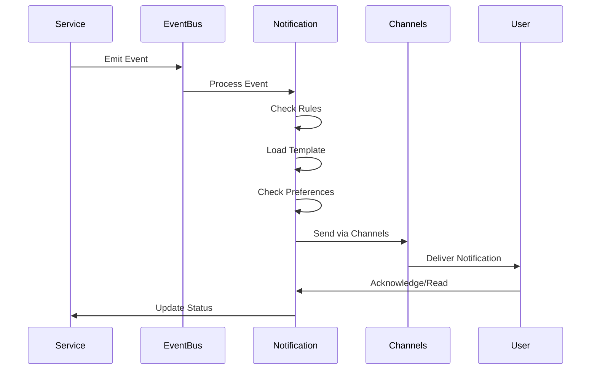

# Service Specification: Notification Service

> **Service Name**: Notification Service
> **Port**: 3008
> **Purpose**: Multi-channel notifications, alerts, and communication management
> **Domain**: Communication & Alerting
> **Status**: PHASE 1 ADDITION - CRITICAL
> **Owner**: Notification Agent

---

## 1. Service Overview

The Notification Service is a **critical addition to Phase 1** that provides real-time alerts, scheduled notifications, and multi-channel communication capabilities essential for user engagement and system monitoring.

### Why Added to Phase 1

```yaml
Critical Requirements:
  - Real-time alerts for calculation completions
  - Threshold breach notifications
  - System health alerts
  - Report delivery notifications
  - User onboarding communications
  - Compliance deadline reminders

Business Impact:
  - Immediate awareness of critical events
  - Improved user engagement
  - Reduced response time to issues
  - Automated compliance reminders
  - Better stakeholder communication
```

---

## 2. Functional Requirements

### 2.1 Core Features

#### Multi-Channel Delivery
```yaml
Channels:
  - Email (primary)
  - SMS (critical alerts)
  - In-app notifications
  - Push notifications (mobile)
  - Slack integration
  - Microsoft Teams
  - WebSocket (real-time)

Features:
  - Channel preference management
  - Fallback channel support
  - Delivery confirmation
  - Unsubscribe management
  - Template management
  - Localization support
```

#### Alert Management
```yaml
Alert Types:
  - Threshold breaches
  - Calculation completions
  - Data quality issues
  - System health alerts
  - Compliance deadlines
  - Report availability

Capabilities:
  - Alert rules engine
  - Severity levels
  - Escalation policies
  - Alert suppression
  - Alert grouping
  - Scheduled alerts
```

#### Template Engine
```yaml
Features:
  - Dynamic templates
  - Multi-language support
  - Brand customization
  - A/B testing
  - Version control
  - Preview capability

Template Types:
  - Transactional emails
  - Alert notifications
  - Reports
  - Digests
  - Onboarding sequences
```

---

## 3. API Specification

### 3.1 Notification Management

```typescript
// Send Notification
POST /api/v1/notifications/send
{
  "recipients": ["user@example.com"],
  "type": "calculation.completed",
  "priority": "high",
  "channels": ["email", "in-app"],
  "data": {
    "calculationId": "calc-123",
    "organizationName": "Acme Corp",
    "totalEmissions": 1234.56,
    "period": "Q1 2024"
  },
  "options": {
    "schedule": "2024-01-15T10:00:00Z",
    "expires": "2024-01-20T10:00:00Z",
    "trackOpens": true,
    "trackClicks": true
  }
}

// Create Alert Rule
POST /api/v1/alerts/rules
{
  "name": "High Emissions Alert",
  "condition": {
    "field": "emissions.total",
    "operator": ">",
    "value": 10000,
    "unit": "tCO2e"
  },
  "actions": [
    {
      "type": "notify",
      "channels": ["email", "slack"],
      "recipients": ["sustainability-team"],
      "template": "high-emissions-alert"
    }
  ],
  "schedule": "*/15 * * * *", // Check every 15 minutes
  "cooldown": 3600 // Don't re-alert for 1 hour
}

// Get Notification Status
GET /api/v1/notifications/{id}/status
Response:
{
  "id": "notif-123",
  "status": "delivered",
  "channels": {
    "email": {
      "status": "delivered",
      "deliveredAt": "2024-01-15T10:30:00Z",
      "opened": true,
      "openedAt": "2024-01-15T10:35:00Z"
    },
    "in-app": {
      "status": "read",
      "readAt": "2024-01-15T10:32:00Z"
    }
  }
}

// Manage Preferences
PUT /api/v1/users/{userId}/notification-preferences
{
  "channels": {
    "email": {
      "enabled": true,
      "frequency": "immediate",
      "types": ["alerts", "reports"]
    },
    "sms": {
      "enabled": true,
      "types": ["critical-alerts"]
    },
    "slack": {
      "enabled": true,
      "webhookUrl": "https://hooks.slack.com/...",
      "channel": "#sustainability"
    }
  },
  "quiet_hours": {
    "enabled": true,
    "start": "22:00",
    "end": "08:00",
    "timezone": "America/New_York"
  },
  "digest": {
    "enabled": true,
    "frequency": "weekly",
    "dayOfWeek": "monday",
    "time": "09:00"
  }
}
```

### 3.2 Template Management

```typescript
// Create Template
POST /api/v1/templates
{
  "name": "calculation-completed",
  "type": "email",
  "subject": "{{organizationName}} - Emission Calculation Complete",
  "body": {
    "html": "<h1>Calculation Complete</h1><p>Total: {{totalEmissions}} tCO2e</p>",
    "text": "Calculation Complete\nTotal: {{totalEmissions}} tCO2e"
  },
  "variables": [
    {
      "name": "organizationName",
      "type": "string",
      "required": true
    },
    {
      "name": "totalEmissions",
      "type": "number",
      "required": true,
      "format": "0,0.00"
    }
  ],
  "locales": {
    "es": {
      "subject": "{{organizationName}} - Cálculo de Emisiones Completo",
      "body": { ... }
    }
  }
}

// Preview Template
POST /api/v1/templates/{id}/preview
{
  "locale": "en",
  "data": {
    "organizationName": "Test Corp",
    "totalEmissions": 1234.56
  }
}
```

### 3.3 Real-time Notifications (WebSocket)

```typescript
// WebSocket Connection
ws://api.clenergize.com/ws/notifications

// Subscribe to notifications
{
  "action": "subscribe",
  "channels": ["user-123", "org-456"],
  "token": "jwt_token"
}

// Receive notification
{
  "type": "notification",
  "data": {
    "id": "notif-789",
    "type": "alert",
    "priority": "high",
    "title": "Threshold Exceeded",
    "message": "Emissions exceeded monthly target by 15%",
    "timestamp": "2024-01-15T10:30:00Z",
    "actions": [
      {
        "label": "View Details",
        "url": "/reports/emissions/2024-01"
      }
    ]
  }
}
```

---

## 4. Data Models

```typescript
interface Notification {
  id: string;
  type: string;
  recipients: Recipient[];
  channels: Channel[];
  priority: 'low' | 'medium' | 'high' | 'critical';
  status: 'pending' | 'sending' | 'delivered' | 'failed';
  data: Record<string, any>;
  metadata: {
    createdAt: Date;
    scheduledFor?: Date;
    expiresAt?: Date;
    retryCount: number;
  };
  deliveryStatus: DeliveryStatus[];
}

interface AlertRule {
  id: string;
  name: string;
  enabled: boolean;
  condition: AlertCondition;
  actions: AlertAction[];
  schedule?: string; // Cron expression
  cooldown?: number; // Seconds
  lastTriggered?: Date;
  triggerCount: number;
}

interface Template {
  id: string;
  name: string;
  type: 'email' | 'sms' | 'push' | 'in-app';
  subject?: string;
  body: {
    html?: string;
    text: string;
  };
  variables: TemplateVariable[];
  locales: Record<string, LocalizedTemplate>;
  version: number;
  active: boolean;
}

interface NotificationPreferences {
  userId: string;
  channels: {
    email?: ChannelPreference;
    sms?: ChannelPreference;
    push?: ChannelPreference;
    slack?: SlackPreference;
    teams?: TeamsPreference;
  };
  quietHours?: QuietHours;
  digest?: DigestPreference;
}
```

---

## 5. Notification Flows

### 5.1 Event-Driven Notifications



### 5.2 Alert Processing

```typescript
class AlertProcessor {
  async processAlert(rule: AlertRule, data: any): Promise<void> {
    // 1. Evaluate condition
    if (!this.evaluateCondition(rule.condition, data)) {
      return;
    }

    // 2. Check cooldown
    if (this.isInCooldown(rule)) {
      this.logger.info(`Alert ${rule.id} in cooldown period`);
      return;
    }

    // 3. Check quiet hours
    const recipients = await this.getRecipients(rule);
    const activeRecipients = await this.filterQuietHours(recipients);

    // 4. Execute actions
    for (const action of rule.actions) {
      await this.executeAction(action, activeRecipients, data);
    }

    // 5. Update rule state
    await this.updateRuleState(rule, {
      lastTriggered: new Date(),
      triggerCount: rule.triggerCount + 1
    });

    // 6. Log alert
    await this.auditService.logAlert({
      ruleId: rule.id,
      triggeredAt: new Date(),
      recipients: activeRecipients,
      data
    });
  }

  private async executeAction(
    action: AlertAction,
    recipients: Recipient[],
    data: any
  ): Promise<void> {
    switch (action.type) {
      case 'notify':
        await this.sendNotification({
          recipients,
          channels: action.channels,
          template: action.template,
          data,
          priority: 'high'
        });
        break;

      case 'escalate':
        await this.escalate(action.escalationPolicy, data);
        break;

      case 'webhook':
        await this.callWebhook(action.webhookUrl, data);
        break;
    }
  }
}
```

---

## 6. Channel Implementations

### 6.1 Email Channel

```typescript
class EmailChannel implements NotificationChannel {
  async send(notification: Notification): Promise<DeliveryResult> {
    const template = await this.loadTemplate(notification.type);
    const rendered = await this.renderTemplate(template, notification.data);

    const emailData = {
      from: 'noreply@clenergize.com',
      to: notification.recipients.map(r => r.email),
      subject: rendered.subject,
      html: rendered.html,
      text: rendered.text,
      headers: {
        'X-Notification-ID': notification.id,
        'X-Priority': notification.priority
      }
    };

    try {
      const result = await this.sesClient.sendEmail(emailData);

      return {
        channel: 'email',
        status: 'delivered',
        messageId: result.MessageId,
        deliveredAt: new Date()
      };
    } catch (error) {
      return {
        channel: 'email',
        status: 'failed',
        error: error.message
      };
    }
  }
}
```

### 6.2 Real-time Channel

```typescript
class WebSocketChannel implements NotificationChannel {
  private connections = new Map<string, WebSocket>();

  async send(notification: Notification): Promise<DeliveryResult> {
    const delivered: string[] = [];
    const failed: string[] = [];

    for (const recipient of notification.recipients) {
      const connection = this.connections.get(recipient.id);

      if (connection?.readyState === WebSocket.OPEN) {
        try {
          connection.send(JSON.stringify({
            type: 'notification',
            data: notification
          }));
          delivered.push(recipient.id);
        } catch (error) {
          failed.push(recipient.id);
        }
      } else {
        // Queue for later delivery
        await this.queueForDelivery(recipient.id, notification);
      }
    }

    return {
      channel: 'websocket',
      status: failed.length === 0 ? 'delivered' : 'partial',
      delivered,
      failed
    };
  }
}
```

---

## 7. Advanced Features

### 7.1 Digest Notifications

```typescript
class DigestProcessor {
  async generateDigest(userId: string, period: 'daily' | 'weekly'): Promise<void> {
    const activities = await this.getActivities(userId, period);

    if (activities.length === 0) {
      return; // Skip empty digests
    }

    const digest = {
      period,
      summary: {
        totalEmissions: this.calculateTotal(activities),
        comparisonToPrevious: this.calculateComparison(activities),
        topCategories: this.getTopCategories(activities)
      },
      alerts: await this.getAlerts(userId, period),
      reports: await this.getReports(userId, period),
      recommendations: await this.getRecommendations(activities)
    };

    await this.sendNotification({
      recipients: [userId],
      type: 'digest',
      template: `${period}-digest`,
      data: digest
    });
  }
}
```

### 7.2 Smart Notification Batching

```typescript
class NotificationBatcher {
  private batches = new Map<string, Notification[]>();
  private timers = new Map<string, NodeJS.Timeout>();

  async add(notification: Notification): Promise<void> {
    const key = this.getBatchKey(notification);

    if (!this.batches.has(key)) {
      this.batches.set(key, []);
    }

    this.batches.get(key)!.push(notification);

    // Set timer for batch processing
    if (!this.timers.has(key)) {
      const timer = setTimeout(() => {
        this.processBatch(key);
      }, 5000); // 5 second window

      this.timers.set(key, timer);
    }

    // Process immediately if batch is large
    if (this.batches.get(key)!.length >= 10) {
      this.processBatch(key);
    }
  }

  private async processBatch(key: string): Promise<void> {
    const batch = this.batches.get(key) || [];
    if (batch.length === 0) return;

    // Clear batch
    this.batches.delete(key);
    const timer = this.timers.get(key);
    if (timer) {
      clearTimeout(timer);
      this.timers.delete(key);
    }

    // Send batched notification
    await this.sendBatchedNotification(batch);
  }
}
```

---

## 8. Performance & Reliability

### Queue Management

```typescript
class NotificationQueue {
  private queues = {
    critical: new PriorityQueue(1),
    high: new PriorityQueue(2),
    medium: new PriorityQueue(3),
    low: new PriorityQueue(4)
  };

  async enqueue(notification: Notification): Promise<void> {
    const queue = this.queues[notification.priority];

    await queue.add({
      data: notification,
      attempts: 0,
      nextRetry: new Date()
    });

    // Process queues
    this.processQueues();
  }

  private async processQueues(): Promise<void> {
    // Process in priority order
    for (const [priority, queue] of Object.entries(this.queues)) {
      const workers = this.getWorkerCount(priority);

      for (let i = 0; i < workers; i++) {
        this.processQueue(queue);
      }
    }
  }

  private getWorkerCount(priority: string): number {
    return {
      critical: 10,
      high: 5,
      medium: 3,
      low: 1
    }[priority] || 1;
  }
}
```

---

## 9. Monitoring & Analytics

```typescript
// Prometheus metrics
const notificationMetrics = {
  sent: new Counter({
    name: 'notifications_sent_total',
    help: 'Total notifications sent',
    labelNames: ['type', 'channel', 'priority']
  }),

  deliveryTime: new Histogram({
    name: 'notification_delivery_duration_seconds',
    help: 'Time to deliver notification',
    labelNames: ['channel', 'priority'],
    buckets: [0.1, 0.5, 1, 2, 5, 10, 30]
  }),

  failures: new Counter({
    name: 'notification_failures_total',
    help: 'Total notification failures',
    labelNames: ['type', 'channel', 'reason']
  }),

  queueSize: new Gauge({
    name: 'notification_queue_size',
    help: 'Current queue size',
    labelNames: ['priority']
  })
};
```

---

## 10. Dependencies

### Internal Dependencies
```yaml
- Identity Service: User information and preferences
- Audit Service: Notification delivery logs
- Template Service: Template rendering (if separate)
```

### External Dependencies
```yaml
- AWS SES: Email delivery
- Twilio: SMS delivery
- Firebase: Push notifications
- Slack API: Slack integration
- Microsoft Graph: Teams integration
- Redis: Queue management
```

---

## 11. Non-Functional Requirements

### Performance
```yaml
- Delivery Time: <500ms for real-time channels
- Email Delivery: <2s
- Queue Processing: 10,000 notifications/minute
- Template Rendering: <100ms
```

### Reliability
```yaml
- Delivery Rate: >99.9%
- Retry Logic: Exponential backoff
- Dead Letter Queue: For failed notifications
- Idempotency: Prevent duplicate sends
```

### Scalability
```yaml
- Horizontal scaling for workers
- Priority queue processing
- Batch processing for efficiency
- Channel-specific scaling
```

---

## 12. Success Criteria

```yaml
Phase 1 Launch:
  ✅ All notification types implemented
  ✅ 5 channels active (email, SMS, in-app, Slack, WebSocket)
  ✅ 20 templates created
  ✅ <500ms real-time delivery
  ✅ >99.9% delivery rate
  ✅ User preference management
  ✅ Alert rules engine operational
```

---

**Service Status**: READY FOR IMPLEMENTATION
**Priority**: CRITICAL FOR PHASE 1
**Estimated Effort**: 55 story points
**Sprint**: 2-3