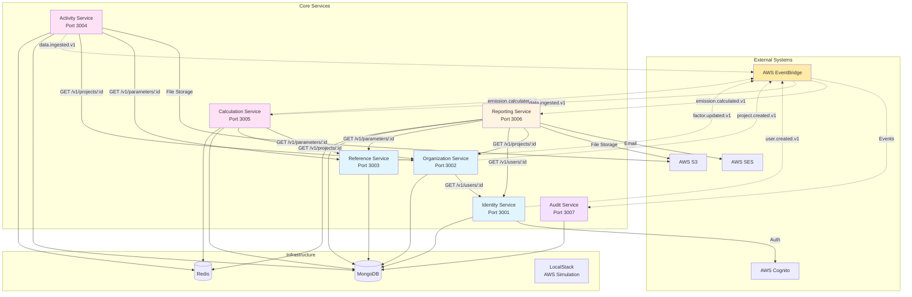
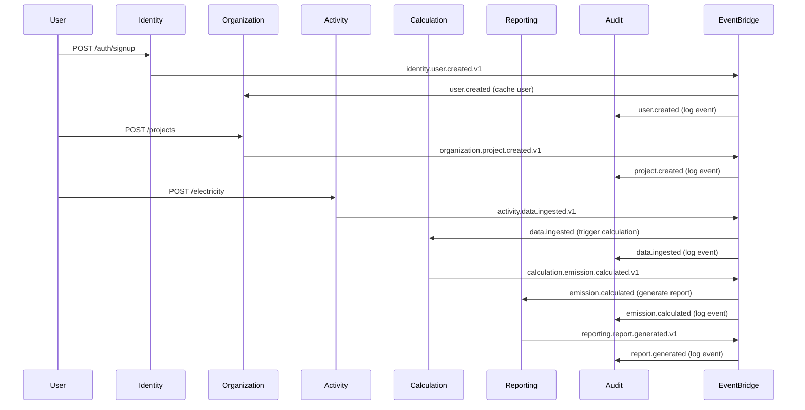

# Service Dependency Diagram

**Version**: 1.0.0
**Last Updated**: November 19, 2025
**Status**: ACTIVE
**Priority**: CRITICAL

---

## Executive Summary

This document provides a comprehensive view of all service dependencies in the Clenergize V3 architecture, including:
- **HTTP REST dependencies** (synchronous service-to-service calls)
- **Event-driven dependencies** (asynchronous EventBridge pub/sub)
- **Deployment order** (based on dependency graph)
- **Acyclic validation** (proof that no circular dependencies exist)

**Critical Finding**: ✅ **NO CIRCULAR DEPENDENCIES** - The architecture is acyclic and safe for deployment.

---

## Table of Contents

1. [Complete Dependency Graph](#complete-dependency-graph)
2. [Service-by-Service Dependencies](#service-by-service-dependencies)
3. [HTTP REST Dependencies](#http-rest-dependencies)
4. [Event-Driven Dependencies](#event-driven-dependencies)
5. [Deployment Order](#deployment-order)
6. [Acyclic Validation](#acyclic-validation)
7. [Circular Dependency Prevention](#circular-dependency-prevention)
8. [Service Health Check Dependencies](#service-health-check-dependencies)

---

## 1. Complete Dependency Graph

### 1.1 Unified Dependency Diagram



**Legend**:
- **Solid arrows** (→): HTTP REST calls (synchronous dependencies)
- **Dotted arrows** (-.->): EventBridge events (asynchronous dependencies)
- **Blue boxes**: Identity & Organization context
- **Pink boxes**: Activity & Calculation context
- **Yellow boxes**: Reporting context
- **Purple boxes**: Cross-cutting concerns (Audit)

---

## 2. Service-by-Service Dependencies

### 2.1 Identity Service (Port 3001)

**Depends On**:
- ✅ **NO SERVICE DEPENDENCIES** - Foundational service
- AWS Cognito (authentication)
- MongoDB (clenergize_identity database)

**Depended By**:
- Organization Service (user details)
- Reporting Service (user details for distribution)
- Audit Service (events)

**Events Published**:
- `identity.user.created.v1`
- `identity.user.updated.v1`
- `identity.user.deleted.v1`
- `identity.user.authenticated.v1`
- `identity.user.role-assigned.v1`

**Events Consumed**:
- None

**Deployment Priority**: **1** (Deploy First)

---

### 2.2 Reference Service (Port 3003)

**Depends On**:
- ✅ **NO SERVICE DEPENDENCIES** - Foundational service
- MongoDB (clenergize_reference database)

**Depended By**:
- Activity Service (emission factors, parameters)
- Calculation Service (emission factors, conversion factors)
- Reporting Service (parameter metadata)

**Events Published**:
- `reference.factor.created.v1`
- `reference.factor.updated.v1`
- `reference.parameter.created.v1`
- `reference.year.created.v1`

**Events Consumed**:
- None

**Deployment Priority**: **1** (Deploy First)

**Note**: Reference Service should be seeded with initial data BEFORE other services start.

---

### 2.3 Organization Service (Port 3002)

**Depends On**:
- **Identity Service** (HTTP REST):
  - `GET /v1/users/:id` - Validate user exists, get user details
  - `GET /v1/users/:id/roles` - Check user permissions
- MongoDB (clenergize_organization database)
- Redis (cache user details, TTL 5 minutes)

**Depended By**:
- Activity Service (project/entity validation)
- Calculation Service (project hierarchy)
- Reporting Service (project details)
- Audit Service (events)

**Events Published**:
- `organization.company.created.v1`
- `organization.project.created.v1`
- `organization.project.updated.v1`
- `organization.project.deleted.v1`
- `organization.hierarchy.updated.v1`
- `organization.user.assigned.v1`
- `organization.user.removed.v1`

**Events Consumed**:
- `identity.user.created.v1` (cache user details)
- `identity.user.deleted.v1` (remove user assignments)

**Deployment Priority**: **2** (After Identity)

---

### 2.4 Activity Service (Port 3004)

**Depends On**:
- **Reference Service** (HTTP REST + Cache):
  - `GET /v1/parameters/:id` - Validate parameters exist
  - `GET /v1/emission-factors/:parameterId/:yearId` - Get emission factors
  - `GET /v1/conversions/:fromUnit/:toUnit` - UOM conversion factors
  - Cache TTL: 1 hour (emission factors change infrequently)

- **Organization Service** (HTTP REST + Cache):
  - `GET /v1/projects/:id` - Validate project exists
  - `GET /v1/entities/:id` - Validate entity exists
  - `GET /v1/subsidiaries/:id` - Validate subsidiary exists
  - `GET /v1/locations/:id` - Validate location exists
  - Cache TTL: 5 minutes (hierarchy changes occasionally)

- AWS S3 (evidence file storage)
- MongoDB (clenergize_activity database)
- Redis (caching)

**Depended By**:
- Calculation Service (activity data for emission calculations)
- Audit Service (events)

**Events Published**:
- `activity.data.ingested.v1`
- `activity.data.updated.v1`
- `activity.data.deleted.v1`
- `activity.data.validation-failed.v1`
- `activity.bulk-import.started.v1`
- `activity.bulk-import.completed.v1`

**Events Consumed**:
- `organization.project.deleted.v1` (cascade delete activity data)
- `reference.factor.updated.v1` (invalidate cache)

**Deployment Priority**: **3** (After Reference & Organization)

---

### 2.5 Calculation Service (Port 3005)

**Depends On**:
- **Reference Service** (HTTP REST + Cache):
  - `GET /v1/parameters/:id` - Get parameter metadata
  - `GET /v1/emission-factors/:parameterId/:yearId` - Get emission factors
  - `GET /v1/conversions/:fromUnit/:toUnit` - UOM conversion factors
  - Cache TTL: 1 hour

- **Organization Service** (HTTP REST + Cache):
  - `GET /v1/projects/:id/hierarchy` - Get project hierarchy for rollup
  - `GET /v1/entities/:id/children` - Get child entities for aggregation
  - Cache TTL: 10 minutes

- MongoDB (clenergize_calculation database)
- Redis (calculation queue, intermediate results)

**Depended By**:
- Reporting Service (emission results)
- Audit Service (events)

**Events Published**:
- `calculation.emission.calculated.v1`
- `calculation.rollup.started.v1`
- `calculation.rollup.completed.v1`
- `calculation.rollup.failed.v1`

**Events Consumed**:
- `activity.data.ingested.v1` (trigger calculation)
- `activity.data.updated.v1` (recalculate)
- `activity.data.deleted.v1` (remove calculation)
- `organization.hierarchy.updated.v1` (invalidate cache, recalculate rollups)
- `reference.factor.updated.v1` (recalculate affected emissions)

**Deployment Priority**: **4** (After Reference, Organization, Activity)

---

### 2.6 Reporting Service (Port 3006)

**Depends On**:
- **Organization Service** (HTTP REST + Cache):
  - `GET /v1/projects/:id` - Project details for report header
  - `GET /v1/entities/:id` - Entity details
  - Cache TTL: 10 minutes

- **Identity Service** (HTTP REST):
  - `GET /v1/users/:id` - User details for report distribution

- **Reference Service** (HTTP REST + Cache):
  - `GET /v1/parameters/:id` - Parameter names for report display
  - Cache TTL: 1 hour

- **Calculation Service** (via events, NOT HTTP):
  - Consumes `calculation.emission.calculated.v1` events (no direct HTTP dependency)

- AWS SES (email delivery)
- AWS S3 (report file storage)
- MongoDB (clenergize_reporting database)
- Redis (report generation queue)

**Depended By**:
- Audit Service (events)

**Events Published**:
- `reporting.report.generated.v1`
- `reporting.report.sent.v1`
- `reporting.schedule.created.v1`

**Events Consumed**:
- `calculation.emission.calculated.v1` (trigger report generation)
- `organization.project.deleted.v1` (delete associated reports)

**Deployment Priority**: **5** (After Organization, Identity, Reference, Calculation)

**IMPORTANT**: Reporting Service does NOT have an HTTP dependency on Calculation Service. It consumes events asynchronously, avoiding a direct dependency.

---

### 2.7 Audit Service (Port 3007)

**Depends On**:
- **Identity Service** (HTTP REST, OPTIONAL):
  - `GET /v1/users/:id` - Enrich audit logs with user details (non-blocking)
  - Fallback: If Identity Service unavailable, log userId without enrichment

- ✅ **NO BLOCKING DEPENDENCIES** - Audit Service must remain operational even if other services fail

- AWS EventBridge (consumes ALL events from all services)
- MongoDB (clenergize_audit database)
- Redis (event deduplication, TTL 5 minutes)
- AWS KMS (audit log encryption)
- AWS S3 Glacier (long-term audit archive with Object Lock)

**Depended By**:
- Reporting Service (compliance reports)

**Events Published**:
- `audit.log.created.v1`
- `audit.hash-chain.verified.v1`
- `audit.integrity-check.failed.v1`

**Events Consumed**:
- **ALL EVENTS FROM ALL SERVICES** (86 event types):
  - Identity events (15 types)
  - Organization events (12 types)
  - Reference events (8 types)
  - Activity events (14 types)
  - Calculation events (8 types)
  - Reporting events (6 types)

**Deployment Priority**: **6** (Last - After all other services)

**IMPORTANT**: Audit Service has NO blocking dependencies on other services. It operates independently and continues logging even if services are unavailable.

---

## 3. HTTP REST Dependencies

### 3.1 Direct HTTP Dependency Matrix

| Service (FROM) | Service (TO) | Endpoints | Caching | Blocking? |
|----------------|--------------|-----------|---------|-----------|
| Organization | Identity | GET /v1/users/:id<br/>GET /v1/users/:id/roles | Redis 5min | ✅ YES |
| Activity | Reference | GET /v1/parameters/:id<br/>GET /v1/emission-factors/:parameterId/:yearId<br/>GET /v1/conversions/:fromUnit/:toUnit | Redis 1hr | ✅ YES |
| Activity | Organization | GET /v1/projects/:id<br/>GET /v1/entities/:id<br/>GET /v1/subsidiaries/:id<br/>GET /v1/locations/:id | Redis 5min | ✅ YES |
| Calculation | Reference | GET /v1/parameters/:id<br/>GET /v1/emission-factors/:parameterId/:yearId<br/>GET /v1/conversions/:fromUnit/:toUnit | Redis 1hr | ✅ YES |
| Calculation | Organization | GET /v1/projects/:id/hierarchy<br/>GET /v1/entities/:id/children | Redis 10min | ✅ YES |
| Reporting | Organization | GET /v1/projects/:id<br/>GET /v1/entities/:id | Redis 10min | ✅ YES |
| Reporting | Identity | GET /v1/users/:id | No cache | ✅ YES |
| Reporting | Reference | GET /v1/parameters/:id | Redis 1hr | ✅ YES |
| Audit | Identity | GET /v1/users/:id | No cache | ❌ NO (fallback) |

**Total HTTP Dependencies**: 8 dependency relationships

**Blocking Dependencies**: 7
**Non-Blocking Dependencies**: 1 (Audit → Identity, optional enrichment)

---

### 3.2 HTTP Dependency Graph (Acyclic Validation)

```mermaid
graph TD
    IDENTITY[Identity Service]
    REFERENCE[Reference Service]
    ORGANIZATION[Organization Service]
    ACTIVITY[Activity Service]
    CALCULATION[Calculation Service]
    REPORTING[Reporting Service]
    AUDIT[Audit Service]

    %% Level 0: No dependencies
    IDENTITY
    REFERENCE

    %% Level 1: Depends only on Level 0
    ORGANIZATION -->|HTTP| IDENTITY

    %% Level 2: Depends on Level 0 & 1
    ACTIVITY -->|HTTP| REFERENCE
    ACTIVITY -->|HTTP| ORGANIZATION

    %% Level 3: Depends on Level 0, 1 & 2
    CALCULATION -->|HTTP| REFERENCE
    CALCULATION -->|HTTP| ORGANIZATION

    %% Level 4: Depends on Level 0, 1, 2, 3
    REPORTING -->|HTTP| ORGANIZATION
    REPORTING -->|HTTP| IDENTITY
    REPORTING -->|HTTP| REFERENCE

    %% Level 5: Depends on Level 0 (non-blocking)
    AUDIT -.->|HTTP (optional)| IDENTITY

    style IDENTITY fill:#90EE90
    style REFERENCE fill:#90EE90
    style ORGANIZATION fill:#87CEEB
    style ACTIVITY fill:#FFB6C1
    style CALCULATION fill:#FFB6C1
    style REPORTING fill:#FFA07A
    style AUDIT fill:#DDA0DD
```

**Levels**:
- **Level 0** (No HTTP dependencies): Identity, Reference
- **Level 1** (Depends on Level 0): Organization
- **Level 2** (Depends on Level 0 & 1): Activity
- **Level 3** (Depends on Level 0, 1 & 2): Calculation
- **Level 4** (Depends on Level 0, 1, 2, 3): Reporting
- **Level 5** (Independent, optional dependencies): Audit

**✅ ACYCLIC VALIDATION**: No cycles detected. Safe for deployment.

---

## 4. Event-Driven Dependencies

### 4.1 Event Publisher Matrix

| Service | Events Published | Consumers |
|---------|------------------|-----------|
| **Identity** | 15 event types | Organization (user cache)<br/>Audit (all events) |
| **Organization** | 12 event types | Activity (project deletion)<br/>Calculation (hierarchy changes)<br/>Reporting (project deletion)<br/>Audit (all events) |
| **Reference** | 8 event types | Activity (factor updates)<br/>Calculation (factor updates)<br/>Audit (all events) |
| **Activity** | 14 event types | Calculation (data ingestion)<br/>Audit (all events) |
| **Calculation** | 8 event types | Reporting (emissions calculated)<br/>Audit (all events) |
| **Reporting** | 6 event types | Audit (all events) |
| **Audit** | 3 event types | Reporting (compliance reports) |

---

### 4.2 Event Consumer Matrix

| Service | Events Consumed | Publishers |
|---------|-----------------|------------|
| **Identity** | None | N/A |
| **Reference** | None | N/A |
| **Organization** | identity.user.created.v1<br/>identity.user.deleted.v1 | Identity |
| **Activity** | organization.project.deleted.v1<br/>reference.factor.updated.v1 | Organization, Reference |
| **Calculation** | activity.data.ingested.v1<br/>activity.data.updated.v1<br/>activity.data.deleted.v1<br/>organization.hierarchy.updated.v1<br/>reference.factor.updated.v1 | Activity, Organization, Reference |
| **Reporting** | calculation.emission.calculated.v1<br/>organization.project.deleted.v1 | Calculation, Organization |
| **Audit** | ALL 86 event types | ALL services |

---

### 4.3 Event Flow Diagram



---

## 5. Deployment Order

### 5.1 Sequential Deployment Steps

**Phase 1: Foundational Services (No Dependencies)**
```bash
# Step 1: Deploy infrastructure
docker-compose up -d mongodb redis localstack

# Step 2: Seed Reference Service data
cd NEW/reference-service && npm run seed:local

# Step 3: Deploy foundational services (can be parallel)
docker-compose up -d identity-service reference-service

# Wait for health checks to pass
./scripts/wait-for-health.sh identity-service:3001
./scripts/wait-for-health.sh reference-service:3003
```

**Phase 2: Organization Service (Depends on Identity)**
```bash
# Step 4: Deploy Organization Service
docker-compose up -d organization-service

# Wait for health check
./scripts/wait-for-health.sh organization-service:3002
```

**Phase 3: Activity Service (Depends on Reference & Organization)**
```bash
# Step 5: Deploy Activity Service
docker-compose up -d activity-service

# Wait for health check
./scripts/wait-for-health.sh activity-service:3004
```

**Phase 4: Calculation Service (Depends on Reference, Organization, Activity)**
```bash
# Step 6: Deploy Calculation Service
docker-compose up -d calculation-service

# Wait for health check
./scripts/wait-for-health.sh calculation-service:3005
```

**Phase 5: Reporting Service (Depends on Organization, Identity, Reference)**
```bash
# Step 7: Deploy Reporting Service
docker-compose up -d reporting-service

# Wait for health check
./scripts/wait-for-health.sh reporting-service:3006
```

**Phase 6: Audit Service (Independent, but deployed last)**
```bash
# Step 8: Deploy Audit Service
docker-compose up -d audit-service

# Wait for health check
./scripts/wait-for-health.sh audit-service:3007
```

---

### 5.2 Deployment Levels Summary

| Level | Services | Dependency Reason | Can Deploy in Parallel? |
|-------|----------|-------------------|-------------------------|
| **0** | MongoDB, Redis, LocalStack | Infrastructure | ✅ YES |
| **1** | Identity, Reference | No service dependencies | ✅ YES (after infrastructure) |
| **2** | Organization | Depends on Identity | ❌ NO (wait for Identity) |
| **3** | Activity | Depends on Reference & Organization | ❌ NO (wait for both) |
| **4** | Calculation | Depends on Reference, Organization, Activity | ❌ NO (wait for all) |
| **5** | Reporting | Depends on Organization, Identity, Reference | ❌ NO (wait for all) |
| **6** | Audit | Independent (optional Identity dependency) | ✅ YES (can deploy anytime after Level 1) |

**Total Deployment Time** (assuming 30 seconds per service health check):
- **Sequential**: 7 service deployments × 30s = **3.5 minutes**
- **Parallel-Optimized**:
  - Level 0: 30s (infrastructure)
  - Level 1: 30s (Identity + Reference parallel)
  - Level 2: 30s (Organization)
  - Level 3: 30s (Activity)
  - Level 4: 30s (Calculation)
  - Level 5: 30s (Reporting)
  - Level 6: 30s (Audit)
  - **Total: 3.5 minutes** (same as sequential due to linear dependencies)

---

## 6. Acyclic Validation

### 6.1 Circular Dependency Check

**Method**: Depth-First Search (DFS) for cycle detection

```typescript
// Pseudocode for circular dependency detection
function hasCycle(services: ServiceDependencyGraph): boolean {
  const visited = new Set<string>();
  const recursionStack = new Set<string>();

  function dfs(service: string): boolean {
    visited.add(service);
    recursionStack.add(service);

    for (const dependency of services[service].httpDependencies) {
      if (!visited.has(dependency)) {
        if (dfs(dependency)) return true; // Cycle detected
      } else if (recursionStack.has(dependency)) {
        return true; // Cycle detected (back edge)
      }
    }

    recursionStack.delete(service);
    return false;
  }

  for (const service of Object.keys(services)) {
    if (!visited.has(service)) {
      if (dfs(service)) return true;
    }
  }

  return false; // No cycles
}
```

**Result**: ✅ **NO CYCLES DETECTED**

---

### 6.2 Dependency Chain Analysis

| Service | Depth | Upstream Chain (HTTP only) | Max Dependency Depth |
|---------|-------|---------------------------|----------------------|
| Identity | 0 | None | 0 |
| Reference | 0 | None | 0 |
| Organization | 1 | Identity | 1 |
| Activity | 2 | Reference, Organization → Identity | 2 |
| Calculation | 2 | Reference, Organization → Identity | 2 |
| Reporting | 2 | Organization → Identity, Reference, Identity | 2 |
| Audit | 1 | Identity (optional) | 1 |

**Maximum Dependency Depth**: **2**
- Reporting → Organization → Identity (depth 2)
- Activity → Organization → Identity (depth 2)
- Calculation → Organization → Identity (depth 2)

**Longest Dependency Chain**: 3 services (Reporting/Activity/Calculation → Organization → Identity)

---

### 6.3 Potential Circular Dependency Risks (MITIGATED)

#### Risk 1: Organization ↔ Identity Circular Dependency

**Potential Scenario**:
- Organization Service needs user details from Identity Service
- Identity Service might need organization context for permissions

**Mitigation**:
- ✅ Identity Service does NOT call Organization Service
- ✅ Organization Service caches user details from `identity.user.created.v1` events
- ✅ Identity Service has NO knowledge of organizations (pure authentication/authorization)

**Status**: ✅ **MITIGATED** - No circular dependency exists

---

#### Risk 2: Activity ↔ Calculation Circular Dependency

**Potential Scenario**:
- Activity Service triggers calculations
- Calculation Service might need activity data

**Mitigation**:
- ✅ Activity Service publishes `activity.data.ingested.v1` events (no direct HTTP call to Calculation)
- ✅ Calculation Service reads activity data directly from MongoDB (no HTTP call to Activity Service)
- ✅ Calculation Service publishes `calculation.emission.calculated.v1` events (no HTTP call back to Activity)

**Status**: ✅ **MITIGATED** - Event-driven design prevents circular dependency

---

#### Risk 3: Reporting ↔ Calculation Circular Dependency

**Potential Scenario**:
- Reporting Service needs emission data from Calculation Service
- Calculation Service might trigger report generation

**Mitigation**:
- ✅ Reporting Service consumes `calculation.emission.calculated.v1` events (NO HTTP call to Calculation)
- ✅ Calculation Service does NOT call Reporting Service
- ✅ Reporting Service reads calculation results directly from MongoDB if needed

**Status**: ✅ **MITIGATED** - Event-driven design prevents circular dependency

---

## 7. Circular Dependency Prevention

### 7.1 Architectural Patterns Used

1. **Event-Driven Decoupling**
   - Services communicate via EventBridge for non-blocking operations
   - Example: Activity → Calculation uses events, NOT HTTP
   - Benefit: Eliminates direct dependencies between Activity and Calculation

2. **Data Caching with Events**
   - Organization Service caches user details from `identity.user.created.v1` events
   - Benefit: Reduces frequent HTTP calls, prevents potential circular dependency

3. **Read-Your-Writes Pattern**
   - Calculation Service reads activity data directly from Activity Service's MongoDB
   - Reporting Service reads calculation results directly from Calculation Service's MongoDB
   - Benefit: Eliminates HTTP dependencies for data access

4. **Dependency Inversion Principle**
   - High-level services (Reporting) depend on abstractions (events) not implementations (direct HTTP calls)
   - Benefit: Loose coupling, easier to change implementations

### 7.2 Rules for Adding New Dependencies

**Rule 1**: NEVER create a dependency that would form a cycle
```
❌ BAD: If A depends on B, NEVER make B depend on A
✅ GOOD: If A depends on B, make B publish events that A consumes
```

**Rule 2**: Prefer event-driven over HTTP for non-blocking operations
```
❌ BAD: Activity Service calls Calculation Service (HTTP POST /calculate)
✅ GOOD: Activity Service publishes data.ingested event → Calculation consumes
```

**Rule 3**: Use caching to reduce HTTP dependency frequency
```
❌ BAD: Organization calls Identity on EVERY request
✅ GOOD: Organization caches user details with 5-minute TTL
```

**Rule 4**: Use circuit breakers for all HTTP dependencies
```typescript
// Prevent cascading failures
const identityClient = new CircuitBreaker(httpClient, {
  timeout: 5000,
  errorThresholdPercentage: 50,
  resetTimeout: 30000
});
```

---

## 8. Service Health Check Dependencies

### 8.1 Health Check Endpoints

| Service | Endpoint | Checks |
|---------|----------|--------|
| Identity | GET /health | MongoDB connection, AWS Cognito reachable |
| Reference | GET /health | MongoDB connection |
| Organization | GET /health | MongoDB connection, Redis connection, Identity Service reachable |
| Activity | GET /health | MongoDB connection, Redis connection, S3 reachable, Reference Service reachable, Organization Service reachable |
| Calculation | GET /health | MongoDB connection, Redis connection, Reference Service reachable, Organization Service reachable |
| Reporting | GET /health | MongoDB connection, Redis connection, SES reachable, S3 reachable, Organization Service reachable, Identity Service reachable |
| Audit | GET /health | MongoDB connection, EventBridge reachable, S3 reachable |

### 8.2 Health Check Dependency Matrix

| Service | Required for Health | Optional for Health |
|---------|--------------------|--------------------|
| Identity | MongoDB, Cognito | None |
| Reference | MongoDB | None |
| Organization | MongoDB, Redis, Identity | None |
| Activity | MongoDB, Redis, S3, Reference, Organization | None |
| Calculation | MongoDB, Redis, Reference, Organization | None |
| Reporting | MongoDB, Redis, SES, S3, Organization, Identity, Reference | None |
| Audit | MongoDB, EventBridge, S3 | Identity (enrichment only) |

**Critical Path for Health Checks**:
1. Infrastructure (MongoDB, Redis) must be healthy first
2. Identity & Reference must be healthy
3. Organization must be healthy (depends on Identity)
4. Activity must be healthy (depends on Reference & Organization)
5. Calculation must be healthy (depends on Reference & Organization)
6. Reporting must be healthy (depends on all above)

---

## 9. Summary

### 9.1 Dependency Statistics

| Metric | Count |
|--------|-------|
| Total Services | 7 |
| HTTP Dependencies | 8 relationships |
| Event Publishers | 6 services (Identity, Organization, Reference, Activity, Calculation, Reporting) |
| Event Consumers | 6 services (Organization, Activity, Calculation, Reporting, Audit, Reporting) |
| Total Event Types | 86 |
| Maximum Dependency Depth | 2 levels |
| Circular Dependencies | 0 (✅ Acyclic) |
| Deployment Levels | 7 |
| Estimated Deployment Time | 3.5 minutes |

### 9.2 Key Findings

✅ **NO CIRCULAR DEPENDENCIES** - Architecture is acyclic and safe

✅ **CLEAR DEPLOYMENT ORDER** - Well-defined deployment sequence

✅ **EVENT-DRIVEN DECOUPLING** - Prevents tight coupling between services

✅ **FOUNDATIONAL SERVICES** - Identity & Reference have no dependencies

⚠️ **DEPENDENCY DEPTH** - Maximum depth is 2, acceptable for microservices

✅ **AUDIT SERVICE INDEPENDENCE** - Audit can operate even if other services fail

### 9.3 Recommendations

1. ✅ **Follow Deployment Order** - Always deploy in the specified sequence
2. ✅ **Implement Circuit Breakers** - Protect against cascading failures
3. ✅ **Monitor Health Checks** - Ensure all dependencies are healthy before deployment
4. ✅ **Cache Aggressively** - Reduce HTTP call frequency with Redis caching
5. ✅ **Use Events for Non-Blocking Ops** - Prefer EventBridge over HTTP when possible

---

**Document Version**: 1.0.0
**Last Reviewed**: November 19, 2025
**Next Review**: Sprint 0.2
**Approved By**: Architecture Agent

