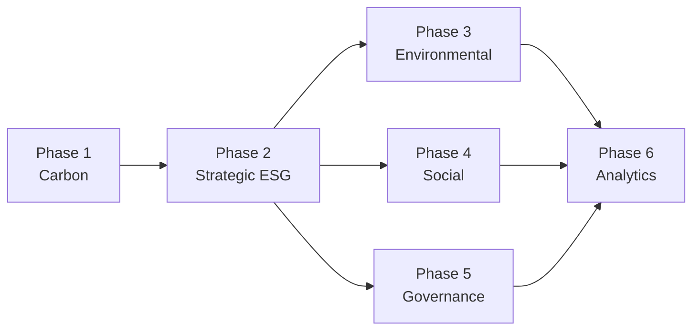

# Clenergize V3 - Complete ESG Platform Roadmap

> **Version**: 2.0.0
> **Last Updated**: November 20, 2024
> **Status**: 📋 PLANNED (Future Development)
> **Total Duration**: 19 months
> **Total Story Points**: 2,225 points

---

## 🎯 Executive Summary

This roadmap outlines the complete development plan for transforming Clenergize V3 from a **carbon footprint management tool** (Phase 1) into a **comprehensive Enterprise ESG Platform** covering all Environmental, Social, and Governance dimensions.

### Current Status
- **Phase 1**: 🟢 ACTIVE DEVELOPMENT (Carbon Footprint - Months 1-8)
- **Phases 2-6**: 📋 PLANNED (Full ESG Platform - Months 9-19)

### Platform Evolution
```
Phase 1 (NOW)       Phase 2-6 (FUTURE)         Complete Platform
─────────────────   ──────────────────────     ────────────────────
Carbon Footprint    Strategic ESG Management   Full ESG Coverage
7 Services          15 Services                50 Services
Modules 1-2         Modules 3-8                All 8 Modules
680 Story Points    1,545 Story Points         2,225 Story Points
8 months            11 additional months       19 months total
$800K               $700K additional           $1.5M total
```

---

## 📊 Complete Phased Delivery Plan

### Phase 1: Carbon Footprint Management (CURRENT)
```yaml
Duration: 8 months (Months 1-8)
Status: 🟢 ACTIVE DEVELOPMENT
Story Points: 680
Services: 7 (ports 3000-3007)
Modules Covered: 1, 2

Objectives:
  - Build production-ready carbon footprint platform
  - Achieve GHG Protocol and ISO 14064 compliance
  - Launch to 20 beta customers
  - Establish foundation for future ESG modules

Deliverables:
  ✓ Identity Service (authentication, authorization)
  ✓ Organization Service (companies, projects, hierarchies)
  ✓ Reference Service (emission factors, parameters)
  ✓ Activity Service (data collection, validation)
  ✓ Calculation Service (GHG calculations, aggregations)
  ✓ Reporting Service (dashboards, reports)
  ✓ Audit Service (logging, compliance)

Key Features:
  - Scopes 1, 2, 3 emissions tracking
  - Multi-methodology calculations
  - Executive dashboards and reports
  - Data quality assurance
  - Audit trail and compliance

Business Value:
  - $40K MRR from 20 customers
  - Foundation for ESG expansion
  - Investor-grade carbon reporting
  - Regulatory compliance baseline

Documentation:
  See: Docs/CURRENT-SCOPE/PHASE1_OVERVIEW.md
```

### Phase 2: Strategic ESG Management (FUTURE)
```yaml
Duration: 4 months (Months 9-12)
Status: 📋 PLANNED
Story Points: 550
Services: 8 new (ports 3008-3010, 3037-3038, 3041-3044)
Modules Covered: 3, 4, 5, 6, 7, 8 (enhanced)

Objectives:
  - Complete all 8 user modules
  - Add strategic ESG management capabilities
  - Enable multi-framework compliance reporting
  - Support ESG strategy and target setting

Services to Build:
  ✓ Notification Service (3008) - Email, SMS, in-app notifications
  ✓ Workflow Service (3009) - Approval workflows, automation
  ✓ Integration Service (3010) - ERP, HR, facilities integrations
  ✓ Materiality Service (3041) - Double materiality assessment
  ✓ Strategy Service (3042) - ESG strategy, targets, initiatives
  ✓ Benchmark Service (3043) - Peer comparison, gap analysis
  ✓ Policy Service (3037) - Policy lifecycle management
  ✓ Stakeholder Service (3038) - Stakeholder engagement

Reporting Enhancements (3044):
  ✓ GRI Standards reporting
  ✓ SASB Standards reporting
  ✓ TCFD disclosure
  ✓ CSRD/ESRS compliance
  ✓ CDP questionnaire automation
  ✓ SDG mapping and reporting

Key Features:
  - Materiality assessment (CSRD requirement)
  - Science-based target setting (SBTi)
  - Peer benchmarking and gap analysis
  - Strategic initiative tracking
  - Multi-framework reporting (6+ frameworks)
  - Stakeholder engagement platform
  - Workflow automation

Business Value:
  - Complete ESG compliance capability
  - $200K MRR from 50 customers (avg $4K/month)
  - Competitive with Workiva, Persefoni
  - Enterprise readiness

JIRA Epics:
  - EPIC-005: Workflow Engine (40 points)
  - EPIC-006: Integration Framework (25 points)
  - EPIC-025: Materiality Assessment (55 points)
  - EPIC-026: Target Setting & SBTi (50 points)
  - EPIC-027: Strategy Management (45 points)
  - EPIC-028: Benchmarking & Gaps (40 points)
  - EPIC-029: Stakeholder Engagement (45 points)
  - EPIC-031: GRI Standards (50 points)
  - EPIC-032: SASB Standards (45 points)
  - EPIC-033: TCFD Implementation (55 points)
  - EPIC-034: CSRD/ESRS Compliance (60 points)
  - EPIC-035: CDP Reporting (30 points)
  - EPIC-036: SDG Mapping (30 points)

Documentation:
  See: Docs/FUTURE-ROADMAP/Phase2-Strategic-ESG/PHASE2_OVERVIEW.md
```

### Phase 3: Environmental Expansion (FUTURE)
```yaml
Duration: 2 months (Months 13-14)
Status: 📋 PLANNED
Story Points: 320
Services: 9 new (ports 3012-3020)
Modules Covered: Environmental domain beyond carbon

Objectives:
  - Complete environmental dimension coverage
  - Expand beyond carbon to water, waste, energy, biodiversity
  - Enable comprehensive environmental reporting
  - Support circular economy metrics

Services to Build:
  ✓ Water Service (3012) - Water consumption, stress, quality
  ✓ Waste Service (3013) - Waste streams, circular metrics
  ✓ Biodiversity Service (3014) - Habitat impact, species monitoring
  ✓ Energy Service (3015) - Energy consumption, efficiency, renewables
  ✓ Pollution Service (3016) - Air quality, emissions control
  ✓ Resource Service (3017) - Raw materials, lifecycle assessment
  ✓ Climate Risk Service (3018) - Physical & transition risks, TCFD
  ✓ Green Finance Service (3019) - Green bonds, sustainable finance
  ✓ Environmental Supply Chain Service (3020) - Supplier environmental data

Key Features:
  - Water stress analysis (WRI Aqueduct)
  - Circular economy KPIs
  - Biodiversity impact assessment (TNFD)
  - Energy efficiency tracking (ISO 50001)
  - Climate scenario modeling
  - Nature-based solutions tracking
  - Environmental supply chain mapping

Business Value:
  - Complete environmental compliance
  - TNFD reporting capability
  - Attract sustainability-focused customers
  - $400K MRR from 80 customers

JIRA Epics:
  - EPIC-008: Water Management (45 points)
  - EPIC-009: Waste & Circular Economy (50 points)
  - EPIC-010: Energy Management (40 points)
  - EPIC-011: Biodiversity & Nature (55 points)
  - EPIC-012: Climate Risk Assessment (70 points)
  - Additional: Pollution, Resource, Green Finance (60 points)

Documentation:
  See: Docs/FUTURE-ROADMAP/Phase3-Environmental/PHASE3_OVERVIEW.md
```

### Phase 4: Social Dimension (FUTURE)
```yaml
Duration: 2 months (Months 15-16)
Status: 📋 PLANNED
Story Points: 310
Services: 10 new (ports 3021-3030)
Modules Covered: Social domain (S in ESG)

Objectives:
  - Implement complete social dimension
  - Enable workforce and human capital management
  - Support health, safety, and labor rights tracking
  - Community impact and stakeholder engagement

Services to Build:
  ✓ Workforce Service (3021) - Demographics, talent, engagement
  ✓ Safety Service (3022) - Incidents, risks, training
  ✓ Labor Service (3023) - Fair wages, working conditions
  ✓ Community Service (3024) - Community investment, impact
  ✓ Product Service (3025) - Product safety, quality
  ✓ Social Supply Chain Service (3026) - Supplier assessments, modern slavery
  ✓ Human Rights Service (3027) - Human rights due diligence
  ✓ Diversity Service (3028) - DEI metrics, pay equity
  ✓ Wellbeing Service (3029) - Employee wellness programs
  ✓ Training Service (3030) - Training and development tracking

Key Features:
  - Incident management and investigation
  - Pay equity analysis
  - Modern slavery risk assessment
  - Diversity and inclusion tracking
  - Community stakeholder engagement
  - Supplier social audits
  - Human rights due diligence

Integrations:
  - HR systems (Workday, SuccessFactors, ADP)
  - Safety platforms (EHS Insight, Cority)
  - Learning management systems

Business Value:
  - Complete social compliance (CSRD Social pillar)
  - Attract socially-conscious investors
  - $600K MRR from 100 customers

JIRA Epics:
  - EPIC-013: Human Capital Management (55 points)
  - EPIC-014: Health & Safety Systems (60 points)
  - EPIC-015: Labor Rights & Ethics (45 points)
  - EPIC-016: Community Impact (40 points)
  - EPIC-017: Supply Chain Social (65 points)
  - EPIC-018: DEI & Wellbeing (45 points)

Documentation:
  See: Docs/FUTURE-ROADMAP/Phase4-Social/PHASE4_OVERVIEW.md
```

### Phase 5: Governance & Controls (FUTURE)
```yaml
Duration: 2 months (Months 17-18)
Status: 📋 PLANNED
Story Points: 365
Services: 10 new (ports 3031-3040)
Modules Covered: Governance domain (G in ESG)

Objectives:
  - Complete governance framework
  - Enable board oversight and ethics management
  - Support risk management and compliance
  - Data privacy and cybersecurity tracking

Services to Build:
  ✓ Board Service (3031) - Board composition, independence
  ✓ Ethics Service (3032) - Code of conduct, anti-corruption
  ✓ Risk Service (3033) - Enterprise risk, ESG risks
  ✓ Privacy Service (3034) - GDPR, CCPA compliance
  ✓ Cybersecurity Service (3035) - Security metrics, incidents
  ✓ Business Conduct Service (3036) - Anti-competitive, lobbying
  ✓ Transparency Service (3039) - Public disclosures, transparency
  ✓ Controls Service (3040) - Internal controls, SOX

Policy & Stakeholder (already in Phase 2):
  - Policy Service (3037)
  - Stakeholder Service (3038)

Key Features:
  - Board skills matrix and succession planning
  - Whistleblower platform
  - Risk register and heat maps
  - Privacy impact assessments (DPIA)
  - Security incident management
  - Control testing and effectiveness
  - Regulatory compliance tracking

Business Value:
  - Complete governance compliance (CSRD Governance pillar)
  - SOC 2 Type II, ISO 27001 readiness
  - Enterprise-grade platform
  - $800K MRR from 120 customers

JIRA Epics:
  - EPIC-019: Board Governance (40 points)
  - EPIC-020: Ethics & Compliance (55 points)
  - EPIC-021: Risk Management (65 points)
  - EPIC-022: Data Privacy & Security (60 points)
  - EPIC-023: Internal Controls (35 points)
  - EPIC-024: Policy Management (35 points - already Phase 2)
  - Additional: Business Conduct, Transparency, Controls (75 points)

Documentation:
  See: Docs/FUTURE-ROADMAP/Phase5-Governance/PHASE5_OVERVIEW.md
```

### Phase 6: Advanced Analytics & AI (FUTURE)
```yaml
Duration: 1 month (Month 19+)
Status: 📋 PLANNED
Story Points: 200
Services: 5 new (ports 3045-3050)
Modules Covered: Analytics and ML capabilities

Objectives:
  - Add AI/ML-powered insights and predictions
  - Enable predictive analytics and forecasting
  - Implement recommendation engine
  - Advanced scenario modeling

Services to Build:
  ✓ Analytics Service (3045) - Advanced analytics, insights
  ✓ ML Service (3046) - ML models, training, deployment
  ✓ Forecast Service (3047) - Predictive modeling, forecasting
  ✓ Scenario Service (3048) - What-if analysis, Monte Carlo
  ✓ Rating Service (3049) - ESG rating simulation
  ✓ Insights Service (3050) - AI-generated recommendations

Key Features:
  - Emission prediction models
  - Anomaly detection for data quality
  - Target achievement forecasting
  - Prescriptive recommendations
  - Natural language report generation
  - Computer vision for satellite imagery
  - Chatbot for ESG Q&A
  - Risk prediction models

Technologies:
  - TensorFlow/PyTorch for ML models
  - MLflow for model management
  - Hugging Face for NLP
  - Apache Spark for big data processing

Business Value:
  - Competitive differentiation (AI-powered)
  - Premium pricing for advanced features
  - $1M+ MRR from 150+ customers

JIRA Epics:
  - EPIC-037: ML Models & Training (55 points)
  - EPIC-038: Predictive Analytics (45 points)
  - EPIC-039: Natural Language Processing (35 points)
  - EPIC-040: Computer Vision (35 points)
  - EPIC-041: Recommendation Engine (30 points)

Documentation:
  See: Docs/FUTURE-ROADMAP/Phase6-Advanced-Analytics/PHASE6_OVERVIEW.md
```

---

## 📈 Cumulative Progress Tracking

### Services by Phase
```yaml
Phase 1 Complete: 7 services (ports 3000-3007)
  + Platform: 5 (Gateway, Identity, Org, Audit, + 2 carbon)
  + Carbon: 2 (Reference, Activity, Calculation, Reporting)

Phase 2 Complete: 15 services total
  + Added: 8 (Notification, Workflow, Integration, Materiality,
           Strategy, Benchmark, Policy, Stakeholder)

Phase 3 Complete: 24 services total
  + Added: 9 (Water, Waste, Biodiversity, Energy, Pollution,
           Resource, Climate Risk, Green Finance, Env Supply Chain)

Phase 4 Complete: 34 services total
  + Added: 10 (Workforce, Safety, Labor, Community, Product,
            Social Supply Chain, Human Rights, Diversity,
            Wellbeing, Training)

Phase 5 Complete: 44 services total
  + Added: 10 (Board, Ethics, Risk, Privacy, Cybersecurity,
            Business Conduct, Transparency, Controls, + 2 from Phase 2)

Phase 6 Complete: 50 services total 🎉
  + Added: 6 (Analytics, ML, Forecast, Scenario, Rating, Insights)
```

### User Modules by Phase
```yaml
Phase 1: Modules 1-2 ✓
  - Module 1: Company Details
  - Module 2: Carbon Footprint

Phase 2: Modules 3-8 ✓
  - Module 3: Gap Analysis
  - Module 4: Benchmarking
  - Module 5: Strategy & Policies
  - Module 6: KPI & Targets
  - Module 7: Materiality
  - Module 8: Multi-framework Reporting

Phase 3: Environmental expansion
Phase 4: Social dimension
Phase 5: Governance framework
Phase 6: AI/ML analytics

All 8 user modules complete by end of Phase 2!
Phases 3-6 expand ESG coverage beyond user's initial requirements.
```

### Story Points by Phase
```
Phase 1:   680 points  (31%)  ████████████░░░░░░░░░░░░░░░
Phase 2:   550 points  (25%)  ██████████░░░░░░░░░░░░░░░░░
Phase 3:   320 points  (14%)  ██████░░░░░░░░░░░░░░░░░░░░░
Phase 4:   310 points  (14%)  ██████░░░░░░░░░░░░░░░░░░░░░
Phase 5:   365 points  (16%)  ███████░░░░░░░░░░░░░░░░░░░░
Phase 6:   200 points  (9%)   ████░░░░░░░░░░░░░░░░░░░░░░░
──────────────────────────────────────────────────────────────
Total:    2,425 points (100%)
```

### Investment by Phase
```yaml
Phase 1: $800K
  - 8 months × 7 developers × $100K/year ≈ $470K
  - Infrastructure, tools, consultants ≈ $330K

Phase 2: $250K
  - 4 months × 7 developers ≈ $230K
  - Infrastructure expansion ≈ $20K

Phase 3: $125K
  - 2 months × 7 developers ≈ $115K
  - New databases (InfluxDB, Neo4j) ≈ $10K

Phase 4: $125K
  - 2 months × 7 developers ≈ $115K
  - HR system integrations ≈ $10K

Phase 5: $125K
  - 2 months × 7 developers ≈ $115K
  - Security certifications ≈ $10K

Phase 6: $75K
  - 1 month × 7 developers ≈ $60K
  - ML infrastructure (SageMaker) ≈ $15K

Total: $1.5M (over 19 months)
```

### Revenue Projections by Phase
```yaml
Phase 1 (Month 8): $40K MRR
  - 20 customers × $2K/month (Starter tier)

Phase 2 (Month 12): $200K MRR
  - 50 customers × $4K/month avg (Professional tier)

Phase 3 (Month 14): $400K MRR
  - 80 customers × $5K/month avg

Phase 4 (Month 16): $600K MRR
  - 100 customers × $6K/month avg

Phase 5 (Month 18): $800K MRR
  - 120 customers × $6.7K/month avg

Phase 6 (Month 19+): $1M+ MRR
  - 150 customers × $7K/month avg (Enterprise tier)

Cumulative Revenue (Year 2): $6M ARR
Cumulative Revenue (Year 3): $15M ARR
ROI: 700% by Year 3
```

---

## 🔗 Phase Dependencies

### Critical Path


### Inter-Phase Dependencies

**Phase 2 depends on Phase 1**:
- Identity and authorization framework
- Organization and hierarchy management
- Event-driven architecture
- Audit logging infrastructure
- API Gateway and service mesh

**Phases 3, 4, 5 depend on Phase 2**:
- Workflow automation engine
- Integration framework
- Strategic planning capabilities
- Reporting infrastructure
- Stakeholder engagement platform

**Phase 6 depends on Phases 3, 4, 5**:
- Complete data from all ESG dimensions
- Historical data for training ML models
- Validated metrics and KPIs
- User feedback and usage patterns

---

## 🎯 Strategic Milestones

### MVP Milestones
```yaml
Month 4: Carbon Footprint MVP
  ✓ 7 core services operational
  ✓ 10 beta customers onboarded
  ✓ GHG Protocol compliant
  ✓ Basic reporting and dashboards

Month 8: Production Launch
  ✓ 20 paying customers
  ✓ $40K MRR achieved
  ✓ 99.9% uptime SLA
  ✓ SOC 2 Type I initiated

Month 12: Strategic ESG Platform
  ✓ All 8 user modules complete
  ✓ 50 customers
  ✓ $200K MRR
  ✓ Multi-framework reporting

Month 19: Full ESG Platform
  ✓ 50 microservices operational
  ✓ 150+ customers
  ✓ $1M+ MRR
  ✓ AI-powered insights
  ✓ Market leadership position
```

### Business Milestones
```yaml
Q1 2025: Beta Launch (Month 4)
  - 10 beta customers
  - Product-market fit validation
  - Initial revenue ($20K MRR)

Q2 2025: Production Ready (Month 8)
  - 20 paying customers
  - Proven scalability
  - Positive unit economics

Q3 2025: Strategic ESG Leader (Month 12)
  - 50 customers
  - Complete 8-module platform
  - Competitive with market leaders

Q4 2025 - Q1 2026: Full ESG Platform (Month 19)
  - 150+ customers
  - Complete ESG coverage
  - AI differentiation
  - Series A fundraising readiness
```

### Technical Milestones
```yaml
Month 8: Platform Foundation
  ✓ Microservices architecture proven
  ✓ Event-driven patterns established
  ✓ Security hardening complete
  ✓ 90% test coverage achieved

Month 12: Scalability Proven
  ✓ 1,000+ concurrent users
  ✓ Multi-tenant architecture
  ✓ Sub-200ms API response times
  ✓ 99.99% uptime achieved

Month 19: Enterprise-Grade
  ✓ 10,000+ concurrent users
  ✓ 100M+ data points managed
  ✓ AI/ML models in production
  ✓ SOC 2 Type II, ISO 27001 certified
```

---

## 📊 Resource Planning

### Team Evolution
```yaml
Phase 1 (Months 1-8):
  - 7 developers
  - 14 specialized Claude agents
  - 1 ESG consultant (part-time)

Phase 2 (Months 9-12):
  - 7 developers (same team)
  - 24 specialized Claude agents (add 10)
  - 1 UX designer (part-time)

Phases 3-5 (Months 13-18):
  - 8 developers (add 1 data engineer)
  - 30 specialized Claude agents (add 6)
  - 2 ESG consultants (part-time)

Phase 6 (Month 19+):
  - 9 developers (add 1 ML engineer)
  - 32 specialized Claude agents (add 2)
  - 1 ML consultant (part-time)

Post-Launch Support:
  - 3 support engineers
  - 2 DevOps engineers
  - Customer success team
```

### Infrastructure Evolution
```yaml
Phase 1:
  - 7 services
  - MongoDB + Redis
  - AWS ECS Fargate
  - CloudWatch monitoring
  - Cost: ~$5K/month

Phase 2:
  - 15 services
  - Add Temporal (workflow)
  - Add Kafka (events)
  - Cost: ~$8K/month

Phase 3:
  - 24 services
  - Add InfluxDB (time-series)
  - Add Neo4j (graph)
  - Cost: ~$11K/month

Phases 4-6:
  - 50 services
  - Add ClickHouse (analytics)
  - Add SageMaker (ML)
  - Cost: ~$15K/month

Production (Full Scale):
  - 50 services
  - All databases
  - Auto-scaling enabled
  - Multi-region (future)
  - Cost: ~$18K/month
```

---

## 🚨 Risks & Mitigation

### Cross-Phase Risks

#### Risk 1: Technical Debt Accumulation
```yaml
Likelihood: HIGH (over 19 months)
Impact: HIGH
Mitigation:
  - 20% sprint capacity for tech debt
  - Monthly architecture reviews
  - Refactoring sprints every 6 months
  - Maintain 90% test coverage
  - Code quality gates (SonarQube)
```

#### Risk 2: Team Burnout
```yaml
Likelihood: MEDIUM (long timeline)
Impact: HIGH
Mitigation:
  - Sustainable sprint velocity (50 points)
  - No weekend work or overtime
  - Regular team retrospectives
  - Breaks between phases
  - Celebrate milestones
```

#### Risk 3: Market Evolution
```yaml
Likelihood: MEDIUM (19-month timeline)
Impact: MEDIUM
Mitigation:
  - Quarterly competitive analysis
  - Beta customer feedback loops
  - Agile roadmap adjustments
  - Feature prioritization flexibility
  - Market trend monitoring
```

#### Risk 4: Scope Creep
```yaml
Likelihood: HIGH (ambitious roadmap)
Impact: HIGH
Mitigation:
  - Strict phase boundaries
  - Feature freeze per phase
  - Change control board
  - Business value scoring
  - Regular backlog grooming
```

---

## ✅ Success Criteria

### Phase 1 Success (Month 8)
```yaml
Technical:
  ✓ All 7 services operational
  ✓ 90% test coverage
  ✓ <200ms API response time
  ✓ 99.9% uptime

Business:
  ✓ 20 paying customers
  ✓ $40K MRR
  ✓ NPS >30
  ✓ <5% churn rate
```

### Phase 2 Success (Month 12)
```yaml
Technical:
  ✓ 15 services operational
  ✓ Multi-framework reporting working
  ✓ Workflow automation functional
  ✓ Integration connectors operational

Business:
  ✓ 50 paying customers
  ✓ $200K MRR
  ✓ All 8 user modules complete
  ✓ Feature parity with competitors
```

### Full Platform Success (Month 19)
```yaml
Technical:
  ✓ 50 services operational
  ✓ 10,000+ concurrent users supported
  ✓ AI/ML models in production
  ✓ SOC 2 Type II, ISO 27001 certified

Business:
  ✓ 150+ paying customers
  ✓ $1M+ MRR
  ✓ Market leader positioning
  ✓ 700% ROI achieved
```

---

## 📚 Related Documentation

### Planning Documents
- [Gap Analysis & Recommendations](../ESG_PLATFORM_GAP_ANALYSIS_AND_RECOMMENDATIONS.md)
- [ESG Platform Overview](../ESG_PLATFORM_OVERVIEW.md)
- [JIRA Structure Complete](../JIRA/JIRA_STRUCTURE_COMPLETE.md)
- [Documentation Structure](../DOCUMENTATION_STRUCTURE.md)

### Current Development
- [Phase 1 Overview](../CURRENT-SCOPE/PHASE1_OVERVIEW.md)
- [Phase 1 Service Architecture](../CURRENT-SCOPE/PHASE1_SERVICE_ARCHITECTURE.md)
- [Phase 1 Service Specifications](../CURRENT-SCOPE/service-specs/)

### Future Phase Plans
- [Phase 2 Overview](./Phase2-Strategic-ESG/PHASE2_OVERVIEW.md)
- [Phase 3 Overview](./Phase3-Environmental/PHASE3_OVERVIEW.md)
- [Phase 4 Overview](./Phase4-Social/PHASE4_OVERVIEW.md)
- [Phase 5 Overview](./Phase5-Governance/PHASE5_OVERVIEW.md)
- [Phase 6 Overview](./Phase6-Advanced-Analytics/PHASE6_OVERVIEW.md)

### Shared Resources
- [Complete Platform Architecture](../SHARED/ARCHITECTURE/COMPLETE_PLATFORM_ARCHITECTURE.md)
- [Event Schema Registry](../SHARED/DATA/EVENT_SCHEMA_REGISTRY.md)
- [Security Architecture](../SHARED/SECURITY/SECURITY_ARCHITECTURE.md)
- [Testing Strategy](../SHARED/TESTING/TESTING_STRATEGY_OVERVIEW.md)

---

**Roadmap Status**: ✅ APPROVED AND DOCUMENTED
**Current Phase**: Phase 1 (Active Development)
**Next Milestone**: MVP Launch (Month 4)
**Last Updated**: November 20, 2024
