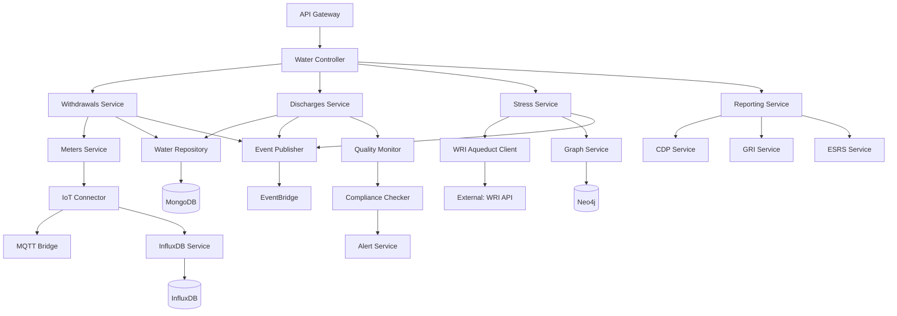

# Service Specification: Water Service

## Service Overview

**Service Name**: Water Service
**Port**: 3012
**Purpose**: Manages comprehensive water consumption, wastewater discharge, water stress assessment, and water-related reporting across facilities, operations, and supply chains
**Domain**: Environmental - Water Management
**Team Ownership**: Environmental Domain Team
**Phase**: 3 (Environmental Domain)
**Story Points**: 45
**Sprint Allocation**: 3 sprints (6 weeks)

## 1. Functional Requirements

### 1.1 Core Features

#### Water Withdrawal & Consumption Tracking
- Multi-source water tracking (municipal, groundwater, surface water, rainwater, wastewater)
- Water withdrawal recording by source and facility
- Water consumption calculations (withdrawal - discharge)
- Facility-level and process-level metering
- IoT sensor integration for real-time monitoring
- Water balance calculations and reconciliation
- Third-party water supply tracking
- Water recycling and reuse measurement
- Cooling water tracking (once-through vs. recirculating)
- Water intensity metrics (per unit production, per revenue)

#### Wastewater Discharge Management
- Wastewater discharge tracking by destination type
  - Surface water (ocean, river, lake, wetland)
  - Groundwater
  - Municipal wastewater treatment
  - Third-party treatment
  - Seawater
  - Other facilities
- Discharge volume measurement
- Water quality monitoring at discharge points
  - Chemical Oxygen Demand (COD)
  - Biological Oxygen Demand (BOD)
  - pH levels
  - Heavy metals (arsenic, cadmium, lead, mercury)
  - Total suspended solids (TSS)
  - Temperature
  - Nitrogen and phosphorus
- Treatment process tracking (primary, secondary, tertiary)
- Discharge permit compliance monitoring
- Pollutant load calculations
- Seasonal discharge pattern analysis

#### Water Stress Assessment
- WRI Aqueduct integration for baseline water stress data
- Facility-level water risk mapping
- Water stress classification (low, low-medium, medium-high, high, extremely high)
- Future water stress projections (2030, 2050)
- Climate change impact on water availability
- Context-based water target setting
- Watershed impact analysis
- Water scarcity footprint calculation
- Drought risk assessment
- Flooding risk assessment

#### Water Quality Monitoring
- Real-time water quality sensor integration
- Quality parameter tracking (incoming and outgoing)
- Compliance threshold alerts
- Quality trend analysis
- Contamination incident tracking
- Water treatment effectiveness monitoring
- Laboratory test result management
- Quality certification tracking

#### Water Efficiency & Conservation
- Water intensity benchmarking
- Efficiency improvement initiative tracking
- Water recycling rate calculation
- Conservation program management
- Best practice library
- Water-saving technology registry
- ROI calculation for efficiency projects
- Efficiency target vs. actual tracking
- Water footprint reduction initiatives
- Process optimization tracking

#### Supply Chain Water Management
- Supplier water risk assessment
- Water footprint of purchased goods and services
- Supplier engagement on water stewardship
- Supply chain water data collection
- Upstream and downstream water impacts
- Agricultural water use tracking
- Product water footprint calculation
- Virtual water trade analysis

#### CDP Water & Reporting
- CDP Water Security questionnaire automation
- CEO Water Mandate reporting
- GRI 303 (Water and Effluents) disclosures
- CSRD ESRS E3 (Water and Marine Resources) compliance
- SDG 6 (Clean Water and Sanitation) tracking
- Water-related financial disclosure
- Alliance for Water Stewardship (AWS) reporting
- ISO 14046 Water Footprint reporting

### 1.2 API Endpoints

#### Water Meter Management
```yaml
POST /v1/water/meters
  Request:
    - meterId: string (unique identifier)
    - name: string (required)
    - facilityId: string (required)
    - location: object
        latitude: number
        longitude: number
        description: string
    - meterType: "manual" | "iot" | "smart"
    - waterSource: "municipal" | "groundwater" | "surface" | "rainwater" | "wastewater" | "seawater" | "third-party"
    - measurementUnit: "m3" | "liters" | "gallons"
    - readingFrequency: string (cron expression)
    - iotConfig: object (optional)
        protocol: "mqtt" | "http" | "opcua"
        endpoint: string
        credentials: object
    - calibrationDate: date
    - calibrationDueDate: date
    - status: "active" | "maintenance" | "decommissioned"
  Response:
    - meter: WaterMeter
    - message: string

GET /v1/water/meters
  Query:
    - facilityId: string
    - meterType: string
    - waterSource: string
    - status: string
    - page: number
    - limit: number
  Response:
    - meters: WaterMeter[]
    - total: number
    - page: number

GET /v1/water/meters/:meterId
  Response:
    - meter: WaterMeter
    - recentReadings: WaterReading[] (last 10)
    - statistics: object

PUT /v1/water/meters/:meterId
  Request:
    - name: string
    - status: string
    - calibrationDate: date
    - iotConfig: object
  Response:
    - meter: WaterMeter

DELETE /v1/water/meters/:meterId
  Response:
    - success: boolean
    - message: string

POST /v1/water/meters/:meterId/calibrate
  Request:
    - calibrationDate: date
    - calibratedBy: string
    - calibrationCertificate: string (S3 URL)
    - notes: string
  Response:
    - success: boolean
    - nextCalibrationDue: date
```

#### Water Withdrawal & Consumption
```yaml
POST /v1/water/withdrawals
  Request:
    - facilityId: string (required)
    - meterId: string (optional)
    - source: "municipal" | "groundwater" | "surface" | "rainwater" | "wastewater" | "seawater" | "third-party"
    - sourceDetails: object
        name: string
        location: string
        stressLevel: string (if available)
    - volume: number (required)
    - unit: "m3" | "liters" | "gallons"
    - startDate: date (required)
    - endDate: date (required)
    - quality: object (optional)
        parameters: array
          - name: string
          - value: number
          - unit: string
    - cost: object (optional)
        amount: number
        currency: string
    - purpose: string ("production" | "cooling" | "sanitation" | "irrigation" | "other")
    - evidence: array (optional)
        - url: string
        - type: string
        - description: string
  Response:
    - withdrawal: WaterWithdrawal
    - waterStressImpact: object
    - message: string

GET /v1/water/withdrawals
  Query:
    - organizationId: string
    - facilityId: string
    - source: string
    - startDate: date
    - endDate: date
    - stressLevel: string
    - page: number
    - limit: number
  Response:
    - withdrawals: WaterWithdrawal[]
    - totalVolume: number
    - breakdown: object
    - total: number
    - page: number

GET /v1/water/withdrawals/:withdrawalId
  Response:
    - withdrawal: WaterWithdrawal
    - relatedDischarges: WaterDischarge[]
    - waterBalance: object

POST /v1/water/withdrawals/bulk
  Request:
    - withdrawals: WaterWithdrawal[]
    - source: "csv" | "api" | "erp"
    - validateOnly: boolean
  Response:
    - imported: number
    - failed: number
    - errors: array
    - validationResults: array

GET /v1/water/consumption/summary
  Query:
    - organizationId: string
    - facilityId: string
    - startDate: date
    - endDate: date
    - groupBy: "facility" | "source" | "month" | "quarter" | "year"
  Response:
    - totalWithdrawal: number
    - totalDischarge: number
    - totalConsumption: number
    - breakdown: array
    - trends: array
    - intensity: object
```

#### Wastewater Discharge
```yaml
POST /v1/water/discharges
  Request:
    - facilityId: string (required)
    - destination: "surface-water" | "groundwater" | "municipal" | "third-party" | "seawater"
    - destinationDetails: object
        name: string
        location: string
        receivingWaterbody: string (if applicable)
        treatmentLevel: string
    - volume: number (required)
    - unit: "m3" | "liters" | "gallons"
    - startDate: date (required)
    - endDate: date (required)
    - treatment: object
        level: "none" | "primary" | "secondary" | "tertiary" | "advanced"
        methods: array
        efficiencyPercent: number
    - quality: object (required)
        parameters: array
          - name: string (COD, BOD, pH, TSS, etc.)
          - value: number
          - unit: string
          - limitValue: number (permit limit)
          - exceedance: boolean
    - permit: object (optional)
        permitId: string
        expiryDate: date
        limits: array
    - temperature: number (optional)
    - evidence: array
  Response:
    - discharge: WaterDischarge
    - complianceStatus: object
    - exceedances: array
    - message: string

GET /v1/water/discharges
  Query:
    - organizationId: string
    - facilityId: string
    - destination: string
    - startDate: date
    - endDate: date
    - complianceStatus: "compliant" | "violation" | "warning"
    - page: number
    - limit: number
  Response:
    - discharges: WaterDischarge[]
    - totalVolume: number
    - complianceSummary: object
    - total: number

GET /v1/water/discharges/:dischargeId
  Response:
    - discharge: WaterDischarge
    - complianceAnalysis: object
    - historicalComparison: array

POST /v1/water/discharges/quality-test
  Request:
    - dischargeId: string
    - testDate: date
    - laboratory: string
    - parameters: array
        - name: string
        - value: number
        - unit: string
        - method: string
    - certificate: string (S3 URL)
  Response:
    - test: QualityTest
    - complianceStatus: object
```

#### Water Stress Assessment
```yaml
POST /v1/water/stress/assess
  Request:
    - facilityId: string (required)
    - location: object
        latitude: number
        longitude: number
    - assessmentDate: date
    - waterWithdrawal: number
    - waterConsumption: number
    - industry: string
    - useWRIAqueduct: boolean (default: true)
  Response:
    - assessment: WaterStressAssessment
    - baselineStress: string
    - futureStress: object
        2030: string
        2050: string
    - indicators: object
        waterDepletion: number
        waterScarcity: number
        droughtRisk: number
        floodRisk: number
    - recommendations: array

GET /v1/water/stress/facilities
  Query:
    - organizationId: string
    - stressLevel: "low" | "low-medium" | "medium-high" | "high" | "extremely-high"
    - country: string
    - region: string
  Response:
    - facilities: array
        - facilityId: string
        - facilityName: string
        - location: object
        - stressLevel: string
        - withdrawalVolume: number
        - riskScore: number
    - summary: object
        total: number
        highRisk: number
        mediumRisk: number
        lowRisk: number

GET /v1/water/stress/:facilityId
  Response:
    - currentStress: WaterStressAssessment
    - historicalTrend: array
    - futureProjections: array
    - mitigationActions: array

POST /v1/water/stress/bulk-assess
  Request:
    - facilities: array
        - facilityId: string
        - location: object
        - waterWithdrawal: number
  Response:
    - assessments: array
    - summary: object

GET /v1/water/stress/watershed/:watershedId
  Response:
    - watershed: Watershed
    - facilities: array
    - aggregateImpact: object
    - stressIndicators: object
```

#### Water Recycling & Reuse
```yaml
POST /v1/water/recycling
  Request:
    - facilityId: string (required)
    - volume: number (required)
    - unit: "m3" | "liters" | "gallons"
    - source: string (where water was recycled from)
    - reusePurpose: string (how recycled water is used)
    - treatmentProcess: array
    - qualityParameters: array
    - date: date
    - costSavings: object (optional)
  Response:
    - recycling: WaterRecycling
    - recyclingRate: number (percent)
    - savingsCalculation: object

GET /v1/water/recycling
  Query:
    - organizationId: string
    - facilityId: string
    - startDate: date
    - endDate: date
  Response:
    - recyclingRecords: array
    - totalRecycled: number
    - recyclingRate: number
    - trends: array

GET /v1/water/recycling/rate
  Query:
    - organizationId: string
    - facilityId: string
    - period: "month" | "quarter" | "year"
  Response:
    - recyclingRate: number
    - withdrawal: number
    - recycled: number
    - calculation: object
```

#### Water Initiatives & Projects
```yaml
POST /v1/water/initiatives
  Request:
    - name: string (required)
    - description: string
    - type: "efficiency" | "conservation" | "recycling" | "quality" | "stress-reduction"
    - facilityIds: array
    - targetMetric: object
        metric: string
        baselineValue: number
        targetValue: number
        unit: string
        targetDate: date
    - investment: object
        amount: number
        currency: string
    - status: "planned" | "in-progress" | "completed" | "cancelled"
    - startDate: date
    - expectedCompletionDate: date
  Response:
    - initiative: WaterInitiative
    - projectId: string

GET /v1/water/initiatives
  Query:
    - organizationId: string
    - facilityId: string
    - type: string
    - status: string
  Response:
    - initiatives: array
    - totalInvestment: number
    - expectedSavings: number

GET /v1/water/initiatives/:initiativeId
  Response:
    - initiative: WaterInitiative
    - progress: object
    - actualSavings: number
    - roi: number

PUT /v1/water/initiatives/:initiativeId/progress
  Request:
    - status: string
    - actualMetric: object
    - completionPercent: number
    - notes: string
  Response:
    - initiative: WaterInitiative
    - updated: boolean
```

#### Water Targets
```yaml
POST /v1/water/targets
  Request:
    - organizationId: string (required)
    - scope: "organization" | "facility" | "product" | "process"
    - targetType: "absolute" | "intensity"
    - metric: string (e.g., "total-withdrawal", "water-intensity")
    - baselineYear: number
    - baselineValue: number
    - targetYear: number
    - targetValue: number
    - reductionPercent: number
    - unit: string
    - context: "water-stressed-areas" | "all-facilities" | "specific-facilities"
    - facilityIds: array (optional)
    - standard: string (e.g., "Science-Based", "CDP", "Internal")
    - description: string
  Response:
    - target: WaterTarget
    - targetId: string

GET /v1/water/targets
  Query:
    - organizationId: string
    - facilityId: string
    - targetType: string
    - status: "on-track" | "at-risk" | "off-track" | "achieved"
  Response:
    - targets: array
    - overallProgress: number

GET /v1/water/targets/:targetId/progress
  Query:
    - asOfDate: date
  Response:
    - target: WaterTarget
    - progress: object
        currentValue: number
        progressPercent: number
        status: string
        trajectoryAnalysis: object
    - historicalData: array
```

#### Supply Chain Water
```yaml
POST /v1/water/supply-chain/suppliers
  Request:
    - supplierId: string (required)
    - supplierName: string
    - location: object
    - waterStressLevel: string
    - waterWithdrawal: number (reported by supplier)
    - waterDischarge: number
    - waterConsumption: number
    - reportingYear: number
    - dataQuality: "measured" | "estimated" | "industry-average"
    - engagementLevel: "none" | "initial" | "active" | "advanced"
  Response:
    - supplierWaterData: SupplierWaterData
    - riskScore: number

GET /v1/water/supply-chain/suppliers
  Query:
    - organizationId: string
    - stressLevel: string
    - engagementLevel: string
    - dataQuality: string
  Response:
    - suppliers: array
    - totalSuppliers: number
    - riskDistribution: object

POST /v1/water/supply-chain/footprint
  Request:
    - productId: string
    - productName: string
    - componentWaterFootprint: array
        - component: string
        - waterVolume: number
        - source: string
    - totalFootprint: number
    - unit: "m3/unit" | "liters/kg"
  Response:
    - footprint: ProductWaterFootprint
    - breakdown: array

GET /v1/water/supply-chain/engagement
  Query:
    - organizationId: string
    - year: number
  Response:
    - suppliersEngaged: number
    - dataCollectionRate: number
    - improvementInitiatives: array
```

#### CDP Water & Reporting
```yaml
POST /v1/water/cdp/prepare
  Request:
    - organizationId: string (required)
    - reportingYear: number
    - accountingApproach: string
    - boundaryDefinition: string
  Response:
    - cdpQuestions: array
    - dataCompleteness: object
    - missingData: array

GET /v1/water/cdp/questionnaire/:year
  Response:
    - questionnaire: object
    - responses: array
    - attachedEvidence: array
    - score: number (if previous year)

POST /v1/water/cdp/submit
  Request:
    - reportingYear: number
    - responses: array
    - evidence: array
  Response:
    - submissionId: string
    - timestamp: date
    - exportUrl: string (PDF/Excel)

GET /v1/water/reports/gri-303
  Query:
    - organizationId: string
    - reportingYear: number
  Response:
    - gri303Report: object
    - disclosures: array
        - disclosureNumber: string
        - requirement: string
        - data: object
        - evidence: array

GET /v1/water/reports/esrs-e3
  Query:
    - organizationId: string
    - reportingYear: number
  Response:
    - esrsE3Report: object
    - dataPoints: array
    - narrativeDisclosures: array
    - complianceStatus: object

GET /v1/water/reports/sdg6
  Query:
    - organizationId: string
    - reportingYear: number
  Response:
    - sdg6Indicators: array
        - indicator: string (6.1, 6.2, 6.3, etc.)
        - target: string
        - performance: object
        - contribution: string
```

### 1.3 Business Rules

#### Water Withdrawal Rules
1. Total withdrawal must equal sum of all sources
2. Municipal water must have supplier invoice validation
3. Groundwater withdrawal requires permit tracking
4. Surface water withdrawal requires environmental impact assessment
5. Water withdrawal in high-stress areas flagged for review
6. IoT meter readings validated against manual readings (±5% tolerance)
7. Missing meter data auto-generates alerts

#### Water Discharge Rules
1. Total discharge cannot exceed total withdrawal (except for rainwater collection)
2. All discharges must have quality test results (minimum quarterly)
3. Quality parameter exceedances auto-trigger non-compliance alerts
4. Discharge permits must be current (expiry warnings 90 days prior)
5. Treatment level must match permit requirements
6. Temperature discharge limits enforced for thermal pollution
7. Heavy metal concentrations must be within regulatory limits

#### Water Stress Rules
1. Facilities in high-stress areas require context-based targets
2. WRI Aqueduct data refreshed annually
3. Water stress assessment required for all new facility locations
4. High-stress facilities require water management plans
5. Water consumption in extremely high stress areas requires justification

#### Water Balance Rules
1. Water balance equation: Withdrawal = Consumption + Discharge + Storage Change
2. Unaccounted water (>10%) triggers investigation
3. Seasonal variations require normalization
4. Process water vs. non-process water segregation required
5. Water recycling rate = Recycled Water / (Withdrawal + Recycled)

#### Reporting Rules
1. CDP Water disclosure requires 3 years of historical data
2. GRI 303 requires breakdown by water source
3. CSRD ESRS E3 requires forward-looking targets
4. SDG 6 indicators mapped to operational metrics
5. CEO Water Mandate requires biennial reporting

### 1.4 Error Handling

```yaml
Error Responses:
  400 Bad Request:
    - INVALID_WATER_SOURCE
    - NEGATIVE_VOLUME_NOT_ALLOWED
    - INVALID_QUALITY_PARAMETER
    - WATER_BALANCE_MISMATCH
    - MISSING_REQUIRED_FIELD
    - INVALID_DATE_RANGE

  401 Unauthorized:
    - TOKEN_EXPIRED
    - INVALID_CREDENTIALS

  403 Forbidden:
    - INSUFFICIENT_PERMISSIONS
    - FACILITY_ACCESS_DENIED

  404 Not Found:
    - METER_NOT_FOUND
    - FACILITY_NOT_FOUND
    - WATERSHED_NOT_FOUND
    - DISCHARGE_NOT_FOUND

  409 Conflict:
    - METER_ID_DUPLICATE
    - OVERLAPPING_DATE_RANGE
    - PERMIT_EXPIRED

  422 Unprocessable Entity:
    - QUALITY_LIMIT_EXCEEDANCE
    - WATER_STRESS_DATA_UNAVAILABLE
    - INCOMPLETE_WATER_BALANCE

  500 Internal Server Error:
    - WRI_AQUEDUCT_API_ERROR
    - IOT_PLATFORM_CONNECTION_ERROR
    - CALCULATION_ERROR

  503 Service Unavailable:
    - EXTERNAL_API_TIMEOUT
    - DATABASE_UNAVAILABLE
```

## 2. Data Model

### 2.1 MongoDB Collections

#### water_meters Collection
```javascript
{
  _id: ObjectId,
  meterId: String (unique, indexed),
  name: String,

  facility: {
    facilityId: ObjectId (indexed),
    facilityName: String,
    location: {
      type: "Point",
      coordinates: [longitude, latitude] // GeoJSON
    },
    description: String
  },

  meterType: String, // "manual" | "iot" | "smart"

  waterSource: String, // "municipal" | "groundwater" | "surface" | "rainwater" | "wastewater" | "seawater" | "third-party"

  measurementUnit: String, // "m3" | "liters" | "gallons"

  readingFrequency: String, // Cron expression for automated readings

  iotConfig: {
    protocol: String, // "mqtt" | "http" | "opcua"
    endpoint: String,
    deviceId: String,
    credentials: {
      username: String (encrypted),
      password: String (encrypted),
      apiKey: String (encrypted)
    },
    lastSyncTime: Date,
    connectionStatus: String // "connected" | "disconnected" | "error"
  },

  calibration: {
    lastCalibrationDate: Date,
    nextCalibrationDue: Date,
    calibratedBy: String,
    certificateUrl: String (S3),
    accuracy: Number // Percent
  },

  status: String, // "active" | "maintenance" | "decommissioned"

  metadata: {
    createdAt: Date (indexed),
    createdBy: ObjectId,
    updatedAt: Date,
    updatedBy: ObjectId,
    decommissionedAt: Date,
    decommissionReason: String
  }
}

// Indexes
- meterId: unique
- facility.facilityId: 1
- waterSource: 1
- status: 1
- facility.location: 2dsphere
- metadata.createdAt: -1
```

#### water_withdrawals Collection
```javascript
{
  _id: ObjectId,

  organization: {
    organizationId: ObjectId (indexed),
    organizationName: String
  },

  facility: {
    facilityId: ObjectId (indexed),
    facilityName: String,
    location: {
      type: "Point",
      coordinates: [longitude, latitude]
    }
  },

  meter: {
    meterId: String,
    meterName: String
  },

  source: String, // "municipal" | "groundwater" | "surface" | "rainwater" | "wastewater" | "seawater" | "third-party"

  sourceDetails: {
    name: String,
    location: String,
    stressLevel: String, // "low" | "low-medium" | "medium-high" | "high" | "extremely-high"
    permitRequired: Boolean,
    permitId: String,
    permitExpiry: Date
  },

  volume: {
    value: Number,
    unit: String, // "m3" | "liters" | "gallons"
    valueInM3: Number // Normalized to m3
  },

  period: {
    startDate: Date (indexed),
    endDate: Date (indexed),
    reportingPeriod: String // "2024-Q1", "2024-01", etc.
  },

  quality: {
    parameters: [{
      name: String,
      value: Number,
      unit: String,
      testDate: Date,
      laboratory: String
    }]
  },

  cost: {
    amount: Number,
    currency: String,
    amountUSD: Number, // Normalized to USD
    supplier: String
  },

  purpose: String, // "production" | "cooling" | "sanitation" | "irrigation" | "other"

  evidence: [{
    url: String (S3),
    type: String, // "invoice" | "meter-reading" | "permit" | "photo"
    description: String,
    uploadedAt: Date
  }],

  dataSource: String, // "iot" | "manual" | "erp" | "import"
  dataQuality: String, // "measured" | "estimated" | "calculated"

  waterStressImpact: {
    baselineStress: String,
    volumeInStressedArea: Number,
    contextualImpact: Number
  },

  metadata: {
    createdAt: Date (indexed),
    createdBy: ObjectId,
    updatedAt: Date,
    updatedBy: ObjectId,
    correlationId: String,
    importBatchId: String
  }
}

// Indexes
- organization.organizationId: 1, period.startDate: -1
- facility.facilityId: 1, period.startDate: -1
- source: 1
- sourceDetails.stressLevel: 1
- period.reportingPeriod: 1
- facility.location: 2dsphere
- metadata.createdAt: -1
```

#### water_discharges Collection
```javascript
{
  _id: ObjectId,

  organization: {
    organizationId: ObjectId (indexed),
    organizationName: String
  },

  facility: {
    facilityId: ObjectId (indexed),
    facilityName: String,
    location: {
      type: "Point",
      coordinates: [longitude, latitude]
    }
  },

  destination: String, // "surface-water" | "groundwater" | "municipal" | "third-party" | "seawater"

  destinationDetails: {
    name: String,
    location: String,
    receivingWaterbody: String,
    treatmentLevel: String
  },

  volume: {
    value: Number,
    unit: String,
    valueInM3: Number
  },

  period: {
    startDate: Date (indexed),
    endDate: Date (indexed),
    reportingPeriod: String
  },

  treatment: {
    level: String, // "none" | "primary" | "secondary" | "tertiary" | "advanced"
    methods: [String],
    facility: String,
    efficiency: {
      percent: Number,
      parameters: Object
    }
  },

  quality: {
    parameters: [{
      name: String, // COD, BOD, pH, TSS, heavy metals, etc.
      value: Number,
      unit: String,
      limitValue: Number, // Permit limit
      exceedance: Boolean,
      testDate: Date,
      laboratory: String,
      method: String,
      certificate: String (S3 URL)
    }],
    overallCompliance: String // "compliant" | "violation" | "warning"
  },

  permit: {
    permitId: String,
    issuedBy: String,
    issueDate: Date,
    expiryDate: Date,
    limits: [{
      parameter: String,
      maxValue: Number,
      unit: String
    }]
  },

  temperature: {
    value: Number,
    unit: String, // Celsius
    limit: Number,
    exceedance: Boolean
  },

  pollutantLoad: {
    parameters: [{
      name: String,
      loadKg: Number, // Calculated: concentration * volume
      annualLoadKg: Number
    }]
  },

  evidence: [{
    url: String (S3),
    type: String,
    description: String,
    uploadedAt: Date
  }],

  violations: [{
    parameter: String,
    exceedanceValue: Number,
    limit: Number,
    severity: String, // "minor" | "major" | "critical"
    reportedToAuthority: Boolean,
    reportDate: Date,
    actionTaken: String,
    status: String // "open" | "resolved"
  }],

  dataSource: String,
  dataQuality: String,

  metadata: {
    createdAt: Date (indexed),
    createdBy: ObjectId,
    updatedAt: Date,
    updatedBy: ObjectId,
    correlationId: String
  }
}

// Indexes
- organization.organizationId: 1, period.startDate: -1
- facility.facilityId: 1, period.startDate: -1
- destination: 1
- quality.overallCompliance: 1
- permit.expiryDate: 1
- violations.status: 1
- metadata.createdAt: -1
```

#### water_stress_assessments Collection
```javascript
{
  _id: ObjectId,

  facility: {
    facilityId: ObjectId (indexed),
    facilityName: String,
    location: {
      type: "Point",
      coordinates: [longitude, latitude]
    }
  },

  assessmentDate: Date (indexed),
  reportingYear: Number,

  waterUse: {
    totalWithdrawal: Number, // m3/year
    totalConsumption: Number,
    totalDischarge: Number,
    intensity: {
      perRevenue: Number, // m3/$ million
      perProduct: Number, // m3/unit
      perEmployee: Number // m3/employee
    }
  },

  wriAqueduct: {
    baselineWaterStress: {
      score: Number, // 0-5
      category: String, // "Low (<10%)" to "Extremely High (>80%)"
      percentile: Number
    },
    futureStress: {
      2030: {
        optimistic: String,
        businessAsUsual: String,
        pessimistic: String
      },
      2050: {
        optimistic: String,
        businessAsUsual: String,
        pessimistic: String
      }
    },
    indicators: {
      waterDepletion: Number,
      waterScarcity: Number,
      interannualVariability: Number,
      seasonalVariability: Number,
      droughtSeverity: Number,
      floodOccurrence: Number,
      coastalEutrophication: Number
    },
    dataVersion: String,
    lastUpdated: Date
  },

  riskScore: {
    overall: Number, // 0-100
    physical: Number,
    regulatory: Number,
    reputational: Number,
    factors: [{
      factor: String,
      score: Number,
      weight: Number
    }]
  },

  contextualImpact: {
    volumeInStressedArea: Number,
    percentOfTotal: Number,
    watershedDependence: String, // "low" | "medium" | "high"
    alternativeSourcesAvailable: Boolean
  },

  mitigationActions: [{
    action: String,
    status: String,
    targetReduction: Number,
    timeline: String
  }],

  waterManagementPlan: {
    required: Boolean,
    status: String, // "not-required" | "pending" | "in-progress" | "completed"
    url: String (S3),
    approvedBy: String,
    approvalDate: Date
  },

  metadata: {
    createdAt: Date,
    createdBy: ObjectId,
    updatedAt: Date,
    updatedBy: ObjectId
  }
}

// Indexes
- facility.facilityId: 1, assessmentDate: -1
- wriAqueduct.baselineWaterStress.category: 1
- riskScore.overall: -1
- reportingYear: 1
- facility.location: 2dsphere
```

#### water_recycling Collection
```javascript
{
  _id: ObjectId,

  facility: {
    facilityId: ObjectId (indexed),
    facilityName: String
  },

  volume: {
    value: Number,
    unit: String,
    valueInM3: Number
  },

  date: Date (indexed),
  reportingPeriod: String,

  source: String, // Where water was recycled from
  reusePurpose: String, // How recycled water is used

  treatmentProcess: [{
    step: String,
    method: String,
    efficiency: Number
  }],

  qualityParameters: [{
    name: String,
    value: Number,
    unit: String,
    meetsPurposeRequirements: Boolean
  }],

  costSavings: {
    waterCost: Number,
    treatmentCost: Number,
    netSavings: Number,
    currency: String
  },

  recyclingRate: {
    facilityWithdrawal: Number,
    recycledVolume: Number,
    ratePercent: Number // (Recycled / (Withdrawal + Recycled)) * 100
  },

  metadata: {
    createdAt: Date,
    createdBy: ObjectId
  }
}

// Indexes
- facility.facilityId: 1, date: -1
- reportingPeriod: 1
```

#### water_quality_tests Collection
```javascript
{
  _id: ObjectId,

  testType: String, // "withdrawal" | "discharge"

  facility: {
    facilityId: ObjectId,
    facilityName: String
  },

  relatedRecord: {
    recordType: String, // "withdrawal" | "discharge"
    recordId: ObjectId
  },

  testDate: Date (indexed),

  laboratory: {
    name: String,
    accreditation: String,
    certificationNumber: String
  },

  parameters: [{
    name: String,
    value: Number,
    unit: String,
    method: String, // Testing method/standard
    limitValue: Number,
    exceedance: Boolean,
    uncertainty: Number
  }],

  certificate: {
    url: String (S3),
    certificateNumber: String
  },

  compliance: {
    overallStatus: String, // "pass" | "fail" | "marginal"
    regulatoryStandard: String,
    violations: [String]
  },

  metadata: {
    createdAt: Date,
    createdBy: ObjectId
  }
}

// Indexes
- facility.facilityId: 1, testDate: -1
- testType: 1
- compliance.overallStatus: 1
```

#### water_initiatives Collection
```javascript
{
  _id: ObjectId,

  organization: {
    organizationId: ObjectId (indexed)
  },

  name: String,
  description: String,

  type: String, // "efficiency" | "conservation" | "recycling" | "quality" | "stress-reduction"

  facilities: [{
    facilityId: ObjectId,
    facilityName: String
  }],

  targetMetric: {
    metric: String,
    baselineValue: Number,
    targetValue: Number,
    unit: String,
    targetDate: Date
  },

  investment: {
    amount: Number,
    currency: String,
    amountUSD: Number,
    breakdown: [{
      category: String,
      amount: Number
    }]
  },

  status: String, // "planned" | "in-progress" | "completed" | "cancelled"

  timeline: {
    startDate: Date,
    expectedCompletionDate: Date,
    actualCompletionDate: Date,
    milestones: [{
      name: String,
      targetDate: Date,
      completedDate: Date,
      status: String
    }]
  },

  progress: {
    completionPercent: Number,
    currentValue: Number,
    actualSavings: Number,
    roi: Number
  },

  technology: {
    name: String,
    vendor: String,
    capacity: Number,
    unit: String
  },

  metadata: {
    createdAt: Date,
    createdBy: ObjectId,
    updatedAt: Date,
    updatedBy: ObjectId
  }
}

// Indexes
- organization.organizationId: 1
- type: 1
- status: 1
- timeline.startDate: -1
```

#### water_targets Collection
```javascript
{
  _id: ObjectId,

  organization: {
    organizationId: ObjectId (indexed)
  },

  scope: String, // "organization" | "facility" | "product" | "process"

  targetType: String, // "absolute" | "intensity"

  metric: String, // e.g., "total-withdrawal", "water-intensity-per-revenue"

  baseline: {
    year: Number,
    value: Number,
    unit: String,
    dataQuality: String
  },

  target: {
    year: Number,
    value: Number,
    reductionPercent: Number,
    unit: String
  },

  context: String, // "water-stressed-areas" | "all-facilities" | "specific-facilities"

  facilities: [{
    facilityId: ObjectId,
    facilityName: String,
    contributionTarget: Number
  }],

  standard: String, // e.g., "Science-Based", "CDP", "Internal"
  description: String,

  progress: {
    currentYear: Number,
    currentValue: Number,
    progressPercent: Number,
    status: String, // "on-track" | "at-risk" | "off-track" | "achieved"
    lastCalculated: Date
  },

  milestones: [{
    year: Number,
    targetValue: Number,
    achievedValue: Number,
    status: String
  }],

  metadata: {
    createdAt: Date,
    createdBy: ObjectId,
    updatedAt: Date,
    approvedBy: ObjectId,
    approvalDate: Date
  }
}

// Indexes
- organization.organizationId: 1
- targetType: 1
- target.year: 1
- progress.status: 1
```

#### supplier_water_data Collection
```javascript
{
  _id: ObjectId,

  organization: {
    organizationId: ObjectId (indexed)
  },

  supplier: {
    supplierId: ObjectId (indexed),
    supplierName: String,
    location: {
      type: "Point",
      coordinates: [longitude, latitude]
    },
    country: String,
    industry: String
  },

  waterStress: {
    level: String,
    riskScore: Number,
    wriAqueductScore: Number
  },

  waterData: {
    withdrawal: {
      value: Number,
      unit: String,
      sources: [{
        source: String,
        volume: Number
      }]
    },
    discharge: {
      value: Number,
      unit: String
    },
    consumption: {
      value: Number,
      unit: String
    },
    recycled: {
      value: Number,
      unit: String
    }
  },

  reportingYear: Number (indexed),

  dataQuality: String, // "measured" | "estimated" | "industry-average"

  engagementLevel: String, // "none" | "initial" | "active" | "advanced"

  certifications: [{
    name: String, // e.g., "AWS Standard", "ISO 14046"
    certificationDate: Date,
    expiryDate: Date
  }],

  improvementInitiatives: [{
    initiative: String,
    startDate: Date,
    status: String,
    targetReduction: Number
  }],

  metadata: {
    createdAt: Date,
    updatedAt: Date,
    dataSource: String
  }
}

// Indexes
- organization.organizationId: 1, reportingYear: -1
- supplier.supplierId: 1
- waterStress.level: 1
- engagementLevel: 1
- supplier.location: 2dsphere
```

#### watershed_profiles Collection
```javascript
{
  _id: ObjectId,

  watershedId: String (unique, indexed),
  name: String,

  location: {
    type: "Polygon",
    coordinates: [[[longitude, latitude]]] // GeoJSON
  },

  characteristics: {
    area: Number, // km2
    totalWaterAvailability: Number, // m3/year
    population: Number,
    industries: [String],
    agriculturePercent: Number
  },

  facilities: [{
    facilityId: ObjectId,
    facilityName: String,
    organizationId: ObjectId,
    waterWithdrawal: Number,
    percentOfWatershed: Number
  }],

  stressIndicators: {
    baselineStress: String,
    trendDirection: String, // "improving" | "stable" | "deteriorating"
    competingUses: [String]
  },

  aggregateImpact: {
    totalOrganizationWithdrawal: Number,
    percentOfAvailable: Number,
    cumulativeImpact: String
  },

  metadata: {
    dataSource: String,
    lastUpdated: Date
  }
}

// Indexes
- watershedId: unique
- location: 2dsphere
```

#### water_reports Collection
```javascript
{
  _id: ObjectId,

  organization: {
    organizationId: ObjectId (indexed)
  },

  reportType: String, // "CDP-Water" | "GRI-303" | "ESRS-E3" | "SDG-6" | "CEO-Water-Mandate"

  reportingYear: Number (indexed),
  reportingPeriod: {
    startDate: Date,
    endDate: Date
  },

  status: String, // "draft" | "in-review" | "approved" | "submitted"

  dataCompleteness: {
    overallPercent: Number,
    missingDataPoints: [String],
    dataQualityScore: Number
  },

  reportContent: {
    // Structure varies by report type
    // CDP Water
    governanceStrategy: Object,
    businessImpacts: Object,
    procedures: Object,
    risksOpportunities: Object,
    facilityWaterAccounting: Object,
    waterIntensity: Object,
    targets: Object,

    // Or GRI 303
    disclosures: [{
      disclosureNumber: String,
      requirement: String,
      data: Object,
      evidence: [String]
    }]
  },

  attachedEvidence: [{
    name: String,
    url: String (S3),
    type: String
  }],

  score: {
    overallScore: String, // For CDP
    scoreBreakdown: Object,
    previousYearScore: String,
    improvement: Number
  },

  submission: {
    submittedBy: ObjectId,
    submittedAt: Date,
    submissionId: String,
    exportUrls: {
      pdf: String (S3),
      excel: String (S3),
      xml: String (S3)
    }
  },

  metadata: {
    createdAt: Date,
    createdBy: ObjectId,
    updatedAt: Date,
    approvedBy: ObjectId,
    approvalDate: Date
  }
}

// Indexes
- organization.organizationId: 1, reportingYear: -1
- reportType: 1, status: 1
```

### 2.2 InfluxDB Time-Series Data

#### iot_water_readings (Measurement)
```
Tags:
  - meterId: string
  - facilityId: string
  - source: string
  - unit: string

Fields:
  - volume: float (instantaneous reading)
  - flowRate: float (m3/hour)
  - pressure: float (bar)
  - temperature: float (Celsius)
  - quality_pH: float
  - quality_conductivity: float
  - quality_turbidity: float
  - batteryLevel: float (for wireless sensors)
  - signalStrength: int

Time: timestamp (nanosecond precision)

Retention: 13 months (daily rollups kept for 7 years)
```

#### water_consumption_hourly (Continuous Query Result)
```
Tags:
  - facilityId: string
  - source: string

Fields:
  - totalVolume: float (sum)
  - avgFlowRate: float (mean)
  - maxFlowRate: float (max)
  - minFlowRate: float (min)
  - readingCount: int (count)

Time: hourly aggregation
```

### 2.3 Neo4j Graph Data

#### Water Source Relationships
```cypher
// Nodes
(:Facility {facilityId, name, location})
(:WaterSource {sourceId, type, name, location, stressLevel})
(:Watershed {watershedId, name, area})
(:Supplier {supplierId, name, location})
(:Product {productId, name})

// Relationships
(:Facility)-[:WITHDRAWS_FROM {volume, period}]->(:WaterSource)
(:Facility)-[:DISCHARGES_TO {volume, quality}]->(:WaterSource)
(:Facility)-[:LOCATED_IN]->(:Watershed)
(:WaterSource)-[:PART_OF]->(:Watershed)
(:Supplier)-[:WITHDRAWS_FROM]->(:WaterSource)
(:Product)-[:REQUIRES_WATER {volumePerUnit}]->(:WaterSource)
(:Facility)-[:RECEIVES_FROM {volume}]->(:Supplier)
```

## 3. Non-Functional Requirements

### 3.1 Performance
- **API Response Time**: < 200ms (p95) for read operations
- **Calculation Performance**: < 500ms for water balance calculations
- **IoT Data Ingestion**: 1M+ sensor readings/day
- **Real-time Dashboard**: < 2s to load facility water overview
- **Report Generation**: < 30s for annual CDP Water report
- **Bulk Import**: 10,000 water records/minute
- **WRI Aqueduct API**: < 3s for stress assessment
- **Concurrent Users**: 1,000 simultaneous users

### 3.2 Scalability
- **Horizontal Scaling**: Stateless service, scale to N instances
- **Database**:
  - MongoDB: Replica set with 1 primary, 2 secondaries, sharding by organizationId
  - InfluxDB: Cluster with 3 nodes for time-series data
  - Neo4j: Causal cluster with 3 core servers
- **IoT Meters**: Support 10,000+ meters per organization
- **Data Volume**: 100M+ water readings over 7 years
- **Facilities**: 1,000+ facilities per organization

### 3.3 Availability
- **Uptime SLA**: 99.9% (43 min/month downtime)
- **RTO**: 2 hours
- **RPO**: 15 minutes
- **Graceful Degradation**: WRI Aqueduct API failure doesn't block other operations
- **Circuit Breakers**: For WRI Aqueduct, IoT platforms, external APIs
- **Retry Logic**: Exponential backoff for failed IoT connections

### 3.4 Security
- **Encryption at Rest**: AES-256 for all water data
- **Encryption in Transit**: TLS 1.3
- **IoT Communication**: MQTT over TLS, certificate-based authentication
- **API Authentication**: JWT with service-to-service tokens
- **Data Access**: Role-based access control (RBAC)
- **Audit Logging**: All water data modifications logged
- **PII Protection**: Supplier contact information encrypted
- **GDPR Compliance**: Right to erasure for supplier data

### 3.5 Observability
- **Metrics**:
  - Total water withdrawal by organization
  - Water discharge quality compliance rate
  - IoT meter uptime percentage
  - Water stress assessment coverage
  - API endpoint latencies
  - WRI Aqueduct API response times
  - Report generation times

- **Logs**:
  - Water withdrawal/discharge creation events
  - Quality parameter exceedances
  - IoT connection failures
  - WRI Aqueduct API calls
  - Report generation activities
  - Data import operations

- **Alerts**:
  - Quality limit exceedance detected
  - Discharge permit expiring (90 days)
  - Water meter calibration overdue
  - IoT meter offline > 6 hours
  - Water balance mismatch > 10%
  - High water consumption in stressed areas
  - WRI Aqueduct API unavailable

### 3.6 Compliance & Audit
- **Audit Trail**: All water data changes tracked with correlationId
- **Data Retention**: 7 years for regulatory compliance
- **Evidence Management**: S3 storage for permits, test certificates, invoices
- **Data Lineage**: Track data source (IoT, manual, import)
- **Version Control**: Historical snapshots of water stress assessments
- **Regulatory Reports**: Auto-archive for 10 years

## 4. Module Architecture

### 4.1 Internal Structure
```
water-service/
├── src/
│   ├── main.ts                      # Service bootstrap
│   ├── app.module.ts                # Root module
│   │
│   ├── meters/                      # Water meter management
│   │   ├── meters.module.ts
│   │   ├── meters.controller.ts
│   │   ├── meters.service.ts
│   │   ├── meters.repository.ts
│   │   ├── iot/
│   │   │   ├── iot-connector.service.ts
│   │   │   ├── mqtt-client.service.ts
│   │   │   └── meter-sync.service.ts
│   │   ├── entities/
│   │   │   └── water-meter.entity.ts
│   │   └── dto/
│   │       ├── create-meter.dto.ts
│   │       └── update-meter.dto.ts
│   │
│   ├── withdrawals/                 # Water withdrawal tracking
│   │   ├── withdrawals.module.ts
│   │   ├── withdrawals.controller.ts
│   │   ├── withdrawals.service.ts
│   │   ├── withdrawals.repository.ts
│   │   ├── entities/
│   │   │   └── water-withdrawal.entity.ts
│   │   └── dto/
│   │       ├── create-withdrawal.dto.ts
│   │       └── withdrawal-query.dto.ts
│   │
│   ├── discharges/                  # Wastewater discharge tracking
│   │   ├── discharges.module.ts
│   │   ├── discharges.controller.ts
│   │   ├── discharges.service.ts
│   │   ├── discharges.repository.ts
│   │   ├── quality/
│   │   │   ├── quality-monitor.service.ts
│   │   │   └── compliance-checker.service.ts
│   │   ├── entities/
│   │   │   ├── water-discharge.entity.ts
│   │   │   └── quality-test.entity.ts
│   │   └── dto/
│   │       └── create-discharge.dto.ts
│   │
│   ├── stress/                      # Water stress assessment
│   │   ├── stress.module.ts
│   │   ├── stress.controller.ts
│   │   ├── stress.service.ts
│   │   ├── stress.repository.ts
│   │   ├── wri-aqueduct/
│   │   │   ├── wri-client.service.ts
│   │   │   └── stress-calculator.service.ts
│   │   ├── entities/
│   │   │   ├── water-stress-assessment.entity.ts
│   │   │   └── watershed.entity.ts
│   │   └── dto/
│   │       └── assess-stress.dto.ts
│   │
│   ├── recycling/                   # Water recycling & reuse
│   │   ├── recycling.module.ts
│   │   ├── recycling.controller.ts
│   │   ├── recycling.service.ts
│   │   ├── recycling.repository.ts
│   │   ├── calculators/
│   │   │   └── recycling-rate.calculator.ts
│   │   └── entities/
│   │       └── water-recycling.entity.ts
│   │
│   ├── initiatives/                 # Water conservation projects
│   │   ├── initiatives.module.ts
│   │   ├── initiatives.controller.ts
│   │   ├── initiatives.service.ts
│   │   ├── initiatives.repository.ts
│   │   └── entities/
│   │       └── water-initiative.entity.ts
│   │
│   ├── targets/                     # Water reduction targets
│   │   ├── targets.module.ts
│   │   ├── targets.controller.ts
│   │   ├── targets.service.ts
│   │   ├── targets.repository.ts
│   │   ├── progress/
│   │   │   └── progress-tracker.service.ts
│   │   └── entities/
│   │       └── water-target.entity.ts
│   │
│   ├── supply-chain/                # Supply chain water
│   │   ├── supply-chain.module.ts
│   │   ├── supply-chain.controller.ts
│   │   ├── supply-chain.service.ts
│   │   ├── supply-chain.repository.ts
│   │   ├── footprint/
│   │   │   └── footprint-calculator.service.ts
│   │   └── entities/
│   │       ├── supplier-water-data.entity.ts
│   │       └── product-footprint.entity.ts
│   │
│   ├── reporting/                   # CDP Water & regulatory reports
│   │   ├── reporting.module.ts
│   │   ├── reporting.controller.ts
│   │   ├── reporting.service.ts
│   │   ├── reporting.repository.ts
│   │   ├── cdp/
│   │   │   ├── cdp-water.service.ts
│   │   │   └── questionnaire-mapper.ts
│   │   ├── gri/
│   │   │   └── gri-303.service.ts
│   │   ├── esrs/
│   │   │   └── esrs-e3.service.ts
│   │   ├── sdg/
│   │   │   └── sdg6.service.ts
│   │   └── entities/
│   │       └── water-report.entity.ts
│   │
│   ├── calculations/                # Water balance & analytics
│   │   ├── calculations.module.ts
│   │   ├── water-balance.service.ts
│   │   ├── intensity.calculator.ts
│   │   ├── footprint.calculator.ts
│   │   └── trend-analyzer.service.ts
│   │
│   ├── integrations/                # External integrations
│   │   ├── integrations.module.ts
│   │   ├── wri-aqueduct/
│   │   │   └── aqueduct-client.ts
│   │   ├── iot-platforms/
│   │   │   ├── mqtt-bridge.ts
│   │   │   └── http-collector.ts
│   │   └── cdp-platform/
│   │       └── cdp-api-client.ts
│   │
│   ├── timeseries/                  # InfluxDB time-series data
│   │   ├── timeseries.module.ts
│   │   ├── influx.service.ts
│   │   ├── meter-readings.service.ts
│   │   └── aggregations.service.ts
│   │
│   ├── graph/                       # Neo4j graph operations
│   │   ├── graph.module.ts
│   │   ├── neo4j.service.ts
│   │   ├── water-network.service.ts
│   │   └── watershed-analysis.service.ts
│   │
│   ├── events/                      # Event publishing
│   │   ├── events.module.ts
│   │   ├── event-publisher.service.ts
│   │   └── schemas/
│   │       ├── water-withdrawal-recorded.schema.ts
│   │       ├── water-discharge-recorded.schema.ts
│   │       ├── quality-violation-detected.schema.ts
│   │       └── water-stress-assessment-completed.schema.ts
│   │
│   ├── common/                      # Shared utilities
│   │   ├── decorators/
│   │   │   └── facility-access.decorator.ts
│   │   ├── filters/
│   │   │   └── water-exception.filter.ts
│   │   ├── interceptors/
│   │   │   └── unit-conversion.interceptor.ts
│   │   ├── validators/
│   │   │   ├── water-balance.validator.ts
│   │   │   └── quality-limit.validator.ts
│   │   └── utils/
│   │       ├── unit-converter.util.ts
│   │       ├── water-calculations.util.ts
│   │       └── geo-utils.ts
│   │
│   └── config/                      # Configuration
│       ├── configuration.ts
│       ├── database.config.ts
│       ├── influxdb.config.ts
│       ├── neo4j.config.ts
│       ├── mqtt.config.ts
│       └── wri-aqueduct.config.ts
│
├── test/
│   ├── unit/
│   ├── integration/
│   └── e2e/
│
├── .env.example
├── Dockerfile
├── package.json
└── tsconfig.json
```

### 4.2 Dependencies

```json
{
  "dependencies": {
    "@nestjs/common": "^10.0.0",
    "@nestjs/core": "^10.0.0",
    "@nestjs/config": "^3.0.0",
    "@nestjs/mongoose": "^10.0.0",
    "@nestjs/swagger": "^7.0.0",
    "@nestjs/graphql": "^12.0.0",
    "@apollo/server": "^4.0.0",
    "@aws-sdk/client-s3": "^3.0.0",
    "@aws-sdk/client-eventbridge": "^3.0.0",
    "@influxdata/influxdb-client": "^1.33.0",
    "neo4j-driver": "^5.14.0",
    "mongoose": "^8.0.0",
    "ioredis": "^5.0.0",
    "mqtt": "^5.0.0",
    "axios": "^1.6.0",
    "class-validator": "^0.14.0",
    "class-transformer": "^0.5.0",
    "node-cron": "^3.0.0",
    "@turf/turf": "^6.5.0",
    "geolib": "^3.3.0",
    "xlsx": "^0.18.0",
    "pdf-lib": "^1.17.0",
    "handlebars": "^4.7.0"
  },
  "devDependencies": {
    "@types/node": "^20.0.0",
    "@types/jest": "^29.0.0",
    "jest": "^29.0.0",
    "supertest": "^6.3.0",
    "ts-jest": "^29.0.0"
  }
}
```

### 4.3 Module Interaction



## 5. Event Contracts

### 5.1 Published Events

#### WaterWithdrawalRecorded
```json
{
  "eventType": "water.withdrawal.recorded.v1",
  "version": "v1",
  "timestamp": "2024-11-20T10:30:00Z",
  "correlationId": "uuid",
  "payload": {
    "withdrawalId": "string",
    "organizationId": "string",
    "facilityId": "string",
    "source": "municipal|groundwater|surface|rainwater|wastewater|seawater|third-party",
    "volume": {
      "value": 1500,
      "unit": "m3",
      "valueInM3": 1500
    },
    "period": {
      "startDate": "2024-01-01",
      "endDate": "2024-01-31"
    },
    "stressLevel": "high",
    "dataSource": "iot|manual|erp"
  }
}
```

#### WaterDischargeRecorded
```json
{
  "eventType": "water.discharge.recorded.v1",
  "version": "v1",
  "timestamp": "2024-11-20T10:30:00Z",
  "correlationId": "uuid",
  "payload": {
    "dischargeId": "string",
    "organizationId": "string",
    "facilityId": "string",
    "destination": "surface-water|groundwater|municipal|third-party|seawater",
    "volume": {
      "value": 1200,
      "unit": "m3",
      "valueInM3": 1200
    },
    "period": {
      "startDate": "2024-01-01",
      "endDate": "2024-01-31"
    },
    "complianceStatus": "compliant|violation|warning",
    "treatmentLevel": "primary|secondary|tertiary|advanced"
  }
}
```

#### WaterQualityViolationDetected
```json
{
  "eventType": "water.quality.violation.detected.v1",
  "version": "v1",
  "timestamp": "2024-11-20T10:30:00Z",
  "correlationId": "uuid",
  "payload": {
    "dischargeId": "string",
    "facilityId": "string",
    "parameter": "COD|BOD|pH|TSS|heavy-metal",
    "measuredValue": 150,
    "limitValue": 100,
    "unit": "mg/L",
    "exceedancePercent": 50,
    "severity": "minor|major|critical",
    "testDate": "2024-01-15"
  }
}
```

#### WaterStressAssessmentCompleted
```json
{
  "eventType": "water.stress.assessment.completed.v1",
  "version": "v1",
  "timestamp": "2024-11-20T10:30:00Z",
  "correlationId": "uuid",
  "payload": {
    "assessmentId": "string",
    "facilityId": "string",
    "baselineStress": "low|low-medium|medium-high|high|extremely-high",
    "riskScore": 75,
    "waterWithdrawal": 50000,
    "unit": "m3/year",
    "futureStress2030": "high",
    "mitigationRequired": true
  }
}
```

#### WaterTargetAchieved
```json
{
  "eventType": "water.target.achieved.v1",
  "version": "v1",
  "timestamp": "2024-11-20T10:30:00Z",
  "correlationId": "uuid",
  "payload": {
    "targetId": "string",
    "organizationId": "string",
    "metric": "total-withdrawal|water-intensity",
    "targetValue": 100000,
    "achievedValue": 98000,
    "unit": "m3",
    "targetYear": 2024,
    "achievedDate": "2024-12-31"
  }
}
```

#### WaterAlertTriggered
```json
{
  "eventType": "water.alert.triggered.v1",
  "version": "v1",
  "timestamp": "2024-11-20T10:30:00Z",
  "correlationId": "uuid",
  "payload": {
    "alertType": "quality-exceedance|permit-expiring|meter-offline|balance-mismatch|high-consumption",
    "facilityId": "string",
    "severity": "info|warning|critical",
    "description": "string",
    "actionRequired": "string",
    "metadata": {}
  }
}
```

### 5.2 Consumed Events

#### OrganizationFacilityCreated
```json
{
  "eventType": "organization.facility.created.v1",
  "handler": "CreateFacilityWaterProfile",
  "action": "Initialize water tracking for new facility, assess water stress"
}
```

#### ActivityIoTDataIngested
```json
{
  "eventType": "activity.iot-data.ingested.v1",
  "handler": "ProcessIoTWaterReading",
  "action": "Store water meter reading in InfluxDB, update real-time consumption"
}
```

#### ReferenceEmissionFactorUpdated
```json
{
  "eventType": "reference.emission-factor.updated.v1",
  "handler": "UpdateWaterFootprintCalculations",
  "action": "Recalculate product water footprints with updated factors"
}
```

## 6. Integration Points

### 6.1 WRI Aqueduct API
- **Purpose**: Water stress data and future projections
- **Endpoint**: `https://www.wri.org/aqueduct/api`
- **Authentication**: API key
- **Operations**:
  - Get baseline water stress by coordinates
  - Retrieve future stress projections (2030, 2050)
  - Access water risk indicators
  - Download watershed boundaries

### 6.2 IoT Platforms
- **Protocols**: MQTT, HTTP, OPC-UA
- **Vendors**: AWS IoT Core, Azure IoT Hub, Siemens MindSphere
- **Data**: Real-time water meter readings, flow rates, quality sensors
- **Frequency**: 1-minute to 1-hour intervals
- **Certificate-based authentication**: X.509 certificates

### 6.3 CDP Platform API
- **Purpose**: Submit CDP Water Security responses
- **Authentication**: OAuth 2.0
- **Operations**:
  - Download questionnaire templates
  - Submit responses
  - Upload evidence documents
  - Retrieve scores

### 6.4 ERP Systems
- **Systems**: SAP, Oracle, Microsoft Dynamics
- **Integration**: REST APIs, OData
- **Data Exchange**:
  - Import water invoices (municipal water costs)
  - Import production volumes (for intensity calculations)
  - Export water consumption data

### 6.5 Organization Service (Port 3002)
- **Get facility details**: Location, hierarchy, metadata
- **Validate facility IDs**: Ensure facilities exist
- **Subscribe to facility events**: New facilities, location changes

### 6.6 Activity Service (Port 3004)
- **Receive IoT data**: Water meter readings forwarded from Activity Service
- **Get activity data**: Link water consumption to production activities

### 6.7 Reference Service (Port 3003)
- **Water benchmarks**: Industry-specific water intensity benchmarks
- **Conversion factors**: Unit conversions (gallons to m3)
- **Quality standards**: Regulatory limits by country/region

### 6.8 Calculation Service (Port 3005)
- **Water footprint calculations**: Calculate product-level water footprints
- **Intensity calculations**: Water per revenue, per product

### 6.9 Reporting Service (Port 3044)
- **Multi-framework reports**: Aggregate water data into GRI, CSRD, SASB
- **Data export**: Provide water data for consolidated ESG reports

### 6.10 Redis
- **Caching**: WRI Aqueduct results (1 year TTL)
- **Rate limiting**: API request throttling
- **Real-time aggregations**: Hourly/daily water consumption totals

## 7. Testing Requirements

### 7.1 Unit Tests (80% coverage)
- Water balance calculations (withdrawal = consumption + discharge)
- Unit conversion logic (m3, liters, gallons)
- Quality parameter exceedance detection
- Recycling rate calculations
- Water stress risk scoring
- Intensity metric calculations

### 7.2 Integration Tests
- MongoDB CRUD operations
- InfluxDB time-series queries
- Neo4j graph traversals (watershed analysis)
- WRI Aqueduct API integration (mocked)
- MQTT message ingestion
- Event publishing to EventBridge

### 7.3 E2E Tests
- Complete water withdrawal recording flow
- Quality violation detection and alerting
- Water stress assessment for new facility
- CDP Water report generation
- IoT meter data ingestion to discharge tracking
- Supplier water data collection

### 7.4 Performance Tests
- Load test: 1M IoT readings/day ingestion
- Water balance calculation for 1,000 facilities
- WRI Aqueduct bulk assessments (100 facilities)
- CDP report generation with 10,000 data points
- Real-time dashboard query performance

### 7.5 Security Tests
- IoT certificate-based authentication
- API rate limiting enforcement
- RBAC for facility-level data access
- PII encryption validation (supplier data)

## 8. Deployment Configuration

### 8.1 Environment Variables
```yaml
NODE_ENV: production
PORT: 3012

# MongoDB
MONGODB_URI: mongodb://...
MONGODB_DB_NAME: clenergize_water

# InfluxDB
INFLUXDB_URL: http://influxdb:8086
INFLUXDB_TOKEN: encrypted
INFLUXDB_ORG: clenergize
INFLUXDB_BUCKET: water_timeseries

# Neo4j
NEO4J_URI: bolt://neo4j:7687
NEO4J_USER: neo4j
NEO4J_PASSWORD: encrypted

# Redis
REDIS_HOST: redis-cluster.aws.com
REDIS_PORT: 6379
REDIS_PASSWORD: encrypted

# MQTT (IoT)
MQTT_BROKER_URL: mqtts://iot-broker.aws.com:8883
MQTT_CLIENT_CERT: /certs/client.crt
MQTT_CLIENT_KEY: /certs/client.key
MQTT_CA_CERT: /certs/ca.crt

# WRI Aqueduct
WRI_AQUEDUCT_API_KEY: encrypted
WRI_AQUEDUCT_BASE_URL: https://www.wri.org/aqueduct/api

# CDP Platform
CDP_API_URL: https://api.cdp.net
CDP_CLIENT_ID: encrypted
CDP_CLIENT_SECRET: encrypted

# AWS
AWS_REGION: us-east-1
AWS_S3_BUCKET_EVIDENCE: clenergize-water-evidence
AWS_EVENTBRIDGE_BUS: clenergize-events

# Service URLs
ORGANIZATION_SERVICE_URL: http://organization-service:3002
ACTIVITY_SERVICE_URL: http://activity-service:3004
REFERENCE_SERVICE_URL: http://reference-service:3003
CALCULATION_SERVICE_URL: http://calculation-service:3005
REPORTING_SERVICE_URL: http://reporting-service:3044

# Monitoring
LOG_LEVEL: info
SENTRY_DSN: https://sentry.io/...
```

### 8.2 Resource Requirements
- **CPU**: 1 vCPU baseline, 4 vCPU burst (for IoT ingestion spikes)
- **Memory**: 2 GB
- **Storage**: 20 GB for logs
- **Instances**: Min 2, Max 8 (auto-scaling based on IoT load)

### 8.3 Health Checks
```yaml
Liveness: GET /health/live
  - MongoDB connection
  - InfluxDB connection
  - Neo4j connection
  - Redis connection

Readiness: GET /health/ready
  - All liveness checks pass
  - MQTT broker reachable
  - WRI Aqueduct API reachable
  - Downstream services reachable
```

## 9. Migration Considerations

### From Current System
1. **No existing water module** - This is a new service
2. **Import historical data** from spreadsheets/legacy systems:
   - Water invoices (municipal water)
   - Manual meter readings
   - Discharge permits
   - Quality test reports
3. **Map facilities** from Organization Service
4. **Initialize WRI Aqueduct assessments** for all existing facilities
5. **Set baseline years** for water targets (typically 2019 or 2020)

### Data Migration Steps
1. Export facility data from Organization Service
2. Assess water stress for all facilities using WRI Aqueduct
3. Import historical water data (3+ years for CDP)
4. Validate water balance for each facility
5. Generate baseline water intensity metrics
6. Create initial water targets
7. Train users on data entry and reporting

## 10. Future Enhancements

### Phase 2 (Months 7-9)
- Advanced water footprint modeling (LCA-based)
- Machine learning for consumption prediction
- Automated anomaly detection (leaks, unusual consumption)
- Water pricing optimization
- Blockchain-based water credits trading

### Phase 3 (Months 10-12)
- Satellite imagery for water body monitoring
- Real-time water quality sensors (advanced parameters)
- Predictive maintenance for water infrastructure
- Water risk financial modeling
- Integration with insurance platforms

### Phase 4 (Months 13-15)
- Alliance for Water Stewardship (AWS) Standard certification support
- Water neutrality tracking
- Collaborative watershed management platform
- Water-related SDG impact modeling
- Virtual water trade analysis

---

**Document Version**: 1.0
**Last Updated**: 2024-11-20
**Author**: Environmental Domain Team
**Reviewers**: Architecture Team, Security Team, Product Owner
**Status**: Ready for Development
