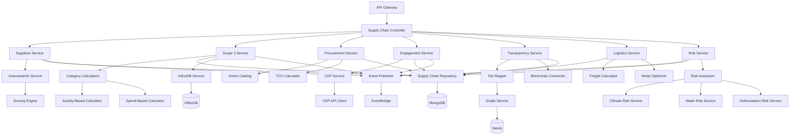

# Service Specification: Environmental Supply Chain Service

## Service Overview

**Service Name**: Environmental Supply Chain Service
**Port**: 3020
**Purpose**: Manages comprehensive Scope 3 upstream emissions, supplier environmental performance assessment, green procurement, sustainable sourcing, and supply chain decarbonization across the value chain
**Domain**: Environmental - Supply Chain Environment
**Team Ownership**: Environmental Domain Team
**Phase**: 3 (Environmental Domain - Supply Chain)
**Story Points**: 30
**Sprint Allocation**: 2 sprints (4 weeks)

## 1. Functional Requirements

### 1.1 Core Features

#### Supplier Environmental Performance Management
- Supplier environmental assessments and scorecards
- Supplier questionnaire management (custom + standardized)
- Environmental KPI tracking by supplier
- Certification tracking (ISO 14001, EcoVadis, CDP Supply Chain)
- Supplier carbon footprint collection and validation
- Audit management (on-site environmental audits)
- Corrective action tracking and resolution
- Supplier performance benchmarking
- Supplier risk scoring (environmental, climate, water)
- Annual supplier performance reviews
- Preferred supplier designation (environmental criteria)
- Supplier improvement plan management

#### Scope 3 Upstream Emissions (Categories 1-8)
- **Category 1**: Purchased goods and services
  - Activity-based calculation (material quantity × emission factor)
  - Spend-based calculation (spend × emission factor)
  - Supplier-specific emission factors
  - Industry average emission factors
  - Hybrid approach (mix of methods)
- **Category 2**: Capital goods
  - Capital expenditure tracking
  - Asset-specific emission factors
  - Amortization over asset lifetime
- **Category 3**: Fuel and energy-related activities
  - Upstream emissions from fuel/electricity
  - Transmission and distribution losses
  - Well-to-tank emissions
- **Category 4**: Upstream transportation and distribution
  - Freight emissions by mode (road, rail, sea, air)
  - Distance-based calculations
  - Ton-kilometer methodology
  - Third-party logistics emissions
- **Category 5**: Waste generated in operations
  - Waste disposal method emissions
  - Waste treatment emissions
  - Recycling emissions avoided
- **Category 6**: Business travel
  - Air travel emissions (by cabin class)
  - Hotel stays
  - Rental cars
  - Rail travel
- **Category 7**: Employee commuting
  - Commute mode split
  - Distance calculations
  - Work-from-home emissions
  - Company shuttle emissions
- **Category 8**: Upstream leased assets
  - Leased facility emissions
  - Leased vehicle emissions
  - Leased equipment emissions

#### Green Procurement
- Sustainable sourcing policies and guidelines
- Environmental criteria in RFP/RFQ templates
- Supplier environmental pre-qualification
- Green product catalog management
- Eco-label tracking (Energy Star, EPEAT, Cradle to Cradle, EU Ecolabel)
- Environmental product declarations (EPD)
- Life cycle assessment (LCA) in procurement decisions
- Total cost of ownership (TCO) with environmental costs
- Sustainable procurement targets
- Green spend tracking and reporting
- Procurement category sustainability ratings
- Alternative product recommendations (greener substitutes)

#### Supplier Engagement & Collaboration
- Supplier decarbonization programs
- Supplier target setting support (SBTi engagement)
- Supplier training and capacity building
- Collaborative innovation (eco-design, material substitution)
- Supplier incentives (preferred status, contract terms, faster payments)
- Supplier CDP disclosure requests
- Supplier sustainability workshops
- Best practice sharing platform
- Joint improvement projects
- Supplier recognition programs
- Supplier sustainability scorecards
- Engagement campaign management

#### Supply Chain Transparency & Traceability
- Multi-tier supplier mapping (Tier 1, Tier 2, Tier 3+)
- Traceability to origin (raw materials, components)
- Supply chain carbon footprint mapping
- Hotspot identification (high-emission suppliers/categories)
- Bill of materials (BOM) environmental analysis
- Supplier network visualization
- Critical supplier identification
- Supply chain vulnerability assessment
- Blockchain integration for traceability (optional)
- Product passport tracking (EU Digital Product Passport)

#### Sustainable Logistics
- Transportation mode optimization (intermodal analysis)
- Freight carbon intensity tracking (gCO2/ton-km)
- Route optimization for emissions reduction
- Packaging optimization (lightweighting, recyclability, reusability)
- Reverse logistics tracking (returns, take-back programs)
- Last-mile delivery emissions
- Electric vehicle (EV) fleet transition tracking
- Warehouse emissions allocation
- Cold chain emissions (refrigerated transport)
- Consolidation opportunities

#### Supplier Risk Management
- Environmental risk screening
- Climate risk in supply chain (physical + transition)
- Water risk in supply chain (WRI Aqueduct integration)
- Deforestation risk (high-risk commodities)
- Biodiversity risk (proximity to protected areas)
- Pollution incidents tracking
- Non-compliance incidents
- Business continuity planning
- Supply chain resilience scoring
- Alternative supplier identification

### 1.2 API Endpoints

#### Supplier Environmental Assessment
```yaml
POST /v1/supply-chain/suppliers
  Request:
    - supplierId: string (unique identifier)
    - supplierName: string (required)
    - location: object
        country: string
        region: string
        city: string
        latitude: number
        longitude: number
    - industry: string
    - tier: number (1, 2, 3+)
    - certifications: array
        - name: string (ISO 14001, EcoVadis, etc.)
        - certificateNumber: string
        - issueDate: date
        - expiryDate: date
        - verifier: string
        - documentUrl: string (S3)
    - annualRevenue: object
        amount: number
        currency: string
    - employeeCount: number
    - contactInfo: object
    - status: "active" | "inactive" | "suspended"
  Response:
    - supplier: SupplierProfile
    - environmentalRiskScore: number (0-100)
    - message: string

GET /v1/supply-chain/suppliers
  Query:
    - organizationId: string
    - tier: number
    - industry: string
    - country: string
    - riskLevel: "low" | "medium" | "high" | "critical"
    - certificationStatus: "certified" | "expired" | "not-certified"
    - page: number
    - limit: number
  Response:
    - suppliers: SupplierProfile[]
    - total: number
    - riskDistribution: object
    - certificationCoverage: number (percent)

GET /v1/supply-chain/suppliers/:supplierId
  Response:
    - supplier: SupplierProfile
    - performanceHistory: array
    - audits: array
    - scope3Emissions: object
    - riskAssessment: object

PUT /v1/supply-chain/suppliers/:supplierId
  Request:
    - supplierName: string
    - location: object
    - certifications: array
    - status: string
  Response:
    - supplier: SupplierProfile
    - updated: boolean

POST /v1/supply-chain/suppliers/:supplierId/assess
  Request:
    - assessmentType: "environmental" | "carbon" | "water" | "comprehensive"
    - assessmentDate: date
    - questionnaire: array
        - questionId: string
        - question: string
        - answer: string | number | boolean
        - evidence: array
    - auditor: object (if on-site audit)
    - score: number (if pre-calculated)
  Response:
    - assessment: SupplierAssessment
    - score: number
    - recommendations: array
    - complianceStatus: string

GET /v1/supply-chain/suppliers/:supplierId/assessments
  Query:
    - assessmentType: string
    - startDate: date
    - endDate: date
  Response:
    - assessments: SupplierAssessment[]
    - trends: array
    - improvementRate: number
```

#### Scope 3 Upstream Emissions
```yaml
POST /v1/supply-chain/scope3/calculate
  Request:
    - organizationId: string (required)
    - reportingYear: number (required)
    - categories: array (e.g., [1, 2, 3, 4, 5, 6, 7, 8])
    - methodology: object
        category1:
          method: "activity-based" | "spend-based" | "hybrid"
          dataQuality: "supplier-specific" | "industry-average"
        category2:
          method: "spend-based"
        # ... for each category
    - data: object
        category1:
          - materialType: string
          - quantity: number
          - unit: string
          - supplierId: string (optional)
          - spend: number (optional)
        category2:
          - assetType: string
          - spend: number
          - lifetime: number
        # ... for each category
  Response:
    - scope3Emissions: object
        totalEmissions: number (tCO2e)
        byCategory: array
          - category: number
          - emissions: number
          - percent: number
          - method: string
          - dataQuality: string
        bySupplier: array
        hotspots: array
    - dataCompleteness: number (percent)
    - uncertaintyRange: object

GET /v1/supply-chain/scope3/summary
  Query:
    - organizationId: string
    - reportingYear: number
    - groupBy: "category" | "supplier" | "material" | "tier"
  Response:
    - totalScope3: number
    - breakdown: array
    - trends: array (year-over-year)
    - percentOfTotalEmissions: number
    - dataQuality: object

GET /v1/supply-chain/scope3/category/:categoryNumber
  Query:
    - organizationId: string
    - reportingYear: number
  Response:
    - category: number
    - name: string
    - emissions: number
    - calculationMethod: string
    - dataPoints: array
    - emissionFactors: array
    - dataQuality: string

POST /v1/supply-chain/scope3/spend-based
  Request:
    - organizationId: string (required)
    - reportingYear: number (required)
    - procurementData: array
        - supplierId: string
        - supplierName: string
        - spend: number
        - currency: string
        - category: string (procurement category)
        - naicsCode: string (optional)
    - emissionFactorSource: "epa" | "defra" | "exiobase" | "custom"
  Response:
    - scope3Emissions: number
    - breakdown: array
        - category: string
        - spend: number
        - emissionFactor: number
        - emissions: number
    - dataQuality: string

POST /v1/supply-chain/scope3/activity-based
  Request:
    - organizationId: string (required)
    - reportingYear: number (required)
    - activityData: array
        - supplierId: string
        - materialType: string
        - quantity: number
        - unit: string
        - transportDistance: number (optional)
        - transportMode: string (optional)
    - useSupplierSpecificFactors: boolean
  Response:
    - scope3Emissions: number
    - breakdown: array
        - supplierId: string
        - materialType: string
        - quantity: number
        - emissionFactor: number
        - emissions: number
    - dataQuality: string

GET /v1/supply-chain/scope3/hotspots
  Query:
    - organizationId: string
    - reportingYear: number
    - threshold: number (percent of total, e.g., 80%)
  Response:
    - hotspots: array
        - type: "supplier" | "category" | "material"
        - name: string
        - emissions: number
        - percentOfTotal: number
        - reductionOpportunities: array
    - pareto80: array (top emitters contributing to 80%)
```

#### Green Procurement
```yaml
POST /v1/supply-chain/procurement/policies
  Request:
    - organizationId: string (required)
    - policyName: string
    - description: string
    - scope: array (procurement categories covered)
    - requirements: array
        - criterion: string
        - mandatory: boolean
        - threshold: number
        - unit: string
    - effectiveDate: date
    - reviewDate: date
    - approvedBy: string
  Response:
    - policy: ProcurementPolicy
    - policyId: string

GET /v1/supply-chain/procurement/policies
  Query:
    - organizationId: string
    - status: "active" | "draft" | "archived"
  Response:
    - policies: ProcurementPolicy[]
    - coverage: object

POST /v1/supply-chain/procurement/green-catalog
  Request:
    - productId: string (unique identifier)
    - productName: string
    - category: string
    - supplier: string
    - ecoLabels: array
        - label: string (Energy Star, EPEAT, etc.)
        - certificationNumber: string
        - expiryDate: date
    - environmentalAttributes: object
        recycledContent: number (percent)
        recyclability: number (percent)
        energyEfficiency: string
        carbonFootprint: number
        waterFootprint: number
        toxicSubstances: boolean
    - epd: object (Environmental Product Declaration)
        url: string
        version: string
        validUntil: date
    - lca: object (Life Cycle Assessment)
        url: string
        boundaryDefinition: string
    - price: object
    - tco: object (Total Cost of Ownership)
        purchasePrice: number
        operatingCost: number
        disposalCost: number
        environmentalCost: number
        totalCost: number
        currency: string
  Response:
    - product: GreenProduct
    - greenScore: number (0-100)

GET /v1/supply-chain/procurement/green-catalog
  Query:
    - category: string
    - ecoLabel: string
    - minGreenScore: number
    - page: number
    - limit: number
  Response:
    - products: GreenProduct[]
    - total: number
    - alternatives: array (greener substitutes)

POST /v1/supply-chain/procurement/rfp-template
  Request:
    - templateName: string
    - procurementCategory: string
    - environmentalCriteria: array
        - criterion: string
        - weight: number (percent)
        - scoringMethod: string
        - requiredEvidence: array
    - technicalRequirements: array
    - commercialRequirements: array
  Response:
    - template: RFPTemplate
    - templateId: string

GET /v1/supply-chain/procurement/green-spend
  Query:
    - organizationId: string
    - year: number
    - category: string
  Response:
    - totalProcurementSpend: number
    - greenSpend: number
    - greenSpendPercent: number
    - breakdown: array
        - category: string
        - greenSpend: number
        - conventionalSpend: number
    - trends: array
```

#### Supplier Engagement
```yaml
POST /v1/supply-chain/engagement/programs
  Request:
    - programName: string (required)
    - description: string
    - type: "decarbonization" | "training" | "innovation" | "certification"
    - targetSuppliers: array
        - supplierId: string
        - tier: number
        - selectionCriteria: string
    - objectives: array
        - objective: string
        - target: number
        - unit: string
        - deadline: date
    - activities: array
        - activity: string
        - startDate: date
        - endDate: date
        - deliverables: array
    - incentives: object
        preferredSupplierStatus: boolean
        contractExtension: boolean
        fasterPayment: boolean
        coInvestment: number
    - budget: object
        amount: number
        currency: string
    - status: "planned" | "active" | "completed"
  Response:
    - program: EngagementProgram
    - programId: string

GET /v1/supply-chain/engagement/programs
  Query:
    - organizationId: string
    - type: string
    - status: string
  Response:
    - programs: EngagementProgram[]
    - totalSuppliersCovered: number
    - participationRate: number

POST /v1/supply-chain/engagement/programs/:programId/enroll
  Request:
    - supplierId: string
    - enrollmentDate: date
    - commitments: array
        - commitment: string
        - target: number
        - deadline: date
  Response:
    - enrollment: SupplierEnrollment
    - success: boolean

GET /v1/supply-chain/engagement/programs/:programId/progress
  Response:
    - program: EngagementProgram
    - enrolledSuppliers: number
    - activeSuppliers: number
    - objectives: array
        - objective: string
        - target: number
        - achieved: number
        - percentComplete: number
    - outcomes: object
        emissionsReduced: number
        suppliersWithTargets: number
        certificationAchieved: number

POST /v1/supply-chain/engagement/cdp-request
  Request:
    - organizationId: string (required)
    - reportingYear: number
    - suppliers: array
        - supplierId: string
        - supplierName: string
        - contactEmail: string
        - spend: number
    - requestType: "climate" | "water" | "forests"
    - message: string
    - deadline: date
  Response:
    - requestId: string
    - sentCount: number
    - responseRate: number (from previous years)

GET /v1/supply-chain/engagement/cdp-responses
  Query:
    - organizationId: string
    - reportingYear: number
    - responseStatus: "pending" | "received" | "overdue"
  Response:
    - responses: array
        - supplierId: string
        - supplierName: string
        - status: string
        - score: string (if disclosed)
        - emissionsReported: number
        - targets: array
    - responseRate: number
    - aggregateData: object
```

#### Supply Chain Transparency
```yaml
POST /v1/supply-chain/transparency/map-tier
  Request:
    - organizationId: string (required)
    - tier1SupplierId: string
    - tier2Suppliers: array
        - supplierId: string
        - supplierName: string
        - relationship: string
        - materialSupplied: string
        - location: object
    - tier3Suppliers: array (optional)
  Response:
    - supplyChainMap: SupplyChainMap
    - totalTiers: number
    - criticalPaths: array

GET /v1/supply-chain/transparency/network
  Query:
    - organizationId: string
    - productId: string (optional)
    - maxTier: number
  Response:
    - nodes: array
        - nodeId: string
        - nodeType: "organization" | "supplier" | "raw-material"
        - tier: number
        - name: string
        - location: object
    - edges: array
        - from: string
        - to: string
        - relationship: string
        - volume: number
    - visualization: object (graph data)

POST /v1/supply-chain/transparency/traceability
  Request:
    - productId: string (required)
    - bomComponents: array
        - componentId: string
        - componentName: string
        - supplierId: string
        - origin: object
            country: string
            region: string
            facility: string
        - certifications: array
        - traceabilityLevel: "full" | "partial" | "none"
  Response:
    - traceabilityReport: object
        productId: string
        traceabilityScore: number (percent)
        components: array
        gaps: array
        risks: array

GET /v1/supply-chain/transparency/hotspots
  Query:
    - organizationId: string
    - reportingYear: number
  Response:
    - carbonHotspots: array
        - supplierId: string
        - emissions: number
        - percentOfScope3: number
        - tier: number
    - geographicHotspots: array
        - region: string
        - emissions: number
        - supplierCount: number
    - categoryHotspots: array
        - category: string
        - emissions: number

POST /v1/supply-chain/transparency/blockchain
  Request:
    - productId: string
    - batchId: string
    - supplyChainEvents: array
        - timestamp: date
        - eventType: string
        - actor: string
        - location: object
        - data: object
  Response:
    - blockchainHash: string
    - transactionId: string
    - verified: boolean
```

#### Sustainable Logistics
```yaml
POST /v1/supply-chain/logistics/shipments
  Request:
    - shipmentId: string (unique identifier)
    - supplierId: string
    - origin: object
        location: string
        coordinates: object
    - destination: object
        location: string
        coordinates: object
    - transportMode: "road" | "rail" | "sea" | "air" | "multimodal"
    - vehicle: object
        type: string
        fuelType: string
        loadCapacity: number
        emptyWeight: number
    - cargo: object
        weight: number
        volume: number
        type: string
    - distance: number (km)
    - shipmentDate: date
    - deliveryDate: date
    - carrier: string
  Response:
    - shipment: Shipment
    - emissions: object
        tCO2e: number
        gCO2PerTonKm: number
        method: string
    - alternativeModes: array
        - mode: string
        - emissions: number
        - cost: number
        - duration: number

GET /v1/supply-chain/logistics/shipments
  Query:
    - organizationId: string
    - supplierId: string
    - transportMode: string
    - startDate: date
    - endDate: date
  Response:
    - shipments: Shipment[]
    - totalEmissions: number
    - emissionsByMode: array
    - optimization: object
        potentialReduction: number
        recommendations: array

POST /v1/supply-chain/logistics/packaging
  Request:
    - productId: string
    - packagingType: string
    - materials: array
        - material: string
        - weight: number
        - recycledContent: number (percent)
        - recyclability: number (percent)
    - dimensions: object
    - reusable: boolean
    - carbonFootprint: number
  Response:
    - packaging: PackagingProfile
    - circularityScore: number
    - alternatives: array

GET /v1/supply-chain/logistics/mode-optimization
  Query:
    - origin: string
    - destination: string
    - cargoWeight: number
    - urgency: "standard" | "express" | "economy"
  Response:
    - recommendations: array
        - mode: string
        - emissions: number
        - cost: number
        - duration: number
        - score: number (composite)
    - optimalMode: string

POST /v1/supply-chain/logistics/reverse
  Request:
    - productId: string
    - returnType: "defect" | "end-of-life" | "recall"
    - origin: object (customer location)
    - destination: object (return facility)
    - transportMode: string
    - disposalMethod: string
    - recyclingRate: number
  Response:
    - reverseLogistics: ReverseLogisticsRecord
    - emissions: number
    - recyclingImpact: object
```

#### Supplier Risk Management
```yaml
POST /v1/supply-chain/risk/assess
  Request:
    - supplierId: string (required)
    - assessmentDate: date
    - riskFactors: object
        environmental:
          pollutionIncidents: number
          compliance: string
          certifications: array
        climate:
          physicalRisk: number (WRI Aqueduct, etc.)
          transitionRisk: number
          carbonIntensity: number
        water:
          waterStress: string
          waterConsumption: number
        deforestation:
          commodities: array (soy, palm oil, beef, timber, etc.)
          riskLevel: string
        biodiversity:
          protectedAreasProximity: boolean
          habitatImpact: string
    - mitigation: array
        - risk: string
        - action: string
        - status: string
  Response:
    - riskAssessment: SupplierRiskAssessment
    - overallRiskScore: number (0-100)
    - riskLevel: "low" | "medium" | "high" | "critical"
    - recommendations: array

GET /v1/supply-chain/risk/suppliers
  Query:
    - organizationId: string
    - riskLevel: string
    - riskType: "environmental" | "climate" | "water" | "deforestation" | "biodiversity"
    - tier: number
  Response:
    - suppliers: array
        - supplierId: string
        - supplierName: string
        - riskScore: number
        - riskLevel: string
        - keyRisks: array
        - mitigationStatus: string
    - total: number
    - riskDistribution: object

POST /v1/supply-chain/risk/incidents
  Request:
    - supplierId: string (required)
    - incidentType: "pollution" | "spill" | "compliance" | "deforestation" | "other"
    - description: string
    - severity: "minor" | "moderate" | "major" | "critical"
    - date: date
    - location: object
    - impact: object
        environmental: string
        financial: number
        reputational: string
    - rootCause: string
    - correctiveActions: array
    - status: "reported" | "investigating" | "resolved" | "recurring"
  Response:
    - incident: SupplierIncident
    - incidentId: string

GET /v1/supply-chain/risk/incidents
  Query:
    - organizationId: string
    - supplierId: string
    - incidentType: string
    - severity: string
    - status: string
    - startDate: date
    - endDate: date
  Response:
    - incidents: SupplierIncident[]
    - total: number
    - trends: array
    - supplierImpact: object

GET /v1/supply-chain/risk/deforestation
  Query:
    - organizationId: string
    - commodity: "soy" | "palm-oil" | "beef" | "timber" | "cocoa" | "coffee"
  Response:
    - suppliers: array
        - supplierId: string
        - commodity: string
        - sourceRegion: string
        - deforestationRisk: "low" | "medium" | "high"
        - certification: array (FSC, RSPO, etc.)
        - traceability: string
    - overallRiskScore: number
    - certificationCoverage: number (percent)
```

### 1.3 Business Rules

#### Supplier Assessment Rules
1. All Tier 1 suppliers must complete environmental assessment annually
2. Suppliers with revenue >$10M require comprehensive assessment
3. High-risk suppliers (score >70) require quarterly assessments
4. ISO 14001 certification grants automatic 20-point bonus
5. EcoVadis Platinum/Gold reduces audit frequency
6. Supplier non-response for 90 days triggers risk flag
7. Critical suppliers (spend >5% of total) require on-site audits

#### Scope 3 Calculation Rules
1. Activity-based method preferred over spend-based when data available
2. Supplier-specific emission factors override industry averages
3. Missing data filled with industry averages (flagged for quality)
4. Category 1 must represent >50% of total procurement spend
5. Transportation emissions allocated based on ton-kilometers
6. Double-counting avoided across categories (e.g., Cat 3 vs Cat 1)
7. Uncertainty ranges calculated using Monte Carlo simulation

#### Green Procurement Rules
1. All RFPs >$100K must include environmental criteria (min 20% weight)
2. Eco-labeled products preferred when price differential <15%
3. TCO (Total Cost of Ownership) includes carbon price ($50/tCO2e)
4. Products without EPD require environmental self-declaration
5. Recycled content targets: 30% for paper, 50% for metals, 25% for plastics
6. Energy-efficient products mandatory for electronics (Energy Star)
7. Green spend target: 40% of total procurement by 2030

#### Supplier Engagement Rules
1. Suppliers contributing >1% of Scope 3 invited to decarbonization program
2. CDP disclosure requested from top 80% of spend suppliers
3. Supplier targets aligned with SBTi criteria
4. Training provided free of charge to engaged suppliers
5. Preferred supplier status granted for 15% emissions reduction
6. Contract renewal contingent on environmental performance improvement
7. Co-investment capped at 25% of supplier project cost

#### Supply Chain Transparency Rules
1. Tier 2 mapping required for critical materials (e.g., conflict minerals)
2. Traceability to origin mandatory for high-risk commodities
3. Blockchain verification required for products with "deforestation-free" claims
4. Supply chain map updated quarterly
5. Critical path suppliers (single source) flagged for risk
6. Geographic concentration >50% in one country triggers alert
7. Product passport includes full supply chain emissions data

#### Logistics Rules
1. Air freight only permitted for urgent/high-value shipments
2. Sea freight preferred for distances >2,000 km
3. Rail freight incentivized with faster payment terms
4. Electric/hybrid vehicles required for last-mile delivery in urban areas
5. Packaging must be >50% recyclable or reusable
6. Reverse logistics emissions allocated to Scope 3 Category 4
7. Multimodal optimization performed for all shipments >10 tons

#### Risk Management Rules
1. Suppliers in water-stressed areas (WRI High/Extremely High) require water management plan
2. Deforestation-risk commodities require certification (RSPO, FSC, etc.)
3. Suppliers within 10 km of protected areas require biodiversity assessment
4. Environmental incidents (major/critical) trigger immediate audit
5. Suppliers with 3+ compliance violations suspended pending corrective action
6. Climate physical risk (high) requires business continuity plan
7. Alternative suppliers identified for all critical high-risk suppliers

### 1.4 Error Handling

```yaml
Error Responses:
  400 Bad Request:
    - INVALID_SUPPLIER_ID
    - INVALID_SCOPE3_CATEGORY
    - NEGATIVE_EMISSIONS_NOT_ALLOWED
    - MISSING_REQUIRED_FIELD
    - INVALID_TRANSPORT_MODE
    - INVALID_DATE_RANGE
    - UNSUPPORTED_EMISSION_FACTOR_SOURCE

  401 Unauthorized:
    - TOKEN_EXPIRED
    - INVALID_CREDENTIALS

  403 Forbidden:
    - INSUFFICIENT_PERMISSIONS
    - SUPPLIER_ACCESS_DENIED
    - PROCUREMENT_POLICY_VIOLATION

  404 Not Found:
    - SUPPLIER_NOT_FOUND
    - ASSESSMENT_NOT_FOUND
    - ENGAGEMENT_PROGRAM_NOT_FOUND
    - PRODUCT_NOT_FOUND
    - SHIPMENT_NOT_FOUND

  409 Conflict:
    - SUPPLIER_ID_DUPLICATE
    - ASSESSMENT_ALREADY_EXISTS
    - CONFLICTING_EMISSION_DATA
    - OVERLAPPING_PROGRAM_DATES

  422 Unprocessable Entity:
    - DATA_QUALITY_INSUFFICIENT
    - EMISSION_FACTOR_NOT_FOUND
    - TRACEABILITY_GAP
    - CERTIFICATION_EXPIRED
    - DEFORESTATION_RISK_HIGH

  500 Internal Server Error:
    - SCOPE3_CALCULATION_ERROR
    - CDP_API_ERROR
    - BLOCKCHAIN_INTEGRATION_ERROR
    - WRI_AQUEDUCT_API_ERROR

  503 Service Unavailable:
    - EXTERNAL_API_TIMEOUT
    - DATABASE_UNAVAILABLE
```

## 2. Data Model

### 2.1 MongoDB Collections

#### suppliers Collection
```javascript
{
  _id: ObjectId,
  supplierId: String (unique, indexed),

  organization: {
    organizationId: ObjectId (indexed),
    organizationName: String
  },

  basicInfo: {
    supplierName: String,
    legalName: String,
    taxId: String,
    dunsNumber: String,
    website: String,
    description: String
  },

  location: {
    headquarters: {
      country: String,
      region: String,
      city: String,
      address: String,
      postalCode: String,
      coordinates: {
        type: "Point",
        coordinates: [longitude, latitude] // GeoJSON
      }
    },
    facilities: [{
      facilityId: String,
      facilityName: String,
      location: Object,
      type: String // manufacturing, warehouse, office
    }]
  },

  industry: {
    sector: String,
    naicsCode: String,
    primaryProducts: [String],
    annualRevenue: {
      amount: Number,
      currency: String,
      year: Number
    },
    employeeCount: Number
  },

  tier: Number, // 1 = direct, 2 = sub-supplier, 3+ = deeper tiers
  relationship: {
    startDate: Date,
    contractType: String, // one-time, recurring, preferred
    annualSpend: {
      amount: Number,
      currency: String,
      year: Number
    },
    percentOfTotalSpend: Number,
    paymentTerms: String,
    isCritical: Boolean // single source, strategic
  },

  certifications: [{
    name: String, // ISO 14001, EcoVadis, CDP, FSC, RSPO, etc.
    type: String, // environmental, social, quality
    certificateNumber: String,
    issuer: String,
    issueDate: Date,
    expiryDate: Date (indexed),
    verifier: String,
    scope: String,
    documentUrl: String (S3),
    status: String // valid, expired, suspended
  }],

  environmentalPerformance: {
    overallScore: Number, // 0-100
    lastAssessmentDate: Date,
    carbonIntensity: Number, // tCO2e per $ revenue
    waterIntensity: Number,
    wasteIntensity: Number,
    renewableEnergyPercent: Number,
    hasEmissionTargets: Boolean,
    hasSBTiTargets: Boolean,
    cdpScore: String, // A, A-, B, etc.
    ecoVadisScore: Number
  },

  riskProfile: {
    overallRiskScore: Number (indexed), // 0-100
    riskLevel: String, // low, medium, high, critical
    lastAssessmentDate: Date,
    risks: {
      environmental: Number,
      climate: Number,
      water: Number,
      deforestation: Number,
      biodiversity: Number,
      compliance: Number
    },
    incidents: [{
      incidentId: ObjectId,
      date: Date,
      type: String,
      severity: String
    }]
  },

  contactInfo: {
    primaryContact: {
      name: String,
      title: String,
      email: String,
      phone: String
    },
    sustainabilityContact: {
      name: String,
      email: String
    }
  },

  status: String, // active, inactive, suspended, terminated

  metadata: {
    createdAt: Date (indexed),
    createdBy: ObjectId,
    updatedAt: Date,
    updatedBy: ObjectId,
    lastAuditDate: Date,
    nextAuditDue: Date
  }
}

// Indexes
- supplierId: unique
- organization.organizationId: 1
- tier: 1
- riskProfile.overallRiskScore: -1
- riskProfile.riskLevel: 1
- certifications.expiryDate: 1
- status: 1
- location.headquarters.coordinates: 2dsphere
- metadata.createdAt: -1
```

#### supplier_assessments Collection
```javascript
{
  _id: ObjectId,
  assessmentId: String (unique),

  supplier: {
    supplierId: ObjectId (indexed),
    supplierName: String
  },

  organization: {
    organizationId: ObjectId (indexed)
  },

  assessmentType: String, // environmental, carbon, water, comprehensive, audit
  assessmentDate: Date (indexed),
  reportingYear: Number,

  assessor: {
    type: String, // internal, third-party
    name: String,
    organization: String,
    credentials: String
  },

  questionnaire: {
    templateId: String,
    templateVersion: String,
    questions: [{
      questionId: String,
      section: String, // governance, strategy, emissions, targets, etc.
      question: String,
      answerType: String, // text, number, boolean, choice, file
      answer: Mixed,
      evidence: [{
        fileName: String,
        fileUrl: String (S3),
        uploadDate: Date
      }],
      score: Number,
      maxScore: Number,
      comments: String
    }]
  },

  scoring: {
    totalScore: Number,
    maxScore: Number,
    scorePercent: Number,
    sectionScores: [{
      section: String,
      score: Number,
      maxScore: Number
    }],
    weightedScore: Number,
    grade: String // A, B, C, D, F
  },

  findings: {
    strengths: [String],
    weaknesses: [String],
    gaps: [String],
    nonCompliance: [String],
    bestPractices: [String]
  },

  recommendations: [{
    priority: String, // high, medium, low
    area: String,
    recommendation: String,
    expectedImpact: String,
    timeline: String,
    status: String // pending, in-progress, completed
  }],

  correctiveActions: [{
    actionId: String,
    issue: String,
    action: String,
    responsible: String,
    dueDate: Date,
    status: String, // open, in-progress, completed, overdue
    completedDate: Date,
    evidence: String (S3)
  }],

  complianceStatus: String, // compliant, minor-issues, major-issues, non-compliant

  nextAssessmentDue: Date,

  metadata: {
    createdAt: Date,
    createdBy: ObjectId,
    approvedBy: ObjectId,
    approvalDate: Date,
    sharedWithSupplier: Boolean,
    sharedDate: Date
  }
}

// Indexes
- assessmentId: unique
- supplier.supplierId: 1, assessmentDate: -1
- organization.organizationId: 1, assessmentDate: -1
- assessmentType: 1
- complianceStatus: 1
- reportingYear: 1
```

#### scope3_emissions Collection
```javascript
{
  _id: ObjectId,

  organization: {
    organizationId: ObjectId (indexed),
    organizationName: String
  },

  reportingYear: Number (indexed),
  reportingPeriod: {
    startDate: Date,
    endDate: Date
  },

  category: Number (indexed), // 1-8 for upstream
  categoryName: String,

  calculationMethod: String, // activity-based, spend-based, hybrid, supplier-specific

  // Category-specific data
  categoryData: {
    // Category 1: Purchased goods and services
    category1: [{
      supplierId: ObjectId,
      supplierName: String,
      materialType: String,
      quantity: Number,
      unit: String,
      spend: Number,
      currency: String,
      emissionFactor: {
        value: Number,
        unit: String,
        source: String, // supplier-specific, EPA, DEFRA, EXIOBASE
        version: String
      },
      emissions: Number, // tCO2e
      dataQuality: String // measured, estimated, industry-average
    }],

    // Category 2: Capital goods
    category2: [{
      assetType: String,
      assetDescription: String,
      spend: Number,
      currency: String,
      lifetime: Number, // years
      emissionFactor: Number,
      emissions: Number,
      amortizedEmissions: Number // for current year
    }],

    // Category 3: Fuel and energy-related
    category3: [{
      energyType: String, // electricity, natural-gas, diesel, etc.
      quantity: Number,
      unit: String,
      upstreamEmissionFactor: Number,
      tdLossFactor: Number, // transmission & distribution
      emissions: Number
    }],

    // Category 4: Upstream transportation
    category4: [{
      shipmentId: ObjectId,
      supplierId: ObjectId,
      transportMode: String,
      distance: Number, // km
      weight: Number, // tons
      tonKm: Number,
      emissionFactor: Number, // gCO2/ton-km
      emissions: Number
    }],

    // Category 5: Waste generated
    category5: [{
      wasteType: String,
      quantity: Number,
      unit: String,
      disposalMethod: String,
      emissionFactor: Number,
      emissions: Number
    }],

    // Category 6: Business travel
    category6: [{
      travelType: String, // air, rail, hotel, rental-car
      distance: Number,
      passengers: Number,
      cabinClass: String, // economy, business, first (for air)
      emissionFactor: Number,
      emissions: Number
    }],

    // Category 7: Employee commuting
    category7: [{
      mode: String, // car, bus, train, bike, walk, wfh
      employees: Number,
      avgDistance: Number, // km one-way
      daysPerYear: Number,
      emissionFactor: Number,
      emissions: Number
    }],

    // Category 8: Upstream leased assets
    category8: [{
      assetType: String,
      location: String,
      floorArea: Number, // m2 for buildings
      fuelConsumption: Number,
      electricityConsumption: Number,
      emissions: Number
    }]
  },

  totalEmissions: Number, // tCO2e
  percentOfScope3: Number,
  percentOfTotalEmissions: Number,

  dataQuality: {
    overallQuality: String, // high, medium, low
    supplierSpecificPercent: Number,
    industryAveragePercent: Number,
    estimatedPercent: Number,
    dataCompleteness: Number, // percent
    uncertaintyRange: {
      lower: Number,
      upper: Number,
      confidence: Number // percent
    }
  },

  hotspots: [{
    type: String, // supplier, material, route, activity
    identifier: String,
    emissions: Number,
    percentOfCategory: Number,
    reductionOpportunity: String
  }],

  metadata: {
    calculatedAt: Date,
    calculatedBy: ObjectId,
    version: String,
    notes: String
  }
}

// Indexes
- organization.organizationId: 1, reportingYear: -1
- category: 1, reportingYear: -1
- totalEmissions: -1
```

#### green_products Collection
```javascript
{
  _id: ObjectId,
  productId: String (unique, indexed),

  organization: {
    organizationId: ObjectId (indexed)
  },

  productInfo: {
    productName: String,
    sku: String,
    category: String,
    subcategory: String,
    description: String,
    manufacturer: String,
    supplierId: ObjectId,
    imageUrl: String
  },

  ecoLabels: [{
    label: String, // Energy Star, EPEAT, EU Ecolabel, Cradle to Cradle, etc.
    tier: String, // Gold, Silver, Bronze, or level
    certificationNumber: String,
    certificationDate: Date,
    expiryDate: Date,
    certifierUrl: String
  }],

  environmentalAttributes: {
    recycledContent: {
      percent: Number,
      materials: [String]
    },
    recyclability: {
      percent: Number,
      recyclableComponents: [String]
    },
    energyEfficiency: {
      rating: String,
      energyUse: Number, // kWh/year
      comparedToBaseline: Number // percent improvement
    },
    carbonFootprint: {
      cradleToGate: Number, // kgCO2e
      cradleToGrave: Number,
      unit: String
    },
    waterFootprint: {
      value: Number,
      unit: String
    },
    toxicSubstances: {
      present: Boolean,
      substances: [String],
      compliance: String // RoHS, REACH
    },
    durability: {
      expectedLifetime: Number, // years
      warrantyPeriod: Number
    },
    packaging: {
      weight: Number,
      recycledContent: Number,
      recyclability: Number,
      reusable: Boolean
    }
  },

  epd: { // Environmental Product Declaration
    available: Boolean,
    url: String,
    version: String,
    standard: String, // ISO 14025, EN 15804
    validUntil: Date,
    pcrReference: String, // Product Category Rules
    lcia: { // Life Cycle Impact Assessment
      globalWarmingPotential: Number,
      ozoneDepletion: Number,
      acidification: Number,
      eutrophication: Number,
      photoOxidation: Number
    }
  },

  lca: { // Life Cycle Assessment
    available: Boolean,
    url: String,
    boundaryDefinition: String, // cradle-to-gate, cradle-to-grave
    functionalUnit: String,
    impactCategories: [String]
  },

  pricing: {
    listPrice: Number,
    currency: String,
    greenPremium: Number, // percent above conventional
    bulkDiscounts: [{
      minQuantity: Number,
      discountPercent: Number
    }]
  },

  tco: { // Total Cost of Ownership
    purchasePrice: Number,
    operatingCostPerYear: Number,
    maintenanceCostPerYear: Number,
    disposalCost: Number,
    environmentalCost: Number, // carbon price × footprint
    totalCostOver10Years: Number,
    currency: String
  },

  alternatives: [{
    productId: String,
    productName: String,
    greenScore: Number,
    priceDifference: Number,
    comparisonNotes: String
  }],

  greenScore: Number, // 0-100 composite score

  availability: {
    inStock: Boolean,
    leadTime: Number, // days
    minOrderQuantity: Number
  },

  status: String, // active, discontinued, coming-soon

  metadata: {
    createdAt: Date,
    createdBy: ObjectId,
    updatedAt: Date,
    lastVerified: Date
  }
}

// Indexes
- productId: unique
- organization.organizationId: 1
- productInfo.category: 1
- greenScore: -1
- ecoLabels.label: 1
- status: 1
```

#### engagement_programs Collection
```javascript
{
  _id: ObjectId,
  programId: String (unique),

  organization: {
    organizationId: ObjectId (indexed)
  },

  programName: String,
  description: String,

  type: String, // decarbonization, training, innovation, certification, water-stewardship

  objectives: [{
    objective: String,
    metric: String,
    target: Number,
    unit: String,
    deadline: Date,
    currentProgress: Number,
    status: String // on-track, at-risk, achieved
  }],

  targetSuppliers: {
    selectionCriteria: String,
    tier: [Number],
    minSpend: Number,
    minEmissions: Number,
    totalTargeted: Number,
    enrolled: Number
  },

  activities: [{
    activityName: String,
    type: String, // workshop, webinar, audit, certification-support, co-innovation
    startDate: Date,
    endDate: Date,
    format: String, // virtual, in-person, hybrid
    deliverables: [String],
    participants: [{
      supplierId: ObjectId,
      attendance: String // registered, attended, no-show
    }],
    status: String
  }],

  incentives: {
    preferredSupplierStatus: Boolean,
    contractExtension: {
      available: Boolean,
      extensionYears: Number
    },
    fasterPayment: {
      available: Boolean,
      paymentTerms: String // e.g., Net 15 instead of Net 30
    },
    coInvestment: {
      available: Boolean,
      maxAmount: Number,
      currency: String,
      eligibilityCriteria: String
    },
    recognition: {
      awards: Boolean,
      publicRecognition: Boolean,
      casStudy: Boolean
    }
  },

  budget: {
    totalBudget: Number,
    currency: String,
    spent: Number,
    breakdown: [{
      category: String,
      allocated: Number,
      spent: Number
    }]
  },

  timeline: {
    startDate: Date,
    endDate: Date,
    milestones: [{
      milestoneName: String,
      targetDate: Date,
      completedDate: Date,
      status: String
    }]
  },

  outcomes: {
    suppliersEngaged: Number,
    suppliersActive: Number,
    suppliersCompleted: Number,
    emissionsReduced: Number, // tCO2e
    suppliersWithTargets: Number,
    suppliersWithSBTi: Number,
    certificationAchieved: Number,
    innovationProjects: Number,
    costSavings: Number
  },

  status: String, // planned, active, completed, cancelled

  metadata: {
    createdAt: Date,
    createdBy: ObjectId,
    updatedAt: Date,
    completedAt: Date
  }
}

// Indexes
- programId: unique
- organization.organizationId: 1
- type: 1
- status: 1
- timeline.startDate: -1
```

#### supplier_enrollments Collection
```javascript
{
  _id: ObjectId,

  program: {
    programId: ObjectId (indexed),
    programName: String
  },

  supplier: {
    supplierId: ObjectId (indexed),
    supplierName: String
  },

  enrollmentDate: Date,

  commitments: [{
    commitment: String,
    metric: String,
    baseline: Number,
    target: Number,
    unit: String,
    deadline: Date,
    currentValue: Number,
    progressPercent: Number,
    status: String // on-track, at-risk, achieved, missed
  }],

  activitiesParticipated: [{
    activityId: ObjectId,
    activityName: String,
    participationDate: Date,
    completion: String // completed, partial, no-show
  }],

  incentivesReceived: [{
    incentiveType: String,
    dateReceived: Date,
    value: Number,
    description: String
  }],

  progress: {
    overallProgressPercent: Number,
    emissionsReduced: Number,
    targetsSet: Boolean,
    certificationPursued: String,
    innovationProjectsJoined: Number
  },

  status: String, // enrolled, active, completed, withdrawn

  metadata: {
    enrolledBy: ObjectId,
    withdrawnDate: Date,
    withdrawalReason: String,
    completedDate: Date
  }
}

// Indexes
- program.programId: 1, supplier.supplierId: 1 (compound unique)
- supplier.supplierId: 1
- status: 1
```

#### supply_chain_map Collection
```javascript
{
  _id: ObjectId,

  organization: {
    organizationId: ObjectId (indexed)
  },

  productId: String (indexed), // optional, can be product-specific or organization-wide

  nodes: [{
    nodeId: String (unique within map),
    nodeType: String, // organization, tier1, tier2, tier3, raw-material
    tier: Number,
    supplierId: ObjectId,
    supplierName: String,
    location: {
      type: "Point",
      coordinates: [longitude, latitude]
    },
    country: String,
    industry: String,
    materialSupplied: String,
    emissions: Number, // attributed to this node
    riskScore: Number,
    certifications: [String]
  }],

  edges: [{
    edgeId: String,
    from: String, // nodeId
    to: String, // nodeId
    relationship: String, // supplies, manufactures, processes
    materialFlow: String,
    volume: Number,
    unit: String,
    emissions: Number, // attributed to this edge (transport)
    transportMode: String
  }],

  criticalPaths: [{
    pathId: String,
    nodes: [String], // ordered list of nodeIds
    materialFlow: String,
    totalEmissions: Number,
    singleSource: Boolean,
    riskLevel: String
  }],

  traceability: {
    overallScore: Number, // percent
    tier1Coverage: Number,
    tier2Coverage: Number,
    tier3Coverage: Number,
    gaps: [{
      tier: Number,
      material: String,
      reason: String
    }]
  },

  carbonHotspots: [{
    nodeId: String,
    emissions: Number,
    percentOfTotal: Number,
    reductionOpportunity: String
  }],

  geographicRisks: [{
    region: String,
    country: String,
    riskType: String, // climate, water, political, regulatory
    riskLevel: String,
    affectedNodes: [String]
  }],

  lastUpdated: Date,
  version: String,

  metadata: {
    createdAt: Date,
    createdBy: ObjectId,
    updatedAt: Date
  }
}

// Indexes
- organization.organizationId: 1
- productId: 1
- nodes.supplierId: 1
- lastUpdated: -1
```

#### logistics_shipments Collection
```javascript
{
  _id: ObjectId,
  shipmentId: String (unique, indexed),

  organization: {
    organizationId: ObjectId (indexed)
  },

  supplier: {
    supplierId: ObjectId (indexed),
    supplierName: String
  },

  origin: {
    location: String,
    coordinates: {
      type: "Point",
      coordinates: [longitude, latitude]
    },
    facilityId: String
  },

  destination: {
    location: String,
    coordinates: {
      type: "Point",
      coordinates: [longitude, latitude]
    },
    facilityId: String
  },

  transportMode: String, // road, rail, sea, air, multimodal

  vehicle: {
    type: String, // truck, train, container-ship, cargo-plane
    fuelType: String, // diesel, electric, hybrid, LNG, biodiesel
    loadCapacity: Number, // tons
    emptyWeight: Number, // tons
    registrationNumber: String
  },

  cargo: {
    weight: Number, // tons
    volume: Number, // m3
    cargoType: String,
    productCategory: String,
    temperatureControlled: Boolean
  },

  route: {
    totalDistance: Number, // km
    waypoints: [{
      location: String,
      coordinates: Object,
      arrivalTime: Date
    }],
    actualDistance: Number // if tracked via GPS
  },

  timeline: {
    shipmentDate: Date (indexed),
    expectedDeliveryDate: Date,
    actualDeliveryDate: Date,
    durationHours: Number
  },

  carrier: {
    carrierName: String,
    carrierType: String, // owned-fleet, third-party
    trackingNumber: String
  },

  emissions: {
    totalTCO2e: Number,
    gCO2PerTonKm: Number,
    calculationMethod: String, // GLEC, ISO 14083, carrier-reported
    emissionFactor: Number,
    emissionFactorSource: String,
    scope3Category: Number // 4 = upstream, 9 = downstream
  },

  packaging: {
    packagingType: String,
    totalWeight: Number,
    reusable: Boolean,
    returnedPackaging: Boolean
  },

  alternativeModes: [{
    mode: String,
    estimatedEmissions: Number,
    estimatedCost: Number,
    estimatedDuration: Number,
    score: Number // composite: emissions + cost + time
  }],

  costBreakdown: {
    freightCost: Number,
    fuelSurcharge: Number,
    insuranceCost: Number,
    carbonCost: Number, // if internal carbon price applied
    totalCost: Number,
    currency: String
  },

  status: String, // planned, in-transit, delivered, cancelled

  metadata: {
    createdAt: Date,
    createdBy: ObjectId,
    updatedAt: Date
  }
}

// Indexes
- shipmentId: unique
- organization.organizationId: 1, timeline.shipmentDate: -1
- supplier.supplierId: 1
- transportMode: 1
- status: 1
- emissions.totalTCO2e: -1
```

#### supplier_risks Collection
```javascript
{
  _id: ObjectId,

  supplier: {
    supplierId: ObjectId (indexed),
    supplierName: String
  },

  organization: {
    organizationId: ObjectId (indexed)
  },

  assessmentDate: Date (indexed),
  reportingYear: Number,

  riskFactors: {
    environmental: {
      pollutionIncidents: Number,
      compliance: String, // excellent, good, fair, poor
      certifications: [String],
      score: Number // 0-100
    },
    climate: {
      physicalRisk: {
        score: Number,
        heatStress: Number,
        floodRisk: Number,
        droughtRisk: Number,
        stormRisk: Number
      },
      transitionRisk: {
        score: Number,
        carbonIntensity: Number,
        regulatoryRisk: String,
        technologyRisk: String,
        marketRisk: String
      },
      score: Number
    },
    water: {
      waterStress: String, // from WRI Aqueduct
      waterConsumption: Number,
      waterRisk: Number,
      score: Number
    },
    deforestation: {
      commodities: [String], // soy, palm-oil, beef, timber, cocoa, coffee
      sourceRegion: String,
      riskLevel: String, // low, medium, high
      certifications: [String], // FSC, RSPO, RA, etc.
      traceability: String, // full, partial, none
      score: Number
    },
    biodiversity: {
      protectedAreasProximity: Boolean,
      distanceToProtectedArea: Number, // km
      habitatImpact: String, // none, low, medium, high
      speciesRisk: String,
      score: Number
    },
    compliance: {
      environmentalViolations: Number,
      fines: Number,
      legalActions: Number,
      score: Number
    }
  },

  overallRiskScore: Number (indexed), // weighted composite 0-100
  riskLevel: String, // low (<30), medium (30-60), high (60-80), critical (>80)

  riskWeights: {
    environmental: Number,
    climate: Number,
    water: Number,
    deforestation: Number,
    biodiversity: Number,
    compliance: Number
  },

  mitigation: [{
    risk: String,
    mitigationAction: String,
    responsible: String,
    targetDate: Date,
    status: String, // planned, in-progress, completed
    effectiveness: String // if completed
  }],

  businessContinuity: {
    planExists: Boolean,
    alternativeSuppliersIdentified: Number,
    inventoryBuffer: Number, // days
    lastReviewDate: Date
  },

  recommendations: [String],

  metadata: {
    assessedBy: ObjectId,
    nextReviewDate: Date,
    createdAt: Date
  }
}

// Indexes
- supplier.supplierId: 1, assessmentDate: -1
- organization.organizationId: 1, overallRiskScore: -1
- riskLevel: 1
- reportingYear: 1
```

#### supplier_incidents Collection
```javascript
{
  _id: ObjectId,
  incidentId: String (unique),

  supplier: {
    supplierId: ObjectId (indexed),
    supplierName: String
  },

  organization: {
    organizationId: ObjectId (indexed)
  },

  incidentType: String, // pollution, spill, compliance-violation, deforestation, fire, accident

  description: String,

  severity: String (indexed), // minor, moderate, major, critical

  date: Date (indexed),

  location: {
    facilityId: String,
    facilityName: String,
    address: String,
    coordinates: {
      type: "Point",
      coordinates: [longitude, latitude]
    }
  },

  impact: {
    environmental: {
      description: String,
      mediaAffected: [String], // air, water, soil, biodiversity
      quantification: Object // e.g., {pollutant: "benzene", amount: 100, unit: "kg"}
    },
    financial: {
      estimatedCost: Number,
      finesIssued: Number,
      cleanupCost: Number,
      currency: String
    },
    reputational: {
      mediaAttention: String, // none, local, national, international
      publicResponse: String,
      brandImpact: String
    },
    operational: {
      productionDowntime: Number, // hours
      supplyChainDisruption: String
    }
  },

  rootCause: {
    primaryCause: String,
    contributingFactors: [String],
    humanError: Boolean,
    equipmentFailure: Boolean,
    naturalDisaster: Boolean
  },

  correctiveActions: [{
    actionId: String,
    action: String,
    type: String, // immediate, short-term, long-term
    responsible: String,
    dueDate: Date,
    completedDate: Date,
    status: String, // planned, in-progress, completed, overdue
    evidence: String (S3)
  }],

  regulatoryResponse: {
    reported: Boolean,
    reportedTo: [String], // regulatory agencies
    reportDate: Date,
    investigationStatus: String,
    penaltiesIssued: [{
      type: String,
      amount: Number,
      status: String // pending, paid, appealed
    }]
  },

  recurrence: {
    isPreviousIncident: Boolean,
    previousIncidentId: ObjectId,
    recurrenceCount: Number
  },

  status: String (indexed), // reported, investigating, remediation, resolved, recurring

  resolutionDate: Date,

  lessonsLearned: String,

  metadata: {
    reportedBy: ObjectId,
    reportedAt: Date,
    updatedAt: Date,
    closedBy: ObjectId
  }
}

// Indexes
- incidentId: unique
- supplier.supplierId: 1, date: -1
- organization.organizationId: 1, severity: 1
- status: 1
- incidentType: 1
```

#### cdp_supplier_requests Collection
```javascript
{
  _id: ObjectId,
  requestId: String (unique),

  organization: {
    organizationId: ObjectId (indexed),
    organizationName: String
  },

  reportingYear: Number (indexed),

  requestType: String, // climate, water, forests

  suppliers: [{
    supplierId: ObjectId,
    supplierName: String,
    contactEmail: String,
    annualSpend: Number,
    percentOfTotalSpend: Number,
    requestSentDate: Date,
    remindersSent: Number,
    responseStatus: String, // pending, received, declined, overdue
    responseDate: Date,
    cdpScore: String, // A, A-, B, etc.
    emissionsReported: Number,
    hasTargets: Boolean,
    hasSBTi: Boolean,
    responseDetails: Object
  }],

  requestMessage: String,
  deadline: Date,

  summary: {
    totalSuppliers: Number,
    requestsSent: Number,
    responsesReceived: Number,
    responseRate: Number, // percent
    avgScore: String,
    totalEmissionsReported: Number
  },

  status: String, // draft, sent, in-progress, closed

  metadata: {
    createdAt: Date,
    createdBy: ObjectId,
    sentAt: Date,
    closedAt: Date
  }
}

// Indexes
- requestId: unique
- organization.organizationId: 1, reportingYear: -1
- status: 1
```

### 2.2 InfluxDB Time-Series Data

#### supplier_performance_metrics (Measurement)
```
Tags:
  - supplierId: string
  - organizationId: string
  - tier: string
  - category: string (emissions, waste, water, energy)

Fields:
  - carbonIntensity: float (tCO2e/$M)
  - absoluteEmissions: float (tCO2e)
  - waterIntensity: float (m3/$M)
  - wasteIntensity: float (tons/$M)
  - renewableEnergyPercent: float
  - recyclingRate: float
  - environmentalScore: float (0-100)
  - riskScore: float (0-100)

Time: timestamp (monthly aggregation)

Retention: 10 years
```

#### scope3_monthly_rollup (Continuous Query Result)
```
Tags:
  - organizationId: string
  - category: string (1-8)
  - method: string (activity-based, spend-based)

Fields:
  - totalEmissions: float (tCO2e)
  - dataQuality: float (percent)
  - supplierCount: int
  - topEmitterPercent: float

Time: monthly aggregation
```

### 2.3 Neo4j Graph Data

#### Supply Chain Network
```cypher
// Nodes
(:Organization {organizationId, name})
(:Supplier {supplierId, name, tier, location, riskScore, emissions})
(:Product {productId, name, category})
(:Material {materialId, name, type, emissions})
(:Facility {facilityId, name, location, type})
(:Certification {name, issuer, standard})

// Relationships
(:Organization)-[:PROCURES_FROM {spend, volume, year}]->(:Supplier)
(:Supplier)-[:SUPPLIES_TO {tier, material}]->(:Supplier) // multi-tier
(:Supplier)-[:PRODUCES {volume}]->(:Product)
(:Product)-[:CONTAINS {quantity}]->(:Material)
(:Supplier)-[:OPERATES]->(:Facility)
(:Supplier)-[:HOLDS]->(:Certification)
(:Supplier)-[:SHIPS_VIA {mode, distance, emissions}]->(:Facility)
(:Material)-[:SOURCED_FROM {region, traceability}]->(:Supplier)

// Supply chain queries
// Find all Tier 2+ suppliers for a product
MATCH (org:Organization)-[:PROCURES_FROM]->(t1:Supplier)-[:SUPPLIES_TO*1..3]->(tn:Supplier)
WHERE org.organizationId = $orgId
RETURN DISTINCT tn, length(path) as tier

// Find carbon hotspots
MATCH path = (org:Organization)-[:PROCURES_FROM*1..3]->(s:Supplier)
WHERE org.organizationId = $orgId
RETURN s.name, s.emissions, s.tier
ORDER BY s.emissions DESC LIMIT 10

// Find deforestation risk
MATCH (org:Organization)-[:PROCURES_FROM]->(s:Supplier)-[:PRODUCES]->(p:Product)-[:CONTAINS]->(m:Material)
WHERE m.type IN ['soy', 'palm-oil', 'beef', 'timber']
AND s.location IN ['Brazil', 'Indonesia', 'Malaysia']
RETURN s.name, m.name, s.certifications
```

## 3. Non-Functional Requirements

### 3.1 Performance
- **API Response Time**: < 300ms (p95) for read operations
- **Scope 3 Calculation**: < 60 seconds for 10,000 suppliers
- **Supplier Scorecard Generation**: < 5 seconds per supplier
- **Supply Chain Mapping**: < 10 seconds for 3-tier visualization
- **CDP Report Preparation**: < 30 seconds for data aggregation
- **Bulk Supplier Import**: 1,000 suppliers/minute
- **Real-time Dashboard**: < 3s to load supplier performance overview
- **Concurrent Users**: 500 simultaneous users

### 3.2 Scalability
- **Horizontal Scaling**: Stateless service, scale to N instances
- **Database**:
  - MongoDB: Replica set with 1 primary, 2 secondaries, sharding by organizationId
  - InfluxDB: Cluster with 3 nodes for time-series supplier metrics
  - Neo4j: Causal cluster with 3 core servers for supply chain graph
- **Suppliers**: Support 50,000+ suppliers per organization
- **Data Volume**: 1M+ Scope 3 data points over 10 years
- **Products**: 100,000+ products in green catalog

### 3.3 Availability
- **Uptime SLA**: 99.9% (43 min/month downtime)
- **RTO**: 2 hours
- **RPO**: 15 minutes
- **Graceful Degradation**: CDP API failure doesn't block supplier assessment
- **Circuit Breakers**: For CDP API, WRI Aqueduct, blockchain platforms
- **Retry Logic**: Exponential backoff for supplier data collection APIs

### 3.4 Security
- **Encryption at Rest**: AES-256 for all supplier data
- **Encryption in Transit**: TLS 1.3
- **API Authentication**: JWT with service-to-service tokens
- **Data Access**: Role-based access control (RBAC), supplier-level permissions
- **Audit Logging**: All supplier data modifications logged
- **PII Protection**: Supplier contact information encrypted
- **GDPR Compliance**: Right to erasure for supplier data
- **Confidential Data**: Supplier-specific emission factors encrypted

### 3.5 Observability
- **Metrics**:
  - Total Scope 3 emissions by category
  - Supplier assessment completion rate
  - CDP response rate
  - Green spend percentage
  - Supplier risk distribution
  - Engagement program participation rate
  - API endpoint latencies
  - Calculation performance

- **Logs**:
  - Supplier assessment submissions
  - Scope 3 calculation runs
  - CDP request sends
  - Risk threshold breaches
  - Incident reports
  - Engagement program enrollments
  - Green product catalog updates

- **Alerts**:
  - High-risk supplier identified (score >80)
  - Certification expiration (90 days)
  - Supplier incident reported (major/critical)
  - CDP deadline approaching (30 days)
  - Scope 3 data quality < 60%
  - Deforestation risk detected
  - Engagement program deadline missed

### 3.6 Compliance & Audit
- **Audit Trail**: All supplier data changes tracked with correlationId
- **Data Retention**: 10 years for Scope 3 emissions data
- **Evidence Management**: S3 storage for certifications, assessments, audits
- **Data Lineage**: Track data source (supplier-reported, industry-average, estimated)
- **Version Control**: Historical snapshots of supplier assessments
- **CDP Submissions**: Auto-archive for 7 years

## 4. Module Architecture

### 4.1 Internal Structure
```
environmental-supply-chain-service/
├── src/
│   ├── main.ts                      # Service bootstrap
│   ├── app.module.ts                # Root module
│   │
│   ├── suppliers/                   # Supplier profile management
│   │   ├── suppliers.module.ts
│   │   ├── suppliers.controller.ts
│   │   ├── suppliers.service.ts
│   │   ├── suppliers.repository.ts
│   │   ├── entities/
│   │   │   └── supplier.entity.ts
│   │   └── dto/
│   │       ├── create-supplier.dto.ts
│   │       └── update-supplier.dto.ts
│   │
│   ├── assessments/                 # Supplier environmental assessments
│   │   ├── assessments.module.ts
│   │   ├── assessments.controller.ts
│   │   ├── assessments.service.ts
│   │   ├── assessments.repository.ts
│   │   ├── scoring/
│   │   │   ├── scoring-engine.service.ts
│   │   │   └── questionnaire.service.ts
│   │   ├── entities/
│   │   │   └── supplier-assessment.entity.ts
│   │   └── dto/
│   │       └── create-assessment.dto.ts
│   │
│   ├── scope3/                      # Scope 3 upstream emissions
│   │   ├── scope3.module.ts
│   │   ├── scope3.controller.ts
│   │   ├── scope3.service.ts
│   │   ├── scope3.repository.ts
│   │   ├── calculators/
│   │   │   ├── category1-calculator.service.ts  # Purchased goods
│   │   │   ├── category2-calculator.service.ts  # Capital goods
│   │   │   ├── category3-calculator.service.ts  # Fuel & energy
│   │   │   ├── category4-calculator.service.ts  # Transportation
│   │   │   ├── category5-calculator.service.ts  # Waste
│   │   │   ├── category6-calculator.service.ts  # Business travel
│   │   │   ├── category7-calculator.service.ts  # Commuting
│   │   │   └── category8-calculator.service.ts  # Leased assets
│   │   ├── methods/
│   │   │   ├── activity-based.service.ts
│   │   │   ├── spend-based.service.ts
│   │   │   └── hybrid.service.ts
│   │   ├── entities/
│   │   │   └── scope3-emissions.entity.ts
│   │   └── dto/
│   │       └── calculate-scope3.dto.ts
│   │
│   ├── procurement/                 # Green procurement
│   │   ├── procurement.module.ts
│   │   ├── procurement.controller.ts
│   │   ├── procurement.service.ts
│   │   ├── procurement.repository.ts
│   │   ├── green-catalog/
│   │   │   ├── catalog.service.ts
│   │   │   └── alternatives.service.ts
│   │   ├── policies/
│   │   │   └── policy-engine.service.ts
│   │   ├── tco/
│   │   │   └── tco-calculator.service.ts
│   │   ├── entities/
│   │   │   ├── green-product.entity.ts
│   │   │   └── procurement-policy.entity.ts
│   │   └── dto/
│   │       └── create-green-product.dto.ts
│   │
│   ├── engagement/                  # Supplier engagement programs
│   │   ├── engagement.module.ts
│   │   ├── engagement.controller.ts
│   │   ├── engagement.service.ts
│   │   ├── engagement.repository.ts
│   │   ├── cdp/
│   │   │   ├── cdp-request.service.ts
│   │   │   └── response-tracker.service.ts
│   │   ├── programs/
│   │   │   ├── decarbonization.service.ts
│   │   │   └── training.service.ts
│   │   ├── entities/
│   │   │   ├── engagement-program.entity.ts
│   │   │   └── supplier-enrollment.entity.ts
│   │   └── dto/
│   │       └── create-program.dto.ts
│   │
│   ├── transparency/                # Supply chain transparency
│   │   ├── transparency.module.ts
│   │   ├── transparency.controller.ts
│   │   ├── transparency.service.ts
│   │   ├── transparency.repository.ts
│   │   ├── mapping/
│   │   │   ├── tier-mapper.service.ts
│   │   │   └── network-builder.service.ts
│   │   ├── traceability/
│   │   │   ├── traceability.service.ts
│   │   │   └── blockchain-connector.service.ts
│   │   ├── entities/
│   │   │   └── supply-chain-map.entity.ts
│   │   └── dto/
│   │       └── map-tier.dto.ts
│   │
│   ├── logistics/                   # Sustainable logistics
│   │   ├── logistics.module.ts
│   │   ├── logistics.controller.ts
│   │   ├── logistics.service.ts
│   │   ├── logistics.repository.ts
│   │   ├── freight/
│   │   │   ├── freight-calculator.service.ts
│   │   │   └── mode-optimizer.service.ts
│   │   ├── packaging/
│   │   │   └── packaging-analyzer.service.ts
│   │   ├── entities/
│   │   │   ├── shipment.entity.ts
│   │   │   └── packaging-profile.entity.ts
│   │   └── dto/
│   │       └── create-shipment.dto.ts
│   │
│   ├── risk/                        # Supplier risk management
│   │   ├── risk.module.ts
│   │   ├── risk.controller.ts
│   │   ├── risk.service.ts
│   │   ├── risk.repository.ts
│   │   ├── assessors/
│   │   │   ├── environmental-risk.service.ts
│   │   │   ├── climate-risk.service.ts
│   │   │   ├── water-risk.service.ts
│   │   │   ├── deforestation-risk.service.ts
│   │   │   └── biodiversity-risk.service.ts
│   │   ├── incidents/
│   │   │   └── incident-tracker.service.ts
│   │   ├── entities/
│   │   │   ├── supplier-risk.entity.ts
│   │   │   └── supplier-incident.entity.ts
│   │   └── dto/
│   │       └── assess-risk.dto.ts
│   │
│   ├── integrations/                # External integrations
│   │   ├── integrations.module.ts
│   │   ├── cdp-platform/
│   │   │   └── cdp-api-client.ts
│   │   ├── ecovadis/
│   │   │   └── ecovadis-client.ts
│   │   ├── wri-aqueduct/
│   │   │   └── aqueduct-client.ts
│   │   ├── erp-systems/
│   │   │   ├── sap-connector.ts
│   │   │   └── oracle-connector.ts
│   │   └── blockchain/
│   │       ├── ethereum-client.ts
│   │       └── hyperledger-client.ts
│   │
│   ├── timeseries/                  # InfluxDB time-series data
│   │   ├── timeseries.module.ts
│   │   ├── influx.service.ts
│   │   ├── supplier-metrics.service.ts
│   │   └── scope3-rollup.service.ts
│   │
│   ├── graph/                       # Neo4j supply chain graph
│   │   ├── graph.module.ts
│   │   ├── neo4j.service.ts
│   │   ├── network-query.service.ts
│   │   ├── hotspot-analyzer.service.ts
│   │   └── path-finder.service.ts
│   │
│   ├── events/                      # Event publishing
│   │   ├── events.module.ts
│   │   ├── event-publisher.service.ts
│   │   └── schemas/
│   │       ├── supplier-assessed.schema.ts
│   │       ├── scope3-calculated.schema.ts
│   │       ├── engagement-launched.schema.ts
│   │       ├── risk-identified.schema.ts
│   │       └── certification-expiring.schema.ts
│   │
│   ├── common/                      # Shared utilities
│   │   ├── decorators/
│   │   │   └── supplier-access.decorator.ts
│   │   ├── filters/
│   │   │   └── supply-chain-exception.filter.ts
│   │   ├── interceptors/
│   │   │   └── data-quality.interceptor.ts
│   │   ├── validators/
│   │   │   ├── scope3-validator.ts
│   │   │   └── traceability-validator.ts
│   │   └── utils/
│   │       ├── emission-factor.util.ts
│   │       ├── data-quality.util.ts
│   │       └── pareto-analyzer.util.ts
│   │
│   └── config/                      # Configuration
│       ├── configuration.ts
│       ├── database.config.ts
│       ├── influxdb.config.ts
│       ├── neo4j.config.ts
│       ├── cdp.config.ts
│       └── blockchain.config.ts
│
├── test/
│   ├── unit/
│   ├── integration/
│   └── e2e/
│
├── .env.example
├── Dockerfile
├── package.json
└── tsconfig.json
```

### 4.2 Dependencies

```json
{
  "dependencies": {
    "@nestjs/common": "^10.0.0",
    "@nestjs/core": "^10.0.0",
    "@nestjs/config": "^3.0.0",
    "@nestjs/mongoose": "^10.0.0",
    "@nestjs/swagger": "^7.0.0",
    "@nestjs/graphql": "^12.0.0",
    "@apollo/server": "^4.0.0",
    "@aws-sdk/client-s3": "^3.0.0",
    "@aws-sdk/client-eventbridge": "^3.0.0",
    "@influxdata/influxdb-client": "^1.33.0",
    "neo4j-driver": "^5.14.0",
    "mongoose": "^8.0.0",
    "ioredis": "^5.0.0",
    "axios": "^1.6.0",
    "class-validator": "^0.14.0",
    "class-transformer": "^0.5.0",
    "web3": "^4.0.0",
    "@hyperledger/fabric-gateway": "^1.4.0",
    "geolib": "^3.3.0",
    "mathjs": "^12.0.0",
    "xlsx": "^0.18.0",
    "pdf-lib": "^1.17.0",
    "handlebars": "^4.7.0"
  },
  "devDependencies": {
    "@types/node": "^20.0.0",
    "@types/jest": "^29.0.0",
    "jest": "^29.0.0",
    "supertest": "^6.3.0",
    "ts-jest": "^29.0.0"
  }
}
```

### 4.3 Module Interaction



## 5. Event Contracts

### 5.1 Published Events

#### SupplierAssessed
```json
{
  "eventType": "env-supply-chain.supplier.assessed.v1",
  "version": "v1",
  "timestamp": "2024-11-20T10:30:00Z",
  "correlationId": "uuid",
  "payload": {
    "assessmentId": "string",
    "supplierId": "string",
    "supplierName": "string",
    "organizationId": "string",
    "assessmentType": "environmental|carbon|water|comprehensive",
    "assessmentDate": "2024-01-15",
    "score": 75,
    "grade": "B",
    "complianceStatus": "compliant|minor-issues|major-issues|non-compliant",
    "keyFindings": ["string"],
    "recommendationsCount": 5
  }
}
```

#### Scope3Calculated
```json
{
  "eventType": "env-supply-chain.scope3.calculated.v1",
  "version": "v1",
  "timestamp": "2024-11-20T10:30:00Z",
  "correlationId": "uuid",
  "payload": {
    "organizationId": "string",
    "reportingYear": 2024,
    "totalScope3Emissions": 150000,
    "unit": "tCO2e",
    "categoriesCalculated": [1, 2, 3, 4, 5, 6, 7, 8],
    "byCategory": [
      {"category": 1, "emissions": 100000, "percent": 66.7},
      {"category": 4, "emissions": 30000, "percent": 20.0}
    ],
    "dataQuality": "medium",
    "dataCompleteness": 85,
    "hotspots": [
      {"supplierId": "sup-123", "emissions": 50000, "percent": 33.3}
    ]
  }
}
```

#### SupplierCertified
```json
{
  "eventType": "env-supply-chain.supplier.certified.v1",
  "version": "v1",
  "timestamp": "2024-11-20T10:30:00Z",
  "correlationId": "uuid",
  "payload": {
    "supplierId": "string",
    "supplierName": "string",
    "organizationId": "string",
    "certification": "ISO 14001|EcoVadis|CDP|FSC|RSPO",
    "certificateNumber": "string",
    "issueDate": "2024-01-01",
    "expiryDate": "2027-01-01",
    "score": "Platinum|Gold|Silver|Bronze" // for EcoVadis, CDP
  }
}
```

#### EngagementProgramLaunched
```json
{
  "eventType": "env-supply-chain.engagement.launched.v1",
  "version": "v1",
  "timestamp": "2024-11-20T10:30:00Z",
  "correlationId": "uuid",
  "payload": {
    "programId": "string",
    "programName": "string",
    "organizationId": "string",
    "type": "decarbonization|training|innovation|certification",
    "targetSuppliers": 50,
    "objectives": [
      {"objective": "Reduce emissions by 15%", "target": 15, "unit": "percent"}
    ],
    "budget": 100000,
    "currency": "USD",
    "startDate": "2024-02-01",
    "endDate": "2025-02-01"
  }
}
```

#### SupplierRiskIdentified
```json
{
  "eventType": "env-supply-chain.risk.identified.v1",
  "version": "v1",
  "timestamp": "2024-11-20T10:30:00Z",
  "correlationId": "uuid",
  "payload": {
    "supplierId": "string",
    "supplierName": "string",
    "organizationId": "string",
    "riskType": "environmental|climate|water|deforestation|biodiversity|compliance",
    "riskLevel": "low|medium|high|critical",
    "riskScore": 85,
    "description": "string",
    "impactAssessment": "string",
    "mitigationRequired": true,
    "assessmentDate": "2024-01-15"
  }
}
```

#### CertificationExpiring
```json
{
  "eventType": "env-supply-chain.certification.expiring.v1",
  "version": "v1",
  "timestamp": "2024-11-20T10:30:00Z",
  "correlationId": "uuid",
  "payload": {
    "supplierId": "string",
    "supplierName": "string",
    "organizationId": "string",
    "certification": "ISO 14001|EcoVadis|CDP|FSC|RSPO",
    "expiryDate": "2024-03-31",
    "daysUntilExpiry": 90,
    "renewalRequired": true,
    "notificationSent": true
  }
}
```

### 5.2 Consumed Events

#### OrganizationSupplierOnboarded
```json
{
  "eventType": "organization.supplier.onboarded.v1",
  "handler": "CreateSupplierProfile",
  "action": "Create environmental profile for new supplier, initiate risk assessment"
}
```

#### CarbonEmissionFactorUpdated
```json
{
  "eventType": "carbon.emission-factor.updated.v1",
  "handler": "UpdateScope3Calculations",
  "action": "Recalculate Scope 3 emissions with updated emission factors"
}
```

#### WasteDisposalRecorded
```json
{
  "eventType": "waste.disposal.recorded.v1",
  "handler": "UpdateScope3Category5",
  "action": "Update Scope 3 Category 5 (Waste generated in operations)"
}
```

#### ResourceMaterialConsumed
```json
{
  "eventType": "resource.material.consumed.v1",
  "handler": "UpdateScope3Category1",
  "action": "Update Scope 3 Category 1 (Purchased goods and services)"
}
```

## 6. Integration Points

### 6.1 CDP Platform API
- **Purpose**: Submit CDP Supply Chain requests, receive supplier responses
- **Endpoint**: `https://api.cdp.net`
- **Authentication**: OAuth 2.0
- **Operations**:
  - Send supplier disclosure requests
  - Retrieve supplier responses
  - Download supplier scores
  - Access CDP Supply Chain program data

### 6.2 EcoVadis API
- **Purpose**: Retrieve supplier sustainability ratings
- **Authentication**: API key
- **Operations**:
  - Get supplier EcoVadis scores
  - Download scorecards
  - Track improvement actions
  - Request new assessments

### 6.3 WRI Aqueduct API
- **Purpose**: Water stress data for supplier locations
- **Endpoint**: `https://www.wri.org/aqueduct/api`
- **Operations**: (See Water Service integration)

### 6.4 Blockchain Platforms (Optional)
- **Ethereum**: Product traceability, carbon credits
- **Hyperledger Fabric**: Private supply chain data sharing
- **VeChain**: Supply chain provenance
- **Operations**:
  - Record supply chain events (immutable)
  - Verify traceability claims
  - Share data with trusted parties
  - Audit trail verification

### 6.5 ERP Systems
- **Systems**: SAP, Oracle, Microsoft Dynamics
- **Integration**: REST APIs, OData
- **Data Exchange**:
  - Import procurement data (spend by supplier)
  - Import supplier master data
  - Export Scope 3 emissions data
  - Sync green product catalog

### 6.6 Organization Service (Port 3002)
- **Get supplier details**: Supplier master data, contracts
- **Validate facility IDs**: Link suppliers to facilities
- **Subscribe to supplier events**: Onboarding, updates

### 6.7 Carbon Service (Port 3011)
- **Get emission factors**: Scope 3 category-specific factors
- **Validate methodologies**: GHG Protocol compliance
- **Calculate emissions**: Use carbon service for consistency

### 6.8 Waste Service (Port 3013)
- **Scope 3 Category 5**: Waste generated in operations
- **Waste treatment emissions**: Disposal method emission factors

### 6.9 Resource Service (Port 3017)
- **Scope 3 Category 1**: Purchased materials
- **Material emission factors**: Upstream emissions data

### 6.10 Energy Service (Port 3015)
- **Scope 3 Category 3**: Fuel and energy-related activities
- **Upstream energy emissions**: Well-to-tank, T&D losses

### 6.11 Climate Risk Service (Port 3018)
- **Supplier climate risk**: Physical and transition risk assessment
- **Supply chain resilience**: Climate vulnerability analysis

### 6.12 Water Service (Port 3012)
- **Supplier water risk**: WRI Aqueduct water stress data
- **Water footprint**: Supply chain water consumption

### 6.13 Reference Service (Port 3003)
- **Emission factors**: EPA, DEFRA, EXIOBASE databases
- **Conversion factors**: Unit conversions
- **Benchmarks**: Industry-specific intensity benchmarks

### 6.14 Reporting Service (Port 3044)
- **CDP Supply Chain report**: Aggregate supplier data
- **Scope 3 inventory**: Multi-framework reporting
- **Supply chain disclosures**: GRI 308, CSRD ESRS E1

### 6.15 Integration Service (Port 3010)
- **Third-party APIs**: CDP, EcoVadis, blockchain
- **ERP connectors**: SAP, Oracle
- **Data transformation**: ETL for supplier data

## 7. Testing Requirements

### 7.1 Unit Tests (80% coverage)
- Scope 3 calculation logic (all 8 categories)
- Supplier scoring algorithms
- Risk assessment calculations
- Data quality validation
- Pareto analysis (80/20 rule)
- TCO calculations

### 7.2 Integration Tests
- MongoDB CRUD operations
- InfluxDB time-series queries
- Neo4j graph traversals (supply chain network)
- CDP API integration (mocked)
- ERP data imports
- Event publishing to EventBridge

### 7.3 E2E Tests
- Complete supplier assessment workflow
- Scope 3 calculation for all categories
- CDP supplier request and response tracking
- Green procurement policy enforcement
- Engagement program lifecycle
- Risk identification and mitigation

### 7.4 Performance Tests
- Scope 3 calculation for 10,000 suppliers
- Supplier scorecard batch generation (1,000 suppliers)
- Supply chain mapping (3 tiers, 5,000 nodes)
- Real-time dashboard query performance
- Bulk supplier import (10,000 records)

### 7.5 Security Tests
- API rate limiting enforcement
- RBAC for supplier data access
- Supplier PII encryption validation
- Blockchain integration security

## 8. Deployment Configuration

### 8.1 Environment Variables
```yaml
NODE_ENV: production
PORT: 3020

# MongoDB
MONGODB_URI: mongodb://...
MONGODB_DB_NAME: clenergize_env_supply_chain

# InfluxDB
INFLUXDB_URL: http://influxdb:8086
INFLUXDB_TOKEN: encrypted
INFLUXDB_ORG: clenergize
INFLUXDB_BUCKET: supply_chain_metrics

# Neo4j
NEO4J_URI: bolt://neo4j:7687
NEO4J_USER: neo4j
NEO4J_PASSWORD: encrypted

# Redis
REDIS_HOST: redis-cluster.aws.com
REDIS_PORT: 6379
REDIS_PASSWORD: encrypted

# CDP Platform
CDP_API_URL: https://api.cdp.net
CDP_CLIENT_ID: encrypted
CDP_CLIENT_SECRET: encrypted
CDP_SUPPLY_CHAIN_PROGRAM_ID: encrypted

# EcoVadis
ECOVADIS_API_URL: https://api.ecovadis.com
ECOVADIS_API_KEY: encrypted

# WRI Aqueduct
WRI_AQUEDUCT_API_KEY: encrypted
WRI_AQUEDUCT_BASE_URL: https://www.wri.org/aqueduct/api

# Blockchain (Optional)
ETHEREUM_RPC_URL: https://mainnet.infura.io/v3/...
ETHEREUM_CONTRACT_ADDRESS: encrypted
HYPERLEDGER_FABRIC_PEER: peer0.org1.example.com:7051
HYPERLEDGER_FABRIC_CHANNEL: supply-chain-channel

# AWS
AWS_REGION: us-east-1
AWS_S3_BUCKET_EVIDENCE: clenergize-supply-chain-evidence
AWS_EVENTBRIDGE_BUS: clenergize-events

# Service URLs
ORGANIZATION_SERVICE_URL: http://organization-service:3002
CARBON_SERVICE_URL: http://carbon-service:3011
WASTE_SERVICE_URL: http://waste-service:3013
RESOURCE_SERVICE_URL: http://resource-service:3017
ENERGY_SERVICE_URL: http://energy-service:3015
CLIMATE_RISK_SERVICE_URL: http://climate-risk-service:3018
WATER_SERVICE_URL: http://water-service:3012
REFERENCE_SERVICE_URL: http://reference-service:3003
REPORTING_SERVICE_URL: http://reporting-service:3044
INTEGRATION_SERVICE_URL: http://integration-service:3010

# Monitoring
LOG_LEVEL: info
SENTRY_DSN: https://sentry.io/...
```

### 8.2 Resource Requirements
- **CPU**: 1 vCPU baseline, 4 vCPU burst (for Scope 3 calculations)
- **Memory**: 3 GB
- **Storage**: 30 GB for logs and cached data
- **Instances**: Min 2, Max 10 (auto-scaling based on calculation load)

### 8.3 Health Checks
```yaml
Liveness: GET /health/live
  - MongoDB connection
  - InfluxDB connection
  - Neo4j connection
  - Redis connection

Readiness: GET /health/ready
  - All liveness checks pass
  - CDP API reachable
  - EcoVadis API reachable
  - WRI Aqueduct API reachable
  - Downstream services reachable
```

## 9. Migration Considerations

### From Current System
1. **No existing supply chain module** - This is a new service
2. **Import historical data**:
   - Supplier master data from ERP
   - Procurement spend data (3+ years for Scope 3)
   - Existing supplier assessments/audits
   - Certification records
   - Transportation data
3. **Map facilities** from Organization Service
4. **Calculate baseline Scope 3** for baseline year (e.g., 2019)
5. **Import emission factors** from Reference Service
6. **Onboard suppliers** to engagement programs

### Data Migration Steps
1. Export supplier data from ERP systems
2. Import procurement spend data (Categories 1, 2)
3. Import transportation data (Category 4)
4. Import travel data (Category 6)
5. Import employee commute surveys (Category 7)
6. Calculate baseline Scope 3 emissions
7. Conduct initial supplier risk assessments
8. Create supply chain map (Tier 1, Tier 2)
9. Set Scope 3 reduction targets

## 10. Future Enhancements

### Phase 2 (Months 7-9)
- AI-powered supplier risk prediction
- Automated deforestation monitoring (satellite imagery)
- Dynamic Scope 3 forecasting
- Supplier collaboration portal
- Carbon offset marketplace integration

### Phase 3 (Months 10-12)
- Scope 3 reduction scenario modeling
- Supplier financial health integration
- Advanced supply chain optimization (multi-objective)
- Circular economy metrics (material circularity)
- Supplier diversity and inclusion tracking

### Phase 4 (Months 13-15)
- Real-time supply chain emissions tracking
- IoT integration for logistics (GPS tracking)
- Product-level carbon labeling
- Consumer-facing traceability (QR codes)
- Supply chain carbon credits trading

---

**Document Version**: 1.0
**Last Updated**: 2024-11-20
**Author**: Environmental Domain Team
**Reviewers**: Architecture Team, Security Team, Product Owner, Procurement Team
**Status**: Ready for Development
