# Service Specification: Workforce Service

## Service Overview

**Service Name**: Workforce Service
**Port**: 3021
**Purpose**: Manages comprehensive human capital metrics including workforce demographics, talent acquisition, employee engagement, compensation equity, performance management, and workforce planning for ESG reporting - with STRICT data privacy and anonymization requirements
**Domain**: Social - Human Capital Management
**Team Ownership**: Social Domain Team
**Phase**: 4 (Social Domain)
**Story Points**: 55
**Sprint Allocation**: 4 sprints (8 weeks)

## 🚨 CRITICAL PRIVACY WARNING

> **ZERO TOLERANCE FOR PII IN ESG REPORTING**
>
> This service handles HIGHLY SENSITIVE employee data. ALL ESG reporting MUST use:
> - **Aggregated data ONLY** (minimum group size: 5 employees)
> - **Anonymized metrics** (no individual identification possible)
> - **Statistical noise** (differential privacy for small groups)
> - **NO personal identifiers** (names, employee IDs, emails, etc.)
> - **GDPR/CCPA compliance** (right to be forgotten, data minimization)
>
> **Violations may result in**:
> - Regulatory fines (€20M or 4% of revenue under GDPR)
> - Reputational damage
> - Loss of customer trust
> - Legal liability

## 1. Functional Requirements

### 1.1 Core Features

#### Workforce Demographics (ANONYMIZED)
- Headcount tracking by employment type (FTE, contractors, temporary, seasonal)
- Age distribution analysis (age bands: <30, 30-39, 40-49, 50-59, 60+)
- Gender demographics (male, female, non-binary, prefer not to say)
- Ethnicity and race tracking (aggregated by region, minimum group size: 5)
- Geographic distribution (by country, region, facility)
- Job category breakdown (executives, senior managers, middle managers, professionals, support staff)
- Employment type distribution (full-time, part-time, contract, seasonal)
- Tenure analysis (bands: <1yr, 1-3yr, 3-5yr, 5-10yr, 10+yr)
- Department and business unit distribution
- Workforce segmentation by demographics (anonymized)
- Diversity metrics calculation (gender, ethnicity, age, disability)
- Historical headcount trends (time-series)

**Privacy Controls**:
- ALL individual records anonymized before ESG export
- k-anonymity enforcement (minimum 5 employees per segment)
- Suppression of small groups (<5 employees)
- No cross-tabulation revealing individual identities

#### Talent Acquisition & Turnover (AGGREGATED)
- New hire tracking by demographics, location, role (aggregated)
- Voluntary vs. involuntary turnover (aggregated rates)
- Turnover rates (overall, by segment - minimum group size: 5)
- Regrettable vs. non-regrettable attrition (percentage only)
- Time-to-fill metrics (median, average by role category)
- Cost-per-hire (average by job category)
- Retention rates (1-year, 3-year, 5-year by cohort)
- Exit interview analytics (anonymized sentiment analysis)
- Hiring funnel metrics (applicants, interviews, offers, acceptances)
- Diversity hiring metrics (percentage of total hires)
- Internal mobility rates (promotions, lateral moves)
- Offer acceptance rate by source (internal, external)

**Privacy Controls**:
- NO individual hiring/termination records exposed
- Aggregated metrics only (monthly, quarterly, annually)
- Exit interview responses anonymized and aggregated
- Regrettable attrition as percentage (no names)

#### Employee Engagement (ANONYMIZED)
- Engagement survey management (anonymous by default)
- eNPS (Employee Net Promoter Score) - organization-wide
- Engagement scores by segment (minimum 10 responses per segment)
- Pulse surveys (anonymous, opt-in)
- Feedback and suggestions tracking (anonymized)
- Action planning and follow-up
- Sentiment analysis (NLP on anonymized text)
- Participation rates (percentage, not individual tracking)
- Response rates by segment
- Year-over-year engagement trends
- Benchmark comparisons (industry, peer group)

**Privacy Controls**:
- All surveys MUST be anonymous (no email/name collection)
- IP address anonymization
- Response aggregation (minimum 10 responses)
- Free-text anonymization (remove PII before analysis)
- NO individual response tracking

#### Compensation & Benefits (STRICTLY AGGREGATED)
- Compensation analytics (median, percentile distribution)
- Pay equity analysis (gender, ethnicity - statistical analysis only)
- Pay ratio (CEO-to-median worker, CEO-to-mean worker)
- Living wage tracking (percentage of workforce earning living wage)
- Benefits participation rates (percentage enrolled by benefit type)
- Retirement plan participation (percentage, average contribution rate)
- Total rewards analysis (compensation + benefits value)
- Pay gap analysis (controlled for role, experience, location)
- Compensation benchmarking (market percentile)
- Merit increase budget distribution
- Equity compensation distribution (percentage of workforce)

**Privacy Controls**:
- **NO INDIVIDUAL COMPENSATION DATA STORED IN THIS SERVICE**
- Only aggregated statistics (median, percentiles, ratios)
- Pay equity analysis via statistical modeling (no individual data)
- CEO compensation from public filings ONLY
- Median/mean worker pay calculated from HRIS (aggregated)
- NO names, employee IDs, or individual salaries

#### Performance Management (ANONYMIZED DISTRIBUTION)
- Performance rating distribution (percentage in each rating category)
- High performer identification (percentage, not names)
- Succession planning coverage (percentage of critical roles with pipeline)
- Internal promotion rates (percentage, by job category)
- Career pathing (available paths, not individual tracking)
- Performance improvement plans (PIP) rate (percentage of workforce)
- Goal completion rate (percentage across organization)
- 360-degree feedback participation (percentage)
- Calibration session outcomes (rating distribution)
- Performance vs. compensation correlation (statistical analysis)

**Privacy Controls**:
- Performance ratings aggregated (distribution only)
- NO individual performance data exposed
- Succession pipeline depth (number of candidates, no names)
- High performer percentage (not individual IDs)
- PIP rate as percentage (no individual identification)

#### Workforce Planning (AGGREGATED FORECASTS)
- Skills inventory (skills present, skill gaps - aggregated)
- Critical role identification (number of critical roles)
- Succession pipeline depth (number of ready-now candidates)
- Future workforce demand forecasting (headcount needs by role)
- Skills gap analysis (skill availability vs. demand)
- Internal mobility rates (percentage of open roles filled internally)
- Span of control analysis (average direct reports by level)
- Leadership pipeline health (percentage of roles with successors)
- Retirement risk analysis (percentage eligible in next 1, 3, 5 years)
- Workforce cost projections (total compensation by scenario)

**Privacy Controls**:
- Skills inventory aggregated (percentage of workforce with skill X)
- NO individual skill profiles exposed
- Succession depth as numbers (not names)
- Retirement risk as percentage (no individual retirement dates)

#### HRIS Integration (DATA SYNC LAYER)
- Real-time HRIS integration (Workday, SuccessFactors, BambooHR, ADP)
- Automated data synchronization (daily, incremental)
- Anonymization pipeline (PII removal before storage)
- Data quality checks (completeness, consistency)
- Workforce analytics dashboards (aggregated views)
- Ad-hoc reporting (with privacy filters)
- Data export for ESG reporting (anonymized datasets)
- Audit trail for data access (who accessed what, when)

**Privacy Controls**:
- HRIS data synchronized via secure API (encrypted in transit)
- PII stripped during ingestion (names, SSN, addresses, emails)
- Only anonymized data stored in Workforce Service
- Individual records stored in HRIS ONLY (not in this service)
- Anonymization pipeline audit trail
- GDPR Article 25 compliance (privacy by design)

### 1.2 API Endpoints

#### Workforce Demographics (ANONYMIZED)
```yaml
GET /v1/workforce/demographics/headcount
  Query:
    - organizationId: string (required)
    - asOfDate: date (optional, defaults to today)
    - groupBy: "employment-type" | "job-category" | "location" | "department"
    - minimumGroupSize: number (default: 5, GDPR k-anonymity)
  Response:
    - totalHeadcount: number
    - breakdown: array
        - category: string
        - count: number
        - percentage: number
    - metadata:
        anonymizationApplied: boolean
        suppressedGroups: number (groups <5 employees)
  Privacy:
    - Returns aggregated counts ONLY
    - Suppresses groups with <5 employees
    - NO individual employee data

GET /v1/workforce/demographics/diversity
  Query:
    - organizationId: string
    - dimension: "gender" | "ethnicity" | "age" | "disability"
    - segmentBy: "job-category" | "location" | "department" (optional)
    - asOfDate: date
  Response:
    - dimension: string
    - distribution: array
        - value: string (e.g., "Female", "30-39", "Asian")
        - count: number
        - percentage: number
    - diversityIndex: number (0-1, Shannon entropy)
    - metadata:
        minimumGroupSize: 5
        suppressedSegments: number
  Privacy:
    - Minimum 5 employees per segment
    - Intersection suppression (e.g., no "Female Asian Executives" if <5)
    - Statistical noise for small groups (5-10 employees)

GET /v1/workforce/demographics/tenure
  Query:
    - organizationId: string
    - asOfDate: date
    - groupBy: "age-band" | "job-category" | "location"
  Response:
    - averageTenure: number (years)
    - medianTenure: number (years)
    - tenureBands: array
        - band: string ("< 1 year", "1-3 years", "3-5 years", "5-10 years", "10+ years")
        - count: number
        - percentage: number
    - retentionRisk: object
        - lowTenure: number (% < 1 year)
        - highTenure: number (% > 10 years)
  Privacy:
    - Aggregated tenure statistics
    - NO individual tenure data
    - Bands prevent individual identification

POST /v1/workforce/demographics/sync
  Request:
    - source: "workday" | "successfactors" | "bamboohr" | "adp"
    - fullSync: boolean (default: false, incremental)
    - anonymize: boolean (default: true, ALWAYS true for ESG)
    - correlationId: string
  Response:
    - syncId: string
    - status: "in-progress" | "completed" | "failed"
    - recordsSynced: number
    - recordsAnonymized: number
    - recordsSuppressed: number (due to k-anonymity)
    - errors: array
  Privacy:
    - Anonymization pipeline executed during sync
    - PII never stored in Workforce Service
    - Only aggregated data retained
```

#### Talent Acquisition & Turnover (AGGREGATED)
```yaml
GET /v1/workforce/hiring/summary
  Query:
    - organizationId: string (required)
    - startDate: date (required)
    - endDate: date (required)
    - groupBy: "job-category" | "location" | "department" | "month"
  Response:
    - totalHires: number
    - hiresByCategory: array
        - category: string
        - count: number
        - percentage: number
    - diversityHiring: object
        - femaleHires: number (percentage)
        - ethnicMinorityHires: number (percentage)
        - disabilityHires: number (percentage)
    - averageTimeToFill: number (days)
    - averageCostPerHire: number
    - offerAcceptanceRate: number (percentage)
  Privacy:
    - Aggregated metrics ONLY
    - NO individual hire records
    - Diversity metrics as percentages

GET /v1/workforce/turnover/summary
  Query:
    - organizationId: string
    - startDate: date
    - endDate: date
    - groupBy: "voluntary-involuntary" | "job-category" | "location" | "month"
    - minimumGroupSize: number (default: 5)
  Response:
    - totalTerminations: number
    - turnoverRate: number (percentage, annualized)
    - voluntaryTurnover: object
        - count: number
        - rate: number (percentage)
        - regrettableRate: number (percentage, NOT individual names)
    - involuntaryTurnover: object
        - count: number
        - rate: number (percentage)
    - turnoverByCategory: array
        - category: string
        - count: number
        - rate: number (percentage)
    - retentionRate: object
        - oneYear: number (percentage)
        - threeYear: number (percentage)
        - fiveYear: number (percentage)
  Privacy:
    - Aggregated turnover metrics
    - NO individual termination reasons
    - Regrettable attrition as percentage (not names)
    - Suppression of categories with <5 terminations

GET /v1/workforce/hiring/funnel
  Query:
    - organizationId: string
    - startDate: date
    - endDate: date
    - groupBy: "source" | "job-category"
  Response:
    - totalApplicants: number
    - screenedApplicants: number
    - interviewedCandidates: number
    - offersExtended: number
    - offersAccepted: number
    - conversionRates: object
        - screeningRate: number (percentage)
        - interviewRate: number (percentage)
        - offerRate: number (percentage)
        - acceptanceRate: number (percentage)
    - timeToHire: object
        - average: number (days)
        - median: number (days)
        - p90: number (days)
  Privacy:
    - Funnel metrics aggregated
    - NO individual applicant data
    - Source anonymized if <5 applicants

POST /v1/workforce/exit-interviews/submit
  Request:
    - employeeId: string (HRIS ID, NOT stored in Workforce Service)
    - terminationDate: date
    - terminationType: "voluntary" | "involuntary"
    - isRegrettable: boolean (supervisor assessment)
    - feedbackAnonymized: string (PII removed)
    - reasonCategory: string (predefined categories)
    - wouldRehire: boolean
    - satisfactionScores: object
        - overallSatisfaction: number (1-5)
        - managementSatisfaction: number (1-5)
        - compensationSatisfaction: number (1-5)
        - cultureSatisfaction: number (1-5)
  Response:
    - exitInterviewId: string
    - anonymized: boolean (always true)
    - aggregatedIntoReports: boolean
  Privacy:
    - Employee ID NOT stored (used for HRIS reference only)
    - Feedback text anonymized (NLP to remove PII)
    - Only aggregated exit interview data used for reporting
    - Individual responses NOT retrievable after submission
```

#### Employee Engagement (ANONYMOUS SURVEYS)
```yaml
POST /v1/workforce/engagement/surveys
  Request:
    - name: string (required)
    - description: string
    - type: "annual" | "pulse" | "onboarding" | "exit" | "custom"
    - questions: array
        - questionId: string
        - text: string
        - type: "rating" | "multiple-choice" | "open-text" | "enps"
        - options: array (for multiple-choice)
        - required: boolean
    - targetAudience: object
        - includeAll: boolean
        - filters: object (location, job-category, department)
    - anonymousMode: boolean (ALWAYS true for engagement surveys)
    - startDate: date
    - endDate: date
  Response:
    - surveyId: string
    - distributionCount: number (number of employees receiving survey)
    - anonymousMode: true (enforced)
    - surveyUrl: string (unique, non-trackable link)
  Privacy:
    - MANDATORY anonymous mode for engagement surveys
    - NO email/employee ID collection
    - IP address anonymization
    - Response tracking DISABLED

POST /v1/workforce/engagement/surveys/:surveyId/responses
  Request:
    - responses: array
        - questionId: string
        - answer: string | number | array
    - metadata:
        - timestamp: date (rounded to hour for anonymity)
        - userAgent: string (browser, NOT IP)
  Response:
    - responseId: string (UUID, non-linkable)
    - submitted: boolean
  Privacy:
    - NO employee identification
    - NO IP address logged
    - NO session tracking
    - Timestamp rounded to prevent fingerprinting
    - Response ID random (not sequential)

GET /v1/workforce/engagement/surveys/:surveyId/results
  Query:
    - segmentBy: "location" | "job-category" | "department" (optional)
    - minimumResponses: number (default: 10)
  Response:
    - surveyId: string
    - surveyName: string
    - totalResponses: number
    - responseRate: number (percentage)
    - results: array
        - questionId: string
        - questionText: string
        - aggregatedResults: object
            - average: number (for ratings)
            - distribution: array (for multiple-choice)
            - sentiment: string (for open-text, NLP analysis)
    - segmentedResults: array
        - segment: string
        - responseCount: number
        - results: object (only if responseCount >= 10)
    - enps: object
        - score: number (-100 to 100)
        - promoters: number (percentage, score 9-10)
        - passives: number (percentage, score 7-8)
        - detractors: number (percentage, score 0-6)
    - suppressedSegments: number (segments with <10 responses)
  Privacy:
    - Minimum 10 responses per segment (prevents small group identification)
    - Open-text responses aggregated (themes, NOT individual comments)
    - Sentiment analysis ONLY (no verbatim quotes)
    - Suppression of small segments

GET /v1/workforce/engagement/trends
  Query:
    - organizationId: string
    - metric: "enps" | "overall-satisfaction" | "response-rate"
    - startDate: date
    - endDate: date
    - frequency: "monthly" | "quarterly" | "annually"
  Response:
    - metric: string
    - dataPoints: array
        - period: string
        - value: number
        - responseCount: number
        - changeFromPrevious: number (percentage)
    - overallTrend: "improving" | "stable" | "declining"
  Privacy:
    - Aggregated trends ONLY
    - NO individual engagement scores
```

#### Compensation & Benefits (STATISTICAL AGGREGATION)
```yaml
GET /v1/workforce/compensation/pay-equity
  Query:
    - organizationId: string (required)
    - dimension: "gender" | "ethnicity" | "age"
    - controlVariables: array (e.g., ["job-category", "experience", "location"])
    - asOfDate: date
    - minimumGroupSize: number (default: 20)
  Response:
    - dimension: string
    - payGapAnalysis: object
        - unadjustedGap: number (percentage, raw difference)
        - adjustedGap: number (percentage, controlled for variables)
        - statistical significance: boolean
        - confidenceInterval: object
            - lower: number
            - upper: number
        - methodology: string (e.g., "regression analysis")
    - breakdown: array
        - group: string (e.g., "Female", "Male")
        - medianCompensation: number (not individual salaries)
        - mean Compensation: number
        - percentile25: number
        - percentile75: number
        - sampleSize: number (minimum 20)
    - complianceStatus: "compliant" | "gap-detected" | "insufficient-data"
    - recommendations: array
  Privacy:
    - **NO INDIVIDUAL COMPENSATION DATA STORED OR RETURNED**
    - Statistical analysis on HRIS data (aggregated results only)
    - Minimum 20 employees per group (stricter than demographics)
    - Regression analysis prevents individual identification
    - Only percentiles and medians returned (not individual salaries)
    - HRIS API called for calculation, results cached (not raw data)

GET /v1/workforce/compensation/pay-ratio
  Query:
    - organizationId: string
    - reportingYear: number
    - calculationMethod: "sec-compliant" | "median-worker" | "mean-worker"
  Response:
    - reportingYear: number
    - ceoCompensation: number (from SEC filings or proxy statements)
    - medianWorkerCompensation: number (calculated from HRIS, anonymized)
    - meanWorkerCompensation: number
    - payRatio: number (CEO-to-median)
    - comparisonGroup: object
        - industry: string
        - medianRatio: number (peer benchmark)
        - percentile: number (where organization ranks)
    - calculation Methodology: string
    - dataQuality: object
        - employeesIncluded: number (total workforce in calculation)
        - exclusions: number (e.g., contractors)
        - annualizationAdjustments: number
  Privacy:
    - CEO compensation from PUBLIC filings ONLY
    - Median worker pay calculated from HRIS (NOT individual salary)
    - NO individual compensation data exposed
    - Statistical aggregation (median, mean)

GET /v1/workforce/compensation/living-wage
  Query:
    - organizationId: string
    - asOfDate: date
    - groupBy: "location" | "job-category"
  Response:
    - totalWorkforce: number
    - livingWageCoverage: object
        - employeesAboveLivingWage: number
        - percentage: number
    - byLocation: array
        - location: string
        - livingWageThreshold: number (from MIT Living Wage Calculator)
        - employeesAboveThreshold: number
        - percentageAboveThreshold: number
        - averageWage: number (aggregated, NOT individual)
    - gaps: array
        - location: string
        - estimatedGap: number (total additional compensation needed)
  Privacy:
    - Aggregated percentages ONLY
    - NO individual wage data
    - Living wage thresholds from public sources (MIT)
    - Average wage calculated from HRIS (aggregated)

GET /v1/workforce/benefits/participation
  Query:
    - organizationId: string
    - benefitType: "health" | "dental" | "vision" | "retirement" | "life-insurance" | "all"
    - asOfDate: date
  Response:
    - benefitType: string
    - eligibleEmployees: number
    - enrolledEmployees: number
    - participationRate: number (percentage)
    - byCategory: array
        - category: string (e.g., job-category, location)
        - eligibleCount: number
        - enrolledCount: number
        - participationRate: number
    - retirementPlanDetails: object (if applicable)
        - averageContributionRate: number (percentage of salary)
        - employerMatchRate: number (percentage)
        - participationRate: number
  Privacy:
    - Aggregated participation rates ONLY
    - NO individual enrollment status
    - Average contribution rates (not individual amounts)
```

#### Performance Management (RATING DISTRIBUTION)
```yaml
GET /v1/workforce/performance/distribution
  Query:
    - organizationId: string (required)
    - reviewCycle: string (e.g., "2024-Annual", "2024-Q2")
    - groupBy: "job-category" | "location" | "department" (optional)
    - minimumGroupSize: number (default: 10)
  Response:
    - reviewCycle: string
    - totalReviews: number
    - ratingDistribution: array
        - rating: string (e.g., "Exceeds Expectations", "Meets Expectations")
        - count: number
        - percentage: number
    - byCategory: array
        - category: string
        - ratingDistribution: array (only if >= 10 reviews)
        - averageRating: number (if numerical scale)
    - calibrationMetrics: object
        - withinExpectedRange: boolean (e.g., 10-20-40-20-10 distribution)
        - highPerformerPercentage: number (top 2 ratings)
        - lowPerformerPercentage: number (bottom rating)
  Privacy:
    - **NO INDIVIDUAL PERFORMANCE RATINGS STORED**
    - Distribution percentages ONLY
    - Minimum 10 reviews per category
    - NO names, employee IDs, or individual ratings
    - Statistical distribution (not individual records)

GET /v1/workforce/performance/high-performers
  Query:
    - organizationId: string
    - reviewCycle: string
    - definition: "top-rating" | "top-10-percent" | "top-20-percent"
  Response:
    - totalHighPerformers: number
    - percentageOfWorkforce: number
    - retentionRate: number (percentage of high performers retained YoY)
    - promotionRate: number (percentage promoted within 12 months)
    - diversityMetrics: object
        - genderDistribution: array (percentage, NOT names)
        - ethnicityDistribution: array (percentage)
  Privacy:
    - Count and percentage ONLY (NO names or IDs)
    - Aggregated diversity metrics
    - NO individual identification possible

GET /v1/workforce/performance/succession-planning
  Query:
    - organizationId: string
    - asOfDate: date
  Response:
    - criticalRoles: number (total critical roles identified)
    - rolesWithSuccessors: number
    - successionCoverage: number (percentage)
    - pipelineDepth: object
        - readyNow: number (candidates ready for promotion now)
        - ready1Year: number
        - ready2Plus Years: number
    - riskAssessment: object
        - highRisk: number (critical roles with no successor)
        - mediumRisk: number (1 successor)
        - lowRisk: number (2+ successors)
  Privacy:
    - Numerical counts ONLY (NO names of successors)
    - Role counts (not specific roles)
    - Pipeline depth as numbers (not individual names)

POST /v1/workforce/performance/calibration
  Request:
    - organizationId: string
    - reviewCycle: string
    - calibrationDate: date
    - targetDistribution: object (e.g., {"Exceeds": 20, "Meets": 60, "Below": 20})
    - actualDistribution: object (from HRIS)
    - adjustmentsMade: boolean
  Response:
    - calibrationId: string
    - beforeDistribution: object
    - afterDistribution: object
    - inRange: boolean
    - deviationPercentage: number
  Privacy:
    - Distribution statistics ONLY
    - NO individual rating changes tracked
    - Aggregated before/after analysis
```

#### Workforce Planning (AGGREGATED FORECASTS)
```yaml
GET /v1/workforce/planning/skills-inventory
  Query:
    - organizationId: string
    - skillCategory: "technical" | "leadership" | "functional" | "all"
    - asOfDate: date
  Response:
    - totalSkillsTracked: number
    - skillsByCategory: array
        - category: string
        - skills: array
            - skillName: string
            - employeesWithSkill: number (count, NOT names)
            - proficiencyDistribution: object
                - beginner: number (percentage)
                - intermediate: number
                - advanced: number
                - expert: number
    - criticalSkills: array
        - skillName: string
        - currentSupply: number (employees with skill)
        - demand: number (required for open roles)
        - gap: number (demand - supply)
        - gapPercentage: number
  Privacy:
    - Skill counts ONLY (NO individual skill profiles)
    - Percentage distributions (not individual proficiency levels)
    - NO employee names or IDs

GET /v1/workforce/planning/retirement-risk
  Query:
    - organizationId: string
    - horizon: "1-year" | "3-year" | "5-year"
    - groupBy: "job-category" | "location" | "critical-roles"
  Response:
    - horizon: string
    - eligibleForRetirement: number
    - percentageOfWorkforce: number
    - byCategory: array
        - category: string
        - eligibleCount: number
        - percentage: number
        - criticalRolesImpacted: number
    - riskLevel: "low" | "medium" | "high"
    - mitigationActions: array
  Privacy:
    - Aggregated counts and percentages ONLY
    - NO individual retirement dates
    - NO names or employee IDs

GET /v1/workforce/planning/demand-forecast
  Query:
    - organizationId: string
    - forecastPeriod: "1-year" | "3-year" | "5-year"
    - scenario: "base-case" | "growth" | "cost-reduction"
  Response:
    - forecastPeriod: string
    - scenario: string
    - currentHeadcount: number
    - projectedHeadcount: number
    - netChange: number
    - byJobCategory: array
        - category: string
        - currentCount: number
        - projectedCount: number
        - netChange: number
    - totalCostProjection: number (aggregated compensation)
  Privacy:
    - Aggregated headcount forecasts
    - NO individual hiring/reduction plans

GET /v1/workforce/planning/internal-mobility
  Query:
    - organizationId: string
    - startDate: date
    - endDate: date
  Response:
    - totalMovements: number
    - mobilityRate: number (percentage of workforce with lateral/vertical move)
    - promotions: number
    - lateralMoves: number
    - internalFillRate: number (percentage of open roles filled internally)
    - averageTimeToPromote: number (months from hire to first promotion)
    - byCategory: array
        - category: string
        - mobilityRate: number
  Privacy:
    - Aggregated mobility metrics ONLY
    - NO individual movement tracking
```

#### HRIS Integration & Data Governance
```yaml
POST /v1/workforce/hris/configure
  Request:
    - hrisProvider: "workday" | "successfactors" | "bamboohr" | "adp" | "ultipro"
    - connectionDetails: object
        - apiUrl: string
        - authType: "oauth2" | "api-key" | "basic-auth"
        - credentials: object (encrypted)
    - syncSchedule: string (cron expression)
    - anonymizationRules: object
        - stripPII: boolean (default: true, ALWAYS true)
        - minimumGroupSize: number (default: 5)
        - differentialPrivacy: boolean (add noise to small groups)
    - dataRetention: object
        - rawDataRetention: "none" | "30-days" | "90-days" (for audit)
        - aggregatedDataRetention: "indefinite" | "7-years"
  Response:
    - configurationId: string
    - connectionStatus: "success" | "failed"
    - testResults: object
    - nextSyncTime: date
  Privacy:
    - Credentials encrypted at rest (AWS Secrets Manager)
    - PII stripping MANDATORY
    - Anonymization rules enforced

POST /v1/workforce/hris/sync/trigger
  Request:
    - syncType: "full" | "incremental"
    - dryRun: boolean (preview results without storing)
  Response:
    - syncJobId: string
    - status: "queued" | "in-progress" | "completed" | "failed"
    - estimatedDuration: number (seconds)

GET /v1/workforce/hris/sync/:syncJobId/status
  Response:
    - syncJobId: string
    - status: string
    - progress: object
        - recordsProcessed: number
        - recordsAnonymized: number
        - recordsSuppressed: number (k-anonymity)
        - errors: array
    - dataQuality: object
        - completeness: number (percentage of fields populated)
        - consistency: number (percentage of records passing validation)
    - privacyMetrics: object
        - piiFieldsStripped: array (field names removed)
        - anonymizationMethodsApplied: array

GET /v1/workforce/data-governance/audit-log
  Query:
    - startDate: date
    - endDate: date
    - action: "read" | "write" | "export" | "delete" | "all"
    - userId: string (optional, for security investigation)
  Response:
    - auditEntries: array
        - timestamp: date
        - userId: string
        - action: string
        - resource: string (e.g., "/v1/workforce/demographics/headcount")
        - result: "success" | "denied" | "error"
        - ipAddress: string (hashed)
        - dataAccessed: string (high-level description, NOT actual data)
    - total: number
  Privacy:
    - Audit log for COMPLIANCE (who accessed what)
    - NO sensitive data in audit log
    - IP addresses hashed

POST /v1/workforce/data-governance/right-to-erasure
  Request:
    - employeeId: string (HRIS ID)
    - requestDate: date
    - requestor: string (email of data subject or HR representative)
    - scope: "all-data" | "esg-data-only"
  Response:
    - requestId: string
    - status: "pending" | "completed"
    - dataErased: object
        - individualRecords: boolean (should be none in Workforce Service)
        - aggregatedDataImpact: string ("Employee removed from aggregations")
    - complianceStatement: string
  Privacy:
    - GDPR Article 17 compliance (Right to Erasure)
    - Individual records NOT stored in Workforce Service (stored in HRIS)
    - Aggregated data recalculated without individual
    - Audit trail of erasure request
```

#### Reporting & Analytics (ESG DISCLOSURES)
```yaml
GET /v1/workforce/reports/gri-401-405
  Query:
    - organizationId: string (required)
    - reportingYear: number
  Response:
    - reportingYear: number
    - gri401Employment: object
        - totalNewHires: number
        - newHireRate: number (percentage)
        - turnoverRate: number (percentage)
        - breakdownByDemographics: array (aggregated, minimum 5 per group)
    - gri405DiversityEquality: object
        - governanceBodyDiversity: object (Board composition)
        - employeeDiversity: object (workforce demographics)
        - payGap: object (gender pay gap, controlled)
    - dataQuality: object
        - completeness: number (percentage)
        - anonymizationApplied: boolean (always true)
  Privacy:
    - GRI-compliant aggregated data ONLY
    - NO individual records
    - Minimum group sizes enforced

GET /v1/workforce/reports/sasb-human-capital
  Query:
    - organizationId: string
    - reportingYear: number
    - industry: string (SASB industry code)
  Response:
    - reportingYear: number
    - industry: string
    - metrics: array
        - metricCode: string (e.g., "HC-ES-001")
        - metricName: string
        - value: number
        - unit: string
        - dataQuality: string
    - industrySpecific: object (varies by SASB industry)
  Privacy:
    - SASB-compliant aggregated metrics
    - Industry-specific anonymization rules

GET /v1/workforce/reports/csrd-esrs-s1
  Query:
    - organizationId: string
    - reportingYear: number
  Response:
    - reportingYear: number
    - esrsS1OwnWorkforce: object
        - workforceCharacteristics: object (demographics)
        - workingConditions: object (engagement, health & safety)
        - equalTreatment: object (pay equity, diversity)
        - rightsAtWork: object (labor rights, collective bargaining)
    - dataPoints: array
    - narrativeDisclosures: array
    - complianceStatus: "complete" | "partial" | "not-started"
  Privacy:
    - CSRD ESRS S1 compliant
    - Double materiality considered
    - Aggregated workforce data

GET /v1/workforce/reports/sec-human-capital
  Query:
    - organizationId: string
    - reportingYear: number
  Response:
    - reportingYear: number
    - totalEmployees: number
    - humanCapitalMeasures: array
        - measure: string
        - value: number
        - description: string
    - objectives: array (strategic workforce objectives)
    - payCEORatio: number (SEC Item 402 compliant)
  Privacy:
    - SEC Regulation S-K Item 101(c) compliant
    - Pay ratio from public filings (CEO) + aggregated median worker

POST /v1/workforce/reports/export
  Request:
    - reportType: "gri" | "sasb" | "csrd" | "sec" | "custom"
    - reportingYear: number
    - format: "json" | "csv" | "xlsx" | "pdf"
    - includeEvidence: boolean
  Response:
    - exportId: string
    - downloadUrl: string (S3 presigned URL)
    - expiresAt: date
    - metadata: object
        - recordCount: number (aggregated records)
        - anonymizationApplied: boolean
  Privacy:
    - Exported data ALWAYS anonymized
    - NO individual records in exports
    - Evidence documents aggregated (not individual)
```

### 1.3 Business Rules

#### Data Privacy & Anonymization Rules (MANDATORY)
1. **k-Anonymity**: All demographic data MUST have minimum group size of 5 employees
2. **PII Stripping**: Names, employee IDs, emails, SSNs NEVER stored in Workforce Service
3. **Differential Privacy**: Groups of 5-10 employees receive statistical noise
4. **Intersection Suppression**: Cross-tabulations (e.g., "Female Asian Executives") suppressed if <5
5. **Engagement Surveys**: MUST be anonymous (no email/ID collection)
6. **Compensation Data**: NO individual salaries stored; only aggregated statistics
7. **Performance Ratings**: Distribution percentages ONLY (no individual ratings)
8. **GDPR Compliance**: Right to erasure, data minimization, privacy by design
9. **CCPA Compliance**: Disclosure of data collection, opt-out mechanisms
10. **Audit Trail**: All data access logged for compliance

#### Workforce Metrics Rules
1. **Headcount**: Counted as of last day of reporting period
2. **FTE Calculation**: Part-time employees converted to FTE (hours/40)
3. **Turnover Rate**: (Terminations / Average Headcount) * 100, annualized
4. **Retention Rate**: (Employees Remaining / Starting Headcount) * 100
5. **Time-to-Fill**: Calendar days from requisition open to offer acceptance
6. **Pay Equity**: Must control for job category, experience, location, performance
7. **Pay Ratio**: CEO compensation from SEC filings (proxy statement)
8. **Living Wage**: Thresholds from MIT Living Wage Calculator or local standards

#### Data Quality Rules
1. **HRIS Sync**: Daily incremental sync, weekly full sync
2. **Data Completeness**: Minimum 95% completeness for ESG reporting
3. **Data Validation**: Automated validation rules (age >18, hire date < today)
4. **Reconciliation**: Headcount reconciliation between HRIS and Workforce Service
5. **Historical Data**: Maintain 7 years of aggregated historical data

#### Reporting Rules
1. **GRI 401-405**: Requires 3 years of historical data for trends
2. **SASB**: Industry-specific metrics based on SASB industry code
3. **CSRD ESRS S1**: Forward-looking targets required
4. **SEC Human Capital**: Annual disclosure in 10-K filing
5. **Pay Ratio**: CEO compensation from most recent proxy statement

### 1.4 Error Handling

```yaml
Error Responses:
  400 Bad Request:
    - INVALID_HRIS_PROVIDER
    - MISSING_REQUIRED_FIELD
    - INVALID_DATE_RANGE
    - GROUP_SIZE_BELOW_MINIMUM (k-anonymity violation)
    - INSUFFICIENT_DATA_FOR_ANALYSIS

  401 Unauthorized:
    - TOKEN_EXPIRED
    - INVALID_CREDENTIALS

  403 Forbidden:
    - INSUFFICIENT_PERMISSIONS
    - PII_ACCESS_DENIED (individual data not accessible)
    - DATA_PRIVACY_VIOLATION

  404 Not Found:
    - SURVEY_NOT_FOUND
    - ORGANIZATION_NOT_FOUND
    - REPORT_NOT_FOUND

  409 Conflict:
    - SYNC_IN_PROGRESS
    - DUPLICATE_SURVEY

  422 Unprocessable Entity:
    - ANONYMIZATION_FAILED
    - K_ANONYMITY_VIOLATION (group size <5)
    - INSUFFICIENT_RESPONSES (survey <10 responses)
    - DATA_QUALITY_BELOW_THRESHOLD

  500 Internal Server Error:
    - HRIS_API_ERROR
    - ANONYMIZATION_PIPELINE_ERROR
    - CALCULATION_ERROR

  503 Service Unavailable:
    - HRIS_API_TIMEOUT
    - DATABASE_UNAVAILABLE
```

## 2. Data Model

### 2.1 MongoDB Collections

#### workforce_demographics Collection (ANONYMIZED)
```javascript
{
  _id: ObjectId,

  organization: {
    organizationId: ObjectId (indexed),
    organizationName: String
  },

  asOfDate: Date (indexed), // Snapshot date

  aggregatedData: { // NO INDIVIDUAL RECORDS
    totalHeadcount: Number,
    ftECount: Number,
    contractorCount: Number,
    temporaryCount: Number,

    employmentType: [{
      type: String, // "full-time", "part-time", "contract", "seasonal"
      count: Number,
      percentage: Number,
      fteEquivalent: Number
    }],

    jobCategory: [{
      category: String, // "executives", "senior-managers", "middle-managers", "professionals", "support"
      count: Number,
      percentage: Number
    }],

    location: [{
      country: String,
      region: String,
      count: Number,
      percentage: Number
    }],

    department: [{
      name: String,
      count: Number,
      percentage: Number
    }]
  },

  demographics: { // ANONYMIZED DISTRIBUTIONS
    gender: [{
      gender: String, // "male", "female", "non-binary", "prefer-not-to-say"
      count: Number, // Suppressed if <5
      percentage: Number
    }],

    age: [{
      ageBand: String, // "<30", "30-39", "40-49", "50-59", "60+"
      count: Number,
      percentage: Number
    }],

    ethnicity: [{
      ethnicity: String, // Aggregated categories
      count: Number, // Suppressed if <5
      percentage: Number
    }],

    disability: {
      disclosed: Number,
      notDisclosed: Number,
      percentageWithDisability: Number
    }
  },

  tenure: {
    averageTenure: Number, // years
    medianTenure: Number,
    tenureBands: [{
      band: String, // "<1", "1-3", "3-5", "5-10", "10+"
      count: Number,
      percentage: Number
    }]
  },

  diversityMetrics: {
    shannonIndex: Number, // Overall diversity index (0-1)
    simpsonIndex: Number,
    byDimension: [{
      dimension: String, // "gender", "ethnicity", "age"
      diversityScore: Number
    }]
  },

  dataQuality: {
    completeness: Number, // Percentage of fields populated in HRIS
    missingFields: [String],
    lastHRISSync: Date
  },

  privacyMetrics: {
    anonymizationApplied: Boolean, // ALWAYS true
    minimumGroupSize: Number, // k-anonymity threshold (default: 5)
    suppressedGroups: Number, // Count of groups <5 excluded
    differentialPrivacyNoise: Boolean // Statistical noise added for small groups
  },

  metadata: {
    createdAt: Date (indexed),
    updatedAt: Date,
    syncJobId: String,
    correlationId: String
  }
}

// Indexes
- organization.organizationId: 1, asOfDate: -1
- asOfDate: -1
- metadata.createdAt: -1
```

#### talent_acquisition_metrics Collection (AGGREGATED)
```javascript
{
  _id: ObjectId,

  organization: {
    organizationId: ObjectId (indexed)
  },

  reportingPeriod: {
    startDate: Date (indexed),
    endDate: Date (indexed),
    period: String // "2024-Q1", "2024-01"
  },

  hiring: {
    totalHires: Number,
    hiresByType: [{
      employmentType: String,
      count: Number,
      percentage: Number
    }],
    hiresByCategory: [{
      jobCategory: String,
      count: Number,
      percentage: Number
    }],
    hiresByLocation: [{
      location: String,
      count: Number
    }],
    diversityHiring: {
      femaleHires: Number,
      femalePercentage: Number,
      ethnicMinorityHires: Number,
      ethnicMinorityPercentage: Number,
      disabilityHires: Number
    }
  },

  hiringFunnel: {
    totalApplicants: Number,
    screenedApplicants: Number,
    interviewedCandidates: Number,
    offersExtended: Number,
    offersAccepted: Number,
    conversionRates: {
      screeningRate: Number,
      interviewRate: Number,
      offerRate: Number,
      acceptanceRate: Number
    }
  },

  timeToFill: {
    average: Number, // days
    median: Number,
    p25: Number,
    p75: Number,
    p90: Number,
    byCategory: [{
      category: String,
      average: Number,
      median: Number
    }]
  },

  costPerHire: {
    average: Number,
    median: Number,
    total: Number,
    byCategory: [{
      category: String,
      average: Number
    }]
  },

  metadata: {
    createdAt: Date,
    dataQuality: {
      completeness: Number,
      source: String // "hris-api", "manual-entry"
    }
  }
}

// Indexes
- organization.organizationId: 1, reportingPeriod.startDate: -1
- reportingPeriod.period: 1
```

#### turnover_metrics Collection (AGGREGATED)
```javascript
{
  _id: ObjectId,

  organization: {
    organizationId: ObjectId (indexed)
  },

  reportingPeriod: {
    startDate: Date (indexed),
    endDate: Date (indexed),
    period: String
  },

  turnover: {
    totalTerminations: Number,
    turnoverRate: Number, // Percentage, annualized

    voluntary: {
      count: Number,
      rate: Number,
      regrettableCount: Number, // NOT individual names
      regrettablePercentage: Number
    },

    involuntary: {
      count: Number,
      rate: Number
    },

    byCategory: [{
      category: String,
      count: Number, // Suppressed if <5
      rate: Number
    }],

    byLocation: [{
      location: String,
      count: Number,
      rate: Number
    }],

    byDemographics: [{
      dimension: String, // "gender", "age-band", "ethnicity"
      breakdown: [{
        value: String,
        count: Number, // Suppressed if <5
        rate: Number
      }]
    }]
  },

  retention: {
    oneYearRetention: Number, // Percentage
    threeYearRetention: Number,
    fiveYearRetention: Number,
    byHireCohort: [{
      hireYear: Number,
      retentionRate: Number
    }]
  },

  exitInterviews: {
    totalConducted: Number,
    participationRate: Number,
    topReasonsAggregated: [{
      reason: String, // Predefined categories
      count: Number,
      percentage: Number
    }],
    satisfactionScoresAggregated: {
      overall: Number, // Average
      management: Number,
      compensation: Number,
      culture: Number
    },
    wouldRehirePercentage: Number
  },

  metadata: {
    createdAt: Date,
    anonymizationApplied: Boolean, // ALWAYS true
    suppressedCategories: Number // Count of categories <5 excluded
  }
}

// Indexes
- organization.organizationId: 1, reportingPeriod.startDate: -1
- reportingPeriod.period: 1
```

#### engagement_surveys Collection (ANONYMOUS)
```javascript
{
  _id: ObjectId,

  organization: {
    organizationId: ObjectId (indexed)
  },

  surveyId: String (unique, indexed),
  name: String,
  description: String,
  type: String, // "annual", "pulse", "onboarding", "exit", "custom"

  questions: [{
    questionId: String,
    text: String,
    type: String, // "rating", "multiple-choice", "open-text", "enps"
    options: [String], // For multiple-choice
    required: Boolean
  }],

  targetAudience: {
    totalEligible: Number, // Number of employees targeted
    filters: Object // Location, job-category, department (for targeting)
  },

  anonymousMode: Boolean, // ALWAYS true for engagement surveys

  schedule: {
    startDate: Date,
    endDate: Date,
    remindersSent: Number
  },

  status: String, // "draft", "active", "closed", "archived"

  metadata: {
    createdAt: Date,
    createdBy: ObjectId, // HR admin, NOT survey respondents
    updatedAt: Date
  }
}

// Indexes
- surveyId: unique
- organization.organizationId: 1, status: 1
- schedule.startDate: -1
```

#### engagement_responses Collection (ANONYMOUS)
```javascript
{
  _id: ObjectId,

  surveyId: String (indexed),

  // NO EMPLOYEE IDENTIFICATION
  // NO email, NO employee ID, NO name

  responseId: String (UUID, random, non-sequential),

  responses: [{
    questionId: String,
    answer: Mixed, // String | Number | Array
    timestamp: Date // Rounded to hour for anonymity
  }],

  metadata: {
    submittedAt: Date, // Rounded to hour
    userAgent: String, // Browser, NOT IP address
    // NO IP address logged
    // NO session tracking
  }
}

// Indexes
- surveyId: 1
- responseId: unique
- metadata.submittedAt: -1

// Privacy Notes:
- Response ID is random UUID (not sequential)
- NO linkage to employee records
- Timestamp rounded to hour to prevent fingerprinting
- IP address NOT logged
- User agent for browser compatibility ONLY (not tracking)
```

#### engagement_results Collection (AGGREGATED)
```javascript
{
  _id: ObjectId,

  surveyId: String (indexed),
  surveyName: String,

  organization: {
    organizationId: ObjectId
  },

  totalResponses: Number,
  totalEligible: Number,
  responseRate: Number, // Percentage

  aggregatedResults: [{
    questionId: String,
    questionText: String,
    questionType: String,

    // For rating questions
    average: Number,
    median: Number,
    distribution: [{
      rating: Number,
      count: Number,
      percentage: Number
    }],

    // For multiple-choice
    choiceDistribution: [{
      option: String,
      count: Number,
      percentage: Number
    }],

    // For open-text (NLP analysis)
    themes: [{
      theme: String,
      frequency: Number,
      sentiment: String // "positive", "neutral", "negative"
    }],
    // NO verbatim comments stored (privacy)
  }],

  segmentedResults: [{
    segment: String, // "location:US", "job-category:managers"
    responseCount: Number,
    results: Object // Only if responseCount >= 10
  }],

  enps: {
    score: Number, // -100 to 100
    promoters: Number, // Percentage (score 9-10)
    passives: Number, // Percentage (score 7-8)
    detractors: Number // Percentage (score 0-6)
  },

  privacyMetrics: {
    minimumResponsesPerSegment: Number, // Default: 10
    suppressedSegments: Number, // Count of segments <10 excluded
    openTextAnonymized: Boolean // ALWAYS true
  },

  metadata: {
    calculatedAt: Date,
    lastUpdated: Date
  }
}

// Indexes
- surveyId: 1
- organization.organizationId: 1
- metadata.calculatedAt: -1
```

#### compensation_analytics Collection (STATISTICAL AGGREGATION)
```javascript
{
  _id: ObjectId,

  organization: {
    organizationId: ObjectId (indexed)
  },

  asOfDate: Date (indexed),
  reportingYear: Number,

  // NO INDIVIDUAL COMPENSATION DATA
  // ONLY AGGREGATED STATISTICS

  payEquityAnalysis: [{
    dimension: String, // "gender", "ethnicity", "age"
    controlVariables: [String], // Variables controlled in regression

    unadjustedGap: Number, // Percentage, raw difference
    adjustedGap: Number, // Percentage, controlled for variables

    statisticalSignificance: Boolean,
    confidenceInterval: {
      lower: Number,
      upper: Number
    },

    methodology: String, // "regression-analysis", "propensity-score-matching"

    breakdown: [{
      group: String, // "Female", "Male"
      medianCompensation: Number, // NOT individual salaries
      meanCompensation: Number,
      percentile25: Number,
      percentile75: Number,
      sampleSize: Number // Minimum 20 for privacy
    }]
  }],

  payRatio: {
    ceoCompensation: Number, // From SEC filings (public data)
    medianWorkerCompensation: Number, // Calculated from HRIS (aggregated)
    meanWorkerCompensation: Number,
    payRatio: Number, // CEO-to-median
    calculationMethod: String, // "sec-compliant", "median-worker"
    employeesIncluded: Number,
    exclusions: Number,
    comparisonGroup: {
      industry: String,
      medianRatio: Number,
      percentile: Number
    }
  },

  livingWageAnalysis: {
    totalWorkforce: Number,
    employeesAboveLivingWage: Number,
    percentageAboveLivingWage: Number,
    byLocation: [{
      location: String,
      livingWageThreshold: Number, // From MIT Living Wage Calculator
      employeesAboveThreshold: Number,
      percentageAboveThreshold: Number,
      averageWage: Number // Aggregated, NOT individual
    }],
    totalGap: Number // Total additional compensation needed
  },

  compensationDistribution: {
    byJobCategory: [{
      category: String,
      medianCompensation: Number,
      meanCompensation: Number,
      percentile25: Number,
      percentile50: Number,
      percentile75: Number,
      sampleSize: Number
    }]
  },

  dataQuality: {
    source: String, // "hris-api-aggregation"
    completeness: Number,
    lastHRISQuery: Date
  },

  privacyMetrics: {
    individualDataStored: Boolean, // ALWAYS false
    minimumGroupSize: Number, // Default: 20 (stricter than demographics)
    statisticalAggregationOnly: Boolean // ALWAYS true
  },

  metadata: {
    calculatedAt: Date,
    calculationJobId: String
  }
}

// Indexes
- organization.organizationId: 1, asOfDate: -1
- reportingYear: 1

// Privacy Notes:
- NO individual compensation data stored
- All calculations performed on HRIS data (results cached, NOT raw data)
- Minimum 20 employees per group (stricter than k-anonymity)
- CEO compensation from PUBLIC SEC filings ONLY
```

#### benefits_participation Collection (AGGREGATED)
```javascript
{
  _id: ObjectId,

  organization: {
    organizationId: ObjectId (indexed)
  },

  asOfDate: Date (indexed),

  benefitsByType: [{
    benefitType: String, // "health", "dental", "vision", "retirement", "life-insurance"
    eligibleEmployees: Number,
    enrolledEmployees: Number,
    participationRate: Number, // Percentage

    byCategory: [{
      category: String, // Job category, location, etc.
      eligibleCount: Number,
      enrolledCount: Number,
      participationRate: Number
    }]
  }],

  retirementPlan: {
    eligibleEmployees: Number,
    participatingEmployees: Number,
    participationRate: Number,
    averageContributionRate: Number, // Percentage of salary (aggregated)
    employerMatchRate: Number,
    totalEmployerContributions: Number, // Aggregated amount
  },

  metadata: {
    createdAt: Date,
    source: String // "hris-api"
  }
}

// Indexes
- organization.organizationId: 1, asOfDate: -1
```

#### performance_metrics Collection (RATING DISTRIBUTION)
```javascript
{
  _id: ObjectId,

  organization: {
    organizationId: ObjectId (indexed)
  },

  reviewCycle: String (indexed), // "2024-Annual", "2024-Q2"
  reviewPeriod: {
    startDate: Date,
    endDate: Date
  },

  // NO INDIVIDUAL PERFORMANCE RATINGS STORED
  // ONLY AGGREGATED DISTRIBUTIONS

  ratingDistribution: [{
    rating: String, // "Exceeds Expectations", "Meets Expectations", "Below Expectations"
    count: Number,
    percentage: Number
  }],

  byCategory: [{
    category: String, // Job category, location, department
    ratingDistribution: [{
      rating: String,
      count: Number, // Suppressed if <10
      percentage: Number
    }],
    averageRating: Number, // If numerical scale
    sampleSize: Number
  }],

  calibrationMetrics: {
    targetDistribution: Object, // Expected distribution (e.g., 10-20-40-20-10)
    actualDistribution: Object,
    withinExpectedRange: Boolean,
    deviationPercentage: Number
  },

  highPerformers: {
    totalCount: Number, // Count, NOT names
    percentageOfWorkforce: Number,
    retentionRate: Number, // Percentage retained YoY
    promotionRate: Number, // Percentage promoted within 12 months
    diversityMetrics: {
      genderDistribution: [{
        gender: String,
        percentage: Number
      }],
      ethnicityDistribution: [{
        ethnicity: String,
        percentage: Number
      }]
    }
  },

  privacyMetrics: {
    minimumGroupSize: Number, // Default: 10
    suppressedCategories: Number,
    individualRatingsStored: Boolean // ALWAYS false
  },

  metadata: {
    createdAt: Date,
    source: String // "hris-api-aggregation"
  }
}

// Indexes
- organization.organizationId: 1, reviewCycle: -1
- reviewCycle: 1
```

#### succession_planning Collection (AGGREGATED)
```javascript
{
  _id: ObjectId,

  organization: {
    organizationId: ObjectId (indexed)
  },

  asOfDate: Date (indexed),

  criticalRoles: {
    totalCriticalRoles: Number,
    rolesWithSuccessors: Number,
    successionCoverage: Number, // Percentage

    pipelineDepth: {
      readyNow: Number, // Number of candidates ready for promotion now (NOT names)
      ready1Year: Number,
      ready2PlusYears: Number
    },

    riskAssessment: {
      highRisk: Number, // Critical roles with no successor
      mediumRisk: Number, // 1 successor
      lowRisk: Number // 2+ successors
    }
  },

  byJobCategory: [{
    category: String,
    criticalRoles: Number,
    rolesWithSuccessors: Number,
    coverage: Number
  }],

  // NO INDIVIDUAL SUCCESSOR NAMES
  // NO INDIVIDUAL CRITICAL ROLE IDENTIFIERS

  metadata: {
    createdAt: Date,
    source: String
  }
}

// Indexes
- organization.organizationId: 1, asOfDate: -1
```

#### skills_inventory Collection (AGGREGATED)
```javascript
{
  _id: ObjectId,

  organization: {
    organizationId: ObjectId (indexed)
  },

  asOfDate: Date (indexed),

  skillsByCategory: [{
    category: String, // "technical", "leadership", "functional"
    skills: [{
      skillName: String,
      employeesWithSkill: Number, // Count, NOT names
      proficiencyDistribution: {
        beginner: Number, // Percentage
        intermediate: Number,
        advanced: Number,
        expert: Number
      }
    }]
  }],

  criticalSkills: [{
    skillName: String,
    currentSupply: Number, // Employees with skill
    demand: Number, // Required for open roles + future needs
    gap: Number, // Demand - supply
    gapPercentage: Number
  }],

  // NO INDIVIDUAL SKILL PROFILES

  metadata: {
    createdAt: Date,
    source: String
  }
}

// Indexes
- organization.organizationId: 1, asOfDate: -1
```

#### workforce_targets Collection
```javascript
{
  _id: ObjectId,

  organization: {
    organizationId: ObjectId (indexed)
  },

  targetType: String, // "diversity", "retention", "engagement", "pay-equity", "representation"

  metric: String, // Specific metric (e.g., "female-leadership-percentage", "overall-turnover-rate")

  baseline: {
    year: Number,
    value: Number,
    unit: String
  },

  target: {
    year: Number,
    value: Number,
    unit: String
  },

  scope: String, // "organization-wide", "leadership-only", "specific-location"

  progress: {
    currentYear: Number,
    currentValue: Number,
    progressPercentage: Number,
    status: String, // "on-track", "at-risk", "off-track", "achieved"
    lastCalculated: Date
  },

  milestones: [{
    year: Number,
    targetValue: Number,
    achievedValue: Number,
    status: String
  }],

  metadata: {
    createdAt: Date,
    updatedAt: Date,
    approvedBy: ObjectId,
    approvalDate: Date
  }
}

// Indexes
- organization.organizationId: 1
- targetType: 1
- target.year: 1
- progress.status: 1
```

#### hris_sync_jobs Collection (AUDIT TRAIL)
```javascript
{
  _id: ObjectId,

  syncJobId: String (unique, indexed),

  organization: {
    organizationId: ObjectId (indexed)
  },

  hrisProvider: String, // "workday", "successfactors", "bamboohr", "adp"

  syncType: String, // "full", "incremental"

  schedule: {
    triggeredBy: String, // "scheduled", "manual", "api-request"
    startTime: Date,
    endTime: Date,
    duration: Number // seconds
  },

  status: String, // "queued", "in-progress", "completed", "failed"

  results: {
    recordsProcessed: Number,
    recordsAnonymized: Number,
    recordsSuppressed: Number, // Due to k-anonymity
    recordsFailed: Number,
    errors: [{
      record: String, // Record identifier (NOT PII)
      error: String
    }]
  },

  dataQuality: {
    completeness: Number, // Percentage of fields populated
    consistency: Number, // Percentage passing validation
    fieldsWithIssues: [String]
  },

  privacyMetrics: {
    piiFieldsStripped: [String], // Field names removed (e.g., "firstName", "SSN")
    anonymizationMethodsApplied: [String],
    k AnonymityThreshold: Number,
    differentialPrivacyApplied: Boolean
  },

  metadata: {
    createdAt: Date,
    correlationId: String
  }
}

// Indexes
- syncJobId: unique
- organization.organizationId: 1, schedule.startTime: -1
- status: 1
```

#### data_governance_audit Collection (GDPR COMPLIANCE)
```javascript
{
  _id: ObjectId,

  timestamp: Date (indexed),

  userId: ObjectId, // User who performed action
  userEmail: String,
  userRole: String,

  action: String, // "read", "write", "export", "delete", "access-denied"

  resource: String, // API endpoint or data resource accessed

  request: {
    method: String, // "GET", "POST", "PUT", "DELETE"
    endpoint: String,
    queryParameters: Object, // Sanitized (NO sensitive data)
    ipAddress: String // Hashed for privacy
  },

  result: String, // "success", "denied", "error"

  dataAccessed: {
    description: String, // High-level description (e.g., "Headcount demographics for Org X")
    recordCount: Number, // Number of aggregated records returned
    // NO actual data logged
  },

  privacyImpact: {
    piiAccessed: Boolean, // Should be false for Workforce Service
    anonymizedDataOnly: Boolean // Should be true
  },

  metadata: {
    correlationId: String,
    sessionId: String (hashed)
  }
}

// Indexes
- timestamp: -1
- userId: 1, timestamp: -1
- action: 1
- result: 1

// Privacy Notes:
- Audit log for COMPLIANCE (who accessed what, when)
- NO sensitive data in audit log
- IP addresses hashed
- Query parameters sanitized (no PII)
```

#### gdpr_erasure_requests Collection (RIGHT TO ERASURE)
```javascript
{
  _id: ObjectId,

  requestId: String (unique, indexed),

  employeeId: String, // HRIS ID (for reference, NOT stored in Workforce Service)
  requestDate: Date (indexed),
  requestor: String, // Email of data subject or HR representative

  scope: String, // "all-data", "esg-data-only"

  status: String, // "pending", "in-progress", "completed", "rejected"

  processingSteps: [{
    step: String,
    timestamp: Date,
    status: String,
    details: String
  }],

  dataErased: {
    individualRecords: Boolean, // Should be false (no individual records in Workforce Service)
    aggregatedDataImpact: String, // "Employee removed from aggregations"
    affectedCollections: [String],
    recordsModified: Number
  },

  complianceStatement: String, // GDPR Article 17 compliance statement

  metadata: {
    createdAt: Date,
    completedAt: Date,
    processedBy: ObjectId
  }
}

// Indexes
- requestId: unique
- employeeId: 1
- requestDate: -1
- status: 1
```

### 2.2 InfluxDB Time-Series Data

#### workforce_headcount_timeseries (Measurement)
```
Tags:
  - organizationId: string
  - location: string (country, region)
  - jobCategory: string
  - department: string

Fields:
  - totalHeadcount: int
  - fteCount: int
  - contractorCount: int
  - temporaryCount: int
  - femaleCount: int
  - maleCount: int
  - nonBinaryCount: int

Time: daily aggregation

Retention: 7 years (for ESG historical reporting)
```

#### turnover_rate_timeseries (Measurement)
```
Tags:
  - organizationId: string
  - location: string
  - jobCategory: string

Fields:
  - turnoverRate: float (percentage, annualized)
  - voluntaryTurnoverRate: float
  - involuntaryTurnoverRate: float
  - regrettableTurnoverRate: float
  - terminationCount: int

Time: monthly aggregation

Retention: 7 years
```

#### engagement_score_timeseries (Measurement)
```
Tags:
  - organizationId: string
  - location: string
  - jobCategory: string

Fields:
  - enps: int (-100 to 100)
  - overallEngagement: float (0-5)
  - responseRate: float (percentage)
  - responseCount: int

Time: quarterly or survey-date

Retention: 7 years
```

### 2.3 Neo4j Graph Data (NOT USED FOR WORKFORCE)

**Privacy Note**: Graph databases are NOT used for Workforce Service due to privacy risks. Individual employee relationships could enable de-anonymization. All workforce data stored in MongoDB (aggregated) and InfluxDB (time-series trends).

## 3. Non-Functional Requirements

### 3.1 Performance
- **API Response Time**: < 200ms (p95) for aggregated read operations
- **HRIS Sync**: 100,000 employees processed in <5 minutes
- **Anonymization Pipeline**: 10,000 records/second
- **Pay Equity Analysis**: <10 seconds for regression analysis on 50,000 employees
- **Real-time Dashboard**: <2s to load workforce overview
- **Report Generation**: <30s for annual GRI 401-405 report
- **Bulk Export**: <60s for CSV export of aggregated data

### 3.2 Scalability
- **Horizontal Scaling**: Stateless service, scale to N instances
- **Database**:
  - MongoDB: Replica set with 1 primary, 2 secondaries, sharding by organizationId
  - InfluxDB: Cluster with 3 nodes for time-series data
  - Redis: Cluster for caching HRIS aggregations
- **Workforce Size**: Support 500,000+ employees per organization
- **Data Volume**: 7 years of historical data (100M+ aggregated records)
- **HRIS Integrations**: Simultaneous sync for 100+ organizations

### 3.3 Availability
- **Uptime SLA**: 99.9% (43 min/month downtime)
- **RTO**: 2 hours
- **RPO**: 15 minutes (for aggregated data)
- **Graceful Degradation**: HRIS API failure doesn't block reporting (use cached data)
- **Circuit Breakers**: For HRIS APIs, external data providers
- **Retry Logic**: Exponential backoff for failed HRIS connections

### 3.4 Security
- **Encryption at Rest**: AES-256 for ALL workforce data
- **Encryption in Transit**: TLS 1.3 for HRIS API connections
- **HRIS Authentication**: OAuth 2.0, API keys (encrypted in AWS Secrets Manager)
- **API Authentication**: JWT with service-to-service tokens
- **Data Access**: Role-based access control (RBAC) - HR Admin, ESG Manager, Auditor
- **Audit Logging**: ALL workforce data access logged
- **PII Protection**: NO PII stored in Workforce Service (HRIS only)
- **GDPR Compliance**: Privacy by design, right to erasure, data minimization
- **CCPA Compliance**: Data disclosure, opt-out mechanisms

### 3.5 Observability
- **Metrics**:
  - Total headcount by organization
  - HRIS sync success rate
  - Anonymization pipeline throughput
  - Pay equity analysis completion time
  - Engagement survey response rates
  - API endpoint latencies
  - Cache hit rate (HRIS aggregations)
  - Data quality scores

- **Logs**:
  - HRIS sync events (start, success, failure)
  - Anonymization pipeline activities
  - k-anonymity suppression events (groups <5)
  - Pay equity analysis executions
  - Engagement survey submissions
  - Data export operations
  - GDPR erasure requests

- **Alerts**:
  - HRIS sync failure detected
  - Data quality below threshold (< 95% completeness)
  - k-anonymity violation attempted
  - Pay equity gap detected (>5%)
  - Engagement response rate low (< 50%)
  - HRIS API unavailable
  - Anonymization pipeline failure

### 3.6 Compliance & Audit
- **Audit Trail**: All workforce data access tracked with correlationId
- **Data Retention**: 7 years for ESG compliance, GDPR compliance
- **Evidence Management**: S3 storage for aggregated reports
- **Data Lineage**: Track data source (HRIS provider, sync job ID)
- **Version Control**: Historical snapshots of workforce metrics
- **GDPR Article 25**: Privacy by design and by default
- **GDPR Article 17**: Right to erasure (within 30 days)
- **GDPR Article 30**: Records of processing activities

## 4. Module Architecture

### 4.1 Internal Structure
```
workforce-service/
├── src/
│   ├── main.ts                      # Service bootstrap
│   ├── app.module.ts                # Root module
│   │
│   ├── demographics/                # Workforce demographics (ANONYMIZED)
│   │   ├── demographics.module.ts
│   │   ├── demographics.controller.ts
│   │   ├── demographics.service.ts
│   │   ├── demographics.repository.ts
│   │   ├── anonymization/
│   │   │   ├── k-anonymity.service.ts
│   │   │   ├── differential-privacy.service.ts
│   │   │   └── suppression.service.ts
│   │   ├── entities/
│   │   │   └── workforce-demographics.entity.ts
│   │   └── dto/
│   │       └── demographics-query.dto.ts
│   │
│   ├── talent-acquisition/          # Hiring & turnover (AGGREGATED)
│   │   ├── talent-acquisition.module.ts
│   │   ├── hiring.controller.ts
│   │   ├── turnover.controller.ts
│   │   ├── hiring.service.ts
│   │   ├── turnover.service.ts
│   │   ├── talent-acquisition.repository.ts
│   │   ├── exit-interviews/
│   │   │   ├── exit-interview.service.ts
│   │   │   └── feedback-anonymizer.service.ts
│   │   ├── entities/
│   │   │   ├── talent-acquisition-metrics.entity.ts
│   │   │   └── turnover-metrics.entity.ts
│   │   └── dto/
│   │       ├── hiring-summary.dto.ts
│   │       └── turnover-summary.dto.ts
│   │
│   ├── engagement/                  # Employee engagement (ANONYMOUS SURVEYS)
│   │   ├── engagement.module.ts
│   │   ├── surveys.controller.ts
│   │   ├── surveys.service.ts
│   │   ├── responses.service.ts
│   │   ├── engagement.repository.ts
│   │   ├── anonymity/
│   │   │   ├── response-anonymizer.service.ts
│   │   │   ├── ip-anonymizer.service.ts
│   │   │   └── text-anonymizer.service.ts
│   │   ├── analytics/
│   │   │   ├── enps-calculator.service.ts
│   │   │   └── sentiment-analyzer.service.ts
│   │   ├── entities/
│   │   │   ├── engagement-survey.entity.ts
│   │   │   ├── engagement-response.entity.ts
│   │   │   └── engagement-results.entity.ts
│   │   └── dto/
│   │       ├── create-survey.dto.ts
│   │       └── survey-results.dto.ts
│   │
│   ├── compensation/                # Compensation & benefits (STATISTICAL)
│   │   ├── compensation.module.ts
│   │   ├── compensation.controller.ts
│   │   ├── compensation.service.ts
│   │   ├── compensation.repository.ts
│   │   ├── pay-equity/
│   │   │   ├── pay-equity-analyzer.service.ts
│   │   │   ├── regression-analysis.service.ts
│   │   │   └── statistical-significance.service.ts
│   │   ├── pay-ratio/
│   │   │   ├── pay-ratio-calculator.service.ts
│   │   │   └── sec-compliance.service.ts
│   │   ├── living-wage/
│   │   │   ├── living-wage-analyzer.service.ts
│   │   │   └── mit-lwc-client.service.ts
│   │   ├── entities/
│   │   │   └── compensation-analytics.entity.ts
│   │   └── dto/
│   │       ├── pay-equity.dto.ts
│   │       └── pay-ratio.dto.ts
│   │
│   ├── performance/                 # Performance management (DISTRIBUTION)
│   │   ├── performance.module.ts
│   │   ├── performance.controller.ts
│   │   ├── performance.service.ts
│   │   ├── performance.repository.ts
│   │   ├── calibration/
│   │   │   └── calibration.service.ts
│   │   ├── entities/
│   │   │   └── performance-metrics.entity.ts
│   │   └── dto/
│   │       └── performance-distribution.dto.ts
│   │
│   ├── planning/                    # Workforce planning (AGGREGATED)
│   │   ├── planning.module.ts
│   │   ├── planning.controller.ts
│   │   ├── planning.service.ts
│   │   ├── planning.repository.ts
│   │   ├── skills/
│   │   │   ├── skills-inventory.service.ts
│   │   │   └── skills-gap-analyzer.service.ts
│   │   ├── succession/
│   │   │   └── succession-planning.service.ts
│   │   ├── forecasting/
│   │   │   └── demand-forecaster.service.ts
│   │   ├── entities/
│   │   │   ├── skills-inventory.entity.ts
│   │   │   └── succession-planning.entity.ts
│   │   └── dto/
│   │       ├── skills-inventory.dto.ts
│   │       └── retirement-risk.dto.ts
│   │
│   ├── hris-integration/            # HRIS data sync (ANONYMIZATION LAYER)
│   │   ├── hris.module.ts
│   │   ├── hris.controller.ts
│   │   ├── hris.service.ts
│   │   ├── sync/
│   │   │   ├── sync-orchestrator.service.ts
│   │   │   ├── sync-scheduler.service.ts
│   │   │   └── incremental-sync.service.ts
│   │   ├── connectors/
│   │   │   ├── workday-connector.service.ts
│   │   │   ├── successfactors-connector.service.ts
│   │   │   ├── bamboohr-connector.service.ts
│   │   │   └── adp-connector.service.ts
│   │   ├── anonymization-pipeline/
│   │   │   ├── pipeline-orchestrator.service.ts
│   │   │   ├── pii-stripper.service.ts
│   │   │   ├── field-anonymizer.service.ts
│   │   │   ├── k-anonymity-enforcer.service.ts
│   │   │   └── differential-privacy.service.ts
│   │   ├── validation/
│   │   │   ├── data-quality-validator.service.ts
│   │   │   └── completeness-checker.service.ts
│   │   ├── entities/
│   │   │   └── hris-sync-job.entity.ts
│   │   └── dto/
│   │       ├── hris-config.dto.ts
│   │       └── sync-status.dto.ts
│   │
│   ├── targets/                     # Workforce targets (diversity, retention)
│   │   ├── targets.module.ts
│   │   ├── targets.controller.ts
│   │   ├── targets.service.ts
│   │   ├── targets.repository.ts
│   │   ├── progress/
│   │   │   └── progress-tracker.service.ts
│   │   └── entities/
│   │       └── workforce-target.entity.ts
│   │
│   ├── reporting/                   # ESG reporting (GRI, SASB, CSRD, SEC)
│   │   ├── reporting.module.ts
│   │   ├── reporting.controller.ts
│   │   ├── reporting.service.ts
│   │   ├── reporting.repository.ts
│   │   ├── gri/
│   │   │   ├── gri-401.service.ts (Employment)
│   │   │   ├── gri-402.service.ts (Labor Relations)
│   │   │   └── gri-405.service.ts (Diversity)
│   │   ├── sasb/
│   │   │   └── sasb-human-capital.service.ts
│   │   ├── csrd/
│   │   │   └── esrs-s1.service.ts (Own Workforce)
│   │   ├── sec/
│   │   │   └── human-capital-disclosure.service.ts
│   │   └── export/
│   │       ├── report-exporter.service.ts
│   │       └── evidence-aggregator.service.ts
│   │
│   ├── data-governance/             # GDPR compliance, audit trail
│   │   ├── data-governance.module.ts
│   │   ├── data-governance.controller.ts
│   │   ├── data-governance.service.ts
│   │   ├── audit/
│   │   │   ├── audit-logger.service.ts
│   │   │   └── access-monitor.service.ts
│   │   ├── gdpr/
│   │   │   ├── right-to-erasure.service.ts
│   │   │   ├── data-portability.service.ts
│   │   │   └── consent-manager.service.ts
│   │   ├── entities/
│   │   │   ├── audit-log.entity.ts
│   │   │   └── erasure-request.entity.ts
│   │   └── dto/
│   │       └── erasure-request.dto.ts
│   │
│   ├── timeseries/                  # InfluxDB time-series data
│   │   ├── timeseries.module.ts
│   │   ├── influx.service.ts
│   │   ├── headcount-timeseries.service.ts
│   │   ├── turnover-timeseries.service.ts
│   │   └── engagement-timeseries.service.ts
│   │
│   ├── events/                      # Event publishing
│   │   ├── events.module.ts
│   │   ├── event-publisher.service.ts
│   │   └── schemas/
│   │       ├── workforce-demographic-updated.schema.ts
│   │       ├── turnover-threshold-exceeded.schema.ts
│   │       ├── engagement-survey-completed.schema.ts
│   │       ├── pay-equity-gap-detected.schema.ts
│   │       └── workforce-target-achieved.schema.ts
│   │
│   ├── common/                      # Shared utilities
│   │   ├── decorators/
│   │   │   ├── privacy-filter.decorator.ts
│   │   │   └── org-access.decorator.ts
│   │   ├── filters/
│   │   │   └── workforce-exception.filter.ts
│   │   ├── interceptors/
│   │   │   ├── anonymization.interceptor.ts
│   │   │   └── audit-logging.interceptor.ts
│   │   ├── validators/
│   │   │   ├── k-anonymity.validator.ts
│   │   │   ├── minimum-group-size.validator.ts
│   │   │   └── data-quality.validator.ts
│   │   └── utils/
│   │       ├── statistical-utils.ts
│   │       ├── anonymization-utils.ts
│   │       ├── privacy-utils.ts
│   │       └── date-utils.ts
│   │
│   └── config/                      # Configuration
│       ├── configuration.ts
│       ├── database.config.ts
│       ├── influxdb.config.ts
│       ├── redis.config.ts
│       ├── hris.config.ts
│       └── privacy.config.ts
│
├── test/
│   ├── unit/
│   │   ├── demographics.spec.ts
│   │   ├── anonymization.spec.ts
│   │   ├── pay-equity.spec.ts
│   │   └── engagement.spec.ts
│   ├── integration/
│   │   ├── hris-sync.spec.ts
│   │   ├── reporting.spec.ts
│   │   └── privacy-compliance.spec.ts
│   └── e2e/
│       ├── workforce-demographics.e2e.spec.ts
│       ├── engagement-survey.e2e.spec.ts
│       └── gdpr-compliance.e2e.spec.ts
│
├── .env.example
├── Dockerfile
├── package.json
└── tsconfig.json
```

### 4.2 Dependencies

```json
{
  "dependencies": {
    "@nestjs/common": "^10.0.0",
    "@nestjs/core": "^10.0.0",
    "@nestjs/config": "^3.0.0",
    "@nestjs/mongoose": "^10.0.0",
    "@nestjs/swagger": "^7.0.0",
    "@aws-sdk/client-s3": "^3.0.0",
    "@aws-sdk/client-eventbridge": "^3.0.0",
    "@aws-sdk/client-secrets-manager": "^3.0.0",
    "@influxdata/influxdb-client": "^1.33.0",
    "mongoose": "^8.0.0",
    "ioredis": "^5.0.0",
    "axios": "^1.6.0",
    "class-validator": "^0.14.0",
    "class-transformer": "^0.5.0",
    "node-cron": "^3.0.0",
    "uuid": "^9.0.0",
    "bcrypt": "^5.1.0",
    "crypto": "^1.0.1",
    "mathjs": "^12.0.0",
    "simple-statistics": "^7.8.0",
    "natural": "^6.0.0",
    "compromise": "^14.0.0",
    "xlsx": "^0.18.0",
    "pdf-lib": "^1.17.0",
    "handlebars": "^4.7.0",
    "@workday/canvas-kit": "^8.0.0",
    "sap-successfactors-api": "^1.0.0"
  },
  "devDependencies": {
    "@types/node": "^20.0.0",
    "@types/jest": "^29.0.0",
    "@types/bcrypt": "^5.0.0",
    "jest": "^29.0.0",
    "supertest": "^6.3.0",
    "ts-jest": "^29.0.0"
  }
}
```

### 4.3 Module Interaction

```mermaid
graph TB
    A[API Gateway] --> B[Workforce Controller]

    B --> C[Demographics Service]
    B --> D[Talent Acquisition Service]
    B --> E[Engagement Service]
    B --> F[Compensation Service]
    B --> G[Performance Service]
    B --> H[Planning Service]
    B --> I[Reporting Service]

    C --> J[k-Anonymity Service]
    D --> J
    E --> J
    F --> J
    G --> J
    H --> J

    J --> K[Suppression Service]
    J --> L[Differential Privacy Service]

    M[HRIS Integration] --> N[Anonymization Pipeline]
    N --> O[PII Stripper]
    N --> P[k-Anonymity Enforcer]
    N --> Q[Data Quality Validator]

    M --> R[Workday Connector]
    M --> S[SuccessFactors Connector]
    M --> T[BambooHR Connector]
    M --> U[ADP Connector]

    N --> V[Workforce Repository]
    C --> V
    D --> V
    E --> V
    F --> V
    G --> V
    H --> V

    V --> W[(MongoDB)]

    F --> X[Pay Equity Analyzer]
    X --> Y[Regression Analysis]
    X --> Z[HRIS API Client]
    Z --> AA[HRIS Database - NOT Workforce Service]

    E --> AB[Response Anonymizer]
    AB --> AC[IP Anonymizer]
    AB --> AD[Text Anonymizer]

    C --> AE[InfluxDB Service]
    D --> AE
    AE --> AF[(InfluxDB)]

    I --> AG[GRI Service]
    I --> AH[SASB Service]
    I --> AI[CSRD Service]
    I --> AJ[SEC Service]

    B --> AK[Data Governance]
    AK --> AL[Audit Logger]
    AK --> AM[Right to Erasure]
    AL --> AN[(Audit DB)]

    C --> AO[Event Publisher]
    D --> AO
    E --> AO
    F --> AO
    AO --> AP[EventBridge]
```



## 5. Event Contracts

### 5.1 Published Events

#### WorkforceDemographicUpdated (ANONYMIZED)
```json
{
  "eventType": "workforce.demographic.updated.v1",
  "version": "v1",
  "timestamp": "2024-11-20T10:30:00Z",
  "correlationId": "uuid",
  "payload": {
    "organizationId": "string",
    "asOfDate": "2024-11-20",
    "totalHeadcount": 5000,
    "changeFromPrevious": {
      "headcount": 50,
      "percentage": 1.0
    },
    "diversityMetrics": {
      "genderDiversityIndex": 0.85,
      "ageDiversityIndex": 0.92,
      "ethnicDiversityIndex": 0.78
    },
    "anonymizationApplied": true,
    "minimumGroupSize": 5
  }
}
```

#### TurnoverThresholdExceeded
```json
{
  "eventType": "workforce.turnover.threshold-exceeded.v1",
  "version": "v1",
  "timestamp": "2024-11-20T10:30:00Z",
  "correlationId": "uuid",
  "payload": {
    "organizationId": "string",
    "reportingPeriod": "2024-Q3",
    "turnoverRate": 18.5,
    "threshold": 15.0,
    "exceedancePercentage": 3.5,
    "turnoverType": "voluntary",
    "affectedCategories": [
      {
        "category": "job-category:professionals",
        "turnoverRate": 22.0
      }
    ],
    "severity": "warning"
  }
}
```

#### EngagementSurveyCompleted (ANONYMOUS)
```json
{
  "eventType": "workforce.engagement.survey-completed.v1",
  "version": "v1",
  "timestamp": "2024-11-20T10:30:00Z",
  "correlationId": "uuid",
  "payload": {
    "surveyId": "string",
    "organizationId": "string",
    "surveyType": "annual",
    "totalResponses": 4250,
    "responseRate": 85.0,
    "enps": 42,
    "overallEngagement": 4.2,
    "anonymousMode": true,
    "minimumResponsesPerSegment": 10
  }
}
```

#### PayEquityGapDetected
```json
{
  "eventType": "workforce.pay-equity.gap-detected.v1",
  "version": "v1",
  "timestamp": "2024-11-20T10:30:00Z",
  "correlationId": "uuid",
  "payload": {
    "organizationId": "string",
    "analysisDate": "2024-11-20",
    "dimension": "gender",
    "unadjustedGap": 8.5,
    "adjustedGap": 3.2,
    "statisticallySignificant": true,
    "threshold": 5.0,
    "actionRequired": "gap exceeds 5% threshold",
    "complianceStatus": "gap-detected",
    "anonymizedAnalysis": true
  }
}
```

#### WorkforceTargetAchieved
```json
{
  "eventType": "workforce.target.achieved.v1",
  "version": "v1",
  "timestamp": "2024-11-20T10:30:00Z",
  "correlationId": "uuid",
  "payload": {
    "targetId": "string",
    "organizationId": "string",
    "targetType": "diversity",
    "metric": "female-leadership-percentage",
    "targetValue": 40.0,
    "achievedValue": 41.2,
    "achievedDate": "2024-11-15",
    "targetYear": 2025,
    "aheadOfSchedule": true
  }
}
```

#### HRISSyncCompleted
```json
{
  "eventType": "workforce.hris.sync-completed.v1",
  "version": "v1",
  "timestamp": "2024-11-20T10:30:00Z",
  "correlationId": "uuid",
  "payload": {
    "syncJobId": "string",
    "organizationId": "string",
    "hrisProvider": "workday",
    "syncType": "incremental",
    "recordsProcessed": 5000,
    "recordsAnonymized": 5000,
    "recordsSuppressed": 15,
    "dataQuality": {
      "completeness": 97.5,
      "consistency": 99.2
    },
    "privacyCompliance": {
      "piiStripped": true,
      "kAnonymityEnforced": true
    }
  }
}
```

### 5.2 Consumed Events

#### IdentityUserCreated
```json
{
  "eventType": "identity.user.created.v1",
  "handler": "CreateUserWorkforceProfile",
  "action": "Initialize workforce profile (if employee), NO PII stored"
}
```

#### OrganizationFacilityCreated
```json
{
  "eventType": "organization.facility.created.v1",
  "handler": "AddFacilityToWorkforceTracking",
  "action": "Add facility to workforce demographics segmentation"
}
```

#### DiversityPayEquityAnalyzed
```json
{
  "eventType": "diversity.pay-equity.analyzed.v1",
  "handler": "UpdatePayEquityMetrics",
  "action": "Sync pay equity results from Diversity Service (if separate)"
}
```

## 6. Integration Points

### 6.1 HRIS Systems

#### Workday
- **Purpose**: Primary HRIS data source
- **API**: Workday REST API, SOAP Web Services
- **Authentication**: OAuth 2.0
- **Data**: Employee demographics, compensation, performance, hiring, terminations
- **Frequency**: Daily incremental sync, weekly full sync
- **Anonymization**: PII stripped during ingestion

#### SAP SuccessFactors
- **Purpose**: HRIS data source (alternative to Workday)
- **API**: OData API
- **Authentication**: OAuth 2.0, SAML
- **Data**: Employee data, performance, goals, succession
- **Frequency**: Daily sync

#### BambooHR
- **Purpose**: HRIS for SMB customers
- **API**: REST API
- **Authentication**: API key
- **Data**: Employee demographics, time-off, performance
- **Frequency**: Daily sync

#### ADP Workforce Now
- **Purpose**: Payroll and HR data
- **API**: REST API
- **Authentication**: OAuth 2.0
- **Data**: Compensation, benefits, demographics
- **Frequency**: Weekly sync (compensation data sensitive)

### 6.2 External Data Providers

#### MIT Living Wage Calculator
- **Purpose**: Living wage thresholds by location
- **API**: Web scraping (no official API)
- **Data**: Living wage rates by state/metro area
- **Frequency**: Quarterly update
- **Caching**: 90-day cache

#### Industry Benchmarks (SHRM, Mercer, etc.)
- **Purpose**: Workforce metrics benchmarking
- **API**: Varies by provider
- **Data**: Turnover rates, engagement scores, compensation percentiles
- **Frequency**: Annual update

### 6.3 Internal Service Dependencies

#### Identity Service (Port 3001)
- **Get user authentication**: HR admin, ESG manager access control
- **Validate user roles**: RBAC enforcement

#### Organization Service (Port 3002)
- **Get facility details**: Location, hierarchy for workforce segmentation
- **Validate organization IDs**: Ensure organizations exist

#### Diversity Service (Port 3028) (if separate)
- **Share pay equity data**: Diversity metrics, DEI targets
- **Sync diversity hiring metrics**: Coordinate across Social services

#### Training Service (Port 3030)
- **Skills data**: Training completion for skills inventory
- **Development programs**: Link to career pathing

#### Integration Service (Port 3010)
- **HRIS connectors**: Centralized HRIS integration management
- **Data transformation**: ETL pipeline for HRIS data

#### Reporting Service (Port 3044)
- **Multi-framework reports**: Aggregate workforce data into ESG reports
- **Data export**: Provide workforce data for consolidated disclosures

### 6.4 Redis
- **Caching**: HRIS aggregation results (1-hour TTL)
- **Rate limiting**: HRIS API request throttling
- **Session management**: Engagement survey sessions (anonymous)

## 7. Testing Requirements

### 7.1 Unit Tests (90% coverage - privacy-critical code)
- k-anonymity enforcement (groups <5 suppressed)
- Differential privacy noise addition
- PII stripping (all fields removed correctly)
- Pay equity regression analysis
- Turnover rate calculations
- eNPS calculations
- Statistical significance tests
- Data quality validation

### 7.2 Integration Tests
- MongoDB CRUD operations (anonymized data)
- InfluxDB time-series queries
- HRIS API integration (Workday, SuccessFactors, BambooHR, ADP)
- Anonymization pipeline (end-to-end)
- Pay equity analysis (HRIS aggregation)
- Event publishing to EventBridge

### 7.3 E2E Tests
- Complete HRIS sync flow (with anonymization)
- Engagement survey submission (anonymous)
- Pay equity analysis end-to-end
- GRI 401-405 report generation
- GDPR right to erasure request
- Workforce demographic query with k-anonymity

### 7.4 Performance Tests
- HRIS sync for 100,000 employees (<5 min)
- Anonymization pipeline throughput (10,000 records/sec)
- Pay equity regression analysis (<10 sec)
- Engagement survey results aggregation (10,000 responses)
- Real-time dashboard query (<2 sec)

### 7.5 Security Tests
- PII leakage prevention (no PII in responses)
- k-anonymity validation (no groups <5 exposed)
- HRIS API authentication (OAuth 2.0)
- RBAC for workforce data access
- Audit trail completeness
- GDPR compliance validation

### 7.6 Privacy Compliance Tests
- k-anonymity enforcement (ALL queries)
- Differential privacy noise verification
- PII stripping completeness (100% of PII fields)
- Individual re-identification attempts (should fail)
- Cross-tabulation suppression (intersection <5)
- GDPR Article 25 compliance (privacy by design)
- GDPR Article 17 compliance (right to erasure)

## 8. Deployment Configuration

### 8.1 Environment Variables
```yaml
NODE_ENV: production
PORT: 3021

# MongoDB
MONGODB_URI: mongodb://...
MONGODB_DB_NAME: clenergize_workforce

# InfluxDB
INFLUXDB_URL: http://influxdb:8086
INFLUXDB_TOKEN: encrypted
INFLUXDB_ORG: clenergize
INFLUXDB_BUCKET: workforce_timeseries

# Redis
REDIS_HOST: redis-cluster.aws.com
REDIS_PORT: 6379
REDIS_PASSWORD: encrypted
REDIS_CACHE_TTL: 3600 # 1 hour for HRIS aggregations

# AWS
AWS_REGION: us-east-1
AWS_S3_BUCKET_REPORTS: clenergize-workforce-reports
AWS_EVENTBRIDGE_BUS: clenergize-events
AWS_SECRETS_MANAGER: clenergize/workforce

# HRIS Integration
HRIS_WORKDAY_API_URL: https://wd2-impl-services1.workday.com/ccx/service/...
HRIS_WORKDAY_CLIENT_ID: encrypted
HRIS_WORKDAY_CLIENT_SECRET: encrypted
HRIS_SUCCESSFACTORS_API_URL: https://api.successfactors.com/odata/v2
HRIS_SUCCESSFACTORS_CLIENT_ID: encrypted
HRIS_SUCCESSFACTORS_CLIENT_SECRET: encrypted
HRIS_BAMBOOHR_API_URL: https://api.bamboohr.com/api/gateway.php
HRIS_BAMBOOHR_API_KEY: encrypted
HRIS_ADP_API_URL: https://api.adp.com
HRIS_ADP_CLIENT_ID: encrypted
HRIS_ADP_CLIENT_SECRET: encrypted

# Privacy Settings
PRIVACY_K_ANONYMITY_THRESHOLD: 5 # Minimum group size
PRIVACY_SURVEY_MIN_RESPONSES: 10 # Minimum survey responses per segment
PRIVACY_DIFFERENTIAL_PRIVACY_ENABLED: true
PRIVACY_DIFFERENTIAL_PRIVACY_EPSILON: 0.1 # Privacy budget
PRIVACY_PII_FIELDS_BLOCKED: firstName,lastName,email,ssn,address,phone

# Data Quality
DATA_QUALITY_COMPLETENESS_THRESHOLD: 0.95 # 95% minimum completeness
DATA_QUALITY_VALIDATION_ENABLED: true

# Service URLs
IDENTITY_SERVICE_URL: http://identity-service:3001
ORGANIZATION_SERVICE_URL: http://organization-service:3002
DIVERSITY_SERVICE_URL: http://diversity-service:3028
TRAINING_SERVICE_URL: http://training-service:3030
INTEGRATION_SERVICE_URL: http://integration-service:3010
REPORTING_SERVICE_URL: http://reporting-service:3044

# Monitoring
LOG_LEVEL: info
SENTRY_DSN: https://sentry.io/...
```

### 8.2 Resource Requirements
- **CPU**: 2 vCPU baseline, 8 vCPU burst (for HRIS sync + anonymization)
- **Memory**: 4 GB (statistical analysis memory-intensive)
- **Storage**: 50 GB for logs and temporary anonymization pipeline
- **Instances**: Min 2, Max 10 (auto-scaling based on HRIS sync load)

### 8.3 Health Checks
```yaml
Liveness: GET /health/live
  - MongoDB connection
  - InfluxDB connection
  - Redis connection

Readiness: GET /health/ready
  - All liveness checks pass
  - HRIS API reachable (Workday, SuccessFactors, BambooHR, ADP)
  - Anonymization pipeline functional
  - Downstream services reachable
```

## 9. Migration Considerations

### From Current System
1. **No existing workforce module** - This is a new service for ESG reporting
2. **Import historical HRIS data** (3-7 years):
   - Headcount trends
   - Turnover rates
   - Diversity metrics (anonymized)
   - Pay equity baselines
3. **Anonymization of existing data**:
   - Apply k-anonymity retroactively
   - Suppress historical groups <5
   - Recalculate aggregated metrics
4. **HRIS integration setup**:
   - Configure HRIS API connections
   - Test anonymization pipeline
   - Validate data quality
5. **Set baseline years** for workforce targets (typically 2019 or 2020)

### Data Migration Steps
1. Configure HRIS API connections (Workday, SuccessFactors, BambooHR, ADP)
2. Perform initial full HRIS sync (historical data)
3. Run anonymization pipeline on all historical data
4. Validate k-anonymity compliance (no groups <5)
5. Generate baseline workforce metrics (headcount, diversity, turnover)
6. Create initial workforce targets (diversity, retention, engagement)
7. Train HR team on anonymized reporting
8. **CRITICAL**: Audit all data exports for PII leakage (before go-live)

## 10. Future Enhancements

### Phase 2 (Months 7-9)
- Advanced predictive analytics (turnover risk modeling)
- Machine learning for skills gap forecasting
- Automated diversity target setting (data-driven)
- People analytics dashboards (real-time)
- Integration with learning management systems (LMS)

### Phase 3 (Months 10-12)
- Organizational network analysis (ONA) - PRIVACY-PRESERVING
- Employee lifetime value (LTV) modeling
- Sentiment analysis on engagement surveys (NLP)
- Predictive hiring needs (workforce planning)
- Integration with applicant tracking systems (ATS)

### Phase 4 (Months 13-15)
- Blockchain-based credential verification
- AI-powered career pathing recommendations
- Real-time workforce cost modeling
- Integration with compensation benchmarking platforms (Mercer, Radford)
- Advanced pay equity analysis (intersectionality)

---

**Document Version**: 1.0
**Last Updated**: 2024-11-20
**Author**: Social Domain Team
**Reviewers**: Architecture Team, Security Team, Privacy Officer, Legal Counsel, Product Owner
**Status**: Ready for Development

**PRIVACY COMPLIANCE SIGN-OFF REQUIRED**: Data Protection Officer (DPO) must approve before production deployment.
