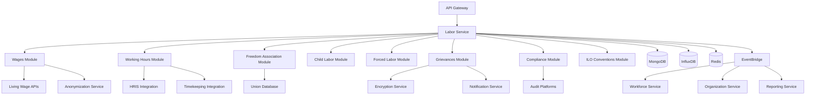

# Service Specification: Labor Service

## Service Overview

**Service Name**: Labor Service
**Port**: 3023
**Purpose**: Manages labor rights compliance, fair wages, working conditions, freedom of association, and ethical employment practices
**Domain**: Social - Labor Rights & Fair Employment
**Team Ownership**: Social Domain Team
**Phase**: 4 (Social Domain)
**Story Points**: 45

## 1. Functional Requirements

### 1.1 Core Features

#### Fair Wages & Living Wage Management
- Wage tracking by location, role, gender (ANONYMIZED aggregates only)
- Living wage benchmarking (MIT Living Wage, WageIndicator, Fair Wage Network)
- Wage gap analysis (actual vs. living wage vs. minimum wage)
- Minimum wage compliance tracking (local, regional, national laws)
- Overtime premium verification
- Wage theft prevention monitoring
- Equal pay for equal work verification (gender pay gap analysis)
- Wage distribution analysis (percentile analysis, Gini coefficient)
- Wage increase tracking (inflation-adjusted)
- Payment timeliness monitoring

#### Working Hours & Conditions
- Working hours tracking (regular, overtime, excessive overtime)
- ILO convention compliance (8-hour day, 48-hour week maximum)
- Rest period tracking (daily breaks, weekly rest days)
- Shift pattern analysis (night shifts, rotating shifts, split shifts)
- Work-life balance metrics (working hours per week, overtime frequency)
- Mandatory overtime flagging
- Working conditions assessments (heat stress, noise levels, ergonomics)
- Break compliance monitoring
- On-call time tracking
- Workload analysis (hours per task, productivity metrics)

#### Freedom of Association
- Union membership tracking (% unionized by facility/department)
- Collective bargaining agreement (CBA) coverage tracking
- Union election support and monitoring
- Anti-union discrimination prevention
- Works council representation
- Employee representative meetings and attendance
- Union grievance statistics
- Collective bargaining outcomes tracking
- Right to organize compliance
- Labor relations health metrics

#### Child Labor & Forced Labor Prevention
- Age verification processes and documentation
- Child labor risk assessment (by location, supplier, sector)
- Forced labor indicators detection (debt bondage, withheld wages, passport retention)
- Remediation program tracking
- Young worker protections (age 15-18, restricted tasks)
- Student worker compliance (work hour limits, educational requirements)
- Recruitment fee monitoring (zero-fee principle)
- Worker debt tracking
- Freedom of movement verification
- Voluntary employment confirmation

#### Grievance Mechanisms
- Grievance submission (anonymous, confidential, multi-channel)
- Grievance tracking and case management
- Remedy provision and effectiveness tracking
- Non-retaliation policies and monitoring
- Grievance analytics (trends, root causes, resolution times)
- Whistleblower protection
- Anonymous hotline management
- Grievance resolution satisfaction surveys
- Remediation cost tracking
- Systemic issue identification

#### Labor Compliance Monitoring
- Compliance audit scheduling and management
- Labor law violation tracking (local, national, international)
- Corrective action plan (CAP) management
- Third-party audit coordination (SA8000, SMETA, BSCI)
- Government labor inspection tracking
- Compliance scorecard (by facility, country, supplier)
- Legal requirement updates and notifications
- Labor law change impact assessments
- Compliance training tracking
- Violation remediation effectiveness

#### ILO Core Conventions Compliance
- Freedom of Association and Collective Bargaining (C87, C98)
- Forced Labor Elimination (C29, C105)
- Child Labor Abolition (C138, C182)
- Discrimination Elimination (C100, C111)
- Compliance tracking by convention and country
- Gap analysis and remediation planning
- ILO reporting and disclosure
- Ratification status tracking by country

### 1.2 API Endpoints

#### Fair Wages Endpoints
```yaml
GET /v1/wages/living-wage-gaps
  Query:
    - facilityId: string
    - country: string
    - region: string
    - department: string
    - role: string
    - timeframe: string (ISO8601 range)
  Response:
    - gaps: [{
        location: string,
        role: string,
        avgWage: number (ANONYMIZED - minimum group size 10),
        livingWage: number,
        gap: number,
        gapPercentage: number,
        employeeCount: number (aggregated only),
        source: string (MIT|WageIndicator|FairWage)
      }]
    - total: number
    - metadata: { aggregationLevel: string, minGroupSize: number }

POST /v1/wages/benchmarks
  Request:
    - country: string (required)
    - region: string (optional)
    - familySize: number (default: 4)
    - source: "MIT" | "WageIndicator" | "FairWage" (required)
    - effectiveDate: string (ISO8601)
  Response:
    - benchmark: {
        id: string,
        country: string,
        region: string,
        livingWage: number,
        currency: string,
        familySize: number,
        source: string,
        effectiveDate: string,
        lastUpdated: string
      }

GET /v1/wages/equal-pay-analysis
  Query:
    - facilityId: string
    - role: string
    - timeframe: string
  Response:
    - analysis: {
        role: string,
        genderPayGap: number (percentage),
        maleAvgWage: number (ANONYMIZED),
        femaleAvgWage: number (ANONYMIZED),
        adjustedGap: number (controlled for experience/tenure),
        significance: string (statistical significance),
        sampleSize: number,
        compliance: "compliant" | "at_risk" | "non_compliant"
      }

GET /v1/wages/minimum-wage-compliance
  Query:
    - country: string
    - region: string
    - timeframe: string
  Response:
    - compliance: [{
        location: string,
        minimumWage: number,
        avgLowestWage: number (ANONYMIZED),
        compliant: boolean,
        violationCount: number,
        affectedWorkers: number (aggregated),
        legalReference: string
      }]

POST /v1/wages/wage-theft-alert
  Request:
    - facilityId: string (required)
    - reportType: "delayed_payment" | "unpaid_overtime" | "unauthorized_deduction"
    - description: string
    - affectedWorkers: number
    - amount: number
    - currency: string
  Response:
    - alert: {
        id: string,
        status: "under_review",
        caseNumber: string,
        createdAt: string
      }
```

#### Working Hours Endpoints
```yaml
GET /v1/working-hours/overtime-analysis
  Query:
    - facilityId: string
    - department: string
    - timeframe: string (ISO8601 range)
    - threshold: number (hours per week, default: 48)
  Response:
    - analysis: {
        totalWorkers: number (aggregated),
        avgHoursPerWeek: number,
        overtimeHours: number,
        excessiveOvertimeWorkers: number (> threshold),
        complianceRate: number (percentage),
        trends: [{
          week: string,
          avgHours: number,
          overtimeHours: number
        }]
      }

GET /v1/working-hours/ilo-compliance
  Query:
    - facilityId: string
    - country: string
    - timeframe: string
  Response:
    - compliance: {
        convention: "ILO Hours of Work (Industry) Convention, 1919 (No. 1)",
        standards: {
          maxDailyHours: 8,
          maxWeeklyHours: 48,
          minWeeklyRest: 24
        },
        actual: {
          avgDailyHours: number,
          avgWeeklyHours: number,
          restDayCompliance: number (percentage)
        },
        compliant: boolean,
        violations: [{
          type: string,
          count: number,
          severity: "low" | "medium" | "high"
        }]
      }

POST /v1/working-hours/shift-patterns
  Request:
    - facilityId: string (required)
    - shiftType: "day" | "night" | "rotating" | "split" (required)
    - startTime: string (HH:mm)
    - endTime: string (HH:mm)
    - breakDuration: number (minutes)
    - rotationFrequency: string (for rotating shifts)
  Response:
    - pattern: {
        id: string,
        facilityId: string,
        shiftType: string,
        schedule: object,
        healthRiskAssessment: {
          nightShiftRisk: string,
          fatigueRisk: string,
          recommendations: string[]
        }
      }

GET /v1/working-hours/work-life-balance
  Query:
    - facilityId: string
    - timeframe: string
  Response:
    - metrics: {
        avgWorkHoursPerWeek: number,
        overtimeFrequency: number (percentage of workers),
        consecutiveWorkDays: number (average),
        restDayCompliance: number (percentage),
        workLifeBalanceScore: number (0-100),
        riskLevel: "low" | "medium" | "high"
      }
```

#### Freedom of Association Endpoints
```yaml
GET /v1/freedom-association/union-coverage
  Query:
    - facilityId: string
    - country: string
    - timeframe: string
  Response:
    - coverage: {
        totalWorkers: number (aggregated),
        unionizedWorkers: number,
        unionizationRate: number (percentage),
        cbasCoverage: number (percentage),
        activeUnions: number,
        worksCouncils: number,
        trends: [{
          period: string,
          unionizationRate: number
        }]
      }

POST /v1/freedom-association/union-elections
  Request:
    - facilityId: string (required)
    - electionType: "formation" | "leadership" | "cba_vote" (required)
    - scheduledDate: string (ISO8601)
    - eligibleVoters: number
    - unionName: string
  Response:
    - election: {
        id: string,
        status: "scheduled",
        electionDate: string,
        monitoringPlan: object
      }

GET /v1/freedom-association/anti-union-incidents
  Query:
    - facilityId: string
    - timeframe: string
    - incidentType: "discrimination" | "retaliation" | "interference"
  Response:
    - incidents: [{
        id: string,
        type: string,
        description: string,
        reportedDate: string,
        status: "investigating" | "resolved" | "escalated",
        remediation: string,
        preventiveMeasures: string[]
      }]
    - total: number

POST /v1/freedom-association/cba-registration
  Request:
    - facilityId: string (required)
    - unionName: string (required)
    - effectiveDate: string (ISO8601)
    - expirationDate: string (ISO8601)
    - coverage: {
        workers: number,
        departments: string[]
      }
    - keyProvisions: {
        wageIncreases: string,
        benefits: string[],
        workingConditions: string[]
      }
  Response:
    - cba: {
        id: string,
        status: "active",
        registrationDate: string
      }
```

#### Child Labor & Forced Labor Endpoints
```yaml
GET /v1/child-labor/risk-assessment
  Query:
    - facilityId: string
    - country: string
    - sector: string
  Response:
    - assessment: {
        riskLevel: "low" | "medium" | "high" | "critical",
        riskFactors: [{
          factor: string,
          score: number,
          description: string
        }],
        prevalenceRate: number (ILO country data),
        mitigationMeasures: string[],
        monitoringFrequency: "weekly" | "monthly" | "quarterly"
      }

POST /v1/child-labor/age-verification
  Request:
    - facilityId: string (required)
    - verificationType: "birth_certificate" | "national_id" | "school_records" (required)
    - verificationDate: string (ISO8601)
    - documentId: string
    - verifiedAge: number
    - verifier: string
  Response:
    - verification: {
        id: string,
        status: "verified" | "flagged",
        employmentEligibility: boolean,
        restrictions: string[] (if young worker age 15-18)
      }

GET /v1/forced-labor/indicators
  Query:
    - facilityId: string
    - supplierId: string
    - timeframe: string
  Response:
    - indicators: [{
        indicator: string,
        detected: boolean,
        severity: "low" | "medium" | "high" | "critical",
        description: string,
        affectedWorkers: number (aggregated),
        evidence: string[],
        status: "investigating" | "confirmed" | "resolved"
      }]
    - overallRisk: string
    - iloIndicators: {
        debtBondage: boolean,
        withheldWages: boolean,
        retainedDocuments: boolean,
        restrictedMovement: boolean,
        deceptiveRecruitment: boolean
      }

POST /v1/forced-labor/remediation-program
  Request:
    - facilityId: string (required)
    - indicatorId: string (required)
    - remediationType: "debt_repayment" | "document_return" | "wage_backpay" | "repatriation_support"
    - affectedWorkers: number
    - budget: number
    - currency: string
    - timeline: {
        startDate: string,
        endDate: string
      }
    - responsibleParty: string
  Response:
    - program: {
        id: string,
        status: "approved",
        milestones: [{
          milestone: string,
          targetDate: string
        }]
      }

GET /v1/young-workers/protections
  Query:
    - facilityId: string
    - ageRange: "15-16" | "16-18"
  Response:
    - protections: {
        restrictedTasks: string[],
        maxDailyHours: number,
        maxWeeklyHours: number,
        prohibitedShifts: string[] (e.g., night shifts),
        educationRequirements: string,
        parentalConsentRequired: boolean,
        healthScreeningRequired: boolean,
        complianceRate: number (percentage)
      }
```

#### Grievance Mechanism Endpoints
```yaml
POST /v1/grievances
  Request:
    - facilityId: string (optional - if anonymous)
    - reporterType: "worker" | "supplier" | "community" | "anonymous" (required)
    - category: "wage_dispute" | "discrimination" | "harassment" | "safety" | "forced_labor" | "other" (required)
    - description: string (required)
    - severityLevel: "low" | "medium" | "high" | "critical"
    - confidential: boolean (default: true)
    - contactMethod: string (if not anonymous)
    - evidenceUrls: string[] (S3 URLs - encrypted)
  Response:
    - grievance: {
        id: string,
        caseNumber: string (anonymized tracking ID),
        status: "submitted",
        confidentialityLevel: "anonymous" | "confidential" | "standard",
        acknowledgment: string,
        expectedResolutionDate: string,
        accessToken: string (for anonymous tracking)
      }

GET /v1/grievances/:grievanceId
  Headers:
    - X-Access-Token: string (for anonymous grievances)
  Response:
    - grievance: {
        caseNumber: string,
        status: "submitted" | "under_review" | "investigating" | "resolved" | "closed",
        category: string,
        submittedDate: string,
        lastUpdated: string,
        updates: [{
          date: string,
          status: string,
          notes: string (redacted for confidentiality)
        }],
        resolution: {
          outcome: string,
          remedyProvided: string,
          closedDate: string
        }
      }

PUT /v1/grievances/:grievanceId/resolve
  Request:
    - resolution: string (required)
    - remedyType: "compensation" | "policy_change" | "training" | "disciplinary_action" | "other"
    - remedyDescription: string
    - followUpRequired: boolean
    - preventiveMeasures: string[]
  Response:
    - grievance: {
        id: string,
        status: "resolved",
        resolvedDate: string,
        satisfactionSurveyUrl: string
      }

GET /v1/grievances/analytics
  Query:
    - facilityId: string
    - timeframe: string
    - category: string
  Response:
    - analytics: {
        totalGrievances: number,
        byCategory: object,
        bySeverity: object,
        avgResolutionTime: number (days),
        resolutionRate: number (percentage),
        retaliationIncidents: number,
        trends: [{
          period: string,
          count: number,
          category: string
        }],
        rootCauses: [{
          cause: string,
          frequency: number,
          recommendations: string[]
        }]
      }

GET /v1/grievances/non-retaliation-monitoring
  Query:
    - facilityId: string
    - timeframe: string
  Response:
    - monitoring: {
        grievancesReported: number,
        retaliationClaims: number,
        retaliationRate: number (percentage),
        investigatedCases: number,
        confirmedRetaliations: number,
        disciplinaryActions: number,
        policyEffectiveness: "effective" | "needs_improvement"
      }
```

#### Labor Compliance Endpoints
```yaml
GET /v1/compliance/audits
  Query:
    - facilityId: string
    - auditType: "SA8000" | "SMETA" | "BSCI" | "FLA" | "government" | "internal"
    - status: "scheduled" | "in_progress" | "completed"
    - timeframe: string
  Response:
    - audits: [{
        id: string,
        type: string,
        facility: string,
        auditor: string,
        scheduledDate: string,
        completionDate: string,
        status: string,
        findings: {
          critical: number,
          major: number,
          minor: number
        },
        overallScore: number,
        certification: {
          granted: boolean,
          validUntil: string
        }
      }]
    - total: number

POST /v1/compliance/audits
  Request:
    - facilityId: string (required)
    - auditType: "SA8000" | "SMETA" | "BSCI" | "FLA" | "government" | "internal" (required)
    - auditor: string (required)
    - scheduledDate: string (ISO8601, required)
    - scope: string[] (audit areas)
    - standards: string[] (compliance standards)
  Response:
    - audit: {
        id: string,
        status: "scheduled",
        auditPlan: object,
        documentsRequired: string[]
      }

GET /v1/compliance/violations
  Query:
    - facilityId: string
    - violationType: "wage" | "hours" | "child_labor" | "forced_labor" | "discrimination" | "safety"
    - severity: "critical" | "major" | "minor"
    - status: "open" | "remediated" | "closed"
    - timeframe: string
  Response:
    - violations: [{
        id: string,
        type: string,
        severity: string,
        description: string,
        legalReference: string,
        detectionDate: string,
        affectedWorkers: number (aggregated),
        status: string,
        cap: {
          id: string,
          actions: string[],
          targetDate: string,
          completionRate: number
        }
      }]
    - total: number

POST /v1/compliance/corrective-action-plans
  Request:
    - violationId: string (required)
    - actions: [{
        action: string,
        responsible: string,
        targetDate: string,
        budget: number
      }] (required)
    - rootCauseAnalysis: string
    - preventiveMeasures: string[]
    - verificationMethod: string
  Response:
    - cap: {
        id: string,
        status: "approved",
        approvedBy: string,
        approvedDate: string,
        milestones: object[]
      }

GET /v1/compliance/scorecard
  Query:
    - facilityId: string
    - country: string
    - timeframe: string
  Response:
    - scorecard: {
        overallScore: number (0-100),
        categories: {
          fairWages: number,
          workingHours: number,
          freedomOfAssociation: number,
          childLabor: number,
          forcedLabor: number,
          grievanceMechanism: number,
          audit: number
        },
        benchmark: {
          industryAvg: number,
          topPerformer: number,
          minimumAcceptable: number
        },
        trend: "improving" | "stable" | "declining",
        recommendations: string[]
      }

GET /v1/compliance/legal-updates
  Query:
    - country: string
    - category: "wages" | "hours" | "labor_rights" | "all"
    - effectiveDate: string (ISO8601 range)
  Response:
    - updates: [{
        id: string,
        country: string,
        category: string,
        title: string,
        summary: string,
        effectiveDate: string,
        impactAssessment: {
          affectedFacilities: number,
          changeRequired: boolean,
          deadline: string,
          costEstimate: number
        },
        source: string,
        referenceUrl: string
      }]
```

#### ILO Conventions Endpoints
```yaml
GET /v1/ilo-conventions/compliance
  Query:
    - country: string
    - convention: "C87" | "C98" | "C29" | "C105" | "C138" | "C182" | "C100" | "C111" | "all"
    - facilityId: string
  Response:
    - compliance: {
        country: string,
        ratificationStatus: {
          C87: boolean, // Freedom of Association
          C98: boolean, // Collective Bargaining
          C29: boolean, // Forced Labour
          C105: boolean, // Abolition of Forced Labour
          C138: boolean, // Minimum Age
          C182: boolean, // Worst Forms of Child Labour
          C100: boolean, // Equal Remuneration
          C111: boolean  // Discrimination (Employment)
        },
        complianceByConvention: [{
          convention: string,
          title: string,
          ratified: boolean,
          compliant: boolean,
          gaps: [{
            requirement: string,
            currentState: string,
            gap: string,
            remediation: string
          }],
          score: number (0-100)
        }],
        overallCompliance: number (percentage)
      }

GET /v1/ilo-conventions/gap-analysis
  Query:
    - facilityId: string
    - convention: string (C87|C98|C29|C105|C138|C182|C100|C111)
  Response:
    - gapAnalysis: {
        convention: string,
        requirements: [{
          requirement: string,
          description: string,
          currentCompliance: "compliant" | "partial" | "non_compliant",
          evidence: string[],
          gaps: string[],
          priority: "critical" | "high" | "medium" | "low",
          remediationPlan: {
            actions: string[],
            timeline: string,
            budget: number,
            responsible: string
          }
        }],
        overallGap: number (percentage),
        nextSteps: string[]
      }

POST /v1/ilo-conventions/reporting
  Request:
    - country: string (required)
    - reportingPeriod: {
        startDate: string,
        endDate: string
      } (required)
    - conventions: string[] (required)
    - facilities: string[]
  Response:
    - report: {
        id: string,
        status: "generated",
        reportUrl: string (S3 URL),
        format: "PDF",
        summary: {
          conventionsCovered: number,
          facilitiesAssessed: number,
          overallCompliance: number,
          criticalFindings: number,
          recommendations: string[]
        }
      }
```

### 1.3 Business Rules

#### Fair Wages Rules
1. **Living Wage Compliance**:
   - Living wage benchmarks updated quarterly
   - Minimum gap reporting threshold: 10% below living wage
   - Wage gap reduction plans required if gap > 20%
   - Gender pay gap > 5% triggers immediate review
   - All wage data MUST be anonymized (minimum group size: 10)

2. **Minimum Wage Compliance**:
   - Automatic tracking of local minimum wage laws
   - Compliance monitoring in real-time (monthly payroll integration)
   - Violation alerts within 24 hours of detection
   - Backpay calculation and remediation tracking

3. **Equal Pay Requirements**:
   - Statistical significance testing (p < 0.05) for pay gap analysis
   - Control variables: experience, tenure, education, performance
   - Adjusted pay gap > 3% requires corrective action plan
   - Annual equal pay audits mandatory

4. **Wage Theft Prevention**:
   - Payment delays > 7 days trigger alerts
   - Unauthorized deductions > 5% flagged for review
   - Unpaid overtime automatically calculated and tracked
   - Worker complaint resolution within 14 days

#### Working Hours Rules
1. **ILO Compliance**:
   - Maximum 8 hours per day, 48 hours per week (ILO Convention No. 1)
   - Overtime limit: 12 hours per week maximum
   - Excessive overtime (> 60 hours/week) triggers critical alert
   - Minimum 24 consecutive hours rest per week

2. **Shift Patterns**:
   - Night shifts (22:00-06:00) limited to 8 hours
   - Rotating shifts require minimum 11 hours rest between shifts
   - Split shifts require health risk assessment
   - Consecutive night shifts limited to 7 days

3. **Rest Periods**:
   - Minimum 30-minute break for shifts > 6 hours
   - Daily rest: 11 consecutive hours between shifts
   - Weekly rest: 24 consecutive hours minimum
   - Break compliance rate > 95% required

4. **Work-Life Balance**:
   - Work-life balance score calculated monthly
   - Score < 60/100 triggers intervention
   - Consecutive work days > 12 requires approval and monitoring

#### Freedom of Association Rules
1. **Union Rights**:
   - Union formation requests processed within 7 days
   - Anti-union discrimination incidents investigated within 48 hours
   - Union meeting space and time provided (as per local law)
   - Union dues deduction supported (if requested)

2. **Collective Bargaining**:
   - CBA coverage target: > 50% of workforce (where applicable)
   - Good faith bargaining required (no delay tactics)
   - CBA implementation within 30 days of signing
   - CBA compliance monitored quarterly

3. **Works Councils**:
   - Works council elections supported annually
   - Worker representative meetings: minimum quarterly
   - Information disclosure to worker representatives (financial, operational)

4. **Non-Retaliation**:
   - Zero tolerance for retaliation against union members
   - Retaliation claims investigated within 72 hours
   - Confirmed retaliation results in disciplinary action

#### Child Labor & Forced Labor Rules
1. **Age Verification**:
   - Mandatory age verification before employment
   - Acceptable documents: birth certificate, national ID, school records
   - Young workers (15-18) tracked separately
   - Age verification audit trail maintained for 5 years

2. **Child Labor Prevention**:
   - Zero tolerance for employment of children < 15 years (or local minimum age if higher)
   - High-risk sectors (agriculture, manufacturing) require enhanced screening
   - Child labor risk assessments: quarterly in high-risk areas
   - Remediation programs must include education support

3. **Young Worker Protections**:
   - Hazardous work prohibited for workers < 18
   - Maximum hours: 8 hours/day, 40 hours/week for workers < 18
   - Night shifts prohibited for workers < 18
   - Education programs supported (flexible scheduling)

4. **Forced Labor Prevention**:
   - Zero recruitment fees (direct or indirect)
   - Worker identity documents retained by worker only
   - Freedom of movement verified (no locked gates, restricted movement)
   - Voluntary employment confirmed (written contracts, termination freedom)
   - Debt bondage prohibited (loans, wage advances monitored)

5. **ILO Indicators of Forced Labor** (all must be absent):
   - Abuse of vulnerability
   - Deception
   - Restriction of movement
   - Isolation
   - Physical and sexual violence
   - Intimidation and threats
   - Retention of identity documents
   - Withholding of wages
   - Debt bondage
   - Abusive working and living conditions
   - Excessive overtime

#### Grievance Mechanism Rules
1. **Accessibility**:
   - Multiple channels: hotline, web portal, in-person, suggestion boxes
   - Anonymous submission supported
   - Multilingual support (local languages)
   - Accessible to workers with disabilities

2. **Confidentiality**:
   - Grievances encrypted at rest and in transit
   - Access restricted to authorized personnel only
   - Anonymity preserved throughout process
   - No PII disclosed without consent

3. **Response Times**:
   - Acknowledgment within 24 hours
   - Initial assessment within 3 business days
   - Investigation completion: 14 days for low/medium, 7 days for high/critical
   - Resolution target: 30 days for 90% of cases

4. **Non-Retaliation**:
   - Non-retaliation policy communicated to all workers
   - Retaliation monitoring: 6 months post-grievance
   - Confirmed retaliation results in immediate disciplinary action
   - Whistleblower protection guaranteed

5. **Remediation Effectiveness**:
   - Satisfaction surveys sent after resolution
   - Satisfaction target: > 70%
   - Repeat grievances on same issue trigger systemic review
   - Root cause analysis for all critical grievances

#### Labor Compliance Rules
1. **Audit Frequency**:
   - SA8000/SMETA audits: annual for certified facilities
   - Internal audits: quarterly for high-risk facilities, bi-annual for low-risk
   - Government inspections: as required by law
   - Surprise audits: 10% of all audits

2. **Violation Severity**:
   - Critical: child labor, forced labor, serious safety violations
   - Major: wage violations, excessive overtime, discrimination
   - Minor: documentation gaps, training deficiencies
   - Critical violations require immediate remediation (< 7 days)

3. **Corrective Action Plans**:
   - CAP required for all major and critical violations
   - Root cause analysis mandatory for critical violations
   - CAP verification: on-site for critical, documentation review for major/minor
   - CAP completion deadline: 30 days for critical, 90 days for major

4. **Compliance Scoring**:
   - Scorecard updated monthly
   - Minimum acceptable score: 70/100
   - Score < 70 triggers improvement plan
   - Score < 50 triggers escalation to senior management

#### ILO Conventions Compliance Rules
1. **Fundamental Conventions** (8 core conventions - all mandatory):
   - Freedom of Association and Collective Bargaining: C87, C98
   - Elimination of Forced Labor: C29, C105
   - Abolition of Child Labor: C138, C182
   - Elimination of Discrimination: C100, C111

2. **Compliance Monitoring**:
   - Gap analysis conducted annually
   - Compliance rate > 95% required for each convention
   - Non-compliance triggers immediate remediation plan
   - Remediation progress tracked monthly

3. **Reporting Requirements**:
   - Annual ILO compliance report
   - Country-specific compliance tracking (based on ratification status)
   - Stakeholder disclosure (investors, customers, regulators)

### 1.4 Error Handling

```yaml
Error Responses:
  400 Bad Request:
    - INVALID_WAGE_DATA
    - MISSING_AGE_VERIFICATION
    - INVALID_TIMEFRAME
    - INSUFFICIENT_SAMPLE_SIZE (for anonymized wage data)
    - INVALID_GRIEVANCE_CATEGORY

  401 Unauthorized:
    - INVALID_ACCESS_TOKEN (for anonymous grievance tracking)
    - SESSION_EXPIRED
    - INSUFFICIENT_PERMISSIONS

  403 Forbidden:
    - PII_ACCESS_DENIED (individual wage data)
    - CONFIDENTIAL_GRIEVANCE_ACCESS_DENIED
    - ANONYMIZED_DATA_ONLY

  404 Not Found:
    - LIVING_WAGE_BENCHMARK_NOT_FOUND
    - FACILITY_NOT_FOUND
    - GRIEVANCE_NOT_FOUND
    - AUDIT_NOT_FOUND

  409 Conflict:
    - WAGE_DATA_ALREADY_EXISTS
    - AUDIT_ALREADY_SCHEDULED
    - CBA_OVERLAP

  422 Unprocessable Entity:
    - WAGE_GAP_CALCULATION_FAILED
    - ANONYMIZATION_FAILED (group size < 10)
    - STATISTICAL_SIGNIFICANCE_NOT_MET

  429 Too Many Requests:
    - RATE_LIMIT_EXCEEDED

  500 Internal Server Error:
    - LIVING_WAGE_API_UNAVAILABLE
    - ENCRYPTION_FAILED (for grievances)
    - REPORTING_GENERATION_FAILED
```

## 2. Data Model

### 2.1 MongoDB Collections

#### wages Collection
```javascript
{
  _id: ObjectId,

  // Aggregation metadata (NO individual wages)
  aggregation: {
    facilityId: ObjectId,
    country: String,
    region: String,
    department: String,
    role: String,
    period: {
      startDate: Date (indexed),
      endDate: Date (indexed)
    },
    groupSize: Number, // MUST be >= 10 for privacy
    anonymizationLevel: String ("facility" | "department" | "role")
  },

  // Aggregated wage statistics ONLY
  statistics: {
    avgWage: Number,
    medianWage: Number,
    minWage: Number,
    maxWage: Number,
    stdDeviation: Number,
    percentiles: {
      p10: Number,
      p25: Number,
      p75: Number,
      p90: Number
    },
    currency: String,
    frequency: String ("hourly" | "monthly" | "annual")
  },

  // Gender breakdown (aggregated only, minimum 5 per gender)
  genderBreakdown: {
    male: {
      count: Number, // Aggregated count
      avgWage: Number,
      medianWage: Number
    },
    female: {
      count: Number,
      avgWage: Number,
      medianWage: Number
    },
    other: {
      count: Number,
      avgWage: Number,
      medianWage: Number
    },
    genderPayGap: Number (percentage),
    adjustedPayGap: Number // Controlled for experience/tenure
  },

  // Benchmarks
  benchmarks: {
    livingWage: Number,
    livingWageSource: String ("MIT" | "WageIndicator" | "FairWage"),
    minimumWage: Number,
    minimumWageSource: String,
    industryAverage: Number
  },

  // Compliance
  compliance: {
    livingWageGap: Number (percentage),
    minimumWageCompliant: Boolean,
    equalPayCompliant: Boolean,
    wageTheftIncidents: Number
  },

  metadata: {
    createdAt: Date (indexed),
    updatedAt: Date,
    dataSource: String ("payroll" | "survey" | "manual"),
    dataQuality: String ("high" | "medium" | "low"),
    verifiedBy: ObjectId,
    verifiedAt: Date
  }
}

// Indexes
- aggregation.period.startDate: -1, aggregation.period.endDate: -1
- aggregation.facilityId: 1, aggregation.period.startDate: -1
- aggregation.country: 1, aggregation.role: 1
- metadata.createdAt: -1

// CRITICAL: NO individual wage data stored
// All queries enforce minimum group size of 10
```

#### living_wage_benchmarks Collection
```javascript
{
  _id: ObjectId,

  location: {
    country: String (indexed),
    region: String,
    city: String,
    geoCoordinates: {
      latitude: Number,
      longitude: Number
    }
  },

  benchmark: {
    livingWage: Number,
    currency: String,
    frequency: String ("hourly" | "monthly" | "annual"),
    familySize: Number (default: 4),
    assumptions: {
      adults: Number,
      children: Number,
      workingAdults: Number
    }
  },

  source: {
    provider: String ("MIT" | "WageIndicator" | "FairWage" | "WageIndicatorFoundation" | "AnkerMethodology"),
    methodology: String,
    publicationDate: Date,
    dataYear: Number,
    sourceUrl: String,
    credibility: String ("verified" | "peer_reviewed" | "estimated")
  },

  components: {
    food: Number,
    housing: Number,
    transportation: Number,
    healthcare: Number,
    education: Number,
    childcare: Number,
    clothing: Number,
    other: Number
  },

  effectiveDate: Date (indexed),
  expirationDate: Date,

  metadata: {
    createdAt: Date,
    updatedAt: Date,
    importedBy: ObjectId,
    lastVerified: Date
  }
}

// Indexes
- location.country: 1, location.region: 1, effectiveDate: -1
- source.provider: 1, effectiveDate: -1
- effectiveDate: 1, expirationDate: 1
```

#### working_hours Collection
```javascript
{
  _id: ObjectId,

  // Aggregation metadata (NO individual hours)
  aggregation: {
    facilityId: ObjectId,
    department: String,
    shiftType: String ("day" | "night" | "rotating" | "split"),
    period: {
      startDate: Date (indexed),
      endDate: Date (indexed),
      aggregationType: String ("weekly" | "monthly")
    },
    groupSize: Number // MUST be >= 10
  },

  // Aggregated hours statistics
  statistics: {
    avgRegularHours: Number,
    avgOvertimeHours: Number,
    avgTotalHours: Number,
    maxTotalHours: Number,
    workersExceedingThreshold: Number, // > 48 hours/week
    percentileHours: {
      p50: Number,
      p75: Number,
      p90: Number,
      p95: Number
    }
  },

  // Rest periods (aggregated)
  restPeriods: {
    avgDailyRestHours: Number,
    avgWeeklyRestHours: Number,
    breakComplianceRate: Number (percentage),
    restDayComplianceRate: Number (percentage)
  },

  // ILO compliance
  iloCompliance: {
    maxDailyHours: Number (standard: 8),
    maxWeeklyHours: Number (standard: 48),
    minWeeklyRest: Number (standard: 24),
    compliant: Boolean,
    violations: [{
      violationType: String,
      count: Number,
      severity: String
    }]
  },

  // Work-life balance metrics
  workLifeBalance: {
    avgConsecutiveWorkDays: Number,
    avgRestDaysPerMonth: Number,
    overtimeFrequency: Number (percentage of workers),
    score: Number (0-100),
    riskLevel: String ("low" | "medium" | "high")
  },

  metadata: {
    createdAt: Date (indexed),
    updatedAt: Date,
    dataSource: String ("timekeeping" | "manual"),
    dataQuality: String
  }
}

// Indexes
- aggregation.facilityId: 1, aggregation.period.startDate: -1
- aggregation.period.startDate: -1, aggregation.period.endDate: -1
- iloCompliance.compliant: 1
- metadata.createdAt: -1
```

#### freedom_of_association Collection
```javascript
{
  _id: ObjectId,

  facility: {
    facilityId: ObjectId (indexed),
    country: String,
    sector: String
  },

  // Union membership (aggregated only)
  unionMembership: {
    period: {
      startDate: Date (indexed),
      endDate: Date
    },
    totalWorkers: Number, // Aggregated count
    unionizedWorkers: Number, // Aggregated count
    unionizationRate: Number (percentage),
    activeUnions: [{
      unionName: String,
      memberCount: Number, // Aggregated
      cbaStatus: String ("active" | "negotiating" | "expired")
    }],
    trends: [{
      month: String,
      unionizationRate: Number
    }]
  },

  // Collective bargaining agreements
  cbas: [{
    cbaId: ObjectId,
    unionName: String,
    effectiveDate: Date,
    expirationDate: Date,
    coverage: {
      workers: Number, // Aggregated count
      departments: [String],
      coverageRate: Number (percentage)
    },
    keyProvisions: {
      wageIncreases: String,
      benefits: [String],
      workingConditions: [String],
      grievanceProcedure: String
    },
    status: String ("active" | "negotiating" | "expired")
  }],

  // Works councils
  worksCouncils: [{
    councilName: String,
    establishedDate: Date,
    representatives: Number,
    meetingFrequency: String,
    lastMeetingDate: Date,
    topicsDiscussed: [String]
  }],

  // Anti-union incidents
  incidents: [{
    incidentId: ObjectId,
    type: String ("discrimination" | "retaliation" | "interference" | "intimidation"),
    reportedDate: Date,
    description: String,
    status: String ("investigating" | "resolved" | "escalated"),
    remediation: String,
    preventiveMeasures: [String],
    resolvedDate: Date
  }],

  // Compliance
  compliance: {
    iloC87Compliant: Boolean, // Freedom of Association
    iloC98Compliant: Boolean, // Collective Bargaining
    incidentRate: Number (per 1000 workers),
    remediationRate: Number (percentage)
  },

  metadata: {
    createdAt: Date,
    updatedAt: Date,
    dataSource: String,
    verifiedBy: ObjectId,
    verifiedAt: Date
  }
}

// Indexes
- facility.facilityId: 1, unionMembership.period.startDate: -1
- facility.country: 1
- cbas.status: 1, cbas.expirationDate: 1
- incidents.status: 1, incidents.reportedDate: -1
```

#### child_labor_assessments Collection
```javascript
{
  _id: ObjectId,

  facility: {
    facilityId: ObjectId (indexed),
    country: String,
    sector: String
  },

  // Age verification records
  ageVerification: {
    totalVerifications: Number,
    verificationType: [{
      type: String ("birth_certificate" | "national_id" | "school_records"),
      count: Number
    }],
    verificationRate: Number (percentage),
    flaggedCases: Number,
    resolvedCases: Number
  },

  // Risk assessment
  riskAssessment: {
    assessmentDate: Date (indexed),
    riskLevel: String ("low" | "medium" | "high" | "critical"),
    riskFactors: [{
      factor: String,
      score: Number (0-10),
      description: String,
      source: String
    }],
    countryPrevalence: Number, // ILO country data
    sectorPrevalence: Number,
    supplyChainRisk: Number,
    mitigationMeasures: [String],
    monitoringFrequency: String ("weekly" | "monthly" | "quarterly")
  },

  // Young workers (age 15-18) - aggregated only
  youngWorkers: {
    count: Number, // Aggregated count
    ageDistribution: {
      age15_16: Number,
      age16_18: Number
    },
    protections: {
      restrictedTasks: [String],
      maxDailyHours: Number,
      maxWeeklyHours: Number,
      prohibitedShifts: [String],
      educationSupport: Boolean,
      complianceRate: Number (percentage)
    }
  },

  // Child labor incidents (ZERO tolerance)
  incidents: [{
    incidentId: ObjectId,
    detectionDate: Date,
    age: Number,
    circumstances: String,
    immediatAction: String, // "employment_terminated" + support
    remediation: {
      educationSupport: Boolean,
      familySupport: Boolean,
      costCovered: Number,
      duration: String
    },
    rootCause: String,
    preventiveMeasures: [String],
    reportedToAuthorities: Boolean,
    reportDate: Date
  }],

  // ILO Compliance
  iloCompliance: {
    C138Compliant: Boolean, // Minimum Age Convention
    C182Compliant: Boolean, // Worst Forms of Child Labour
    minimumAge: Number, // Country-specific
    hazardousWorkAge: Number, // Usually 18
    violations: Number
  },

  metadata: {
    createdAt: Date,
    updatedAt: Date,
    assessedBy: ObjectId,
    nextAssessmentDate: Date
  }
}

// Indexes
- facility.facilityId: 1, riskAssessment.assessmentDate: -1
- facility.country: 1, riskAssessment.riskLevel: 1
- incidents.detectionDate: -1
- iloCompliance.C138Compliant: 1, iloCompliance.C182Compliant: 1
```

#### forced_labor_indicators Collection
```javascript
{
  _id: ObjectId,

  facility: {
    facilityId: ObjectId (indexed),
    supplierId: ObjectId,
    country: String,
    sector: String
  },

  // ILO 11 Indicators of Forced Labor
  indicators: {
    assessmentDate: Date (indexed),

    // Indicator 1: Abuse of vulnerability
    abuseOfVulnerability: {
      detected: Boolean,
      evidence: [String],
      affectedWorkers: Number (aggregated),
      severity: String ("low" | "medium" | "high" | "critical")
    },

    // Indicator 2: Deception
    deception: {
      detected: Boolean,
      evidence: [String],
      affectedWorkers: Number,
      severity: String
    },

    // Indicator 3: Restriction of movement
    restrictionOfMovement: {
      detected: Boolean,
      evidence: [String],
      affectedWorkers: Number,
      severity: String
    },

    // Indicator 4: Isolation
    isolation: {
      detected: Boolean,
      evidence: [String],
      affectedWorkers: Number,
      severity: String
    },

    // Indicator 5: Physical and sexual violence
    violence: {
      detected: Boolean,
      evidence: [String],
      affectedWorkers: Number,
      severity: String
    },

    // Indicator 6: Intimidation and threats
    intimidation: {
      detected: Boolean,
      evidence: [String],
      affectedWorkers: Number,
      severity: String
    },

    // Indicator 7: Retention of identity documents
    documentRetention: {
      detected: Boolean,
      evidence: [String],
      affectedWorkers: Number,
      severity: String
    },

    // Indicator 8: Withholding of wages
    wageWithholding: {
      detected: Boolean,
      evidence: [String],
      affectedWorkers: Number,
      amountWithheld: Number,
      severity: String
    },

    // Indicator 9: Debt bondage
    debtBondage: {
      detected: Boolean,
      evidence: [String],
      affectedWorkers: Number,
      totalDebt: Number,
      severity: String
    },

    // Indicator 10: Abusive working and living conditions
    abusiveConditions: {
      detected: Boolean,
      evidence: [String],
      affectedWorkers: Number,
      severity: String
    },

    // Indicator 11: Excessive overtime
    excessiveOvertime: {
      detected: Boolean,
      evidence: [String],
      affectedWorkers: Number,
      severity: String
    }
  },

  // Overall risk assessment
  overallAssessment: {
    riskLevel: String ("low" | "medium" | "high" | "critical"),
    indicatorsDetected: Number (count),
    criticalIndicators: [String],
    status: String ("investigating" | "confirmed" | "remediated" | "closed")
  },

  // Remediation programs
  remediation: [{
    programId: ObjectId,
    remediationType: String ("debt_repayment" | "document_return" | "wage_backpay" | "repatriation_support" | "other"),
    affectedWorkers: Number,
    budget: Number,
    currency: String,
    timeline: {
      startDate: Date,
      endDate: Date
    },
    responsibleParty: String,
    milestones: [{
      milestone: String,
      targetDate: Date,
      completedDate: Date,
      status: String
    }],
    effectiveness: String ("effective" | "partially_effective" | "ineffective")
  }],

  // Recruitment practices
  recruitment: {
    recruitmentFees: {
      charged: Boolean,
      amount: Number,
      reimbursed: Boolean,
      reimbursementDate: Date
    },
    contracts: {
      writtenContracts: Boolean,
      inWorkerLanguage: Boolean,
      termsUnderstood: Boolean
    },
    voluntaryEmployment: {
      verified: Boolean,
      verificationMethod: String,
      verificationDate: Date
    }
  },

  // ILO Compliance
  iloCompliance: {
    C29Compliant: Boolean, // Forced Labour Convention
    C105Compliant: Boolean, // Abolition of Forced Labour Convention
    violations: Number
  },

  metadata: {
    createdAt: Date,
    updatedAt: Date,
    assessedBy: ObjectId,
    nextAssessmentDate: Date,
    reportedToAuthorities: Boolean,
    reportDate: Date
  }
}

// Indexes
- facility.facilityId: 1, indicators.assessmentDate: -1
- facility.supplierId: 1
- overallAssessment.riskLevel: 1
- indicators.assessmentDate: -1
- iloCompliance.C29Compliant: 1, iloCompliance.C105Compliant: 1
```

#### grievances Collection
```javascript
{
  _id: ObjectId,
  caseNumber: String (unique, indexed), // Anonymized tracking ID

  submission: {
    facilityId: ObjectId, // Optional (for anonymous)
    reporterType: String ("worker" | "supplier" | "community" | "anonymous"),
    submissionDate: Date (indexed),
    submissionChannel: String ("hotline" | "web_portal" | "in_person" | "suggestion_box" | "email"),
    language: String
  },

  details: {
    category: String ("wage_dispute" | "discrimination" | "harassment" | "safety" | "forced_labor" | "child_labor" | "freedom_association" | "working_hours" | "other"),
    subCategory: String,
    description: String (encrypted), // PII encrypted
    severityLevel: String ("low" | "medium" | "high" | "critical"),
    evidenceUrls: [String] // S3 URLs - encrypted
  },

  confidentiality: {
    level: String ("anonymous" | "confidential" | "standard"),
    accessToken: String (hashed), // For anonymous tracking
    accessRestricted: Boolean,
    authorizedViewers: [ObjectId] // User IDs
  },

  contactInfo: { // Encrypted, optional for anonymous
    name: String (encrypted),
    email: String (encrypted),
    phone: String (encrypted),
    preferredContactMethod: String
  },

  status: {
    current: String ("submitted" | "acknowledged" | "under_review" | "investigating" | "resolved" | "closed"),
    statusHistory: [{
      status: String,
      date: Date,
      updatedBy: ObjectId,
      notes: String
    }],
    expectedResolutionDate: Date,
    actualResolutionDate: Date
  },

  investigation: {
    assignedTo: ObjectId,
    assignedDate: Date,
    investigationNotes: [String] (encrypted),
    interviewsCompleted: Number,
    evidenceCollected: [String],
    findingSummary: String (encrypted)
  },

  resolution: {
    outcome: String ("substantiated" | "unsubstantiated" | "partially_substantiated" | "withdrawn"),
    remedyType: String ("compensation" | "policy_change" | "training" | "disciplinary_action" | "apology" | "other"),
    remedyDescription: String (encrypted),
    compensationAmount: Number,
    compensationCurrency: String,
    policyChanges: [String],
    disciplinaryActions: [String],
    preventiveMeasures: [String],
    resolutionDate: Date
  },

  satisfaction: {
    surveySent: Boolean,
    surveyCompleted: Boolean,
    satisfactionScore: Number (1-5),
    feedback: String (encrypted)
  },

  nonRetaliation: {
    monitoringActive: Boolean,
    monitoringEndDate: Date, // 6 months after resolution
    retaliationClaimed: Boolean,
    retaliationInvestigated: Boolean,
    retaliationConfirmed: Boolean
  },

  metadata: {
    createdAt: Date (indexed),
    updatedAt: Date,
    handlingTime: Number (days),
    escalated: Boolean,
    escalationReason: String,
    dataRetentionDate: Date // Auto-delete after retention period
  }
}

// Indexes
- caseNumber: unique
- submission.facilityId: 1, submission.submissionDate: -1
- status.current: 1, submission.submissionDate: -1
- details.category: 1, details.severityLevel: 1
- metadata.createdAt: -1
- confidentiality.accessToken: hashed (for anonymous tracking)

// TTL: Auto-delete after data retention period (e.g., 7 years)

// CRITICAL SECURITY:
// - PII fields encrypted at rest
// - Access controls enforced
// - Audit trail for all access
// - Anonymous grievances never linked to individuals
```

#### labor_audits Collection
```javascript
{
  _id: ObjectId,

  audit: {
    auditType: String ("SA8000" | "SMETA" | "BSCI" | "FLA" | "government" | "internal"),
    auditStandard: String,
    auditScope: [String], // Areas covered
    scheduledDate: Date (indexed),
    completionDate: Date,
    status: String ("scheduled" | "in_progress" | "completed" | "cancelled")
  },

  facility: {
    facilityId: ObjectId (indexed),
    facilityName: String,
    country: String,
    sector: String
  },

  auditor: {
    auditorName: String,
    auditorOrganization: String,
    leadAuditorCertification: String,
    auditTeamSize: Number,
    auditDuration: Number (days)
  },

  findings: {
    critical: [{
      finding: String,
      standard: String,
      evidence: String,
      affectedWorkers: Number,
      legalViolation: Boolean,
      legalReference: String
    }],
    major: [{
      finding: String,
      standard: String,
      evidence: String
    }],
    minor: [{
      finding: String,
      standard: String,
      evidence: String
    }],
    observations: [String],

    summary: {
      criticalCount: Number,
      majorCount: Number,
      minorCount: Number,
      observationsCount: Number
    }
  },

  scoring: {
    overallScore: Number (0-100),
    categoryScores: {
      childLabor: Number,
      forcedLabor: Number,
      healthSafety: Number,
      freedomAssociation: Number,
      discrimination: Number,
      disciplinaryPractices: Number,
      workingHours: Number,
      compensation: Number,
      managementSystems: Number
    }
  },

  certification: {
    granted: Boolean,
    certificateNumber: String,
    issueDate: Date,
    validUntil: Date,
    conditions: [String],
    surveillanceAuditsRequired: Boolean,
    nextAuditDate: Date
  },

  correctiveActions: [{
    capId: ObjectId,
    finding: String,
    actions: [String],
    responsible: String,
    targetDate: Date,
    completionDate: Date,
    status: String ("pending" | "in_progress" | "completed" | "verified"),
    verificationDate: Date,
    verifiedBy: String
  }],

  reportUrls: {
    fullReport: String (S3 URL),
    executiveSummary: String (S3 URL),
    capReport: String (S3 URL)
  },

  metadata: {
    createdAt: Date,
    updatedAt: Date,
    uploadedBy: ObjectId,
    accessLevel: String ("public" | "internal" | "confidential")
  }
}

// Indexes
- facility.facilityId: 1, audit.scheduledDate: -1
- audit.auditType: 1, audit.status: 1
- certification.validUntil: 1
- findings.summary.criticalCount: 1
- metadata.createdAt: -1
```

#### labor_violations Collection
```javascript
{
  _id: ObjectId,

  violation: {
    violationType: String ("wage" | "hours" | "child_labor" | "forced_labor" | "discrimination" | "freedom_association" | "safety" | "other"),
    subType: String,
    severity: String ("critical" | "major" | "minor"),
    description: String,
    legalReference: String, // Local law reference
    detectionDate: Date (indexed),
    detectionMethod: String ("audit" | "grievance" | "self_reported" | "inspection")
  },

  facility: {
    facilityId: ObjectId (indexed),
    country: String,
    sector: String
  },

  impact: {
    affectedWorkers: Number (aggregated),
    financialImpact: Number,
    currency: String,
    reputationalRisk: String ("low" | "medium" | "high"),
    legalRisk: String ("low" | "medium" | "high")
  },

  status: {
    current: String ("open" | "investigating" | "remediation_in_progress" | "remediated" | "closed"),
    openedDate: Date,
    closedDate: Date,
    statusHistory: [{
      status: String,
      date: Date,
      updatedBy: ObjectId,
      notes: String
    }]
  },

  correctiveActionPlan: {
    capId: ObjectId,
    rootCauseAnalysis: String,
    immediateActions: [String],
    correctiveActions: [{
      action: String,
      responsible: String,
      targetDate: Date,
      completionDate: Date,
      status: String,
      budget: Number
    }],
    preventiveMeasures: [String],
    verificationMethod: String,
    verificationDate: Date,
    verified: Boolean,
    effectiveness: String ("effective" | "partially_effective" | "ineffective")
  },

  reporting: {
    reportedToManagement: Boolean,
    reportedToAuthorities: Boolean,
    authorityName: String,
    reportDate: Date,
    publicDisclosure: Boolean,
    disclosureDate: Date
  },

  metadata: {
    createdAt: Date,
    updatedAt: Date,
    recordedBy: ObjectId
  }
}

// Indexes
- facility.facilityId: 1, violation.detectionDate: -1
- violation.violationType: 1, violation.severity: 1
- status.current: 1
- violation.detectionDate: -1
```

#### ilo_conventions_compliance Collection
```javascript
{
  _id: ObjectId,

  convention: {
    conventionNumber: String ("C87" | "C98" | "C29" | "C105" | "C138" | "C182" | "C100" | "C111"),
    conventionTitle: String,
    conventionType: String ("freedom_association" | "forced_labor" | "child_labor" | "discrimination"),
    adoptionYear: Number
  },

  location: {
    country: String (indexed),
    facilityId: ObjectId, // Optional - for facility-level compliance
    facilityName: String
  },

  ratification: {
    ratified: Boolean,
    ratificationDate: Date,
    status: String ("in_force" | "denounced" | "not_ratified"),
    reservations: [String]
  },

  compliance: {
    assessmentDate: Date (indexed),
    complianceStatus: String ("compliant" | "partial" | "non_compliant" | "not_applicable"),
    complianceScore: Number (0-100),

    requirements: [{
      requirement: String,
      description: String,
      currentCompliance: String ("compliant" | "partial" | "non_compliant"),
      evidence: [String],
      gaps: [String],
      priority: String ("critical" | "high" | "medium" | "low")
    }],

    gaps: [{
      gap: String,
      severity: String ("critical" | "high" | "medium" | "low"),
      description: String,
      rootCause: String,
      impact: String
    }]
  },

  remediation: {
    remediationPlan: [{
      gap: String,
      actions: [String],
      responsible: String,
      timeline: String,
      budget: Number,
      currency: String,
      status: String ("planned" | "in_progress" | "completed")
    }],
    completionRate: Number (percentage),
    nextReviewDate: Date
  },

  reporting: {
    reportingRequired: Boolean,
    reportingFrequency: String ("annual" | "biennial"),
    lastReportDate: Date,
    nextReportDate: Date,
    reportUrl: String (S3 URL)
  },

  metadata: {
    createdAt: Date,
    updatedAt: Date,
    assessedBy: ObjectId,
    nextAssessmentDate: Date
  }
}

// Indexes
- location.country: 1, convention.conventionNumber: 1
- location.facilityId: 1, compliance.assessmentDate: -1
- convention.conventionNumber: 1, compliance.complianceStatus: 1
- compliance.assessmentDate: -1
- ratification.ratified: 1
```

#### labor_targets Collection
```javascript
{
  _id: ObjectId,

  target: {
    targetType: String ("living_wage" | "unionization" | "working_hours" | "child_labor_elimination" | "forced_labor_elimination" | "grievance_resolution"),
    name: String,
    description: String,
    category: String ("wages" | "hours" | "rights" | "compliance")
  },

  scope: {
    level: String ("global" | "country" | "facility"),
    country: String,
    facilityId: ObjectId
  },

  baseline: {
    baselineValue: Number,
    baselineDate: Date,
    baselineSource: String
  },

  target: {
    targetValue: Number,
    targetDate: Date,
    unit: String,
    ambitious: Boolean, // Stretch goal
    sbtiAligned: Boolean, // For climate-related labor impacts
    sdgAligned: [String] // SDG 8.7, 8.8, etc.
  },

  progress: {
    currentValue: Number,
    currentDate: Date,
    progressPercentage: Number,
    onTrack: Boolean,
    trajectory: String ("ahead" | "on_track" | "behind" | "off_track"),

    milestones: [{
      milestone: String,
      targetDate: Date,
      targetValue: Number,
      achievedDate: Date,
      achievedValue: Number,
      status: String ("achieved" | "missed" | "pending")
    }]
  },

  actions: [{
    action: String,
    responsible: String,
    startDate: Date,
    endDate: Date,
    budget: Number,
    currency: String,
    status: String ("planned" | "in_progress" | "completed"),
    impact: String
  }],

  reporting: {
    reportingFrequency: String ("quarterly" | "annual"),
    lastReportDate: Date,
    nextReportDate: Date,
    stakeholderDisclosure: Boolean
  },

  metadata: {
    createdAt: Date,
    updatedAt: Date,
    createdBy: ObjectId,
    approvedBy: ObjectId,
    approvalDate: Date
  }
}

// Indexes
- scope.facilityId: 1, target.targetDate: 1
- scope.country: 1, target.targetType: 1
- target.targetType: 1, progress.onTrack: 1
- metadata.createdAt: -1
```

#### labor_reports Collection
```javascript
{
  _id: ObjectId,

  report: {
    reportType: String ("GRI_407" | "GRI_408" | "GRI_409" | "CSRD_S1" | "SA8000" | "ILO_COMPLIANCE" | "custom"),
    title: String,
    description: String,
    reportingPeriod: {
      startDate: Date (indexed),
      endDate: Date (indexed)
    },
    generatedDate: Date
  },

  scope: {
    facilities: [ObjectId],
    countries: [String],
    workers: Number (aggregated count)
  },

  frameworks: [{
    framework: String ("GRI" | "CSRD" | "SA8000" | "ILO"),
    standards: [String],
    disclosures: [{
      disclosure: String,
      value: Object,
      qualitative: String,
      quantitative: Number,
      unit: String
    }]
  }],

  metrics: {
    // Fair wages
    livingWageGap: {
      avgGap: Number (percentage),
      facilitiesCompliant: Number,
      totalFacilities: Number
    },

    // Working hours
    avgWorkingHours: Number,
    overtimeCompliance: Number (percentage),

    // Freedom of association
    unionizationRate: Number (percentage),
    cbasCoverage: Number (percentage),

    // Child labor
    childLaborIncidents: Number,
    youngWorkersProtected: Number,

    // Forced labor
    forcedLaborIndicators: Number,
    remediationPrograms: Number,

    // Grievances
    grievancesReceived: Number,
    grievancesResolved: Number,
    avgResolutionTime: Number (days),

    // Audits
    auditsCompleted: Number,
    auditFindings: {
      critical: Number,
      major: Number,
      minor: Number
    },

    // ILO conventions
    conventionsCompliance: {
      C87: Number (percentage),
      C98: Number (percentage),
      C29: Number (percentage),
      C105: Number (percentage),
      C138: Number (percentage),
      C182: Number (percentage),
      C100: Number (percentage),
      C111: Number (percentage)
    }
  },

  narratives: {
    executiveSummary: String,
    approach: String,
    challenges: String,
    achievements: String,
    nextSteps: String
  },

  outputs: {
    pdfUrl: String (S3 URL),
    excelUrl: String (S3 URL),
    xmlUrl: String (S3 URL - XBRL/iXBRL),
    dashboardUrl: String
  },

  approval: {
    status: String ("draft" | "review" | "approved" | "published"),
    reviewedBy: [ObjectId],
    approvedBy: ObjectId,
    approvalDate: Date,
    publishDate: Date
  },

  metadata: {
    createdAt: Date,
    updatedAt: Date,
    generatedBy: ObjectId,
    version: String
  }
}

// Indexes
- report.reportingPeriod.startDate: -1, report.reportingPeriod.endDate: -1
- report.reportType: 1, approval.status: 1
- scope.facilities: 1
- metadata.createdAt: -1
```

### 2.2 InfluxDB Time-Series Data

#### labor_metrics Measurement
```javascript
// Time-series data for trending and analytics
{
  measurement: "labor_metrics",

  tags: {
    facilityId: "string",
    country: "string",
    region: "string",
    department: "string",
    metricType: "wages|hours|unionization|grievances"
  },

  fields: {
    // Wage metrics (aggregated only)
    avg_wage: float,
    living_wage_gap: float (percentage),
    gender_pay_gap: float (percentage),

    // Working hours metrics (aggregated)
    avg_weekly_hours: float,
    avg_overtime_hours: float,
    excessive_overtime_rate: float (percentage),

    // Freedom of association
    unionization_rate: float (percentage),
    cba_coverage: float (percentage),

    // Grievances
    grievance_count: integer,
    avg_resolution_time: float (days),

    // Compliance
    compliance_score: float (0-100),
    violation_count: integer
  },

  time: timestamp
}

// Retention: 5 years
// Aggregation: Daily, Weekly, Monthly
```

### 2.3 Redis Cache Structures

#### Living Wage Benchmarks Cache
```
Key: living_wage:{country}:{region}
Value: {
  livingWage: number,
  currency: string,
  source: string,
  lastUpdated: timestamp
}
TTL: 24 hours
```

#### Facility Compliance Score Cache
```
Key: compliance_score:{facilityId}
Value: {
  score: number,
  categories: object,
  lastCalculated: timestamp
}
TTL: 1 hour
```

#### Grievance Access Token Cache
```
Key: grievance_access:{token_hash}
Value: {
  grievanceId: string,
  expiresAt: timestamp
}
TTL: 90 days
```

## 3. Non-Functional Requirements

### 3.1 Performance
- **Living wage gap analysis**: < 10 seconds for 100+ facilities
- **Labor compliance scorecard**: < 5 seconds
- **API response time**: < 200ms (p95) for GET endpoints, < 500ms for POST
- **Grievance submission**: < 1 second
- **Report generation**: < 30 seconds for annual reports (10+ facilities)
- **Real-time grievance alerts**: < 5 seconds from submission to notification
- **Concurrent users**: 500 active users
- **Wage analytics processing**: 10K+ wage records per second (aggregation)

### 3.2 Scalability
- **Horizontal scaling**: Stateless service, scale to N instances
- **Database**: MongoDB replica set with 1 primary, 2 secondaries
- **Time-series data**: InfluxDB cluster for long-term trending
- **Cache**: Redis cluster with 3 nodes
- **Data volume**: 10M+ anonymized wage records, 100K+ grievances
- **Facilities**: 1000+ facilities globally
- **Workers**: 100K+ workers (aggregated data only)

### 3.3 Availability
- **Uptime SLA**: 99.9% (43 min/month downtime)
- **RTO**: 2 hours
- **RPO**: 15 minutes
- **Graceful degradation**: Living wage API failures don't block wage tracking
- **Circuit breakers**: For external living wage APIs, HRIS integrations

### 3.4 Security & Privacy (CRITICAL)

#### Data Privacy
- **NO PII Storage**: Individual wage data NEVER stored
- **Anonymization**: k-anonymity with minimum group size of 10
- **Aggregation Only**: All wage queries return aggregated statistics
- **Differential Privacy**: Applied to sensitive aggregations
- **Data Minimization**: Collect only what's necessary
- **Right to Erasure**: Grievance data deletion after retention period

#### Encryption
- **At Rest**: AES-256 for sensitive fields (grievance details, PII)
- **In Transit**: TLS 1.3 for all connections
- **Field-Level Encryption**: Grievance descriptions, contact info
- **Key Management**: AWS KMS with key rotation

#### Access Controls
- **Role-Based Access Control (RBAC)**: Strict permission enforcement
- **Grievance Confidentiality**: Access restricted to authorized personnel only
- **Audit Trail**: All access to sensitive data logged
- **Anonymous Grievances**: Never linked to individuals
- **Whistleblower Protection**: End-to-end encryption, no tracking

#### Compliance
- **GDPR**: Data minimization, right to erasure, privacy by design
- **CCPA**: Data disclosure, opt-out mechanisms
- **SOC 2**: Security controls, audit logging
- **ISO 27001**: Information security management
- **SA8000**: Labor rights compliance
- **ILO Standards**: Core conventions adherence

### 3.5 Observability

#### Metrics
- Living wage gap trends (by facility, country, role)
- Gender pay gap monitoring
- Working hours compliance (ILO standards)
- Unionization rate trends
- Grievance resolution times and satisfaction scores
- Child labor risk scores
- Forced labor indicator detection rates
- Audit finding severity distribution
- ILO conventions compliance scores
- Labor violation remediation effectiveness
- API endpoint latencies
- Cache hit rates

#### Logs
- Wage aggregation calculations (NO individual wages)
- Grievance submissions and resolutions (anonymized)
- Labor violation detections
- Audit finding uploads
- Living wage benchmark updates
- Compliance score calculations
- Access to sensitive data (audit trail)

#### Alerts
- Critical labor violations detected (child labor, forced labor)
- Excessive overtime detected (> 60 hours/week)
- Living wage gap > 30%
- Gender pay gap > 10%
- Grievance response time SLA breach (> 3 days for high/critical)
- ILO convention compliance < 90%
- Labor audit findings: critical severity
- Forced labor indicators detected
- Retaliation incident reported
- Living wage API unavailable

### 3.6 Compliance & Audit
- **Audit Logging**: All labor data access, grievance handling, violation detection
- **Data Retention**:
  - Labor metrics: 7 years (legal requirement)
  - Grievances: 7 years (then auto-delete)
  - Audit reports: 10 years
  - Time-series data: 5 years in InfluxDB
- **PII Handling**: Encrypted, access-controlled, anonymized in logs
- **Grievance Confidentiality**: Maintained throughout lifecycle
- **Non-Retaliation Monitoring**: 6 months post-grievance
- **Legal Compliance**: Local labor laws, ILO conventions, SA8000, SMETA

## 4. Module Architecture

### 4.1 Internal Structure
```
labor-service/
├── src/
│   ├── main.ts                         # Service bootstrap
│   ├── app.module.ts                   # Root module
│   │
│   ├── wages/                          # Fair wages module
│   │   ├── wages.module.ts
│   │   ├── wages.controller.ts
│   │   ├── wages.service.ts
│   │   ├── wages.repository.ts
│   │   ├── living-wage/
│   │   │   ├── living-wage.service.ts  # Living wage benchmarking
│   │   │   ├── mit-adapter.ts          # MIT Living Wage Calculator
│   │   │   ├── wageindicator-adapter.ts
│   │   │   └── fairwage-adapter.ts
│   │   ├── equal-pay/
│   │   │   ├── equal-pay-analyzer.ts   # Gender pay gap analysis
│   │   │   └── statistical-tests.ts    # T-tests, ANOVA
│   │   ├── aggregation/
│   │   │   ├── wage-aggregator.ts      # k-anonymity aggregation
│   │   │   └── anonymization.service.ts # Privacy-preserving aggregation
│   │   └── dto/
│   │       ├── wage-gap-analysis.dto.ts
│   │       └── equal-pay-analysis.dto.ts
│   │
│   ├── working-hours/                  # Working hours module
│   │   ├── working-hours.module.ts
│   │   ├── working-hours.controller.ts
│   │   ├── working-hours.service.ts
│   │   ├── working-hours.repository.ts
│   │   ├── ilo-compliance/
│   │   │   ├── ilo-hours-checker.ts    # ILO convention compliance
│   │   │   └── overtime-detector.ts    # Excessive overtime detection
│   │   ├── shift-patterns/
│   │   │   ├── shift-analyzer.ts       # Shift pattern analysis
│   │   │   └── fatigue-risk-assessor.ts
│   │   └── dto/
│   │       ├── overtime-analysis.dto.ts
│   │       └── ilo-compliance.dto.ts
│   │
│   ├── freedom-association/            # Freedom of association module
│   │   ├── freedom-association.module.ts
│   │   ├── freedom-association.controller.ts
│   │   ├── freedom-association.service.ts
│   │   ├── freedom-association.repository.ts
│   │   ├── union/
│   │   │   ├── union-tracker.ts        # Union membership tracking
│   │   │   ├── cba-manager.ts          # Collective bargaining agreements
│   │   │   └── election-coordinator.ts # Union elections
│   │   ├── incidents/
│   │   │   ├── anti-union-detector.ts  # Anti-union discrimination
│   │   │   └── incident-investigator.ts
│   │   └── dto/
│   │       ├── union-coverage.dto.ts
│   │       └── cba-registration.dto.ts
│   │
│   ├── child-labor/                    # Child labor prevention module
│   │   ├── child-labor.module.ts
│   │   ├── child-labor.controller.ts
│   │   ├── child-labor.service.ts
│   │   ├── child-labor.repository.ts
│   │   ├── age-verification/
│   │   │   ├── age-verifier.ts         # Age verification processes
│   │   │   └── document-validator.ts
│   │   ├── risk-assessment/
│   │   │   ├── risk-assessor.ts        # Child labor risk assessment
│   │   │   └── ilo-data-fetcher.ts     # ILO country prevalence data
│   │   ├── young-workers/
│   │   │   ├── young-worker-protector.ts # Age 15-18 protections
│   │   │   └── restriction-enforcer.ts
│   │   └── dto/
│   │       ├── age-verification.dto.ts
│   │       └── risk-assessment.dto.ts
│   │
│   ├── forced-labor/                   # Forced labor prevention module
│   │   ├── forced-labor.module.ts
│   │   ├── forced-labor.controller.ts
│   │   ├── forced-labor.service.ts
│   │   ├── forced-labor.repository.ts
│   │   ├── indicators/
│   │   │   ├── ilo-11-indicators.ts    # ILO 11 indicators checker
│   │   │   ├── debt-bondage-detector.ts
│   │   │   ├── document-retention-checker.ts
│   │   │   └── wage-withholding-detector.ts
│   │   ├── remediation/
│   │   │   ├── remediation-program-manager.ts
│   │   │   └── effectiveness-evaluator.ts
│   │   ├── recruitment/
│   │   │   ├── recruitment-fee-monitor.ts
│   │   │   └── voluntary-employment-verifier.ts
│   │   └── dto/
│   │       ├── forced-labor-indicators.dto.ts
│   │       └── remediation-program.dto.ts
│   │
│   ├── grievances/                     # Grievance mechanism module
│   │   ├── grievances.module.ts
│   │   ├── grievances.controller.ts
│   │   ├── grievances.service.ts
│   │   ├── grievances.repository.ts
│   │   ├── submission/
│   │   │   ├── multi-channel-receiver.ts # Hotline, web, in-person
│   │   │   ├── anonymizer.ts           # Anonymous submission handler
│   │   │   └── encryption.service.ts   # PII encryption
│   │   ├── case-management/
│   │   │   ├── case-manager.ts         # Case tracking and assignment
│   │   │   ├── investigation-tracker.ts
│   │   │   └── resolution-tracker.ts
│   │   ├── analytics/
│   │   │   ├── grievance-analyzer.ts   # Trends, root causes
│   │   │   └── satisfaction-tracker.ts
│   │   ├── non-retaliation/
│   │   │   ├── retaliation-monitor.ts  # 6-month monitoring
│   │   │   └── whistleblower-protector.ts
│   │   └── dto/
│   │       ├── grievance-submission.dto.ts
│   │       ├── grievance-resolution.dto.ts
│   │       └── grievance-analytics.dto.ts
│   │
│   ├── compliance/                     # Labor compliance module
│   │   ├── compliance.module.ts
│   │   ├── compliance.controller.ts
│   │   ├── compliance.service.ts
│   │   ├── compliance.repository.ts
│   │   ├── audits/
│   │   │   ├── audit-scheduler.ts      # SA8000, SMETA, BSCI scheduling
│   │   │   ├── audit-coordinator.ts
│   │   │   └── certification-tracker.ts
│   │   ├── violations/
│   │   │   ├── violation-detector.ts   # Labor law violation tracking
│   │   │   ├── cap-manager.ts          # Corrective action plans
│   │   │   └── remediation-verifier.ts
│   │   ├── scorecard/
│   │   │   ├── scorecard-calculator.ts # Compliance scorecard
│   │   │   └── benchmark-comparator.ts
│   │   ├── legal-updates/
│   │   │   ├── law-change-monitor.ts   # Labor law updates
│   │   │   └── impact-assessor.ts
│   │   └── dto/
│   │       ├── audit.dto.ts
│   │       ├── violation.dto.ts
│   │       └── scorecard.dto.ts
│   │
│   ├── ilo-conventions/                # ILO conventions module
│   │   ├── ilo-conventions.module.ts
│   │   ├── ilo-conventions.controller.ts
│   │   ├── ilo-conventions.service.ts
│   │   ├── ilo-conventions.repository.ts
│   │   ├── compliance/
│   │   │   ├── convention-checker.ts   # 8 core conventions checker
│   │   │   ├── gap-analyzer.ts         # Compliance gap analysis
│   │   │   └── ratification-tracker.ts # Country ratification status
│   │   ├── reporting/
│   │   │   ├── ilo-report-generator.ts # ILO compliance reporting
│   │   │   └── framework-mapper.ts
│   │   └── dto/
│   │       ├── ilo-compliance.dto.ts
│   │       └── gap-analysis.dto.ts
│   │
│   ├── targets/                        # Labor targets module
│   │   ├── targets.module.ts
│   │   ├── targets.controller.ts
│   │   ├── targets.service.ts
│   │   ├── targets.repository.ts
│   │   ├── progress-tracker.ts
│   │   └── dto/
│   │       └── target.dto.ts
│   │
│   ├── reporting/                      # Labor reporting module
│   │   ├── reporting.module.ts
│   │   ├── reporting.controller.ts
│   │   ├── reporting.service.ts
│   │   ├── frameworks/
│   │   │   ├── gri-407-408-409-reporter.ts # GRI labor disclosures
│   │   │   ├── csrd-s1-reporter.ts         # CSRD S1 (Own Workforce)
│   │   │   ├── sa8000-reporter.ts          # SA8000 reporting
│   │   │   └── ilo-reporter.ts             # ILO conventions reporting
│   │   ├── templates/
│   │   │   └── labor-report-template.hbs
│   │   └── dto/
│   │       └── labor-report.dto.ts
│   │
│   ├── integrations/                   # External integrations
│   │   ├── hris/
│   │   │   ├── workday-adapter.ts      # Workday integration
│   │   │   ├── successfactors-adapter.ts
│   │   │   └── bamboohr-adapter.ts
│   │   ├── timekeeping/
│   │   │   ├── kronos-adapter.ts       # Kronos integration
│   │   │   └── adp-adapter.ts
│   │   ├── living-wage-apis/
│   │   │   ├── mit-client.ts           # MIT Living Wage Calculator
│   │   │   ├── wageindicator-client.ts
│   │   │   └── fairwage-client.ts
│   │   └── audit-platforms/
│   │       ├── sedex-adapter.ts        # SEDEX integration
│   │       └── smeta-adapter.ts
│   │
│   ├── events/                         # Event publishing
│   │   ├── events.module.ts
│   │   ├── event-publisher.service.ts
│   │   ├── event-consumer.service.ts
│   │   └── schemas/
│   │       ├── living-wage-gap-identified.schema.ts
│   │       ├── excessive-overtime-detected.schema.ts
│   │       ├── child-labor-risk-identified.schema.ts
│   │       ├── forced-labor-indicator-detected.schema.ts
│   │       ├── grievance-submitted.schema.ts
│   │       ├── violation-reported.schema.ts
│   │       └── audit-completed.schema.ts
│   │
│   ├── common/                         # Shared utilities
│   │   ├── guards/
│   │   │   ├── privacy.guard.ts        # PII access prevention
│   │   │   └── confidentiality.guard.ts # Grievance confidentiality
│   │   ├── interceptors/
│   │   │   ├── anonymization.interceptor.ts
│   │   │   └── encryption.interceptor.ts
│   │   ├── decorators/
│   │   │   └── aggregated-only.decorator.ts
│   │   └── utils/
│   │       ├── anonymization.util.ts   # k-anonymity implementation
│   │       ├── encryption.util.ts      # Field-level encryption
│   │       ├── statistical-tests.util.ts
│   │       └── ilo-indicators.util.ts
│   │
│   └── config/                         # Configuration
│       ├── configuration.ts
│       ├── database.config.ts
│       ├── influxdb.config.ts
│       ├── redis.config.ts
│       └── integrations.config.ts
│
├── test/                               # Tests
│   ├── unit/
│   ├── integration/
│   └── e2e/
│
├── .env.example
├── Dockerfile
├── package.json
└── tsconfig.json
```

### 4.2 Dependencies

```json
{
  "dependencies": {
    "@nestjs/common": "^10.0.0",
    "@nestjs/core": "^10.0.0",
    "@nestjs/mongoose": "^10.0.0",
    "@nestjs/config": "^3.0.0",
    "@nestjs/swagger": "^7.0.0",
    "@nestjs/schedule": "^4.0.0",
    "@nestjs/websockets": "^10.0.0",
    "@influxdata/influxdb-client": "^1.33.0",
    "@aws-sdk/client-eventbridge": "^3.0.0",
    "@aws-sdk/client-s3": "^3.0.0",
    "@aws-sdk/client-kms": "^3.0.0",
    "mongoose": "^8.0.0",
    "ioredis": "^5.0.0",
    "class-validator": "^0.14.0",
    "class-transformer": "^0.5.0",
    "bcrypt": "^5.0.0",
    "uuid": "^9.0.0",
    "handlebars": "^4.7.0",
    "axios": "^1.5.0",
    "rxjs": "^7.8.0",
    "simple-statistics": "^7.8.0",
    "crypto-js": "^4.1.0"
  }
}
```

### 4.3 Module Interaction



## 5. Event Contracts

### 5.1 Published Events

#### LivingWageGapIdentified
```json
{
  "eventType": "labor.living-wage-gap.identified.v1",
  "version": "v1",
  "payload": {
    "facilityId": "string",
    "country": "string",
    "region": "string",
    "role": "string",
    "avgWage": "number (ANONYMIZED)",
    "livingWage": "number",
    "gap": "number (percentage)",
    "groupSize": "number (>= 10)",
    "source": "MIT|WageIndicator|FairWage",
    "timestamp": "ISO8601"
  }
}
```

#### ExcessiveOvertimeDetected
```json
{
  "eventType": "labor.excessive-overtime.detected.v1",
  "version": "v1",
  "payload": {
    "facilityId": "string",
    "department": "string",
    "avgWeeklyHours": "number (ANONYMIZED)",
    "affectedWorkers": "number (aggregated)",
    "threshold": "number (hours, e.g., 60)",
    "iloViolation": "boolean",
    "severity": "medium|high|critical",
    "timestamp": "ISO8601"
  }
}
```

#### ChildLaborRiskIdentified
```json
{
  "eventType": "labor.child-labor-risk.identified.v1",
  "version": "v1",
  "payload": {
    "facilityId": "string",
    "country": "string",
    "sector": "string",
    "riskLevel": "low|medium|high|critical",
    "riskFactors": ["string"],
    "prevalenceRate": "number (ILO data)",
    "mitigationRequired": "boolean",
    "timestamp": "ISO8601"
  }
}
```

#### ForcedLaborIndicatorDetected
```json
{
  "eventType": "labor.forced-labor-indicator.detected.v1",
  "version": "v1",
  "payload": {
    "facilityId": "string",
    "supplierId": "string",
    "indicator": "debt_bondage|document_retention|wage_withholding|...",
    "severity": "low|medium|high|critical",
    "affectedWorkers": "number (aggregated)",
    "iloIndicatorNumber": "number (1-11)",
    "remediationRequired": "boolean",
    "timestamp": "ISO8601"
  }
}
```

#### GrievanceSubmitted
```json
{
  "eventType": "labor.grievance.submitted.v1",
  "version": "v1",
  "payload": {
    "grievanceId": "string (anonymized caseNumber)",
    "facilityId": "string (optional if anonymous)",
    "category": "wage_dispute|discrimination|harassment|safety|forced_labor|...",
    "severityLevel": "low|medium|high|critical",
    "confidentialityLevel": "anonymous|confidential|standard",
    "submissionChannel": "hotline|web_portal|in_person|...",
    "timestamp": "ISO8601"
  }
}
```

#### ViolationReported
```json
{
  "eventType": "labor.violation.reported.v1",
  "version": "v1",
  "payload": {
    "violationId": "string",
    "facilityId": "string",
    "violationType": "wage|hours|child_labor|forced_labor|discrimination|...",
    "severity": "critical|major|minor",
    "affectedWorkers": "number (aggregated)",
    "legalViolation": "boolean",
    "legalReference": "string",
    "capRequired": "boolean",
    "timestamp": "ISO8601"
  }
}
```

#### AuditCompleted
```json
{
  "eventType": "labor.audit.completed.v1",
  "version": "v1",
  "payload": {
    "auditId": "string",
    "facilityId": "string",
    "auditType": "SA8000|SMETA|BSCI|government|internal",
    "completionDate": "ISO8601",
    "overallScore": "number (0-100)",
    "findings": {
      "critical": "number",
      "major": "number",
      "minor": "number"
    },
    "certificationGranted": "boolean",
    "validUntil": "ISO8601 (if certified)",
    "timestamp": "ISO8601"
  }
}
```

### 5.2 Consumed Events

#### workforce.employee.hired.v1
```json
{
  "eventType": "workforce.employee.hired.v1",
  "version": "v1",
  "payload": {
    "employeeId": "string",
    "facilityId": "string",
    "role": "string",
    "department": "string",
    "hireDate": "ISO8601",
    "timestamp": "ISO8601"
  }
}
```
**Action**: Initialize wage tracking (aggregated), age verification check, young worker protections (if applicable).

#### organization.facility.created.v1
```json
{
  "eventType": "organization.facility.created.v1",
  "version": "v1",
  "payload": {
    "facilityId": "string",
    "country": "string",
    "sector": "string",
    "timestamp": "ISO8601"
  }
}
```
**Action**: Fetch living wage benchmarks, set up ILO compliance monitoring, conduct child labor risk assessment.

#### human-rights.violation.reported.v1
```json
{
  "eventType": "human-rights.violation.reported.v1",
  "version": "v1",
  "payload": {
    "violationId": "string",
    "facilityId": "string",
    "violationType": "child_labor|forced_labor|discrimination|...",
    "timestamp": "ISO8601"
  }
}
```
**Action**: Cross-check with labor compliance data, trigger labor investigation if needed, update labor violation records.

## 6. Integration Points

### 6.1 Living Wage APIs
- **MIT Living Wage Calculator**: Living wage data for US locations
- **WageIndicator Foundation**: Global living wage data (100+ countries)
- **Fair Wage Network**: Industry-specific living wage benchmarks
- **Anker Methodology**: Alternative living wage calculation

### 6.2 HRIS Systems
- **Workday**: Employee demographics (anonymized), payroll data (aggregated)
- **SuccessFactors**: Organizational structure, compensation data (aggregated)
- **BambooHR**: Employee records, time-off tracking

### 6.3 Timekeeping Systems
- **Kronos Workforce Central**: Working hours data, shift patterns
- **ADP Workforce Now**: Time & attendance, overtime tracking
- **UKG (Ultimate Kronos Group)**: Timekeeping, scheduling

### 6.4 Audit Platforms
- **SEDEX**: Supplier ethical data exchange, SMETA audit reports
- **BSCI**: Business Social Compliance Initiative audit data
- **Fair Labor Association (FLA)**: Audit reports, compliance tracking

### 6.5 SA8000 Certification Bodies
- **SAI (Social Accountability International)**: Certification, audit coordination
- **Accredited Certification Bodies**: Audit scheduling, certificate issuance

### 6.6 AWS Services
- **EventBridge**: Event publishing and consumption
- **S3**: Audit reports, grievance evidence storage (encrypted)
- **KMS**: Encryption key management (field-level encryption)
- **Secrets Manager**: API keys, database credentials

### 6.7 Other Clenergize Services
- **Workforce Service (3021)**: Employee demographics (anonymized), turnover data
- **Organization Service (3002)**: Facility locations, organizational structure
- **Human Rights Service (3027)**: Child labor, forced labor, discrimination incidents
- **Social Supply Chain Service (3026)**: Supplier labor practices, audits
- **Integration Service (3010)**: HRIS, timekeeping, audit platform connectors
- **Reporting Service (3044)**: GRI, CSRD, SA8000 labor disclosures

### 6.8 ILO NORMLEX Database
- **ILO NORMLEX**: Ratification status, legal frameworks, country profiles
- **ILOSTAT**: Labor statistics, child labor prevalence, forced labor estimates

## 7. Testing Requirements

### 7.1 Unit Tests (80% coverage)

**Critical Components**:
- **Anonymization Service**: k-anonymity enforcement, group size validation
- **Living Wage Gap Calculator**: Wage gap calculations, statistical tests
- **Equal Pay Analyzer**: Gender pay gap analysis, regression models
- **ILO Compliance Checker**: Convention requirement validation
- **Forced Labor Indicator Detector**: 11 ILO indicators logic
- **Grievance Encryption Service**: Field-level encryption/decryption
- **Non-Retaliation Monitor**: Retaliation detection logic

**Test Cases**:
- Wage aggregation with group size < 10 (should fail)
- Gender pay gap calculation with statistical significance
- ILO excessive overtime detection (> 48 hours/week)
- Child labor risk score calculation
- Forced labor indicator detection (all 11 indicators)
- Grievance anonymization and confidentiality preservation
- CAP effectiveness evaluation

### 7.2 Integration Tests

**Integration Scenarios**:
- **Living Wage API Integration**: MIT, WageIndicator, Fair Wage Network
- **HRIS Integration**: Workday, SuccessFactors (anonymized data only)
- **Timekeeping Integration**: Kronos, ADP working hours sync
- **Audit Platform Integration**: SEDEX, BSCI audit report import
- **MongoDB Operations**: Wage aggregation queries, grievance encryption
- **InfluxDB Operations**: Time-series wage trend storage
- **EventBridge**: Event publishing (living wage gap, excessive overtime, grievances)

**Test Data**:
- Anonymized wage datasets (100+ records, various roles/locations)
- Working hours data (ILO compliant and non-compliant scenarios)
- Grievance submissions (anonymous, confidential, standard)
- Forced labor indicator scenarios (all 11 ILO indicators)
- Audit reports (SA8000, SMETA, critical/major/minor findings)

### 7.3 E2E Tests

**Critical User Flows**:
1. **Living Wage Gap Analysis**:
   - Fetch living wage benchmarks
   - Aggregate facility wage data (anonymized)
   - Calculate wage gaps
   - Identify non-compliant facilities
   - Generate wage gap report

2. **Excessive Overtime Detection**:
   - Ingest working hours data from timekeeping system
   - Aggregate by facility/department
   - Detect ILO violations (> 48 hours/week)
   - Publish excessive overtime event
   - Trigger compliance team alert

3. **Anonymous Grievance Submission and Resolution**:
   - Submit grievance anonymously (web portal)
   - Encrypt PII fields
   - Generate anonymous tracking token
   - Assign to investigator
   - Track case status
   - Resolve grievance with remedy
   - Conduct satisfaction survey
   - Monitor for retaliation (6 months)

4. **Child Labor Risk Assessment**:
   - Assess facility in high-risk sector/country
   - Fetch ILO prevalence data
   - Calculate risk score
   - Trigger enhanced age verification
   - Generate remediation plan (if risk > medium)

5. **Forced Labor Indicator Detection and Remediation**:
   - Detect forced labor indicator (e.g., document retention)
   - Publish forced labor event
   - Create remediation program
   - Track remediation milestones
   - Verify effectiveness
   - Close case

6. **SA8000 Audit Lifecycle**:
   - Schedule SA8000 audit
   - Upload audit report
   - Extract findings (critical, major, minor)
   - Generate corrective action plans
   - Track CAP completion
   - Verify remediation
   - Receive certification (if compliant)

7. **ILO Conventions Compliance Reporting**:
   - Assess compliance with 8 core conventions
   - Identify gaps
   - Generate gap analysis report
   - Create remediation plans
   - Track progress
   - Generate annual ILO compliance report

### 7.4 Performance Tests

**Load Testing Scenarios**:
- **Living Wage Gap Analysis**: 1000+ facilities, 100K+ aggregated wage records, < 10 seconds
- **Grievance Submission**: 100 concurrent submissions, < 1 second per submission
- **Labor Compliance Scorecard**: 500+ facilities, < 5 seconds
- **Working Hours Aggregation**: 1M+ hours records (timekeeping sync), < 30 seconds
- **ILO Compliance Assessment**: 1000+ facilities across 50 countries, < 20 seconds

**Throughput Testing**:
- **Wage Aggregation**: 10K+ records per second
- **API Response Time**: < 200ms (p95) for GET, < 500ms for POST
- **Event Publishing**: 100 events/second

### 7.5 Security Tests

**Critical Security Tests**:
1. **PII Protection**:
   - Verify individual wage data NEVER returned (always aggregated)
   - Verify minimum group size of 10 enforced
   - Test anonymization bypasses (should fail)
   - Verify field-level encryption for grievances

2. **Grievance Confidentiality**:
   - Test anonymous grievance tracking (no identity leaks)
   - Verify access controls (only authorized personnel)
   - Test encryption at rest and in transit
   - Verify audit trail for all grievance access

3. **Data Privacy**:
   - GDPR right to erasure (grievance auto-delete after retention period)
   - k-anonymity validation (group size < 10 rejected)
   - Differential privacy for sensitive aggregations

4. **Access Controls**:
   - RBAC enforcement (role-based permissions)
   - Grievance confidentiality levels (anonymous, confidential, standard)
   - Sensitive data access logging

5. **Penetration Testing**:
   - SQL injection (MongoDB injection prevention)
   - XSS attacks (input sanitization)
   - Unauthorized data access attempts
   - Token/session hijacking attempts

### 7.6 Privacy & Compliance Tests

**Anonymization Tests**:
- k-anonymity with group size < 10 (should fail)
- Differential privacy for gender pay gap
- Re-identification attacks (should fail)

**GDPR Compliance Tests**:
- Right to erasure (grievance data deletion)
- Data minimization (only necessary data collected)
- Privacy by design (anonymization enforced)

**Whistleblower Protection Tests**:
- Anonymous submission (no tracking)
- Non-retaliation monitoring (6 months)
- Confidentiality preservation

## 8. Deployment Configuration

### 8.1 Environment Variables

```yaml
NODE_ENV: production
PORT: 3023
SERVICE_NAME: labor-service

# MongoDB
MONGODB_URI: mongodb://...
MONGODB_DB_NAME: clenergize_labor

# InfluxDB
INFLUXDB_URL: https://influxdb.aws.com
INFLUXDB_TOKEN: encrypted
INFLUXDB_ORG: clenergize
INFLUXDB_BUCKET: labor_metrics

# Redis
REDIS_HOST: redis-cluster.aws.com
REDIS_PORT: 6379
REDIS_PASSWORD: encrypted
REDIS_CACHE_DB: 0
REDIS_PUBSUB_DB: 1

# AWS
AWS_REGION: us-east-1
AWS_EVENTBRIDGE_BUS: clenergize-events
AWS_S3_BUCKET_LABOR_REPORTS: clenergize-labor-reports
AWS_S3_BUCKET_GRIEVANCE_EVIDENCE: clenergize-grievance-evidence
AWS_KMS_KEY_ID: labor-service-encryption-key

# Living Wage APIs
MIT_LIVING_WAGE_API_URL: https://livingwage.mit.edu/api
WAGEINDICATOR_API_URL: https://wageindicator.org/api
WAGEINDICATOR_API_KEY: encrypted
FAIR_WAGE_NETWORK_API_URL: https://fair-wage.com/api
FAIR_WAGE_NETWORK_API_KEY: encrypted

# HRIS Integrations
WORKDAY_API_URL: https://workday.com/api
WORKDAY_API_KEY: encrypted
SUCCESSFACTORS_API_URL: https://successfactors.com/api
SUCCESSFACTORS_API_KEY: encrypted

# Timekeeping Integrations
KRONOS_API_URL: https://kronos.com/api
KRONOS_API_KEY: encrypted
ADP_API_URL: https://adp.com/api
ADP_API_KEY: encrypted

# Audit Platforms
SEDEX_API_URL: https://sedex.com/api
SEDEX_API_KEY: encrypted

# ILO Data
ILO_NORMLEX_API_URL: https://www.ilo.org/dyn/normlex/api
ILOSTAT_API_URL: https://www.ilo.org/ilostat-files/api

# Encryption
ENCRYPTION_ALGORITHM: AES-256-GCM
ENCRYPTION_KEY_ROTATION_DAYS: 90

# Privacy Settings
MIN_GROUP_SIZE: 10  # k-anonymity minimum
DIFFERENTIAL_PRIVACY_EPSILON: 0.1
DATA_RETENTION_DAYS: 2555  # 7 years

# Grievance Settings
GRIEVANCE_RESPONSE_SLA_HOURS: 72  # High/critical
GRIEVANCE_RESOLUTION_SLA_DAYS: 30
NON_RETALIATION_MONITORING_DAYS: 180  # 6 months

# ILO Compliance
ILO_MAX_DAILY_HOURS: 8
ILO_MAX_WEEKLY_HOURS: 48
ILO_MIN_WEEKLY_REST_HOURS: 24
EXCESSIVE_OVERTIME_THRESHOLD: 60  # hours per week

# Alerts
LIVING_WAGE_GAP_ALERT_THRESHOLD: 30  # percentage
GENDER_PAY_GAP_ALERT_THRESHOLD: 10   # percentage
CHILD_LABOR_RISK_ALERT_LEVEL: medium
FORCED_LABOR_INDICATOR_ALERT_SEVERITY: high
```

### 8.2 Resource Requirements

- **CPU**: 1 vCPU baseline, 4 vCPU burst (for wage aggregation, analytics)
- **Memory**: 4 GB (large aggregations, encryption operations)
- **Storage**: 50 GB for logs, temporary aggregation datasets
- **Instances**: Min 2, Max 8 (auto-scaling based on load)

### 8.3 Health Checks

```yaml
Liveness: GET /health/live
  - MongoDB connection
  - Redis connection
  - InfluxDB connection

Readiness: GET /health/ready
  - Living wage API reachable (MIT or WageIndicator)
  - HRIS integration healthy
  - EventBridge accessible
  - Encryption service functional
```

## 9. Migration Considerations

### From Current System

1. **Wage Data Migration**:
   - **CRITICAL**: Aggregate individual wage data (NEVER migrate individual wages)
   - Ensure minimum group size of 10 for all aggregations
   - Anonymize any PII in wage data
   - Validate k-anonymity compliance

2. **Working Hours Data**:
   - Aggregate timekeeping data by facility/department/week
   - Calculate ILO compliance metrics
   - Identify historical excessive overtime incidents

3. **Grievance Data**:
   - Migrate existing grievances with enhanced encryption
   - Preserve anonymity/confidentiality levels
   - Ensure no PII leakage during migration
   - Update access controls

4. **Audit Reports**:
   - Import historical SA8000, SMETA, BSCI reports
   - Extract findings and CAPs
   - Validate data completeness

5. **Child Labor & Forced Labor Assessments**:
   - Migrate age verification records
   - Import risk assessments
   - Preserve remediation program history

### Data Validation

- **Anonymization Validation**: Verify all wage data aggregated (group size >= 10)
- **Encryption Validation**: Verify grievance PII encrypted
- **Completeness**: Validate facility coverage, audit report completeness
- **ILO Compliance Baseline**: Calculate baseline compliance scores

## 10. Future Enhancements

### Phase 2 (Months 4-6)
- **Predictive Analytics**: Machine learning for labor risk prediction (child labor, forced labor)
- **Real-Time Wage Monitoring**: Live wage gap tracking (hourly updates)
- **Advanced Grievance Analytics**: NLP for grievance root cause analysis
- **Mobile Grievance App**: Mobile app for workers (multilingual, offline support)

### Phase 3 (Months 7-9)
- **Blockchain for Wage Transparency**: Immutable wage payment records
- **AI-Powered Audit Analysis**: Computer vision for audit evidence analysis
- **Worker Voice Surveys**: Anonymous worker satisfaction surveys
- **Living Wage Scenario Modeling**: What-if analysis for wage increases

### Phase 4 (Months 10-12)
- **Global Labor Law Database**: Automated labor law change tracking (200+ countries)
- **Supply Chain Labor Mapping**: Tier 2/3 supplier labor risk assessment
- **Worker Engagement Platform**: Direct worker communication (grievances, feedback)
- **Labor Rights Certification**: Internal labor rights certification program

---

**Document Version**: 1.0.0
**Last Updated**: November 2024
**Status**: Final Specification
**Review Cycle**: Quarterly

**Compliance Standards Covered**:
- ILO Core Conventions (C87, C98, C29, C105, C138, C182, C100, C111)
- GRI 407 (Freedom of Association and Collective Bargaining)
- GRI 408 (Child Labor)
- GRI 409 (Forced or Compulsory Labor)
- CSRD ESRS S1 (Own Workforce - Fair Treatment)
- SA8000 (Social Accountability)
- SMETA (Sedex Members Ethical Trade Audit)
- BSCI (Business Social Compliance Initiative)
- Fair Labor Association (FLA)
- ETI Base Code (Ethical Trading Initiative)

**Privacy & Security Standards**:
- GDPR (General Data Protection Regulation)
- CCPA (California Consumer Privacy Act)
- SOC 2 (Security Controls)
- ISO 27001 (Information Security Management)
- ISO 27701 (Privacy Information Management)

**Key Success Metrics**:
- Living wage gap reduction: Target < 10% (from baseline)
- ILO compliance rate: Target > 95% across all 8 core conventions
- Grievance resolution time: Target < 14 days (90% of cases)
- Grievance satisfaction score: Target > 70%
- Child labor incidents: Target = 0 (zero tolerance)
- Forced labor incidents: Target = 0 (zero tolerance)
- Labor audit score: Target > 80/100
- Non-retaliation rate: Target = 100% (zero confirmed retaliation)
