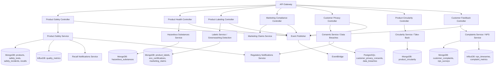

# Service Specification: Product Service

## Service Overview

**Service Name**: Product Service
**Port**: 3025
**Purpose**: Manages comprehensive product responsibility metrics including product safety, quality, health impacts, labeling compliance, responsible marketing, customer privacy, circularity, and customer feedback for ESG reporting - ensuring consumer protection and regulatory compliance
**Domain**: Social - Product Responsibility & Consumer Protection
**Team Ownership**: Social Domain Team
**Phase**: 4 (Social Domain)
**Story Points**: 30
**Sprint Allocation**: 2 sprints (4 weeks)

## 🚨 CRITICAL COMPLIANCE WARNING

> **ZERO TOLERANCE FOR UNSAFE PRODUCTS OR MISLEADING CLAIMS**
>
> This service manages HIGHLY REGULATED product safety and consumer protection data. ALL product operations MUST ensure:
> - **Product safety compliance** (CPSC, FDA, UL, CE, ISO standards)
> - **Hazardous substance disclosure** (RoHS, REACH, Prop 65)
> - **Truthful marketing claims** (FTC, greenwashing prevention)
> - **Customer privacy protection** (GDPR, CCPA, COPPA)
> - **Recall notification** (<5 seconds for critical safety issues)
> - **Labeling accuracy** (mandatory disclosures, no false claims)
>
> **Violations may result in**:
> - Product recalls (millions in costs)
> - Regulatory fines (FTC: $43,792 per violation)
> - Criminal liability (FDA: imprisonment for willful violations)
> - Reputational damage and customer trust loss
> - Class action lawsuits
> - Market withdrawal or ban

## 1. Functional Requirements

### 1.1 Core Features

#### Product Safety & Quality Management
- Product safety testing and certification tracking (UL, CE, ISO, CPSC, FDA)
- Quality control metrics (defect rates, first-pass yield, customer returns)
- Safety incident tracking (customer injuries, product hazards, near-misses)
- Product recall management (recall campaigns, customer notification, remediation)
- Safety standards compliance monitoring (automatic updates on standard changes)
- Child safety assessments (CPSC guidelines, choking hazards, age-appropriate warnings)
- Product lifecycle safety monitoring (post-market surveillance)
- Batch/lot traceability (recall precision, supply chain tracking)
- Non-conformance tracking (NCR management, CAPA)
- Third-party safety certifications (certificate expiry tracking)
- Product testing documentation (test reports, lab certificates, compliance evidence)
- Safety risk assessments (FMEA, hazard analysis)

**Regulatory Compliance**:
- CPSC (Consumer Product Safety Commission) - US consumer products
- FDA (Food and Drug Administration) - food, medical devices, cosmetics
- UL (Underwriters Laboratories) - electrical safety
- CE marking - European Economic Area
- ISO 9001 (Quality Management)
- ISO 10393 (Product Safety)

#### Product Health Impact Assessment
- Hazardous substance tracking (RoHS, REACH, Prop 65, TSCA)
- Chemical disclosure and transparency (ingredient lists, CAS numbers)
- Allergen management (food allergens, contact allergens)
- Product health impact assessments (toxicity, carcinogens, endocrine disruptors)
- Nutritional information management (food products, Nutrition Facts labels)
- Medical device safety monitoring (FDA adverse event reporting)
- Substance of Very High Concern (SVHC) tracking (REACH)
- Material safety data sheets (SDS/MSDS) management
- Exposure risk assessments (consumer use scenarios)
- Biocompatibility testing (medical devices, cosmetics)
- Environmental health impacts (VOC emissions, microplastics)
- Toxicological risk assessments (chronic and acute exposure)

**Regulatory Compliance**:
- RoHS (Restriction of Hazardous Substances Directive) - EU electronics
- REACH (Registration, Evaluation, Authorization of Chemicals) - EU chemicals
- Prop 65 (California Safe Drinking Water Act) - carcinogens, reproductive toxins
- TSCA (Toxic Substances Control Act) - US chemicals
- FDA CFR Title 21 - food, drugs, medical devices
- EFSA (European Food Safety Authority) - food safety
- CPSIA (Consumer Product Safety Improvement Act) - lead, phthalates

#### Product Information & Labeling Compliance
- Labeling compliance management (mandatory disclosures, warnings, ingredients)
- Eco-labels and certifications (Energy Star, EPEAT, EU Ecolabel, Fair Trade)
- Sustainability claims verification (carbon neutral, recyclable, organic)
- Greenwashing detection and prevention (claim substantiation, evidence tracking)
- Product transparency initiatives (origin, ingredients, environmental impact)
- Multi-language labeling support (translation, cultural adaptation)
- Accessibility features (Braille labels, large print, audio descriptions)
- QR code linking (additional product information, supply chain transparency)
- Packaging compliance (recycling symbols, material composition)
- Nutritional labeling (Nutrition Facts, allergen declarations)
- Country-of-origin marking (Made in USA, country-specific requirements)
- Expiration date management (shelf life, use-by dates)

**Regulatory Compliance**:
- FTC Green Guides (environmental marketing claims) - US
- ISO 14021 (Self-declared environmental claims)
- EU Ecolabel Regulation
- Fair Packaging and Labeling Act (FPLA) - US
- FDA labeling requirements (food, drugs, cosmetics)
- FTC Made in USA standard
- CA Transparency in Supply Chains Act

#### Responsible Marketing & Advertising
- Marketing claim verification and substantiation (testing evidence, scientific studies)
- Advertising standards compliance (FTC, ASA, NAD)
- Children's marketing restrictions (COPPA, GDPR-K, CARU guidelines)
- Vulnerable population protections (elderly, disabled, low-literacy)
- Truth in advertising enforcement (no deceptive claims)
- Greenwashing prevention (claim validation, third-party verification)
- Comparative advertising compliance (competitor comparisons, superiority claims)
- Endorsement and testimonial compliance (FTC Endorsement Guides)
- Native advertising disclosure (sponsored content labeling)
- Social media marketing compliance (influencer disclosures)
- Promotional compliance (sweepstakes, contests, free offers)
- Marketing to children (age-appropriate content, parental consent)

**Regulatory Compliance**:
- FTC Act Section 5 (Unfair or Deceptive Acts) - US
- FTC Green Guides (environmental claims)
- FTC Endorsement Guides (testimonials, influencers)
- COPPA (Children's Online Privacy Protection Act) - US
- GDPR Article 8 (children's consent) - EU
- CARU (Children's Advertising Review Unit)
- ASA (Advertising Standards Authority) - UK
- NAD (National Advertising Division) - self-regulation

#### Customer Privacy & Data Protection
- Customer data protection (GDPR, CCPA, PIPEDA compliance)
- Consent management (granular, purpose-specific, revocable)
- Data breach incident response (72-hour GDPR notification)
- Third-party data sharing disclosures (vendor management, data processors)
- Privacy by design in products (default privacy settings, data minimization)
- Data subject rights management (access, rectification, erasure, portability)
- Privacy impact assessments (DPIA for high-risk processing)
- Cookie consent management (granular consent, opt-out mechanisms)
- Children's privacy protection (COPPA, GDPR-K, parental consent)
- IoT device privacy (connected products, data collection transparency)
- Biometric data protection (special category data, heightened consent)
- Cross-border data transfers (Standard Contractual Clauses, adequacy decisions)

**Regulatory Compliance**:
- GDPR (General Data Protection Regulation) - EU/EEA
- CCPA/CPRA (California Consumer Privacy Act) - California
- COPPA (Children's Online Privacy Protection Act) - US
- PIPEDA (Personal Information Protection) - Canada
- LGPD (Lei Geral de Proteção de Dados) - Brazil
- ISO 27701 (Privacy Information Management)
- NIST Privacy Framework

#### Product Circularity & Lifecycle Management
- Product lifecycle extension (durability testing, repairability scores)
- Take-back programs (reverse logistics, product returns for recycling)
- Product-as-a-service models (subscription, leasing, pay-per-use)
- Recycled content tracking (pre-consumer, post-consumer recycled materials)
- End-of-life recyclability (material recovery, design for disassembly)
- Material passports (digital product information, material composition)
- Repair and spare parts availability (right to repair, service manuals)
- Product refurbishment programs (remanufacturing, warranty for refurbished)
- Packaging reduction (lightweighting, reusable packaging)
- Circular design principles (Ellen MacArthur Foundation, Cradle to Cradle)
- Extended Producer Responsibility (EPR) compliance (WEEE, packaging regulations)
- Battery collection and recycling (Battery Directive, battery stewardship)

**Regulatory Compliance**:
- EU Circular Economy Action Plan
- WEEE Directive (Waste Electrical and Electronic Equipment) - EU
- Battery Directive - EU
- Packaging and Packaging Waste Directive - EU
- Extended Producer Responsibility (EPR) regulations (various jurisdictions)
- Right to Repair legislation (EU, US states)
- Cradle to Cradle Certified™ standard

#### Customer Feedback & Complaint Management
- Customer complaint management (case tracking, resolution workflows)
- Product satisfaction surveys (NPS, CSAT, CES)
- Net Promoter Score (NPS) tracking (product-specific, time-series trends)
- Social media sentiment monitoring (brand mentions, product reviews)
- Complaint categorization (safety, quality, service, delivery)
- Root cause analysis (recurring issues, systemic problems)
- Complaint resolution tracking (time-to-resolution, customer satisfaction)
- Product improvement tracking (complaints driving product updates)
- Regulatory complaint reporting (FDA adverse events, CPSC reports)
- Customer service analytics (first contact resolution, escalation rates)
- Voice of Customer (VoC) programs (focus groups, user testing)
- Product review management (online reviews, ratings, response management)

**Compliance & Reporting**:
- FDA MedWatch (medical device adverse events)
- CPSC Form 8D (product safety incidents)
- EU RAPEX (rapid alert system for dangerous products)
- ISO 10002 (Complaint Handling)

### 1.2 API Endpoints

#### Product Safety & Quality
```yaml
POST /v1/products
  Request:
    - productId: string (unique, SKU or internal ID)
    - name: string (required)
    - description: string
    - category: string (electronics, food, cosmetics, toys, etc.)
    - manufacturer: object
        - name: string
        - location: string
        - certifications: array
    - safetyStandards: array
        - standard: string (e.g., "UL 2054", "CE EN 71", "FDA 21 CFR 820")
        - certificationBody: string (e.g., "UL", "TÜV", "FDA")
        - certificateNumber: string
        - issueDate: date
        - expiryDate: date
        - status: "valid" | "expired" | "pending"
    - targetMarkets: array (countries/regions where product is sold)
    - ageRating: string (e.g., "3+", "Adult", "All Ages")
    - childSafetyAssessed: boolean
  Response:
    - productId: string
    - registrationDate: date
    - complianceStatus: "compliant" | "pending-review" | "non-compliant"
    - requiredCertifications: array (based on category and target markets)
  Compliance:
    - Validates required certifications for category
    - Flags missing safety standards
    - Tracks certification expiry

GET /v1/products/:productId/safety
  Response:
    - productId: string
    - safetyStatus: "certified" | "pending" | "expired" | "recalled"
    - activeCertifications: array
        - standard: string
        - certificateNumber: string
        - expiryDate: date
        - certificateUrl: string (S3 document)
    - safetyIncidents: number (total incidents)
    - recallHistory: array
        - recallId: string
        - recallDate: date
        - reason: string
        - severity: "critical" | "serious" | "minor"
        - unitsAffected: number
        - status: "active" | "closed"
    - complianceGaps: array
        - standard: string
        - issue: string
        - severity: "critical" | "high" | "medium" | "low"
        - deadline: date
  Compliance:
    - Real-time certification status
    - Automatic expiry alerts (30, 60, 90 days)

POST /v1/products/:productId/safety-tests
  Request:
    - testType: string (e.g., "electrical safety", "flammability", "toxicity")
    - testStandard: string (e.g., "UL 2054", "ASTM D2863")
    - testLab: string (accredited third-party lab)
    - testDate: date
    - testResult: "pass" | "fail" | "conditional"
    - reportUrl: string (S3 document)
    - findings: array
        - parameter: string (e.g., "leakage current")
        - measuredValue: number
        - requiredLimit: number
        - unit: string
        - result: "pass" | "fail"
    - expiryDate: date (some tests require periodic retesting)
  Response:
    - testId: string
    - complianceStatus: "compliant" | "non-compliant"
    - requiredActions: array
  Compliance:
    - Validates test lab accreditation
    - Tracks test expiry (periodic retesting required)
    - Flags non-compliant results

POST /v1/products/safety-incidents
  Request:
    - productId: string (required)
    - incidentDate: date (required)
    - incidentType: "injury" | "property-damage" | "near-miss" | "defect"
    - severity: "critical" | "serious" | "moderate" | "minor"
    - injuryDetails: object
        - injuryType: string (e.g., "burn", "laceration", "choking")
        - medicalTreatment: boolean
        - hospitalization: boolean
        - fatality: boolean
    - productDefect: string (description of defect)
    - rootCause: string (preliminary or confirmed)
    - affectedBatches: array (batch/lot numbers)
    - estimatedAffectedUnits: number
    - regulatoryReportingRequired: boolean
    - reportedToAuthorities: array (CPSC, FDA, etc.)
  Response:
    - incidentId: string
    - caseNumber: string
    - severity: string
    - recallRecommended: boolean (risk assessment)
    - regulatoryDeadline: date (e.g., 24 hours for CPSC)
    - nextSteps: array
  Compliance:
    - Automatic CPSC/FDA reporting flag
    - 24-hour CPSC reporting deadline tracking
    - Recall risk assessment (severity x affected units)
  Events:
    - product.safety-incident.reported.v1

GET /v1/products/:productId/safety-incidents
  Query:
    - startDate: date
    - endDate: date
    - severity: "critical" | "serious" | "moderate" | "minor"
    - status: "open" | "investigating" | "closed"
  Response:
    - totalIncidents: number
    - incidents: array
        - incidentId: string
        - incidentDate: date
        - incidentType: string
        - severity: string
        - status: string
        - recallIssued: boolean
    - severityDistribution: object
        - critical: number
        - serious: number
        - moderate: number
        - minor: number
    - trendAnalysis: object
        - trend: "improving" | "stable" | "worsening"
        - changeFromPrevious: number (percentage)

POST /v1/products/recalls
  Request:
    - productId: string (required)
    - recallReason: string (required)
    - severity: "critical" | "serious" | "minor"
    - affectedBatches: array (batch/lot numbers)
    - affectedUnits: number
    - recallType: "voluntary" | "mandatory"
    - recallStrategy: "consumer-level" | "retail-level" | "distributor-level"
    - remedyOffered: "refund" | "replacement" | "repair" | "warning"
    - notificationChannels: array
        - channel: "email" | "sms" | "mail" | "media" | "website"
        - enabled: boolean
    - effectiveDate: date
    - pressReleaseUrl: string (optional)
    - regulatoryReference: string (CPSC recall number, FDA enforcement report)
  Response:
    - recallId: string
    - recallNumber: string (regulatory-assigned)
    - notificationStatus: "pending" | "in-progress" | "completed"
    - estimatedCustomersNotified: number
    - notificationDeadline: date (regulatory requirement)
  Compliance:
    - CPSC recall notification requirements (24-48 hours)
    - FDA recall classification (Class I, II, III)
    - Mandatory press release for consumer-level recalls
  Events:
    - product.recall.initiated.v1
  Notifications:
    - Customer notifications (<5 seconds for critical recalls)
    - Retailer notifications
    - Regulatory authority notifications (CPSC, FDA)

GET /v1/products/recalls
  Query:
    - productId: string (optional)
    - startDate: date
    - endDate: date
    - severity: "critical" | "serious" | "minor"
    - status: "active" | "closed"
  Response:
    - totalRecalls: number
    - recalls: array
        - recallId: string
        - productId: string
        - productName: string
        - recallDate: date
        - severity: string
        - affectedUnits: number
        - remedyOffered: string
        - status: "active" | "closed"
        - effectivenessRate: number (percentage of units recovered/remedied)
    - recallEffectiveness: object
        - averageEffectivenessRate: number (percentage)
        - totalUnitsRecalled: number
        - totalUnitsRemedied: number

GET /v1/products/:productId/quality-metrics
  Query:
    - startDate: date
    - endDate: date
    - metricType: "defect-rate" | "customer-returns" | "first-pass-yield"
  Response:
    - productId: string
    - qualityMetrics: object
        - defectRate: number (defects per million units)
        - customerReturnRate: number (percentage)
        - firstPassYield: number (percentage)
        - nonConformanceRate: number (percentage)
        - averageTimeToRepair: number (hours)
    - trendAnalysis: object
        - trend: "improving" | "stable" | "worsening"
        - changeFromPrevious: number (percentage)
    - benchmarkComparison: object
        - industryAverage: number
        - topQuartile: number
        - companyPerformance: "above-average" | "average" | "below-average"
```

#### Product Health Impact
```yaml
POST /v1/products/:productId/hazardous-substances
  Request:
    - substanceName: string (required)
    - casNumber: string (Chemical Abstracts Service number)
    - concentration: number (percentage or ppm)
    - regulatoryStatus: array
        - regulation: "RoHS" | "REACH" | "Prop65" | "TSCA"
        - status: "compliant" | "restricted" | "banned" | "SVHC"
        - threshold: number (regulatory limit)
        - complianceDate: date
    - healthHazards: array (e.g., "carcinogen", "reproductive toxin", "neurotoxin")
    - exposureRoute: array (e.g., "inhalation", "skin contact", "ingestion")
    - mitigationMeasures: string
    - alternativeSubstances: array (safer alternatives)
  Response:
    - substanceId: string
    - complianceStatus: "compliant" | "requires-disclosure" | "non-compliant"
    - requiredLabeling: array (warnings, disclosures)
    - regulatoryDeadlines: array
  Compliance:
    - RoHS exemption tracking (sunset dates)
    - REACH SVHC updates (biannual updates)
    - Prop 65 safe harbor levels
  Events:
    - product.hazardous-substance.detected.v1

GET /v1/products/:productId/hazardous-substances
  Response:
    - productId: string
    - totalSubstances: number
    - substances: array
        - substanceName: string
        - casNumber: string
        - concentration: number
        - regulatoryStatus: array
        - complianceStatus: "compliant" | "requires-disclosure" | "non-compliant"
    - complianceGaps: array
        - regulation: string
        - issue: string
        - deadline: date
    - requiredLabels: array (Prop 65 warnings, RoHS marks, etc.)

POST /v1/products/:productId/health-assessments
  Request:
    - assessmentType: "toxicological" | "biocompatibility" | "allergenicity" | "exposure"
    - assessmentDate: date
    - conductedBy: string (lab or consultant)
    - methodology: string
    - findings: object
        - hazardIdentification: array
        - doseResponseAssessment: object
        - exposureAssessment: object
        - riskCharacterization: object
    - conclusion: "safe-for-intended-use" | "safe-with-warnings" | "not-safe"
    - recommendedWarnings: array
    - reportUrl: string (S3 document)
  Response:
    - assessmentId: string
    - complianceStatus: "compliant" | "requires-warnings" | "non-compliant"
    - requiredActions: array
  Compliance:
    - FDA premarket safety assessments (medical devices, cosmetics)
    - EU Cosmetics Regulation safety assessments

GET /v1/products/:productId/allergen-information
  Response:
    - productId: string
    - allergens: array
        - allergenType: string (e.g., "peanuts", "latex", "nickel")
        - presenceLevel: "contains" | "may-contain" | "processed-in-facility"
        - regulatoryDisclosure: boolean
    - allergenLabeling: array (required label statements)
    - crossContaminationRisk: boolean
  Compliance:
    - FDA Food Allergen Labeling (8 major allergens)
    - EU Allergen Labeling Regulation (14 allergens)

GET /v1/products/:productId/nutritional-information
  Response:
    - productId: string
    - servingSize: object
        - amount: number
        - unit: string
    - nutrientsPerServing: object
        - calories: number
        - totalFat: number
        - saturatedFat: number
        - transFat: number
        - cholesterol: number
        - sodium: number
        - totalCarbohydrate: number
        - dietaryFiber: number
        - sugars: number
        - protein: number
        - vitamins: array
        - minerals: array
    - dailyValuePercentages: object
    - ingredientList: array (in descending order by weight)
    - allergenStatement: string
    - nutritionalClaims: array (e.g., "low fat", "high fiber")
  Compliance:
    - FDA Nutrition Facts label format
    - EU Nutrition Declaration format
```

#### Product Labeling & Information
```yaml
POST /v1/products/:productId/labels
  Request:
    - labelType: "primary" | "nutrition-facts" | "warning" | "eco-label"
    - market: string (country/region)
    - language: string
    - labelContent: object
        - productName: string
        - ingredients: array (descending order by weight)
        - netContent: object (weight/volume)
        - manufacturerInfo: object
        - countryOfOrigin: string
        - expirationDate: date (if applicable)
        - warnings: array
        - recyclingInstructions: string
        - certificationMarks: array (UL, CE, Energy Star, etc.)
    - sustainabilityClaims: array
        - claim: string (e.g., "100% recycled content", "carbon neutral")
        - substantiation: object
            - evidenceType: string (third-party certification, LCA, test report)
            - evidenceUrl: string
            - verificationDate: date
            - verifier: string
    - accessibility: object
        - braille: boolean
        - largePrint: boolean
        - audioDescription: boolean
        - qrCodeUrl: string (additional information)
  Response:
    - labelId: string
    - complianceStatus: "compliant" | "non-compliant"
    - validationErrors: array
    - requiredDisclosures: array (missing mandatory information)
  Compliance:
    - FTC Green Guides (environmental claims)
    - FDA labeling requirements (food, drugs, cosmetics)
    - Fair Packaging and Labeling Act (FPLA)
    - Made in USA standard
  Events:
    - product.label.updated.v1

GET /v1/products/:productId/labels
  Query:
    - market: string (country/region)
    - language: string
    - labelType: string
  Response:
    - labels: array
        - labelId: string
        - labelType: string
        - market: string
        - language: string
        - complianceStatus: "compliant" | "non-compliant"
        - lastUpdated: date
        - labelImageUrl: string (rendered label)
        - labelDataUrl: string (structured data)

POST /v1/products/:productId/eco-certifications
  Request:
    - certificationType: string (e.g., "Energy Star", "EPEAT Gold", "Fair Trade")
    - certificationBody: string
    - certificateNumber: string
    - issueDate: date
    - expiryDate: date
    - certificationLevel: string (e.g., "Gold", "Silver", "Bronze")
    - criteriaMetUrl: string (certification criteria document)
    - annualRenewal: boolean
  Response:
    - certificationId: string
    - status: "active" | "expired" | "suspended"
    - renewalDeadline: date
  Compliance:
    - Energy Star certification requirements
    - EPEAT registry updates
    - Fair Trade certification standards

GET /v1/products/:productId/greenwashing-check
  Response:
    - productId: string
    - sustainabilityClaims: array
        - claim: string
        - substantiated: boolean
        - evidenceQuality: "strong" | "moderate" | "weak" | "none"
        - greenwashingRisk: "low" | "medium" | "high"
        - recommendations: array
    - overallGreenwashingRisk: "low" | "medium" | "high"
    - complianceStatus: "compliant" | "needs-review" | "non-compliant"
    - validationErrors: array
        - claim: string
        - issue: string (e.g., "vague claim", "no evidence", "misleading comparison")
        - severity: "critical" | "high" | "medium" | "low"
  Compliance:
    - FTC Green Guides (7 sins of greenwashing)
    - ISO 14021 (environmental claims)
  Events:
    - product.greenwashing.flagged.v1
```

#### Responsible Marketing
```yaml
POST /v1/products/:productId/marketing-claims
  Request:
    - claim: string (e.g., "Lasts 2x longer", "Clinically proven to reduce wrinkles")
    - claimType: "performance" | "health" | "environmental" | "comparative" | "superiority"
    - targetAudience: "general" | "children" | "elderly" | "vulnerable"
    - substantiation: object
        - evidenceType: string (clinical study, lab test, consumer survey)
        - studyDesign: string (double-blind RCT, lab test, etc.)
        - sampleSize: number
        - statisticalSignificance: boolean
        - evidenceUrl: string (S3 document)
        - conductedBy: string (third-party lab, university)
        - studyDate: date
    - disclaimers: array (required disclosures)
    - competitorComparison: boolean
    - competitorProduct: string (if comparative claim)
  Response:
    - claimId: string
    - verificationStatus: "verified" | "pending-review" | "unsubstantiated"
    - complianceStatus: "compliant" | "non-compliant"
    - requiredDisclosures: array
    - greenwashingRisk: "low" | "medium" | "high"
  Compliance:
    - FTC substantiation standard (reasonable basis)
    - FTC Health Claims (competent and reliable scientific evidence)
    - NAD (National Advertising Division) standards
  Events:
    - product.marketing-claim.flagged.v1

GET /v1/products/:productId/marketing-claims
  Response:
    - totalClaims: number
    - claims: array
        - claimId: string
        - claim: string
        - verificationStatus: string
        - substantiated: boolean
        - complianceStatus: string
    - unsubstantiatedClaims: number
    - complianceGaps: array

POST /v1/marketing-campaigns/:campaignId/compliance-review
  Request:
    - campaignName: string
    - targetAudience: "general" | "children" | "elderly" | "vulnerable"
    - channels: array (TV, social media, email, etc.)
    - marketingMaterials: array
        - materialType: string (video, image, text)
        - contentUrl: string
        - targetAge: string (e.g., "13+", "18+")
    - productsClaimed: array
        - productId: string
        - claimsMade: array
    - childrenTargeted: boolean
    - influencerEndorsements: array
        - influencerName: string
        - materialConnection: boolean (paid endorsement)
        - disclosurePresent: boolean
        - disclosureClarity: "clear" | "unclear" | "none"
  Response:
    - campaignId: string
    - complianceStatus: "compliant" | "needs-revision" | "non-compliant"
    - violations: array
        - violationType: "deceptive-claim" | "inadequate-substantiation" | "child-targeting" | "missing-disclosure"
        - severity: "critical" | "high" | "medium" | "low"
        - description: string
        - recommendation: string
    - requiredChanges: array
  Compliance:
    - FTC Act Section 5 (deceptive advertising)
    - COPPA (children's advertising restrictions)
    - FTC Endorsement Guides (influencer disclosures)
    - CARU guidelines (children's advertising)
  Events:
    - marketing.compliance-violation.detected.v1

GET /v1/marketing-campaigns/children-protection
  Response:
    - totalCampaigns: number
    - childrenTargetedCampaigns: number
    - complianceRate: number (percentage)
    - violations: array
        - campaignId: string
        - violationType: string
        - severity: string
        - status: "open" | "remediated"
    - ageGatingImplemented: boolean
    - parentalConsentRequired: boolean
  Compliance:
    - COPPA (13+ age gate for data collection)
    - CARU guidelines (no undue pressure on children)
    - GDPR Article 8 (16+ for consent, member states may lower to 13)
```

#### Customer Privacy
```yaml
POST /v1/privacy/consents
  Request:
    - customerId: string (required)
    - consentType: "marketing" | "analytics" | "third-party-sharing" | "location-tracking"
    - purpose: string (specific purpose for data processing)
    - granular: boolean (purpose-specific consent)
    - consentGiven: boolean
    - consentMethod: "explicit-opt-in" | "implicit" | "pre-checked-box"
    - consentDate: date
    - expiryDate: date (consent refresh required)
    - withdrawalMechanism: string (how to revoke consent)
    - dataCategories: array (what data is collected)
    - thirdParties: array (who data is shared with)
    - legalBasis: "consent" | "legitimate-interest" | "contract" | "legal-obligation"
    - ageVerified: boolean (for children's data)
    - parentalConsent: boolean (COPPA/GDPR-K)
  Response:
    - consentId: string
    - consentStatus: "active" | "withdrawn" | "expired"
    - complianceStatus: "compliant" | "non-compliant"
    - validationErrors: array
  Compliance:
    - GDPR Article 7 (consent requirements)
    - CCPA opt-out mechanism
    - COPPA parental consent (verifiable)
    - ePrivacy Directive (cookie consent)
  Events:
    - privacy.consent.recorded.v1

POST /v1/privacy/consents/:consentId/withdraw
  Request:
    - withdrawalReason: string (optional)
    - withdrawalDate: date
    - dataErasureRequested: boolean
  Response:
    - consentId: string
    - status: "withdrawn"
    - dataErasureScheduled: boolean
    - erasureDeadline: date (GDPR: 30 days)
  Compliance:
    - GDPR Article 17 (right to erasure)
    - CCPA right to deletion
  Events:
    - privacy.consent.withdrawn.v1

POST /v1/privacy/data-breaches
  Request:
    - breachDate: date (when breach occurred)
    - discoveryDate: date (when breach discovered)
    - breachType: "unauthorized-access" | "data-loss" | "ransomware" | "misconfiguration"
    - affectedCustomers: number
    - dataCategories: array (what data was compromised)
    - sensitiveDataCompromised: boolean (health, financial, biometric)
    - breachSeverity: "critical" | "high" | "medium" | "low"
    - containmentActions: array
    - notificationRequired: boolean
    - regulatoryAuthorityNotified: boolean
    - customerNotificationDate: date
  Response:
    - breachId: string
    - notificationDeadline: date (GDPR: 72 hours)
    - regulatoryDeadlines: array
        - authority: string (DPA, FTC, state AG)
        - deadline: date
    - customerNotificationRequired: boolean
    - incidentResponsePlan: string
  Compliance:
    - GDPR Article 33 (72-hour notification to DPA)
    - GDPR Article 34 (customer notification without undue delay)
    - CCPA breach notification (California Civil Code 1798.82)
    - State breach notification laws (all 50 US states)
  Events:
    - privacy.data-breach.detected.v1
  Notifications:
    - Regulatory authority notification (<72 hours)
    - Customer notification (immediate for high-risk breaches)

GET /v1/privacy/data-subject-requests
  Query:
    - customerId: string
    - requestType: "access" | "rectification" | "erasure" | "portability" | "restriction"
    - status: "pending" | "in-progress" | "completed" | "denied"
  Response:
    - totalRequests: number
    - requests: array
        - requestId: string
        - customerId: string
        - requestType: string
        - requestDate: date
        - completionDeadline: date (GDPR: 30 days, CCPA: 45 days)
        - status: string
        - responseDate: date
        - denialReason: string (if denied)
    - averageResponseTime: number (days)
    - complianceRate: number (percentage within deadline)
  Compliance:
    - GDPR Articles 15-20 (data subject rights)
    - CCPA data subject rights
    - 30-day GDPR response deadline
    - 45-day CCPA response deadline (extendable to 90)

POST /v1/privacy/impact-assessments
  Request:
    - productId: string (required)
    - processingActivity: string (what data processing occurs)
    - dataCategories: array (what data is collected)
    - dataSubjects: array (who is affected)
    - purposeOfProcessing: string
    - highRiskProcessing: boolean (profiling, automated decisions, sensitive data)
    - riskAssessment: object
        - privacyRisks: array
        - riskLikelihood: "low" | "medium" | "high"
        - riskImpact: "low" | "medium" | "high"
        - mitigationMeasures: array
    - dataMinimization: boolean (only necessary data collected)
    - storageLimitation: boolean (data retention limits)
    - securityMeasures: array (encryption, access controls)
    - assessmentDate: date
    - assessor: string
    - dpOApproval: boolean (Data Protection Officer)
  Response:
    - dpiaId: string
    - riskLevel: "low" | "medium" | "high"
    - approved: boolean
    - requiredChanges: array
    - consultationRequired: boolean (with DPA for high-risk processing)
  Compliance:
    - GDPR Article 35 (Data Protection Impact Assessment)
    - Required for high-risk processing
    - DPO must be consulted
```

#### Product Circularity
```yaml
POST /v1/products/:productId/circularity
  Request:
    - durabilityRating: number (1-10, product lifespan)
    - repairabilityScore: number (1-10, ease of repair)
    - recycledContentPercentage: number (0-100)
    - recycledContentType: "pre-consumer" | "post-consumer" | "mixed"
    - endOfLifeRecyclability: number (percentage of product recyclable)
    - designForDisassembly: boolean
    - spareParts Availability: object
        - availableParts: array
        - partLifespan: number (years of availability)
        - repairManualAvailable: boolean
        - repairManualUrl: string
    - takeBackProgram: object
        - available: boolean
        - freeReturns: boolean
        - returnLocations: array
        - recyclingProcess: string
    - productAsService: object
        - available: boolean
        - subscriptionModel: boolean
        - leasingAvailable: boolean
    - materialPassport: object
        - available: boolean
        - digitalProductId: string (unique identifier)
        - materialComposition: array
            - material: string
            - percentage: number
            - recyclable: boolean
            - hazardous: boolean
    - eprCompliance: object
        - weeeCompliant: boolean
        - batteryDirectiveCompliant: boolean
        - packagingDirectiveCompliant: boolean
        - eprFeePaid: boolean
  Response:
    - circularityId: string
    - circularityScore: number (0-100, overall score)
    - certifications: array (Cradle to Cradle, etc.)
    - complianceStatus: "compliant" | "non-compliant"
    - improvementOpportunities: array
  Compliance:
    - EU Circular Economy Action Plan
    - WEEE Directive (electronics recycling)
    - Battery Directive (battery collection)
    - Right to Repair legislation

GET /v1/products/:productId/circularity
  Response:
    - productId: string
    - circularityScore: number (0-100)
    - durabilityRating: number
    - repairabilityScore: number
    - recycledContentPercentage: number
    - endOfLifeRecyclability: number
    - takeBackProgram: object
    - materialPassport: object
    - certifications: array
    - improvementRecommendations: array

POST /v1/products/:productId/take-back
  Request:
    - customerId: string
    - productSerialNumber: string
    - returnReason: "end-of-life" | "upgrade" | "defect" | "recall"
    - productCondition: "working" | "broken" | "partially-functional"
    - returnMethod: "mail-in" | "drop-off" | "pickup"
    - returnLocation: string
    - refundOffered: boolean
    - refundAmount: number
    - recyclingGuaranteed: boolean
  Response:
    - takeBackId: string
    - returnLabel: string (shipping label URL)
    - trackingNumber: string
    - estimatedProcessingDate: date
    - refundEligible: boolean
  Events:
    - product.take-back.registered.v1

GET /v1/products/take-back-programs
  Response:
    - totalPrograms: number
    - programs: array
        - productId: string
        - productName: string
        - takeBackAvailable: boolean
        - returnRate: number (percentage of products returned)
        - recyclingRate: number (percentage actually recycled)
        - refurbishmentRate: number (percentage refurbished for resale)
    - overallReturnRate: number (percentage)
    - overallRecyclingRate: number (percentage)
  Compliance:
    - EPR reporting (return rates, recycling rates)
    - WEEE collection targets (EU: 65% of products sold)
```

#### Customer Feedback & Complaints
```yaml
POST /v1/customer-feedback/complaints
  Request:
    - customerId: string (optional, can be anonymous)
    - productId: string (required)
    - complaintDate: date (required)
    - complaintCategory: "safety" | "quality" | "performance" | "service" | "delivery" | "other"
    - severity: "critical" | "high" | "medium" | "low"
    - description: string (required)
    - safetyIssue: boolean
    - injuryOccurred: boolean
    - requestedRemedy: "refund" | "replacement" | "repair" | "explanation" | "other"
    - contactMethod: "email" | "phone" | "chat" | "social-media" | "in-person"
    - attachments: array (photos, documents)
  Response:
    - complaintId: string
    - caseNumber: string
    - assignedTo: string (customer service agent)
    - priority: "urgent" | "high" | "normal" | "low"
    - estimatedResolution: date
    - safetyIncidentCreated: boolean (if safety issue)
  Events:
    - product.complaint.received.v1
    - product.complaint.escalated.v1 (if critical/safety)
  Notifications:
    - Customer acknowledgment (immediate)
    - Customer service assignment (internal)
    - Safety team alert (if safety issue)

GET /v1/customer-feedback/complaints/:complaintId
  Response:
    - complaintId: string
    - caseNumber: string
    - status: "open" | "in-progress" | "resolved" | "closed"
    - complaintDetails: object
    - resolutionActions: array
        - action: string
        - actionDate: date
        - performedBy: string
    - resolutionDate: date
    - timeToResolution: number (hours)
    - customerSatisfaction: number (1-5, post-resolution survey)
    - rootCause: string
    - preventiveActions: array

GET /v1/customer-feedback/complaints
  Query:
    - productId: string (optional)
    - category: string
    - severity: string
    - status: string
    - startDate: date
    - endDate: date
  Response:
    - totalComplaints: number
    - complaints: array
    - categoryDistribution: object
        - safety: number
        - quality: number
        - performance: number
        - service: number
        - delivery: number
        - other: number
    - averageResolutionTime: number (hours)
    - firstContactResolutionRate: number (percentage)
    - customerSatisfactionScore: number (1-5)
    - trendAnalysis: object
        - trend: "improving" | "stable" | "worsening"
        - changeFromPrevious: number (percentage)

POST /v1/customer-feedback/surveys
  Request:
    - surveyType: "NPS" | "CSAT" | "CES" | "product-specific"
    - productId: string (optional, for product-specific surveys)
    - questions: array
        - questionId: string
        - questionText: string
        - questionType: "nps" | "rating" | "multiple-choice" | "open-text"
        - scale: number (e.g., 0-10 for NPS, 1-5 for CSAT)
    - targetAudience: object
        - customerSegment: string
        - purchaseRecency: number (days)
        - minimumPurchaseValue: number
    - distributionChannels: array (email, SMS, in-app)
    - anonymousMode: boolean
  Response:
    - surveyId: string
    - distributionCount: number
    - expectedResponses: number
    - surveyUrl: string

POST /v1/customer-feedback/surveys/:surveyId/responses
  Request:
    - customerId: string (optional if anonymous)
    - responses: array
        - questionId: string
        - answer: number | string | array
    - submittedDate: date
  Response:
    - responseId: string
    - npsScore: number (if NPS survey)
    - category: "promoter" | "passive" | "detractor" (if NPS)

GET /v1/customer-feedback/nps
  Query:
    - productId: string (optional)
    - startDate: date
    - endDate: date
    - frequency: "monthly" | "quarterly" | "annually"
  Response:
    - npsScore: number (-100 to 100)
    - promoters: number (percentage, score 9-10)
    - passives: number (percentage, score 7-8)
    - detractors: number (percentage, score 0-6)
    - totalResponses: number
    - trendAnalysis: object
        - trend: "improving" | "stable" | "declining"
        - changeFromPrevious: number (points)
    - dataPoints: array (time-series NPS)
        - period: string
        - npsScore: number
        - responseCount: number
  Events:
    - product.nps.threshold-crossed.v1 (alert if NPS drops below threshold)

GET /v1/customer-feedback/social-sentiment
  Query:
    - productId: string (required)
    - startDate: date
    - endDate: date
    - platforms: array (twitter, facebook, instagram, reddit, etc.)
  Response:
    - productId: string
    - overallSentiment: "positive" | "neutral" | "negative"
    - sentimentScore: number (-1 to 1)
    - totalMentions: number
    - sentimentDistribution: object
        - positive: number (percentage)
        - neutral: number (percentage)
        - negative: number (percentage)
    - topicAnalysis: array
        - topic: string
        - mentionCount: number
        - sentiment: "positive" | "neutral" | "negative"
    - influencerMentions: array
        - influencer: string
        - followerCount: number
        - sentiment: "positive" | "neutral" | "negative"
        - postUrl: string
    - crisisAlerts: array (if negative sentiment spike detected)
  Integration:
    - Social listening platforms (Sprinklr, Brandwatch, Hootsuite)
```

### 1.3 Business Rules

#### Product Safety Rules
1. All products MUST have valid safety certifications before sale
2. Safety certifications must be renewed before expiry (no grace period)
3. Critical safety incidents (injury, fatality) MUST be reported to CPSC within 24 hours
4. Products with >3 critical safety incidents in 12 months trigger automatic recall review
5. Recall notifications must be sent to customers within 48 hours of recall initiation
6. Products under active recall CANNOT be sold or restocked

#### Product Health Impact Rules
1. All hazardous substances must be disclosed if above regulatory thresholds
2. Prop 65 warnings MUST be displayed for California sales (no threshold for some substances)
3. REACH SVHC list updated every 6 months (candidate list additions)
4. RoHS compliance REQUIRED for all electronics sold in EU (with limited exemptions)
5. Allergen disclosures REQUIRED for all food products (8 major allergens in US, 14 in EU)
6. Nutritional labeling REQUIRED for all packaged food products (with limited exemptions)

#### Labeling & Claims Rules
1. All environmental claims MUST have substantiation evidence
2. "Made in USA" claims require ≥ 70% US content (FTC all or virtually all standard)
3. "Carbon neutral" claims require third-party verification (ISO 14021)
4. "Recyclable" claims require ≥ 60% of consumers have access to recycling facilities
5. Comparative claims MUST compare similar products in same category
6. Health claims require "competent and reliable scientific evidence" (FTC standard)

#### Marketing Rules
1. Marketing to children (<13) REQUIRES parental consent for data collection (COPPA)
2. Influencer endorsements MUST disclose material connections (#ad, paid partnership)
3. Native advertising MUST be clearly labeled as sponsored content
4. Unsubstantiated claims must be removed within 30 days of notification
5. Greenwashing risk score >70 triggers mandatory compliance review

#### Privacy Rules
1. GDPR data breach notification REQUIRED within 72 hours to DPA
2. GDPR data subject requests MUST be responded to within 30 days
3. CCPA opt-out requests MUST be honored within 15 days
4. Children's data (<13) REQUIRES verifiable parental consent (COPPA)
5. Cookie consent REQUIRED before non-essential cookies (EU ePrivacy Directive)
6. Consent withdrawal MUST be as easy as consent granting (GDPR Article 7)

#### Circularity Rules
1. WEEE compliance REQUIRED for all electronics sold in EU (collection target: 65%)
2. Battery collection REQUIRED for all products with batteries (EU Battery Directive)
3. EPR fees MUST be paid before product launch in EPR jurisdictions
4. Spare parts MUST be available for ≥5 years for durable goods (Right to Repair)
5. Take-back programs REQUIRED for electronics in EU (WEEE Directive)

#### Complaint Management Rules
1. Safety complaints MUST be escalated to Safety team within 1 hour
2. Critical complaints (injury, fatality) MUST be escalated to C-suite immediately
3. Complaint resolution SLA: 48 hours for critical, 7 days for high, 30 days for normal
4. Customer refund requests MUST be honored for safety-related complaints
5. NPS score <0 triggers product review and corrective action plan

### 1.4 Error Handling

```yaml
Error Responses:
  400 Bad Request:
    - INVALID_PRODUCT_ID
    - MISSING_REQUIRED_CERTIFICATION
    - INVALID_CLAIM_SUBSTANTIATION
    - MISSING_HAZARDOUS_SUBSTANCE_DISCLOSURE

  401 Unauthorized:
    - INVALID_API_KEY
    - TOKEN_EXPIRED

  403 Forbidden:
    - INSUFFICIENT_PERMISSIONS
    - PRODUCT_UNDER_RECALL (cannot modify)
    - CERTIFICATION_EXPIRED (cannot sell)

  404 Not Found:
    - PRODUCT_NOT_FOUND
    - CERTIFICATION_NOT_FOUND
    - COMPLAINT_NOT_FOUND

  409 Conflict:
    - PRODUCT_ALREADY_EXISTS
    - RECALL_ALREADY_ACTIVE
    - CERTIFICATION_DUPLICATE

  422 Unprocessable Entity:
    - GREENWASHING_DETECTED
    - UNSUBSTANTIATED_CLAIM
    - NON_COMPLIANT_LABEL
    - PRIVACY_VIOLATION

  500 Internal Server Error:
    - RECALL_NOTIFICATION_FAILED (retry mechanism)
    - REGULATORY_REPORTING_FAILED
```

## 2. Data Model

### 2.1 MongoDB Collections

#### products Collection
```javascript
{
  _id: ObjectId,
  productId: String (unique, indexed, SKU or internal ID),
  name: String,
  description: String,
  category: String (electronics, food, cosmetics, toys, medical-devices, etc.),

  manufacturer: {
    name: String,
    location: String,
    certifications: [String]
  },

  safetyStatus: {
    status: String ("certified" | "pending" | "expired" | "recalled"),
    lastSafetyReview: Date,
    nextReviewDue: Date,
    certifications: [{
      standard: String (e.g., "UL 2054", "CE EN 71", "FDA 21 CFR 820"),
      certificationBody: String,
      certificateNumber: String,
      issueDate: Date,
      expiryDate: Date (indexed for expiry alerts),
      status: String ("valid" | "expired" | "pending"),
      certificateUrl: String (S3 URL)
    }],
    requiredCertifications: [String] (based on category and markets)
  },

  targetMarkets: [String] (countries/regions where sold),
  ageRating: String (e.g., "3+", "Adult", "All Ages"),
  childSafetyAssessed: Boolean,

  qualityMetrics: {
    defectRate: Number (defects per million units),
    customerReturnRate: Number (percentage),
    firstPassYield: Number (percentage),
    nonConformanceRate: Number (percentage),
    lastUpdated: Date
  },

  recallHistory: [{
    recallId: ObjectId,
    recallDate: Date,
    reason: String,
    severity: String ("critical" | "serious" | "minor"),
    affectedUnits: Number,
    status: String ("active" | "closed"),
    effectivenessRate: Number (percentage)
  }],

  safetyIncidentCount: Number (total incidents),
  lastSafetyIncident: Date,

  metadata: {
    createdAt: Date (indexed),
    createdBy: ObjectId,
    updatedAt: Date,
    updatedBy: ObjectId
  }
}

// Indexes
- productId: unique
- category: 1
- safetyStatus.status: 1
- safetyStatus.certifications.expiryDate: 1 (expiry alerts)
- targetMarkets: 1
- metadata.createdAt: -1
```

#### safety_tests Collection
```javascript
{
  _id: ObjectId,
  testId: String (unique, indexed),
  productId: ObjectId (indexed, reference to products),

  testType: String (e.g., "electrical-safety", "flammability", "toxicity"),
  testStandard: String (e.g., "UL 2054", "ASTM D2863"),

  testLab: {
    name: String,
    accreditation: String (e.g., "ISO/IEC 17025"),
    accreditationExpiry: Date
  },

  testDate: Date (indexed),
  testResult: String ("pass" | "fail" | "conditional"),

  findings: [{
    parameter: String (e.g., "leakage current", "flame spread"),
    measuredValue: Number,
    requiredLimit: Number,
    unit: String,
    result: String ("pass" | "fail")
  }],

  reportUrl: String (S3 document),
  expiryDate: Date (some tests require periodic retesting, indexed),

  metadata: {
    createdAt: Date,
    createdBy: ObjectId,
    updatedAt: Date
  }
}

// Indexes
- testId: unique
- productId: 1
- testDate: -1
- expiryDate: 1
- testResult: 1
```

#### safety_incidents Collection
```javascript
{
  _id: ObjectId,
  incidentId: String (unique, indexed),
  productId: ObjectId (indexed, reference to products),
  caseNumber: String (regulatory case number),

  incidentDate: Date (indexed),
  incidentType: String ("injury" | "property-damage" | "near-miss" | "defect"),
  severity: String ("critical" | "serious" | "moderate" | "minor"),

  injuryDetails: {
    injuryType: String (e.g., "burn", "laceration", "choking"),
    medicalTreatment: Boolean,
    hospitalization: Boolean,
    fatality: Boolean
  },

  productDefect: String (description),
  rootCause: String (preliminary or confirmed),

  affectedBatches: [String] (batch/lot numbers),
  estimatedAffectedUnits: Number,

  regulatoryReporting: {
    reportingRequired: Boolean,
    reportedToAuthorities: [{
      authority: String (CPSC, FDA, etc.),
      reportDate: Date,
      reportNumber: String,
      deadline: Date
    }]
  },

  recallRecommended: Boolean,
  recallIssued: Boolean,
  recallId: ObjectId (reference to recalls collection),

  status: String ("open" | "investigating" | "closed"),

  metadata: {
    createdAt: Date (indexed),
    createdBy: ObjectId,
    updatedAt: Date,
    updatedBy: ObjectId
  }
}

// Indexes
- incidentId: unique
- productId: 1
- incidentDate: -1
- severity: 1
- status: 1
- metadata.createdAt: -1
```

#### product_recalls Collection
```javascript
{
  _id: ObjectId,
  recallId: String (unique, indexed),
  productId: ObjectId (indexed, reference to products),
  recallNumber: String (regulatory-assigned, e.g., CPSC recall number),

  recallReason: String,
  severity: String ("critical" | "serious" | "minor"),

  affectedBatches: [String],
  affectedUnits: Number,

  recallType: String ("voluntary" | "mandatory"),
  recallStrategy: String ("consumer-level" | "retail-level" | "distributor-level"),
  remedyOffered: String ("refund" | "replacement" | "repair" | "warning"),

  notifications: {
    channels: [{
      channel: String ("email" | "sms" | "mail" | "media" | "website"),
      enabled: Boolean,
      sentCount: Number,
      sentDate: Date
    }],
    customersNotified: Number,
    notificationDeadline: Date
  },

  effectiveDate: Date (indexed),
  pressReleaseUrl: String,
  regulatoryReference: String,

  effectiveness: {
    unitsRecovered: Number,
    unitsRemedied: Number,
    effectivenessRate: Number (percentage)
  },

  status: String ("active" | "closed"),
  closureDate: Date,

  metadata: {
    createdAt: Date (indexed),
    createdBy: ObjectId,
    updatedAt: Date,
    updatedBy: ObjectId
  }
}

// Indexes
- recallId: unique
- productId: 1
- recallNumber: 1
- effectiveDate: -1
- status: 1
- metadata.createdAt: -1
```

#### hazardous_substances Collection
```javascript
{
  _id: ObjectId,
  substanceId: String (unique, indexed),
  productId: ObjectId (indexed, reference to products),

  substanceName: String,
  casNumber: String (Chemical Abstracts Service number, indexed),
  concentration: Number (percentage or ppm),

  regulatoryStatus: [{
    regulation: String ("RoHS" | "REACH" | "Prop65" | "TSCA"),
    status: String ("compliant" | "restricted" | "banned" | "SVHC"),
    threshold: Number (regulatory limit),
    complianceDate: Date,
    exemptionApplies: Boolean,
    exemptionExpiry: Date
  }],

  healthHazards: [String] (e.g., "carcinogen", "reproductive-toxin", "neurotoxin"),
  exposureRoute: [String] (e.g., "inhalation", "skin-contact", "ingestion"),

  mitigationMeasures: String,
  alternativeSubstances: [String] (safer alternatives),

  requiredLabeling: [String] (Prop 65 warnings, etc.),

  metadata: {
    createdAt: Date,
    createdBy: ObjectId,
    updatedAt: Date,
    updatedBy: ObjectId
  }
}

// Indexes
- substanceId: unique
- productId: 1
- casNumber: 1
- regulatoryStatus.regulation: 1
- regulatoryStatus.status: 1
```

#### product_labels Collection
```javascript
{
  _id: ObjectId,
  labelId: String (unique, indexed),
  productId: ObjectId (indexed, reference to products),

  labelType: String ("primary" | "nutrition-facts" | "warning" | "eco-label"),
  market: String (country/region, indexed),
  language: String (indexed),

  labelContent: {
    productName: String,
    ingredients: [String] (descending order by weight),
    netContent: {
      amount: Number,
      unit: String
    },
    manufacturerInfo: Object,
    countryOfOrigin: String,
    expirationDate: Date,
    warnings: [String],
    recyclingInstructions: String,
    certificationMarks: [String] (UL, CE, Energy Star, etc.)
  },

  sustainabilityClaims: [{
    claim: String,
    substantiation: {
      evidenceType: String (third-party-certification, LCA, test-report),
      evidenceUrl: String,
      verificationDate: Date,
      verifier: String
    },
    greenwashingRisk: String ("low" | "medium" | "high")
  }],

  accessibility: {
    braille: Boolean,
    largePrint: Boolean,
    audioDescription: Boolean,
    qrCodeUrl: String
  },

  complianceStatus: String ("compliant" | "non-compliant"),
  validationErrors: [String],

  labelImageUrl: String (rendered label image),
  labelDataUrl: String (structured data),

  metadata: {
    createdAt: Date,
    createdBy: ObjectId,
    updatedAt: Date,
    lastUpdatedBy: ObjectId
  }
}

// Indexes
- labelId: unique
- productId: 1
- market: 1
- language: 1
- complianceStatus: 1
```

#### eco_certifications Collection
```javascript
{
  _id: ObjectId,
  certificationId: String (unique, indexed),
  productId: ObjectId (indexed, reference to products),

  certificationType: String (e.g., "Energy Star", "EPEAT Gold", "Fair Trade"),
  certificationBody: String,
  certificateNumber: String,

  issueDate: Date,
  expiryDate: Date (indexed for renewal alerts),
  certificationLevel: String (e.g., "Gold", "Silver", "Bronze"),

  criteriaMetUrl: String (certification criteria document),
  annualRenewal: Boolean,

  status: String ("active" | "expired" | "suspended"),
  renewalDeadline: Date,

  metadata: {
    createdAt: Date,
    createdBy: ObjectId,
    updatedAt: Date
  }
}

// Indexes
- certificationId: unique
- productId: 1
- certificationType: 1
- expiryDate: 1
- status: 1
```

#### marketing_claims Collection
```javascript
{
  _id: ObjectId,
  claimId: String (unique, indexed),
  productId: ObjectId (indexed, reference to products),
  campaignId: ObjectId (optional, reference to marketing campaigns),

  claim: String,
  claimType: String ("performance" | "health" | "environmental" | "comparative" | "superiority"),
  targetAudience: String ("general" | "children" | "elderly" | "vulnerable"),

  substantiation: {
    evidenceType: String (clinical-study, lab-test, consumer-survey),
    studyDesign: String (double-blind RCT, lab test, etc.),
    sampleSize: Number,
    statisticalSignificance: Boolean,
    evidenceUrl: String (S3 document),
    conductedBy: String (third-party lab, university),
    studyDate: Date
  },

  disclaimers: [String],
  competitorComparison: Boolean,
  competitorProduct: String,

  verificationStatus: String ("verified" | "pending-review" | "unsubstantiated"),
  complianceStatus: String ("compliant" | "non-compliant"),
  greenwashingRisk: String ("low" | "medium" | "high"),

  requiredDisclosures: [String],

  metadata: {
    createdAt: Date,
    createdBy: ObjectId,
    updatedAt: Date,
    lastReviewed: Date,
    reviewedBy: ObjectId
  }
}

// Indexes
- claimId: unique
- productId: 1
- verificationStatus: 1
- complianceStatus: 1
- greenwashingRisk: 1
```

#### customer_privacy_consents Collection (PostgreSQL with field-level encryption)
```sql
CREATE TABLE customer_privacy_consents (
  consent_id UUID PRIMARY KEY,
  customer_id UUID NOT NULL,
  consent_type VARCHAR(50) NOT NULL, -- marketing, analytics, third-party-sharing
  purpose TEXT NOT NULL,
  granular BOOLEAN DEFAULT TRUE,
  consent_given BOOLEAN NOT NULL,
  consent_method VARCHAR(50) NOT NULL, -- explicit-opt-in, implicit, pre-checked-box
  consent_date TIMESTAMP NOT NULL,
  expiry_date TIMESTAMP,
  withdrawal_date TIMESTAMP,
  withdrawal_mechanism TEXT,
  data_categories TEXT[], -- array of data categories
  third_parties TEXT[], -- array of third parties
  legal_basis VARCHAR(50) NOT NULL, -- consent, legitimate-interest, contract
  age_verified BOOLEAN DEFAULT FALSE,
  parental_consent BOOLEAN DEFAULT FALSE,
  consent_status VARCHAR(20) NOT NULL, -- active, withdrawn, expired
  compliance_status VARCHAR(20) NOT NULL, -- compliant, non-compliant
  created_at TIMESTAMP DEFAULT NOW(),
  updated_at TIMESTAMP DEFAULT NOW()
);

CREATE INDEX idx_customer_privacy_customer ON customer_privacy_consents(customer_id);
CREATE INDEX idx_customer_privacy_consent_type ON customer_privacy_consents(consent_type);
CREATE INDEX idx_customer_privacy_status ON customer_privacy_consents(consent_status);
CREATE INDEX idx_customer_privacy_expiry ON customer_privacy_consents(expiry_date);

-- Field-level encryption for customer_id (PII)
-- Implemented via application-level encryption (AES-256-GCM)
```

#### data_breaches Collection
```javascript
{
  _id: ObjectId,
  breachId: String (unique, indexed),

  breachDate: Date (when breach occurred, indexed),
  discoveryDate: Date (when breach discovered),
  breachType: String ("unauthorized-access" | "data-loss" | "ransomware" | "misconfiguration"),

  affectedCustomers: Number,
  dataCategories: [String] (what data was compromised),
  sensitiveDataCompromised: Boolean (health, financial, biometric),

  breachSeverity: String ("critical" | "high" | "medium" | "low"),

  containmentActions: [String],

  notifications: {
    regulatoryAuthorityNotified: Boolean,
    regulatoryNotificationDate: Date,
    regulatoryDeadline: Date (GDPR: 72 hours),
    customerNotificationRequired: Boolean,
    customerNotificationDate: Date
  },

  regulatoryDeadlines: [{
    authority: String (DPA, FTC, state AG),
    deadline: Date
  }],

  incidentResponsePlan: String,

  status: String ("open" | "contained" | "resolved"),

  metadata: {
    createdAt: Date (indexed),
    createdBy: ObjectId,
    updatedAt: Date
  }
}

// Indexes
- breachId: unique
- breachDate: -1
- discoveryDate: -1
- status: 1
```

#### product_circularity Collection
```javascript
{
  _id: ObjectId,
  circularityId: String (unique, indexed),
  productId: ObjectId (indexed, reference to products),

  durabilityRating: Number (1-10),
  repairabilityScore: Number (1-10),

  recycledContent: {
    percentage: Number (0-100),
    type: String ("pre-consumer" | "post-consumer" | "mixed")
  },

  endOfLifeRecyclability: Number (percentage of product recyclable),
  designForDisassembly: Boolean,

  spareParts: {
    availableParts: [String],
    partLifespan: Number (years of availability),
    repairManualAvailable: Boolean,
    repairManualUrl: String
  },

  takeBackProgram: {
    available: Boolean,
    freeReturns: Boolean,
    returnLocations: [String],
    recyclingProcess: String,
    returnRate: Number (percentage)
  },

  productAsService: {
    available: Boolean,
    subscriptionModel: Boolean,
    leasingAvailable: Boolean
  },

  materialPassport: {
    available: Boolean,
    digitalProductId: String (unique identifier),
    materialComposition: [{
      material: String,
      percentage: Number,
      recyclable: Boolean,
      hazardous: Boolean
    }]
  },

  eprCompliance: {
    weeeCompliant: Boolean,
    batteryDirectiveCompliant: Boolean,
    packagingDirectiveCompliant: Boolean,
    eprFeePaid: Boolean
  },

  circularityScore: Number (0-100),
  certifications: [String] (Cradle to Cradle, etc.),

  improvementOpportunities: [String],

  metadata: {
    createdAt: Date,
    createdBy: ObjectId,
    updatedAt: Date,
    lastUpdatedBy: ObjectId
  }
}

// Indexes
- circularityId: unique
- productId: 1
- circularityScore: -1
```

#### customer_complaints Collection
```javascript
{
  _id: ObjectId,
  complaintId: String (unique, indexed),
  caseNumber: String (customer-facing case number),
  productId: ObjectId (indexed, reference to products),
  customerId: String (optional, can be anonymous),

  complaintDate: Date (indexed),
  complaintCategory: String ("safety" | "quality" | "performance" | "service" | "delivery" | "other"),
  severity: String ("critical" | "high" | "medium" | "low"),

  description: String,
  safetyIssue: Boolean,
  injuryOccurred: Boolean,

  requestedRemedy: String ("refund" | "replacement" | "repair" | "explanation" | "other"),
  contactMethod: String ("email" | "phone" | "chat" | "social-media" | "in-person"),

  attachments: [String] (S3 URLs),

  assignment: {
    assignedTo: String (customer service agent),
    assignedDate: Date,
    priority: String ("urgent" | "high" | "normal" | "low")
  },

  resolution: {
    status: String ("open" | "in-progress" | "resolved" | "closed"),
    resolutionActions: [{
      action: String,
      actionDate: Date,
      performedBy: String
    }],
    resolutionDate: Date,
    timeToResolution: Number (hours),
    rootCause: String,
    preventiveActions: [String]
  },

  customerSatisfaction: Number (1-5, post-resolution survey),

  safetyIncidentCreated: Boolean,
  safetyIncidentId: ObjectId (reference to safety_incidents),

  metadata: {
    createdAt: Date (indexed),
    createdBy: ObjectId,
    updatedAt: Date,
    updatedBy: ObjectId
  }
}

// Indexes
- complaintId: unique
- productId: 1
- complaintDate: -1
- complaintCategory: 1
- severity: 1
- resolution.status: 1
- metadata.createdAt: -1
```

#### nps_surveys Collection
```javascript
{
  _id: ObjectId,
  surveyId: String (unique, indexed),
  productId: ObjectId (optional, for product-specific NPS, indexed),

  surveyType: String ("NPS" | "CSAT" | "CES" | "product-specific"),
  questions: [{
    questionId: String,
    questionText: String,
    questionType: String ("nps" | "rating" | "multiple-choice" | "open-text"),
    scale: Number
  }],

  distribution: {
    distributionDate: Date,
    distributionCount: Number,
    channels: [String] (email, SMS, in-app)
  },

  responses: [{
    responseId: String,
    customerId: String (optional if anonymous),
    responses: [{
      questionId: String,
      answer: Mixed (Number | String | Array)
    }],
    submittedDate: Date,
    npsScore: Number (if NPS survey),
    category: String ("promoter" | "passive" | "detractor")
  }],

  results: {
    totalResponses: Number,
    responseRate: Number (percentage),
    npsScore: Number (-100 to 100),
    promoters: Number (percentage),
    passives: Number (percentage),
    detractors: Number (percentage)
  },

  anonymousMode: Boolean,

  metadata: {
    createdAt: Date,
    createdBy: ObjectId,
    updatedAt: Date
  }
}

// Indexes
- surveyId: unique
- productId: 1
- distribution.distributionDate: -1
- results.npsScore: -1
```

#### product_reports Collection (ESG Reporting)
```javascript
{
  _id: ObjectId,
  reportId: String (unique, indexed),
  organizationId: ObjectId (indexed),

  reportingPeriod: {
    startDate: Date,
    endDate: Date
  },

  framework: String ("GRI-416" | "GRI-417" | "CSRD-S4" | "ISO-26000"),

  metrics: {
    // GRI 416: Customer Health & Safety
    productSafety: {
      totalProducts: Number,
      productsCertified: Number (percentage),
      certificationRate: Number,
      safetyIncidents: Number,
      productsRecalled: Number,
      recallRate: Number (percentage),
      fatalitiesReported: Number,
      injuriesReported: Number
    },

    // GRI 417: Marketing & Labeling
    productLabeling: {
      productsRequiringLabeling: Number,
      productsCompliant: Number,
      complianceRate: Number (percentage),
      labelingViolations: Number,
      greenwashingIncidents: Number
    },

    marketingCompliance: {
      marketingCampaigns: Number,
      campaignsReviewed: Number,
      complianceRate: Number (percentage),
      substantiatedClaims: Number (percentage),
      childrenProtectionCompliant: Boolean
    },

    // CSRD S4: Consumers and End-users
    customerPrivacy: {
      dataBreaches: Number,
      customersAffected: Number,
      breachNotificationCompliance: Number (percentage),
      dataSubjectRequests: Number,
      requestsHonored: Number,
      requestComplianceRate: Number (percentage)
    },

    productCircularity: {
      productsWithTakeBack: Number (percentage),
      takeBackReturnRate: Number (percentage),
      recycledContentAverage: Number (percentage),
      recyclabilityAverage: Number (percentage),
      repairabilityAverage: Number (1-10)
    },

    customerFeedback: {
      npsScore: Number (-100 to 100),
      customerComplaints: Number,
      averageResolutionTime: Number (hours),
      customerSatisfactionScore: Number (1-5),
      complaintResolutionRate: Number (percentage)
    }
  },

  narrative: String (qualitative disclosure),
  assuranceStatus: String ("assured" | "not-assured"),
  assuranceProvider: String,

  metadata: {
    createdAt: Date,
    createdBy: ObjectId,
    publishedAt: Date,
    publishedBy: ObjectId
  }
}

// Indexes
- reportId: unique
- organizationId: 1
- reportingPeriod.endDate: -1
- framework: 1
```

### 2.2 InfluxDB Time-Series Data

#### quality_metrics_timeseries
```
Measurement: quality_metrics
Tags:
  - product_id
  - category
  - manufacturer
Fields:
  - defect_rate (float, defects per million)
  - customer_return_rate (float, percentage)
  - first_pass_yield (float, percentage)
  - non_conformance_rate (float, percentage)
Timestamp: timestamp

Retention Policy: 5 years
```

#### nps_timeseries
```
Measurement: nps_scores
Tags:
  - product_id
  - survey_type
Fields:
  - nps_score (float, -100 to 100)
  - promoters (float, percentage)
  - passives (float, percentage)
  - detractors (float, percentage)
  - response_count (integer)
Timestamp: timestamp

Retention Policy: 5 years
```

#### complaint_metrics_timeseries
```
Measurement: complaint_metrics
Tags:
  - product_id
  - category
  - severity
Fields:
  - complaint_count (integer)
  - average_resolution_time (float, hours)
  - first_contact_resolution_rate (float, percentage)
  - customer_satisfaction_score (float, 1-5)
Timestamp: timestamp

Retention Policy: 3 years
```

### 2.3 Redis Caching

```
# Product safety status cache (5 minutes)
Key: product:safety:{productId}
Value: { status, certifications, expiryAlerts }
TTL: 300 seconds

# Recall alerts (real-time, 24 hours)
Key: recall:active:{productId}
Value: { recallId, severity, affectedUnits, notificationStatus }
TTL: 86400 seconds

# Greenwashing risk cache (1 hour)
Key: greenwashing:risk:{productId}
Value: { riskScore, unsubstantiatedClaims, recommendations }
TTL: 3600 seconds

# NPS score cache (1 day)
Key: nps:score:{productId}
Value: { npsScore, promoters, passives, detractors, lastUpdated }
TTL: 86400 seconds

# Complaint metrics cache (15 minutes)
Key: complaint:metrics:{productId}
Value: { totalComplaints, avgResolutionTime, satisfactionScore }
TTL: 900 seconds
```

## 3. Non-Functional Requirements

### 3.1 Performance
- **Product safety lookup**: < 100ms (p95)
- **Recall notification**: < 5 seconds (critical safety requirement)
- **Greenwashing check**: < 500ms (real-time claim validation)
- **NPS calculation**: < 200ms (aggregated scores)
- **API response time**: < 200ms (p95) for all read endpoints
- **Complaint submission**: < 1 second (customer-facing)
- **Bulk product import**: 1000 products/minute

### 3.2 Scalability
- **Products supported**: 100K+ products
- **Concurrent API requests**: 1000 req/sec
- **Safety incidents**: 10K/month tracking capacity
- **Customer complaints**: 50K/month processing capacity
- **NPS surveys**: 1M responses/year
- **Recall notifications**: 100K customers in <5 seconds

### 3.3 Availability
- **Uptime SLA**: 99.9% (43 min/month downtime)
- **RTO**: 1 hour (maximum downtime for recovery)
- **RPO**: 5 minutes (maximum data loss)
- **Recall notification**: 99.99% uptime (critical safety function)
- **Graceful degradation**: Read-only mode if database primary fails

### 3.4 Security
- **Encryption at rest**: AES-256 for all customer data
- **Encryption in transit**: TLS 1.3
- **Field-level encryption**: Customer PII (customer_privacy_consents table)
- **Secret management**: AWS Secrets Manager
- **Data breach notification**: Automated alerts within 1 hour of detection
- **GDPR compliance**: Right to erasure, data portability, access requests
- **CCPA compliance**: Opt-out mechanisms, data deletion

### 3.5 Observability
- **Metrics**:
  - Product safety certification expiry (30/60/90 day alerts)
  - Safety incident rate (incidents per 10K products)
  - Recall notification success rate (percentage)
  - Greenwashing detection rate (flagged claims / total claims)
  - NPS score trends (time-series)
  - Complaint resolution SLA compliance (percentage)
  - API endpoint latencies (p50, p95, p99)

- **Logs**:
  - Safety incident submissions (all incidents logged)
  - Recall notifications (customer-level tracking)
  - Regulatory reporting (CPSC, FDA submissions)
  - Greenwashing flags (claim violations)
  - Data breach events (GDPR/CCPA compliance)
  - Customer complaints (case tracking)

- **Alerts**:
  - Safety certification expiry (<30 days)
  - Critical safety incident (injury, fatality)
  - Recall notification failure (retry mechanism)
  - Greenwashing risk >70 (compliance review required)
  - NPS score <0 (product review triggered)
  - Data breach detected (immediate escalation)
  - GDPR/CCPA deadline approaching (data subject requests)

### 3.6 Compliance & Audit
- **Audit logging**: All product safety, recall, and privacy events
- **Data retention**: 7 years for safety incidents (regulatory requirement)
- **Regulatory reporting**: Automated CPSC, FDA, REACH submissions
- **Privacy compliance**: GDPR, CCPA, COPPA, ePrivacy Directive
- **Product safety standards**: CPSC, FDA, UL, CE, ISO 9001, ISO 10393
- **Environmental claims**: FTC Green Guides, ISO 14021
- **Marketing compliance**: FTC Act Section 5, COPPA, FTC Endorsement Guides

## 4. Module Architecture

### 4.1 Internal Structure
```
product-service/
├── src/
│   ├── main.ts                       # Service bootstrap
│   ├── app.module.ts                 # Root module
│   │
│   ├── product-safety/               # Product safety module
│   │   ├── product-safety.module.ts
│   │   ├── product-safety.controller.ts
│   │   ├── product-safety.service.ts
│   │   ├── safety-tests.service.ts
│   │   ├── safety-incidents.service.ts
│   │   ├── product-recalls.service.ts
│   │   ├── entities/
│   │   │   ├── product.entity.ts
│   │   │   ├── safety-test.entity.ts
│   │   │   ├── safety-incident.entity.ts
│   │   │   └── product-recall.entity.ts
│   │   └── dto/
│   │       ├── create-product.dto.ts
│   │       ├── create-safety-test.dto.ts
│   │       ├── report-incident.dto.ts
│   │       └── initiate-recall.dto.ts
│   │
│   ├── product-health/               # Product health impact module
│   │   ├── product-health.module.ts
│   │   ├── hazardous-substances.controller.ts
│   │   ├── hazardous-substances.service.ts
│   │   ├── health-assessments.service.ts
│   │   ├── allergen-management.service.ts
│   │   ├── entities/
│   │   │   ├── hazardous-substance.entity.ts
│   │   │   └── health-assessment.entity.ts
│   │   └── dto/
│   │       ├── add-hazardous-substance.dto.ts
│   │       └── create-health-assessment.dto.ts
│   │
│   ├── product-labeling/             # Labeling & information module
│   │   ├── product-labeling.module.ts
│   │   ├── labels.controller.ts
│   │   ├── labels.service.ts
│   │   ├── eco-certifications.service.ts
│   │   ├── greenwashing-detection.service.ts
│   │   ├── entities/
│   │   │   ├── product-label.entity.ts
│   │   │   └── eco-certification.entity.ts
│   │   └── dto/
│   │       ├── create-label.dto.ts
│   │       └── add-eco-certification.dto.ts
│   │
│   ├── marketing-compliance/         # Marketing compliance module
│   │   ├── marketing-compliance.module.ts
│   │   ├── marketing-claims.controller.ts
│   │   ├── marketing-claims.service.ts
│   │   ├── campaign-compliance.service.ts
│   │   ├── entities/
│   │   │   └── marketing-claim.entity.ts
│   │   └── dto/
│   │       ├── create-marketing-claim.dto.ts
│   │       └── review-campaign.dto.ts
│   │
│   ├── customer-privacy/             # Customer privacy module
│   │   ├── customer-privacy.module.ts
│   │   ├── consents.controller.ts
│   │   ├── consents.service.ts
│   │   ├── data-breaches.service.ts
│   │   ├── data-subject-requests.service.ts
│   │   ├── entities/
│   │   │   ├── consent.entity.ts (PostgreSQL)
│   │   │   └── data-breach.entity.ts
│   │   └── dto/
│   │       ├── record-consent.dto.ts
│   │       ├── report-data-breach.dto.ts
│   │       └── data-subject-request.dto.ts
│   │
│   ├── product-circularity/          # Circularity module
│   │   ├── product-circularity.module.ts
│   │   ├── circularity.controller.ts
│   │   ├── circularity.service.ts
│   │   ├── take-back.service.ts
│   │   ├── entities/
│   │   │   └── product-circularity.entity.ts
│   │   └── dto/
│   │       ├── update-circularity.dto.ts
│   │       └── register-take-back.dto.ts
│   │
│   ├── customer-feedback/            # Customer feedback module
│   │   ├── customer-feedback.module.ts
│   │   ├── complaints.controller.ts
│   │   ├── complaints.service.ts
│   │   ├── nps-surveys.service.ts
│   │   ├── social-sentiment.service.ts
│   │   ├── entities/
│   │   │   ├── customer-complaint.entity.ts
│   │   │   └── nps-survey.entity.ts
│   │   └── dto/
│   │       ├── submit-complaint.dto.ts
│   │       ├── create-nps-survey.dto.ts
│   │       └── submit-nps-response.dto.ts
│   │
│   ├── reporting/                    # ESG reporting module
│   │   ├── reporting.module.ts
│   │   ├── esg-reports.controller.ts
│   │   ├── gri-416-417.service.ts (GRI Customer Health & Marketing)
│   │   ├── csrd-s4.service.ts (CSRD Consumers)
│   │   ├── entities/
│   │   │   └── product-report.entity.ts
│   │   └── dto/
│   │       └── generate-report.dto.ts
│   │
│   ├── integrations/                 # External integrations
│   │   ├── integrations.module.ts
│   │   ├── plm-integration.service.ts (Product Lifecycle Management)
│   │   ├── crm-integration.service.ts (Customer Relationship Management)
│   │   ├── compliance-databases.service.ts (RoHS, REACH, CPSC)
│   │   ├── social-listening.service.ts (Sprinklr, Brandwatch)
│   │   └── customer-service.service.ts (Zendesk, Salesforce)
│   │
│   ├── notifications/                # Notification module
│   │   ├── notifications.module.ts
│   │   ├── recall-notifications.service.ts
│   │   ├── regulatory-notifications.service.ts
│   │   └── customer-notifications.service.ts
│   │
│   ├── events/                       # Event publishing
│   │   ├── events.module.ts
│   │   ├── event-publisher.service.ts
│   │   └── schemas/
│   │       ├── safety-incident-reported.schema.ts
│   │       ├── recall-initiated.schema.ts
│   │       ├── greenwashing-flagged.schema.ts
│   │       ├── data-breach-detected.schema.ts
│   │       └── nps-threshold-crossed.schema.ts
│   │
│   ├── common/                       # Shared utilities
│   │   ├── decorators/
│   │   ├── filters/
│   │   ├── interceptors/
│   │   │   └── audit.interceptor.ts
│   │   └── utils/
│   │       ├── greenwashing-detector.util.ts
│   │       ├── privacy-anonymizer.util.ts
│   │       └── regulatory-compliance.util.ts
│   │
│   └── config/                       # Configuration
│       ├── configuration.ts
│       ├── database.config.ts
│       ├── redis.config.ts
│       └── influxdb.config.ts
│
├── test/
│   ├── unit/
│   ├── integration/
│   └── e2e/
│
├── .env.example
├── Dockerfile
├── package.json
└── tsconfig.json
```

### 4.2 Dependencies

```json
{
  "dependencies": {
    "@nestjs/common": "^10.0.0",
    "@nestjs/core": "^10.0.0",
    "@nestjs/mongoose": "^10.0.0",
    "@nestjs/typeorm": "^10.0.0",
    "@nestjs/config": "^3.0.0",
    "@nestjs/swagger": "^7.0.0",
    "@nestjs/schedule": "^4.0.0",
    "@aws-sdk/client-eventbridge": "^3.0.0",
    "@aws-sdk/client-s3": "^3.0.0",
    "@aws-sdk/client-secrets-manager": "^3.0.0",
    "@influxdata/influxdb-client": "^1.33.0",
    "mongoose": "^8.0.0",
    "pg": "^8.11.0",
    "typeorm": "^0.3.0",
    "ioredis": "^5.0.0",
    "class-validator": "^0.14.0",
    "class-transformer": "^0.5.0",
    "natural": "^6.0.0",
    "sentiment": "^5.0.0",
    "axios": "^1.6.0",
    "nodemailer": "^6.9.0",
    "twilio": "^4.0.0",
    "qrcode": "^1.5.0",
    "pdf-lib": "^1.17.0"
  }
}
```

### 4.3 Module Interaction



## 5. Event Contracts

### 5.1 Published Events

#### SafetyIncidentReported
```json
{
  "eventType": "product.safety-incident.reported.v1",
  "version": "v1",
  "payload": {
    "incidentId": "string",
    "productId": "string",
    "productName": "string",
    "incidentDate": "ISO8601",
    "incidentType": "injury|property-damage|near-miss|defect",
    "severity": "critical|serious|moderate|minor",
    "injuryOccurred": "boolean",
    "fatality": "boolean",
    "estimatedAffectedUnits": "number",
    "regulatoryReportingRequired": "boolean",
    "recallRecommended": "boolean",
    "timestamp": "ISO8601"
  }
}
```

#### RecallInitiated
```json
{
  "eventType": "product.recall.initiated.v1",
  "version": "v1",
  "payload": {
    "recallId": "string",
    "productId": "string",
    "productName": "string",
    "recallReason": "string",
    "severity": "critical|serious|minor",
    "affectedUnits": "number",
    "recallType": "voluntary|mandatory",
    "remedyOffered": "refund|replacement|repair|warning",
    "customersToNotify": "number",
    "notificationDeadline": "ISO8601",
    "timestamp": "ISO8601"
  }
}
```

#### ComplianceViolationDetected
```json
{
  "eventType": "product.compliance-violation.detected.v1",
  "version": "v1",
  "payload": {
    "violationId": "string",
    "productId": "string",
    "violationType": "safety|labeling|marketing|privacy",
    "regulation": "string (CPSC, FDA, FTC, GDPR, etc.)",
    "severity": "critical|high|medium|low",
    "description": "string",
    "regulatoryDeadline": "ISO8601",
    "timestamp": "ISO8601"
  }
}
```

#### ComplaintEscalated
```json
{
  "eventType": "product.complaint.escalated.v1",
  "version": "v1",
  "payload": {
    "complaintId": "string",
    "productId": "string",
    "complaintCategory": "safety|quality|performance|service|delivery",
    "severity": "critical|high|medium|low",
    "safetyIssue": "boolean",
    "injuryOccurred": "boolean",
    "escalationReason": "string",
    "timestamp": "ISO8601"
  }
}
```

#### NPSThresholdCrossed
```json
{
  "eventType": "product.nps.threshold-crossed.v1",
  "version": "v1",
  "payload": {
    "productId": "string",
    "productName": "string",
    "npsScore": "number (-100 to 100)",
    "threshold": "number",
    "direction": "above|below",
    "previousScore": "number",
    "responseCount": "number",
    "timestamp": "ISO8601"
  }
}
```

#### GreenwashingFlagged
```json
{
  "eventType": "product.greenwashing.flagged.v1",
  "version": "v1",
  "payload": {
    "productId": "string",
    "claimId": "string",
    "claim": "string",
    "greenwashingRisk": "high|medium|low",
    "issue": "string (vague-claim, no-evidence, misleading-comparison, etc.)",
    "unsubstantiated": "boolean",
    "complianceReviewRequired": "boolean",
    "timestamp": "ISO8601"
  }
}
```

### 5.2 Consumed Events

#### OrganizationProductCreated
```json
{
  "eventType": "organization.product.created.v1",
  "source": "organization-service (3002)",
  "handler": "Sync product catalog with organization"
}
```

#### WasteRecyclingRecorded
```json
{
  "eventType": "waste.recycling.recorded.v1",
  "source": "waste-service (3013)",
  "handler": "Update take-back program effectiveness"
}
```

#### ResourceMaterialConsumed
```json
{
  "eventType": "resource.material.consumed.v1",
  "source": "resource-service (3017)",
  "handler": "Track recycled content in products"
}
```

## 6. Integration Points

### 6.1 PLM Systems (Product Lifecycle Management)
- **Purpose**: Product master data synchronization
- **Systems**: Siemens Teamcenter, PTC Windchill, Dassault ENOVIA
- **Data**: Product specifications, BOMs, CAD files, safety certifications
- **Integration**: REST API, batch import/export

### 6.2 CRM Systems (Customer Relationship Management)
- **Purpose**: Customer feedback and complaint management
- **Systems**: Salesforce, Zendesk, Freshdesk
- **Data**: Customer complaints, satisfaction surveys, case resolution
- **Integration**: REST API, webhooks

### 6.3 Compliance Databases
- **Purpose**: Regulatory substance and standards tracking
- **Systems**:
  - ECHA REACH database (SVHC list updates)
  - California OEHHA Prop 65 list
  - CPSC recalls database
  - FDA enforcement reports
- **Integration**: Public APIs, web scraping (with rate limiting)

### 6.4 Social Listening Platforms
- **Purpose**: Social media sentiment monitoring
- **Systems**: Sprinklr, Brandwatch, Hootsuite Insights
- **Data**: Brand mentions, product reviews, sentiment scores
- **Integration**: REST API, streaming API

### 6.5 Customer Service Platforms
- **Purpose**: Complaint case management
- **Systems**: Zendesk, Salesforce Service Cloud, Intercom
- **Data**: Support tickets, customer satisfaction, resolution metrics
- **Integration**: REST API, webhooks

### 6.6 Email/SMS Providers
- **Purpose**: Recall notifications, customer communications
- **Systems**: SendGrid, Twilio, Amazon SES
- **Integration**: REST API

### 6.7 AWS Services
- **S3**: Safety test reports, product images, certificates
- **EventBridge**: Event publishing
- **Secrets Manager**: API keys, database credentials
- **SES**: Email notifications (recall alerts)

### 6.8 Notification Service (Internal)
- **Purpose**: Cross-service notifications
- **Service**: notification-service (3008)
- **Usage**: Recall alerts, regulatory deadline reminders

### 6.9 Reporting Service (Internal)
- **Purpose**: ESG report generation
- **Service**: reporting-service (3044)
- **Usage**: GRI 416-417, CSRD S4 reporting

## 7. Testing Requirements

### 7.1 Unit Tests (80% coverage)
- Product safety certification validation
- Greenwashing detection algorithms
- NPS score calculation
- Privacy consent validation (GDPR/CCPA)
- Hazardous substance compliance checks
- Recall notification logic

### 7.2 Integration Tests
- PLM system integration (product data sync)
- CRM integration (complaint management)
- Compliance database integration (REACH SVHC updates)
- Social listening API integration (sentiment analysis)
- Regulatory notification workflows (CPSC, FDA)

### 7.3 E2E Tests
- Complete recall workflow (initiation → notification → closure)
- Safety incident reporting → regulatory submission
- Customer complaint → resolution → satisfaction survey
- Privacy data breach → 72-hour GDPR notification
- Greenwashing claim → compliance review → remediation

### 7.4 Performance Tests
- Recall notification throughput (100K customers in <5 seconds)
- Product safety lookup latency (<100ms p95)
- NPS calculation performance (1M responses)
- Complaint submission under load (1000 concurrent requests)

### 7.5 Security Tests
- Customer PII protection (field-level encryption)
- Data breach notification workflow
- GDPR/CCPA compliance validation
- Privacy consent withdrawal (data erasure)

### 7.6 Compliance Tests
- GRI 416-417 metric accuracy
- CSRD S4 disclosure completeness
- CPSC reporting requirements (24-hour deadline)
- FDA adverse event reporting (MedWatch)
- FTC Green Guides compliance (environmental claims)

## 8. Deployment Configuration

### 8.1 Environment Variables
```yaml
NODE_ENV: production
PORT: 3025

# MongoDB
MONGODB_URI: mongodb://...
MONGODB_DB_NAME: clenergize_product

# PostgreSQL (for customer privacy data)
POSTGRES_URI: postgresql://...
POSTGRES_DB_NAME: clenergize_product_privacy

# InfluxDB
INFLUXDB_URL: http://influxdb:8086
INFLUXDB_TOKEN: encrypted
INFLUXDB_ORG: clenergize
INFLUXDB_BUCKET: product_metrics

# Redis
REDIS_URL: redis://redis-cluster:6379
REDIS_CACHE_DB: 0
REDIS_PUBSUB_DB: 1

# AWS
AWS_REGION: us-east-1
AWS_S3_BUCKET: clenergize-product-documents
AWS_EVENTBRIDGE_BUS: clenergize-events

# External Integrations
PLM_API_URL: https://plm.example.com/api
PLM_API_KEY: encrypted
CRM_API_URL: https://crm.example.com/api
CRM_API_KEY: encrypted
SOCIAL_LISTENING_API_URL: https://social.example.com/api
SOCIAL_LISTENING_API_KEY: encrypted

# Compliance Databases
REACH_API_URL: https://echa.europa.eu/api
CPSC_API_URL: https://www.cpsc.gov/api
FDA_API_URL: https://api.fda.gov

# Notifications
RECALL_NOTIFICATION_EMAIL: recalls@company.com
REGULATORY_NOTIFICATION_EMAIL: compliance@company.com
SENDGRID_API_KEY: encrypted
TWILIO_ACCOUNT_SID: encrypted
TWILIO_AUTH_TOKEN: encrypted

# Regulatory Thresholds
GREENWASHING_RISK_THRESHOLD: 70
NPS_ALERT_THRESHOLD: 0
SAFETY_INCIDENT_RECALL_THRESHOLD: 3
GDPR_BREACH_NOTIFICATION_HOURS: 72
CPSC_INCIDENT_NOTIFICATION_HOURS: 24
```

### 8.2 Resource Requirements
- **CPU**: 1 vCPU baseline, 4 vCPU burst (for recall notifications)
- **Memory**: 2 GB baseline, 8 GB burst
- **Storage**: 50 GB for product documents (S3)
- **Instances**: Min 2, Max 6 (auto-scaling)

### 8.3 Health Checks
```yaml
Liveness: GET /health/live
  - MongoDB connection
  - PostgreSQL connection
  - Redis connection
  - InfluxDB connection

Readiness: GET /health/ready
  - PLM API reachable
  - CRM API reachable
  - Compliance databases accessible
  - EventBridge accessible
  - S3 bucket accessible
```

## 9. Migration Considerations

### From Current System
1. Import existing product catalog with safety certifications
2. Migrate historical safety incidents (last 7 years for compliance)
3. Import active recalls and track closure status
4. Migrate customer complaints (last 3 years)
5. Preserve NPS historical data (last 5 years for trend analysis)
6. Import privacy consents (active consents only)

### Data Migration Steps
1. Export products from PLM system
2. Transform to new schema (add safety certifications, circularity data)
3. Import to Product Service database
4. Validate product counts and safety compliance status
5. Test recall notification workflow
6. Gradual traffic migration (10% → 50% → 100%)

## 10. Future Enhancements

### Phase 2 (Months 4-6)
- **AI-powered greenwashing detection** (NLP, claim verification)
- **Predictive product safety analytics** (failure prediction from quality metrics)
- **Real-time social sentiment analysis** (Twitter streaming, Reddit monitoring)
- **Automated regulatory compliance checks** (REACH SVHC auto-updates)
- **Blockchain product passports** (immutable material composition tracking)

### Phase 3 (Months 7-9)
- **Computer vision for labeling compliance** (image recognition for label validation)
- **Voice-of-Customer analytics** (NLP on customer feedback)
- **Predictive NPS modeling** (early warning for declining customer satisfaction)
- **Supplier product safety audits** (extend safety tracking to supply chain)
- **Augmented reality product labels** (AR-enabled product information)

### Phase 4 (Months 10-12)
- **IoT product safety monitoring** (connected products, real-time safety data)
- **Advanced circular economy metrics** (full material flow analysis)
- **Customer health outcomes tracking** (long-term product health impacts)
- **Regulatory horizon scanning** (AI-powered regulatory change detection)
- **Global compliance automation** (multi-jurisdiction compliance engine)

---

**Document Version**: 1.0.0
**Last Updated**: 2025-11-20
**Owner**: Social Domain Team
**Reviewers**: Product Management, Legal/Compliance, Customer Experience, ESG Reporting

---

## Appendix A: Regulatory Reference Guide

### Product Safety Regulations
- **CPSC (US)**: 15 U.S.C. § 2064 (substantial product hazard reporting)
- **FDA (US)**: 21 CFR Part 820 (Quality System Regulation)
- **EU General Product Safety Directive**: 2001/95/EC
- **ISO 10393**: Consumer product safety - Guidelines for suppliers
- **ISO 9001**: Quality management systems

### Hazardous Substances Regulations
- **RoHS Directive (EU)**: 2011/65/EU (restriction of hazardous substances)
- **REACH Regulation (EU)**: EC 1907/2006 (registration, evaluation, authorization of chemicals)
- **Prop 65 (California)**: Safe Drinking Water and Toxic Enforcement Act
- **TSCA (US)**: Toxic Substances Control Act (15 U.S.C. §2601 et seq.)

### Marketing & Labeling Regulations
- **FTC Act Section 5**: 15 U.S.C. § 45 (unfair or deceptive acts)
- **FTC Green Guides**: 16 CFR Part 260 (environmental marketing claims)
- **FTC Endorsement Guides**: 16 CFR Part 255 (testimonials and endorsements)
- **Fair Packaging and Labeling Act (US)**: 15 U.S.C. § 1451
- **ISO 14021**: Environmental labels and declarations (self-declared environmental claims)

### Privacy Regulations
- **GDPR (EU)**: Regulation (EU) 2016/679
- **CCPA/CPRA (California)**: Cal. Civ. Code § 1798.100 et seq.
- **COPPA (US)**: 15 U.S.C. §§ 6501–6506 (children's online privacy)
- **ePrivacy Directive (EU)**: 2002/58/EC (cookie consent)
- **ISO 27701**: Privacy information management systems

### Circular Economy Regulations
- **WEEE Directive (EU)**: 2012/19/EU (waste electrical and electronic equipment)
- **Battery Directive (EU)**: 2006/66/EC (battery collection and recycling)
- **Packaging Directive (EU)**: 94/62/EC (packaging and packaging waste)
- **EU Circular Economy Action Plan**: COM/2020/98 final
- **Right to Repair Directive (EU)**: Ecodesign Directive 2009/125/EC

### ESG Reporting Standards
- **GRI 416**: Customer Health and Safety
- **GRI 417**: Marketing and Labeling
- **CSRD ESRS S4**: Consumers and End-users
- **ISO 26000**: Social responsibility (consumer issues)

## Appendix B: Greenwashing Detection Rules

### 7 Sins of Greenwashing (FTC Green Guides)
1. **Sin of Hidden Trade-off** (e.g., "made from recycled content" but energy-intensive production)
2. **Sin of No Proof** (e.g., "eco-friendly" without certification)
3. **Sin of Vagueness** (e.g., "all natural" - arsenic is natural)
4. **Sin of Worshiping False Labels** (fake certifications)
5. **Sin of Irrelevance** (e.g., "CFC-free" when CFCs are banned)
6. **Sin of Lesser of Two Evils** (e.g., "organic cigarettes")
7. **Sin of Fibbing** (outright false claims)

### Automated Detection Triggers
- **Claim without evidence**: greenwashingRisk = "high"
- **Vague terms without quantification**: "eco-friendly", "sustainable", "natural" without metrics
- **Comparison without baseline**: "50% less plastic" (than what?)
- **Certification mismatch**: Claimed certification not in database
- **Outdated certification**: Certification expired
- **Scope omission**: "carbon neutral" for operations only (not full lifecycle)

## Appendix C: Privacy Compliance Checklists

### GDPR Compliance Checklist
- [ ] Lawful basis for processing (consent, contract, legitimate interest)
- [ ] Consent is freely given, specific, informed, unambiguous
- [ ] Consent is as easy to withdraw as to give
- [ ] Data minimization (only necessary data collected)
- [ ] Purpose limitation (data used only for stated purpose)
- [ ] Storage limitation (data retention limits)
- [ ] Data subject rights implemented (access, rectification, erasure, portability)
- [ ] Data breach notification (72 hours to DPA, immediate to data subjects if high risk)
- [ ] Privacy by design and by default
- [ ] Data Protection Impact Assessment (DPIA) for high-risk processing
- [ ] Data Protection Officer (DPO) appointed (if required)

### CCPA/CPRA Compliance Checklist
- [ ] Privacy notice provided at collection
- [ ] Right to know (data collected, sources, purposes, third parties)
- [ ] Right to delete (with exceptions)
- [ ] Right to opt-out of sale/sharing
- [ ] Right to correct inaccurate information (CPRA)
- [ ] Right to limit use of sensitive personal information (CPRA)
- [ ] Do Not Sell or Share My Personal Information link
- [ ] No discrimination for exercising rights
- [ ] Respond to requests within 45 days (extendable to 90 days)
- [ ] Verify identity of requester

### COPPA Compliance Checklist (Children <13)
- [ ] Verifiable parental consent obtained
- [ ] Notice to parents (what data collected, how used, disclosure practices)
- [ ] No conditioning participation on excess data collection
- [ ] Parental access to child's information
- [ ] Parental ability to delete child's information
- [ ] Parental ability to refuse further collection/use
- [ ] Data security measures
- [ ] Data retention limits

---

**End of Service Specification**
