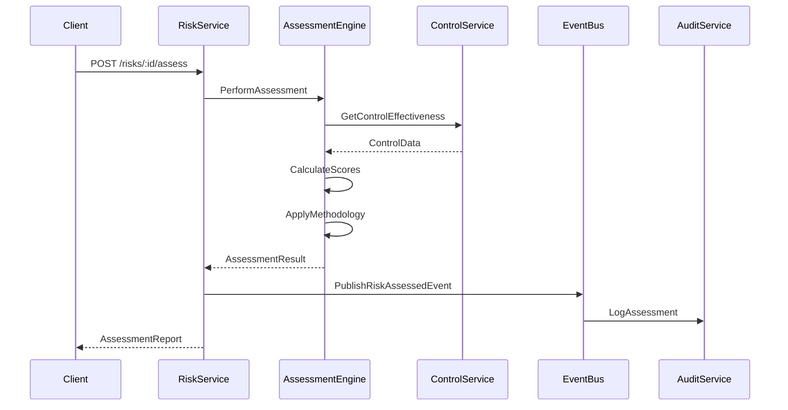
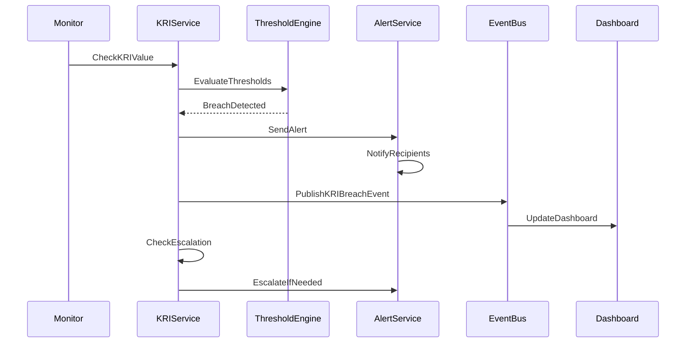

# Risk Service Specification

## Service Overview

**Service Name**: Risk Service
**Port**: 3033
**Phase**: 5 - Governance Domain (Enterprise Risk Management)
**Story Points**: 65 (Largest in Phase 5)
**Dependencies**: Identity Service, Organization Service, Audit Service, Compliance Service, All ESG Services
**Technology Stack**: NestJS, MongoDB, Neo4j (risk relationships), Redis, TensorFlow (risk modeling)
**Business Criticality**: MAXIMUM - Core ERM Platform

### Service Context

The Risk Service is the enterprise risk management (ERM) platform for Clenergize V3, providing comprehensive risk identification, assessment, monitoring, and reporting capabilities with full ESG risk integration. As the largest service in the Governance domain, it implements industry-standard frameworks (COSO ERM, ISO 31000) while enabling sophisticated risk modeling, scenario analysis, and board-level risk oversight.

### Business Value

- **Enterprise Risk Management**: Comprehensive ERM platform with risk register and controls
- **ESG Risk Integration**: Unified view of financial and non-financial risks
- **Board Oversight**: Executive dashboards and risk appetite frameworks
- **Regulatory Compliance**: COSO ERM, ISO 31000, SOX, Basel III, Solvency II
- **Scenario Analysis**: Advanced risk modeling and stress testing capabilities

## Core Requirements

### Functional Requirements

#### Risk Identification & Register
- Comprehensive risk register with categorization
- Risk taxonomy management (operational, strategic, financial, compliance, ESG)
- Emerging risk identification and monitoring
- Risk interdependency mapping
- Automated risk discovery from ESG data

#### Risk Assessment & Scoring
- Qualitative and quantitative risk assessment
- Impact and likelihood matrices
- Inherent vs residual risk scoring
- Risk velocity and volatility metrics
- Monte Carlo simulation for risk quantification

#### ESG Risk Integration
- Climate physical and transition risks (TCFD)
- Social risk factors (human rights, labor, community)
- Governance risks (ethics, compliance, cybersecurity)
- Supply chain ESG risk assessment
- Biodiversity and nature-related risks (TNFD)

#### Controls Framework
- Three Lines of Defense model
- Control library and mapping
- Control effectiveness testing
- Control deficiency tracking
- Automated control monitoring

#### Risk Appetite & Tolerance
- Risk appetite statement management
- Risk tolerance thresholds and limits
- Key Risk Indicators (KRIs)
- Risk capacity assessment
- Board-approved risk frameworks

#### Risk Monitoring & Reporting
- Real-time risk dashboards
- Risk heat maps and trend analysis
- Board risk reports
- Regulatory risk reporting
- Risk committee materials generation

#### Scenario Analysis & Stress Testing
- Scenario planning and modeling
- Stress testing frameworks
- Sensitivity analysis
- Reverse stress testing
- Climate scenario analysis (1.5°C, 2°C, 4°C)

#### Risk Response & Mitigation
- Risk treatment strategies (accept, mitigate, transfer, avoid)
- Mitigation plan tracking
- Risk action items and ownership
- Insurance and hedging tracking
- Crisis management protocols

### Non-Functional Requirements

#### Performance
- Risk calculation response time < 500ms for standard assessments
- Scenario analysis completion < 30 seconds for standard models
- Support for 10,000+ concurrent risk assessments
- Real-time KRI monitoring with < 1 second latency
- Monte Carlo simulations with 100,000+ iterations in < 5 minutes

#### Security
- SOC 2 Type II compliance
- Encryption for risk data at rest and in transit
- Role-based access control for risk information
- Audit trail for all risk decisions
- Data loss prevention for sensitive risk data

#### Scalability
- Horizontal scaling for risk calculations
- Support for 100,000+ risk records
- 50,000+ controls in control library
- 10,000+ risk scenarios
- Multi-tenant architecture

#### Reliability
- 99.99% uptime for risk monitoring
- Zero data loss for risk assessments
- Automated failover for critical risk alerts
- Disaster recovery with < 1 hour RTO
- Point-in-time recovery for risk data

## Data Models

### Core Entities

```typescript
// Risk Entity
interface Risk {
  id: string;
  organizationId: string;
  riskId: string; // Internal risk identifier (e.g., "RISK-2025-001")

  // Basic Information
  title: string;
  description: string;
  category: RiskCategory;
  subCategory: string;
  riskType: RiskType;

  // Assessment
  inherentRisk: RiskScore;
  residualRisk: RiskScore;
  targetRisk: RiskScore;
  riskVelocity: RiskVelocity;
  riskVolatility: 'Low' | 'Medium' | 'High';

  // Impact Areas
  impactAreas: ImpactArea[];
  financialImpact?: FinancialImpact;
  esgImpact?: ESGImpact;

  // Ownership
  riskOwner: string; // User ID
  riskSteward?: string; // User ID
  department: string;
  businessUnit?: string;

  // Controls
  controls: RiskControl[];
  mitigationPlans: MitigationPlan[];

  // Monitoring
  keyRiskIndicators: KeyRiskIndicator[];
  riskTriggers: RiskTrigger[];
  earlyWarningSignals: string[];

  // Status
  status: RiskStatus;
  trend: 'Increasing' | 'Stable' | 'Decreasing';
  lastAssessmentDate: Date;
  nextReviewDate: Date;

  // Relationships
  relatedRisks: string[]; // Risk IDs
  parentRisk?: string;
  childRisks: string[];

  // Metadata
  createdAt: Date;
  createdBy: string;
  updatedAt: Date;
  updatedBy: string;
  version: number;
  tags: string[];
  attachments: Attachment[];
}

// Risk Category
enum RiskCategory {
  STRATEGIC = 'Strategic',
  OPERATIONAL = 'Operational',
  FINANCIAL = 'Financial',
  COMPLIANCE = 'Compliance',
  REPUTATIONAL = 'Reputational',
  TECHNOLOGY = 'Technology',
  ENVIRONMENTAL = 'Environmental',
  SOCIAL = 'Social',
  GOVERNANCE = 'Governance',
  CYBER = 'Cyber'
}

// Risk Type
enum RiskType {
  // Environmental
  CLIMATE_PHYSICAL = 'Climate Physical',
  CLIMATE_TRANSITION = 'Climate Transition',
  WATER_SCARCITY = 'Water Scarcity',
  BIODIVERSITY_LOSS = 'Biodiversity Loss',
  POLLUTION = 'Pollution',
  RESOURCE_DEPLETION = 'Resource Depletion',

  // Social
  HUMAN_RIGHTS = 'Human Rights',
  LABOR_PRACTICES = 'Labor Practices',
  HEALTH_SAFETY = 'Health & Safety',
  DATA_PRIVACY = 'Data Privacy',
  PRODUCT_SAFETY = 'Product Safety',
  COMMUNITY_RELATIONS = 'Community Relations',

  // Governance
  BOARD_EFFECTIVENESS = 'Board Effectiveness',
  ETHICS_COMPLIANCE = 'Ethics & Compliance',
  ANTI_CORRUPTION = 'Anti-Corruption',
  SUPPLY_CHAIN = 'Supply Chain',
  THIRD_PARTY = 'Third Party',
  REGULATORY = 'Regulatory',

  // Financial
  MARKET = 'Market',
  CREDIT = 'Credit',
  LIQUIDITY = 'Liquidity',
  FOREIGN_EXCHANGE = 'Foreign Exchange',
  INTEREST_RATE = 'Interest Rate',

  // Operational
  BUSINESS_DISRUPTION = 'Business Disruption',
  PROCESS_FAILURE = 'Process Failure',
  TALENT_MANAGEMENT = 'Talent Management',
  FRAUD = 'Fraud',

  // Technology
  CYBER_ATTACK = 'Cyber Attack',
  DATA_BREACH = 'Data Breach',
  SYSTEM_FAILURE = 'System Failure',
  TECHNOLOGY_OBSOLESCENCE = 'Technology Obsolescence'
}

// Risk Score
interface RiskScore {
  likelihood: number; // 1-5 scale
  impact: number; // 1-5 scale
  score: number; // likelihood * impact
  level: 'Very Low' | 'Low' | 'Medium' | 'High' | 'Very High';
  confidence: number; // 0-100%
  methodology: 'Qualitative' | 'Quantitative' | 'Hybrid';
  lastUpdated: Date;
}

// Risk Velocity
enum RiskVelocity {
  VERY_SLOW = 'Very Slow (>12 months)',
  SLOW = 'Slow (6-12 months)',
  MEDIUM = 'Medium (3-6 months)',
  FAST = 'Fast (1-3 months)',
  VERY_FAST = 'Very Fast (<1 month)'
}

// Impact Area
interface ImpactArea {
  area: string;
  description: string;
  severity: 'Negligible' | 'Minor' | 'Moderate' | 'Major' | 'Catastrophic';
  stakeholdersAffected: string[];
}

// Financial Impact
interface FinancialImpact {
  estimatedLoss?: {
    minimum: number;
    expected: number;
    maximum: number;
    currency: string;
  };
  valueAtRisk?: number;
  earningsImpact?: number;
  capitalRequirement?: number;
  insuranceCoverage?: number;
}

// ESG Impact
interface ESGImpact {
  environmental?: {
    emissions?: number;
    waterUsage?: number;
    wasteGeneration?: number;
    biodiversityImpact?: string;
  };
  social?: {
    employeesAffected?: number;
    communitiesAffected?: number;
    humanRightsIssues?: string[];
  };
  governance?: {
    regulatoryFines?: number;
    reputationalScore?: number;
    complianceBreaches?: number;
  };
}

// Risk Control
interface RiskControl {
  id: string;
  controlId: string;
  name: string;
  description: string;
  type: ControlType;
  category: ControlCategory;
  frequency: ControlFrequency;

  effectiveness: {
    design: 'Effective' | 'Partially Effective' | 'Ineffective';
    operating: 'Effective' | 'Partially Effective' | 'Ineffective';
    lastTested: Date;
    testResults?: string;
  };

  owner: string;
  implementationStatus: 'Implemented' | 'In Progress' | 'Planned';
  automationLevel: 'Manual' | 'Semi-Automated' | 'Fully Automated';

  costBenefit?: {
    implementationCost: number;
    operatingCost: number;
    riskReduction: number;
    roi: number;
  };
}

// Control Type
enum ControlType {
  PREVENTIVE = 'Preventive',
  DETECTIVE = 'Detective',
  CORRECTIVE = 'Corrective',
  COMPENSATING = 'Compensating'
}

// Control Category
enum ControlCategory {
  ADMINISTRATIVE = 'Administrative',
  TECHNICAL = 'Technical',
  PHYSICAL = 'Physical',
  LEGAL = 'Legal'
}

// Control Frequency
enum ControlFrequency {
  CONTINUOUS = 'Continuous',
  DAILY = 'Daily',
  WEEKLY = 'Weekly',
  MONTHLY = 'Monthly',
  QUARTERLY = 'Quarterly',
  ANNUAL = 'Annual',
  AD_HOC = 'Ad Hoc'
}

// Mitigation Plan
interface MitigationPlan {
  id: string;
  title: string;
  description: string;
  strategy: 'Accept' | 'Mitigate' | 'Transfer' | 'Avoid';

  actions: MitigationAction[];
  budget?: number;
  timeline: {
    startDate: Date;
    endDate: Date;
    milestones: Milestone[];
  };

  expectedOutcome: {
    targetResidualRisk: RiskScore;
    riskReduction: number;
    confidenceLevel: number;
  };

  status: 'Draft' | 'Approved' | 'In Progress' | 'Completed' | 'On Hold';
  approver?: string;
  approvalDate?: Date;

  effectiveness?: {
    planned: number;
    actual?: number;
    variance?: number;
  };
}

// Mitigation Action
interface MitigationAction {
  id: string;
  action: string;
  owner: string;
  dueDate: Date;
  status: 'Not Started' | 'In Progress' | 'Completed' | 'Overdue';
  completionPercentage: number;
  dependencies?: string[];
  resources?: string[];
  cost?: number;
  notes?: string;
}

// Key Risk Indicator
interface KeyRiskIndicator {
  id: string;
  name: string;
  description: string;
  metric: string;
  unit: string;

  thresholds: {
    green: { min: number; max: number };
    amber: { min: number; max: number };
    red: { min: number; max: number };
  };

  currentValue: number;
  previousValue?: number;
  trend: 'Improving' | 'Stable' | 'Deteriorating';
  status: 'Green' | 'Amber' | 'Red';

  dataSource: string;
  frequency: string;
  lastUpdated: Date;

  alerting: {
    enabled: boolean;
    recipients: string[];
    escalation?: EscalationRule[];
  };
}

// Risk Trigger
interface RiskTrigger {
  id: string;
  condition: string;
  threshold: number;
  operator: 'Greater Than' | 'Less Than' | 'Equals' | 'Between';
  dataPoint: string;
  frequency: string;
  lastChecked: Date;
  triggered: boolean;
  actions: string[];
}

// Risk Assessment
interface RiskAssessment {
  id: string;
  riskId: string;
  assessmentDate: Date;
  assessor: string;

  methodology: AssessmentMethodology;
  scope: string[];
  objectives: string[];

  inherentRisk: RiskScore;
  controlEffectiveness: ControlAssessment[];
  residualRisk: RiskScore;

  findings: AssessmentFinding[];
  recommendations: string[];

  dataUsed: {
    internal: DataSource[];
    external: DataSource[];
    assumptions: string[];
  };

  validation: {
    reviewer?: string;
    reviewDate?: Date;
    status: 'Pending' | 'Approved' | 'Rejected';
    comments?: string;
  };

  nextAssessmentDate: Date;
}

// Assessment Methodology
interface AssessmentMethodology {
  type: 'Qualitative' | 'Quantitative' | 'Semi-Quantitative';
  framework: string; // COSO, ISO 31000, etc.
  approach: string;
  tools: string[];

  qualitative?: {
    interviews: number;
    workshops: number;
    surveys: number;
  };

  quantitative?: {
    models: string[];
    simulations: number;
    confidence: number;
    dataPoints: number;
  };
}

// Risk Scenario
interface RiskScenario {
  id: string;
  name: string;
  description: string;
  category: string;

  assumptions: ScenarioAssumption[];
  drivers: ScenarioDriver[];

  probability: number;
  impact: {
    financial?: number;
    operational?: string;
    reputational?: string;
    regulatory?: string;
  };

  timeHorizon: '1 year' | '3 years' | '5 years' | '10 years';

  stressTest?: {
    baseline: ScenarioResult;
    moderate: ScenarioResult;
    severe: ScenarioResult;
    extreme: ScenarioResult;
  };

  climateScenario?: {
    temperature: '1.5°C' | '2°C' | '3°C' | '4°C';
    pathway: string; // RCP2.6, RCP4.5, RCP6.0, RCP8.5
    physicalRisks: ClimateRisk[];
    transitionRisks: ClimateRisk[];
  };

  relatedRisks: string[];
  mitigationOptions: string[];

  lastUpdated: Date;
  nextReview: Date;
}

// Scenario Result
interface ScenarioResult {
  description: string;
  probability: number;
  financialImpact: number;
  operationalImpact: string;
  timeline: string;
  keyIndicators: { [key: string]: number };
}

// Risk Appetite
interface RiskAppetite {
  id: string;
  organizationId: string;

  statement: string;
  approvedBy: string;
  approvalDate: Date;
  effectiveDate: Date;
  reviewDate: Date;

  categories: RiskAppetiteCategory[];

  overallTolerance: {
    financial: number; // Maximum acceptable loss
    operational: string;
    reputational: string;
    compliance: string;
  };

  keyMetrics: RiskAppetiteMetric[];

  stakeholders: {
    board: string[];
    executive: string[];
    riskCommittee: string[];
  };

  monitoring: {
    frequency: string;
    reporting: string[];
    escalation: EscalationRule[];
  };

  version: number;
  status: 'Draft' | 'Approved' | 'Under Review' | 'Expired';
}

// Risk Appetite Category
interface RiskAppetiteCategory {
  category: RiskCategory;
  appetiteLevel: 'Averse' | 'Minimal' | 'Cautious' | 'Open' | 'Hungry';
  description: string;

  tolerances: {
    acceptable: string;
    tolerable: string;
    unacceptable: string;
  };

  metrics: string[];
  limits: { [key: string]: number };
}

// Risk Appetite Metric
interface RiskAppetiteMetric {
  metric: string;
  description: string;
  target: number;
  minimum: number;
  maximum: number;
  unit: string;
  frequency: string;
  owner: string;
}

// Risk Report
interface RiskReport {
  id: string;
  type: ReportType;
  period: ReportPeriod;

  executiveSummary: string;

  riskProfile: {
    totalRisks: number;
    byCategory: { [key: string]: number };
    byLevel: { [key: string]: number };
    trend: string;
  };

  topRisks: RiskSummary[];
  emergingRisks: RiskSummary[];
  materializedRisks: IncidentSummary[];

  riskAppetiteStatus: {
    withinAppetite: number;
    nearLimit: number;
    exceeded: number;
    breaches: AppetiteBreach[];
  };

  controlEnvironment: {
    totalControls: number;
    effective: number;
    partiallyEffective: number;
    ineffective: number;
    testingCoverage: number;
  };

  mitigationProgress: {
    planned: number;
    inProgress: number;
    completed: number;
    effectiveness: number;
  };

  keyRiskIndicators: {
    total: number;
    green: number;
    amber: number;
    red: number;
    trends: KRITrend[];
  };

  recommendations: string[];
  nextSteps: string[];

  generatedAt: Date;
  generatedBy: string;
  distribution: string[];
  confidentiality: 'Public' | 'Internal' | 'Confidential' | 'Restricted';
}

// Report Type
enum ReportType {
  BOARD = 'Board Risk Report',
  EXECUTIVE = 'Executive Risk Dashboard',
  OPERATIONAL = 'Operational Risk Report',
  REGULATORY = 'Regulatory Risk Report',
  AUDIT = 'Audit Risk Report',
  ESG = 'ESG Risk Report'
}

// Three Lines Model
interface ThreeLinesModel {
  organizationId: string;

  firstLine: {
    description: string;
    responsibilities: string[];
    roles: Role[];
    controls: string[]; // Control IDs
    reporting: string[];
  };

  secondLine: {
    description: string;
    functions: RiskFunction[];
    responsibilities: string[];
    oversight: string[];
    reporting: string[];
  };

  thirdLine: {
    description: string;
    scope: string[];
    independence: string;
    reporting: string[];
    assurance: string[];
  };

  coordination: {
    meetings: string[];
    reporting: string[];
    communication: string[];
    combinedAssurance: boolean;
  };

  effectiveness: {
    lastReview: Date;
    findings: string[];
    improvements: string[];
    maturityLevel: number; // 1-5
  };
}

// Risk Function (Second Line)
interface RiskFunction {
  name: string;
  type: 'Risk Management' | 'Compliance' | 'Quality' | 'Security' | 'Other';
  responsibilities: string[];
  headCount: number;
  reporting: string;
  tools: string[];
}

// Risk Universe
interface RiskUniverse {
  id: string;
  organizationId: string;
  version: number;

  taxonomy: RiskTaxonomy;

  coverage: {
    total: number;
    assessed: number;
    percentage: number;
    gaps: string[];
  };

  heatMap: {
    dimensions: {
      x: 'Likelihood' | 'Frequency';
      y: 'Impact' | 'Severity';
    };
    cells: HeatMapCell[];
    risks: { [key: string]: { x: number; y: number } };
  };

  interconnections: RiskInterconnection[];

  lastUpdated: Date;
  nextReview: Date;
  approver: string;
}

// Risk Taxonomy
interface RiskTaxonomy {
  levels: TaxonomyLevel[];
  categories: { [key: string]: string[] };
  tags: string[];
  customFields: CustomField[];
}

// Heat Map Cell
interface HeatMapCell {
  x: number;
  y: number;
  riskCount: number;
  riskIds: string[];
  color: 'Green' | 'Yellow' | 'Orange' | 'Red';
  label: string;
}

// Risk Interconnection
interface RiskInterconnection {
  sourceRisk: string;
  targetRisk: string;
  relationship: 'Causes' | 'Correlates' | 'Amplifies' | 'Mitigates';
  strength: 'Weak' | 'Moderate' | 'Strong';
  description: string;
}
```

## API Endpoints

### Risk Management

```typescript
// Risk CRUD Operations
POST   /api/v1/risks                    // Create new risk
GET    /api/v1/risks                    // List all risks
GET    /api/v1/risks/:id                // Get risk details
PUT    /api/v1/risks/:id                // Update risk
DELETE /api/v1/risks/:id                // Delete risk
POST   /api/v1/risks/:id/archive        // Archive risk

// Risk Assessment
POST   /api/v1/risks/:id/assess         // Perform risk assessment
GET    /api/v1/risks/:id/assessments    // Get assessment history
POST   /api/v1/risks/:id/score          // Update risk score
POST   /api/v1/risks/:id/validate       // Validate risk assessment

// Risk Search and Filter
GET    /api/v1/risks/search             // Search risks
GET    /api/v1/risks/filter             // Filter risks
GET    /api/v1/risks/by-category/:category  // Get risks by category
GET    /api/v1/risks/by-owner/:userId   // Get risks by owner
GET    /api/v1/risks/high-priority      // Get high priority risks

// Risk Relationships
POST   /api/v1/risks/:id/link           // Link related risks
DELETE /api/v1/risks/:id/unlink         // Unlink risks
GET    /api/v1/risks/:id/dependencies   // Get risk dependencies
GET    /api/v1/risks/:id/impacts        // Get cascading impacts

// Bulk Operations
POST   /api/v1/risks/bulk/create        // Create multiple risks
PUT    /api/v1/risks/bulk/update        // Update multiple risks
POST   /api/v1/risks/bulk/assess        // Bulk risk assessment
```

### Controls Management

```typescript
// Control Operations
POST   /api/v1/controls                 // Create control
GET    /api/v1/controls                 // List controls
GET    /api/v1/controls/:id             // Get control details
PUT    /api/v1/controls/:id             // Update control
DELETE /api/v1/controls/:id             // Delete control

// Control Assignment
POST   /api/v1/risks/:id/controls       // Assign control to risk
DELETE /api/v1/risks/:id/controls/:controlId  // Remove control
PUT    /api/v1/risks/:id/controls/:controlId  // Update control mapping

// Control Testing
POST   /api/v1/controls/:id/test        // Test control effectiveness
GET    /api/v1/controls/:id/test-history // Get test history
POST   /api/v1/controls/:id/certify     // Certify control
GET    /api/v1/controls/testing-schedule // Get testing schedule

// Control Library
GET    /api/v1/controls/library         // Get control library
POST   /api/v1/controls/library/import  // Import control library
GET    /api/v1/controls/library/export  // Export control library
POST   /api/v1/controls/library/map     // Map controls to framework
```

### Mitigation Management

```typescript
// Mitigation Plans
POST   /api/v1/risks/:id/mitigations    // Create mitigation plan
GET    /api/v1/risks/:id/mitigations    // Get mitigation plans
PUT    /api/v1/mitigations/:id          // Update mitigation plan
DELETE /api/v1/mitigations/:id          // Delete mitigation plan

// Mitigation Actions
POST   /api/v1/mitigations/:id/actions  // Add mitigation action
PUT    /api/v1/actions/:id              // Update action status
POST   /api/v1/actions/:id/complete     // Complete action
GET    /api/v1/actions/overdue          // Get overdue actions

// Mitigation Tracking
GET    /api/v1/mitigations/status       // Get mitigation status
GET    /api/v1/mitigations/effectiveness // Measure effectiveness
POST   /api/v1/mitigations/:id/approve  // Approve mitigation plan
GET    /api/v1/mitigations/budget       // Get mitigation budget
```

### Risk Monitoring

```typescript
// Key Risk Indicators
POST   /api/v1/kris                     // Create KRI
GET    /api/v1/kris                     // List KRIs
PUT    /api/v1/kris/:id                 // Update KRI
DELETE /api/v1/kris/:id                 // Delete KRI
POST   /api/v1/kris/:id/update-value    // Update KRI value

// KRI Monitoring
GET    /api/v1/kris/dashboard           // KRI dashboard
GET    /api/v1/kris/alerts              // Get KRI alerts
POST   /api/v1/kris/:id/acknowledge     // Acknowledge alert
GET    /api/v1/kris/trends              // Get KRI trends
GET    /api/v1/kris/breaches            // Get threshold breaches

// Risk Triggers
POST   /api/v1/triggers                 // Create risk trigger
GET    /api/v1/triggers/active          // Get active triggers
POST   /api/v1/triggers/:id/evaluate    // Evaluate trigger
GET    /api/v1/triggers/fired           // Get fired triggers

// Real-time Monitoring
GET    /api/v1/monitoring/realtime      // Real-time risk status
WS     /api/v1/monitoring/stream        // WebSocket risk stream
GET    /api/v1/monitoring/alerts        // Active risk alerts
POST   /api/v1/monitoring/subscribe     // Subscribe to risk events
```

### Scenario Analysis

```typescript
// Scenario Management
POST   /api/v1/scenarios                // Create scenario
GET    /api/v1/scenarios                // List scenarios
GET    /api/v1/scenarios/:id            // Get scenario details
PUT    /api/v1/scenarios/:id            // Update scenario
DELETE /api/v1/scenarios/:id            // Delete scenario

// Scenario Analysis
POST   /api/v1/scenarios/:id/run        // Run scenario analysis
GET    /api/v1/scenarios/:id/results    // Get analysis results
POST   /api/v1/scenarios/:id/stress-test // Run stress test
GET    /api/v1/scenarios/comparison     // Compare scenarios

// Climate Scenarios
GET    /api/v1/scenarios/climate        // Climate scenarios
POST   /api/v1/scenarios/climate/analyze // Analyze climate scenario
GET    /api/v1/scenarios/tcfd           // TCFD scenarios
POST   /api/v1/scenarios/physical-risk  // Physical risk analysis
POST   /api/v1/scenarios/transition-risk // Transition risk analysis

// Monte Carlo Simulation
POST   /api/v1/simulations/monte-carlo  // Run Monte Carlo
GET    /api/v1/simulations/:id/results  // Get simulation results
POST   /api/v1/simulations/sensitivity  // Sensitivity analysis
GET    /api/v1/simulations/var          // Value at Risk calculation
```

### Risk Appetite

```typescript
// Risk Appetite Management
POST   /api/v1/risk-appetite            // Define risk appetite
GET    /api/v1/risk-appetite/current    // Get current appetite
PUT    /api/v1/risk-appetite/:id        // Update appetite
POST   /api/v1/risk-appetite/:id/approve // Approve appetite

// Appetite Monitoring
GET    /api/v1/risk-appetite/status     // Appetite vs actual
GET    /api/v1/risk-appetite/breaches   // Appetite breaches
POST   /api/v1/risk-appetite/alert      // Alert on breach
GET    /api/v1/risk-appetite/metrics    // Appetite metrics

// Tolerance Limits
POST   /api/v1/tolerances               // Set tolerance limits
GET    /api/v1/tolerances/status        // Tolerance status
PUT    /api/v1/tolerances/:id           // Update tolerance
GET    /api/v1/tolerances/exceptions    // Tolerance exceptions
```

### Three Lines Model

```typescript
// Three Lines Configuration
POST   /api/v1/three-lines/setup        // Setup three lines
GET    /api/v1/three-lines/model        // Get current model
PUT    /api/v1/three-lines/update       // Update model

// Line Management
GET    /api/v1/three-lines/first        // First line info
GET    /api/v1/three-lines/second       // Second line info
GET    /api/v1/three-lines/third        // Third line info

// Coordination
POST   /api/v1/three-lines/coordinate   // Coordination meeting
GET    /api/v1/three-lines/assurance    // Combined assurance
GET    /api/v1/three-lines/gaps         // Assurance gaps
POST   /api/v1/three-lines/report       // Three lines report
```

### Risk Reporting

```typescript
// Report Generation
POST   /api/v1/reports/board            // Board risk report
POST   /api/v1/reports/executive        // Executive dashboard
POST   /api/v1/reports/operational      // Operational report
POST   /api/v1/reports/regulatory       // Regulatory report
POST   /api/v1/reports/esg              // ESG risk report

// Report Management
GET    /api/v1/reports                  // List reports
GET    /api/v1/reports/:id              // Get report
POST   /api/v1/reports/:id/distribute   // Distribute report
GET    /api/v1/reports/:id/download     // Download report

// Heat Maps
GET    /api/v1/reports/heatmap          // Risk heat map
GET    /api/v1/reports/heatmap/interactive // Interactive heat map
POST   /api/v1/reports/heatmap/export   // Export heat map

// Dashboards
GET    /api/v1/dashboards/risk          // Risk dashboard
GET    /api/v1/dashboards/executive     // Executive dashboard
GET    /api/v1/dashboards/kri           // KRI dashboard
GET    /api/v1/dashboards/compliance    // Compliance dashboard
```

### ESG Risk Integration

```typescript
// ESG Risk Assessment
POST   /api/v1/esg-risks/assess         // ESG risk assessment
GET    /api/v1/esg-risks/climate        // Climate risks
GET    /api/v1/esg-risks/social         // Social risks
GET    /api/v1/esg-risks/governance     // Governance risks

// ESG Integration
POST   /api/v1/esg-risks/integrate      // Integrate ESG data
GET    /api/v1/esg-risks/materiality    // Material ESG risks
POST   /api/v1/esg-risks/score          // ESG risk scoring
GET    /api/v1/esg-risks/trends         // ESG risk trends

// Supply Chain ESG
POST   /api/v1/supply-chain/assess      // Supply chain assessment
GET    /api/v1/supply-chain/risks       // Supply chain risks
POST   /api/v1/supply-chain/monitor     // Monitor suppliers
GET    /api/v1/supply-chain/incidents   // Supply chain incidents
```

### Risk Universe

```typescript
// Universe Management
POST   /api/v1/universe/create          // Create risk universe
GET    /api/v1/universe/current         // Get current universe
PUT    /api/v1/universe/:id             // Update universe
POST   /api/v1/universe/refresh         // Refresh universe

// Taxonomy
GET    /api/v1/universe/taxonomy        // Get risk taxonomy
PUT    /api/v1/universe/taxonomy        // Update taxonomy
POST   /api/v1/universe/categorize      // Categorize risks
GET    /api/v1/universe/coverage        // Coverage analysis

// Risk Mapping
GET    /api/v1/universe/map             // Risk universe map
GET    /api/v1/universe/interconnections // Risk interconnections
POST   /api/v1/universe/analyze         // Analyze universe
GET    /api/v1/universe/gaps            // Identify gaps
```

### Compliance & Audit

```typescript
// Compliance Integration
GET    /api/v1/compliance/requirements  // Compliance requirements
POST   /api/v1/compliance/map           // Map risks to compliance
GET    /api/v1/compliance/gaps          // Compliance gaps
POST   /api/v1/compliance/certify       // Compliance certification

// Audit Integration
GET    /api/v1/audit/findings           // Audit findings
POST   /api/v1/audit/risks              // Risks from audit
GET    /api/v1/audit/recommendations    // Audit recommendations
POST   /api/v1/audit/response           // Management response

// Framework Mapping
GET    /api/v1/frameworks               // Available frameworks
POST   /api/v1/frameworks/map           // Map to framework
GET    /api/v1/frameworks/coso          // COSO mapping
GET    /api/v1/frameworks/iso31000      // ISO 31000 mapping
```

## Service Architecture

### Component Structure

```
risk-service/
├── src/
│   ├── domain/
│   │   ├── entities/
│   │   │   ├── risk.entity.ts
│   │   │   ├── control.entity.ts
│   │   │   ├── mitigation.entity.ts
│   │   │   ├── assessment.entity.ts
│   │   │   ├── scenario.entity.ts
│   │   │   ├── kri.entity.ts
│   │   │   └── appetite.entity.ts
│   │   ├── value-objects/
│   │   │   ├── risk-score.vo.ts
│   │   │   ├── risk-level.vo.ts
│   │   │   ├── control-effectiveness.vo.ts
│   │   │   └── impact-area.vo.ts
│   │   ├── events/
│   │   │   ├── risk-created.event.ts
│   │   │   ├── risk-assessed.event.ts
│   │   │   ├── control-tested.event.ts
│   │   │   ├── kri-breach.event.ts
│   │   │   └── appetite-exceeded.event.ts
│   │   └── services/
│   │       ├── risk-calculator.service.ts
│   │       ├── control-evaluator.service.ts
│   │       ├── scenario-analyzer.service.ts
│   │       └── monte-carlo.service.ts
│   │
│   ├── application/
│   │   ├── commands/
│   │   │   ├── create-risk.command.ts
│   │   │   ├── assess-risk.command.ts
│   │   │   ├── assign-control.command.ts
│   │   │   ├── create-mitigation.command.ts
│   │   │   └── run-scenario.command.ts
│   │   ├── queries/
│   │   │   ├── get-risk-register.query.ts
│   │   │   ├── get-risk-heatmap.query.ts
│   │   │   ├── get-kri-dashboard.query.ts
│   │   │   └── get-appetite-status.query.ts
│   │   ├── services/
│   │   │   ├── risk-assessment.service.ts
│   │   │   ├── control-management.service.ts
│   │   │   ├── mitigation-tracking.service.ts
│   │   │   └── risk-monitoring.service.ts
│   │   └── dto/
│   │       ├── create-risk.dto.ts
│   │       ├── assess-risk.dto.ts
│   │       ├── risk-filter.dto.ts
│   │       └── scenario-params.dto.ts
│   │
│   ├── infrastructure/
│   │   ├── persistence/
│   │   │   ├── repositories/
│   │   │   │   ├── risk.repository.ts
│   │   │   │   ├── control.repository.ts
│   │   │   │   └── assessment.repository.ts
│   │   │   ├── schemas/
│   │   │   │   ├── risk.schema.ts
│   │   │   │   ├── control.schema.ts
│   │   │   │   └── assessment.schema.ts
│   │   │   └── migrations/
│   │   ├── graph/
│   │   │   ├── neo4j.service.ts
│   │   │   ├── risk-graph.repository.ts
│   │   │   └── queries/
│   │   ├── ml/
│   │   │   ├── risk-prediction.model.ts
│   │   │   ├── anomaly-detection.model.ts
│   │   │   └── clustering.model.ts
│   │   ├── integrations/
│   │   │   ├── esg-services.client.ts
│   │   │   ├── audit-service.client.ts
│   │   │   └── compliance-service.client.ts
│   │   └── messaging/
│   │       ├── event-publisher.ts
│   │       └── event-handlers/
│   │
│   ├── interfaces/
│   │   ├── rest/
│   │   │   ├── controllers/
│   │   │   │   ├── risk.controller.ts
│   │   │   │   ├── control.controller.ts
│   │   │   │   ├── mitigation.controller.ts
│   │   │   │   ├── kri.controller.ts
│   │   │   │   └── scenario.controller.ts
│   │   │   └── middleware/
│   │   ├── graphql/
│   │   │   ├── resolvers/
│   │   │   └── schemas/
│   │   └── websocket/
│   │       ├── gateways/
│   │       └── handlers/
│   │
│   └── shared/
│       ├── constants/
│       ├── exceptions/
│       ├── utils/
│       └── types/
│
├── test/
│   ├── unit/
│   ├── integration/
│   └── e2e/
│
├── docs/
│   ├── api/
│   ├── architecture/
│   └── guides/
│
└── package.json
```

## Implementation Details

### Risk Calculation Engine

```typescript
// Risk Score Calculation
export class RiskCalculatorService {
  calculateInherentRisk(
    likelihood: number,
    impact: number,
    velocity?: RiskVelocity,
    volatility?: string
  ): RiskScore {
    // Base score calculation
    const baseScore = likelihood * impact;

    // Velocity adjustment
    const velocityMultiplier = this.getVelocityMultiplier(velocity);

    // Volatility adjustment
    const volatilityMultiplier = this.getVolatilityMultiplier(volatility);

    // Calculate final score
    const adjustedScore = baseScore * velocityMultiplier * volatilityMultiplier;

    return {
      likelihood,
      impact,
      score: Math.min(adjustedScore, 25), // Cap at maximum
      level: this.getRiskLevel(adjustedScore),
      confidence: this.calculateConfidence(likelihood, impact),
      methodology: 'Quantitative',
      lastUpdated: new Date()
    };
  }

  calculateResidualRisk(
    inherentRisk: RiskScore,
    controls: RiskControl[]
  ): RiskScore {
    // Calculate control effectiveness
    const overallEffectiveness = this.calculateControlEffectiveness(controls);

    // Apply control reduction
    const residualScore = inherentRisk.score * (1 - overallEffectiveness);

    return {
      ...inherentRisk,
      score: residualScore,
      level: this.getRiskLevel(residualScore)
    };
  }

  private calculateControlEffectiveness(controls: RiskControl[]): number {
    if (controls.length === 0) return 0;

    const effectiveness = controls.reduce((total, control) => {
      const designScore = this.getEffectivenessScore(control.effectiveness.design);
      const operatingScore = this.getEffectivenessScore(control.effectiveness.operating);
      const controlScore = (designScore + operatingScore) / 2;

      // Weight by control type
      const typeWeight = this.getControlTypeWeight(control.type);

      return total + (controlScore * typeWeight);
    }, 0);

    return Math.min(effectiveness / controls.length, 0.95); // Cap at 95% reduction
  }
}
```

### Monte Carlo Simulation

```typescript
export class MonteCarloService {
  async runSimulation(
    risk: Risk,
    iterations: number = 10000
  ): Promise<SimulationResult> {
    const results: number[] = [];

    for (let i = 0; i < iterations; i++) {
      // Generate random values based on distributions
      const likelihood = this.sampleDistribution(
        risk.inherentRisk.likelihood,
        'beta'
      );

      const impact = this.sampleDistribution(
        risk.inherentRisk.impact,
        'lognormal'
      );

      // Calculate risk score for this iteration
      const score = likelihood * impact;
      results.push(score);
    }

    // Calculate statistics
    return {
      mean: this.calculateMean(results),
      median: this.calculateMedian(results),
      stdDev: this.calculateStdDev(results),
      percentiles: {
        p5: this.calculatePercentile(results, 5),
        p25: this.calculatePercentile(results, 25),
        p50: this.calculatePercentile(results, 50),
        p75: this.calculatePercentile(results, 75),
        p95: this.calculatePercentile(results, 95),
        p99: this.calculatePercentile(results, 99)
      },
      valueAtRisk: {
        var95: this.calculateVaR(results, 0.95),
        var99: this.calculateVaR(results, 0.99)
      },
      expectedShortfall: this.calculateExpectedShortfall(results, 0.95),
      histogram: this.generateHistogram(results),
      iterations,
      convergence: this.checkConvergence(results)
    };
  }

  private sampleDistribution(
    value: number,
    distribution: string
  ): number {
    switch (distribution) {
      case 'normal':
        return this.sampleNormal(value, value * 0.2);
      case 'lognormal':
        return this.sampleLogNormal(value, value * 0.3);
      case 'beta':
        return this.sampleBeta(value);
      case 'uniform':
        return this.sampleUniform(value * 0.8, value * 1.2);
      default:
        return value;
    }
  }
}
```

### Climate Risk Analysis

```typescript
export class ClimateRiskAnalyzer {
  async analyzeClimateRisk(
    organizationId: string,
    scenario: ClimateScenario
  ): Promise<ClimateRiskAssessment> {
    // Physical risk analysis
    const physicalRisks = await this.assessPhysicalRisks(
      organizationId,
      scenario
    );

    // Transition risk analysis
    const transitionRisks = await this.assessTransitionRisks(
      organizationId,
      scenario
    );

    // Financial impact modeling
    const financialImpact = await this.modelFinancialImpact(
      physicalRisks,
      transitionRisks,
      scenario
    );

    // Adaptation and mitigation options
    const adaptationOptions = this.identifyAdaptationOptions(
      physicalRisks,
      transitionRisks
    );

    return {
      scenario,
      physicalRisks,
      transitionRisks,
      financialImpact,
      adaptationOptions,
      overallRiskLevel: this.calculateOverallClimateRisk(
        physicalRisks,
        transitionRisks
      ),
      confidence: this.assessConfidence(scenario),
      recommendations: this.generateRecommendations(
        physicalRisks,
        transitionRisks,
        adaptationOptions
      )
    };
  }

  private async assessPhysicalRisks(
    organizationId: string,
    scenario: ClimateScenario
  ): Promise<PhysicalRisk[]> {
    const risks: PhysicalRisk[] = [];

    // Acute risks
    risks.push(...await this.assessAcuteRisks(organizationId, scenario));

    // Chronic risks
    risks.push(...await this.assessChronicRisks(organizationId, scenario));

    return risks;
  }

  private async assessTransitionRisks(
    organizationId: string,
    scenario: ClimateScenario
  ): Promise<TransitionRisk[]> {
    const risks: TransitionRisk[] = [];

    // Policy and legal risks
    risks.push(...await this.assessPolicyRisks(organizationId, scenario));

    // Technology risks
    risks.push(...await this.assessTechnologyRisks(organizationId, scenario));

    // Market risks
    risks.push(...await this.assessMarketRisks(organizationId, scenario));

    // Reputation risks
    risks.push(...await this.assessReputationRisks(organizationId, scenario));

    return risks;
  }
}
```

### KRI Monitoring System

```typescript
export class KRIMonitoringService {
  private monitoringIntervals: Map<string, NodeJS.Timeout> = new Map();

  async startMonitoring(kri: KeyRiskIndicator): Promise<void> {
    const intervalMs = this.getIntervalMs(kri.frequency);

    const interval = setInterval(async () => {
      try {
        // Fetch current value
        const currentValue = await this.fetchKRIValue(kri);

        // Update KRI
        await this.updateKRIValue(kri.id, currentValue);

        // Check thresholds
        const status = this.evaluateThresholds(currentValue, kri.thresholds);

        // Trigger alerts if needed
        if (status !== kri.status) {
          await this.handleStatusChange(kri, status, currentValue);
        }

        // Check for trends
        await this.analyzeTrend(kri, currentValue);

      } catch (error) {
        this.logger.error(`KRI monitoring error for ${kri.id}:`, error);
      }
    }, intervalMs);

    this.monitoringIntervals.set(kri.id, interval);
  }

  private evaluateThresholds(
    value: number,
    thresholds: KRIThresholds
  ): 'Green' | 'Amber' | 'Red' {
    if (value >= thresholds.red.min && value <= thresholds.red.max) {
      return 'Red';
    }
    if (value >= thresholds.amber.min && value <= thresholds.amber.max) {
      return 'Amber';
    }
    return 'Green';
  }

  private async handleStatusChange(
    kri: KeyRiskIndicator,
    newStatus: string,
    value: number
  ): Promise<void> {
    // Update status
    await this.updateKRIStatus(kri.id, newStatus);

    // Send alerts
    if (kri.alerting.enabled) {
      await this.sendAlerts(kri, newStatus, value);

      // Handle escalation
      if (newStatus === 'Red' && kri.alerting.escalation) {
        await this.escalateAlert(kri, value);
      }
    }

    // Publish event
    await this.eventBus.publish(new KRIBreachEvent({
      kriId: kri.id,
      kriName: kri.name,
      previousStatus: kri.status,
      newStatus,
      currentValue: value,
      threshold: kri.thresholds[newStatus.toLowerCase()],
      timestamp: new Date()
    }));
  }
}
```

### Three Lines Implementation

```typescript
export class ThreeLinesService {
  async evaluateThreeLines(
    organizationId: string
  ): Promise<ThreeLinesAssessment> {
    // Assess first line
    const firstLineAssessment = await this.assessFirstLine(organizationId);

    // Assess second line
    const secondLineAssessment = await this.assessSecondLine(organizationId);

    // Assess third line
    const thirdLineAssessment = await this.assessThirdLine(organizationId);

    // Evaluate coordination
    const coordinationAssessment = await this.assessCoordination(
      firstLineAssessment,
      secondLineAssessment,
      thirdLineAssessment
    );

    // Identify gaps
    const gaps = this.identifyAssuranceGaps(
      firstLineAssessment,
      secondLineAssessment,
      thirdLineAssessment
    );

    // Calculate maturity
    const maturityScore = this.calculateMaturity(
      firstLineAssessment,
      secondLineAssessment,
      thirdLineAssessment,
      coordinationAssessment
    );

    return {
      firstLine: firstLineAssessment,
      secondLine: secondLineAssessment,
      thirdLine: thirdLineAssessment,
      coordination: coordinationAssessment,
      gaps,
      maturityScore,
      recommendations: this.generateRecommendations(gaps, maturityScore),
      nextReviewDate: this.calculateNextReview(maturityScore)
    };
  }

  private async assessFirstLine(
    organizationId: string
  ): Promise<LineAssessment> {
    // Evaluate management controls
    const managementControls = await this.evaluateManagementControls(
      organizationId
    );

    // Assess risk ownership
    const riskOwnership = await this.assessRiskOwnership(organizationId);

    // Review control implementation
    const controlImplementation = await this.reviewControlImplementation(
      organizationId
    );

    return {
      effectiveness: this.calculateEffectiveness(
        managementControls,
        riskOwnership,
        controlImplementation
      ),
      strengths: this.identifyStrengths(managementControls, riskOwnership),
      weaknesses: this.identifyWeaknesses(managementControls, riskOwnership),
      coverage: this.calculateCoverage(controlImplementation),
      maturity: this.assessMaturity(
        managementControls,
        riskOwnership,
        controlImplementation
      )
    };
  }
}
```

## Event Flows

### Risk Assessment Event Flow



### KRI Breach Event Flow



## Integration Points

### ESG Service Integration

```typescript
interface ESGIntegrationService {
  // Carbon Service Integration
  async getEmissionRisks(): Promise<EmissionRisk[]>;
  async linkCarbonTargets(riskId: string): Promise<void>;

  // Water Service Integration
  async getWaterRisks(): Promise<WaterRisk[]>;
  async assessWaterStress(locationId: string): Promise<RiskScore>;

  // Social Service Integration
  async getHumanRightsRisks(): Promise<HumanRightsRisk[]>;
  async getSupplyChainRisks(): Promise<SupplyChainRisk[]>;

  // Governance Service Integration
  async getComplianceRisks(): Promise<ComplianceRisk[]>;
  async getCyberRisks(): Promise<CyberRisk[]>;
}
```

### External System Integration

```typescript
interface ExternalIntegrations {
  // GRC Platforms
  async syncWithGRCPlatform(platform: 'ServiceNow' | 'Archer' | 'MetricStream'): Promise<void>;

  // Risk Data Providers
  async importRiskIntelligence(provider: 'Moodys' | 'SP' | 'Fitch'): Promise<void>;

  // Insurance Systems
  async syncInsuranceData(system: 'Aon' | 'Marsh' | 'Willis'): Promise<void>;

  // Regulatory Databases
  async checkRegulatoryUpdates(jurisdiction: string): Promise<RegulatoryUpdate[]>;
}
```

## Security Considerations

### Data Security

```typescript
interface RiskDataSecurity {
  // Encryption
  encryptionAtRest: 'AES-256-GCM';
  encryptionInTransit: 'TLS 1.3';

  // Access Control
  rbac: {
    roles: ['RiskAdmin', 'RiskManager', 'RiskAnalyst', 'RiskViewer'];
    permissions: Map<string, Permission[]>;
  };

  // Data Classification
  classification: {
    public: string[];
    internal: string[];
    confidential: string[];
    restricted: string[];
  };

  // Audit Requirements
  audit: {
    allOperations: boolean;
    retention: '7 years';
    immutable: boolean;
  };
}
```

### Compliance Requirements

- COSO ERM Framework compliance
- ISO 31000:2018 alignment
- SOX Section 404 requirements
- Basel III operational risk
- Solvency II risk management
- GDPR for risk data handling

## Performance Optimization

### Caching Strategy

```typescript
interface RiskCachingStrategy {
  // Redis caching
  cacheLayer: {
    riskScores: { ttl: 300 }; // 5 minutes
    heatMaps: { ttl: 600 }; // 10 minutes
    dashboards: { ttl: 60 }; // 1 minute
    reports: { ttl: 3600 }; // 1 hour
  };

  // Database indexes
  indexes: [
    'risk.organizationId',
    'risk.category',
    'risk.status',
    'risk.riskOwner',
    'risk.residualRisk.level',
    'control.effectiveness',
    'kri.status'
  ];

  // Query optimization
  aggregationPipelines: boolean;
  projectionOptimization: boolean;
  parallelQueries: boolean;
}
```

### Scalability Patterns

```typescript
interface ScalabilityPatterns {
  // Horizontal scaling
  microserviceArchitecture: true;
  loadBalancing: 'round-robin';
  autoScaling: {
    minInstances: 2;
    maxInstances: 10;
    targetCPU: 70;
  };

  // Data partitioning
  sharding: {
    strategy: 'organization';
    replication: 3;
  };

  // Async processing
  queueing: 'AWS SQS';
  batchProcessing: true;
  eventDriven: true;
}
```

## Monitoring & Observability

### Metrics

```typescript
interface RiskServiceMetrics {
  // Business metrics
  totalRisks: Counter;
  highRisksCount: Gauge;
  assessmentsCompleted: Counter;
  mitigationEffectiveness: Gauge;
  kriBreaches: Counter;

  // Performance metrics
  assessmentDuration: Histogram;
  calculationLatency: Histogram;
  apiResponseTime: Histogram;

  // System metrics
  errorRate: Counter;
  requestRate: Counter;
  cpuUtilization: Gauge;
  memoryUsage: Gauge;
}
```

### Logging

```typescript
interface LoggingStrategy {
  // Structured logging
  format: 'JSON';
  fields: {
    timestamp: Date;
    level: string;
    service: 'risk-service';
    correlationId: string;
    userId: string;
    action: string;
    riskId?: string;
    duration?: number;
  };

  // Log levels
  levels: {
    error: 'Risk calculation failures, system errors';
    warn: 'Threshold breaches, performance degradation';
    info: 'Risk assessments, control tests, reports';
    debug: 'Calculation details, query performance';
  };
}
```

## Testing Strategy

### Test Coverage Requirements

```yaml
unit_tests:
  coverage: 85%
  focus:
    - Risk calculation algorithms
    - Score computation
    - Threshold evaluation
    - Control effectiveness

integration_tests:
  coverage: 80%
  focus:
    - Database operations
    - Event publishing
    - Service integration
    - API endpoints

e2e_tests:
  scenarios:
    - Complete risk assessment workflow
    - KRI monitoring and alerting
    - Three lines evaluation
    - Report generation
    - Climate scenario analysis

performance_tests:
  targets:
    - Risk calculation: <500ms
    - Monte Carlo (10k): <5s
    - Report generation: <10s
    - Dashboard load: <2s
```

## Deployment Configuration

```yaml
# kubernetes/risk-service.yaml
apiVersion: apps/v1
kind: Deployment
metadata:
  name: risk-service
  namespace: governance
spec:
  replicas: 3
  strategy:
    type: RollingUpdate
    rollingUpdate:
      maxSurge: 1
      maxUnavailable: 0
  template:
    spec:
      containers:
      - name: risk-service
        image: clenergize/risk-service:latest
        ports:
        - containerPort: 3033
        env:
        - name: SERVICE_PORT
          value: "3033"
        - name: MONGODB_URI
          valueFrom:
            secretKeyRef:
              name: mongodb-secret
              key: uri
        - name: NEO4J_URI
          valueFrom:
            secretKeyRef:
              name: neo4j-secret
              key: uri
        - name: REDIS_URL
          valueFrom:
            secretKeyRef:
              name: redis-secret
              key: url
        resources:
          requests:
            memory: "1Gi"
            cpu: "500m"
          limits:
            memory: "2Gi"
            cpu: "1000m"
        livenessProbe:
          httpGet:
            path: /health
            port: 3033
          initialDelaySeconds: 30
          periodSeconds: 10
        readinessProbe:
          httpGet:
            path: /ready
            port: 3033
          initialDelaySeconds: 5
          periodSeconds: 5
```

## Development Timeline

### Phase 5 - Sprint Plan (65 Story Points)

**Sprint 5.1 (13 points)**
- Risk entity and domain model
- Basic CRUD operations
- Risk categorization and taxonomy
- Initial database schema

**Sprint 5.2 (13 points)**
- Risk assessment engine
- Scoring algorithms
- Control framework integration
- Control effectiveness calculation

**Sprint 5.3 (13 points)**
- KRI implementation
- Monitoring system
- Alert mechanism
- Real-time dashboards

**Sprint 5.4 (13 points)**
- Three Lines model
- Scenario analysis engine
- Monte Carlo simulation
- Climate risk integration

**Sprint 5.5 (13 points)**
- Risk appetite framework
- Board reporting
- Heat map generation
- Complete integration testing

## Documentation Requirements

### API Documentation
- OpenAPI 3.0 specification
- Postman collection
- GraphQL schema documentation
- WebSocket event documentation

### User Guides
- Risk Manager Guide
- Board Reporting Guide
- KRI Configuration Guide
- Scenario Analysis Guide
- Three Lines Setup Guide

### Technical Documentation
- Architecture overview
- Risk calculation methodology
- Integration guide
- Deployment guide
- Monitoring guide

## Compliance & Validation

### Framework Alignment
- COSO ERM 2017
- ISO 31000:2018
- TCFD Recommendations
- TNFD Beta Framework
- Basel III Requirements
- Solvency II Directive

### Audit Requirements
- Complete audit trail
- Risk decision history
- Assessment documentation
- Control testing evidence
- Board reporting archive

## Support & Maintenance

### SLA Requirements
- Availability: 99.99%
- Response time: <500ms (p95)
- Recovery time: <1 hour
- Data retention: 7 years
- Support hours: 24/7 for critical

### Maintenance Windows
- Planned: Monthly, 2-hour window
- Emergency: As needed with notification
- Updates: Blue-green deployment
- Backups: Daily with point-in-time recovery