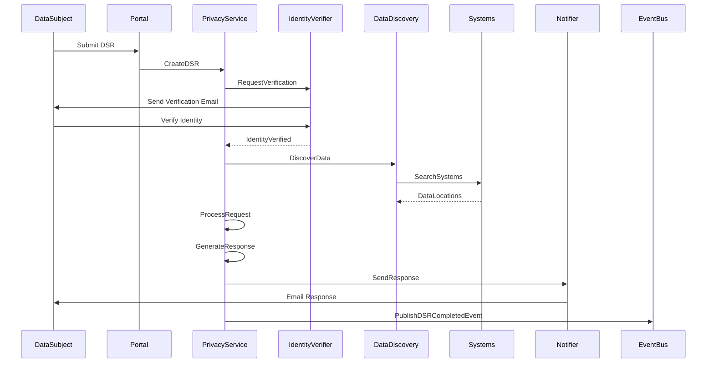
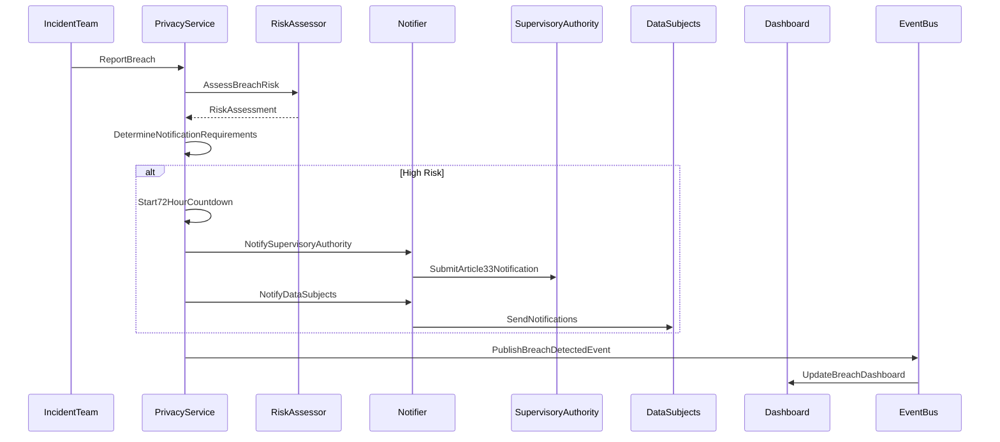

# Privacy Service Specification

## Service Overview

**Service Name**: Privacy Service
**Port**: 3034
**Phase**: 5 - Governance Domain (Data Privacy & Protection)
**Story Points**: 60 (Second-largest in Phase 5)
**Dependencies**: Identity Service, Organization Service, Audit Service, Board Service, Cybersecurity Service
**Technology Stack**: NestJS, MongoDB, Redis, PostgreSQL (for ROPA), Kafka, Python (privacy risk analysis)
**Business Criticality**: CRITICAL - Legal & Regulatory Compliance

### Service Context

The Privacy Service is the comprehensive data privacy and protection platform for Clenergize V3, providing data subject rights management (GDPR Chapter 3), privacy impact assessments (GDPR Article 35), consent management, data inventory, ROPA (Record of Processing Activities), breach response (<72 hour GDPR notification), and privacy training. As the second-largest service in the Governance domain, it implements GDPR, CCPA/CPRA, ISO 27701, and other global privacy frameworks while enabling automated DSR (Data Subject Request) workflows, privacy-by-design controls, and third-party DPA (Data Processing Agreement) management.

### Business Value

- **Legal Compliance**: GDPR, CCPA/CPRA, UK DPA, Brazil LGPD, China PIPL compliance
- **Risk Mitigation**: Reduce data breach fines (up to €20M or 4% global revenue under GDPR)
- **Trust & Reputation**: Demonstrate privacy commitment to customers and stakeholders
- **Operational Efficiency**: Automate DSR fulfillment, consent management, breach response
- **Board Oversight**: Privacy governance dashboards, DPO reporting, third-party risk visibility

## Core Requirements

### Functional Requirements

#### Data Inventory & Mapping
- Comprehensive data asset catalog
- Data flow mapping and visualization
- Personal data identification and classification
- System and database inventory
- Cross-border transfer tracking
- Data lifecycle management (collection, use, retention, deletion)

#### Record of Processing Activities (ROPA)
- GDPR Article 30 compliance
- Processing purpose documentation
- Legal basis tracking (consent, contract, legitimate interest, etc.)
- Data controller vs processor designation
- Third-party processor registry
- Joint controller agreements
- Automated ROPA generation and updates

#### Privacy Impact Assessments (PIAs/DPIAs)
- GDPR Article 35 DPIA requirements
- High-risk processing identification
- Necessity and proportionality assessment
- Risk-to-rights evaluation
- Mitigation measure tracking
- DPO consultation workflow
- Supervisory authority consultation (if required)

#### Data Subject Rights Management
- GDPR Chapter 3 rights implementation:
  - Right of Access (Article 15)
  - Right to Rectification (Article 16)
  - Right to Erasure / "Right to be Forgotten" (Article 17)
  - Right to Restrict Processing (Article 18)
  - Right to Data Portability (Article 20)
  - Right to Object (Article 21)
  - Automated Decision-Making Rights (Article 22)
- Request intake and validation
- Identity verification workflows
- Response generation (structured data exports)
- Deadline tracking (<1 month, extendable to 3 months)
- Exemption handling (legal obligations, public interest, etc.)
- Appeal and escalation processes

#### Consent Management
- Granular consent capture (purpose-specific, informed, unambiguous)
- Consent withdrawal mechanisms
- Consent version history
- Proof of consent storage
- Cookie consent management
- Marketing consent preferences
- Children's consent (parental verification where required)
- Consent dashboard for data subjects

#### Privacy by Design & Default
- GDPR Article 25 implementation
- Privacy control library
- Data minimization controls
- Purpose limitation enforcement
- Privacy-enhancing technologies (PET) catalog
- Pseudonymization and anonymization tools
- Default privacy settings enforcement
- Privacy impact scoring for new projects

#### Data Breach Response
- Incident detection and triage
- <72 hour notification countdown (GDPR Article 33)
- Breach severity assessment (likelihood and severity of risk to rights)
- Supervisory authority notification workflows
- Data subject notification workflows (if high risk)
- Breach containment and remediation tracking
- Post-incident review and lessons learned
- Breach register maintenance

#### Privacy Training & Awareness
- GDPR awareness training modules
- Role-specific training (DPO, developers, HR, marketing)
- Training completion tracking
- Assessment and certification
- Privacy culture measurement
- Training effectiveness metrics
- Annual refresher management

#### Third-Party Privacy Due Diligence
- Data Processing Agreement (DPA) registry
- Vendor privacy assessments
- Sub-processor approval workflows
- Standard Contractual Clauses (SCCs) management
- Binding Corporate Rules (BCRs) tracking
- Third-party breach notification
- Vendor audit schedules
- Adequacy decision tracking (EU-US, UK-US, etc.)

### Non-Functional Requirements

#### Performance
- DSR fulfillment response time <72 hours (target <24 hours)
- Breach assessment completion <1 hour
- API response time <200ms for standard queries
- Support for 100,000+ consent records
- Handle 10,000+ DSRs per year
- Real-time consent synchronization across systems

#### Security
- ISO 27701 compliance (privacy extension to ISO 27001)
- Encryption for all personal data at rest (AES-256)
- Encryption in transit (TLS 1.3)
- Role-based access control (RBAC) for privacy data
- Audit trail for all data access
- Data loss prevention (DLP) integration
- Secure data deletion (cryptographic erasure)

#### Scalability
- Horizontal scaling for DSR processing
- Support for multi-tenant environments
- Handle 1 million+ data subjects
- 10,000+ processing activities in ROPA
- 1,000+ third-party processors
- Multi-jurisdictional support (GDPR, CCPA, LGPD, PIPL, etc.)

#### Reliability
- 99.9% uptime for DSR portal
- Zero data loss for DSR requests
- Automated failover for breach notifications
- Disaster recovery with <4 hour RTO
- Point-in-time recovery for consent data
- Immutable audit logs

## Data Models

### Core Entities

```typescript
// Data Inventory
interface DataInventory {
  id: string;
  organizationId: string;
  assetId: string; // Unique asset identifier

  // Asset Information
  assetName: string;
  assetType: 'Database' | 'Application' | 'File System' | 'SaaS' | 'API' | 'Third-Party';
  description: string;
  owner: string; // User ID
  department: string;
  businessUnit?: string;

  // Personal Data
  personalDataTypes: PersonalDataType[];
  specialCategories?: SpecialCategoryData[];
  dataSubjectCategories: DataSubjectCategory[];
  volumeEstimate?: {
    recordCount: number;
    accuracy: 'Exact' | 'Estimated' | 'Unknown';
    lastCounted: Date;
  };

  // Data Flow
  dataOrigins: DataOrigin[];
  dataDestinations: DataDestination[];
  crossBorderTransfers: CrossBorderTransfer[];

  // Lifecycle
  retentionPeriod: string;
  deletionMethod: string;
  archivalPolicy?: string;

  // Security
  encryptionAtRest: boolean;
  encryptionInTransit: boolean;
  accessControls: string[];
  backupPolicy: string;

  // Risk
  riskLevel: 'Low' | 'Medium' | 'High' | 'Critical';
  privacyImpactAssessment?: string; // PIA ID

  // Metadata
  createdAt: Date;
  createdBy: string;
  updatedAt: Date;
  updatedBy: string;
  lastReviewed: Date;
  nextReview: Date;
  status: 'Active' | 'Inactive' | 'Decommissioned';
  tags: string[];
}

// Personal Data Type
enum PersonalDataType {
  // Identifiers
  NAME = 'Name',
  EMAIL = 'Email Address',
  PHONE = 'Phone Number',
  ADDRESS = 'Physical Address',
  NATIONAL_ID = 'National ID / SSN',
  PASSPORT = 'Passport Number',
  DRIVERS_LICENSE = 'Driver\'s License',
  DATE_OF_BIRTH = 'Date of Birth',
  PHOTO = 'Photograph',
  IP_ADDRESS = 'IP Address',
  DEVICE_ID = 'Device Identifier',
  COOKIE_ID = 'Cookie Identifier',
  ACCOUNT_NUMBER = 'Account Number',
  LICENSE_PLATE = 'License Plate',

  // Financial
  BANK_ACCOUNT = 'Bank Account Number',
  CREDIT_CARD = 'Credit Card Number',
  PAYMENT_INFO = 'Payment Information',
  SALARY = 'Salary Information',
  TAX_ID = 'Tax Identification Number',

  // Professional
  JOB_TITLE = 'Job Title',
  EMPLOYER = 'Employer Information',
  WORK_HISTORY = 'Employment History',
  PERFORMANCE = 'Performance Reviews',
  COMPENSATION = 'Compensation Details',

  // Behavioral
  LOCATION_DATA = 'Location Data',
  BROWSING_HISTORY = 'Browsing History',
  SEARCH_HISTORY = 'Search History',
  PURCHASE_HISTORY = 'Purchase History',
  PREFERENCES = 'User Preferences',
  USAGE_DATA = 'Usage Analytics',

  // Communications
  EMAIL_CONTENT = 'Email Content',
  MESSAGES = 'Messages',
  CALL_LOGS = 'Call Logs',
  SOCIAL_MEDIA = 'Social Media Data',

  // Other
  BIOMETRIC = 'Biometric Data',
  GENETIC = 'Genetic Data',
  HEALTH = 'Health Data',
  EDUCATION = 'Education Records',
  CRIMINAL = 'Criminal Records',
  POLITICAL_OPINION = 'Political Opinion',
  RELIGIOUS_BELIEF = 'Religious Beliefs',
  TRADE_UNION = 'Trade Union Membership',
  SEXUAL_ORIENTATION = 'Sexual Orientation',
  CUSTOM = 'Custom Category'
}

// Special Category Data (GDPR Article 9)
interface SpecialCategoryData {
  category: SpecialCategory;
  legalBasis: SpecialCategoryLegalBasis;
  safeguards: string[];
  dpiaRequired: boolean;
}

enum SpecialCategory {
  RACIAL_ETHNIC_ORIGIN = 'Racial or Ethnic Origin',
  POLITICAL_OPINIONS = 'Political Opinions',
  RELIGIOUS_BELIEFS = 'Religious or Philosophical Beliefs',
  TRADE_UNION_MEMBERSHIP = 'Trade Union Membership',
  GENETIC_DATA = 'Genetic Data',
  BIOMETRIC_DATA = 'Biometric Data (for identification)',
  HEALTH_DATA = 'Health Data',
  SEX_LIFE = 'Sex Life',
  SEXUAL_ORIENTATION = 'Sexual Orientation'
}

enum SpecialCategoryLegalBasis {
  EXPLICIT_CONSENT = 'Explicit Consent (Article 9(2)(a))',
  EMPLOYMENT_LAW = 'Employment, Social Security, Social Protection Law (Article 9(2)(b))',
  VITAL_INTERESTS = 'Vital Interests (Article 9(2)(c))',
  LEGITIMATE_ACTIVITIES = 'Legitimate Activities of Foundation/Association (Article 9(2)(d))',
  MADE_PUBLIC = 'Data Made Public by Data Subject (Article 9(2)(e))',
  LEGAL_CLAIMS = 'Legal Claims or Judicial Acts (Article 9(2)(f))',
  SUBSTANTIAL_PUBLIC_INTEREST = 'Substantial Public Interest (Article 9(2)(g))',
  HEALTH_SOCIAL_CARE = 'Health or Social Care (Article 9(2)(h))',
  PUBLIC_HEALTH = 'Public Health (Article 9(2)(i))',
  ARCHIVING_RESEARCH = 'Archiving, Research, Statistics (Article 9(2)(j))'
}

// Data Subject Category
enum DataSubjectCategory {
  CUSTOMERS = 'Customers',
  EMPLOYEES = 'Employees',
  CONTRACTORS = 'Contractors',
  SUPPLIERS = 'Suppliers',
  PROSPECTS = 'Prospects/Leads',
  WEBSITE_VISITORS = 'Website Visitors',
  APP_USERS = 'App Users',
  CHILDREN = 'Children (<16 years)',
  VULNERABLE_INDIVIDUALS = 'Vulnerable Individuals',
  PATIENTS = 'Patients',
  STUDENTS = 'Students',
  SHAREHOLDERS = 'Shareholders',
  BENEFICIARIES = 'Beneficiaries',
  COMPLAINANTS = 'Complainants',
  OTHER = 'Other'
}

// Data Origin
interface DataOrigin {
  source: string;
  sourceType: 'Direct Collection' | 'Third Party' | 'Publicly Available' | 'Inferred/Derived';
  collectionMethod?: string;
  consent?: ConsentReference;
}

// Data Destination
interface DataDestination {
  destination: string;
  destinationType: 'Internal System' | 'Third-Party Processor' | 'Third-Party Controller' | 'Data Subject';
  purpose: string;
  legalBasis?: LegalBasis;
  dataProcessingAgreement?: string; // DPA ID
}

// Cross-Border Transfer
interface CrossBorderTransfer {
  fromCountry: string;
  toCountry: string;
  mechanism: TransferMechanism;
  adequacyDecision?: string;
  sccVersion?: string;
  sccDate?: Date;
  bcr?: string;
  riskAssessment?: string;
  approvalDate?: Date;
  approver?: string;
}

enum TransferMechanism {
  ADEQUACY_DECISION = 'Adequacy Decision (Article 45)',
  STANDARD_CONTRACTUAL_CLAUSES = 'Standard Contractual Clauses (Article 46(2)(c))',
  BINDING_CORPORATE_RULES = 'Binding Corporate Rules (Article 46(2)(b))',
  CERTIFICATION = 'Approved Certification Mechanism (Article 46(2)(f))',
  CODE_OF_CONDUCT = 'Code of Conduct (Article 46(2)(e))',
  EXPLICIT_CONSENT = 'Explicit Consent (Article 49(1)(a))',
  CONTRACT_PERFORMANCE = 'Contract Performance (Article 49(1)(b))',
  PUBLIC_INTEREST = 'Public Interest (Article 49(1)(d))',
  LEGAL_CLAIMS = 'Legal Claims (Article 49(1)(e))',
  VITAL_INTERESTS = 'Vital Interests (Article 49(1)(f))'
}

// Record of Processing Activities (ROPA)
interface ProcessingActivity {
  id: string;
  organizationId: string;
  activityId: string; // Unique ROPA ID

  // Basic Information (GDPR Article 30(1) for Controllers)
  name: string;
  description: string;
  role: 'Controller' | 'Processor' | 'Joint Controller';
  status: 'Active' | 'Inactive' | 'Under Review';

  // Controller Information
  controller: {
    name: string;
    contactDetails: ContactDetails;
    representative?: ContactDetails; // EU representative if applicable
  };

  // DPO Information
  dataProtectionOfficer?: ContactDetails;

  // Processing Details
  purposes: ProcessingPurpose[];
  legalBases: LegalBasisMapping[];
  dataCategories: PersonalDataType[];
  specialCategories?: SpecialCategoryData[];
  dataSubjects: DataSubjectCategory[];

  // Recipients
  recipients: Recipient[];
  thirdCountryTransfers: CrossBorderTransfer[];

  // Retention
  retentionPeriod: string;
  deletionProcedure: string;

  // Security Measures (Article 32)
  technicalMeasures: string[];
  organizationalMeasures: string[];

  // Assessment
  privacyImpactAssessment?: string; // PIA ID if required
  legitimateInterestAssessment?: string; // LIA ID if applicable
  riskLevel: 'Low' | 'Medium' | 'High' | 'Critical';

  // Metadata
  createdAt: Date;
  createdBy: string;
  updatedAt: Date;
  updatedBy: string;
  lastReviewed: Date;
  nextReview: Date;
  version: number;
  approver?: string;
  approvalDate?: Date;
}

// Processing Purpose
interface ProcessingPurpose {
  purpose: string;
  description: string;
  necessity: string; // Why this processing is necessary
  proportionality: string; // Why this approach is proportionate
}

// Legal Basis Mapping
interface LegalBasisMapping {
  legalBasis: LegalBasis;
  purpose: string;
  justification: string;
  documentation?: string;
  consentId?: string; // If basis is consent
  legitimateInterestAssessment?: string; // If basis is legitimate interest
}

enum LegalBasis {
  CONSENT = 'Consent (Article 6(1)(a))',
  CONTRACT = 'Contract Performance (Article 6(1)(b))',
  LEGAL_OBLIGATION = 'Legal Obligation (Article 6(1)(c))',
  VITAL_INTERESTS = 'Vital Interests (Article 6(1)(d))',
  PUBLIC_TASK = 'Public Task (Article 6(1)(e))',
  LEGITIMATE_INTERESTS = 'Legitimate Interests (Article 6(1)(f))'
}

// Recipient
interface Recipient {
  name: string;
  type: 'Internal Department' | 'Affiliate' | 'Processor' | 'Controller' | 'Public Authority';
  purpose: string;
  legalBasis?: LegalBasis;
  dataProcessingAgreement?: string; // DPA ID
  country?: string;
}

// Contact Details
interface ContactDetails {
  name: string;
  email: string;
  phone?: string;
  address?: string;
  organization?: string;
}

// Privacy Impact Assessment (PIA / DPIA)
interface PrivacyImpactAssessment {
  id: string;
  organizationId: string;
  piaId: string; // Unique PIA identifier

  // Basic Information
  title: string;
  description: string;
  triggerReason: PIATrigger[];
  processingActivityId?: string; // Link to ROPA

  // Scope
  systemsAffected: string[];
  dataTypesProcessed: PersonalDataType[];
  specialCategories?: SpecialCategoryData[];
  dataSubjects: DataSubjectCategory[];
  volumeOfData: string;

  // Necessity and Proportionality
  necessity: {
    purposesOfProcessing: string[];
    necessity: string;
    alternativesConsidered: string[];
    whyAlternativesRejected: string;
  };

  proportionality: {
    dataMinimization: string;
    accuracyMeasures: string;
    retentionLimits: string;
    securityMeasures: string;
  };

  // Risk Assessment
  risksToRights: PrivacyRisk[];
  overallRiskLevel: 'Low' | 'Medium' | 'High' | 'Critical';

  // Mitigation
  mitigationMeasures: MitigationMeasure[];
  residualRisk: 'Low' | 'Medium' | 'High' | 'Critical';

  // Consultation
  dpoConsultation: {
    consulted: boolean;
    date?: Date;
    advice?: string;
    concerns?: string;
  };

  dataSubjectConsultation?: {
    conducted: boolean;
    method?: string;
    feedback?: string;
  };

  supervisoryAuthorityConsultation?: {
    required: boolean;
    conducted?: boolean;
    date?: Date;
    decision?: string;
    conditions?: string[];
  };

  // Outcome
  decision: 'Approved' | 'Approved with Conditions' | 'Rejected' | 'Pending';
  conditions?: string[];
  approver?: string;
  approvalDate?: Date;

  // Review
  reviewDate: Date;
  nextReview: Date;

  // Metadata
  createdAt: Date;
  createdBy: string;
  updatedAt: Date;
  updatedBy: string;
  version: number;
  status: 'Draft' | 'Under Review' | 'Approved' | 'Rejected' | 'Archived';
}

// PIA Trigger (GDPR Article 35(3))
enum PIATrigger {
  SYSTEMATIC_MONITORING = 'Systematic and extensive monitoring (e.g., profiling)',
  SPECIAL_CATEGORY_DATA = 'Large-scale processing of special category data',
  PUBLIC_AREA_MONITORING = 'Systematic monitoring of publicly accessible areas',
  AUTOMATED_DECISION_MAKING = 'Automated decision-making with legal/similar effects',
  LARGE_SCALE_PROCESSING = 'Large-scale processing of personal data',
  MATCHING_COMBINING = 'Matching or combining datasets',
  VULNERABLE_DATA_SUBJECTS = 'Data concerning vulnerable data subjects',
  INNOVATIVE_TECHNOLOGY = 'Innovative use or technological solutions',
  CROSS_BORDER_TRANSFER = 'Cross-border data transfers',
  PREVENTS_DATA_SUBJECT_RIGHTS = 'Processing that prevents data subjects from exercising rights',
  SUPERVISORY_AUTHORITY_LIST = 'On supervisory authority DPIA list',
  OTHER = 'Other high-risk processing'
}

// Privacy Risk
interface PrivacyRisk {
  id: string;
  risk: string;
  description: string;
  rightsAffected: DataSubjectRight[];
  likelihood: 'Remote' | 'Possible' | 'Likely' | 'Very Likely';
  severity: 'Negligible' | 'Limited' | 'Significant' | 'Severe';
  riskLevel: 'Low' | 'Medium' | 'High' | 'Critical';

  impact: {
    physical?: string;
    material?: string;
    nonMaterial?: string;
  };

  affectedGroups: string[];
  mitigations: string[];
}

enum DataSubjectRight {
  RIGHT_TO_BE_INFORMED = 'Right to be Informed',
  RIGHT_OF_ACCESS = 'Right of Access',
  RIGHT_TO_RECTIFICATION = 'Right to Rectification',
  RIGHT_TO_ERASURE = 'Right to Erasure',
  RIGHT_TO_RESTRICT_PROCESSING = 'Right to Restrict Processing',
  RIGHT_TO_DATA_PORTABILITY = 'Right to Data Portability',
  RIGHT_TO_OBJECT = 'Right to Object',
  RIGHTS_RELATED_TO_AUTOMATED_DECISIONS = 'Rights Related to Automated Decision-Making'
}

// Mitigation Measure
interface MitigationMeasure {
  id: string;
  measure: string;
  description: string;
  type: 'Technical' | 'Organizational' | 'Legal' | 'Procedural';
  effectiveness: 'Low' | 'Medium' | 'High';
  implementationStatus: 'Planned' | 'In Progress' | 'Implemented';
  owner: string;
  dueDate?: Date;
  completionDate?: Date;
  cost?: number;
}

// Data Subject Request (DSR)
interface DataSubjectRequest {
  id: string;
  organizationId: string;
  requestId: string; // Unique DSR identifier

  // Data Subject Information
  dataSubject: {
    name?: string;
    email?: string;
    phone?: string;
    accountId?: string;
    customerId?: string;
    identityVerified: boolean;
    verificationMethod?: string;
    verificationDate?: Date;
  };

  // Request Details
  requestType: DSRType;
  requestDate: Date;
  requestChannel: 'Email' | 'Web Portal' | 'Phone' | 'Mail' | 'In Person' | 'Other';
  description: string;
  scope?: string;

  // Processing
  assignedTo?: string;
  status: DSRStatus;
  deadline: Date; // 1 month from receipt, can extend to 3 months
  extensionGranted: boolean;
  extensionReason?: string;

  // Identity Verification
  identityVerificationStatus: 'Pending' | 'Requested' | 'Verified' | 'Failed';
  identityVerificationNotes?: string;
  identityDocuments?: Attachment[];

  // Exemptions
  exemptionClaimed: boolean;
  exemptionReason?: DSRExemption;
  exemptionJustification?: string;

  // Response
  responseSentDate?: Date;
  responseMethod?: 'Email' | 'Portal' | 'Mail' | 'API';
  responseData?: any;
  responseNotes?: string;

  // Workflow
  workflowSteps: WorkflowStep[];
  systemsSearched: string[];
  dataFound: DataLocation[];

  // Audit
  createdAt: Date;
  createdBy?: string; // If submitted on behalf
  updatedAt: Date;
  updatedBy: string;
  completedAt?: Date;
  completedBy?: string;
  internalNotes?: string[];

  // Communication
  communications: Communication[];
  escalations?: Escalation[];
}

enum DSRType {
  ACCESS = 'Right of Access (Article 15)',
  RECTIFICATION = 'Right to Rectification (Article 16)',
  ERASURE = 'Right to Erasure (Article 17)',
  RESTRICTION = 'Right to Restrict Processing (Article 18)',
  PORTABILITY = 'Right to Data Portability (Article 20)',
  OBJECTION = 'Right to Object (Article 21)',
  AUTOMATED_DECISIONS = 'Rights Related to Automated Decision-Making (Article 22)',
  WITHDRAW_CONSENT = 'Withdraw Consent',
  COMPLAINT = 'Complaint / Data Protection Concern',
  OTHER = 'Other Request'
}

enum DSRStatus {
  RECEIVED = 'Received',
  IDENTITY_VERIFICATION = 'Awaiting Identity Verification',
  IN_PROGRESS = 'In Progress',
  DATA_GATHERING = 'Data Gathering',
  REVIEW = 'Under Review',
  EXEMPTION_REVIEW = 'Exemption Under Review',
  PENDING_APPROVAL = 'Pending Approval',
  COMPLETED = 'Completed',
  REJECTED = 'Rejected',
  WITHDRAWN = 'Withdrawn by Data Subject',
  OVERDUE = 'Overdue'
}

enum DSRExemption {
  LEGAL_OBLIGATION = 'Compliance with Legal Obligation',
  PUBLIC_INTEREST = 'Task in Public Interest',
  LEGAL_CLAIMS = 'Establishment, Exercise, Defense of Legal Claims',
  FREEDOM_OF_EXPRESSION = 'Freedom of Expression and Information',
  ARCHIVING_RESEARCH = 'Archiving, Research, Statistics in Public Interest',
  DISPROPORTIONATE_EFFORT = 'Disproportionate Effort',
  MANIFESTLY_UNFOUNDED = 'Manifestly Unfounded or Excessive',
  OTHER = 'Other Lawful Exemption'
}

// Workflow Step
interface WorkflowStep {
  step: string;
  status: 'Pending' | 'In Progress' | 'Completed' | 'Skipped';
  assignee?: string;
  startDate?: Date;
  completionDate?: Date;
  notes?: string;
}

// Data Location
interface DataLocation {
  system: string;
  database?: string;
  table?: string;
  recordCount: number;
  dataTypes: PersonalDataType[];
  extractionMethod?: string;
  extractionDate?: Date;
  retentionPeriod?: string;
  deletionDate?: Date;
}

// Consent
interface Consent {
  id: string;
  organizationId: string;
  consentId: string; // Unique consent identifier

  // Data Subject
  dataSubjectId: string;
  dataSubjectType: DataSubjectCategory;
  identifiers: {
    email?: string;
    userId?: string;
    customerId?: string;
    cookieId?: string;
  };

  // Consent Details
  purposes: ConsentPurpose[];
  granularity: 'Bundled' | 'Granular';
  consentType: 'Opt-In' | 'Opt-Out' | 'Explicit Opt-In';

  // Status
  status: ConsentStatus;
  grantedDate?: Date;
  grantedMethod?: string;
  withdrawnDate?: Date;
  withdrawnMethod?: string;
  expiryDate?: Date;

  // Proof
  proofOfConsent: {
    timestamp: Date;
    ipAddress?: string;
    userAgent?: string;
    consentText: string;
    consentVersion: string;
    evidenceUrl?: string;
    witnessedBy?: string;
  };

  // Child Consent
  isChild?: boolean;
  parentalConsent?: {
    parentEmail: string;
    verificationMethod: string;
    verificationDate: Date;
    consentGiven: boolean;
  };

  // Version Control
  version: number;
  previousVersions: string[]; // Consent IDs

  // Metadata
  createdAt: Date;
  updatedAt: Date;
  source: string; // 'Website', 'Mobile App', 'Email', 'In Person', etc.
  jurisdiction: string;
}

// Consent Purpose
interface ConsentPurpose {
  purpose: string;
  description: string;
  legalBasis: LegalBasis;
  dataTypes: PersonalDataType[];
  retentionPeriod: string;
  thirdParties?: string[];
  status: 'Granted' | 'Withdrawn' | 'Expired';
  grantedDate?: Date;
  withdrawnDate?: Date;
}

enum ConsentStatus {
  GRANTED = 'Granted',
  WITHDRAWN = 'Withdrawn',
  EXPIRED = 'Expired',
  PENDING = 'Pending (awaiting action)',
  IMPLICIT = 'Implicit (pre-GDPR or lawful basis other than consent)'
}

// Data Breach
interface DataBreach {
  id: string;
  organizationId: string;
  breachId: string; // Unique breach identifier

  // Discovery
  discoveryDate: Date;
  discoveredBy: string;
  reportedDate: Date;
  reportedBy: string;

  // Breach Details
  breachType: BreachType[];
  description: string;
  cause: string;
  systemsAffected: string[];

  // Data Involved
  dataTypes: PersonalDataType[];
  specialCategories?: SpecialCategoryData[];
  approximateRecords: number;
  dataSubjectsAffected: DataSubjectCategory[];

  // Risk Assessment
  riskAssessment: {
    assessedBy: string;
    assessedDate: Date;
    likelihood: 'Low' | 'Medium' | 'High';
    severity: 'Low' | 'Medium' | 'High';
    overallRisk: 'Low' | 'Medium' | 'High';
    risksToRights: string[];
  };

  // Notifications
  supervisoryAuthorityNotification: {
    required: boolean;
    sent: boolean;
    sentDate?: Date;
    method?: string;
    caseNumber?: string;
    deadline?: Date; // 72 hours from awareness
    delay?: {
      delayed: boolean;
      reason?: string;
      justification?: string;
    };
  };

  dataSubjectNotification: {
    required: boolean;
    sent: boolean;
    sentDate?: Date;
    method?: string;
    recipientCount?: number;
    exceptionApplied?: {
      exception: DataSubjectNotificationException;
      justification: string;
    };
  };

  // Response
  containmentActions: BreachAction[];
  remediationActions: BreachAction[];
  communicationActions: BreachAction[];

  // Status
  status: BreachStatus;
  incidentManagerId: string;
  incidentTeam: string[];

  // Outcomes
  resolution: {
    resolvedDate?: Date;
    rootCause?: string;
    lessonsLearned?: string;
    preventiveMeasures?: string[];
    disciplinaryAction?: string;
  };

  // Costs
  costs?: {
    investigation: number;
    notification: number;
    remediation: number;
    legal: number;
    fines?: number;
    other?: number;
    total: number;
  };

  // Metadata
  createdAt: Date;
  createdBy: string;
  updatedAt: Date;
  updatedBy: string;
  confidentiality: 'Restricted' | 'Confidential' | 'Internal';
}

enum BreachType {
  UNAUTHORIZED_ACCESS = 'Unauthorized Access',
  ACCIDENTAL_DISCLOSURE = 'Accidental Disclosure',
  LOSS_OF_DATA = 'Loss of Data',
  ALTERATION_OF_DATA = 'Alteration of Data',
  UNAVAILABILITY = 'Unavailability / Loss of Access',
  THEFT = 'Theft (physical or electronic)',
  RANSOMWARE = 'Ransomware',
  PHISHING = 'Phishing Attack',
  MALWARE = 'Malware',
  INSIDER_THREAT = 'Insider Threat',
  SYSTEM_ERROR = 'System/Technical Error',
  HUMAN_ERROR = 'Human Error',
  THIRD_PARTY_BREACH = 'Third-Party/Supplier Breach',
  OTHER = 'Other'
}

enum DataSubjectNotificationException {
  TECHNICAL_MEASURES = 'Appropriate technical and organizational measures applied (e.g., encryption)',
  SUBSEQUENT_MEASURES = 'Subsequent measures taken to ensure high risk no longer likely',
  DISPROPORTIONATE_EFFORT = 'Would involve disproportionate effort (public communication made)',
  NOT_HIGH_RISK = 'Not likely to result in high risk to rights and freedoms'
}

// Breach Action
interface BreachAction {
  action: string;
  owner: string;
  dueDate: Date;
  status: 'Pending' | 'In Progress' | 'Completed';
  completionDate?: Date;
  notes?: string;
}

enum BreachStatus {
  DETECTED = 'Detected',
  ASSESSING = 'Under Assessment',
  CONTAINING = 'Containment in Progress',
  NOTIFYING = 'Notifications in Progress',
  REMEDIATING = 'Remediation in Progress',
  RESOLVED = 'Resolved',
  CLOSED = 'Closed'
}

// Privacy Training
interface PrivacyTraining {
  id: string;
  organizationId: string;
  trainingId: string;

  // Course Information
  title: string;
  description: string;
  type: TrainingType;
  audience: TrainingAudience[];

  // Content
  modules: TrainingModule[];
  duration: number; // minutes
  language: string;
  format: 'Online' | 'In-Person' | 'Hybrid' | 'Video' | 'Documentation';

  // Assessment
  assessmentRequired: boolean;
  passingScore?: number;
  certificateIssued: boolean;

  // Scheduling
  frequency: 'One-Time' | 'Annual' | 'Bi-Annual' | 'Quarterly' | 'As Needed';
  mandatory: boolean;
  dueDate?: Date;

  // Compliance
  regulatoryRequirement?: string[];
  frameworkAlignment?: string[]; // GDPR, ISO 27701, etc.

  // Status
  status: 'Draft' | 'Published' | 'Archived';
  publishedDate?: Date;
  archivedDate?: Date;

  // Metadata
  createdAt: Date;
  createdBy: string;
  updatedAt: Date;
  updatedBy: string;
  version: number;
}

enum TrainingType {
  GDPR_AWARENESS = 'GDPR Awareness',
  DPO_CERTIFICATION = 'Data Protection Officer Certification',
  DEVELOPER_PRIVACY = 'Privacy for Developers',
  MARKETING_PRIVACY = 'Privacy for Marketing Teams',
  HR_PRIVACY = 'Privacy for HR',
  BREACH_RESPONSE = 'Data Breach Response',
  CONSENT_MANAGEMENT = 'Consent Management',
  DSR_HANDLING = 'Data Subject Request Handling',
  PRIVACY_BY_DESIGN = 'Privacy by Design and Default',
  THIRD_PARTY_MANAGEMENT = 'Third-Party Privacy Management',
  CROSS_BORDER_TRANSFERS = 'Cross-Border Data Transfers',
  CHILDREN_DATA = 'Children\'s Data Protection',
  SPECIAL_CATEGORY_DATA = 'Special Category Data Handling'
}

enum TrainingAudience {
  ALL_EMPLOYEES = 'All Employees',
  EXECUTIVES = 'Executives / Board',
  DPO = 'Data Protection Officers',
  PRIVACY_TEAM = 'Privacy Team',
  LEGAL = 'Legal Team',
  IT_SECURITY = 'IT / Security',
  DEVELOPERS = 'Software Developers',
  MARKETING = 'Marketing Team',
  SALES = 'Sales Team',
  HR = 'Human Resources',
  CUSTOMER_SERVICE = 'Customer Service',
  CONTRACTORS = 'Contractors / Third Parties',
  NEW_HIRES = 'New Hires'
}

// Training Module
interface TrainingModule {
  title: string;
  description: string;
  duration: number; // minutes
  order: number;
  topics: string[];
  learningObjectives: string[];
  contentUrl?: string;
}

// Training Enrollment
interface TrainingEnrollment {
  id: string;
  trainingId: string;
  userId: string;
  organizationId: string;

  // Enrollment
  enrollmentDate: Date;
  dueDate?: Date;
  mandatory: boolean;

  // Progress
  status: 'Not Started' | 'In Progress' | 'Completed' | 'Failed' | 'Expired';
  progress: number; // percentage
  startedDate?: Date;
  completedDate?: Date;

  // Assessment
  assessmentAttempts: AssessmentAttempt[];
  passed: boolean;
  score?: number;

  // Certificate
  certificateIssued: boolean;
  certificateIssuedDate?: Date;
  certificateUrl?: string;
  certificateExpiryDate?: Date;

  // Metadata
  createdAt: Date;
  updatedAt: Date;
}

// Assessment Attempt
interface AssessmentAttempt {
  attemptNumber: number;
  attemptDate: Date;
  score: number;
  passed: boolean;
  timeSpent: number; // minutes
  answers?: any[];
}

// Data Processing Agreement (DPA)
interface DataProcessingAgreement {
  id: string;
  organizationId: string;
  dpaId: string;

  // Parties
  controller: {
    name: string;
    contactDetails: ContactDetails;
  };

  processor: {
    name: string;
    contactDetails: ContactDetails;
    type: 'Cloud Provider' | 'SaaS Vendor' | 'Outsourced Service' | 'Consultant' | 'Other';
  };

  // Agreement Details
  effectiveDate: Date;
  expiryDate?: Date;
  terminationNoticePeriod: number; // days
  autoRenewal: boolean;

  // Processing Details
  processingPurposes: string[];
  dataTypes: PersonalDataType[];
  specialCategories?: SpecialCategoryData[];
  dataSubjects: DataSubjectCategory[];
  processingLocations: string[]; // countries

  // Sub-processors
  subProcessorsAllowed: boolean;
  subProcessorApprovalRequired: boolean;
  subProcessors: SubProcessor[];

  // Security
  securityMeasures: string[];
  iso27001Certified: boolean;
  soc2Certified: boolean;
  otherCertifications?: string[];
  auditRights: string[];
  lastAuditDate?: Date;
  nextAuditDate?: Date;

  // Breach Notification
  breachNotificationPeriod: number; // hours
  breachNotificationMethod: string;

  // Data Subject Rights
  dsrSupport: {
    accessSupport: boolean;
    erasureSupport: boolean;
    portabilitySupport: boolean;
    responseTime: number; // days
  };

  // Data Return/Deletion
  dataReturnProcedure: string;
  dataDeletionProcedure: string;
  deletionCertificationProvided: boolean;

  // International Transfers
  crossBorderTransfers: CrossBorderTransfer[];

  // Liability & Indemnity
  liabilityCap?: number;
  insuranceCoverage?: number;
  indemnityProvisions: string[];

  // Compliance
  gdprCompliant: boolean;
  ccpaCompliant: boolean;
  otherRegulations?: string[];

  // Status
  status: 'Draft' | 'Under Review' | 'Active' | 'Expired' | 'Terminated';
  signedByController?: {
    name: string;
    date: Date;
    signature?: string;
  };
  signedByProcessor?: {
    name: string;
    date: Date;
    signature?: string;
  };

  // Documents
  contractDocument?: Attachment;
  sccAnnexes?: Attachment[];
  relatedDocuments?: Attachment[];

  // Review
  nextReviewDate: Date;
  reviewFrequency: 'Annual' | 'Bi-Annual' | 'Quarterly' | 'As Needed';

  // Metadata
  createdAt: Date;
  createdBy: string;
  updatedAt: Date;
  updatedBy: string;
  version: number;
}

// Sub-processor
interface SubProcessor {
  name: string;
  service: string;
  country: string;
  approvalDate?: Date;
  approvedBy?: string;
  dpaInPlace: boolean;
  sccInPlace: boolean;
  notificationSent: boolean;
}

// Attachment
interface Attachment {
  id: string;
  filename: string;
  url: string;
  uploadDate: Date;
  uploadedBy: string;
  size: number;
  mimeType: string;
}

// Communication
interface Communication {
  id: string;
  date: Date;
  from: string;
  to: string[];
  subject: string;
  content: string;
  method: 'Email' | 'Phone' | 'Portal' | 'Mail' | 'In Person';
  attachments?: Attachment[];
}

// Escalation
interface Escalation {
  id: string;
  date: Date;
  reason: string;
  escalatedTo: string;
  escalatedBy: string;
  resolved: boolean;
  resolutionDate?: Date;
  resolutionNotes?: string;
}

// Consent Reference
interface ConsentReference {
  consentId: string;
  purpose: string;
  grantedDate: Date;
}
```

## API Endpoints

### Data Inventory

```typescript
// Data Inventory CRUD
POST   /api/v1/inventory                    // Create data asset
GET    /api/v1/inventory                    // List data assets
GET    /api/v1/inventory/:id                // Get asset details
PUT    /api/v1/inventory/:id                // Update asset
DELETE /api/v1/inventory/:id                // Delete asset

// Data Inventory Search
GET    /api/v1/inventory/search             // Search assets
GET    /api/v1/inventory/by-type/:type      // Get by asset type
GET    /api/v1/inventory/by-owner/:userId   // Get by owner
GET    /api/v1/inventory/high-risk          // Get high-risk assets

// Data Mapping
POST   /api/v1/inventory/:id/map            // Create data flow map
GET    /api/v1/inventory/:id/flows          // Get data flows
GET    /api/v1/inventory/flow-diagram       // Generate flow diagram
POST   /api/v1/inventory/cross-border       // Add cross-border transfer

// Lifecycle Management
PUT    /api/v1/inventory/:id/retention      // Update retention policy
POST   /api/v1/inventory/:id/archive        // Archive asset
POST   /api/v1/inventory/:id/delete         // Delete asset data
GET    /api/v1/inventory/lifecycle-status   // Lifecycle status report
```

### Record of Processing Activities (ROPA)

```typescript
// ROPA CRUD
POST   /api/v1/ropa                         // Create processing activity
GET    /api/v1/ropa                         // List processing activities
GET    /api/v1/ropa/:id                     // Get activity details
PUT    /api/v1/ropa/:id                     // Update activity
DELETE /api/v1/ropa/:id                     // Delete activity

// ROPA Management
POST   /api/v1/ropa/:id/approve             // Approve ROPA entry
GET    /api/v1/ropa/pending-review          // Get pending reviews
POST   /api/v1/ropa/:id/link-inventory      // Link to data inventory
GET    /api/v1/ropa/compliance-check        // GDPR Article 30 compliance

// ROPA Export
GET    /api/v1/ropa/export/pdf              // Export ROPA to PDF
GET    /api/v1/ropa/export/excel            // Export ROPA to Excel
GET    /api/v1/ropa/export/json             // Export ROPA to JSON
POST   /api/v1/ropa/generate-report         // Generate ROPA report

// Legal Basis
GET    /api/v1/ropa/legal-basis/:basis      // Get activities by legal basis
POST   /api/v1/ropa/:id/lia                 // Create Legitimate Interest Assessment
GET    /api/v1/ropa/:id/lia                 // Get LIA details
```

### Privacy Impact Assessments (PIA/DPIA)

```typescript
// PIA CRUD
POST   /api/v1/pia                          // Create PIA
GET    /api/v1/pia                          // List PIAs
GET    /api/v1/pia/:id                      // Get PIA details
PUT    /api/v1/pia/:id                      // Update PIA
DELETE /api/v1/pia/:id                      // Delete PIA

// PIA Workflow
POST   /api/v1/pia/:id/start                // Start PIA process
POST   /api/v1/pia/:id/risk-assessment      // Perform risk assessment
POST   /api/v1/pia/:id/dpo-consultation     // Request DPO consultation
POST   /api/v1/pia/:id/data-subject-consultation // Conduct data subject consultation
POST   /api/v1/pia/:id/submit-approval      // Submit for approval
POST   /api/v1/pia/:id/approve              // Approve PIA
POST   /api/v1/pia/:id/reject               // Reject PIA

// Supervisory Authority
POST   /api/v1/pia/:id/sa-consultation      // Request supervisory authority consultation
GET    /api/v1/pia/:id/sa-decision          // Get SA decision

// PIA Analytics
GET    /api/v1/pia/triggers                 // Get DPIA trigger analysis
GET    /api/v1/pia/risk-summary             // Risk summary report
GET    /api/v1/pia/overdue                  // Get overdue PIAs
POST   /api/v1/pia/screening                // PIA necessity screening
```

### Data Subject Requests (DSR)

```typescript
// DSR CRUD
POST   /api/v1/dsr                          // Create DSR
GET    /api/v1/dsr                          // List DSRs
GET    /api/v1/dsr/:id                      // Get DSR details
PUT    /api/v1/dsr/:id                      // Update DSR
DELETE /api/v1/dsr/:id                      // Delete DSR (admin only)

// DSR Workflow
POST   /api/v1/dsr/:id/verify-identity      // Verify data subject identity
POST   /api/v1/dsr/:id/assign               // Assign to processor
POST   /api/v1/dsr/:id/search-data          // Search for data
POST   /api/v1/dsr/:id/generate-response    // Generate response
POST   /api/v1/dsr/:id/send-response        // Send response to data subject
POST   /api/v1/dsr/:id/extend-deadline      // Extend deadline
POST   /api/v1/dsr/:id/claim-exemption      // Claim exemption
POST   /api/v1/dsr/:id/complete             // Mark as completed
POST   /api/v1/dsr/:id/withdraw             // Withdraw request (data subject)

// DSR Types
POST   /api/v1/dsr/access                   // Right of Access request
POST   /api/v1/dsr/rectification            // Right to Rectification request
POST   /api/v1/dsr/erasure                  // Right to Erasure request
POST   /api/v1/dsr/restriction              // Right to Restrict Processing
POST   /api/v1/dsr/portability              // Right to Data Portability
POST   /api/v1/dsr/objection                // Right to Object
POST   /api/v1/dsr/withdraw-consent         // Withdraw Consent

// DSR Monitoring
GET    /api/v1/dsr/overdue                  // Get overdue DSRs
GET    /api/v1/dsr/pending                  // Get pending DSRs
GET    /api/v1/dsr/statistics               // DSR statistics
GET    /api/v1/dsr/sla-compliance           // SLA compliance report
WS     /api/v1/dsr/deadline-alerts          // WebSocket deadline alerts

// DSR Portal (Data Subject-Facing)
POST   /api/v1/portal/dsr/submit            // Submit DSR (public endpoint)
GET    /api/v1/portal/dsr/:requestId/status // Check DSR status (public)
```

### Consent Management

```typescript
// Consent CRUD
POST   /api/v1/consent                      // Create consent record
GET    /api/v1/consent                      // List consents
GET    /api/v1/consent/:id                  // Get consent details
PUT    /api/v1/consent/:id                  // Update consent
DELETE /api/v1/consent/:id                  // Delete consent record

// Consent Capture
POST   /api/v1/consent/capture              // Capture consent (with proof)
POST   /api/v1/consent/withdraw             // Withdraw consent
POST   /api/v1/consent/renew                // Renew expired consent
POST   /api/v1/consent/child-consent        // Child consent with parental verification

// Consent by Data Subject
GET    /api/v1/consent/by-subject/:subjectId // Get consents for data subject
GET    /api/v1/consent/by-purpose/:purpose   // Get consents by purpose
GET    /api/v1/consent/by-status/:status     // Get consents by status

// Consent Preferences
GET    /api/v1/consent/:subjectId/preferences // Get consent preferences
PUT    /api/v1/consent/:subjectId/preferences // Update consent preferences
POST   /api/v1/consent/:subjectId/preferences/reset // Reset to defaults

// Cookie Consent
POST   /api/v1/consent/cookie-consent        // Capture cookie consent
GET    /api/v1/consent/cookie-preferences/:subjectId // Get cookie preferences

// Consent Analytics
GET    /api/v1/consent/statistics            // Consent statistics
GET    /api/v1/consent/opt-in-rate           // Opt-in rate by purpose
GET    /api/v1/consent/withdrawal-rate       // Withdrawal rate
GET    /api/v1/consent/expiring              // Get expiring consents

// Consent Portal (Data Subject-Facing)
GET    /api/v1/portal/consent/:subjectId     // Get my consents (public)
PUT    /api/v1/portal/consent/:subjectId     // Manage my consents (public)
```

### Privacy by Design & Default

```typescript
// Privacy Controls
GET    /api/v1/privacy-controls              // List privacy controls
POST   /api/v1/privacy-controls              // Create privacy control
GET    /api/v1/privacy-controls/:id          // Get control details
PUT    /api/v1/privacy-controls/:id          // Update control

// Privacy Impact Scoring
POST   /api/v1/privacy-score/assess          // Assess privacy impact of new project
GET    /api/v1/privacy-score/projects        // Get privacy scores for projects
POST   /api/v1/privacy-score/mitigate        // Apply privacy controls

// PETs (Privacy-Enhancing Technologies)
GET    /api/v1/pets                          // List PETs
POST   /api/v1/pets/recommend                // Recommend PETs for use case
GET    /api/v1/pets/pseudonymization         // Pseudonymization tools
GET    /api/v1/pets/anonymization            // Anonymization tools
GET    /api/v1/pets/encryption               // Encryption tools

// Privacy Review
POST   /api/v1/privacy-review/request        // Request privacy review
GET    /api/v1/privacy-review/pending        // Get pending reviews
POST   /api/v1/privacy-review/:id/approve    // Approve privacy review
```

### Data Breach Management

```typescript
// Breach CRUD
POST   /api/v1/breaches                      // Report data breach
GET    /api/v1/breaches                      // List breaches
GET    /api/v1/breaches/:id                  // Get breach details
PUT    /api/v1/breaches/:id                  // Update breach
DELETE /api/v1/breaches/:id                  // Delete breach (admin only)

// Breach Workflow
POST   /api/v1/breaches/:id/assess           // Assess breach risk
POST   /api/v1/breaches/:id/contain          // Initiate containment
POST   /api/v1/breaches/:id/notify-sa        // Notify supervisory authority
POST   /api/v1/breaches/:id/notify-subjects  // Notify data subjects
POST   /api/v1/breaches/:id/remediate        // Remediation actions
POST   /api/v1/breaches/:id/resolve          // Mark as resolved
POST   /api/v1/breaches/:id/close            // Close breach

// Breach Notifications
POST   /api/v1/breaches/:id/sa-notification  // Generate SA notification
GET    /api/v1/breaches/:id/sa-notification  // Get SA notification status
POST   /api/v1/breaches/:id/subject-notification // Generate data subject notification

// Breach Monitoring
GET    /api/v1/breaches/72-hour-countdown    // Get breaches approaching 72h deadline
GET    /api/v1/breaches/overdue              // Get overdue notifications
WS     /api/v1/breaches/alerts               // WebSocket breach alerts

// Breach Analytics
GET    /api/v1/breaches/statistics           // Breach statistics
GET    /api/v1/breaches/by-type              // Breaches by type
GET    /api/v1/breaches/lessons-learned      // Lessons learned report
GET    /api/v1/breaches/cost-analysis        // Breach cost analysis
```

### Privacy Training

```typescript
// Training CRUD
POST   /api/v1/training                      // Create training course
GET    /api/v1/training                      // List training courses
GET    /api/v1/training/:id                  // Get course details
PUT    /api/v1/training/:id                  // Update course
DELETE /api/v1/training/:id                  // Delete course
POST   /api/v1/training/:id/publish          // Publish course

// Enrollment
POST   /api/v1/training/:id/enroll           // Enroll users
GET    /api/v1/training/:id/enrollments      // Get course enrollments
POST   /api/v1/training/bulk-enroll          // Bulk enroll users
POST   /api/v1/training/:id/unenroll         // Unenroll user

// Progress Tracking
GET    /api/v1/training/my-courses           // Get my assigned courses
POST   /api/v1/training/:id/start            // Start course
PUT    /api/v1/training/:id/progress         // Update progress
POST   /api/v1/training/:id/complete         // Complete course

// Assessment
POST   /api/v1/training/:id/take-assessment  // Take assessment
GET    /api/v1/training/:id/assessment-results // Get assessment results
POST   /api/v1/training/:id/retake           // Retake assessment

// Certificates
GET    /api/v1/training/:id/certificate      // Get certificate
POST   /api/v1/training/:id/issue-certificate // Issue certificate
GET    /api/v1/training/certificates/expiring // Get expiring certificates

// Analytics
GET    /api/v1/training/completion-rate      // Completion rate
GET    /api/v1/training/overdue              // Overdue training
GET    /api/v1/training/compliance-status    // Training compliance status
GET    /api/v1/training/effectiveness        // Training effectiveness metrics
```

### Data Processing Agreements (DPA)

```typescript
// DPA CRUD
POST   /api/v1/dpa                           // Create DPA
GET    /api/v1/dpa                           // List DPAs
GET    /api/v1/dpa/:id                       // Get DPA details
PUT    /api/v1/dpa/:id                       // Update DPA
DELETE /api/v1/dpa/:id                       // Delete DPA

// DPA Workflow
POST   /api/v1/dpa/:id/review                // Submit for review
POST   /api/v1/dpa/:id/sign                  // Sign DPA
POST   /api/v1/dpa/:id/activate              // Activate DPA
POST   /api/v1/dpa/:id/renew                 // Renew DPA
POST   /api/v1/dpa/:id/terminate             // Terminate DPA

// Sub-processors
POST   /api/v1/dpa/:id/sub-processor         // Add sub-processor
PUT    /api/v1/dpa/:id/sub-processor/:subId  // Update sub-processor
DELETE /api/v1/dpa/:id/sub-processor/:subId  // Remove sub-processor
POST   /api/v1/dpa/:id/notify-sub-processor  // Notify of sub-processor change

// DPA Audits
POST   /api/v1/dpa/:id/schedule-audit        // Schedule audit
GET    /api/v1/dpa/:id/audit-history         // Get audit history
POST   /api/v1/dpa/:id/audit-report          // Upload audit report

// DPA Monitoring
GET    /api/v1/dpa/expiring                  // Get expiring DPAs
GET    /api/v1/dpa/missing-audit             // DPAs missing audits
GET    /api/v1/dpa/compliance-check          // DPA compliance check
GET    /api/v1/dpa/by-processor/:processorId // Get DPAs by processor

// Standard Contractual Clauses
POST   /api/v1/dpa/:id/attach-scc            // Attach SCCs
GET    /api/v1/dpa/scc-versions              // Get SCC versions
GET    /api/v1/dpa/scc-template/:version     // Get SCC template
```

### Privacy Reporting & Dashboards

```typescript
// Privacy Dashboards
GET    /api/v1/dashboards/privacy-overview   // Privacy overview dashboard
GET    /api/v1/dashboards/dsr                // DSR dashboard
GET    /api/v1/dashboards/consent            // Consent dashboard
GET    /api/v1/dashboards/breach             // Breach dashboard
GET    /api/v1/dashboards/dpo                // DPO dashboard

// Privacy Reports
POST   /api/v1/reports/privacy-compliance    // Privacy compliance report
POST   /api/v1/reports/dsr-performance       // DSR performance report
POST   /api/v1/reports/consent-analysis      // Consent analysis report
POST   /api/v1/reports/breach-summary        // Breach summary report
POST   /api/v1/reports/training-compliance   // Training compliance report
POST   /api/v1/reports/third-party-risk      // Third-party privacy risk report

// GDPR Article 30 Report
POST   /api/v1/reports/article-30            // Generate Article 30 report (ROPA)
GET    /api/v1/reports/article-30/download   // Download Article 30 report

// Privacy Metrics
GET    /api/v1/metrics/dsr-fulfillment-time  // DSR fulfillment time
GET    /api/v1/metrics/breach-response-time  // Breach response time
GET    /api/v1/metrics/consent-opt-in-rate   // Consent opt-in rate
GET    /api/v1/metrics/privacy-compliance-score // Overall privacy compliance score
GET    /api/v1/metrics/training-completion-rate // Training completion rate

// Regulatory Reports
POST   /api/v1/reports/supervisory-authority // Supervisory authority report
POST   /api/v1/reports/board-privacy         // Board-level privacy report
POST   /api/v1/reports/audit-trail           // Audit trail report
```

### Privacy Compliance

```typescript
// Compliance Frameworks
GET    /api/v1/compliance/frameworks         // List supported frameworks
GET    /api/v1/compliance/gdpr               // GDPR compliance status
GET    /api/v1/compliance/ccpa               // CCPA compliance status
GET    /api/v1/compliance/lgpd               // LGPD compliance status
GET    /api/v1/compliance/pipl               // PIPL compliance status

// Compliance Checks
POST   /api/v1/compliance/check              // Run compliance check
GET    /api/v1/compliance/gaps               // Identify compliance gaps
GET    /api/v1/compliance/requirements       // Get compliance requirements
POST   /api/v1/compliance/remediate          // Remediate compliance gap

// Privacy Program Maturity
GET    /api/v1/compliance/maturity           // Privacy program maturity assessment
POST   /api/v1/compliance/maturity/assess    // Conduct maturity assessment
GET    /api/v1/compliance/maturity/benchmarks // Industry benchmarks

// Supervisory Authority
GET    /api/v1/compliance/sa-registry        // Supervisory authority registry
POST   /api/v1/compliance/sa-notification    // Notify supervisory authority
GET    /api/v1/compliance/sa-guidance        // Get SA guidance documents
```

## Service Architecture

### Component Structure

```
privacy-service/
├── src/
│   ├── domain/
│   │   ├── entities/
│   │   │   ├── data-inventory.entity.ts
│   │   │   ├── processing-activity.entity.ts
│   │   │   ├── privacy-assessment.entity.ts
│   │   │   ├── dsr.entity.ts
│   │   │   ├── consent.entity.ts
│   │   │   ├── data-breach.entity.ts
│   │   │   ├── privacy-training.entity.ts
│   │   │   └── dpa.entity.ts
│   │   ├── value-objects/
│   │   │   ├── legal-basis.vo.ts
│   │   │   ├── personal-data-type.vo.ts
│   │   │   ├── consent-proof.vo.ts
│   │   │   └── breach-risk.vo.ts
│   │   ├── events/
│   │   │   ├── dsr-received.event.ts
│   │   │   ├── consent-withdrawn.event.ts
│   │   │   ├── breach-detected.event.ts
│   │   │   ├── pia-required.event.ts
│   │   │   └── dpa-expiring.event.ts
│   │   └── services/
│   │       ├── dsr-processor.service.ts
│   │       ├── consent-validator.service.ts
│   │       ├── breach-risk-assessor.service.ts
│   │       └── privacy-impact-analyzer.service.ts
│   │
│   ├── application/
│   │   ├── commands/
│   │   │   ├── create-dsr.command.ts
│   │   │   ├── capture-consent.command.ts
│   │   │   ├── report-breach.command.ts
│   │   │   ├── create-pia.command.ts
│   │   │   └── create-dpa.command.ts
│   │   ├── queries/
│   │   │   ├── get-dsr-status.query.ts
│   │   │   ├── get-consent-preferences.query.ts
│   │   │   ├── get-ropa.query.ts
│   │   │   └── get-privacy-compliance.query.ts
│   │   ├── services/
│   │   │   ├── dsr-management.service.ts
│   │   │   ├── consent-management.service.ts
│   │   │   ├── breach-management.service.ts
│   │   │   └── privacy-compliance.service.ts
│   │   └── dto/
│   │       ├── create-dsr.dto.ts
│   │       ├── capture-consent.dto.ts
│   │       ├── report-breach.dto.ts
│   │       └── privacy-filter.dto.ts
│   │
│   ├── infrastructure/
│   │   ├── persistence/
│   │   │   ├── repositories/
│   │   │   │   ├── data-inventory.repository.ts
│   │   │   │   ├── ropa.repository.ts
│   │   │   │   ├── dsr.repository.ts
│   │   │   │   ├── consent.repository.ts
│   │   │   │   └── breach.repository.ts
│   │   │   ├── schemas/
│   │   │   │   ├── data-inventory.schema.ts
│   │   │   │   ├── ropa.schema.ts
│   │   │   │   ├── dsr.schema.ts
│   │   │   │   └── consent.schema.ts
│   │   │   └── migrations/
│   │   ├── identity-verification/
│   │   │   ├── identity-verifier.ts
│   │   │   └── verification-providers/
│   │   ├── data-discovery/
│   │   │   ├── data-discovery.service.ts
│   │   │   └── system-connectors/
│   │   ├── notification/
│   │   │   ├── breach-notifier.ts
│   │   │   ├── dsr-notifier.ts
│   │   │   └── email-templates/
│   │   ├── integrations/
│   │   │   ├── identity-service.client.ts
│   │   │   ├── audit-service.client.ts
│   │   │   └── cybersecurity-service.client.ts
│   │   └── messaging/
│   │       ├── event-publisher.ts
│   │       └── event-handlers/
│   │
│   ├── interfaces/
│   │   ├── rest/
│   │   │   ├── controllers/
│   │   │   │   ├── dsr.controller.ts
│   │   │   │   ├── consent.controller.ts
│   │   │   │   ├── breach.controller.ts
│   │   │   │   ├── ropa.controller.ts
│   │   │   │   ├── pia.controller.ts
│   │   │   │   └── dpa.controller.ts
│   │   │   └── middleware/
│   │   ├── graphql/
│   │   │   ├── resolvers/
│   │   │   └── schemas/
│   │   └── portal/
│   │       ├── public-dsr.controller.ts
│   │       └── public-consent.controller.ts
│   │
│   └── shared/
│       ├── constants/
│       ├── exceptions/
│       ├── utils/
│       └── types/
│
├── test/
│   ├── unit/
│   ├── integration/
│   └── e2e/
│
├── docs/
│   ├── api/
│   ├── architecture/
│   └── guides/
│
└── package.json
```

## Implementation Details

### DSR Processing Engine

```typescript
// DSR Workflow Automation
export class DSRProcessorService {
  async processDSR(dsr: DataSubjectRequest): Promise<void> {
    // Step 1: Identity Verification
    if (!dsr.dataSubject.identityVerified) {
      await this.requestIdentityVerification(dsr);
      return;
    }

    // Step 2: Data Discovery
    const dataLocations = await this.discoverData(dsr);

    // Step 3: Process by Type
    switch (dsr.requestType) {
      case DSRType.ACCESS:
        await this.processAccessRequest(dsr, dataLocations);
        break;
      case DSRType.ERASURE:
        await this.processErasureRequest(dsr, dataLocations);
        break;
      case DSRType.PORTABILITY:
        await this.processPortabilityRequest(dsr, dataLocations);
        break;
      case DSRType.RECTIFICATION:
        await this.processRectificationRequest(dsr, dataLocations);
        break;
      case DSRType.RESTRICTION:
        await this.processRestrictionRequest(dsr, dataLocations);
        break;
      case DSRType.OBJECTION:
        await this.processObjectionRequest(dsr, dataLocations);
        break;
      default:
        throw new Error(`Unsupported DSR type: ${dsr.requestType}`);
    }

    // Step 4: Generate Response
    await this.generateResponse(dsr);

    // Step 5: Send Response
    await this.sendResponse(dsr);

    // Step 6: Update Status
    await this.updateDSRStatus(dsr.id, DSRStatus.COMPLETED);

    // Step 7: Publish Event
    await this.eventBus.publish(new DSRCompletedEvent({
      dsrId: dsr.id,
      requestType: dsr.requestType,
      completedDate: new Date(),
      processingTime: this.calculateProcessingTime(dsr)
    }));
  }

  private async discoverData(dsr: DataSubjectRequest): Promise<DataLocation[]> {
    const identifiers = this.extractIdentifiers(dsr.dataSubject);
    const systems = await this.getConnectedSystems();
    const dataLocations: DataLocation[] = [];

    for (const system of systems) {
      const connector = this.getSystemConnector(system.type);
      const locations = await connector.search(identifiers);
      dataLocations.push(...locations);
    }

    // Update DSR with systems searched
    await this.updateSystemsSearched(dsr.id, systems.map(s => s.name));

    return dataLocations;
  }

  private async processAccessRequest(
    dsr: DataSubjectRequest,
    dataLocations: DataLocation[]
  ): Promise<void> {
    const exportData = {};

    for (const location of dataLocations) {
      const connector = this.getSystemConnector(location.system);
      const data = await connector.extract(location, dsr.dataSubject);

      exportData[location.system] = {
        ...exportData[location.system],
        [location.table || 'data']: data
      };
    }

    // Generate structured export (JSON)
    const structuredExport = this.generateStructuredExport(exportData);

    // Store response data
    await this.updateDSRResponse(dsr.id, {
      responseData: structuredExport,
      dataFound: dataLocations
    });
  }

  private async processErasureRequest(
    dsr: DataSubjectRequest,
    dataLocations: DataLocation[]
  ): Promise<void> {
    // Check for exemptions
    const exemptionCheck = await this.checkErasureExemptions(dsr, dataLocations);

    if (exemptionCheck.exemptionApplies) {
      await this.claimExemption(dsr.id, exemptionCheck.exemption, exemptionCheck.justification);
      return;
    }

    // Perform erasure
    const deletionResults = [];
    for (const location of dataLocations) {
      const connector = this.getSystemConnector(location.system);
      const result = await connector.delete(location, dsr.dataSubject);
      deletionResults.push({
        system: location.system,
        deleted: result.deletedCount,
        timestamp: new Date()
      });
    }

    // Verify deletion
    const verificationResults = await this.verifyDeletion(dataLocations, dsr.dataSubject);

    // Update response
    await this.updateDSRResponse(dsr.id, {
      responseData: {
        deletionResults,
        verificationResults,
        message: 'Your personal data has been successfully deleted.'
      },
      dataFound: dataLocations
    });
  }

  private async processPortabilityRequest(
    dsr: DataSubjectRequest,
    dataLocations: DataLocation[]
  ): Promise<void> {
    // Only include data provided by data subject (consent or contract basis)
    const portableData = await this.filterPortableData(dataLocations);

    const exportData = {};
    for (const location of portableData) {
      const connector = this.getSystemConnector(location.system);
      const data = await connector.extract(location, dsr.dataSubject);

      exportData[location.system] = {
        ...exportData[location.system],
        [location.table || 'data']: data
      };
    }

    // Generate machine-readable export (JSON, CSV, or XML)
    const machineReadableExport = this.generateMachineReadableExport(exportData, 'json');

    // Store response data
    await this.updateDSRResponse(dsr.id, {
      responseData: machineReadableExport,
      dataFound: portableData
    });
  }

  private calculateProcessingTime(dsr: DataSubjectRequest): number {
    const start = dsr.requestDate.getTime();
    const end = new Date().getTime();
    return Math.floor((end - start) / (1000 * 60 * 60)); // hours
  }
}
```

### Consent Management Engine

```typescript
export class ConsentManagementService {
  async captureConsent(
    dataSubjectId: string,
    purposes: ConsentPurpose[],
    proofOfConsent: ConsentProof
  ): Promise<Consent> {
    // Validate consent requirements
    this.validateConsentRequirements(purposes, proofOfConsent);

    // Create consent record
    const consent = await this.consentRepository.create({
      organizationId: this.organizationId,
      dataSubjectId,
      purposes,
      status: ConsentStatus.GRANTED,
      proofOfConsent: {
        timestamp: new Date(),
        ipAddress: proofOfConsent.ipAddress,
        userAgent: proofOfConsent.userAgent,
        consentText: proofOfConsent.consentText,
        consentVersion: this.getCurrentConsentVersion(),
        evidenceUrl: await this.storeConsentEvidence(proofOfConsent)
      }
    });

    // Publish event
    await this.eventBus.publish(new ConsentGrantedEvent({
      consentId: consent.id,
      dataSubjectId,
      purposes: purposes.map(p => p.purpose),
      timestamp: new Date()
    }));

    // Sync consent across systems
    await this.syncConsentToSystems(consent);

    return consent;
  }

  async withdrawConsent(
    consentId: string,
    purpose?: string
  ): Promise<Consent> {
    const consent = await this.consentRepository.findById(consentId);

    if (!consent) {
      throw new Error('Consent not found');
    }

    if (purpose) {
      // Withdraw consent for specific purpose
      const purposeIndex = consent.purposes.findIndex(p => p.purpose === purpose);
      if (purposeIndex !== -1) {
        consent.purposes[purposeIndex].status = 'Withdrawn';
        consent.purposes[purposeIndex].withdrawnDate = new Date();
      }
    } else {
      // Withdraw all consents
      consent.status = ConsentStatus.WITHDRAWN;
      consent.withdrawnDate = new Date();
      consent.purposes.forEach(p => {
        p.status = 'Withdrawn';
        p.withdrawnDate = new Date();
      });
    }

    await this.consentRepository.update(consentId, consent);

    // Publish event
    await this.eventBus.publish(new ConsentWithdrawnEvent({
      consentId,
      dataSubjectId: consent.dataSubjectId,
      purpose: purpose || 'all',
      timestamp: new Date()
    }));

    // Sync withdrawal across systems
    await this.syncConsentToSystems(consent);

    // Trigger data processing stop
    if (!purpose) {
      await this.stopDataProcessing(consent.dataSubjectId);
    } else {
      await this.stopDataProcessingForPurpose(consent.dataSubjectId, purpose);
    }

    return consent;
  }

  private validateConsentRequirements(
    purposes: ConsentPurpose[],
    proofOfConsent: ConsentProof
  ): void {
    // Check consent is freely given
    if (!this.isConsentFreelyGiven(purposes)) {
      throw new Error('Consent must be freely given');
    }

    // Check consent is specific
    if (!this.isConsentSpecific(purposes)) {
      throw new Error('Consent must be specific to each purpose');
    }

    // Check consent is informed
    if (!this.isConsentInformed(proofOfConsent)) {
      throw new Error('Consent must be informed (consent text missing)');
    }

    // Check consent is unambiguous
    if (!this.isConsentUnambiguous(proofOfConsent)) {
      throw new Error('Consent must be unambiguous (affirmative action required)');
    }
  }

  private async syncConsentToSystems(consent: Consent): Promise<void> {
    const systems = await this.getIntegratedSystems();

    for (const system of systems) {
      try {
        await system.syncConsent({
          dataSubjectId: consent.dataSubjectId,
          purposes: consent.purposes,
          status: consent.status
        });
      } catch (error) {
        this.logger.error(`Failed to sync consent to ${system.name}:`, error);
        // Queue for retry
        await this.queueConsentSync(consent.id, system.id);
      }
    }
  }
}
```

### Breach Response Engine

```typescript
export class BreachResponseService {
  async reportBreach(breachData: Partial<DataBreach>): Promise<DataBreach> {
    // Create breach record
    const breach = await this.breachRepository.create({
      ...breachData,
      status: BreachStatus.DETECTED,
      supervisoryAuthorityNotification: {
        required: false, // Will be determined by risk assessment
        sent: false,
        deadline: this.calculate72HourDeadline(new Date())
      },
      dataSubjectNotification: {
        required: false, // Will be determined by risk assessment
        sent: false
      }
    });

    // Immediate risk assessment
    const riskAssessment = await this.assessBreachRisk(breach);

    await this.breachRepository.update(breach.id, {
      riskAssessment
    });

    // Determine notification requirements
    const notificationReqs = this.determineNotificationRequirements(riskAssessment);

    await this.breachRepository.update(breach.id, {
      supervisoryAuthorityNotification: {
        ...breach.supervisoryAuthorityNotification,
        required: notificationReqs.supervisoryAuthority
      },
      dataSubjectNotification: {
        ...breach.dataSubjectNotification,
        required: notificationReqs.dataSubjects
      }
    });

    // Start 72-hour countdown monitoring
    if (notificationReqs.supervisoryAuthority) {
      await this.start72HourCountdown(breach.id);
    }

    // Publish event
    await this.eventBus.publish(new DataBreachDetectedEvent({
      breachId: breach.id,
      severity: riskAssessment.overallRisk,
      notificationRequired: notificationReqs.supervisoryAuthority,
      timestamp: new Date()
    }));

    // Trigger incident response workflow
    await this.triggerIncidentResponse(breach);

    return breach;
  }

  private assessBreachRisk(breach: DataBreach): BreachRiskAssessment {
    // GDPR Article 33 & 34 risk assessment
    const likelihood = this.assessLikelihood(breach);
    const severity = this.assessSeverity(breach);
    const overallRisk = this.calculateOverallRisk(likelihood, severity);

    const risksToRights = [];

    // Check for risks to rights and freedoms
    if (this.hasIdentityTheftRisk(breach)) {
      risksToRights.push('Identity theft or fraud');
    }
    if (this.hasDiscriminationRisk(breach)) {
      risksToRights.push('Discrimination');
    }
    if (this.hasReputationalDamageRisk(breach)) {
      risksToRights.push('Reputational damage');
    }
    if (this.hasFinancialLossRisk(breach)) {
      risksToRights.push('Financial loss');
    }
    if (this.hasPhysicalHarmRisk(breach)) {
      risksToRights.push('Physical harm');
    }
    if (this.hasLossOfConfidentialityRisk(breach)) {
      risksToRights.push('Loss of confidentiality of personal data protected by professional secrecy');
    }

    return {
      assessedBy: this.getCurrentUserId(),
      assessedDate: new Date(),
      likelihood,
      severity,
      overallRisk,
      risksToRights
    };
  }

  private calculate72HourDeadline(discoveryDate: Date): Date {
    const deadline = new Date(discoveryDate);
    deadline.setHours(deadline.getHours() + 72);
    return deadline;
  }

  private async start72HourCountdown(breachId: string): Promise<void> {
    // Schedule WebSocket alerts at:
    // - 48 hours remaining
    // - 24 hours remaining
    // - 12 hours remaining
    // - 6 hours remaining
    // - 1 hour remaining
    // - Deadline passed

    const breach = await this.breachRepository.findById(breachId);
    const deadline = breach.supervisoryAuthorityNotification.deadline;

    const alertTimes = [
      { hours: 48, label: '48 hours remaining' },
      { hours: 24, label: '24 hours remaining' },
      { hours: 12, label: '12 hours remaining' },
      { hours: 6, label: '6 hours remaining' },
      { hours: 1, label: '1 hour remaining' },
      { hours: 0, label: 'DEADLINE PASSED' }
    ];

    for (const alert of alertTimes) {
      const alertTime = new Date(deadline);
      alertTime.setHours(alertTime.getHours() - alert.hours);

      if (alertTime > new Date()) {
        await this.scheduleAlert(breachId, alertTime, alert.label);
      }
    }
  }

  async notifySupervisoryAuthority(breachId: string): Promise<void> {
    const breach = await this.breachRepository.findById(breachId);

    // Generate Article 33 notification
    const notification = this.generateArticle33Notification(breach);

    // Submit to supervisory authority
    const submissionResult = await this.submitToSupervisoryAuthority(notification);

    // Update breach record
    await this.breachRepository.update(breachId, {
      supervisoryAuthorityNotification: {
        ...breach.supervisoryAuthorityNotification,
        sent: true,
        sentDate: new Date(),
        caseNumber: submissionResult.caseNumber,
        method: submissionResult.method
      }
    });

    // Publish event
    await this.eventBus.publish(new SupervisoryAuthorityNotifiedEvent({
      breachId,
      caseNumber: submissionResult.caseNumber,
      timestamp: new Date()
    }));
  }

  private generateArticle33Notification(breach: DataBreach): Article33Notification {
    // GDPR Article 33(3) requirements
    return {
      // (a) Nature of the breach
      nature: {
        breachType: breach.breachType,
        description: breach.description,
        cause: breach.cause
      },

      // (b) Contact details of DPO or other contact point
      contact: this.getDPOContactDetails(),

      // (c) Likely consequences
      consequences: breach.riskAssessment.risksToRights,

      // (d) Measures taken or proposed
      measures: {
        containment: breach.containmentActions,
        remediation: breach.remediationActions,
        mitigation: breach.riskAssessment.risksToRights.map(r => ({
          risk: r,
          measure: 'To be determined'
        }))
      },

      // Additional information
      dataCategories: breach.dataTypes,
      approximateRecords: breach.approximateRecords,
      dataSubjectsAffected: breach.dataSubjectsAffected,
      systemsAffected: breach.systemsAffected
    };
  }
}
```

### Privacy Impact Assessment Engine

```typescript
export class PrivacyImpactAssessmentService {
  async createPIA(piaData: Partial<PrivacyImpactAssessment>): Promise<PrivacyImpactAssessment> {
    // Create PIA
    const pia = await this.piaRepository.create({
      ...piaData,
      status: 'Draft'
    });

    // Trigger automated risk analysis
    const automatedRisks = await this.identifyAutomatedRisks(pia);

    await this.piaRepository.update(pia.id, {
      risksToRights: automatedRisks
    });

    return pia;
  }

  async conductDPOConsultation(piaId: string): Promise<void> {
    const pia = await this.piaRepository.findById(piaId);

    // Notify DPO
    await this.notificationService.notifyDPO({
      subject: `DPO Consultation Required: ${pia.title}`,
      body: `A Privacy Impact Assessment requires your consultation.`,
      piaId
    });

    // Update PIA
    await this.piaRepository.update(piaId, {
      dpoConsultation: {
        consulted: true,
        date: new Date()
      }
    });

    // Publish event
    await this.eventBus.publish(new DPOConsultationRequestedEvent({
      piaId,
      title: pia.title,
      timestamp: new Date()
    }));
  }

  async assessNecessityAndProportionality(
    pia: PrivacyImpactAssessment
  ): Promise<NecessityProportionalityAssessment> {
    // Necessity Assessment
    const necessityScore = this.assessNecessity(pia);

    // Proportionality Assessment
    const proportionalityScore = this.assessProportionality(pia);

    // Data Minimization Check
    const dataMinimizationScore = this.checkDataMinimization(pia);

    // Overall Assessment
    const overallScore = (necessityScore + proportionalityScore + dataMinimizationScore) / 3;

    return {
      necessityScore,
      proportionalityScore,
      dataMinimizationScore,
      overallScore,
      passed: overallScore >= 70, // 70% threshold
      recommendations: this.generateRecommendations(necessityScore, proportionalityScore, dataMinimizationScore)
    };
  }

  private async identifyAutomatedRisks(pia: PrivacyImpactAssessment): Promise<PrivacyRisk[]> {
    const risks: PrivacyRisk[] = [];

    // Check for special category data
    if (pia.specialCategories && pia.specialCategories.length > 0) {
      risks.push({
        id: uuidv4(),
        risk: 'Processing of Special Category Data',
        description: 'Processing involves special category data under GDPR Article 9',
        rightsAffected: [DataSubjectRight.RIGHT_TO_BE_INFORMED],
        likelihood: 'Likely',
        severity: 'Significant',
        riskLevel: 'High',
        impact: {
          nonMaterial: 'Discrimination, identity theft, reputational damage'
        },
        affectedGroups: pia.dataSubjects.map(ds => ds.toString()),
        mitigations: [
          'Implement explicit consent mechanism',
          'Apply pseudonymization',
          'Conduct regular access audits'
        ]
      });
    }

    // Check for large-scale processing
    if (pia.volumeOfData.includes('large-scale') || pia.volumeOfData.includes('millions')) {
      risks.push({
        id: uuidv4(),
        risk: 'Large-Scale Processing',
        description: 'Processing involves large volumes of personal data',
        rightsAffected: [
          DataSubjectRight.RIGHT_OF_ACCESS,
          DataSubjectRight.RIGHT_TO_ERASURE
        ],
        likelihood: 'Possible',
        severity: 'Significant',
        riskLevel: 'Medium',
        impact: {
          nonMaterial: 'Difficulty exercising data subject rights'
        },
        affectedGroups: pia.dataSubjects.map(ds => ds.toString()),
        mitigations: [
          'Implement automated DSR processing',
          'Use data minimization techniques',
          'Implement retention schedules'
        ]
      });
    }

    // Check for automated decision-making
    if (pia.triggerReason.includes(PIATrigger.AUTOMATED_DECISION_MAKING)) {
      risks.push({
        id: uuidv4(),
        risk: 'Automated Decision-Making with Legal Effects',
        description: 'Processing involves automated decisions with legal or similarly significant effects',
        rightsAffected: [DataSubjectRight.RIGHTS_RELATED_TO_AUTOMATED_DECISIONS],
        likelihood: 'Very Likely',
        severity: 'Severe',
        riskLevel: 'Critical',
        impact: {
          material: 'Denial of services, financial loss',
          nonMaterial: 'Discrimination, unfair treatment'
        },
        affectedGroups: pia.dataSubjects.map(ds => ds.toString()),
        mitigations: [
          'Implement human review mechanism',
          'Provide explanation of decision logic',
          'Allow data subject to contest decision',
          'Regular algorithm bias testing'
        ]
      });
    }

    // Check for cross-border transfers
    if (pia.systemsAffected.some(s => s.includes('international') || s.includes('cloud'))) {
      risks.push({
        id: uuidv4(),
        risk: 'Cross-Border Data Transfers',
        description: 'Processing involves transfers to third countries',
        rightsAffected: [DataSubjectRight.RIGHT_TO_BE_INFORMED],
        likelihood: 'Likely',
        severity: 'Significant',
        riskLevel: 'High',
        impact: {
          nonMaterial: 'Loss of data protection rights in third country'
        },
        affectedGroups: pia.dataSubjects.map(ds => ds.toString()),
        mitigations: [
          'Implement Standard Contractual Clauses',
          'Verify adequacy decision',
          'Apply supplementary measures (encryption)'
        ]
      });
    }

    return risks;
  }
}
```

## Event Flows

### DSR Processing Event Flow



### Breach Notification Event Flow



## Integration Points

### Identity Service Integration

```typescript
interface IdentityServiceIntegration {
  // User authentication for DSR portal
  async authenticateDataSubject(credentials: Credentials): Promise<AuthToken>;

  // Verify user identity for DSR processing
  async verifyIdentity(userId: string, verificationMethod: string): Promise<boolean>;

  // Get user contact details for notifications
  async getUserContactDetails(userId: string): Promise<ContactDetails>;
}
```

### Audit Service Integration

```typescript
interface AuditServiceIntegration {
  // Log all privacy-related actions
  async logPrivacyAction(action: PrivacyAction): Promise<void>;

  // Log DSR processing
  async logDSRAction(dsrId: string, action: string, userId: string): Promise<void>;

  // Log consent changes
  async logConsentChange(consentId: string, action: string): Promise<void>;

  // Log breach notifications
  async logBreachNotification(breachId: string, recipient: string): Promise<void>;
}
```

### Cybersecurity Service Integration

```typescript
interface CybersecurityServiceIntegration {
  // Receive security incident notifications
  async onSecurityIncident(incident: SecurityIncident): Promise<void>;

  // Coordinate breach response
  async coordinateBreachResponse(breachId: string): Promise<void>;

  // Get encryption status for data assets
  async getEncryptionStatus(assetId: string): Promise<EncryptionStatus>;
}
```

## Security Considerations

### Data Security

```typescript
interface PrivacyDataSecurity {
  // Encryption
  encryptionAtRest: 'AES-256-GCM';
  encryptionInTransit: 'TLS 1.3';

  // Access Control
  rbac: {
    roles: ['PrivacyAdmin', 'DPO', 'PrivacyAnalyst', 'DSRProcessor'];
    permissions: Map<string, Permission[]>;
  };

  // Data Classification
  classification: {
    public: ['privacy policy'];
    internal: ['ROPA', 'DPA registry'];
    confidential: ['DSRs', 'consents', 'PIAs'];
    restricted: ['breach records'];
  };

  // Secure Deletion
  secureDeletion: {
    method: 'Cryptographic Erasure';
    verification: boolean;
    certificateIssued: boolean;
  };
}
```

### Compliance Requirements

- GDPR (EU General Data Protection Regulation)
- CCPA/CPRA (California Consumer Privacy Act / Rights Act)
- UK Data Protection Act 2018
- Brazil LGPD (Lei Geral de Proteção de Dados)
- China PIPL (Personal Information Protection Law)
- ISO 27701:2019 (Privacy Information Management)
- GRI 418 (Customer Privacy)
- CSRD ESRS G1 (Business Conduct including Data Protection)

## Performance Optimization

### Caching Strategy

```typescript
interface PrivacyCachingStrategy {
  // Redis caching
  cacheLayer: {
    consentPreferences: { ttl: 3600 }; // 1 hour
    ropaEntries: { ttl: 7200 }; // 2 hours
    privacyPolicies: { ttl: 86400 }; // 24 hours
    dataInventory: { ttl: 3600 }; // 1 hour
  };

  // Database indexes
  indexes: [
    'dsr.organizationId',
    'dsr.status',
    'dsr.deadline',
    'consent.dataSubjectId',
    'consent.status',
    'breach.status',
    'breach.supervisoryAuthorityNotification.deadline',
    'ropa.organizationId'
  ];

  // Query optimization
  aggregationPipelines: boolean;
  projectionOptimization: boolean;
  parallelQueries: boolean;
}
```

### Scalability Patterns

```typescript
interface PrivacyScalabilityPatterns {
  // Horizontal scaling
  microserviceArchitecture: true;
  loadBalancing: 'round-robin';
  autoScaling: {
    minInstances: 2;
    maxInstances: 8;
    targetCPU: 70;
  };

  // Data partitioning
  sharding: {
    strategy: 'organization';
    replication: 3;
  };

  // Async processing
  queueing: 'AWS SQS';
  batchProcessing: true; // For DSR data discovery
  eventDriven: true;
}
```

## Monitoring & Observability

### Metrics

```typescript
interface PrivacyServiceMetrics {
  // Business metrics
  totalDSRs: Counter;
  dsrFulfillmentTime: Histogram;
  consentOptInRate: Gauge;
  breachResponseTime: Histogram;

  // DSR metrics
  dsrByType: Counter;
  overdueDS RS: Gauge;
  dsrCompletionRate: Gauge;

  // Breach metrics
  totalBreaches: Counter;
  breachesNotifiedWithin72Hours: Gauge;
  breachSeverity: Histogram;

  // Performance metrics
  apiResponseTime: Histogram;
  dataDiscoveryDuration: Histogram;

  // System metrics
  errorRate: Counter;
  requestRate: Counter;
  cpuUtilization: Gauge;
  memoryUsage: Gauge;
}
```

### Logging

```typescript
interface PrivacyLoggingStrategy {
  // Structured logging
  format: 'JSON';
  fields: {
    timestamp: Date;
    level: string;
    service: 'privacy-service';
    correlationId: string;
    userId: string;
    action: string;
    dsrId?: string;
    breachId?: string;
    consentId?: string;
    duration?: number;
  };

  // Log levels
  levels: {
    error: 'DSR failures, breach notification errors, system errors';
    warn: 'Approaching deadlines, verification failures';
    info: 'DSR processing, consent changes, breach reports';
    debug: 'Data discovery details, query performance';
  };

  // PII redaction
  piiRedaction: {
    enabled: true;
    fields: ['email', 'name', 'phone', 'address'];
    method: 'hash';
  };
}
```

## Testing Strategy

### Test Coverage Requirements

```yaml
unit_tests:
  coverage: 90%
  focus:
    - DSR processing logic
    - Consent validation
    - Breach risk assessment
    - Privacy impact analysis

integration_tests:
  coverage: 85%
  focus:
    - Database operations
    - Event publishing
    - Service integration
    - API endpoints
    - Identity verification

e2e_tests:
  scenarios:
    - Complete DSR workflow (Access, Erasure, Portability)
    - Breach notification within 72 hours
    - Consent capture and withdrawal
    - PIA creation and approval
    - DPA lifecycle management

performance_tests:
  targets:
    - DSR fulfillment: <24 hours
    - Breach assessment: <1 hour
    - API response: <200ms
    - Data discovery: <10 minutes
```

## Deployment Configuration

```yaml
# kubernetes/privacy-service.yaml
apiVersion: apps/v1
kind: Deployment
metadata:
  name: privacy-service
  namespace: governance
spec:
  replicas: 3
  strategy:
    type: RollingUpdate
    rollingUpdate:
      maxSurge: 1
      maxUnavailable: 0
  template:
    spec:
      containers:
      - name: privacy-service
        image: clenergize/privacy-service:latest
        ports:
        - containerPort: 3034
        env:
        - name: SERVICE_PORT
          value: "3034"
        - name: MONGODB_URI
          valueFrom:
            secretKeyRef:
              name: mongodb-secret
              key: uri
        - name: REDIS_URL
          valueFrom:
            secretKeyRef:
              name: redis-secret
              key: url
        - name: DPO_EMAIL
          valueFrom:
            configMapKeyRef:
              name: privacy-config
              key: dpo-email
        - name: SUPERVISORY_AUTHORITY_ENDPOINT
          valueFrom:
            configMapKeyRef:
              name: privacy-config
              key: sa-endpoint
        resources:
          requests:
            memory: "1Gi"
            cpu: "500m"
          limits:
            memory: "2Gi"
            cpu: "1000m"
        livenessProbe:
          httpGet:
            path: /health
            port: 3034
          initialDelaySeconds: 30
          periodSeconds: 10
        readinessProbe:
          httpGet:
            path: /ready
            port: 3034
          initialDelaySeconds: 5
          periodSeconds: 5
```

## Development Timeline

### Phase 5 - Sprint Plan (60 Story Points)

**Sprint 5.1 (12 points)**
- Data inventory entity and domain model
- ROPA entity and CRUD operations
- Basic database schema
- Initial API endpoints

**Sprint 5.2 (12 points)**
- DSR entity and workflow engine
- Identity verification integration
- Data discovery framework
- DSR processing logic

**Sprint 5.3 (12 points)**
- Consent management engine
- Consent capture and withdrawal
- Cookie consent integration
- Consent synchronization

**Sprint 5.4 (12 points)**
- Breach response engine
- 72-hour countdown monitoring
- Supervisory authority notification
- Data subject notification

**Sprint 5.5 (12 points)**
- Privacy Impact Assessment engine
- Privacy by design controls
- Privacy training management
- DPA registry and monitoring
- Complete integration testing

## Documentation Requirements

### API Documentation
- OpenAPI 3.0 specification
- Postman collection
- DSR portal public API guide
- Consent management API guide

### User Guides
- DPO Guide (comprehensive)
- DSR Processor Guide
- Privacy Analyst Guide
- Breach Response Guide
- ROPA Management Guide

### Technical Documentation
- Architecture overview
- DSR processing workflow
- Breach notification workflow
- Integration guide
- Deployment guide
- Monitoring guide

### Legal Documentation
- GDPR compliance checklist
- CCPA compliance checklist
- Privacy policy template
- DPA template
- Breach notification template

## Compliance & Validation

### Framework Alignment
- GDPR (EU Regulation 2016/679)
- CCPA/CPRA (California Civil Code §1798.100-199.100)
- UK Data Protection Act 2018
- Brazil LGPD (Law No. 13,709/2018)
- China PIPL (中华人民共和国个人信息保护法)
- ISO 27701:2019 (Privacy Information Management System)
- GRI 418 (Customer Privacy)
- CSRD ESRS G1 (Business Conduct)

### Audit Requirements
- Complete audit trail for all DSRs
- Consent proof of capture and withdrawal
- Breach notification evidence
- PIA documentation and approval
- DPA registry and audit reports

## Support & Maintenance

### SLA Requirements
- Availability: 99.9%
- DSR fulfillment: <72 hours (target <24 hours)
- Breach assessment: <1 hour
- API response time: <200ms (p95)
- Recovery time: <4 hours
- Data retention: 7 years (audit logs)

### Maintenance Windows
- Planned: Monthly, 2-hour window
- Emergency: As needed with notification
- Updates: Blue-green deployment
- Backups: Daily with point-in-time recovery

---

**Version**: 1.0.0
**Last Updated**: 2025-11-22
**Next Review**: End of Sprint 5.5
