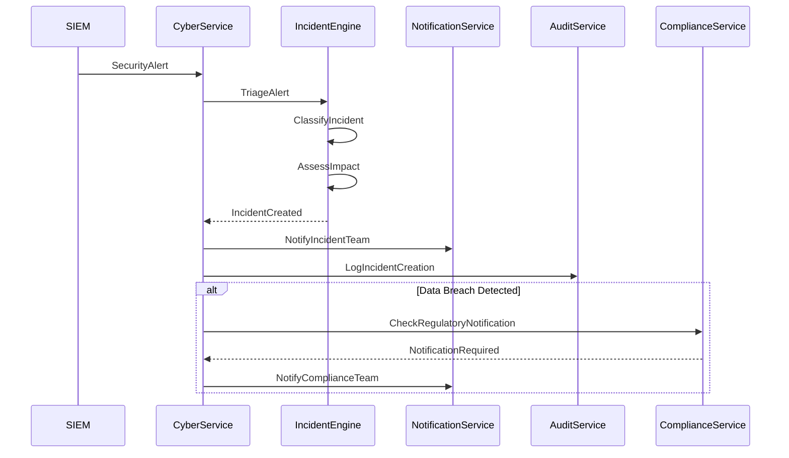
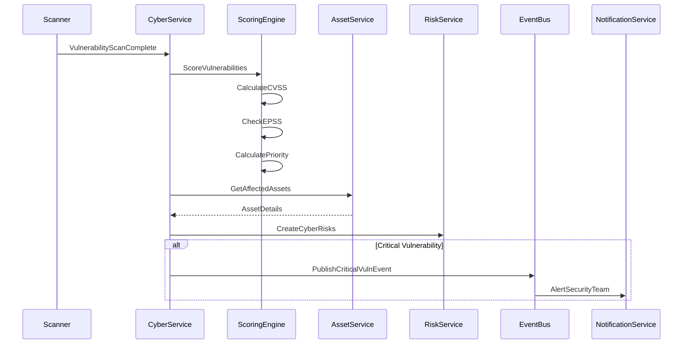

# Cybersecurity Service Specification

## Service Overview

**Service Name**: Cybersecurity Service
**Port**: 3035
**Phase**: 5 - Governance Domain (Cybersecurity Governance)
**Story Points**: 50
**Dependencies**: Identity Service, Organization Service, Audit Service, Risk Service, Privacy Service
**Technology Stack**: NestJS, MongoDB, InfluxDB (metrics), Neo4j (threat graph), Redis, Python (ML)
**Business Criticality**: CRITICAL - Security Posture & ESG Disclosure

### Service Context

The Cybersecurity Service is the cybersecurity governance and ESG disclosure platform for Clenergize V3, providing comprehensive cyber risk management, incident response, vulnerability management, security metrics tracking, and regulatory disclosure capabilities. As cybersecurity becomes a material ESG issue (SEC rules, CSRD ESRS G1), this service enables organizations to demonstrate robust security governance and meet evolving disclosure requirements.

### Business Value

- **ESG Disclosure**: Meet SEC cybersecurity disclosure rules and CSRD ESRS G1 requirements
- **Cyber Risk Management**: Identify, assess, and mitigate cyber risks
- **Incident Response**: NIST 5-step incident response framework
- **Vulnerability Management**: Track and remediate security vulnerabilities
- **Security Metrics**: Board-level security KPIs for ESG reporting
- **Third-Party Risk**: Assess and monitor supplier cyber risk
- **Compliance**: NIST CSF, ISO 27001, SOC 2, NIS2, GDPR breach notification

## Core Requirements

### Functional Requirements

#### Cybersecurity Governance
- Board-level cybersecurity oversight structure
- Cybersecurity strategy and policies
- Security risk appetite and tolerance
- Security budget and resource allocation
- Security metrics and KPIs for board reporting
- Executive security awareness

#### Cyber Risk Management
- Cyber risk identification and assessment
- Threat modeling (STRIDE, DREAD, PASTA)
- Asset inventory and criticality assessment
- Attack surface management
- Security control framework (NIST CSF, ISO 27001, CIS Controls)
- Cyber insurance tracking

#### Incident Response
- NIST 5-step incident response (Preparation, Detection, Analysis, Containment, Post-Incident)
- Incident classification and severity assessment
- Incident response playbooks
- Communication and escalation protocols
- Forensic evidence collection
- Regulatory breach notification (GDPR, SEC, NIS2)

#### Vulnerability Management
- Vulnerability scanning and detection
- CVE tracking and prioritization (CVSS, EPSS)
- Patch management
- Penetration testing coordination
- Bug bounty program management
- Zero-day tracking

#### Threat Intelligence
- Threat feed integration (MISP, STIX/TAXII)
- Indicators of Compromise (IoC) tracking
- Threat actor profiling
- Dark web monitoring
- Sector-specific threat alerts
- Threat landscape reporting

#### Security Metrics & KPIs
- Mean Time to Detect (MTTD)
- Mean Time to Respond (MTTR)
- Number of security incidents
- Vulnerability remediation time
- Security training completion rates
- Phishing test results
- Third-party security scores

#### Third-Party Cyber Risk
- Vendor security assessments
- Supply chain cyber risk
- Vendor risk scoring
- Continuous monitoring
- Breach notification from vendors
- Vendor security questionnaires

#### Security Awareness & Training
- Security awareness program management
- Phishing simulation campaigns
- Role-based security training
- Security champion program
- Training completion tracking
- Behavioral metrics

#### Penetration Testing
- Penetration test scheduling
- Scope and methodology tracking
- Finding management
- Remediation tracking
- Retest coordination
- Executive summary generation

#### Security Compliance
- NIST Cybersecurity Framework
- ISO/IEC 27001
- SOC 2 Type II
- NIS2 Directive
- GDPR (breach notification)
- SEC cybersecurity disclosure
- Industry-specific (PCI DSS, HIPAA, etc.)

### Non-Functional Requirements

#### Performance
- Incident detection alert < 1 second
- Vulnerability scan processing < 5 minutes for 10,000 endpoints
- Risk assessment completion < 30 seconds
- Dashboard load time < 2 seconds
- Threat intelligence ingestion < 100ms per indicator

#### Security
- SOC 2 Type II compliance
- Encryption for security data at rest and in transit
- Role-based access control (principle of least privilege)
- Audit trail for all security operations
- Secure API authentication (service-to-service)

#### Scalability
- Support for 100,000+ assets
- 10,000+ vulnerabilities tracked
- 1,000+ incidents per year
- 50,000+ threat indicators
- Multi-tenant architecture

#### Reliability
- 99.99% uptime for incident response system
- Zero data loss for security events
- Automated failover for critical alerts
- Disaster recovery with < 1 hour RTO
- Point-in-time recovery for incident data

## Data Models

### Core Entities

```typescript
// Security Incident Entity
interface SecurityIncident {
  id: string;
  organizationId: string;
  incidentId: string; // Internal incident identifier (e.g., "INC-2025-001")

  // Basic Information
  title: string;
  description: string;
  category: IncidentCategory;
  type: IncidentType;
  severity: IncidentSeverity;
  priority: 'Critical' | 'High' | 'Medium' | 'Low';

  // Detection
  detectedAt: Date;
  detectedBy: DetectionSource;
  detectionMethod: string;
  alertSource?: string;

  // Classification
  confirmed: boolean;
  falsePositive: boolean;
  attackVector: AttackVector[];
  attackPhase: MITREPhase;
  mitreTactics: string[];
  mitreTechniques: string[];

  // Impact Assessment
  impact: IncidentImpact;
  affectedAssets: AffectedAsset[];
  dataBreached: boolean;
  dataCategories?: DataCategory[];
  recordsAffected?: number;

  // Response (NIST 5-Step)
  status: IncidentStatus;
  responsePhase: ResponsePhase;
  containmentActions: ContainmentAction[];
  eradicationActions: EradicationAction[];
  recoveryActions: RecoveryAction[];

  // Team & Communication
  incidentCommander?: string;
  responseTeam: TeamMember[];
  stakeholdersNotified: StakeholderNotification[];
  externalCommunications: ExternalCommunication[];

  // Timeline
  timeline: IncidentEvent[];
  detectionToContainment?: number; // minutes
  containmentToResolution?: number; // minutes
  totalDuration?: number; // minutes

  // Root Cause
  rootCause?: string;
  contributingFactors?: string[];
  vulnerabilitiesExploited?: string[];

  // Remediation
  remediationPlan?: RemediationPlan;
  lessonsLearned?: LessonsLearned;
  improvements: Improvement[];

  // Regulatory
  breachNotificationRequired: boolean;
  regulatoryNotifications: RegulatoryNotification[];
  lawEnforcementInvolved: boolean;

  // Evidence
  evidenceCollected: Evidence[];
  forensicAnalysis?: ForensicAnalysis;

  // Metrics
  mttd?: number; // Mean Time to Detect (minutes)
  mttr?: number; // Mean Time to Respond (minutes)
  mttc?: number; // Mean Time to Contain (minutes)
  mttr_resolution?: number; // Mean Time to Resolution (minutes)

  // Metadata
  createdAt: Date;
  createdBy: string;
  updatedAt: Date;
  updatedBy: string;
  closedAt?: Date;
  closedBy?: string;
  tags: string[];
  attachments: Attachment[];
}

// Incident Category
enum IncidentCategory {
  MALWARE = 'Malware',
  PHISHING = 'Phishing',
  RANSOMWARE = 'Ransomware',
  DATA_BREACH = 'Data Breach',
  UNAUTHORIZED_ACCESS = 'Unauthorized Access',
  DENIAL_OF_SERVICE = 'Denial of Service',
  WEB_ATTACK = 'Web Application Attack',
  INSIDER_THREAT = 'Insider Threat',
  SUPPLY_CHAIN = 'Supply Chain Compromise',
  SOCIAL_ENGINEERING = 'Social Engineering',
  BUSINESS_EMAIL_COMPROMISE = 'Business Email Compromise',
  CRYPTOJACKING = 'Cryptojacking',
  MISCONFIGURATION = 'Misconfiguration',
  LOST_STOLEN_DEVICE = 'Lost/Stolen Device',
  OTHER = 'Other'
}

// Incident Type
enum IncidentType {
  ATTEMPTED = 'Attempted',
  SUCCESSFUL = 'Successful',
  SUSPECTED = 'Suspected',
  CONFIRMED = 'Confirmed'
}

// Incident Severity
enum IncidentSeverity {
  CRITICAL = 'Critical', // Severe impact on business operations or data
  HIGH = 'High',         // Significant impact requiring immediate attention
  MEDIUM = 'Medium',     // Moderate impact with manageable consequences
  LOW = 'Low',           // Minor impact with minimal consequences
  INFORMATIONAL = 'Informational' // No immediate impact
}

// Incident Status
enum IncidentStatus {
  NEW = 'New',
  INVESTIGATING = 'Investigating',
  CONTAINED = 'Contained',
  ERADICATING = 'Eradicating',
  RECOVERING = 'Recovering',
  RESOLVED = 'Resolved',
  CLOSED = 'Closed',
  FALSE_POSITIVE = 'False Positive'
}

// Response Phase (NIST 5-Step)
enum ResponsePhase {
  PREPARATION = 'Preparation',
  DETECTION_ANALYSIS = 'Detection & Analysis',
  CONTAINMENT = 'Containment, Eradication, and Recovery',
  POST_INCIDENT = 'Post-Incident Activity'
}

// Detection Source
interface DetectionSource {
  type: 'SIEM' | 'EDR' | 'IDS/IPS' | 'User Report' | 'Threat Intelligence' | 'Security Tool' | 'Manual';
  system?: string;
  confidence: number; // 0-100%
  automatedDetection: boolean;
}

// Attack Vector
enum AttackVector {
  EMAIL = 'Email',
  WEB = 'Web Application',
  NETWORK = 'Network',
  PHYSICAL = 'Physical',
  REMOVABLE_MEDIA = 'Removable Media',
  SUPPLY_CHAIN = 'Supply Chain',
  SOCIAL_ENGINEERING = 'Social Engineering',
  INSIDER = 'Insider',
  THIRD_PARTY = 'Third Party',
  UNKNOWN = 'Unknown'
}

// MITRE ATT&CK Phase
enum MITREPhase {
  RECONNAISSANCE = 'Reconnaissance',
  RESOURCE_DEVELOPMENT = 'Resource Development',
  INITIAL_ACCESS = 'Initial Access',
  EXECUTION = 'Execution',
  PERSISTENCE = 'Persistence',
  PRIVILEGE_ESCALATION = 'Privilege Escalation',
  DEFENSE_EVASION = 'Defense Evasion',
  CREDENTIAL_ACCESS = 'Credential Access',
  DISCOVERY = 'Discovery',
  LATERAL_MOVEMENT = 'Lateral Movement',
  COLLECTION = 'Collection',
  COMMAND_CONTROL = 'Command and Control',
  EXFILTRATION = 'Exfiltration',
  IMPACT = 'Impact'
}

// Incident Impact
interface IncidentImpact {
  // Financial
  directCost?: number;
  indirectCost?: number;
  totalCost?: number;
  currency: string;
  costBreakdown?: {
    investigation: number;
    remediation: number;
    legalFees: number;
    regulatoryFines: number;
    customerNotification: number;
    businessDisruption: number;
    reputationalDamage: number;
  };

  // Operational
  systemsAffected: number;
  downtime?: number; // minutes
  dataLoss: boolean;
  businessProcessesDisrupted: string[];

  // Data
  dataBreached: boolean;
  dataCategories?: DataCategory[];
  recordsAffected?: number;
  piiExposed: boolean;
  piiRecordsCount?: number;

  // Reputational
  mediaAttention: boolean;
  customerImpact: 'None' | 'Low' | 'Medium' | 'High' | 'Severe';
  regulatoryScrutiny: boolean;

  // Compliance
  regulatoryBreach: boolean;
  regulators: string[];
  contractualBreach: boolean;
}

// Affected Asset
interface AffectedAsset {
  assetId: string;
  assetType: AssetType;
  assetName: string;
  criticality: 'Critical' | 'High' | 'Medium' | 'Low';
  compromised: boolean;
  impactDescription: string;
  recoveryStatus: 'Pending' | 'In Progress' | 'Recovered';
}

// Asset Type
enum AssetType {
  SERVER = 'Server',
  WORKSTATION = 'Workstation',
  MOBILE_DEVICE = 'Mobile Device',
  NETWORK_DEVICE = 'Network Device',
  DATABASE = 'Database',
  APPLICATION = 'Application',
  CLOUD_RESOURCE = 'Cloud Resource',
  IOT_DEVICE = 'IoT Device',
  DATA_STORE = 'Data Store'
}

// Data Category (GDPR)
enum DataCategory {
  PII = 'Personally Identifiable Information',
  SENSITIVE_PII = 'Sensitive PII',
  FINANCIAL = 'Financial Data',
  HEALTH = 'Health Data',
  BIOMETRIC = 'Biometric Data',
  CREDENTIALS = 'Credentials',
  INTELLECTUAL_PROPERTY = 'Intellectual Property',
  BUSINESS_CONFIDENTIAL = 'Business Confidential',
  OTHER = 'Other'
}

// Containment Action
interface ContainmentAction {
  id: string;
  action: string;
  type: 'Short-term' | 'Long-term';
  implementedBy: string;
  implementedAt: Date;
  effectiveness: 'Effective' | 'Partially Effective' | 'Ineffective';
  notes?: string;
}

// Regulatory Notification
interface RegulatoryNotification {
  regulator: string;
  regulation: 'GDPR' | 'SEC' | 'NIS2' | 'CCPA' | 'HIPAA' | 'PCI DSS' | 'Other';
  notificationRequired: boolean;
  deadline?: Date;
  notifiedAt?: Date;
  notificationMethod?: string;
  confirmationReceived: boolean;
  referenceNumber?: string;
  notes?: string;
}

// Evidence
interface Evidence {
  id: string;
  type: 'Log File' | 'Memory Dump' | 'Disk Image' | 'Network Capture' | 'Screenshot' | 'Document' | 'Other';
  description: string;
  collectedAt: Date;
  collectedBy: string;
  storageLocation: string;
  chainOfCustody: ChainOfCustodyEntry[];
  hash: string; // For integrity verification
  analysisStatus: 'Pending' | 'Analyzing' | 'Analyzed';
}

// Vulnerability Entity
interface Vulnerability {
  id: string;
  organizationId: string;
  vulnerabilityId: string; // Internal ID (e.g., "VULN-2025-001")

  // Basic Information
  title: string;
  description: string;
  cveId?: string; // CVE-2023-XXXX
  cweId?: string; // CWE-79

  // Severity & Scoring
  severity: VulnerabilitySeverity;
  cvssScore: CVSSScore;
  epssScore?: number; // Exploit Prediction Scoring System (0-1)
  exploitAvailable: boolean;
  exploitInTheWild: boolean;

  // Asset Information
  affectedAssets: VulnerableAsset[];
  affectedSystems: number;
  criticalSystemsAffected: boolean;

  // Discovery
  discoveredAt: Date;
  discoveredBy: string;
  discoveryMethod: DiscoveryMethod;
  scanId?: string;

  // Risk Assessment
  riskRating: 'Critical' | 'High' | 'Medium' | 'Low' | 'Informational';
  exploitability: 'Easy' | 'Moderate' | 'Difficult';
  businessImpact: 'Critical' | 'High' | 'Medium' | 'Low';
  dataExposureRisk: boolean;

  // Status & Remediation
  status: VulnerabilityStatus;
  remediationPlan?: VulnerabilityRemediationPlan;
  patchAvailable: boolean;
  patchReleaseDate?: Date;
  workaroundAvailable: boolean;
  workaround?: string;

  // Timeline
  firstDetected: Date;
  lastVerified: Date;
  remediationDeadline?: Date;
  remediatedAt?: Date;
  verifiedResolvedAt?: Date;

  // SLA Tracking
  sla: VulnerabilitySLA;
  slaStatus: 'Within SLA' | 'Approaching Breach' | 'SLA Breached';

  // Compliance
  complianceImpact: string[];
  auditFinding: boolean;

  // References
  references: VulnerabilityReference[];
  relatedIncidents?: string[];

  // Metadata
  createdAt: Date;
  createdBy: string;
  updatedAt: Date;
  updatedBy: string;
  tags: string[];
  notes?: string;
}

// Vulnerability Severity
enum VulnerabilitySeverity {
  CRITICAL = 'Critical', // CVSS 9.0-10.0
  HIGH = 'High',         // CVSS 7.0-8.9
  MEDIUM = 'Medium',     // CVSS 4.0-6.9
  LOW = 'Low',           // CVSS 0.1-3.9
  INFORMATIONAL = 'Informational' // CVSS 0.0
}

// CVSS Score
interface CVSSScore {
  version: '3.1' | '4.0';
  baseScore: number;
  temporalScore?: number;
  environmentalScore?: number;
  vector: string; // CVSS vector string
  attackVector: 'Network' | 'Adjacent' | 'Local' | 'Physical';
  attackComplexity: 'Low' | 'High';
  privilegesRequired: 'None' | 'Low' | 'High';
  userInteraction: 'None' | 'Required';
  confidentialityImpact: 'None' | 'Low' | 'High';
  integrityImpact: 'None' | 'Low' | 'High';
  availabilityImpact: 'None' | 'Low' | 'High';
}

// Vulnerable Asset
interface VulnerableAsset {
  assetId: string;
  assetName: string;
  assetType: AssetType;
  criticality: 'Critical' | 'High' | 'Medium' | 'Low';
  environment: 'Production' | 'Staging' | 'Development' | 'Test';
  owner: string;
  businessUnit: string;
  internetFacing: boolean;
  piiProcessed: boolean;
}

// Vulnerability Status
enum VulnerabilityStatus {
  NEW = 'New',
  ASSIGNED = 'Assigned',
  IN_PROGRESS = 'In Progress',
  AWAITING_PATCH = 'Awaiting Patch',
  REMEDIATED = 'Remediated',
  VERIFIED = 'Verified',
  ACCEPTED_RISK = 'Accepted Risk',
  FALSE_POSITIVE = 'False Positive',
  WONT_FIX = "Won't Fix"
}

// Vulnerability SLA
interface VulnerabilitySLA {
  daysToRemediate: number;
  deadlineDate: Date;
  daysRemaining: number;
  escalated: boolean;
  escalationLevel?: number;
}

// Discovery Method
enum DiscoveryMethod {
  VULNERABILITY_SCAN = 'Vulnerability Scan',
  PENETRATION_TEST = 'Penetration Test',
  BUG_BOUNTY = 'Bug Bounty',
  SECURITY_RESEARCH = 'Security Research',
  THREAT_INTELLIGENCE = 'Threat Intelligence',
  INCIDENT_INVESTIGATION = 'Incident Investigation',
  CODE_REVIEW = 'Code Review',
  MANUAL_DISCOVERY = 'Manual Discovery'
}

// Vulnerability Remediation Plan
interface VulnerabilityRemediationPlan {
  strategy: 'Patch' | 'Configuration Change' | 'Workaround' | 'Accept Risk' | 'Compensating Control';
  assignedTo: string;
  priority: 'Critical' | 'High' | 'Medium' | 'Low';
  targetDate: Date;
  steps: RemediationStep[];
  testingRequired: boolean;
  approvalRequired: boolean;
  approver?: string;
  estimatedEffort: number; // hours
  cost?: number;
  progress: number; // 0-100%
  blockers?: string[];
}

// Cyber Risk Entity
interface CyberRisk {
  id: string;
  organizationId: string;
  riskId: string;

  // Basic Information
  title: string;
  description: string;
  category: CyberRiskCategory;
  threatSource: ThreatSource;

  // Risk Assessment
  likelihood: number; // 1-5
  impact: number; // 1-5
  riskScore: number;
  riskLevel: 'Critical' | 'High' | 'Medium' | 'Low';

  // Threat Modeling
  threatActors: ThreatActor[];
  attackScenarios: AttackScenario[];
  assetsAtRisk: string[];

  // Controls
  existingControls: SecurityControl[];
  controlEffectiveness: 'Effective' | 'Partially Effective' | 'Ineffective';
  residualRisk: number;

  // Mitigation
  mitigationStrategy: 'Accept' | 'Mitigate' | 'Transfer' | 'Avoid';
  mitigationPlan?: MitigationPlan;

  // Status
  status: 'Identified' | 'Assessed' | 'Mitigating' | 'Accepted' | 'Closed';
  owner: string;
  reviewDate: Date;
  lastAssessmentDate: Date;

  // Metadata
  createdAt: Date;
  updatedAt: Date;
  tags: string[];
}

// Cyber Risk Category
enum CyberRiskCategory {
  MALWARE = 'Malware',
  RANSOMWARE = 'Ransomware',
  DATA_BREACH = 'Data Breach',
  INSIDER_THREAT = 'Insider Threat',
  SUPPLY_CHAIN = 'Supply Chain',
  CLOUD_SECURITY = 'Cloud Security',
  APPLICATION_SECURITY = 'Application Security',
  NETWORK_SECURITY = 'Network Security',
  ENDPOINT_SECURITY = 'Endpoint Security',
  IDENTITY_ACCESS = 'Identity & Access Management',
  SOCIAL_ENGINEERING = 'Social Engineering',
  DENIAL_OF_SERVICE = 'Denial of Service',
  EMERGING_THREATS = 'Emerging Threats'
}

// Threat Source
enum ThreatSource {
  NATION_STATE = 'Nation State',
  ORGANIZED_CRIME = 'Organized Crime',
  HACKTIVIST = 'Hacktivist',
  INSIDER = 'Insider (Malicious)',
  INSIDER_NEGLIGENT = 'Insider (Negligent)',
  COMPETITOR = 'Competitor',
  SCRIPT_KIDDIE = 'Script Kiddie',
  AUTOMATED_ATTACK = 'Automated Attack',
  UNKNOWN = 'Unknown'
}

// Threat Actor
interface ThreatActor {
  name: string;
  type: ThreatSource;
  sophistication: 'Low' | 'Medium' | 'High' | 'Advanced';
  motivation: string[];
  capabilities: string[];
  targeting: string[];
}

// Attack Scenario
interface AttackScenario {
  id: string;
  name: string;
  description: string;
  attackVector: AttackVector;
  mitrePhases: MITREPhase[];
  mitreTechniques: string[];
  likelihood: number;
  impact: number;
  assetsTargeted: string[];
}

// Security Control
interface SecurityControl {
  id: string;
  name: string;
  description: string;
  controlType: 'Preventive' | 'Detective' | 'Corrective' | 'Deterrent';
  controlCategory: 'Technical' | 'Administrative' | 'Physical';
  nistFunction: 'Identify' | 'Protect' | 'Detect' | 'Respond' | 'Recover';
  nistCategory?: string;
  iso27001Control?: string;
  cisControl?: string;
  implementation: 'Implemented' | 'Partially Implemented' | 'Planned' | 'Not Implemented';
  effectiveness: 'Effective' | 'Partially Effective' | 'Ineffective';
  lastTested?: Date;
  testResults?: string;
  owner: string;
  automationLevel: 'Manual' | 'Semi-Automated' | 'Fully Automated';
}

// Third-Party Cyber Risk
interface ThirdPartyCyberRisk {
  id: string;
  organizationId: string;
  vendorId: string;
  vendorName: string;

  // Risk Assessment
  overallRiskScore: number; // 0-100
  riskLevel: 'Critical' | 'High' | 'Medium' | 'Low';

  // Assessment Details
  lastAssessmentDate: Date;
  nextAssessmentDate: Date;
  assessmentType: 'Initial' | 'Annual' | 'Event-Driven' | 'Continuous';

  // Security Domains
  domainScores: {
    governance: number;
    riskManagement: number;
    compliance: number;
    dataProtection: number;
    networkSecurity: number;
    applicationSecurity: number;
    incidentResponse: number;
    businessContinuity: number;
  };

  // Due Diligence
  questionnairesCompleted: SecurityQuestionnaire[];
  certificationsVerified: Certification[];
  auditReportsReviewed: AuditReport[];
  breachHistory: VendorBreach[];

  // Continuous Monitoring
  securityRating?: number; // From third-party rating services
  ratingTrend: 'Improving' | 'Stable' | 'Declining';
  breachNotifications: BreachNotification[];

  // Contractual
  contractualRequirements: string[];
  slaMetrics: SLAMetric[];
  insuranceCoverage?: number;
  liabilityTerms?: string;

  // Risk Treatment
  riskAcceptance?: RiskAcceptance;
  mitigationActions: MitigationAction[];

  // Metadata
  createdAt: Date;
  updatedAt: Date;
  reviewedBy: string;
}

// Security Metrics Entity
interface SecurityMetrics {
  id: string;
  organizationId: string;
  period: {
    startDate: Date;
    endDate: Date;
    quarter?: string;
    year: number;
  };

  // Incident Metrics
  incidents: {
    total: number;
    bySeverity: { [key: string]: number };
    byCategory: { [key: string]: number };
    resolved: number;
    open: number;
    mttd: number; // Mean Time to Detect (minutes)
    mttr: number; // Mean Time to Respond (minutes)
    mttc: number; // Mean Time to Contain (minutes)
    falsePositives: number;
    truePositives: number;
  };

  // Vulnerability Metrics
  vulnerabilities: {
    total: number;
    bySeverity: { [key: string]: number };
    remediated: number;
    open: number;
    pastDue: number;
    avgTimeToRemediate: number; // days
    criticalExposure: number;
    exploitableVulns: number;
  };

  // Security Operations
  operations: {
    alertsGenerated: number;
    alertsInvestigated: number;
    alertFidelity: number; // % true positives
    securityEventsProcessed: number;
    threatsBlocked: number;
    phishingTestsSent: number;
    phishingClickRate: number; // %
  };

  // Security Awareness
  awareness: {
    employeesTrained: number;
    trainingCompletionRate: number; // %
    phishingReportRate: number; // %
    securityChampions: number;
    securityAwarenessScore: number; // 0-100
  };

  // Third-Party Risk
  thirdParty: {
    vendorsAssessed: number;
    highRiskVendors: number;
    vendorBreaches: number;
    vendorAssessmentsConducted: number;
  };

  // Compliance
  compliance: {
    controlsTested: number;
    controlsEffective: number;
    controlEffectiveness: number; // %
    auditFindings: number;
    criticalFindings: number;
    findingsRemediated: number;
  };

  // Financial
  financial: {
    securityBudget: number;
    securitySpend: number;
    incidentCosts: number;
    avoidedCosts: number; // from prevented incidents
    roi: number; // %
  };

  // Metadata
  generatedAt: Date;
  generatedBy: string;
}

// Penetration Test Entity
interface PenetrationTest {
  id: string;
  organizationId: string;
  testId: string;

  // Test Information
  title: string;
  description: string;
  testType: PenTestType;
  scope: PenTestScope;

  // Methodology
  methodology: string[]; // OWASP, PTES, OSSTMM, etc.
  testingApproach: 'Black Box' | 'White Box' | 'Gray Box';
  rules: RulesOfEngagement;

  // Team
  testingFirm?: string;
  leadTester: string;
  testTeam: string[];
  internalContact: string;

  // Schedule
  startDate: Date;
  endDate: Date;
  duration: number; // days
  status: 'Planned' | 'In Progress' | 'Report Pending' | 'Completed' | 'Cancelled';

  // Findings
  findingsCount: {
    critical: number;
    high: number;
    medium: number;
    low: number;
    informational: number;
  };
  findings: PenTestFinding[];

  // Deliverables
  executiveSummary?: string;
  technicalReport?: string;
  remediationReport?: string;
  retestReport?: string;

  // Metrics
  attackPathsIdentified: number;
  systemsCompromised: number;
  dataExfiltrated: boolean;
  privilegeEscalation: boolean;

  // Remediation
  remediationDeadline?: Date;
  remediationComplete: boolean;
  retestScheduled: boolean;
  retestDate?: Date;

  // Metadata
  createdAt: Date;
  updatedAt: Date;
}

// Pen Test Type
enum PenTestType {
  EXTERNAL_NETWORK = 'External Network',
  INTERNAL_NETWORK = 'Internal Network',
  WEB_APPLICATION = 'Web Application',
  MOBILE_APPLICATION = 'Mobile Application',
  API = 'API',
  CLOUD_INFRASTRUCTURE = 'Cloud Infrastructure',
  SOCIAL_ENGINEERING = 'Social Engineering',
  PHYSICAL_SECURITY = 'Physical Security',
  RED_TEAM = 'Red Team',
  PURPLE_TEAM = 'Purple Team'
}

// Pen Test Scope
interface PenTestScope {
  ipRanges?: string[];
  domains?: string[];
  applications?: string[];
  apis?: string[];
  targets: string[];
  exclusions: string[];
  inScope: string;
  outOfScope: string;
}

// Pen Test Finding
interface PenTestFinding {
  id: string;
  title: string;
  description: string;
  severity: VulnerabilitySeverity;
  cvssScore: number;
  exploitability: 'Easy' | 'Moderate' | 'Difficult';
  impact: string;
  affectedSystems: string[];
  reproductionSteps: string;
  remediation: string;
  status: 'Open' | 'In Progress' | 'Remediated' | 'Accepted' | 'Disputed';
  assignedTo?: string;
  dueDate?: Date;
}

// Security Awareness Program
interface SecurityAwarenessProgram {
  id: string;
  organizationId: string;

  // Program Information
  programName: string;
  description: string;
  objectives: string[];
  status: 'Active' | 'Inactive' | 'Draft';

  // Training Curriculum
  modules: TrainingModule[];
  roleBasedTraining: RoleBasedTraining[];

  // Phishing Simulation
  phishingCampaigns: PhishingCampaign[];

  // Security Champions
  championProgram?: SecurityChampionProgram;

  // Metrics
  metrics: {
    employeesCovered: number;
    completionRate: number; // %
    averageScore: number; // %
    phishingResilienceScore: number; // %
    behaviorChangeScore: number; // %
  };

  // Governance
  programOwner: string;
  budget: number;
  reviewFrequency: string;
  lastReview: Date;
  nextReview: Date;

  // Metadata
  createdAt: Date;
  updatedAt: Date;
}

// Training Module
interface TrainingModule {
  id: string;
  title: string;
  description: string;
  duration: number; // minutes
  topics: string[];
  mandatory: boolean;
  frequency: 'Once' | 'Annual' | 'Quarterly' | 'Monthly';
  targetAudience: string[];
  completionRate: number; // %
  averageScore: number; // %
}

// Phishing Campaign
interface PhishingCampaign {
  id: string;
  name: string;
  startDate: Date;
  endDate: Date;
  emailsSent: number;
  targets: string[];
  template: string;
  difficulty: 'Easy' | 'Medium' | 'Hard';
  results: {
    delivered: number;
    opened: number;
    clicked: number;
    reported: number;
    dataEntered: number;
    clickRate: number; // %
    reportRate: number; // %
  };
}

// Threat Intelligence Feed
interface ThreatIntelligence {
  id: string;
  organizationId: string;

  // Threat Information
  threatType: string;
  threatCategory: string;
  severity: 'Critical' | 'High' | 'Medium' | 'Low' | 'Informational';

  // Indicators of Compromise (IoC)
  indicators: {
    ipAddresses: string[];
    domains: string[];
    urls: string[];
    fileHashes: string[];
    emailAddresses: string[];
    mutexes: string[];
    registryKeys: string[];
  };

  // Threat Context
  threatActors?: string[];
  malwareFamily?: string[];
  attackVectors: AttackVector[];
  mitreTechniques: string[];

  // Source
  source: string;
  sourceReliability: 'Confirmed' | 'Probable' | 'Possible' | 'Doubtful' | 'Improbable';
  publishedAt: Date;
  firstSeen: Date;
  lastSeen: Date;

  // Relevance
  relevanceScore: number; // 0-100
  actionable: boolean;
  falsePositive: boolean;

  // Response
  blockedIndicators: string[];
  alertsGenerated: number;
  incidentsTriggered: string[];

  // Metadata
  receivedAt: Date;
  processedAt: Date;
  expiresAt?: Date;
  tags: string[];
}
```

## API Endpoints

### Incident Management

```typescript
// Incident CRUD Operations
POST   /api/v1/incidents                    // Create new incident
GET    /api/v1/incidents                    // List all incidents
GET    /api/v1/incidents/:id                // Get incident details
PUT    /api/v1/incidents/:id                // Update incident
DELETE /api/v1/incidents/:id                // Delete incident (admin only)

// Incident Workflow
POST   /api/v1/incidents/:id/investigate    // Start investigation
POST   /api/v1/incidents/:id/contain        // Containment actions
POST   /api/v1/incidents/:id/eradicate      // Eradication actions
POST   /api/v1/incidents/:id/recover        // Recovery actions
POST   /api/v1/incidents/:id/close          // Close incident

// Incident Analysis
GET    /api/v1/incidents/:id/timeline       // Incident timeline
GET    /api/v1/incidents/:id/impact         // Impact assessment
POST   /api/v1/incidents/:id/root-cause     // Root cause analysis
POST   /api/v1/incidents/:id/lessons-learned // Document lessons learned

// Incident Search and Filter
GET    /api/v1/incidents/search             // Search incidents
GET    /api/v1/incidents/filter             // Filter incidents
GET    /api/v1/incidents/by-severity/:severity // Get by severity
GET    /api/v1/incidents/open               // Get open incidents
GET    /api/v1/incidents/recent             // Recent incidents

// Incident Notifications
POST   /api/v1/incidents/:id/notify         // Send notifications
POST   /api/v1/incidents/:id/escalate       // Escalate incident
GET    /api/v1/incidents/:id/notifications  // Get notification history

// Regulatory
POST   /api/v1/incidents/:id/breach-notification // Breach notification
GET    /api/v1/incidents/:id/regulatory-status // Regulatory compliance status
POST   /api/v1/incidents/:id/regulator-notify // Notify regulator
```

### Vulnerability Management

```typescript
// Vulnerability CRUD
POST   /api/v1/vulnerabilities              // Create vulnerability
GET    /api/v1/vulnerabilities              // List vulnerabilities
GET    /api/v1/vulnerabilities/:id          // Get vulnerability details
PUT    /api/v1/vulnerabilities/:id          // Update vulnerability
DELETE /api/v1/vulnerabilities/:id          // Delete vulnerability

// Vulnerability Scanning
POST   /api/v1/vulnerabilities/scan         // Trigger vulnerability scan
GET    /api/v1/vulnerabilities/scans        // Get scan history
GET    /api/v1/vulnerabilities/scans/:id    // Get scan results

// Vulnerability Assessment
POST   /api/v1/vulnerabilities/:id/assess   // Assess vulnerability
POST   /api/v1/vulnerabilities/:id/score    // Calculate CVSS score
POST   /api/v1/vulnerabilities/:id/prioritize // Prioritize remediation

// Remediation
POST   /api/v1/vulnerabilities/:id/remediate // Create remediation plan
PUT    /api/v1/vulnerabilities/:id/patch    // Apply patch
POST   /api/v1/vulnerabilities/:id/verify   // Verify remediation
POST   /api/v1/vulnerabilities/:id/accept-risk // Accept risk

// Vulnerability Search
GET    /api/v1/vulnerabilities/search       // Search vulnerabilities
GET    /api/v1/vulnerabilities/by-severity/:severity // Get by severity
GET    /api/v1/vulnerabilities/critical     // Critical vulnerabilities
GET    /api/v1/vulnerabilities/exploitable  // Exploitable vulnerabilities
GET    /api/v1/vulnerabilities/overdue      // Overdue remediation

// CVE Integration
GET    /api/v1/vulnerabilities/cve/:cveId   // Get CVE details
POST   /api/v1/vulnerabilities/import-cve   // Import CVE data
GET    /api/v1/vulnerabilities/cve/affected // Check affected systems
```

### Cyber Risk Management

```typescript
// Cyber Risk CRUD
POST   /api/v1/cyber-risks                  // Create cyber risk
GET    /api/v1/cyber-risks                  // List cyber risks
GET    /api/v1/cyber-risks/:id              // Get risk details
PUT    /api/v1/cyber-risks/:id              // Update risk
DELETE /api/v1/cyber-risks/:id              // Delete risk

// Risk Assessment
POST   /api/v1/cyber-risks/:id/assess       // Assess cyber risk
POST   /api/v1/cyber-risks/:id/threat-model // Threat modeling
GET    /api/v1/cyber-risks/:id/attack-scenarios // Attack scenarios
POST   /api/v1/cyber-risks/:id/controls     // Assign controls

// Risk Treatment
POST   /api/v1/cyber-risks/:id/mitigate     // Create mitigation plan
POST   /api/v1/cyber-risks/:id/accept       // Accept risk
POST   /api/v1/cyber-risks/:id/transfer     // Transfer risk (insurance)
POST   /api/v1/cyber-risks/:id/avoid        // Avoid risk

// Risk Monitoring
GET    /api/v1/cyber-risks/dashboard        // Risk dashboard
GET    /api/v1/cyber-risks/heatmap          // Risk heat map
GET    /api/v1/cyber-risks/trends           // Risk trends
GET    /api/v1/cyber-risks/high-priority    // High priority risks
```

### Third-Party Cyber Risk

```typescript
// Vendor Risk Assessment
POST   /api/v1/third-party-risk/assess      // Assess vendor
GET    /api/v1/third-party-risk             // List vendor risks
GET    /api/v1/third-party-risk/:vendorId   // Get vendor risk
PUT    /api/v1/third-party-risk/:vendorId   // Update assessment

// Security Questionnaires
POST   /api/v1/third-party-risk/:vendorId/questionnaire // Send questionnaire
GET    /api/v1/third-party-risk/:vendorId/questionnaires // Get responses
PUT    /api/v1/third-party-risk/questionnaire/:id // Update response

// Continuous Monitoring
POST   /api/v1/third-party-risk/monitor     // Enable monitoring
GET    /api/v1/third-party-risk/ratings     // Get security ratings
GET    /api/v1/third-party-risk/breaches    // Vendor breach notifications
POST   /api/v1/third-party-risk/alert       // Alert on risk change

// Due Diligence
POST   /api/v1/third-party-risk/:vendorId/certifications // Upload certifications
POST   /api/v1/third-party-risk/:vendorId/audit-report // Upload audit report
GET    /api/v1/third-party-risk/:vendorId/due-diligence // Get DD package
```

### Security Metrics

```typescript
// Metrics Generation
POST   /api/v1/metrics/generate             // Generate metrics report
GET    /api/v1/metrics/current              // Current period metrics
GET    /api/v1/metrics/historical           // Historical metrics
GET    /api/v1/metrics/trends               // Metric trends

// Incident Metrics
GET    /api/v1/metrics/incidents            // Incident metrics
GET    /api/v1/metrics/mttd                 // Mean Time to Detect
GET    /api/v1/metrics/mttr                 // Mean Time to Respond
GET    /api/v1/metrics/incident-trends      // Incident trends

// Vulnerability Metrics
GET    /api/v1/metrics/vulnerabilities      // Vulnerability metrics
GET    /api/v1/metrics/remediation-time     // Avg remediation time
GET    /api/v1/metrics/exposure             // Vulnerability exposure

// Security Operations Metrics
GET    /api/v1/metrics/operations           // Operations metrics
GET    /api/v1/metrics/alert-fidelity       // Alert fidelity
GET    /api/v1/metrics/phishing-resilience  // Phishing test results

// Board Reporting
GET    /api/v1/metrics/board-report         // Board-level metrics
GET    /api/v1/metrics/esg-disclosure       // ESG disclosure metrics
GET    /api/v1/metrics/sec-disclosure       // SEC disclosure metrics
GET    /api/v1/metrics/csrd-esrs-g1         // CSRD ESRS G1 metrics
```

### Penetration Testing

```typescript
// Pen Test Management
POST   /api/v1/pentests                     // Schedule pen test
GET    /api/v1/pentests                     // List pen tests
GET    /api/v1/pentests/:id                 // Get pen test details
PUT    /api/v1/pentests/:id                 // Update pen test
DELETE /api/v1/pentests/:id                 // Delete pen test

// Findings Management
POST   /api/v1/pentests/:id/findings        // Add finding
GET    /api/v1/pentests/:id/findings        // Get findings
PUT    /api/v1/pentests/findings/:findingId // Update finding status
POST   /api/v1/pentests/findings/:findingId/remediate // Remediate finding

// Reports
GET    /api/v1/pentests/:id/executive-summary // Executive summary
GET    /api/v1/pentests/:id/technical-report // Technical report
GET    /api/v1/pentests/:id/remediation-report // Remediation tracking
POST   /api/v1/pentests/:id/retest          // Schedule retest
```

### Security Awareness

```typescript
// Awareness Program
POST   /api/v1/awareness/program            // Create program
GET    /api/v1/awareness/program            // Get program details
PUT    /api/v1/awareness/program            // Update program

// Training Modules
POST   /api/v1/awareness/modules            // Create training module
GET    /api/v1/awareness/modules            // List modules
POST   /api/v1/awareness/modules/:id/assign // Assign to users
GET    /api/v1/awareness/modules/:id/completion // Get completion stats

// Phishing Simulations
POST   /api/v1/awareness/phishing-campaigns // Create campaign
GET    /api/v1/awareness/phishing-campaigns // List campaigns
GET    /api/v1/awareness/phishing-campaigns/:id/results // Campaign results
POST   /api/v1/awareness/phishing-report    // Report phishing (user action)

// Security Champions
POST   /api/v1/awareness/champions          // Nominate champion
GET    /api/v1/awareness/champions          // List champions
GET    /api/v1/awareness/champions/metrics  // Champion metrics
```

### Threat Intelligence

```typescript
// Threat Intel Feed
POST   /api/v1/threat-intel/ingest          // Ingest threat data
GET    /api/v1/threat-intel                 // List threats
GET    /api/v1/threat-intel/:id             // Get threat details
POST   /api/v1/threat-intel/:id/enrich      // Enrich threat data

// Indicators of Compromise
GET    /api/v1/threat-intel/iocs            // Get IoCs
POST   /api/v1/threat-intel/iocs/search     // Search IoCs
POST   /api/v1/threat-intel/iocs/block      // Block IoCs
GET    /api/v1/threat-intel/iocs/recent     // Recent IoCs

// Threat Actors
GET    /api/v1/threat-intel/actors          // Threat actor profiles
GET    /api/v1/threat-intel/actors/:id      // Actor details
GET    /api/v1/threat-intel/actors/:id/campaigns // Actor campaigns

// Threat Analysis
GET    /api/v1/threat-intel/trends          // Threat trends
GET    /api/v1/threat-intel/landscape       // Threat landscape
POST   /api/v1/threat-intel/analyze         // Analyze threats
GET    /api/v1/threat-intel/relevant        // Relevant threats
```

### Compliance & Reporting

```typescript
// Framework Compliance
GET    /api/v1/compliance/nist-csf          // NIST CSF status
GET    /api/v1/compliance/iso27001          // ISO 27001 status
GET    /api/v1/compliance/soc2              // SOC 2 status
GET    /api/v1/compliance/nis2              // NIS2 compliance

// ESG Disclosure
GET    /api/v1/disclosure/sec-cybersecurity // SEC cybersecurity disclosure
GET    /api/v1/disclosure/csrd-esrs-g1      // CSRD ESRS G1 disclosure
POST   /api/v1/disclosure/generate          // Generate disclosure report

// Audit Support
GET    /api/v1/audit/evidence               // Collect audit evidence
POST   /api/v1/audit/control-test           // Test control
GET    /api/v1/audit/findings               // Audit findings
POST   /api/v1/audit/remediate              // Remediate finding

// Regulatory Reporting
POST   /api/v1/reporting/gdpr-breach        // GDPR breach notification
POST   /api/v1/reporting/sec-incident       // SEC incident report
POST   /api/v1/reporting/nis2-incident      // NIS2 incident report
```

### Dashboards & Analytics

```typescript
// Dashboards
GET    /api/v1/dashboards/executive         // Executive dashboard
GET    /api/v1/dashboards/security-ops      // Security operations dashboard
GET    /api/v1/dashboards/risk              // Cyber risk dashboard
GET    /api/v1/dashboards/compliance        // Compliance dashboard

// Analytics
GET    /api/v1/analytics/security-posture   // Security posture score
GET    /api/v1/analytics/attack-surface     // Attack surface analysis
GET    /api/v1/analytics/threat-landscape   // Threat landscape
POST   /api/v1/analytics/predict            // Predictive analytics
GET    /api/v1/analytics/benchmarking       // Industry benchmarking
```

## Service Architecture

### Component Structure

```
cybersecurity-service/
├── src/
│   ├── domain/
│   │   ├── entities/
│   │   │   ├── incident.entity.ts
│   │   │   ├── vulnerability.entity.ts
│   │   │   ├── cyber-risk.entity.ts
│   │   │   ├── third-party-risk.entity.ts
│   │   │   ├── penetration-test.entity.ts
│   │   │   ├── threat-intelligence.entity.ts
│   │   │   └── security-metrics.entity.ts
│   │   ├── value-objects/
│   │   │   ├── cvss-score.vo.ts
│   │   │   ├── incident-severity.vo.ts
│   │   │   ├── attack-vector.vo.ts
│   │   │   └── mitre-technique.vo.ts
│   │   ├── events/
│   │   │   ├── incident-created.event.ts
│   │   │   ├── incident-escalated.event.ts
│   │   │   ├── vulnerability-detected.event.ts
│   │   │   ├── critical-vuln.event.ts
│   │   │   └── breach-notification.event.ts
│   │   └── services/
│   │       ├── incident-response.service.ts
│   │       ├── vulnerability-scorer.service.ts
│   │       ├── threat-analyzer.service.ts
│   │       └── risk-calculator.service.ts
│   │
│   ├── application/
│   │   ├── commands/
│   │   │   ├── create-incident.command.ts
│   │   │   ├── contain-incident.command.ts
│   │   │   ├── create-vulnerability.command.ts
│   │   │   ├── remediate-vulnerability.command.ts
│   │   │   └── assess-cyber-risk.command.ts
│   │   ├── queries/
│   │   │   ├── get-open-incidents.query.ts
│   │   │   ├── get-critical-vulns.query.ts
│   │   │   ├── get-security-metrics.query.ts
│   │   │   └── get-board-report.query.ts
│   │   ├── services/
│   │   │   ├── incident-management.service.ts
│   │   │   ├── vulnerability-management.service.ts
│   │   │   ├── risk-management.service.ts
│   │   │   ├── third-party-risk.service.ts
│   │   │   ├── security-metrics.service.ts
│   │   │   └── compliance.service.ts
│   │   └── dto/
│   │       ├── create-incident.dto.ts
│   │       ├── assess-vulnerability.dto.ts
│   │       ├── cyber-risk-filter.dto.ts
│   │       └── metrics-params.dto.ts
│   │
│   ├── infrastructure/
│   │   ├── persistence/
│   │   │   ├── repositories/
│   │   │   │   ├── incident.repository.ts
│   │   │   │   ├── vulnerability.repository.ts
│   │   │   │   └── cyber-risk.repository.ts
│   │   │   ├── schemas/
│   │   │   │   ├── incident.schema.ts
│   │   │   │   ├── vulnerability.schema.ts
│   │   │   │   └── metrics.schema.ts
│   │   │   └── migrations/
│   │   ├── timeseries/
│   │   │   ├── influxdb.service.ts
│   │   │   ├── metrics.repository.ts
│   │   │   └── queries/
│   │   ├── graph/
│   │   │   ├── neo4j.service.ts
│   │   │   ├── threat-graph.repository.ts
│   │   │   └── queries/
│   │   ├── ml/
│   │   │   ├── anomaly-detection.model.ts
│   │   │   ├── threat-prediction.model.ts
│   │   │   └── risk-scoring.model.ts
│   │   ├── integrations/
│   │   │   ├── siem.client.ts
│   │   │   ├── vulnerability-scanner.client.ts
│   │   │   ├── threat-feed.client.ts
│   │   │   └── security-rating.client.ts
│   │   └── messaging/
│   │       ├── event-publisher.ts
│   │       └── event-handlers/
│   │
│   ├── interfaces/
│   │   ├── rest/
│   │   │   ├── controllers/
│   │   │   │   ├── incident.controller.ts
│   │   │   │   ├── vulnerability.controller.ts
│   │   │   │   ├── cyber-risk.controller.ts
│   │   │   │   ├── metrics.controller.ts
│   │   │   │   └── compliance.controller.ts
│   │   │   └── middleware/
│   │   ├── graphql/
│   │   │   ├── resolvers/
│   │   │   └── schemas/
│   │   └── websocket/
│   │       ├── gateways/
│   │       └── handlers/
│   │
│   └── shared/
│       ├── constants/
│       │   ├── incident-types.ts
│       │   ├── mitre-attack.ts
│       │   └── frameworks.ts
│       ├── exceptions/
│       ├── utils/
│       │   ├── cvss-calculator.ts
│       │   ├── sla-calculator.ts
│       │   └── mitre-mapper.ts
│       └── types/
│
├── test/
│   ├── unit/
│   ├── integration/
│   └── e2e/
│
├── docs/
│   ├── api/
│   ├── architecture/
│   └── guides/
│
└── package.json
```

## Implementation Details

### Incident Response Engine (NIST 5-Step)

```typescript
// NIST Incident Response Lifecycle
export class IncidentResponseService {
  // Phase 1: Preparation
  async prepareIncidentResponse(organizationId: string): Promise<void> {
    // Ensure incident response plan exists
    await this.validateIncidentResponsePlan(organizationId);

    // Verify incident response team
    await this.verifyIncidentResponseTeam(organizationId);

    // Check communication channels
    await this.validateCommunicationChannels(organizationId);

    // Verify forensic tools and backups
    await this.checkForensicReadiness(organizationId);
  }

  // Phase 2: Detection & Analysis
  async detectAndAnalyze(
    alert: SecurityAlert
  ): Promise<SecurityIncident | null> {
    // Initial triage
    const triage = await this.triageAlert(alert);

    if (triage.falsePositive) {
      await this.markFalsePositive(alert.id);
      return null;
    }

    // Create incident
    const incident = await this.createIncident({
      title: alert.title,
      description: alert.description,
      severity: this.determineSeverity(alert, triage),
      category: this.categorizeIncident(alert, triage),
      detectedAt: new Date(),
      detectedBy: {
        type: alert.source,
        system: alert.systemName,
        confidence: triage.confidence,
        automatedDetection: true
      }
    });

    // Enrich with threat intelligence
    await this.enrichWithThreatIntel(incident);

    // Classify attack (MITRE ATT&CK)
    await this.classifyAttack(incident);

    // Assess impact
    await this.assessImpact(incident);

    // Notify incident response team
    await this.notifyIncidentTeam(incident);

    // Publish event
    await this.eventBus.publish(new IncidentCreatedEvent(incident));

    return incident;
  }

  // Phase 3: Containment, Eradication, Recovery
  async containIncident(
    incidentId: string,
    strategy: ContainmentStrategy
  ): Promise<void> {
    const incident = await this.getIncident(incidentId);

    // Short-term containment
    if (strategy.shortTerm) {
      await this.applyShortTermContainment(incident, strategy.shortTerm);
    }

    // Long-term containment
    if (strategy.longTerm) {
      await this.applyLongTermContainment(incident, strategy.longTerm);
    }

    // Update incident status
    await this.updateIncidentStatus(incidentId, IncidentStatus.CONTAINED);

    // Begin eradication
    await this.beginEradication(incident);
  }

  async eradicateIncident(
    incidentId: string,
    actions: EradicationAction[]
  ): Promise<void> {
    const incident = await this.getIncident(incidentId);

    for (const action of actions) {
      await this.executeEradicationAction(incident, action);
    }

    // Verify eradication
    const verified = await this.verifyEradication(incident);

    if (verified) {
      await this.updateIncidentStatus(incidentId, IncidentStatus.ERADICATING);
      await this.beginRecovery(incident);
    }
  }

  async recoverFromIncident(
    incidentId: string,
    plan: RecoveryPlan
  ): Promise<void> {
    const incident = await this.getIncident(incidentId);

    // Restore systems
    for (const system of plan.systemsToRestore) {
      await this.restoreSystem(incident, system);
    }

    // Verify restoration
    await this.verifySystemRestoration(incident);

    // Return to normal operations
    await this.returnToNormalOps(incident);

    // Update status
    await this.updateIncidentStatus(incidentId, IncidentStatus.RESOLVED);
  }

  // Phase 4: Post-Incident Activity
  async postIncidentActivity(incidentId: string): Promise<void> {
    const incident = await this.getIncident(incidentId);

    // Conduct post-incident review
    const review = await this.conductPostIncidentReview(incident);

    // Document lessons learned
    await this.documentLessonsLearned(incident, review);

    // Update incident response plan
    await this.updateIncidentResponsePlan(incident, review);

    // Share intelligence
    await this.shareThreatsIntelligence(incident);

    // Close incident
    await this.closeIncident(incidentId);

    // Publish event
    await this.eventBus.publish(new IncidentClosedEvent(incident));
  }

  private async assessImpact(incident: SecurityIncident): Promise<void> {
    // Identify affected assets
    const affectedAssets = await this.identifyAffectedAssets(incident);

    // Assess data breach
    const dataBreachAssessment = await this.assessDataBreach(incident, affectedAssets);

    // Calculate financial impact
    const financialImpact = await this.calculateFinancialImpact(incident, affectedAssets);

    // Assess operational impact
    const operationalImpact = await this.assessOperationalImpact(incident, affectedAssets);

    // Update incident
    await this.updateIncidentImpact(incident.id, {
      affectedAssets,
      dataBreached: dataBreachAssessment.breached,
      dataCategories: dataBreachAssessment.categories,
      recordsAffected: dataBreachAssessment.recordCount,
      ...financialImpact,
      ...operationalImpact
    });

    // Check if regulatory notification required
    if (dataBreachAssessment.breached) {
      await this.assessRegulatoryNotification(incident, dataBreachAssessment);
    }
  }

  private async assessRegulatoryNotification(
    incident: SecurityIncident,
    dataBreachAssessment: DataBreachAssessment
  ): Promise<void> {
    const notifications: RegulatoryNotification[] = [];

    // GDPR (72 hours)
    if (this.isGDPRApplicable(incident, dataBreachAssessment)) {
      notifications.push({
        regulator: 'Data Protection Authority',
        regulation: 'GDPR',
        notificationRequired: true,
        deadline: new Date(Date.now() + 72 * 60 * 60 * 1000), // 72 hours
        notificationMethod: 'Online portal',
        confirmationReceived: false
      });
    }

    // SEC (4 business days - if material)
    if (this.isSECDisclosureRequired(incident)) {
      notifications.push({
        regulator: 'Securities and Exchange Commission',
        regulation: 'SEC',
        notificationRequired: true,
        deadline: new Date(Date.now() + 4 * 24 * 60 * 60 * 1000), // 4 days
        notificationMethod: 'Form 8-K',
        confirmationReceived: false
      });
    }

    // NIS2 (24 hours early warning, 72 hours detailed)
    if (this.isNIS2Applicable(incident)) {
      notifications.push({
        regulator: 'CSIRT/National Authority',
        regulation: 'NIS2',
        notificationRequired: true,
        deadline: new Date(Date.now() + 24 * 60 * 60 * 1000), // 24 hours
        notificationMethod: 'CSIRT portal',
        confirmationReceived: false
      });
    }

    await this.updateIncidentNotifications(incident.id, notifications);

    // Alert compliance team
    if (notifications.length > 0) {
      await this.alertComplianceTeam(incident, notifications);
    }
  }
}
```

### Vulnerability Scoring Engine

```typescript
export class VulnerabilityScorerService {
  // Calculate CVSS 3.1 Score
  calculateCVSS31(vulnerability: VulnerabilityInput): CVSSScore {
    const {
      attackVector,
      attackComplexity,
      privilegesRequired,
      userInteraction,
      scope,
      confidentialityImpact,
      integrityImpact,
      availabilityImpact
    } = vulnerability;

    // Base score calculation (CVSS 3.1 formula)
    const impactSubScore = this.calculateImpactSubScore(
      scope,
      confidentialityImpact,
      integrityImpact,
      availabilityImpact
    );

    const exploitabilitySubScore = this.calculateExploitabilitySubScore(
      attackVector,
      attackComplexity,
      privilegesRequired,
      userInteraction,
      scope
    );

    let baseScore: number;

    if (impactSubScore <= 0) {
      baseScore = 0;
    } else {
      if (scope === 'Unchanged') {
        baseScore = Math.min(
          (impactSubScore + exploitabilitySubScore),
          10
        );
      } else {
        baseScore = Math.min(
          1.08 * (impactSubScore + exploitabilitySubScore),
          10
        );
      }
    }

    baseScore = Math.ceil(baseScore * 10) / 10;

    return {
      version: '3.1',
      baseScore,
      vector: this.generateCVSSVector(vulnerability),
      attackVector,
      attackComplexity,
      privilegesRequired,
      userInteraction,
      confidentialityImpact,
      integrityImpact,
      availabilityImpact
    };
  }

  // Enhanced scoring with EPSS
  async calculatePriority(
    vulnerability: Vulnerability
  ): Promise<number> {
    // Base: CVSS score (0-10)
    const cvssScore = vulnerability.cvssScore.baseScore;

    // EPSS score (0-1) - probability of exploitation in next 30 days
    const epssScore = vulnerability.epssScore || 0;

    // Asset criticality (0-10)
    const assetCriticality = this.calculateAssetCriticality(
      vulnerability.affectedAssets
    );

    // Exploit availability (binary)
    const exploitMultiplier = vulnerability.exploitAvailable ? 1.5 : 1.0;

    // Active exploitation (binary)
    const activeExploitMultiplier = vulnerability.exploitInTheWild ? 2.0 : 1.0;

    // Priority formula (0-100)
    const priorityScore = (
      (cvssScore * 0.4) +
      (epssScore * 10 * 0.3) +
      (assetCriticality * 0.3)
    ) * exploitMultiplier * activeExploitMultiplier;

    return Math.min(priorityScore, 100);
  }

  // Calculate remediation SLA
  calculateRemediationSLA(
    vulnerability: Vulnerability
  ): VulnerabilitySLA {
    const severity = vulnerability.severity;
    const criticalAssets = vulnerability.criticalSystemsAffected;
    const exploitInTheWild = vulnerability.exploitInTheWild;

    let daysToRemediate: number;

    // Base SLA by severity
    switch (severity) {
      case VulnerabilitySeverity.CRITICAL:
        daysToRemediate = criticalAssets ? 7 : 15;
        break;
      case VulnerabilitySeverity.HIGH:
        daysToRemediate = criticalAssets ? 30 : 60;
        break;
      case VulnerabilitySeverity.MEDIUM:
        daysToRemediate = 90;
        break;
      case VulnerabilitySeverity.LOW:
        daysToRemediate = 180;
        break;
      default:
        daysToRemediate = 365;
    }

    // Adjust for active exploitation
    if (exploitInTheWild) {
      daysToRemediate = Math.ceil(daysToRemediate * 0.5); // Half the SLA
    }

    const deadlineDate = new Date(
      vulnerability.firstDetected.getTime() +
      daysToRemediate * 24 * 60 * 60 * 1000
    );

    const now = new Date();
    const daysRemaining = Math.ceil(
      (deadlineDate.getTime() - now.getTime()) / (24 * 60 * 60 * 1000)
    );

    // Escalation if < 25% time remaining or overdue
    const escalated = daysRemaining < (daysToRemediate * 0.25);

    return {
      daysToRemediate,
      deadlineDate,
      daysRemaining,
      escalated,
      escalationLevel: escalated ? this.calculateEscalationLevel(daysRemaining) : undefined
    };
  }

  private calculateImpactSubScore(
    scope: string,
    confidentiality: string,
    integrity: string,
    availability: string
  ): number {
    const C = this.getImpactValue(confidentiality);
    const I = this.getImpactValue(integrity);
    const A = this.getImpactValue(availability);

    if (scope === 'Unchanged') {
      return 6.42 * (1 - (1 - C) * (1 - I) * (1 - A));
    } else {
      return 7.52 * (1 - (1 - C) * (1 - I) * (1 - A)) - 0.029 - 3.25 * Math.pow((1 - (1 - C) * (1 - I) * (1 - A)), 0.9731);
    }
  }

  private getImpactValue(impact: string): number {
    switch (impact) {
      case 'High': return 0.56;
      case 'Low': return 0.22;
      case 'None': return 0;
      default: return 0;
    }
  }
}
```

### Security Metrics Calculator

```typescript
export class SecurityMetricsService {
  async calculatePeriodMetrics(
    organizationId: string,
    period: { startDate: Date; endDate: Date }
  ): Promise<SecurityMetrics> {
    // Incident metrics
    const incidents = await this.getIncidents(organizationId, period);
    const incidentMetrics = this.calculateIncidentMetrics(incidents);

    // Vulnerability metrics
    const vulnerabilities = await this.getVulnerabilities(organizationId, period);
    const vulnerabilityMetrics = this.calculateVulnerabilityMetrics(vulnerabilities);

    // Security operations metrics
    const operations = await this.getOperationsData(organizationId, period);
    const operationsMetrics = this.calculateOperationsMetrics(operations);

    // Security awareness metrics
    const awareness = await this.getAwarenessData(organizationId, period);
    const awarenessMetrics = this.calculateAwarenessMetrics(awareness);

    // Third-party risk metrics
    const thirdParty = await this.getThirdPartyData(organizationId, period);
    const thirdPartyMetrics = this.calculateThirdPartyMetrics(thirdParty);

    // Compliance metrics
    const compliance = await this.getComplianceData(organizationId, period);
    const complianceMetrics = this.calculateComplianceMetrics(compliance);

    // Financial metrics
    const financial = await this.calculateFinancialMetrics(
      organizationId,
      period,
      incidents,
      vulnerabilities
    );

    return {
      id: uuidv4(),
      organizationId,
      period: {
        ...period,
        quarter: this.getQuarter(period.startDate),
        year: period.startDate.getFullYear()
      },
      incidents: incidentMetrics,
      vulnerabilities: vulnerabilityMetrics,
      operations: operationsMetrics,
      awareness: awarenessMetrics,
      thirdParty: thirdPartyMetrics,
      compliance: complianceMetrics,
      financial,
      generatedAt: new Date(),
      generatedBy: 'system'
    };
  }

  private calculateIncidentMetrics(
    incidents: SecurityIncident[]
  ): IncidentMetrics {
    const total = incidents.length;

    const bySeverity = {
      Critical: incidents.filter(i => i.severity === 'Critical').length,
      High: incidents.filter(i => i.severity === 'High').length,
      Medium: incidents.filter(i => i.severity === 'Medium').length,
      Low: incidents.filter(i => i.severity === 'Low').length
    };

    const byCategory = incidents.reduce((acc, incident) => {
      acc[incident.category] = (acc[incident.category] || 0) + 1;
      return acc;
    }, {} as Record<string, number>);

    const resolved = incidents.filter(
      i => i.status === IncidentStatus.RESOLVED ||
           i.status === IncidentStatus.CLOSED
    ).length;

    const open = total - resolved;

    // Calculate MTTD (Mean Time to Detect) in minutes
    const mttdValues = incidents
      .filter(i => i.mttd !== undefined)
      .map(i => i.mttd!);
    const mttd = mttdValues.length > 0
      ? mttdValues.reduce((a, b) => a + b, 0) / mttdValues.length
      : 0;

    // Calculate MTTR (Mean Time to Respond) in minutes
    const mttrValues = incidents
      .filter(i => i.mttr !== undefined)
      .map(i => i.mttr!);
    const mttr = mttrValues.length > 0
      ? mttrValues.reduce((a, b) => a + b, 0) / mttrValues.length
      : 0;

    // Calculate MTTC (Mean Time to Contain) in minutes
    const mttcValues = incidents
      .filter(i => i.mttc !== undefined)
      .map(i => i.mttc!);
    const mttc = mttcValues.length > 0
      ? mttcValues.reduce((a, b) => a + b, 0) / mttcValues.length
      : 0;

    const falsePositives = incidents.filter(
      i => i.falsePositive
    ).length;

    const truePositives = total - falsePositives;

    return {
      total,
      bySeverity,
      byCategory,
      resolved,
      open,
      mttd: Math.round(mttd),
      mttr: Math.round(mttr),
      mttc: Math.round(mttc),
      falsePositives,
      truePositives
    };
  }

  // ESG Disclosure Report (SEC Cybersecurity)
  async generateSECDisclosure(
    organizationId: string,
    fiscalYear: number
  ): Promise<SECCybersecurityDisclosure> {
    const startDate = new Date(fiscalYear, 0, 1);
    const endDate = new Date(fiscalYear, 11, 31);

    const incidents = await this.getMaterialIncidents(
      organizationId,
      { startDate, endDate }
    );

    const metrics = await this.calculatePeriodMetrics(
      organizationId,
      { startDate, endDate }
    );

    return {
      fiscalYear,
      section: {
        item_1C: {
          // Cybersecurity Risk Management and Strategy
          riskManagementProcess: await this.getRiskManagementProcess(organizationId),
          materialRisks: await this.getMaterialCyberRisks(organizationId),
          thirdPartyRisks: await this.getThirdPartyRisks(organizationId),
          previousIncidents: incidents.map(i => ({
            date: i.detectedAt,
            description: i.description,
            materialImpact: i.impact.totalCost! > 100000,
            remediation: i.remediationPlan?.description
          }))
        },
        item_106: {
          // Cybersecurity Governance
          boardOversight: await this.getBoardOversight(organizationId),
          managementRole: await this.getManagementRole(organizationId),
          expertise: await this.getCyberExpertise(organizationId)
        }
      },
      metrics: {
        totalIncidents: metrics.incidents.total,
        materialIncidents: incidents.length,
        criticalVulnerabilities: metrics.vulnerabilities.bySeverity.Critical,
        securityInvestment: metrics.financial.securitySpend,
        thirdPartyAssessments: metrics.thirdParty.vendorsAssessed
      },
      generatedAt: new Date()
    };
  }

  // CSRD ESRS G1 Disclosure
  async generateCSRDESRSG1(
    organizationId: string,
    reportingYear: number
  ): Promise<CSRDESRSG1Disclosure> {
    const startDate = new Date(reportingYear, 0, 1);
    const endDate = new Date(reportingYear, 11, 31);

    const metrics = await this.calculatePeriodMetrics(
      organizationId,
      { startDate, endDate }
    );

    return {
      reportingYear,
      governance: {
        // G1-1: Business conduct and corporate culture
        cybersecurityGovernance: await this.getCyberGovernance(organizationId),
        ethicsAndCompliance: await this.getEthicsCompliance(organizationId)
      },
      metrics: {
        // Cybersecurity incidents
        dataBreaches: metrics.incidents.byCategory['Data Breach'] || 0,
        recordsAffected: await this.getTotalRecordsAffected(organizationId, { startDate, endDate }),
        averageResponseTime: metrics.incidents.mttr,

        // Security posture
        securityInvestment: metrics.financial.securitySpend,
        securityTrainingCompletionRate: metrics.awareness.trainingCompletionRate,
        vulnerabilityRemediationRate: this.calculateRemediationRate(metrics.vulnerabilities)
      },
      policies: await this.getCybersecurityPolicies(organizationId),
      generatedAt: new Date()
    };
  }
}
```

### Threat Intelligence Integration

```typescript
export class ThreatIntelligenceService {
  // Ingest threat feeds (STIX/TAXII)
  async ingestThreatFeed(
    feedUrl: string,
    feedType: 'STIX' | 'TAXII' | 'MISP'
  ): Promise<void> {
    let indicators: ThreatIndicator[];

    switch (feedType) {
      case 'STIX':
        indicators = await this.parseSTIX(feedUrl);
        break;
      case 'TAXII':
        indicators = await this.fetchTAXII(feedUrl);
        break;
      case 'MISP':
        indicators = await this.fetchMISP(feedUrl);
        break;
    }

    // Enrich indicators
    for (const indicator of indicators) {
      await this.enrichIndicator(indicator);
      await this.assessRelevance(indicator);

      if (indicator.relevanceScore > 70) {
        await this.processActionableIndicator(indicator);
      }
    }

    // Store indicators
    await this.storeThreatIntelligence(indicators);
  }

  private async processActionableIndicator(
    indicator: ThreatIndicator
  ): Promise<void> {
    // Check against existing incidents
    const matchingIncidents = await this.matchIncidents(indicator);

    if (matchingIncidents.length > 0) {
      // Enrich incidents with threat intel
      for (const incident of matchingIncidents) {
        await this.enrichIncident(incident, indicator);
      }
    }

    // Block IoCs if configured
    if (indicator.actionable && indicator.falsePositive === false) {
      await this.blockIndicators(indicator);
    }

    // Generate alerts for high-severity threats
    if (indicator.severity === 'Critical' || indicator.severity === 'High') {
      await this.generateThreatAlert(indicator);
    }
  }

  private async enrichIndicator(
    indicator: ThreatIndicator
  ): Promise<void> {
    // Enrich with MITRE ATT&CK
    indicator.mitreTechniques = await this.mapToMITRE(indicator);

    // Enrich with threat actor info
    if (indicator.threatActors) {
      indicator.actorDetails = await this.getThreatActorDetails(
        indicator.threatActors
      );
    }

    // Check reputation services
    indicator.reputationScores = await this.checkReputation(indicator);

    // Historical context
    indicator.historicalObservations = await this.getHistoricalContext(indicator);
  }
}
```

## Event Flows

### Incident Response Event Flow



### Vulnerability Detection Event Flow



## Integration Points

### SIEM Integration

```typescript
interface SIEMIntegration {
  // Log forwarding
  async forwardSecurityEvents(events: SecurityEvent[]): Promise<void>;

  // Alert ingestion
  async ingestAlerts(alerts: SIEMAlert[]): Promise<void>;

  // Incident enrichment
  async enrichFromSIEM(incidentId: string): Promise<SIEMContext>;

  // Correlation
  async correlateSIEMEvents(incidentId: string): Promise<CorrelatedEvents>;
}
```

### Vulnerability Scanner Integration

```typescript
interface VulnerabilityScannerIntegration {
  // Supported scanners: Qualys, Nessus, Rapid7, OpenVAS
  async triggerScan(target: ScanTarget): Promise<string>; // Returns scan ID
  async getScanStatus(scanId: string): Promise<ScanStatus>;
  async getScanResults(scanId: string): Promise<VulnerabilityScanResult[]>;
  async importFindings(scanId: string): Promise<void>;
}
```

### Threat Intelligence Feeds

```typescript
interface ThreatIntelligenceIntegration {
  // Feed sources: MISP, AlienVault OTX, Anomali, Recorded Future
  async subscribeFeed(feedUrl: string, feedType: string): Promise<void>;
  async ingestIndicators(indicators: ThreatIndicator[]): Promise<void>;
  async enrichIncident(incidentId: string): Promise<void>;
  async blockIOCs(indicators: string[]): Promise<void>;
}
```

### Security Rating Services

```typescript
interface SecurityRatingIntegration {
  // Services: SecurityScorecard, BitSight, UpGuard
  async getVendorRating(domain: string): Promise<VendorSecurityRating>;
  async monitorVendor(vendorId: string): Promise<void>;
  async getBreachAlerts(vendorId: string): Promise<BreachAlert[]>;
}
```

## Security Considerations

### Data Security

```typescript
interface CybersecurityDataSecurity {
  // Encryption
  encryptionAtRest: 'AES-256-GCM';
  encryptionInTransit: 'TLS 1.3';

  // Access Control
  rbac: {
    roles: [
      'CyberAdmin',
      'IncidentResponder',
      'SecurityAnalyst',
      'VulnerabilityManager',
      'ComplianceOfficer',
      'SecurityViewer'
    ];
    permissions: Map<string, Permission[]>;
  };

  // Data Classification
  classification: {
    public: ['Security metrics', 'Training completion'];
    internal: ['Vulnerability summaries', 'Risk assessments'];
    confidential: ['Incident details', 'Vulnerability specifics'];
    restricted: ['Forensic evidence', 'Attack details', 'Breach notifications'];
  };

  // Audit Requirements
  audit: {
    allOperations: boolean;
    retention: '7 years';
    immutable: boolean;
  };
}
```

### Compliance Requirements

- **NIST Cybersecurity Framework**: Full implementation
- **ISO/IEC 27001**: Alignment with information security controls
- **SOC 2 Type II**: Trust services criteria
- **GDPR**: Breach notification (Article 33, 34)
- **SEC Cybersecurity Disclosure**: Rules adopted 2023
- **NIS2 Directive**: EU cybersecurity requirements
- **CSRD ESRS G1**: Governance disclosure

## Performance Optimization

### Caching Strategy

```typescript
interface CybersecurityCachingStrategy {
  // Redis caching
  cacheLayer: {
    vulnerabilityScores: { ttl: 300 }; // 5 minutes
    securityMetrics: { ttl: 600 }; // 10 minutes
    threatIntel: { ttl: 1800 }; // 30 minutes
    dashboards: { ttl: 60 }; // 1 minute
    complianceStatus: { ttl: 3600 }; // 1 hour
  };

  // Database indexes
  indexes: [
    'incident.organizationId',
    'incident.severity',
    'incident.status',
    'incident.detectedAt',
    'vulnerability.severity',
    'vulnerability.status',
    'vulnerability.cvssScore.baseScore',
    'threat_intelligence.indicators.ipAddresses',
    'threat_intelligence.severity'
  ];

  // Time-series optimization (InfluxDB)
  timeseriesRetention: {
    raw: '90 days',
    hourly: '1 year',
    daily: '7 years'
  };
}
```

### Scalability Patterns

```typescript
interface ScalabilityPatterns {
  // Horizontal scaling
  microserviceArchitecture: true;
  loadBalancing: 'round-robin';
  autoScaling: {
    minInstances: 2;
    maxInstances: 10;
    targetCPU: 70;
  };

  // Data partitioning
  sharding: {
    strategy: 'organization';
    replication: 3;
  };

  // Async processing
  queueing: 'AWS SQS';
  batchProcessing: true;
  eventDriven: true;

  // Stream processing
  kafkaStreams: true;
  realTimeAnalytics: true;
}
```

## Monitoring & Observability

### Metrics

```typescript
interface CybersecurityServiceMetrics {
  // Business metrics
  totalIncidents: Counter;
  criticalIncidents: Gauge;
  openVulnerabilities: Gauge;
  criticalVulnerabilities: Gauge;
  mttd: Histogram;
  mttr: Histogram;
  mttr_resolution: Histogram;

  // Performance metrics
  incidentProcessingTime: Histogram;
  vulnerabilityScanDuration: Histogram;
  riskCalculationLatency: Histogram;
  apiResponseTime: Histogram;

  // System metrics
  errorRate: Counter;
  requestRate: Counter;
  cpuUtilization: Gauge;
  memoryUsage: Gauge;
}
```

### Logging

```typescript
interface LoggingStrategy {
  // Structured logging
  format: 'JSON';
  fields: {
    timestamp: Date;
    level: string;
    service: 'cybersecurity-service';
    correlationId: string;
    userId: string;
    action: string;
    incidentId?: string;
    vulnerabilityId?: string;
    severity?: string;
    duration?: number;
  };

  // Log levels
  levels: {
    error: 'Security system failures, critical errors';
    warn: 'Incident escalations, SLA breaches';
    info: 'Incidents created, vulnerabilities detected, metrics generated';
    debug: 'Scoring details, threat intel processing';
  };
}
```

## Testing Strategy

### Test Coverage Requirements

```yaml
unit_tests:
  coverage: 85%
  focus:
    - Incident response logic
    - CVSS calculation
    - Vulnerability scoring
    - Threat intelligence processing
    - Metrics calculation

integration_tests:
  coverage: 80%
  focus:
    - Database operations
    - Event publishing
    - SIEM integration
    - Vulnerability scanner integration
    - API endpoints

e2e_tests:
  scenarios:
    - Complete incident response workflow (NIST 5-step)
    - Vulnerability detection to remediation
    - Breach notification process
    - Third-party risk assessment
    - Security metrics generation
    - ESG disclosure report generation

performance_tests:
  targets:
    - Incident creation: <500ms
    - Vulnerability scoring: <200ms
    - Metrics calculation: <5s
    - Dashboard load: <2s
    - Threat intel ingestion: <100ms per indicator
```

## Deployment Configuration

```yaml
# kubernetes/cybersecurity-service.yaml
apiVersion: apps/v1
kind: Deployment
metadata:
  name: cybersecurity-service
  namespace: governance
spec:
  replicas: 3
  strategy:
    type: RollingUpdate
    rollingUpdate:
      maxSurge: 1
      maxUnavailable: 0
  template:
    spec:
      containers:
      - name: cybersecurity-service
        image: clenergize/cybersecurity-service:latest
        ports:
        - containerPort: 3035
        env:
        - name: SERVICE_PORT
          value: "3035"
        - name: MONGODB_URI
          valueFrom:
            secretKeyRef:
              name: mongodb-secret
              key: uri
        - name: INFLUXDB_URI
          valueFrom:
            secretKeyRef:
              name: influxdb-secret
              key: uri
        - name: NEO4J_URI
          valueFrom:
            secretKeyRef:
              name: neo4j-secret
              key: uri
        - name: REDIS_URL
          valueFrom:
            secretKeyRef:
              name: redis-secret
              key: url
        resources:
          requests:
            memory: "1Gi"
            cpu: "500m"
          limits:
            memory: "2Gi"
            cpu: "1000m"
        livenessProbe:
          httpGet:
            path: /health
            port: 3035
          initialDelaySeconds: 30
          periodSeconds: 10
        readinessProbe:
          httpGet:
            path: /ready
            port: 3035
          initialDelaySeconds: 5
          periodSeconds: 5
```

## Development Timeline

### Phase 5 - Sprint Plan (50 Story Points)

**Sprint 5.1 (10 points)**
- Incident entity and domain model
- Basic incident CRUD operations
- Incident classification system
- Initial database schema

**Sprint 5.2 (10 points)**
- NIST 5-step incident response workflow
- Containment, eradication, recovery
- Post-incident activity
- Incident notifications

**Sprint 5.3 (10 points)**
- Vulnerability entity and management
- CVSS scoring engine
- Vulnerability prioritization (CVSS + EPSS)
- Remediation tracking

**Sprint 5.4 (10 points)**
- Security metrics calculation
- Board-level reporting
- ESG disclosure (SEC, CSRD ESRS G1)
- Dashboards and analytics

**Sprint 5.5 (10 points)**
- Third-party cyber risk
- Threat intelligence integration
- Penetration testing management
- Security awareness tracking
- Complete integration testing

## Documentation Requirements

### API Documentation
- OpenAPI 3.0 specification
- Postman collection
- GraphQL schema documentation
- WebSocket event documentation

### User Guides
- Incident Responder Guide
- Vulnerability Manager Guide
- Security Metrics Guide
- Compliance Officer Guide
- ESG Disclosure Guide

### Technical Documentation
- Architecture overview
- Incident response playbooks
- CVSS calculation methodology
- Integration guide
- Deployment guide
- Monitoring guide

## Compliance & Validation

### Framework Alignment
- NIST Cybersecurity Framework 1.1/2.0
- ISO/IEC 27001:2022
- SOC 2 Trust Services Criteria
- GDPR Article 33/34 (Breach Notification)
- SEC Cybersecurity Disclosure Rules (2023)
- CSRD ESRS G1 (Business Conduct)
- NIS2 Directive

### Audit Requirements
- Complete audit trail for all incidents
- Forensic evidence chain of custody
- Regulatory notification documentation
- Vulnerability remediation evidence
- Security metrics archive
- Board reporting archive

## Support & Maintenance

### SLA Requirements
- Availability: 99.99%
- Response time: <500ms (p95)
- Recovery time: <1 hour
- Data retention: 7 years
- Support hours: 24/7 for critical security incidents

### Maintenance Windows
- Planned: Monthly, 2-hour window
- Emergency: As needed with notification
- Updates: Blue-green deployment
- Backups: Daily with point-in-time recovery

---

**Document Version**: 1.0
**Last Updated**: 2025-11-20
**Author**: Claude Agent (Cybersecurity Service Specialist)
**Review Status**: Ready for Technical Review
**Approved By**: Pending
