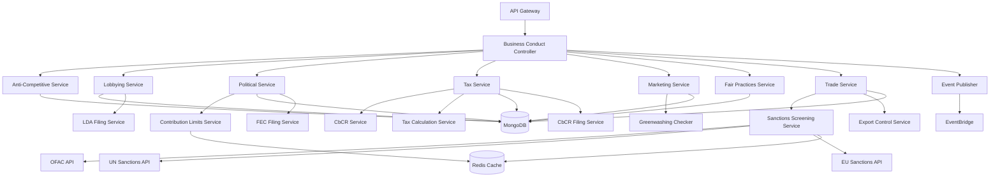

# Service Specification: Business Conduct Service

## Service Overview

**Service Name**: Business Conduct Service
**Port**: 3036
**Purpose**: Manages responsible business practices, anti-competitive behavior prevention, lobbying transparency, political contributions, tax transparency, and fair business conduct
**Domain**: Governance - Business Conduct
**Team Ownership**: Governance Domain Team
**Phase**: 5 (Governance Domain)
**Story Points**: 30

## 1. Functional Requirements

### 1.1 Core Features

#### Anti-Competitive Behavior Management
- Anti-trust incident tracking and investigation
- Market abuse monitoring
- Price-fixing allegation management
- Bid-rigging detection
- Anti-competitive practice registry
- Cartel involvement tracking
- Monopoly abuse monitoring
- Predatory pricing alerts
- Exclusive dealing tracking
- Market dominance analysis
- Compliance training tracking
- Legal proceeding management

#### Lobbying & Advocacy Management
- Lobbying activity registration
- Lobbyist relationship tracking
- Legislative engagement recording
- Public policy position management
- Advocacy campaign tracking
- Grassroots lobbying monitoring
- Coalition membership management
- Government meeting logs
- Lobbying expenditure tracking
- Trade association membership
- Position paper management
- Advocacy impact assessment

#### Political Contributions & Activities
- Political contribution registry
- Candidate contribution tracking
- Political party donations
- PAC (Political Action Committee) management
- In-kind contribution tracking
- Bundled contribution monitoring
- Independent expenditure tracking
- Electioneering communications
- Issue advocacy spending
- Political event sponsorships
- Employee political activity
- Contribution limit compliance

#### Tax Transparency & Compliance
- Country-by-Country Reporting (CbCR)
- Tax jurisdiction registry
- Effective tax rate calculation
- Tax incentive tracking
- Transfer pricing documentation
- Tax haven presence monitoring
- Tax ruling disclosure
- Tax authority engagement
- Tax strategy disclosure
- Tax provision reconciliation
- Deferred tax tracking
- Tax uncertainty reserves

#### Responsible Marketing & Advertising
- Marketing practice monitoring
- Misleading advertising tracking
- Green-washing incident registry
- Product claim verification
- Advertising standards compliance
- Consumer complaint management
- Marketing code violations
- Influencer marketing tracking
- Comparative advertising review
- Advertising to children monitoring
- Health claim validation
- Promotional practice review

#### Fair Business Practices
- Fair dealing incident tracking
- Customer complaint registry
- Supplier relationship fairness
- Contract term fairness review
- Payment term monitoring
- Intellectual property respect
- Trade secret protection
- Confidentiality agreement management
- Non-compete clause tracking
- Restraint of trade monitoring
- License agreement fairness
- Franchise relationship management

#### Trade Compliance & Sanctions
- Export control compliance
- Import regulation tracking
- Customs compliance monitoring
- Trade sanctions screening
- Embargo compliance
- OFAC (Office of Foreign Assets Control) screening
- Entity list verification
- Denied persons screening
- Restricted party screening
- Trade license management
- Trade violation tracking
- Cross-border transaction monitoring

### 1.2 API Endpoints

#### Anti-Competitive Behavior Endpoints
```yaml
POST /v1/anti-competitive/incidents
  Request:
    - incidentType: "price-fixing" | "bid-rigging" | "market-allocation" | "monopoly-abuse" | "predatory-pricing" | "exclusive-dealing"
    - description: string (required)
    - dateIdentified: ISO8601 (required)
    - marketAffected: string (required)
    - competitors: string[] (optional)
    - productsServices: string[] (required)
    - jurisdictions: string[] (required)
    - allegationSource: "internal" | "competitor" | "customer" | "regulator" | "whistleblower"
    - severity: "low" | "medium" | "high" | "critical"
    - evidence: {
      documentIds: string[]
      witnessStatements: string[]
      communicationRecords: string[]
    }
    - investigation: {
      assigned: string (userId)
      status: "open" | "investigating" | "resolved" | "closed"
      findings: string (optional)
      remediationPlan: string (optional)
    }
    - regulatoryNotification: {
      required: boolean
      notified: boolean
      authority: string (optional)
      notificationDate: ISO8601 (optional)
      referenceNumber: string (optional)
    }
    - financialImpact: {
      estimatedLoss: number (optional)
      finesProposed: number (optional)
      finesPaid: number (optional)
      settlementAmount: number (optional)
    }
  Response:
    - incidentId: string
    - status: string
    - investigationId: string

GET /v1/anti-competitive/incidents
  Query:
    - type: string (optional)
    - severity: string (optional)
    - status: string (optional)
    - jurisdiction: string (optional)
    - dateFrom: ISO8601 (optional)
    - dateTo: ISO8601 (optional)
    - page: number
    - limit: number
  Response:
    - incidents: AntiCompetitiveIncident[]
    - total: number
    - page: number

PUT /v1/anti-competitive/incidents/:incidentId
  Request:
    - investigation: object (optional)
    - status: string (optional)
    - remediationActions: string[] (optional)
  Response:
    - incident: AntiCompetitiveIncident

GET /v1/anti-competitive/incidents/:incidentId
  Response:
    - incident: AntiCompetitiveIncident
    - timeline: Event[]
    - relatedDocuments: Document[]

POST /v1/anti-competitive/training
  Request:
    - trainingName: string (required)
    - description: string
    - targetRoles: string[] (required)
    - frequency: "annual" | "biennial" | "onboarding"
    - contentTopics: string[] (required)
    - certificationRequired: boolean
  Response:
    - trainingId: string

GET /v1/anti-competitive/compliance-report
  Query:
    - year: number (required)
    - jurisdiction: string (optional)
  Response:
    - totalIncidents: number
    - incidentsByType: object
    - investigationsCompleted: number
    - finesPaid: number
    - trainingCompletionRate: number
```

#### Lobbying & Advocacy Endpoints
```yaml
POST /v1/lobbying/activities
  Request:
    - activityType: "direct-lobbying" | "grassroots" | "coalition" | "testimony" | "regulatory-comment"
    - date: ISO8601 (required)
    - jurisdiction: string (required)
    - governmentBody: string (required)
    - officials: [{
        name: string
        title: string
        agency: string
      }]
    - issues: string[] (required)
    - legislation: [{
        billNumber: string
        title: string
        position: "support" | "oppose" | "neutral" | "monitor"
      }]
    - lobbyists: [{
        name: string
        firm: string (optional)
        internal: boolean
      }]
    - expenditure: {
        amount: number
        currency: string
        category: "consulting" | "events" | "research" | "communications"
      }
    - materials: {
        documentIds: string[]
        presentations: string[]
      }
    - outcome: string (optional)
  Response:
    - activityId: string
    - registrationRequired: boolean
    - deadlines: Date[]

GET /v1/lobbying/activities
  Query:
    - activityType: string (optional)
    - jurisdiction: string (optional)
    - dateFrom: ISO8601 (optional)
    - dateTo: ISO8601 (optional)
    - issue: string (optional)
    - page: number
    - limit: number
  Response:
    - activities: LobbyingActivity[]
    - total: number
    - totalExpenditure: number

POST /v1/lobbying/positions
  Request:
    - issue: string (required)
    - position: "support" | "oppose" | "neutral"
    - rationale: string (required)
    - alignmentWithStrategy: string
    - stakeholders: string[] (required)
    - publicDisclosure: boolean
    - effectiveDate: ISO8601
    - expiryDate: ISO8601 (optional)
  Response:
    - positionId: string

GET /v1/lobbying/expenditure-report
  Query:
    - year: number (required)
    - quarter: number (optional)
    - jurisdiction: string (optional)
  Response:
    - totalExpenditure: number
    - expenditureByCategory: object
    - expenditureByJurisdiction: object
    - topIssues: object[]
    - complianceStatus: object

POST /v1/lobbying/registrations
  Request:
    - jurisdiction: string (required)
    - registrationType: "federal" | "state" | "local"
    - lobbyists: string[] (required)
    - clients: string[] (required)
    - issues: string[] (required)
    - effectiveDate: ISO8601
    - renewalDate: ISO8601
  Response:
    - registrationId: string
    - confirmationNumber: string
```

#### Political Contributions Endpoints
```yaml
POST /v1/political/contributions
  Request:
    - contributionType: "direct" | "pac" | "in-kind" | "bundled" | "independent-expenditure"
    - date: ISO8601 (required)
    - amount: number (required)
    - currency: string (required)
    - recipient: {
        name: string (required)
        type: "candidate" | "party" | "pac" | "super-pac" | "501c4"
        office: string (optional)
        party: string (optional)
        jurisdiction: string (required)
      }
    - source: {
        type: "corporate" | "employee" | "pac"
        fundSource: string
      }
    - approvedBy: string (userId, required)
    - approvalDate: ISO8601
    - purpose: string
    - legalComplianceReview: {
        reviewedBy: string (userId)
        reviewDate: ISO8601
        approved: boolean
        notes: string
      }
    - disclosure: {
        required: boolean
        disclosed: boolean
        disclosureDate: ISO8601 (optional)
        publicRecord: string (optional)
      }
  Response:
    - contributionId: string
    - complianceStatus: object

GET /v1/political/contributions
  Query:
    - contributionType: string (optional)
    - recipientType: string (optional)
    - jurisdiction: string (optional)
    - dateFrom: ISO8601 (optional)
    - dateTo: ISO8601 (optional)
    - page: number
    - limit: number
  Response:
    - contributions: PoliticalContribution[]
    - total: number
    - totalAmount: number

POST /v1/political/pac-management
  Request:
    - pacName: string (required)
    - registrationNumber: string (required)
    - jurisdiction: string (required)
    - type: "separate-segregated-fund" | "non-connected"
    - administrator: string (userId, required)
    - treasurer: string (userId, required)
    - bankAccount: string (encrypted)
    - contributionLimits: object
  Response:
    - pacId: string

GET /v1/political/contribution-limits
  Query:
    - jurisdiction: string (required)
    - recipientType: string (required)
    - electionCycle: string (required)
  Response:
    - limits: object
    - aggregateLimits: object
    - prohibitions: string[]

GET /v1/political/disclosure-report
  Query:
    - year: number (required)
    - quarter: number (optional)
    - jurisdiction: string (optional)
  Response:
    - totalContributions: number
    - contributionsByRecipient: object[]
    - contributionsByType: object
    - employeeContributions: number
    - corporateContributions: number
    - disclosureCompliance: object
```

#### Tax Transparency Endpoints
```yaml
POST /v1/tax/country-by-country-report
  Request:
    - reportingYear: number (required)
    - multinationalGroup: string (required)
    - parentEntity: {
        name: string (required)
        taxJurisdiction: string (required)
        tin: string (required)
      }
    - jurisdictions: [{
        country: string (required)
        taxJurisdiction: string
        entities: [{
          name: string
          tin: string
          activities: string[]
        }]
        revenue: {
          related: number
          unrelated: number
          total: number
        }
        profitLoss: number
        incomeTaxPaid: number
        incomeTaxAccrued: number
        statedCapital: number
        accumulatedEarnings: number
        numberOfEmployees: number
        tangibleAssets: number
      }]
    - additionalInfo: string
    - reportingCurrency: string (required)
    - exchangeRates: object
  Response:
    - cbcrId: string
    - validationStatus: object

GET /v1/tax/country-by-country-report/:year
  Response:
    - report: CountryByCountryReport
    - summaryStatistics: object

POST /v1/tax/jurisdictions
  Request:
    - jurisdiction: string (required)
    - entityCount: number (required)
    - taxResidency: boolean
    - permanentEstablishment: boolean
    - corporateTaxRate: number
    - effectiveTaxRate: number (optional)
    - taxIncentives: [{
        type: string
        description: string
        value: number
        expiryDate: ISO8601
      }]
    - taxRulings: [{
        type: string
        date: ISO8601
        description: string
        publicDisclosure: boolean
      }]
    - transferPricing: {
        methodology: string
        documentation: boolean
        lastReviewDate: ISO8601
      }
  Response:
    - jurisdictionId: string

GET /v1/tax/jurisdictions
  Query:
    - includeInactive: boolean
    - taxHavenStatus: boolean (optional)
  Response:
    - jurisdictions: TaxJurisdiction[]
    - total: number

POST /v1/tax/strategy-disclosure
  Request:
    - year: number (required)
    - taxStrategy: string (required)
    - riskManagement: string (required)
    - attitude: "low-risk" | "moderate" | "aggressive"
    - taxPlanning: string
    - taxAuthorities: string
    - publicDisclosure: boolean
    - boardApproval: {
        approved: boolean
        date: ISO8601
        approvedBy: string (userId)
      }
  Response:
    - disclosureId: string

GET /v1/tax/effective-tax-rate
  Query:
    - year: number (required)
    - jurisdiction: string (optional)
  Response:
    - globalEffectiveTaxRate: number
    - jurisdictionRates: object[]
    - reconciliation: object
    - cashTaxRate: number

GET /v1/tax/transparency-report
  Query:
    - year: number (required)
  Response:
    - totalRevenue: number
    - totalTaxPaid: number
    - totalTaxAccrued: number
    - effectiveTaxRate: number
    - jurisdictionCount: number
    - cbcrCompliance: boolean
    - publicDisclosure: object
```

#### Responsible Marketing Endpoints
```yaml
POST /v1/marketing/campaigns
  Request:
    - campaignName: string (required)
    - campaignType: "advertising" | "social-media" | "influencer" | "content" | "email" | "event"
    - startDate: ISO8601 (required)
    - endDate: ISO8601 (optional)
    - targetAudience: {
        demographics: string[]
        minAge: number
        geographies: string[]
      }
    - channels: string[] (required)
    - products: string[] (required)
    - claims: [{
        claimType: "environmental" | "health" | "performance" | "safety" | "comparative"
        claimStatement: string (required)
        substantiation: {
          evidence: string[]
          testing: string[]
          certifications: string[]
        }
        reviewedBy: string (userId)
        approvedBy: string (userId)
        approvalDate: ISO8601
      }]
    - complianceReview: {
        standards: string[] (e.g., "FTC-Green-Guides", "ASA-Code")
        reviewedBy: string (userId, required)
        reviewDate: ISO8601
        approved: boolean
        notes: string
      }
    - budget: number
    - currency: string
  Response:
    - campaignId: string
    - complianceStatus: object

POST /v1/marketing/incidents
  Request:
    - incidentType: "misleading-advertising" | "greenwashing" | "false-claim" | "unfair-comparison" | "inappropriate-targeting"
    - campaignId: string (optional)
    - dateIdentified: ISO8601 (required)
    - source: "consumer-complaint" | "regulator" | "competitor" | "internal-audit"
    - description: string (required)
    - claim: string
    - evidence: string[]
    - impact: {
        consumersAffected: number
        financialImpact: number
        reputationalDamage: "low" | "medium" | "high"
      }
    - response: {
        correctionRequired: boolean
        adWithdrawn: boolean
        publicApology: boolean
        refundOffered: boolean
        correctionDate: ISO8601 (optional)
      }
    - regulatory: {
        authority: string (optional)
        complaintFiled: boolean
        investigationOpened: boolean
        fineAssessed: number (optional)
        settlementAmount: number (optional)
      }
  Response:
    - incidentId: string

GET /v1/marketing/greenwashing-checks
  Query:
    - campaignId: string (required)
  Response:
    - checks: [{
        criterion: string
        status: "pass" | "fail" | "warning"
        details: string
      }]
    - overallRisk: "low" | "medium" | "high"
    - recommendations: string[]

POST /v1/marketing/consumer-complaints
  Request:
    - complaintDate: ISO8601 (required)
    - campaignId: string (optional)
    - productId: string (optional)
    - complaintType: "misleading" | "offensive" | "inappropriate" | "false-claim"
    - complaintDetail: string (required)
    - consumer: {
        anonymous: boolean
        contactInfo: string (encrypted, optional)
      }
    - investigation: {
        assigned: string (userId)
        status: "open" | "investigating" | "resolved"
        findings: string
        actionTaken: string
      }
  Response:
    - complaintId: string

GET /v1/marketing/compliance-report
  Query:
    - year: number (required)
    - quarter: number (optional)
  Response:
    - totalCampaigns: number
    - campaignsReviewed: number
    - complianceRate: number
    - incidents: number
    - consumerComplaints: number
    - regulatoryActions: number
    - claimSubstantiation: object
```

#### Fair Business Practices Endpoints
```yaml
POST /v1/fair-practices/incidents
  Request:
    - incidentType: "unfair-contract-terms" | "late-payment" | "intellectual-property-violation" | "confidentiality-breach" | "unfair-dealing"
    - dateIdentified: ISO8601 (required)
    - partyAffected: {
        type: "customer" | "supplier" | "partner" | "competitor"
        name: string
        id: string (optional)
      }
    - description: string (required)
    - contractReference: string (optional)
    - severity: "low" | "medium" | "high" | "critical"
    - investigation: {
        assigned: string (userId)
        status: "open" | "investigating" | "resolved"
        findings: string
      }
    - remediation: {
        required: boolean
        actionsTaken: string[]
        compensationOffered: number (optional)
        relationshipRepaired: boolean
      }
  Response:
    - incidentId: string

POST /v1/fair-practices/contract-reviews
  Request:
    - contractType: string (required)
    - partyType: "customer" | "supplier" | "partner"
    - contractTerms: {
        paymentTerms: string
        terminationClauses: string[]
        liabilityLimitations: string[]
        intellectualPropertyRights: string
        confidentiality: string
        nonCompete: string (optional)
      }
    - fairnessReview: {
        reviewedBy: string (userId, required)
        reviewDate: ISO8601
        fairnessAssessment: "fair" | "needs-revision" | "unfair"
        concerns: string[]
        recommendations: string[]
      }
    - legalReview: {
        reviewedBy: string (userId, required)
        approved: boolean
        notes: string
      }
  Response:
    - reviewId: string
    - approvalStatus: string

GET /v1/fair-practices/payment-analysis
  Query:
    - partyType: "supplier" | "customer" (required)
    - dateFrom: ISO8601 (required)
    - dateTo: ISO8601 (required)
  Response:
    - averagePaymentDays: number
    - paymentTermCompliance: number
    - latePayments: number
    - latePaymentsBySupplier: object[]
    - trend: object

POST /v1/fair-practices/ip-incidents
  Request:
    - incidentType: "patent-infringement" | "trademark-violation" | "copyright-violation" | "trade-secret-theft"
    - dateIdentified: ISO8601 (required)
    - direction: "we-are-infringing" | "someone-is-infringing"
    - intellectualProperty: {
        type: string
        description: string
        registrationNumber: string (optional)
      }
    - partyInvolved: string
    - legalAction: {
        required: boolean
        filed: boolean
        type: string (optional)
        status: string (optional)
      }
  Response:
    - incidentId: string

GET /v1/fair-practices/compliance-report
  Query:
    - year: number (required)
  Response:
    - totalIncidents: number
    - incidentsByType: object
    - contractFairnessScore: number
    - paymentComplianceRate: number
    - relationshipHealth: object
```

#### Trade Compliance & Sanctions Endpoints
```yaml
POST /v1/trade/sanctions-screening
  Request:
    - screeningType: "person" | "organization" | "transaction" | "shipment"
    - entity: {
        name: string (required)
        aliases: string[]
        address: object
        nationality: string (optional)
        dateOfBirth: ISO8601 (optional)
        identificationNumbers: object (optional)
      }
    - transaction: {
        type: string (optional)
        value: number (optional)
        currency: string (optional)
        description: string (optional)
      }
    - sanctionLists: string[] (e.g., ["OFAC-SDN", "UN-Sanctions", "EU-Sanctions"])
    - screeningDate: ISO8601
  Response:
    - screeningId: string
    - status: "clear" | "potential-match" | "confirmed-match"
    - matches: [{
        list: string
        entity: string
        matchScore: number
        details: object
      }]
    - actionRequired: boolean
    - recommendations: string[]

GET /v1/trade/sanctions-screening/:screeningId
  Response:
    - screening: SanctionsScreening
    - riskAssessment: object

POST /v1/trade/export-transactions
  Request:
    - transactionDate: ISO8601 (required)
    - product: {
        name: string (required)
        hsCode: string (required)
        eccn: string (optional, Export Control Classification Number)
        dualUse: boolean
      }
    - destination: {
        country: string (required)
        endUser: string (required)
        endUse: string (required)
      }
    - value: number (required)
    - currency: string (required)
    - license: {
        required: boolean
        licenseNumber: string (optional)
        expiryDate: ISO8601 (optional)
      }
    - complianceReview: {
        reviewedBy: string (userId, required)
        sanctionsScreening: string (screeningId)
        approved: boolean
        notes: string
      }
  Response:
    - transactionId: string
    - complianceStatus: object

GET /v1/trade/restricted-parties
  Query:
    - list: string (optional, e.g., "denied-persons", "entity-list", "unverified-list")
    - search: string (optional)
    - page: number
    - limit: number
  Response:
    - parties: RestrictedParty[]
    - total: number
    - lastUpdated: ISO8601

POST /v1/trade/violations
  Request:
    - violationType: "export-control" | "sanctions" | "customs" | "embargo"
    - dateIdentified: ISO8601 (required)
    - description: string (required)
    - transactionIds: string[] (optional)
    - severity: "low" | "medium" | "high" | "critical"
    - selfDisclosure: {
        required: boolean
        disclosed: boolean
        authority: string (optional)
        disclosureDate: ISO8601 (optional)
      }
    - investigation: {
        assigned: string (userId)
        status: string
        findings: string
      }
    - remediation: {
        correctionActions: string[]
        systemImprovements: string[]
        training: string[]
      }
    - penalties: {
        assessed: boolean
        amount: number (optional)
        paid: boolean
      }
  Response:
    - violationId: string

GET /v1/trade/compliance-report
  Query:
    - year: number (required)
    - quarter: number (optional)
  Response:
    - totalTransactions: number
    - transactionsRequiringLicense: number
    - sanctionsScreenings: number
    - matches: number
    - violations: number
    - complianceRate: number
    - destinationCountries: object[]
```

### 1.3 Business Rules

#### Anti-Competitive Behavior Rules
1. All anti-competitive incidents must be investigated within 48 hours
2. Critical incidents must be reported to Chief Compliance Officer immediately
3. Regulatory notification required for incidents involving fines over $100K
4. All employees in sales, marketing, and procurement must complete annual anti-trust training
5. Competitive intelligence gathering must follow ethical guidelines
6. Trade association meetings require antitrust compliance protocols
7. Price discussions with competitors are strictly prohibited
8. Market allocation agreements are forbidden
9. Bid-rigging incidents require immediate self-disclosure

#### Lobbying & Advocacy Rules
1. All lobbying activities must be registered per jurisdiction requirements
2. Federal lobbying activities must be reported quarterly (US LDA)
3. Lobbying expenditure must not exceed approved budget
4. All lobbying contacts must be documented within 24 hours
5. Public policy positions must align with corporate values
6. Lobbyist relationships must be disclosed in annual reports
7. Grassroots lobbying campaigns require prior legal review
8. Coalition memberships must be evaluated for alignment annually
9. Lobbying on climate issues must align with climate commitments

#### Political Contributions Rules
1. All political contributions require prior approval from Legal and Compliance
2. Corporate contributions must comply with local contribution limits
3. Contributions to candidates must not create quid pro quo relationships
4. Employee political activity must be voluntary and not coerced
5. PAC contributions must follow federal and state limits
6. Bundled contributions must be disclosed
7. In-kind contributions must be valued at fair market value
8. Independent expenditures must maintain independence from candidates
9. Disclosure required within 48 hours of contribution
10. Prohibited contributions (e.g., foreign nationals) strictly enforced

#### Tax Transparency Rules
1. Country-by-Country Reporting required for groups with €750M+ revenue
2. CbCR must be filed within 12 months of fiscal year end
3. Tax strategy must be reviewed and approved by Board annually
4. Effective tax rate calculation must follow OECD guidelines
5. Transfer pricing documentation required for related-party transactions
6. Tax rulings must be disclosed per BEPS Action 5 standards
7. Tax haven presence must be justified with substance requirements
8. Aggressive tax planning inconsistent with business ethics is prohibited
9. Tax transparency report must be published annually
10. Deferred tax assets must be reviewed quarterly for realizability

#### Responsible Marketing Rules
1. All environmental claims must be substantiated before publication
2. Green claims must comply with FTC Green Guides or equivalent
3. Comparative advertising must be accurate and verifiable
4. Marketing to children requires additional safeguards
5. Health claims require scientific substantiation
6. Influencer partnerships must be disclosed per FTC guidelines
7. Consumer complaints must be investigated within 7 days
8. Misleading ads must be withdrawn within 24 hours of identification
9. Greenwashing risk assessment required for sustainability campaigns
10. Annual audit of marketing practices required

#### Fair Business Practices Rules
1. Payment terms must be honored per contract agreements
2. Late payments to SME suppliers prohibited without justification
3. Contract terms must be reviewed for fairness by Legal
4. Unilateral contract changes require consent
5. Intellectual property of others must be respected
6. Confidentiality agreements must be enforced
7. Non-compete clauses must be reasonable in scope and duration
8. Franchise relationships must follow fair franchise codes
9. Customer complaints must be addressed within 30 days
10. Supplier relationships must be based on fair dealing principles

#### Trade Compliance Rules
1. All export transactions must undergo sanctions screening
2. Restricted parties must be screened against all applicable lists
3. Export licenses required for controlled items and destinations
4. Dual-use items require ECCN classification
5. Embargo violations result in immediate transaction suspension
6. Trade violations must be self-disclosed to authorities per VSD guidelines
7. Sanctions screening must occur before transaction execution
8. Restricted party lists must be updated weekly minimum
9. Customs declarations must be accurate and complete
10. Trade compliance training required annually for relevant staff

### 1.4 Error Handling

```yaml
Error Responses:
  400 Bad Request:
    - INVALID_CONTRIBUTION_AMOUNT
    - MISSING_REQUIRED_SUBSTANTIATION
    - INVALID_TAX_JURISDICTION
    - INVALID_SCREENING_DATA

  401 Unauthorized:
    - INSUFFICIENT_PERMISSIONS
    - APPROVAL_REQUIRED
    - TOKEN_EXPIRED

  403 Forbidden:
    - CONTRIBUTION_LIMIT_EXCEEDED
    - PROHIBITED_CONTRIBUTION
    - SANCTIONS_MATCH_BLOCKED
    - EXPORT_LICENSE_REQUIRED

  404 Not Found:
    - INCIDENT_NOT_FOUND
    - CAMPAIGN_NOT_FOUND
    - JURISDICTION_NOT_FOUND

  409 Conflict:
    - DUPLICATE_SCREENING
    - CONTRIBUTION_ALREADY_RECORDED
    - CBCR_ALREADY_SUBMITTED

  422 Unprocessable Entity:
    - GREENWASHING_RISK_HIGH
    - SANCTIONS_MATCH_UNRESOLVED
    - CLAIM_NOT_SUBSTANTIATED

  429 Too Many Requests:
    - SCREENING_RATE_LIMIT_EXCEEDED

  500 Internal Server Error:
    - SANCTIONS_LIST_UNAVAILABLE
    - TAX_CALCULATION_ERROR
```

## 2. Data Model

### 2.1 MongoDB Collections

#### anti_competitive_incidents Collection
```javascript
{
  _id: ObjectId,
  incidentId: String (UUID, unique, indexed),

  incidentType: String, // "price-fixing", "bid-rigging", etc.
  description: String,
  dateIdentified: Date (indexed),

  market: {
    name: String,
    industry: String,
    competitors: [String],
    productsServices: [String],
    estimatedMarketSize: Number,
    marketShare: Number
  },

  jurisdictions: [String],

  allegation: {
    source: String, // "internal", "competitor", "customer", etc.
    sourceDetails: String,
    dateAlleged: Date,
    allegationDetails: String
  },

  severity: String, // "low", "medium", "high", "critical"

  evidence: {
    documents: [ObjectId], // References to document service
    witnessStatements: [String],
    communicationRecords: [String],
    meetings: [{
      date: Date,
      participants: [String],
      notes: String
    }],
    forensicAnalysis: String
  },

  investigation: {
    investigationId: String (UUID),
    assigned: ObjectId, // Reference to users
    assignedDate: Date,
    status: String, // "open", "investigating", "resolved", "closed"
    investigationPlan: String,
    findings: String,
    conclusion: String,
    closedDate: Date,
    closedBy: ObjectId
  },

  regulatoryNotification: {
    required: Boolean,
    notified: Boolean,
    authority: String,
    notificationDate: Date,
    referenceNumber: String,
    response: String,
    proceedingInitiated: Boolean
  },

  remediation: {
    plan: String,
    actions: [{
      action: String,
      responsible: ObjectId,
      dueDate: Date,
      completedDate: Date,
      status: String
    }],
    policyChanges: [String],
    trainingRequired: Boolean,
    systemChanges: [String]
  },

  financialImpact: {
    estimatedLoss: Number,
    finesProposed: Number,
    finesPaid: Number,
    settlementAmount: Number,
    legalCosts: Number,
    currency: String
  },

  legalProceedings: [{
    type: String,
    authority: String,
    caseNumber: String,
    filedDate: Date,
    status: String,
    outcome: String
  }],

  relatedIncidents: [ObjectId],

  metadata: {
    createdAt: Date (indexed),
    createdBy: ObjectId,
    updatedAt: Date,
    updatedBy: ObjectId,
    status: String, // "draft", "active", "closed"
    confidential: Boolean
  }
}

// Indexes
- incidentId: unique
- incidentType: 1
- dateIdentified: -1
- jurisdictions: 1
- severity: 1
- investigation.status: 1
- metadata.createdAt: -1
```

#### lobbying_activities Collection
```javascript
{
  _id: ObjectId,
  activityId: String (UUID, unique, indexed),

  activityType: String, // "direct-lobbying", "grassroots", etc.
  date: Date (indexed),
  endDate: Date,

  jurisdiction: {
    country: String (indexed),
    state: String,
    level: String // "federal", "state", "local"
  },

  government: {
    body: String, // "Congress", "Senate", "Parliament", etc.
    branch: String, // "legislative", "executive", "judicial"
    agency: String,
    committee: String
  },

  officials: [{
    name: String,
    title: String,
    agency: String,
    office: String,
    party: String
  }],

  issues: [String], // Healthcare, environment, tax, etc.

  legislation: [{
    billNumber: String,
    title: String,
    status: String,
    position: String, // "support", "oppose", "neutral", "monitor"
    reasoning: String
  }],

  lobbyists: [{
    lobbyistId: ObjectId,
    name: String,
    firm: String,
    internal: Boolean,
    registrationNumber: String
  }],

  expenditure: {
    amount: Number,
    currency: String,
    category: String, // "consulting", "events", "research", etc.
    breakdown: [{
      item: String,
      amount: Number
    }]
  },

  materials: {
    documents: [ObjectId],
    presentations: [ObjectId],
    positionPapers: [ObjectId],
    meetingNotes: String
  },

  outcome: {
    description: String,
    impact: String,
    legislationPassed: Boolean,
    favorableOutcome: Boolean
  },

  registration: {
    registrationId: String,
    required: Boolean,
    filed: Boolean,
    filedDate: Date,
    nextFilingDate: Date,
    confirmationNumber: String
  },

  publicDisclosure: {
    required: Boolean,
    disclosed: Boolean,
    disclosureDate: Date,
    disclosureUrl: String
  },

  metadata: {
    createdAt: Date (indexed),
    createdBy: ObjectId,
    updatedAt: Date,
    updatedBy: ObjectId
  }
}

// Indexes
- activityId: unique
- activityType: 1
- date: -1
- jurisdiction.country: 1
- issues: 1
- lobbyists.lobbyistId: 1
- registration.nextFilingDate: 1
```

#### political_contributions Collection
```javascript
{
  _id: ObjectId,
  contributionId: String (UUID, unique, indexed),

  contributionType: String, // "direct", "pac", "in-kind", etc.
  date: Date (indexed),

  amount: {
    value: Number,
    currency: String,
    usdEquivalent: Number
  },

  recipient: {
    recipientId: String,
    name: String,
    type: String, // "candidate", "party", "pac", etc.
    office: String,
    party: String,
    jurisdiction: String (indexed),
    incumbent: Boolean
  },

  source: {
    type: String, // "corporate", "employee", "pac"
    fundSource: String,
    employeeId: ObjectId (optional)
  },

  approval: {
    approvalRequired: Boolean,
    approvedBy: ObjectId,
    approvalDate: Date,
    reviewLevel: String // "standard", "executive", "board"
  },

  purpose: String,

  legalCompliance: {
    reviewedBy: ObjectId,
    reviewDate: Date,
    approved: Boolean,
    limitCompliance: Boolean,
    currentAggregate: Number,
    aggregateLimit: Number,
    notes: String
  },

  disclosure: {
    required: Boolean,
    disclosed: Boolean,
    disclosureDate: Date,
    disclosureForm: String,
    publicRecord: String,
    filingAuthority: String
  },

  bundled: {
    isBundled: Boolean,
    bundlerName: String,
    totalBundledAmount: Number,
    contributions: [ObjectId]
  },

  independentExpenditure: {
    isIndependent: Boolean,
    noCoordination: Boolean,
    certificationDate: Date,
    certifiedBy: ObjectId
  },

  reporting: {
    reportingPeriod: String,
    filedDate: Date,
    formType: String,
    confirmationNumber: String
  },

  metadata: {
    createdAt: Date (indexed),
    createdBy: ObjectId,
    updatedAt: Date,
    updatedBy: ObjectId,
    fiscalYear: Number (indexed),
    quarter: Number
  }
}

// Indexes
- contributionId: unique
- contributionType: 1
- date: -1
- recipient.jurisdiction: 1
- recipient.type: 1
- metadata.fiscalYear: 1
- metadata.quarter: 1
```

#### country_by_country_reports Collection
```javascript
{
  _id: ObjectId,
  cbcrId: String (UUID, unique, indexed),

  reportingYear: Number (indexed),
  reportingPeriod: {
    startDate: Date,
    endDate: Date
  },

  multinationalGroup: {
    name: String,
    ultimateParent: String,
    consolidatedRevenue: Number
  },

  parentEntity: {
    name: String,
    taxJurisdiction: String,
    tin: String,
    address: Object
  },

  jurisdictions: [{
    jurisdictionId: String,
    country: String (indexed),
    taxJurisdiction: String,

    entities: [{
      entityId: ObjectId,
      name: String,
      tin: String,
      activities: [String], // Research, manufacturing, sales, etc.
      mainBusinessActivities: String
    }],

    financialData: {
      revenue: {
        relatedParty: Number,
        unrelatedParty: Number,
        total: Number
      },
      profitLossBeforeTax: Number,
      incomeTaxPaid: Number, // Cash basis
      incomeTaxAccrued: Number, // Accrual basis
      statedCapital: Number,
      accumulatedEarnings: Number,
      numberOfEmployees: Number, // Full-time equivalents
      tangibleAssetsOtherThanCash: Number
    },

    taxData: {
      corporateTaxRate: Number,
      effectiveTaxRate: Number,
      taxIncentives: [{
        type: String,
        value: Number,
        description: String
      }]
    }
  }],

  additionalInformation: String,

  reportingCurrency: String,
  exchangeRates: Object, // Currency: rate mappings

  validation: {
    validated: Boolean,
    validationDate: Date,
    validatedBy: ObjectId,
    issues: [String],
    resolved: Boolean
  },

  filing: {
    filed: Boolean,
    filedDate: Date,
    filedTo: [String], // Tax authorities
    confirmationNumbers: Object,
    dueDate: Date
  },

  publicDisclosure: {
    disclosed: Boolean,
    disclosureDate: Date,
    disclosureUrl: String
  },

  metadata: {
    createdAt: Date (indexed),
    createdBy: ObjectId,
    updatedAt: Date,
    updatedBy: ObjectId,
    version: Number,
    status: String // "draft", "approved", "filed"
  }
}

// Indexes
- cbcrId: unique
- reportingYear: -1
- jurisdictions.country: 1
- metadata.status: 1
```

#### tax_jurisdictions Collection
```javascript
{
  _id: ObjectId,
  jurisdictionId: String (UUID, unique, indexed),

  jurisdiction: String (indexed),
  country: String (indexed),
  region: String,

  entities: [{
    entityId: ObjectId,
    name: String,
    tin: String,
    entityType: String,
    incorporationDate: Date,
    active: Boolean
  }],

  taxResidency: Boolean,
  permanentEstablishment: Boolean,

  taxRates: {
    corporateTaxRate: Number,
    effectiveTaxRate: Number,
    witholdingTaxRates: Object,
    vatGstRate: Number
  },

  taxIncentives: [{
    incentiveId: String,
    type: String,
    description: String,
    value: Number,
    startDate: Date,
    expiryDate: Date,
    conditions: String
  }],

  taxRulings: [{
    rulingId: String,
    type: String, // "APA", "transfer-pricing", etc.
    date: Date,
    description: String,
    publicDisclosure: Boolean,
    expiryDate: Date
  }],

  transferPricing: {
    methodology: String, // "CUP", "TNMM", etc.
    documentation: Boolean,
    lastReviewDate: Date,
    nextReviewDate: Date,
    reviewedBy: ObjectId,
    compliant: Boolean
  },

  taxAuthorities: [{
    name: String,
    contactPerson: String,
    relationship: String,
    lastMeeting: Date
  }],

  taxHavenAssessment: {
    isTaxHaven: Boolean,
    assessmentCriteria: String,
    substanceRequirements: String,
    substantiationProvided: Boolean
  },

  reportingObligations: [{
    obligation: String,
    frequency: String,
    nextDueDate: Date,
    responsible: ObjectId
  }],

  metadata: {
    createdAt: Date,
    createdBy: ObjectId,
    updatedAt: Date,
    updatedBy: ObjectId,
    active: Boolean
  }
}

// Indexes
- jurisdictionId: unique
- jurisdiction: 1
- country: 1
- taxHavenAssessment.isTaxHaven: 1
- metadata.active: 1
```

#### marketing_campaigns Collection
```javascript
{
  _id: ObjectId,
  campaignId: String (UUID, unique, indexed),

  campaignName: String (indexed),
  campaignType: String, // "advertising", "social-media", etc.

  period: {
    startDate: Date (indexed),
    endDate: Date,
    active: Boolean
  },

  targetAudience: {
    demographics: [String],
    minAge: Number,
    maxAge: Number,
    geographies: [String],
    interests: [String]
  },

  channels: [String], // "tv", "online", "print", "social-media", etc.

  products: [ObjectId], // References to products

  claims: [{
    claimId: String (UUID),
    claimType: String, // "environmental", "health", etc.
    claimStatement: String,

    substantiation: {
      evidenceType: String,
      evidenceDocuments: [ObjectId],
      testingReports: [ObjectId],
      certifications: [String],
      thirdPartyValidation: Boolean,
      validator: String
    },

    review: {
      reviewedBy: ObjectId,
      reviewDate: Date,
      approvedBy: ObjectId,
      approvalDate: Date,
      approved: Boolean,
      conditions: String
    }
  }],

  complianceReview: {
    standards: [String], // "FTC-Green-Guides", "ASA-Code", etc.
    reviewedBy: ObjectId,
    reviewDate: Date,
    approved: Boolean,
    greenwashingRisk: String, // "low", "medium", "high"
    notes: String,
    conditions: [String]
  },

  budget: {
    planned: Number,
    actual: Number,
    currency: String
  },

  performance: {
    impressions: Number,
    reach: Number,
    engagement: Number,
    conversions: Number
  },

  incidents: [ObjectId], // References to marketing incidents

  metadata: {
    createdAt: Date (indexed),
    createdBy: ObjectId,
    updatedAt: Date,
    updatedBy: ObjectId,
    status: String // "draft", "approved", "active", "paused", "completed"
  }
}

// Indexes
- campaignId: unique
- campaignName: 1
- campaignType: 1
- period.startDate: -1
- complianceReview.greenwashingRisk: 1
- metadata.status: 1
```

#### marketing_incidents Collection
```javascript
{
  _id: ObjectId,
  incidentId: String (UUID, unique, indexed),

  incidentType: String, // "misleading-advertising", "greenwashing", etc.
  campaignId: ObjectId (optional),
  dateIdentified: Date (indexed),

  source: String, // "consumer-complaint", "regulator", etc.
  sourceDetails: String,

  description: String,
  claim: String,
  evidence: [ObjectId],

  impact: {
    consumersAffected: Number,
    geographicSpread: [String],
    financialImpact: Number,
    currency: String,
    reputationalDamage: String, // "low", "medium", "high"
    brandImpact: String
  },

  investigation: {
    assigned: ObjectId,
    status: String,
    findings: String,
    rootCause: String,
    responsibleParties: [ObjectId]
  },

  response: {
    correctionRequired: Boolean,
    correctionTaken: String,
    adWithdrawn: Boolean,
    withdrawalDate: Date,
    publicApology: Boolean,
    apologyDate: Date,
    refundOffered: Boolean,
    refundAmount: Number,
    otherActions: [String]
  },

  regulatory: {
    authority: String,
    complaintFiled: Boolean,
    complaintDate: Date,
    investigationOpened: Boolean,
    investigationReference: String,
    fineAssessed: Number,
    finesPaid: Number,
    settlementAmount: Number,
    settlementDate: Date,
    currency: String
  },

  preventiveMeasures: {
    policyChanges: [String],
    processImprovements: [String],
    trainingRequired: Boolean,
    reviewFrequency: String
  },

  metadata: {
    createdAt: Date (indexed),
    createdBy: ObjectId,
    updatedAt: Date,
    updatedBy: ObjectId,
    status: String, // "open", "investigating", "resolved", "closed"
    severity: String
  }
}

// Indexes
- incidentId: unique
- incidentType: 1
- dateIdentified: -1
- campaignId: 1
- metadata.status: 1
- metadata.severity: 1
```

#### fair_practices_incidents Collection
```javascript
{
  _id: ObjectId,
  incidentId: String (UUID, unique, indexed),

  incidentType: String, // "unfair-contract-terms", "late-payment", etc.
  dateIdentified: Date (indexed),

  partyAffected: {
    type: String, // "customer", "supplier", "partner", "competitor"
    name: String,
    id: String,
    relationshipType: String,
    relationshipDuration: Number // months
  },

  description: String,
  contractReference: String,

  severity: String, // "low", "medium", "high", "critical"

  investigation: {
    investigationId: String (UUID),
    assigned: ObjectId,
    assignedDate: Date,
    status: String,
    findings: String,
    conclusion: String,
    fairnessDetermination: String
  },

  remediation: {
    required: Boolean,
    actionsTaken: [String],
    compensationOffered: Number,
    compensationPaid: Number,
    currency: String,
    relationshipRepaired: Boolean,
    relationshipStatus: String,
    preventiveMeasures: [String]
  },

  financialImpact: {
    directCost: Number,
    indirectCost: Number,
    legalCosts: Number,
    reputationalCost: Number,
    currency: String
  },

  legalAction: {
    threatened: Boolean,
    filed: Boolean,
    type: String,
    caseNumber: String,
    status: String,
    outcome: String
  },

  metadata: {
    createdAt: Date (indexed),
    createdBy: ObjectId,
    updatedAt: Date,
    updatedBy: ObjectId,
    status: String,
    confidential: Boolean
  }
}

// Indexes
- incidentId: unique
- incidentType: 1
- dateIdentified: -1
- partyAffected.type: 1
- severity: 1
- metadata.status: 1
```

#### sanctions_screenings Collection
```javascript
{
  _id: ObjectId,
  screeningId: String (UUID, unique, indexed),

  screeningType: String, // "person", "organization", "transaction", "shipment"
  screeningDate: Date (indexed),

  entity: {
    type: String,
    name: String,
    aliases: [String],
    address: Object,
    nationality: String,
    dateOfBirth: Date,
    identificationNumbers: Object,
    entityData: Object // Flexible for different screening types
  },

  transaction: {
    type: String,
    value: Number,
    currency: String,
    description: String,
    originCountry: String,
    destinationCountry: String
  },

  sanctionLists: [String], // Lists screened against

  screening: {
    status: String, // "clear", "potential-match", "confirmed-match"
    screeningEngine: String,
    algorithm: String,
    version: String
  },

  matches: [{
    matchId: String (UUID),
    list: String, // "OFAC-SDN", "UN-Sanctions", etc.
    entity: String,
    matchScore: Number, // 0-100
    matchType: String, // "exact", "fuzzy", "alias"
    matchDetails: Object,
    falsePositive: Boolean,
    falsePositiveReason: String
  }],

  riskAssessment: {
    riskLevel: String, // "low", "medium", "high", "critical"
    factors: [String],
    mitigatingFactors: [String],
    overallRisk: String
  },

  decision: {
    actionRequired: Boolean,
    decision: String, // "proceed", "block", "escalate", "request-license"
    decidedBy: ObjectId,
    decidedDate: Date,
    reasoning: String,
    approvalRequired: Boolean,
    approvedBy: ObjectId,
    approvalDate: Date
  },

  monitoring: {
    ongoingMonitoring: Boolean,
    frequency: String,
    nextScreeningDate: Date,
    alerts: [Object]
  },

  metadata: {
    createdAt: Date (indexed),
    createdBy: ObjectId,
    updatedAt: Date,
    updatedBy: ObjectId,
    correlationId: String // Link to transaction/shipment
  }
}

// Indexes
- screeningId: unique
- screeningDate: -1
- screening.status: 1
- riskAssessment.riskLevel: 1
- entity.name: 1
- decision.decision: 1
- metadata.correlationId: 1
```

#### trade_transactions Collection
```javascript
{
  _id: ObjectId,
  transactionId: String (UUID, unique, indexed),

  transactionType: String, // "export", "import", "re-export"
  transactionDate: Date (indexed),

  product: {
    name: String,
    description: String,
    hsCode: String (indexed), // Harmonized System Code
    eccn: String, // Export Control Classification Number
    dualUse: Boolean,
    controlledGoods: Boolean,
    category: String
  },

  origin: {
    country: String,
    facility: String,
    entityId: ObjectId
  },

  destination: {
    country: String (indexed),
    city: String,
    endUser: String,
    endUserType: String,
    endUse: String,
    endUseStatement: Boolean
  },

  value: {
    amount: Number,
    currency: String,
    usdEquivalent: Number
  },

  license: {
    required: Boolean,
    licenseType: String,
    licenseNumber: String,
    issuingAuthority: String,
    issueDate: Date,
    expiryDate: Date,
    status: String
  },

  complianceReview: {
    reviewedBy: ObjectId,
    reviewDate: Date,
    sanctionsScreening: ObjectId, // Reference to sanctions_screenings
    sanctionsStatus: String,
    exportControlCheck: Boolean,
    approved: Boolean,
    conditions: [String],
    notes: String
  },

  shipping: {
    shipmentDate: Date,
    carrier: String,
    trackingNumber: String,
    incoterms: String,
    customsDeclaration: String
  },

  documentation: {
    commercialInvoice: ObjectId,
    packingList: ObjectId,
    billOfLading: ObjectId,
    certificate: ObjectId,
    endUserCertificate: ObjectId,
    otherDocuments: [ObjectId]
  },

  status: String, // "pending", "approved", "shipped", "completed", "blocked"

  metadata: {
    createdAt: Date (indexed),
    createdBy: ObjectId,
    updatedAt: Date,
    updatedBy: ObjectId
  }
}

// Indexes
- transactionId: unique
- transactionDate: -1
- product.hsCode: 1
- destination.country: 1
- license.licenseNumber: 1
- status: 1
```

### 2.2 Redis Data Structures

#### Sanctions List Cache
```
Key: sanctions_list:{list_name}
Value: {
  entities: [],
  lastUpdated: timestamp,
  version: string
}
TTL: 24 hours
```

#### Screening Results Cache
```
Key: screening:{entity_hash}
Value: {
  screeningId: string,
  status: string,
  matches: [],
  timestamp: timestamp
}
TTL: 1 hour
```

#### Contribution Limit Cache
```
Key: contribution_limit:{jurisdiction}:{recipient_type}
Value: {
  limit: number,
  aggregateLimit: number,
  currency: string,
  lastUpdated: timestamp
}
TTL: 7 days
```

#### Tax Rate Cache
```
Key: tax_rate:{jurisdiction}
Value: {
  corporateRate: number,
  effectiveRate: number,
  lastUpdated: timestamp
}
TTL: 30 days
```

## 3. Non-Functional Requirements

### 3.1 Performance
- **Sanctions screening**: < 2 seconds (p95)
- **Tax calculation**: < 500ms for jurisdiction-level
- **Greenwashing risk assessment**: < 1 second
- **Lobbying expenditure aggregation**: < 300ms
- **CbCR validation**: < 5 seconds for full report
- **Payment analysis**: < 2 seconds for 10K transactions

### 3.2 Scalability
- **Horizontal scaling**: Stateless service, scale to N instances
- **Database**: MongoDB replica set with 1 primary, 2 secondaries
- **Cache**: Redis cluster for sanctions lists and screening results
- **Sanctions screening**: 1000 screenings/minute
- **Tax calculations**: Support for 200+ jurisdictions
- **Campaign capacity**: 10K active campaigns

### 3.3 Availability
- **Uptime SLA**: 99.9% (43 min/month downtime)
- **RTO**: 2 hours
- **RPO**: 15 minutes
- **Graceful degradation**: Cached sanctions lists if service unavailable
- **Circuit breakers**: For external sanctions screening APIs

### 3.4 Security
- **Encryption at rest**: AES-256 for sensitive political contribution data
- **Encryption in transit**: TLS 1.3
- **PII handling**: Political contributor information encrypted
- **Access control**: Role-based access for sensitive compliance data
- **Audit logging**: All sanctions screening decisions logged
- **Data retention**: 7 years for tax and compliance records
- **Confidentiality**: High-risk incident data restricted access

### 3.5 Observability
- **Metrics**:
  - Sanctions screening match rate
  - Greenwashing incidents per campaign
  - Political contribution amounts by jurisdiction
  - Tax transparency report completion rates
  - Anti-competitive incident resolution time
  - Trade transaction approval rates

- **Logs**:
  - All sanctions screening decisions
  - Political contribution approvals
  - Marketing claim reviews
  - Tax calculation events
  - Anti-competitive investigations

- **Alerts**:
  - Sanctions match requiring immediate action
  - Contribution limit exceeded
  - Greenwashing risk high on approved campaign
  - CbCR filing deadline approaching
  - Export license expiring
  - Anti-competitive incident critical severity

### 3.6 Compliance & Audit
- **Audit logging**: All business conduct decisions
- **Data retention**: 7 years minimum (10 years for tax)
- **Regulatory reporting**: Automated filings for lobbying, CbCR
- **Evidence management**: Document all substantiation
- **Traceability**: Full audit trail for screening decisions
- **Transparency reporting**: Public disclosure of lobbying and tax data

## 4. Module Architecture

### 4.1 Internal Structure
```
business-conduct-service/
├── src/
│   ├── main.ts
│   ├── app.module.ts
│   │
│   ├── anti-competitive/
│   │   ├── anti-competitive.module.ts
│   │   ├── anti-competitive.controller.ts
│   │   ├── anti-competitive.service.ts
│   │   ├── anti-competitive.repository.ts
│   │   ├── entities/
│   │   │   └── anti-competitive-incident.entity.ts
│   │   └── dto/
│   │       ├── create-incident.dto.ts
│   │       └── update-incident.dto.ts
│   │
│   ├── lobbying/
│   │   ├── lobbying.module.ts
│   │   ├── lobbying.controller.ts
│   │   ├── lobbying.service.ts
│   │   ├── lobbying.repository.ts
│   │   ├── lobbying-registration.service.ts
│   │   ├── entities/
│   │   │   ├── lobbying-activity.entity.ts
│   │   │   └── lobbying-registration.entity.ts
│   │   └── dto/
│   │       ├── create-activity.dto.ts
│   │       └── expenditure-report.dto.ts
│   │
│   ├── political/
│   │   ├── political.module.ts
│   │   ├── political.controller.ts
│   │   ├── political.service.ts
│   │   ├── political.repository.ts
│   │   ├── contribution-limits.service.ts
│   │   ├── pac-management.service.ts
│   │   ├── entities/
│   │   │   ├── political-contribution.entity.ts
│   │   │   └── pac.entity.ts
│   │   └── dto/
│   │       ├── create-contribution.dto.ts
│   │       └── disclosure-report.dto.ts
│   │
│   ├── tax/
│   │   ├── tax.module.ts
│   │   ├── tax.controller.ts
│   │   ├── tax.service.ts
│   │   ├── tax.repository.ts
│   │   ├── cbcr.service.ts
│   │   ├── tax-calculation.service.ts
│   │   ├── transfer-pricing.service.ts
│   │   ├── entities/
│   │   │   ├── cbcr.entity.ts
│   │   │   ├── tax-jurisdiction.entity.ts
│   │   │   └── tax-strategy.entity.ts
│   │   └── dto/
│   │       ├── create-cbcr.dto.ts
│   │       └── transparency-report.dto.ts
│   │
│   ├── marketing/
│   │   ├── marketing.module.ts
│   │   ├── marketing.controller.ts
│   │   ├── marketing.service.ts
│   │   ├── marketing.repository.ts
│   │   ├── greenwashing-checker.service.ts
│   │   ├── claim-substantiation.service.ts
│   │   ├── entities/
│   │   │   ├── marketing-campaign.entity.ts
│   │   │   └── marketing-incident.entity.ts
│   │   └── dto/
│   │       ├── create-campaign.dto.ts
│   │       └── greenwashing-check.dto.ts
│   │
│   ├── fair-practices/
│   │   ├── fair-practices.module.ts
│   │   ├── fair-practices.controller.ts
│   │   ├── fair-practices.service.ts
│   │   ├── fair-practices.repository.ts
│   │   ├── payment-analysis.service.ts
│   │   ├── contract-review.service.ts
│   │   ├── entities/
│   │   │   ├── fair-practices-incident.entity.ts
│   │   │   └── contract-review.entity.ts
│   │   └── dto/
│   │       ├── create-incident.dto.ts
│   │       └── payment-analysis.dto.ts
│   │
│   ├── trade/
│   │   ├── trade.module.ts
│   │   ├── trade.controller.ts
│   │   ├── trade.service.ts
│   │   ├── trade.repository.ts
│   │   ├── sanctions-screening.service.ts
│   │   ├── export-control.service.ts
│   │   ├── restricted-party-lists.service.ts
│   │   ├── entities/
│   │   │   ├── sanctions-screening.entity.ts
│   │   │   ├── trade-transaction.entity.ts
│   │   │   └── restricted-party.entity.ts
│   │   └── dto/
│   │       ├── sanctions-screening.dto.ts
│   │       └── export-transaction.dto.ts
│   │
│   ├── analytics/
│   │   ├── analytics.module.ts
│   │   ├── analytics.service.ts
│   │   ├── compliance-metrics.service.ts
│   │   └── reporting.service.ts
│   │
│   ├── integrations/
│   │   ├── integrations.module.ts
│   │   ├── sanctions-api/
│   │   │   ├── ofac.service.ts
│   │   │   ├── un-sanctions.service.ts
│   │   │   └── eu-sanctions.service.ts
│   │   ├── lobbying-disclosure/
│   │   │   ├── lda-filing.service.ts
│   │   │   └── state-filing.service.ts
│   │   ├── political-disclosure/
│   │   │   ├── fec-filing.service.ts
│   │   │   └── state-filing.service.ts
│   │   └── tax-authorities/
│   │       ├── cbcr-filing.service.ts
│   │       └── tax-reporting.service.ts
│   │
│   ├── events/
│   │   ├── events.module.ts
│   │   ├── event-publisher.service.ts
│   │   └── schemas/
│   │       ├── sanctions-match-detected.schema.ts
│   │       ├── political-contribution-made.schema.ts
│   │       ├── greenwashing-incident.schema.ts
│   │       ├── cbcr-filed.schema.ts
│   │       └── anti-competitive-incident.schema.ts
│   │
│   ├── common/
│   │   ├── decorators/
│   │   ├── filters/
│   │   ├── interceptors/
│   │   ├── guards/
│   │   │   └── compliance-approval.guard.ts
│   │   └── utils/
│   │       ├── fuzzy-matching.util.ts
│   │       ├── risk-scoring.util.ts
│   │       └── tax-calculation.util.ts
│   │
│   └── config/
│       ├── configuration.ts
│       ├── database.config.ts
│       ├── redis.config.ts
│       └── sanctions-api.config.ts
│
├── test/
│   ├── unit/
│   ├── integration/
│   └── e2e/
│
├── .env.example
├── Dockerfile
├── package.json
└── tsconfig.json
```

### 4.2 Dependencies

```json
{
  "dependencies": {
    "@nestjs/common": "^10.0.0",
    "@nestjs/core": "^10.0.0",
    "@nestjs/mongoose": "^10.0.0",
    "@nestjs/config": "^3.0.0",
    "@nestjs/swagger": "^7.0.0",
    "@nestjs/schedule": "^4.0.0",
    "@aws-sdk/client-eventbridge": "^3.0.0",
    "mongoose": "^8.0.0",
    "ioredis": "^5.0.0",
    "class-validator": "^0.14.0",
    "class-transformer": "^0.5.0",
    "axios": "^1.0.0",
    "cheerio": "^1.0.0",
    "natural": "^6.0.0",
    "fuzzyset.js": "^1.0.0",
    "compromise": "^14.0.0",
    "pdf-parse": "^1.1.1",
    "xlsx": "^0.18.0"
  }
}
```

### 4.3 Module Interaction



## 5. Event Contracts

### 5.1 Published Events

#### SanctionsMatchDetected
```json
{
  "eventType": "business-conduct.sanctions.match-detected.v1",
  "version": "v1",
  "payload": {
    "screeningId": "string",
    "entityName": "string",
    "matchList": "string",
    "matchScore": 95,
    "riskLevel": "high",
    "transactionId": "string",
    "actionRequired": true,
    "timestamp": "ISO8601"
  }
}
```

#### PoliticalContributionMade
```json
{
  "eventType": "business-conduct.political.contribution-made.v1",
  "version": "v1",
  "payload": {
    "contributionId": "string",
    "amount": 10000,
    "currency": "USD",
    "recipient": {
      "name": "string",
      "type": "candidate",
      "jurisdiction": "string"
    },
    "source": "corporate",
    "approvedBy": "string",
    "timestamp": "ISO8601"
  }
}
```

#### GreenwashingIncidentDetected
```json
{
  "eventType": "business-conduct.marketing.greenwashing-incident.v1",
  "version": "v1",
  "payload": {
    "incidentId": "string",
    "campaignId": "string",
    "incidentType": "misleading-claim",
    "severity": "high",
    "claim": "string",
    "correctiveActionRequired": true,
    "timestamp": "ISO8601"
  }
}
```

#### CountryByCountryReportFiled
```json
{
  "eventType": "business-conduct.tax.cbcr-filed.v1",
  "version": "v1",
  "payload": {
    "cbcrId": "string",
    "reportingYear": 2024,
    "jurisdictionCount": 45,
    "totalRevenue": 50000000000,
    "totalTaxPaid": 5000000000,
    "effectiveTaxRate": 10.0,
    "filedDate": "ISO8601",
    "timestamp": "ISO8601"
  }
}
```

#### AntiCompetitiveIncidentReported
```json
{
  "eventType": "business-conduct.anti-competitive.incident-reported.v1",
  "version": "v1",
  "payload": {
    "incidentId": "string",
    "incidentType": "price-fixing",
    "severity": "critical",
    "market": "string",
    "jurisdictions": ["US", "EU"],
    "regulatoryNotificationRequired": true,
    "timestamp": "ISO8601"
  }
}
```

#### LobbyingActivityRecorded
```json
{
  "eventType": "business-conduct.lobbying.activity-recorded.v1",
  "version": "v1",
  "payload": {
    "activityId": "string",
    "activityType": "direct-lobbying",
    "jurisdiction": "US-Federal",
    "expenditure": 50000,
    "currency": "USD",
    "issues": ["climate-policy", "tax-reform"],
    "registrationRequired": true,
    "timestamp": "ISO8601"
  }
}
```

#### ExportTransactionBlocked
```json
{
  "eventType": "business-conduct.trade.transaction-blocked.v1",
  "version": "v1",
  "payload": {
    "transactionId": "string",
    "reason": "sanctions-match",
    "destinationCountry": "string",
    "product": "string",
    "value": 100000,
    "currency": "USD",
    "screeningId": "string",
    "timestamp": "ISO8601"
  }
}
```

### 5.2 Consumed Events

#### OrganizationCreated (from Organization Service)
```json
{
  "eventType": "organization.organization.created.v1",
  "version": "v1",
  "payload": {
    "organizationId": "string",
    "name": "string",
    "country": "string",
    "timestamp": "ISO8601"
  }
}
```
**Action**: Create initial tax jurisdiction record

#### SupplierOnboarded (from Supply Chain Service)
```json
{
  "eventType": "supply-chain.supplier.onboarded.v1",
  "version": "v1",
  "payload": {
    "supplierId": "string",
    "name": "string",
    "country": "string",
    "timestamp": "ISO8601"
  }
}
```
**Action**: Perform initial sanctions screening

#### ProductLaunched (from Product Service)
```json
{
  "eventType": "product.product.launched.v1",
  "version": "v1",
  "payload": {
    "productId": "string",
    "name": "string",
    "category": "string",
    "timestamp": "ISO8601"
  }
}
```
**Action**: Initiate marketing compliance review

## 6. Integration Points

### 6.1 External Sanctions APIs
- **OFAC (Office of Foreign Assets Control)**
  - SDN List (Specially Designated Nationals)
  - Consolidated Sanctions List
  - Real-time screening API
- **UN Sanctions**
  - UN Security Council Sanctions List
- **EU Sanctions**
  - EU Consolidated List
- **UK Sanctions**
  - OFSI Consolidated List
- **Other Jurisdictions**
  - Australia, Canada, Japan, Singapore

### 6.2 Lobbying Disclosure Systems
- **US Federal**: Lobbying Disclosure Act (LDA) electronic filing
- **US State**: State-specific lobbying databases
- **EU**: Transparency Register
- **UK**: Register of Consultant Lobbyists

### 6.3 Political Contribution Filing Systems
- **US Federal**: FEC (Federal Election Commission) API
- **US State**: State election commission APIs
- **EU**: National electoral commissions

### 6.4 Tax Authority Systems
- **OECD**: CbCR XML Schema 2.0
- **IRS**: Form 8975 electronic filing
- **HMRC**: Country-by-Country Reporting Portal
- **EU Member States**: Local CbCR systems

### 6.5 Marketing Standards Organizations
- **FTC (US)**: Green Guides compliance checker
- **ASA (UK)**: Advertising Standards Authority
- **ICC**: International Code of Advertising Practice

### 6.6 Trade Compliance Databases
- **US Commerce**: BIS Denied Persons List API
- **US State**: ITAR Debarred Parties
- **EU**: DG Trade restricted parties
- **WCO**: Harmonized System (HS) codes database

### 6.7 AWS Services
- **EventBridge**: Event publishing
- **S3**: Document storage (evidence, substantiation)
- **Lambda**: Scheduled sanctions list updates
- **SQS**: Async processing queue

## 7. Testing Requirements

### 7.1 Unit Tests (80% coverage)
- Sanctions fuzzy matching algorithm
- Tax effective rate calculations
- Greenwashing risk scoring
- Contribution limit validation
- Payment term compliance checks
- Export control classification

### 7.2 Integration Tests
- OFAC API integration
- CbCR filing simulation
- FEC filing integration
- MongoDB complex queries
- Redis caching behavior

### 7.3 E2E Tests
- Complete sanctions screening workflow
- Political contribution approval flow
- Marketing campaign review and approval
- CbCR creation, validation, and filing
- Anti-competitive incident investigation
- Export transaction approval process

### 7.4 Performance Tests
- Sanctions screening throughput (1000/min)
- Tax calculation for 200+ jurisdictions
- Greenwashing checks on 10K campaigns
- Payment analysis for 100K transactions

### 7.5 Security Tests
- PII encryption validation
- Access control for sensitive data
- Sanctions screening audit trail
- Political contribution data protection

## 8. Deployment Configuration

### 8.1 Environment Variables
```yaml
NODE_ENV: production
PORT: 3036

# MongoDB
MONGODB_URI: mongodb://...
MONGODB_DB_NAME: clenergize_business_conduct

# Redis
REDIS_HOST: redis-cluster.aws.com
REDIS_PORT: 6379
REDIS_PASSWORD: encrypted

# Sanctions APIs
OFAC_API_URL: https://sanctionslistservice.ofac.treas.gov
OFAC_API_KEY: encrypted
UN_SANCTIONS_API_URL: https://scsanctions.un.org/api
EU_SANCTIONS_API_URL: https://webgate.ec.europa.eu/fsd/api

# Lobbying Disclosure
LDA_FILING_URL: https://lda.congress.gov/api
LDA_API_KEY: encrypted

# Political Contribution Filing
FEC_API_URL: https://api.open.fec.gov/v1
FEC_API_KEY: encrypted

# Tax Filing
OECD_CBCR_ENDPOINT: https://...
IRS_FILING_ENDPOINT: https://...

# Marketing Standards
FTC_GREEN_GUIDES_API: https://...

# Trade Compliance
BIS_API_URL: https://api.trade.gov/consolidated_screening_list
BIS_API_KEY: encrypted

# AWS
AWS_REGION: us-east-1
AWS_EVENTBRIDGE_BUS: clenergize-events
AWS_S3_EVIDENCE_BUCKET: clenergize-business-conduct-evidence

# Feature Flags
ENABLE_AUTO_SANCTIONS_SCREENING: true
ENABLE_GREENWASHING_CHECKS: true
ENABLE_CBCR_AUTO_FILING: false
```

### 8.2 Resource Requirements
- **CPU**: 1 vCPU baseline, 4 vCPU burst (for screening)
- **Memory**: 2 GB
- **Storage**: 50 GB (for cached sanctions lists)
- **Instances**: Min 2, Max 10 (auto-scaling)

### 8.3 Health Checks
```yaml
Liveness: GET /health/live
  - MongoDB connection
  - Redis connection

Readiness: GET /health/ready
  - OFAC API reachable
  - Sanctions lists loaded
  - Tax jurisdiction data loaded
```

## 9. Migration Considerations

### From Current System
1. No existing business conduct module to migrate
2. Import historical lobbying activities (if tracked)
3. Import political contributions from finance system
4. Seed initial tax jurisdiction data
5. Load initial sanctions lists
6. Configure contribution limits per jurisdiction
7. Set up marketing compliance standards library

### Initial Data Setup
1. **Sanctions Lists**: Load all sanctioned entity lists
2. **Tax Jurisdictions**: Configure 200+ tax jurisdictions with rates
3. **Contribution Limits**: Load federal and state contribution limits
4. **Marketing Standards**: Configure FTC Green Guides and other standards
5. **HS Codes**: Import Harmonized System codes database
6. **Lobbying Rules**: Configure federal and state lobbying thresholds

## 10. Future Enhancements

### Phase 2 (Months 4-6)
- AI-powered greenwashing detection using NLP
- Automated sanctions list updates with change alerts
- Real-time export control classification suggestions
- Predictive analytics for anti-competitive behavior
- Blockchain-based lobbying transparency

### Phase 3 (Months 7-9)
- Advanced tax optimization recommendations
- Automated CbCR generation from ERP data
- Supplier sanctions screening automation
- Marketing claim pre-approval AI assistant
- Payment fairness benchmarking

### Phase 4 (Months 10-12)
- Integration with government e-filing systems
- Automated regulatory disclosure generation
- Contract fairness AI analysis
- Supply chain trade compliance automation
- Global lobbying expenditure consolidation

---

**Version**: 1.0.0
**Last Updated**: 2025-11-20
**Document Owner**: Governance Domain Team
**Review Cycle**: Quarterly

**Related Documentation**:
- GRI 207: Tax Implementation Guide
- GRI 415: Public Policy Implementation Guide
- CSRD ESRS G1: Business Conduct Standard
- OECD BEPS Action 13: Country-by-Country Reporting
- FTC Green Guides: Environmental Marketing Claims

**Compliance Frameworks**:
- GRI 207 (Tax)
- GRI 415 (Public Policy)
- GRI 206 (Anti-competitive Behavior)
- GRI 417 (Marketing and Labeling)
- CSRD ESRS G1 (Business Conduct)
- OECD Guidelines for Multinational Enterprises
- UN Guiding Principles on Business and Human Rights
- FCPA (Foreign Corrupt Practices Act)
- UK Bribery Act 2010
- EU Transparency Register Rules
