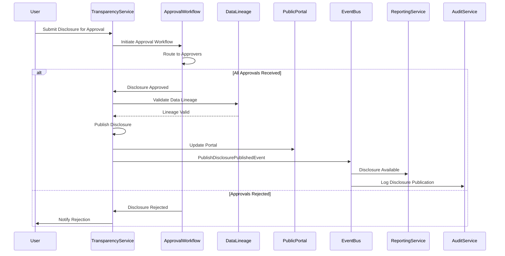
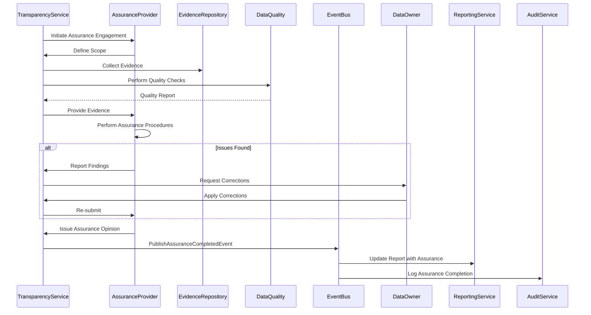

# Transparency Service Specification

## Service Overview

**Service Name**: Transparency Service (Disclosure & Transparency)
**Port**: 3039
**Phase**: 5 (Governance Domain - Transparency)
**Sprint**: 5.9-5.11 (Months 17-19)
**Story Points**: 30
**Dependencies**: Reporting (3044), All ESG Services (3011-3038), Audit (3007), Integration (3010)

### Business Purpose

The Transparency Service is the comprehensive platform for managing ESG disclosure quality, external assurance coordination, data lineage tracking, transparency scoring, and public disclosure portal management. This service enables organizations to:

- **Manage Disclosures**: Track all ESG disclosures across frameworks (GRI, SASB, TCFD, CDP, CSRD), manage approval workflows, version control
- **Coordinate External Assurance**: Manage assurance providers, scope definition, evidence collection, ISAE 3000/3410 compliance
- **Track Data Lineage**: Complete source-to-disclosure traceability, data quality metrics, audit trail
- **Score Transparency**: Calculate disclosure completeness, data quality, assurance coverage, transparency index
- **Provide Public Portal**: Interactive ESG data portal, download center, stakeholder feedback, access analytics
- **Analyze Gaps**: Required vs. actual disclosures, materiality-based prioritization, roadmap to full disclosure
- **Ensure Compliance**: CSRD Article 8, SEC climate disclosure, EU Taxonomy Article 8, mandatory assurance

### Key Business Capabilities

1. **Disclosure Management**: Disclosure inventory, status tracking, multi-framework mapping, approval workflow, version control
2. **External Assurance**: Provider management, scope definition, evidence collection, ISAE 3000/3410 compliance, assurance opinions
3. **Data Quality & Lineage**: Source tracking, lineage visualization, quality metrics, validation rules, audit trail
4. **Transparency Scoring**: Completeness scoring, data quality assessment, assurance coverage, transparency index
5. **Public Portal**: Public ESG data portal, interactive explorer, download center, stakeholder feedback, access analytics
6. **Gap Analysis**: Required vs. actual, materiality prioritization, data availability, improvement roadmap
7. **Regulatory Compliance**: CSRD compliance, SEC disclosure, EU Taxonomy, mandatory assurance tracking, filing deadlines

## Technical Architecture

### Service Design Patterns

```typescript
// Domain-Driven Design Structure
src/
├── domain/                          # Core business logic
│   ├── aggregates/
│   │   ├── disclosure/              # Disclosure inventory and tracking
│   │   ├── assurance-engagement/    # External assurance projects
│   │   ├── data-lineage/            # Source-to-disclosure traceability
│   │   ├── transparency-score/      # Transparency metrics and index
│   │   ├── disclosure-gap/          # Gap analysis and roadmap
│   │   ├── public-portal/           # Public disclosure portal
│   │   └── regulatory-filing/       # Regulatory compliance tracking
│   ├── entities/
│   ├── value-objects/
│   ├── events/
│   └── services/
├── application/                     # Use cases and orchestration
│   ├── commands/
│   ├── queries/
│   ├── sagas/
│   └── validators/
├── infrastructure/                  # External integrations
│   ├── persistence/
│   │   ├── mongodb/                 # Disclosure data, assurance
│   │   ├── neo4j/                   # Data lineage graph
│   │   ├── postgresql/              # Evidence documents (encrypted)
│   │   ├── influxdb/                # Time-series transparency scores
│   │   └── redis/                   # Caching public portal data
│   ├── messaging/
│   ├── integration/
│   │   ├── assurance-firms/         # PwC, EY, Deloitte, KPMG portals
│   │   ├── gri-database/            # GRI disclosure requirements
│   │   ├── cdp-platform/            # CDP submission
│   │   ├── xbrl-engine/             # XBRL taxonomy
│   │   └── cms-website/             # CMS integration for public portal
│   └── monitoring/
└── interfaces/                      # API layer
    ├── rest/
    ├── graphql/
    ├── public-api/                  # Public portal API (read-only)
    └── websocket/
```

### Technology Stack

- **Runtime**: Node.js 20 LTS with TypeScript 5.3
- **Framework**: NestJS 10.x with CQRS module
- **Databases**:
  - MongoDB 7.x (disclosure data, assurance)
  - Neo4j 5.x (data lineage graph)
  - PostgreSQL 16 (evidence documents - ENCRYPTED)
  - InfluxDB 2.7 (time-series transparency scores)
  - Redis 7.x (caching public portal data)
- **Messaging**: Apache Kafka 3.6 (EventBridge for AWS)
- **Caching**: Redis 7.x with clustering
- **API**: RESTful + GraphQL Federation + Public API (read-only)
- **Real-time**: Socket.io for transparency score updates
- **Documentation**: OpenAPI 3.1 + AsyncAPI 2.6

## Data Architecture

### Core Data Models

#### 1. Disclosure Record

```typescript
interface DisclosureRecord {
  id: string;
  disclosureId: string;
  organizationId: string;

  // Disclosure Information
  disclosure: {
    title: string;
    description: string;
    disclosureType: string; // METRIC, NARRATIVE, TABLE, CHART
    category: string; // ENVIRONMENTAL, SOCIAL, GOVERNANCE
    subcategory: string; // CARBON, WATER, DIVERSITY, BOARD, etc.
  };

  // Framework Mapping
  frameworks: [{
    framework: string; // GRI, SASB, TCFD, CDP, CSRD, IFRS_S1_S2
    disclosureCode: string; // e.g., "GRI 305-1", "SASB IF-EU-110a.1"
    disclosureTitle: string;
    mandatory: boolean;
    materialTopic: boolean;
    requiresAssurance: boolean; // CSRD mandatory assurance
  }];

  // Data Sources
  dataSources: [{
    sourceType: string; // MANUAL, IOT, ERP, THIRD_PARTY, CALCULATED
    sourceSystem: string;
    sourceId: string;
    dataLineageId: string; // Link to data lineage graph
    lastUpdated: Date;
    dataQualityScore: number; // 0-100
  }];

  // Disclosure Status
  status: {
    currentStatus: string; // DRAFT, PENDING_REVIEW, APPROVED, PUBLISHED, ARCHIVED
    workflowStage: string;
    assignedTo: string;
    dueDate: Date;
    lastUpdated: Date;
    updatedBy: string;
  };

  // Approval Workflow
  approvalWorkflow: [{
    approverRole: string; // DATA_OWNER, COMPLIANCE_OFFICER, EXECUTIVE, BOARD
    approverId: string;
    approverName: string;
    approvalStatus: string; // PENDING, APPROVED, REJECTED
    approvalDate?: Date;
    comments?: string;
    version: number;
  }];

  // Version Control
  versionControl: {
    currentVersion: number;
    publishedVersion?: number;
    changeHistory: [{
      version: number;
      changeDate: Date;
      changedBy: string;
      changeType: string; // CREATED, UPDATED, APPROVED, PUBLISHED
      changes: string;
      previousValue?: any;
      newValue?: any;
    }];
  };

  // Disclosure Content
  content: {
    metricValue?: number;
    metricUnit?: string;
    narrativeText?: string;
    tableData?: any;
    chartData?: any;
    attachments?: string[];
    footnotes?: string[];
    methodology?: string;
    assumptions?: string[];
    limitations?: string[];
  };

  // Data Quality
  dataQuality: {
    completeness: number; // 0-100
    accuracy: number;
    consistency: number;
    timeliness: number;
    overallScore: number;
    issues: [{
      issueType: string;
      description: string;
      severity: string; // LOW, MEDIUM, HIGH, CRITICAL
      detectedDate: Date;
      resolvedDate?: Date;
      resolution?: string;
    }];
  };

  // Assurance
  assurance: {
    assuranceRequired: boolean;
    assuranceLevel?: string; // LIMITED, REASONABLE
    assuranceEngagementId?: string;
    assuranceStatus?: string; // PENDING, IN_PROGRESS, COMPLETED
    assuranceOpinion?: string; // UNMODIFIED, MODIFIED, ADVERSE, DISCLAIMER
    assuranceDate?: Date;
    assuranceProvider?: string;
    evidenceDocuments?: string[];
  };

  // Public Disclosure
  publicDisclosure: {
    publiclyAvailable: boolean;
    publishedDate?: Date;
    publishedToPortal: boolean;
    portalUrl?: string;
    downloadFormats: string[]; // PDF, EXCEL, XML, XBRL
    viewCount: number;
    downloadCount: number;
  };

  // Regulatory Filing
  regulatoryFiling: {
    filedWithRegulator: boolean;
    regulators: string[]; // SEC, EBA, NCAs, etc.
    filingType: string; // ANNUAL_REPORT, SUSTAINABILITY_REPORT, CLIMATE_DISCLOSURE
    filingDate?: Date;
    filingReference?: string;
    confirmationNumber?: string;
  };

  // Metadata
  metadata: {
    createdAt: Date;
    createdBy: string;
    updatedAt: Date;
    updatedBy: string;
    tags: string[];
    confidential: boolean;
    retentionPeriod: number; // Years
  };
}
```

#### 2. Disclosure Framework Mapping

```typescript
interface DisclosureFrameworkMapping {
  id: string;
  organizationId: string;

  // Framework Information
  framework: {
    name: string; // GRI, SASB, TCFD, CDP, CSRD, IFRS_S1_S2
    version: string;
    effectiveDate: Date;
    sector?: string; // SASB sector
    industry?: string; // SASB industry
  };

  // Disclosure Requirements
  requirements: [{
    disclosureCode: string;
    disclosureTitle: string;
    category: string;
    mandatory: boolean;
    conditionalRequirement?: string;
    requiresAssurance: boolean;
    assuranceLevel?: string; // LIMITED, REASONABLE
    description: string;
    guidance: string;
    examples?: string[];
  }];

  // Materiality Assessment
  materiality: {
    materialityAssessmentId: string;
    materialTopics: string[];
    disclosuresByTopic: [{
      topic: string;
      requiredDisclosures: string[];
      optionalDisclosures: string[];
    }];
  };

  // Cross-Framework Mapping
  crossMapping: [{
    targetFramework: string;
    targetDisclosureCode: string;
    mappingType: string; // EQUIVALENT, PARTIAL, RELATED
    mappingNotes: string;
  }];

  // Disclosure Inventory
  inventory: [{
    disclosureCode: string;
    implemented: boolean;
    implementationStatus: string; // NOT_STARTED, IN_PROGRESS, COMPLETE
    disclosureRecordId?: string;
    completenessScore: number; // 0-100
    lastUpdated: Date;
  }];

  // Metadata
  metadata: {
    createdAt: Date;
    createdBy: string;
    updatedAt: Date;
    updatedBy: string;
  };
}
```

#### 3. Assurance Engagement

```typescript
interface AssuranceEngagement {
  id: string;
  engagementId: string;
  organizationId: string;

  // Engagement Information
  engagement: {
    name: string;
    description: string;
    engagementType: string; // SUSTAINABILITY_ASSURANCE, GHG_ASSURANCE, CSRD_ASSURANCE
    reportingPeriod: {
      startDate: Date;
      endDate: Date;
      fiscalYear: number;
    };
    status: string; // PLANNED, SCOPING, FIELDWORK, REPORTING, COMPLETED
  };

  // Assurance Provider
  provider: {
    firmName: string; // PwC, EY, Deloitte, KPMG, Grant Thornton, etc.
    firmType: string; // BIG_4, REGIONAL, SPECIALIST
    leadPartner: string;
    teamMembers: [{
      name: string;
      role: string;
      qualifications: string[];
    }];
    contactEmail: string;
    contactPhone: string;
  };

  // Assurance Scope
  scope: {
    assuranceLevel: string; // LIMITED, REASONABLE
    assuranceStandard: string; // ISAE_3000, ISAE_3410, AA1000AS
    subjectMatter: string[];
    frameworks: string[]; // GRI, CSRD, TCFD, etc.
    disclosuresInScope: string[];
    disclosuresExcluded: string[];
    scopeRationale: string;
    materiality: {
      qualitativeMateriality: string;
      quantitativeMateriality?: number;
      currency?: string;
    };
  };

  // CSRD Mandatory Assurance
  csrdAssurance: {
    applicable: boolean;
    assuranceLevel: string; // LIMITED (2024-2028), REASONABLE (2029+)
    esrsDisclosuresInScope: string[];
    taxonomyAlignment: boolean;
    valuChainDisclosures: boolean;
    transitionPlan: boolean;
  };

  // Evidence Collection
  evidenceCollection: {
    totalEvidenceItems: number;
    evidenceDocuments: [{
      documentId: string;
      documentName: string;
      documentType: string; // INVOICE, METER_DATA, CALCULATION, REPORT, CERTIFICATE
      relatedDisclosure: string;
      uploadedDate: Date;
      uploadedBy: string;
      reviewedByAssurer: boolean;
      reviewDate?: Date;
      reviewNotes?: string;
      storageLocation: string; // PostgreSQL encrypted
      hash: string; // For integrity verification
    }];
  };

  // Assurance Procedures
  procedures: [{
    procedureId: string;
    procedureType: string; // INQUIRY, OBSERVATION, INSPECTION, ANALYTICAL_PROCEDURE, RECALCULATION
    description: string;
    relatedDisclosure: string;
    status: string; // PLANNED, IN_PROGRESS, COMPLETED
    performedBy: string;
    performedDate?: Date;
    findings: string;
    issues?: string[];
  }];

  // Findings and Issues
  findings: [{
    findingId: string;
    findingType: string; // CONTROL_DEFICIENCY, DATA_QUALITY_ISSUE, DISCLOSURE_GAP, MISSTATEMENT
    severity: string; // LOW, MEDIUM, HIGH, MATERIAL
    description: string;
    disclosureAffected: string;
    detectedDate: Date;
    managementResponse: string;
    correctionRequired: boolean;
    correctionCompleted: boolean;
    correctionDate?: Date;
    impactOnOpinion: string; // NONE, MODIFIED_OPINION, ADVERSE_OPINION
  }];

  // Assurance Opinion
  opinion: {
    opinionType: string; // UNMODIFIED, MODIFIED, ADVERSE, DISCLAIMER
    opinionDate: Date;
    opinionStatement: string;
    basisForOpinion: string;
    emphasesOfMatter?: string[];
    otherMatters?: string[];
    reportUrl: string;
    reportPublished: boolean;
    reportPublishedDate?: Date;
  };

  // Timeline
  timeline: {
    kickoffDate: Date;
    scopingCompletedDate?: Date;
    fieldworkStartDate?: Date;
    fieldworkEndDate?: Date;
    draftReportDate?: Date;
    finalReportDate?: Date;
    publicationDate?: Date;
  };

  // Costs
  costs: {
    estimatedCost: number;
    actualCost?: number;
    currency: string;
    paymentSchedule: [{
      milestone: string;
      amount: number;
      dueDate: Date;
      paidDate?: Date;
    }];
  };

  // Metadata
  metadata: {
    createdAt: Date;
    createdBy: string;
    updatedAt: Date;
    updatedBy: string;
  };
}
```

#### 4. Data Lineage

```typescript
interface DataLineage {
  id: string;
  lineageId: string;
  organizationId: string;

  // Lineage Information
  lineage: {
    disclosureId: string;
    disclosureCode: string; // e.g., "GRI 305-1"
    disclosureTitle: string;
    metricName: string;
  };

  // Source Information
  sources: [{
    sourceId: string;
    sourceType: string; // MANUAL, IOT, ERP, THIRD_PARTY, CALCULATED
    sourceSystem: string; // SAP, Oracle, IoT_Platform, Utility_Provider, etc.
    sourceDescription: string;
    dataOwner: string;
    extractionMethod: string; // API, FILE_UPLOAD, MANUAL_ENTRY, DATABASE_QUERY
    extractionFrequency: string; // REAL_TIME, HOURLY, DAILY, MONTHLY
    lastExtractedDate: Date;
    nextExtractionDate: Date;
  }];

  // Transformation Steps
  transformations: [{
    transformationId: string;
    transformationStep: number;
    transformationType: string; // UNIT_CONVERSION, AGGREGATION, CALCULATION, NORMALIZATION
    transformationLogic: string;
    inputData: string;
    outputData: string;
    performedBy: string; // SYSTEM, USER
    performedDate: Date;
    validationPerformed: boolean;
    validationResult?: string;
  }];

  // Calculation Logic
  calculations: [{
    calculationId: string;
    formula: string;
    inputs: [{
      inputName: string;
      inputValue: number;
      inputUnit: string;
      inputSource: string;
    }];
    emissionFactor?: {
      factorName: string;
      factorValue: number;
      factorUnit: string;
      factorSource: string;
      factorVersion: string;
      factorYear: number;
    };
    result: {
      value: number;
      unit: string;
      calculationDate: Date;
      calculatedBy: string;
    };
    uncertaintyAnalysis?: {
      uncertaintyRange: string; // e.g., "±5%"
      confidenceLevel: number; // e.g., 95
      sensitivityFactors: string[];
    };
  }];

  // Data Quality Checks
  qualityChecks: [{
    checkId: string;
    checkType: string; // RANGE_CHECK, CONSISTENCY_CHECK, COMPLETENESS_CHECK, ACCURACY_CHECK
    checkDescription: string;
    checkDate: Date;
    checkResult: string; // PASSED, FAILED, WARNING
    checkDetails: string;
    correctionRequired: boolean;
    correctionApplied?: boolean;
    correctionDate?: Date;
  }];

  // Audit Trail
  auditTrail: [{
    timestamp: Date;
    action: string; // DATA_EXTRACTED, DATA_TRANSFORMED, DATA_VALIDATED, DATA_APPROVED
    performedBy: string;
    details: string;
    beforeValue?: any;
    afterValue?: any;
    approvalRequired: boolean;
    approvedBy?: string;
    approvalDate?: Date;
  }];

  // Lineage Graph
  lineageGraph: {
    nodes: [{
      nodeId: string;
      nodeType: string; // SOURCE, TRANSFORMATION, DISCLOSURE
      nodeName: string;
      nodeAttributes: any;
    }];
    edges: [{
      edgeId: string;
      fromNodeId: string;
      toNodeId: string;
      edgeType: string; // INPUT, OUTPUT, DEPENDS_ON
      edgeAttributes: any;
    }];
  };

  // Metadata
  metadata: {
    createdAt: Date;
    createdBy: string;
    updatedAt: Date;
    updatedBy: string;
    version: number;
  };
}
```

#### 5. Transparency Score

```typescript
interface TransparencyScore {
  id: string;
  organizationId: string;

  // Reporting Period
  period: {
    startDate: Date;
    endDate: Date;
    fiscalYear: number;
    quarter?: string;
  };

  // Disclosure Completeness
  completeness: {
    // By Framework
    byFramework: [{
      framework: string; // GRI, SASB, TCFD, CDP, CSRD
      totalRequiredDisclosures: number;
      implementedDisclosures: number;
      completenessScore: number; // 0-100
      mandatoryDisclosures: {
        total: number;
        implemented: number;
        completenessScore: number;
      };
      materialDisclosures: {
        total: number;
        implemented: number;
        completenessScore: number;
      };
    }];

    // Overall Completeness
    overallCompletenessScore: number; // 0-100
    totalDisclosures: number;
    implementedDisclosures: number;
    missingDisclosures: number;
    missingDisclosuresList: string[];
  };

  // Data Quality Score
  dataQuality: {
    // Quality Dimensions
    completeness: number; // 0-100
    accuracy: number;
    consistency: number;
    timeliness: number;
    reliability: number;

    // Overall Data Quality
    overallDataQuality: number; // 0-100

    // Quality Issues
    totalIssues: number;
    criticalIssues: number;
    highIssues: number;
    mediumIssues: number;
    lowIssues: number;
    resolvedIssues: number;
    unresolvedIssues: number;

    // Data Lineage Coverage
    dataLineageCoverage: number; // Percentage of disclosures with data lineage
  };

  // Assurance Coverage
  assuranceCoverage: {
    // Assurance Scope
    totalDisclosures: number;
    disclosuresWithAssurance: number;
    assuranceCoverageScore: number; // 0-100

    // Assurance Level
    limitedAssurance: number;
    reasonableAssurance: number;

    // Assurance by Category
    byCategory: [{
      category: string; // ENVIRONMENTAL, SOCIAL, GOVERNANCE
      totalDisclosures: number;
      assuredDisclosures: number;
      coverageScore: number;
    }];

    // CSRD Mandatory Assurance
    csrdMandatoryAssurance: {
      applicable: boolean;
      compliant: boolean;
      esrsDisclosuresAssured: number;
      totalEsrsDisclosures: number;
      complianceScore: number;
    };
  };

  // Transparency Index
  transparencyIndex: {
    // Component Scores (weighted)
    completenessScore: number; // 40% weight
    dataQualityScore: number; // 30% weight
    assuranceCoverageScore: number; // 20% weight
    timelinessScore: number; // 10% weight

    // Overall Transparency Index
    overallTransparencyIndex: number; // 0-100

    // Rating
    rating: string; // EXCELLENT (90-100), GOOD (75-89), FAIR (60-74), POOR (<60)
    previousRating?: string;
    ratingChange?: string; // IMPROVED, DECLINED, STABLE
  };

  // Timeliness
  timeliness: {
    disclosuresPublishedOnTime: number;
    disclosuresPublishedLate: number;
    averageDaysToPublish: number;
    timelinessScore: number; // 0-100
  };

  // Peer Comparison
  peerBenchmarking: {
    sector: string;
    industry: string;
    companySize: string; // SMALL, MEDIUM, LARGE
    peerGroupSize: number;
    percentileRanking: number; // 0-100 (100 = top performer)
    aboveMedian: boolean;
    aboveAverage: boolean;
    topQuartile: boolean;
    peerAverageTransparencyIndex: number;
    peerMedianTransparencyIndex: number;
  };

  // Improvement Recommendations
  recommendations: [{
    priority: string; // HIGH, MEDIUM, LOW
    area: string; // COMPLETENESS, DATA_QUALITY, ASSURANCE
    recommendation: string;
    estimatedImpact: number; // Impact on transparency index
    estimatedEffort: string; // LOW, MEDIUM, HIGH
    targetDate: Date;
    status: string; // NOT_STARTED, IN_PROGRESS, COMPLETED
  }];

  // Trends
  trends: {
    completenessChange: number; // Percentage change vs previous period
    dataQualityChange: number;
    assuranceCoverageChange: number;
    transparencyIndexChange: number;
    trajectory: string; // IMPROVING, DECLINING, STABLE
  };

  // Metadata
  metadata: {
    calculatedAt: Date;
    calculatedBy: string;
    version: number;
  };
}
```

#### 6. Disclosure Gap Analysis

```typescript
interface DisclosureGapAnalysis {
  id: string;
  organizationId: string;

  // Analysis Information
  analysis: {
    analysisDate: Date;
    analysisScope: string; // ALL_FRAMEWORKS, SPECIFIC_FRAMEWORK, MATERIAL_TOPICS
    frameworks: string[];
    reportingPeriod: {
      startDate: Date;
      endDate: Date;
      fiscalYear: number;
    };
  };

  // Materiality Context
  materiality: {
    materialityAssessmentId: string;
    materialTopics: string[];
    doubleMateriality: {
      impactMateriality: string[];
      financialMateriality: string[];
    };
  };

  // Required Disclosures
  requiredDisclosures: [{
    framework: string;
    disclosureCode: string;
    disclosureTitle: string;
    category: string;
    materialityRationale: string;
    mandatory: boolean;
    requiresAssurance: boolean;
    regulatoryDeadline?: Date;
  }];

  // Actual Disclosures
  actualDisclosures: [{
    disclosureCode: string;
    implemented: boolean;
    implementationStatus: string; // COMPLETE, PARTIAL, NOT_STARTED
    completenessPercentage: number;
    dataAvailability: string; // AVAILABLE, PARTIAL, NOT_AVAILABLE
    lastUpdated?: Date;
  }];

  // Gaps Identified
  gaps: [{
    gapId: string;
    disclosureCode: string;
    disclosureTitle: string;
    framework: string;
    gapType: string; // MISSING_DISCLOSURE, INCOMPLETE_DATA, DATA_QUALITY, ASSURANCE_GAP
    gapSeverity: string; // CRITICAL, HIGH, MEDIUM, LOW
    materialTopic: boolean;
    mandatoryDisclosure: boolean;
    regulatoryImpact: boolean;
    stakeholderPriority: string; // HIGH, MEDIUM, LOW

    // Gap Details
    currentState: string;
    desiredState: string;
    rootCause: string[];

    // Data Availability
    dataAvailable: boolean;
    dataSource?: string;
    dataCollectionEffort: string; // LOW, MEDIUM, HIGH
    dataQualityLevel?: string;

    // Closure Plan
    closurePlan: {
      action: string;
      owner: string;
      startDate: Date;
      targetDate: Date;
      estimatedEffort: string;
      estimatedCost?: number;
      dependencies: string[];
      milestones: [{
        milestone: string;
        dueDate: Date;
        status: string; // NOT_STARTED, IN_PROGRESS, COMPLETED
      }];
    };

    // Status
    status: string; // IDENTIFIED, PLANNED, IN_PROGRESS, COMPLETED, DEFERRED
    completedDate?: Date;
    deferredReason?: string;
  }];

  // Gap Summary
  summary: {
    totalGaps: number;
    criticalGaps: number;
    highPriorityGaps: number;
    mediumPriorityGaps: number;
    lowPriorityGaps: number;
    closedGaps: number;
    openGaps: number;

    // By Framework
    gapsByFramework: [{
      framework: string;
      totalGaps: number;
      closedGaps: number;
      openGaps: number;
    }];

    // By Category
    gapsByCategory: [{
      category: string;
      totalGaps: number;
      closedGaps: number;
      openGaps: number;
    }];
  };

  // Roadmap
  roadmap: {
    phases: [{
      phaseName: string;
      startDate: Date;
      endDate: Date;
      gapsAddressed: string[];
      deliverables: string[];
      resources: string[];
      budget?: number;
      status: string; // PLANNED, IN_PROGRESS, COMPLETED
    }];

    // Milestones
    milestones: [{
      milestone: string;
      dueDate: Date;
      completionCriteria: string;
      status: string;
      completedDate?: Date;
    }];
  };

  // Metadata
  metadata: {
    createdAt: Date;
    createdBy: string;
    updatedAt: Date;
    updatedBy: string;
    version: number;
  };
}
```

#### 7. Public Disclosure Portal

```typescript
interface PublicDisclosurePortal {
  id: string;
  organizationId: string;

  // Portal Configuration
  configuration: {
    portalName: string;
    portalUrl: string;
    enabled: boolean;
    publicLaunchDate: Date;
    lastUpdated: Date;
    theme: {
      primaryColor: string;
      logo: string;
      bannerImage: string;
    };
    languages: string[]; // EN, ES, FR, DE, etc.
    defaultLanguage: string;
  };

  // Published Disclosures
  publishedDisclosures: [{
    disclosureId: string;
    disclosureCode: string;
    disclosureTitle: string;
    category: string;
    framework: string[];
    publishedDate: Date;
    lastUpdated: Date;
    version: number;
    status: string; // PUBLISHED, ARCHIVED

    // Content
    content: {
      summary: string;
      detailedData: any;
      methodology: string;
      assumptions: string[];
      limitations: string[];
      footnotes: string[];
    };

    // Downloadable Formats
    downloadFormats: [{
      format: string; // PDF, EXCEL, XML, XBRL
      fileUrl: string;
      fileSize: number; // Bytes
      generatedDate: Date;
    }];

    // Metadata
    metadata: {
      tags: string[];
      keywords: string[];
    };
  }];

  // Interactive Data Explorer
  dataExplorer: {
    enabled: boolean;
    features: {
      chartVisualization: boolean;
      dataFiltering: boolean;
      dataComparison: boolean; // Compare across years
      dataDownload: boolean;
      dataExport: boolean;
    };
    chartTypes: string[]; // LINE, BAR, PIE, SCATTER, HEATMAP
  };

  // Download Center
  downloadCenter: {
    enabled: boolean;
    reports: [{
      reportType: string; // ANNUAL_REPORT, SUSTAINABILITY_REPORT, CLIMATE_DISCLOSURE, GRI_REPORT, etc.
      reportTitle: string;
      reportYear: number;
      reportDate: Date;
      reportUrl: string;
      reportSize: number;
      reportFormat: string; // PDF, INTERACTIVE_HTML
      downloadCount: number;
      lastDownloadedDate?: Date;
    }];
  };

  // Stakeholder Feedback
  stakeholderFeedback: {
    enabled: boolean;
    feedbackForm: {
      fields: string[]; // NAME, EMAIL, ORGANIZATION, TOPIC, MESSAGE
      captchaEnabled: boolean;
      notificationEmail: string;
    };
    feedback: [{
      feedbackId: string;
      submittedDate: Date;
      submitterName: string;
      submitterEmail: string;
      submitterOrganization?: string;
      topic: string;
      message: string;
      status: string; // NEW, REVIEWED, RESPONDED, CLOSED
      response?: string;
      respondedDate?: Date;
      respondedBy?: string;
    }];
  };

  // Access Analytics
  analytics: {
    // Page Views
    pageViews: {
      totalViews: number;
      uniqueVisitors: number;
      averageSessionDuration: number; // Seconds
      bounceRate: number; // Percentage
      topPages: [{
        page: string;
        views: number;
      }];
    };

    // Downloads
    downloads: {
      totalDownloads: number;
      topDownloads: [{
        document: string;
        downloads: number;
      }];
      downloadsByFormat: [{
        format: string;
        downloads: number;
      }];
    };

    // Geographic Distribution
    geographicDistribution: [{
      country: string;
      region?: string;
      visitors: number;
      views: number;
    }];

    // Visitor Demographics
    visitorDemographics: {
      visitorTypes: [{
        type: string; // INVESTOR, ANALYST, NGO, MEDIA, ACADEMIC, CUSTOMER, EMPLOYEE
        percentage: number;
      }];
      organizationTypes: [{
        type: string; // INSTITUTIONAL_INVESTOR, ASSET_MANAGER, RATING_AGENCY, NGO, etc.
        percentage: number;
      }];
    };

    // Time-Series Data
    timeSeries: [{
      date: Date;
      views: number;
      downloads: number;
      visitors: number;
    }];
  };

  // SEO & Discoverability
  seo: {
    metaTags: {
      title: string;
      description: string;
      keywords: string[];
    };
    structuredData: any; // Schema.org JSON-LD
    sitemap: string; // URL to XML sitemap
    robotsTxt: string;
  };

  // Accessibility
  accessibility: {
    wcagCompliance: string; // WCAG_2.1_AA, WCAG_2.1_AAA
    screenReaderSupport: boolean;
    keyboardNavigation: boolean;
    altTextForImages: boolean;
    accessibilityStatement: string;
  };

  // Metadata
  metadata: {
    createdAt: Date;
    createdBy: string;
    updatedAt: Date;
    updatedBy: string;
    version: number;
  };
}
```

#### 8. Regulatory Filing

```typescript
interface RegulatoryFiling {
  id: string;
  filingId: string;
  organizationId: string;

  // Filing Information
  filing: {
    filingType: string; // CSRD_SUSTAINABILITY_STATEMENT, SEC_CLIMATE_DISCLOSURE, EU_TAXONOMY_ARTICLE_8
    filingName: string;
    reportingPeriod: {
      startDate: Date;
      endDate: Date;
      fiscalYear: number;
    };
    status: string; // DRAFT, PENDING_REVIEW, APPROVED, SUBMITTED, ACCEPTED, REJECTED
  };

  // Regulatory Authority
  regulator: {
    name: string; // SEC, EBA, National Competent Authority (NCA)
    country: string;
    filingPortal: string; // EDGAR, EBA Portal, National Filing System
    contactEmail: string;
  };

  // CSRD Article 8 Compliance
  csrdArticle8: {
    applicable: boolean;
    esrsDisclosures: [{
      esrsCode: string; // ESRS E1, ESRS S1, etc.
      disclosureTitle: string;
      implemented: boolean;
      completeness: number; // 0-100
      assuranceLevel: string; // LIMITED, REASONABLE
      assuranceOpinion?: string;
    }];
    digitalTagging: {
      xbrlCompliant: boolean;
      taxonomyVersion: string;
      taggingCompleteness: number; // Percentage
      validationErrors: number;
    };
    publishedInAnnualReport: boolean;
    publishedOnWebsite: boolean;
    websiteUrl?: string;
  };

  // SEC Climate Disclosure
  secClimateDisclosure: {
    applicable: boolean;
    regulation: string; // S-K_Item_1502, S-K_Item_1503, S-K_Item_1504
    disclosures: [{
      item: string;
      description: string;
      implemented: boolean;
      filedIn: string; // 10-K, 10-Q, 8-K
    }];
    scope3Disclosure: {
      required: boolean;
      disclosed: boolean;
      categories: number[];
    };
    attestationRequired: boolean;
    attestationProvider?: string;
  };

  // EU Taxonomy Article 8
  euTaxonomyArticle8: {
    applicable: boolean;
    reportingYear: number;
    eligibilityAssessment: {
      eligibleActivities: boolean;
      eligibilityPercentage: number;
      alignedActivities: boolean;
      alignmentPercentage: number;
    };
    kpis: {
      turnoverEligible: number;
      turnoverAligned: number;
      capexEligible: number;
      capexAligned: number;
      opexEligible: number;
      opexAligned: number;
    };
    substantialContribution: string[];
    dnsh: boolean; // Do No Significant Harm
    minimumSafeguards: boolean;
  };

  // Filing Deadlines
  deadlines: {
    internalDeadline: Date;
    regulatoryDeadline: Date;
    extensionRequested: boolean;
    extensionGranted: boolean;
    extendedDeadline?: Date;
    submittedDate?: Date;
    acceptedDate?: Date;
  };

  // Document Package
  documents: [{
    documentType: string; // SUSTAINABILITY_STATEMENT, ASSURANCE_REPORT, CLIMATE_DISCLOSURE
    documentName: string;
    documentFormat: string; // PDF, XBRL, XML
    documentUrl: string;
    documentSize: number;
    documentHash: string; // For integrity verification
    uploadedDate: Date;
    uploadedBy: string;
  }];

  // Validation
  validation: {
    validationPerformed: boolean;
    validationDate?: Date;
    validationTool: string;
    validationErrors: number;
    validationWarnings: number;
    validationPassed: boolean;
    validationReport?: string;
  };

  // Submission
  submission: {
    submittedDate?: Date;
    submittedBy: string;
    submissionMethod: string; // PORTAL_UPLOAD, API, EMAIL
    confirmationNumber?: string;
    submissionReceipt?: string;
    acceptanceStatus: string; // PENDING, ACCEPTED, REJECTED
    acceptanceDate?: Date;
    rejectionReason?: string;
  };

  // Public Availability
  publicAvailability: {
    publiclyAvailable: boolean;
    publicationDate?: Date;
    publicationUrl?: string;
    indexedByRegulator: boolean;
    indexedDate?: Date;
  };

  // Metadata
  metadata: {
    createdAt: Date;
    createdBy: string;
    updatedAt: Date;
    updatedBy: string;
    version: number;
  };
}
```

#### 9. Data Quality Metrics

```typescript
interface DataQualityMetrics {
  id: string;
  organizationId: string;

  // Assessment Period
  period: {
    startDate: Date;
    endDate: Date;
    fiscalYear: number;
  };

  // Overall Data Quality
  overallQuality: {
    qualityScore: number; // 0-100
    qualityRating: string; // EXCELLENT, GOOD, FAIR, POOR
    previousScore?: number;
    scoreChange?: number;
    trend: string; // IMPROVING, DECLINING, STABLE
  };

  // Dimension Scores
  dimensions: {
    completeness: {
      score: number; // 0-100
      totalDataPoints: number;
      completeDataPoints: number;
      missingDataPoints: number;
      missingDataPointsList: string[];
    };
    accuracy: {
      score: number;
      totalDataPoints: number;
      accurateDataPoints: number;
      inaccurateDataPoints: number;
      accuracyErrors: [{
        dataPoint: string;
        expectedValue: any;
        actualValue: any;
        deviation: number;
        severity: string; // LOW, MEDIUM, HIGH, CRITICAL
      }];
    };
    consistency: {
      score: number;
      totalChecks: number;
      consistentChecks: number;
      inconsistentChecks: number;
      inconsistencies: [{
        checkType: string;
        description: string;
        dataPoints: string[];
        severity: string;
      }];
    };
    timeliness: {
      score: number;
      totalDataPoints: number;
      timelyDataPoints: number;
      lateDataPoints: number;
      averageDelayDays: number;
      lateDataPointsList: [{
        dataPoint: string;
        expectedDate: Date;
        actualDate: Date;
        delayDays: number;
      }];
    };
    validity: {
      score: number;
      totalDataPoints: number;
      validDataPoints: number;
      invalidDataPoints: number;
      validationFailures: [{
        dataPoint: string;
        validationRule: string;
        value: any;
        reason: string;
      }];
    };
  };

  // Data Quality Issues
  issues: [{
    issueId: string;
    issueType: string; // COMPLETENESS, ACCURACY, CONSISTENCY, TIMELINESS, VALIDITY
    severity: string; // CRITICAL, HIGH, MEDIUM, LOW
    description: string;
    dataPoint: string;
    disclosureAffected: string;
    detectedDate: Date;
    detectedBy: string; // SYSTEM, AUDITOR, ASSURER, USER
    status: string; // OPEN, IN_PROGRESS, RESOLVED, CLOSED
    assignedTo?: string;
    rootCause?: string;
    correctionRequired: boolean;
    correctionApplied?: boolean;
    correctionDate?: Date;
    resolution?: string;
    preventiveActions?: string[];
  }];

  // Issue Summary
  issueSummary: {
    totalIssues: number;
    criticalIssues: number;
    highIssues: number;
    mediumIssues: number;
    lowIssues: number;
    openIssues: number;
    resolvedIssues: number;
    averageResolutionTime: number; // Days
  };

  // Data Source Quality
  dataSourceQuality: [{
    sourceType: string; // MANUAL, IOT, ERP, THIRD_PARTY
    sourceSystem: string;
    qualityScore: number;
    issues: number;
    reliability: string; // HIGH, MEDIUM, LOW
    recommendations: string[];
  }];

  // Metadata
  metadata: {
    assessedAt: Date;
    assessedBy: string;
    version: number;
  };
}
```

#### 10. Transparency Target

```typescript
interface TransparencyTarget {
  id: string;
  organizationId: string;

  // Target Information
  target: {
    targetName: string;
    description: string;
    targetYear: number;
    category: string; // COMPLETENESS, DATA_QUALITY, ASSURANCE_COVERAGE, TRANSPARENCY_INDEX
    targetValue: number;
    currentValue: number;
    baselineValue: number;
    baselineYear: number;
    progress: number; // Percentage
    status: string; // ON_TRACK, AT_RISK, OFF_TRACK, ACHIEVED
  };

  // Completeness Targets
  completenessTargets: [{
    framework: string;
    targetCompleteness: number; // Percentage
    currentCompleteness: number;
    gap: number;
    targetDate: Date;
  }];

  // Data Quality Targets
  dataQualityTargets: [{
    dimension: string; // COMPLETENESS, ACCURACY, CONSISTENCY, TIMELINESS
    targetScore: number;
    currentScore: number;
    gap: number;
    targetDate: Date;
  }];

  // Assurance Coverage Targets
  assuranceCoverageTargets: [{
    category: string; // ENVIRONMENTAL, SOCIAL, GOVERNANCE
    targetCoverage: number; // Percentage
    currentCoverage: number;
    gap: number;
    targetAssuranceLevel: string; // LIMITED, REASONABLE
    targetDate: Date;
  }];

  // Transparency Index Target
  transparencyIndexTarget: {
    targetIndex: number; // 0-100
    currentIndex: number;
    gap: number;
    targetRating: string; // EXCELLENT, GOOD
    currentRating: string;
    targetDate: Date;
  };

  // Milestones
  milestones: [{
    milestoneName: string;
    milestoneDate: Date;
    milestoneValue: number;
    achieved: boolean;
    achievedDate?: Date;
    delayDays?: number;
  }];

  // Action Plan
  actionPlan: [{
    actionId: string;
    action: string;
    owner: string;
    startDate: Date;
    targetDate: Date;
    status: string; // NOT_STARTED, IN_PROGRESS, COMPLETED, DELAYED
    completedDate?: Date;
    estimatedImpact: number; // Impact on target
    actualImpact?: number;
  }];

  // Metadata
  metadata: {
    createdAt: Date;
    createdBy: string;
    updatedAt: Date;
    updatedBy: string;
    version: number;
  };
}
```

## API Endpoints

### Disclosure Management

```typescript
// Disclosure CRUD Operations
POST   /api/v1/disclosures                    // Create new disclosure
GET    /api/v1/disclosures                    // List all disclosures
GET    /api/v1/disclosures/:id                // Get disclosure details
PUT    /api/v1/disclosures/:id                // Update disclosure
DELETE /api/v1/disclosures/:id                // Delete disclosure (draft only)

// Disclosure Workflow
POST   /api/v1/disclosures/:id/submit         // Submit for review
POST   /api/v1/disclosures/:id/approve        // Approve disclosure
POST   /api/v1/disclosures/:id/reject         // Reject disclosure
POST   /api/v1/disclosures/:id/publish        // Publish disclosure
POST   /api/v1/disclosures/:id/archive        // Archive disclosure

// Disclosure Search
GET    /api/v1/disclosures/search             // Search disclosures
GET    /api/v1/disclosures/framework/:framework // Get by framework (GRI, SASB, etc.)
GET    /api/v1/disclosures/category/:category // Get by category
GET    /api/v1/disclosures/status/:status     // Get by status

// Version Control
GET    /api/v1/disclosures/:id/versions       // Get version history
GET    /api/v1/disclosures/:id/versions/:version // Get specific version
POST   /api/v1/disclosures/:id/compare        // Compare versions

// Framework Mapping
GET    /api/v1/framework-mappings             // List framework mappings
GET    /api/v1/framework-mappings/:framework  // Get framework mapping
POST   /api/v1/framework-mappings             // Create framework mapping
PUT    /api/v1/framework-mappings/:id         // Update framework mapping
```

### External Assurance

```typescript
// Assurance Engagement CRUD
POST   /api/v1/assurance-engagements          // Create assurance engagement
GET    /api/v1/assurance-engagements          // List engagements
GET    /api/v1/assurance-engagements/:id      // Get engagement details
PUT    /api/v1/assurance-engagements/:id      // Update engagement
DELETE /api/v1/assurance-engagements/:id      // Delete engagement

// Assurance Workflow
POST   /api/v1/assurance-engagements/:id/scope // Define scope
POST   /api/v1/assurance-engagements/:id/evidence // Upload evidence
POST   /api/v1/assurance-engagements/:id/procedures // Add procedures
POST   /api/v1/assurance-engagements/:id/findings // Record findings
POST   /api/v1/assurance-engagements/:id/opinion // Record assurance opinion
POST   /api/v1/assurance-engagements/:id/complete // Complete engagement

// Evidence Management
POST   /api/v1/assurance-engagements/:id/evidence/upload // Upload evidence document
GET    /api/v1/assurance-engagements/:id/evidence // List evidence
GET    /api/v1/assurance-engagements/:id/evidence/:documentId // Get evidence document
DELETE /api/v1/assurance-engagements/:id/evidence/:documentId // Delete evidence

// Assurance Provider Management
POST   /api/v1/assurance-providers            // Add assurance provider
GET    /api/v1/assurance-providers            // List providers
GET    /api/v1/assurance-providers/:id        // Get provider details
PUT    /api/v1/assurance-providers/:id        // Update provider

// CSRD Mandatory Assurance
GET    /api/v1/assurance/csrd-compliance      // Check CSRD assurance compliance
POST   /api/v1/assurance/csrd-scope           // Define CSRD assurance scope
GET    /api/v1/assurance/csrd-status          // Get CSRD assurance status
```

### Data Lineage

```typescript
// Data Lineage CRUD
POST   /api/v1/data-lineage                   // Create data lineage
GET    /api/v1/data-lineage                   // List data lineage
GET    /api/v1/data-lineage/:id               // Get lineage details
PUT    /api/v1/data-lineage/:id               // Update lineage
DELETE /api/v1/data-lineage/:id               // Delete lineage

// Lineage Visualization
GET    /api/v1/data-lineage/:id/graph         // Get lineage graph
GET    /api/v1/data-lineage/:id/visualization // Get visualization data
GET    /api/v1/data-lineage/disclosure/:disclosureId // Get lineage for disclosure

// Lineage Tracking
POST   /api/v1/data-lineage/:id/sources       // Add data source
POST   /api/v1/data-lineage/:id/transformations // Add transformation step
POST   /api/v1/data-lineage/:id/calculations  // Add calculation
POST   /api/v1/data-lineage/:id/quality-check // Record quality check

// Audit Trail
GET    /api/v1/data-lineage/:id/audit-trail   // Get audit trail
GET    /api/v1/data-lineage/:id/changes       // Get change history
```

### Transparency Scoring

```typescript
// Transparency Score Calculation
POST   /api/v1/transparency-scores/calculate  // Calculate transparency score
GET    /api/v1/transparency-scores            // List transparency scores
GET    /api/v1/transparency-scores/current    // Get current score
GET    /api/v1/transparency-scores/:id        // Get score details
GET    /api/v1/transparency-scores/trends     // Get score trends

// Completeness Scoring
GET    /api/v1/transparency-scores/completeness // Get completeness score
GET    /api/v1/transparency-scores/completeness/framework/:framework // By framework

// Data Quality Scoring
GET    /api/v1/transparency-scores/data-quality // Get data quality score
GET    /api/v1/transparency-scores/data-quality/dimensions // By dimension

// Assurance Coverage Scoring
GET    /api/v1/transparency-scores/assurance-coverage // Get assurance coverage
GET    /api/v1/transparency-scores/assurance-coverage/category/:category // By category

// Transparency Index
GET    /api/v1/transparency-scores/transparency-index // Get transparency index
GET    /api/v1/transparency-scores/rating     // Get transparency rating

// Peer Benchmarking
GET    /api/v1/transparency-scores/benchmarking // Get peer benchmarking
GET    /api/v1/transparency-scores/peer-ranking // Get peer ranking
GET    /api/v1/transparency-scores/sector-comparison // Compare to sector

// Recommendations
GET    /api/v1/transparency-scores/recommendations // Get improvement recommendations
```

### Gap Analysis

```typescript
// Gap Analysis CRUD
POST   /api/v1/gap-analysis                   // Create gap analysis
GET    /api/v1/gap-analysis                   // List gap analyses
GET    /api/v1/gap-analysis/:id               // Get analysis details
PUT    /api/v1/gap-analysis/:id               // Update analysis
DELETE /api/v1/gap-analysis/:id               // Delete analysis

// Gap Identification
POST   /api/v1/gap-analysis/:id/identify-gaps // Identify gaps
GET    /api/v1/gap-analysis/:id/gaps          // List gaps
GET    /api/v1/gap-analysis/:id/gaps/:gapId   // Get gap details
PUT    /api/v1/gap-analysis/:id/gaps/:gapId   // Update gap

// Gap Prioritization
POST   /api/v1/gap-analysis/:id/prioritize    // Prioritize gaps
GET    /api/v1/gap-analysis/:id/critical-gaps // Get critical gaps
GET    /api/v1/gap-analysis/:id/high-priority // Get high priority gaps

// Closure Planning
POST   /api/v1/gap-analysis/:id/gaps/:gapId/closure-plan // Create closure plan
PUT    /api/v1/gap-analysis/:id/gaps/:gapId/closure-plan // Update plan
POST   /api/v1/gap-analysis/:id/gaps/:gapId/close // Mark gap as closed

// Roadmap
GET    /api/v1/gap-analysis/:id/roadmap       // Get closure roadmap
POST   /api/v1/gap-analysis/:id/roadmap       // Create roadmap
PUT    /api/v1/gap-analysis/:id/roadmap       // Update roadmap
GET    /api/v1/gap-analysis/:id/roadmap/milestones // Get milestones
```

### Public Disclosure Portal

```typescript
// Portal Configuration
GET    /api/v1/public-portal/config           // Get portal configuration
PUT    /api/v1/public-portal/config           // Update configuration
POST   /api/v1/public-portal/enable           // Enable portal
POST   /api/v1/public-portal/disable          // Disable portal

// Published Disclosures
GET    /api/v1/public-portal/disclosures      // List published disclosures
GET    /api/v1/public-portal/disclosures/:id  // Get published disclosure
POST   /api/v1/public-portal/disclosures/:id/publish // Publish disclosure
POST   /api/v1/public-portal/disclosures/:id/unpublish // Unpublish disclosure

// Download Center
GET    /api/v1/public-portal/downloads        // List downloadable reports
GET    /api/v1/public-portal/downloads/:id    // Download report
POST   /api/v1/public-portal/downloads/:id/track // Track download

// Stakeholder Feedback
POST   /api/v1/public-portal/feedback         // Submit feedback (public API)
GET    /api/v1/public-portal/feedback         // List feedback (internal)
GET    /api/v1/public-portal/feedback/:id     // Get feedback details
PUT    /api/v1/public-portal/feedback/:id     // Update feedback status
POST   /api/v1/public-portal/feedback/:id/respond // Respond to feedback

// Analytics
GET    /api/v1/public-portal/analytics        // Get portal analytics
GET    /api/v1/public-portal/analytics/page-views // Get page views
GET    /api/v1/public-portal/analytics/downloads // Get download stats
GET    /api/v1/public-portal/analytics/geographic // Get geographic distribution
GET    /api/v1/public-portal/analytics/demographics // Get visitor demographics
GET    /api/v1/public-portal/analytics/trends // Get time-series trends

// Public API (Read-Only)
GET    /public-api/v1/disclosures             // List public disclosures (no auth)
GET    /public-api/v1/disclosures/:id         // Get public disclosure (no auth)
GET    /public-api/v1/reports                 // List public reports (no auth)
GET    /public-api/v1/reports/:id             // Download public report (no auth)
```

### Data Quality

```typescript
// Data Quality Assessment
POST   /api/v1/data-quality/assess            // Perform data quality assessment
GET    /api/v1/data-quality/metrics           // Get data quality metrics
GET    /api/v1/data-quality/metrics/:id       // Get specific assessment
GET    /api/v1/data-quality/current           // Get current metrics

// Quality Dimensions
GET    /api/v1/data-quality/completeness      // Get completeness metrics
GET    /api/v1/data-quality/accuracy          // Get accuracy metrics
GET    /api/v1/data-quality/consistency       // Get consistency metrics
GET    /api/v1/data-quality/timeliness        // Get timeliness metrics
GET    /api/v1/data-quality/validity          // Get validity metrics

// Quality Issues
POST   /api/v1/data-quality/issues            // Create data quality issue
GET    /api/v1/data-quality/issues            // List issues
GET    /api/v1/data-quality/issues/:id        // Get issue details
PUT    /api/v1/data-quality/issues/:id        // Update issue
POST   /api/v1/data-quality/issues/:id/resolve // Resolve issue

// Data Source Quality
GET    /api/v1/data-quality/sources           // Get source quality metrics
GET    /api/v1/data-quality/sources/:sourceId // Get specific source quality
```

### Regulatory Filing

```typescript
// Regulatory Filing CRUD
POST   /api/v1/regulatory-filings             // Create regulatory filing
GET    /api/v1/regulatory-filings             // List filings
GET    /api/v1/regulatory-filings/:id         // Get filing details
PUT    /api/v1/regulatory-filings/:id         // Update filing
DELETE /api/v1/regulatory-filings/:id         // Delete filing (draft only)

// CSRD Article 8
POST   /api/v1/regulatory-filings/csrd        // Create CSRD filing
GET    /api/v1/regulatory-filings/csrd/:id    // Get CSRD filing
POST   /api/v1/regulatory-filings/csrd/:id/validate // Validate CSRD filing
POST   /api/v1/regulatory-filings/csrd/:id/submit // Submit CSRD filing
GET    /api/v1/regulatory-filings/csrd/:id/status // Get submission status

// SEC Climate Disclosure
POST   /api/v1/regulatory-filings/sec-climate // Create SEC filing
GET    /api/v1/regulatory-filings/sec-climate/:id // Get SEC filing
POST   /api/v1/regulatory-filings/sec-climate/:id/validate // Validate filing
POST   /api/v1/regulatory-filings/sec-climate/:id/submit // Submit filing

// EU Taxonomy Article 8
POST   /api/v1/regulatory-filings/taxonomy    // Create Taxonomy filing
GET    /api/v1/regulatory-filings/taxonomy/:id // Get Taxonomy filing
POST   /api/v1/regulatory-filings/taxonomy/:id/validate // Validate filing
POST   /api/v1/regulatory-filings/taxonomy/:id/submit // Submit filing

// Document Management
POST   /api/v1/regulatory-filings/:id/documents // Upload filing document
GET    /api/v1/regulatory-filings/:id/documents // List documents
DELETE /api/v1/regulatory-filings/:id/documents/:documentId // Delete document

// Deadlines
GET    /api/v1/regulatory-filings/deadlines   // Get upcoming deadlines
POST   /api/v1/regulatory-filings/:id/extension // Request deadline extension
```

### Transparency Targets

```typescript
// Transparency Target CRUD
POST   /api/v1/transparency-targets           // Create transparency target
GET    /api/v1/transparency-targets           // List targets
GET    /api/v1/transparency-targets/:id       // Get target details
PUT    /api/v1/transparency-targets/:id       // Update target
DELETE /api/v1/transparency-targets/:id       // Delete target

// Target Tracking
GET    /api/v1/transparency-targets/:id/progress // Get target progress
GET    /api/v1/transparency-targets/:id/milestones // Get milestones
POST   /api/v1/transparency-targets/:id/milestones/:milestoneId/achieve // Mark milestone achieved

// Action Plans
POST   /api/v1/transparency-targets/:id/actions // Add action
GET    /api/v1/transparency-targets/:id/actions // List actions
PUT    /api/v1/transparency-targets/:id/actions/:actionId // Update action
POST   /api/v1/transparency-targets/:id/actions/:actionId/complete // Mark action complete

// Target Dashboard
GET    /api/v1/transparency-targets/dashboard // Get target dashboard
GET    /api/v1/transparency-targets/on-track  // Get on-track targets
GET    /api/v1/transparency-targets/at-risk   // Get at-risk targets
```

### Dashboards & Reporting

```typescript
// Dashboards
GET    /api/v1/dashboards/transparency        // Transparency dashboard
GET    /api/v1/dashboards/disclosure-status   // Disclosure status dashboard
GET    /api/v1/dashboards/data-quality        // Data quality dashboard
GET    /api/v1/dashboards/assurance           // Assurance dashboard

// Reports
POST   /api/v1/reports/transparency-index     // Generate transparency index report
POST   /api/v1/reports/gap-analysis           // Generate gap analysis report
POST   /api/v1/reports/data-quality           // Generate data quality report
POST   /api/v1/reports/assurance-summary      // Generate assurance summary
POST   /api/v1/reports/disclosure-inventory   // Generate disclosure inventory
```

## Service Architecture

### Component Structure

```
transparency-service/
├── src/
│   ├── domain/
│   │   ├── entities/
│   │   │   ├── disclosure.entity.ts
│   │   │   ├── framework-mapping.entity.ts
│   │   │   ├── assurance-engagement.entity.ts
│   │   │   ├── data-lineage.entity.ts
│   │   │   ├── transparency-score.entity.ts
│   │   │   ├── gap-analysis.entity.ts
│   │   │   ├── public-portal.entity.ts
│   │   │   ├── regulatory-filing.entity.ts
│   │   │   ├── data-quality-metrics.entity.ts
│   │   │   └── transparency-target.entity.ts
│   │   ├── value-objects/
│   │   │   ├── disclosure-status.vo.ts
│   │   │   ├── assurance-level.vo.ts
│   │   │   ├── quality-score.vo.ts
│   │   │   └── transparency-rating.vo.ts
│   │   ├── events/
│   │   │   ├── disclosure-published.event.ts
│   │   │   ├── assurance-completed.event.ts
│   │   │   ├── data-quality-issue.event.ts
│   │   │   └── transparency-score-updated.event.ts
│   │   └── services/
│   │       ├── disclosure-manager.service.ts
│   │       ├── assurance-coordinator.service.ts
│   │       ├── lineage-tracker.service.ts
│   │       ├── transparency-scorer.service.ts
│   │       └── gap-analyzer.service.ts
│   │
│   ├── application/
│   │   ├── commands/
│   │   │   ├── create-disclosure.command.ts
│   │   │   ├── approve-disclosure.command.ts
│   │   │   ├── publish-disclosure.command.ts
│   │   │   ├── create-assurance-engagement.command.ts
│   │   │   ├── track-data-lineage.command.ts
│   │   │   ├── calculate-transparency-score.command.ts
│   │   │   └── identify-gaps.command.ts
│   │   ├── queries/
│   │   │   ├── get-disclosure-inventory.query.ts
│   │   │   ├── get-transparency-score.query.ts
│   │   │   ├── get-gap-analysis.query.ts
│   │   │   ├── get-data-lineage.query.ts
│   │   │   └── get-portal-analytics.query.ts
│   │   ├── services/
│   │   │   ├── disclosure.service.ts
│   │   │   ├── assurance.service.ts
│   │   │   ├── lineage.service.ts
│   │   │   ├── transparency-scoring.service.ts
│   │   │   ├── gap-analysis.service.ts
│   │   │   ├── public-portal.service.ts
│   │   │   ├── data-quality.service.ts
│   │   │   └── regulatory-filing.service.ts
│   │   └── dto/
│   │       ├── create-disclosure.dto.ts
│   │       ├── assurance-engagement.dto.ts
│   │       ├── transparency-score.dto.ts
│   │       └── gap-analysis.dto.ts
│   │
│   ├── infrastructure/
│   │   ├── persistence/
│   │   │   ├── repositories/
│   │   │   │   ├── disclosure.repository.ts
│   │   │   │   ├── assurance.repository.ts
│   │   │   │   ├── lineage.repository.ts (Neo4j)
│   │   │   │   ├── evidence.repository.ts (PostgreSQL)
│   │   │   │   └── transparency-score.repository.ts (InfluxDB)
│   │   │   ├── schemas/
│   │   │   │   ├── disclosure.schema.ts
│   │   │   │   ├── assurance.schema.ts
│   │   │   │   └── gap-analysis.schema.ts
│   │   │   └── migrations/
│   │   ├── graph/
│   │   │   ├── neo4j.service.ts
│   │   │   ├── lineage-graph.repository.ts
│   │   │   └── queries/
│   │   ├── timeseries/
│   │   │   ├── influxdb.service.ts
│   │   │   ├── transparency-metrics.repository.ts
│   │   │   └── queries/
│   │   ├── integrations/
│   │   │   ├── assurance-firms/
│   │   │   │   ├── pwc.client.ts
│   │   │   │   ├── ey.client.ts
│   │   │   │   ├── deloitte.client.ts
│   │   │   │   └── kpmg.client.ts
│   │   │   ├── gri-database.client.ts
│   │   │   ├── cdp-platform.client.ts
│   │   │   ├── xbrl-engine.client.ts
│   │   │   └── cms-website.client.ts
│   │   └── messaging/
│   │       ├── event-publisher.ts
│   │       └── event-handlers/
│   │
│   ├── interfaces/
│   │   ├── rest/
│   │   │   ├── controllers/
│   │   │   │   ├── disclosure.controller.ts
│   │   │   │   ├── assurance.controller.ts
│   │   │   │   ├── lineage.controller.ts
│   │   │   │   ├── transparency-score.controller.ts
│   │   │   │   ├── gap-analysis.controller.ts
│   │   │   │   ├── public-portal.controller.ts
│   │   │   │   └── regulatory-filing.controller.ts
│   │   │   └── middleware/
│   │   ├── graphql/
│   │   │   ├── resolvers/
│   │   │   └── schemas/
│   │   ├── public-api/
│   │   │   ├── controllers/
│   │   │   │   ├── public-disclosures.controller.ts
│   │   │   │   └── public-reports.controller.ts
│   │   │   └── middleware/
│   │   │       ├── rate-limiting.middleware.ts
│   │   │       └── public-auth.middleware.ts
│   │   └── websocket/
│   │       ├── gateways/
│   │       └── handlers/
│   │
│   └── shared/
│       ├── constants/
│       │   ├── frameworks.ts
│       │   ├── assurance-standards.ts
│       │   └── regulatory-filings.ts
│       ├── exceptions/
│       ├── utils/
│       │   ├── transparency-calculator.ts
│       │   ├── gap-analyzer.ts
│       │   ├── xbrl-generator.ts
│       │   └── lineage-visualizer.ts
│       └── types/
│
├── test/
│   ├── unit/
│   ├── integration/
│   └── e2e/
│
├── docs/
│   ├── api/
│   ├── architecture/
│   └── guides/
│
└── package.json
```

## Implementation Details

### Transparency Scoring Engine

```typescript
export class TransparencyScoringService {
  // Calculate Transparency Score
  async calculateTransparencyScore(
    organizationId: string,
    period: { startDate: Date; endDate: Date }
  ): Promise<TransparencyScore> {
    // Get disclosure data
    const disclosures = await this.getDisclosures(organizationId, period);

    // Calculate completeness score
    const completenessScore = await this.calculateCompletenessScore(
      organizationId,
      disclosures,
      period
    );

    // Calculate data quality score
    const dataQualityScore = await this.calculateDataQualityScore(
      organizationId,
      disclosures,
      period
    );

    // Calculate assurance coverage score
    const assuranceCoverageScore = await this.calculateAssuranceCoverageScore(
      organizationId,
      disclosures,
      period
    );

    // Calculate timeliness score
    const timelinessScore = await this.calculateTimelinessScore(
      organizationId,
      disclosures,
      period
    );

    // Calculate overall transparency index (weighted average)
    const transparencyIndex = this.calculateTransparencyIndex({
      completeness: completenessScore,
      dataQuality: dataQualityScore,
      assuranceCoverage: assuranceCoverageScore,
      timeliness: timelinessScore
    });

    // Get peer benchmarking
    const peerBenchmarking = await this.getPeerBenchmarking(
      organizationId,
      transparencyIndex
    );

    // Generate recommendations
    const recommendations = await this.generateRecommendations(
      completenessScore,
      dataQualityScore,
      assuranceCoverageScore,
      timelinessScore
    );

    // Get trends
    const trends = await this.getTrends(organizationId, transparencyIndex);

    return {
      id: uuidv4(),
      organizationId,
      period,
      completeness: completenessScore,
      dataQuality: dataQualityScore,
      assuranceCoverage: assuranceCoverageScore,
      transparencyIndex,
      timeliness: timelinessScore,
      peerBenchmarking,
      recommendations,
      trends,
      metadata: {
        calculatedAt: new Date(),
        calculatedBy: 'system',
        version: 1
      }
    };
  }

  private async calculateCompletenessScore(
    organizationId: string,
    disclosures: DisclosureRecord[],
    period: { startDate: Date; endDate: Date }
  ): Promise<CompletenessScore> {
    // Get framework mappings
    const frameworkMappings = await this.getFrameworkMappings(organizationId);

    const byFramework = [];
    for (const mapping of frameworkMappings) {
      const requiredDisclosures = mapping.requirements.filter(
        req => req.mandatory || req.conditionalRequirement
      );

      const implementedDisclosures = requiredDisclosures.filter(req => {
        return disclosures.some(
          disc => disc.frameworks.some(
            f => f.framework === mapping.framework.name &&
                 f.disclosureCode === req.disclosureCode
          ) && disc.status.currentStatus === 'PUBLISHED'
        );
      });

      const completenessScore = requiredDisclosures.length > 0
        ? (implementedDisclosures.length / requiredDisclosures.length) * 100
        : 0;

      // Calculate mandatory vs material disclosure completeness
      const mandatoryDisclosures = requiredDisclosures.filter(req => req.mandatory);
      const materialDisclosures = requiredDisclosures.filter(req => !req.mandatory);

      const mandatoryImplemented = implementedDisclosures.filter(
        disc => mandatoryDisclosures.some(m => m.disclosureCode === disc.disclosureCode)
      );

      const materialImplemented = implementedDisclosures.filter(
        disc => materialDisclosures.some(m => m.disclosureCode === disc.disclosureCode)
      );

      byFramework.push({
        framework: mapping.framework.name,
        totalRequiredDisclosures: requiredDisclosures.length,
        implementedDisclosures: implementedDisclosures.length,
        completenessScore: Math.round(completenessScore),
        mandatoryDisclosures: {
          total: mandatoryDisclosures.length,
          implemented: mandatoryImplemented.length,
          completenessScore: mandatoryDisclosures.length > 0
            ? Math.round((mandatoryImplemented.length / mandatoryDisclosures.length) * 100)
            : 0
        },
        materialDisclosures: {
          total: materialDisclosures.length,
          implemented: materialImplemented.length,
          completenessScore: materialDisclosures.length > 0
            ? Math.round((materialImplemented.length / materialDisclosures.length) * 100)
            : 0
        }
      });
    }

    // Calculate overall completeness
    const totalRequired = byFramework.reduce((sum, f) => sum + f.totalRequiredDisclosures, 0);
    const totalImplemented = byFramework.reduce((sum, f) => sum + f.implementedDisclosures, 0);
    const overallCompletenessScore = totalRequired > 0
      ? Math.round((totalImplemented / totalRequired) * 100)
      : 0;

    // Identify missing disclosures
    const missingDisclosures = [];
    for (const mapping of frameworkMappings) {
      for (const req of mapping.requirements) {
        const implemented = disclosures.some(
          disc => disc.frameworks.some(
            f => f.framework === mapping.framework.name &&
                 f.disclosureCode === req.disclosureCode
          ) && disc.status.currentStatus === 'PUBLISHED'
        );

        if (!implemented && (req.mandatory || req.conditionalRequirement)) {
          missingDisclosures.push(`${mapping.framework.name} ${req.disclosureCode}`);
        }
      }
    }

    return {
      byFramework,
      overallCompletenessScore,
      totalDisclosures: totalRequired,
      implementedDisclosures: totalImplemented,
      missingDisclosures: totalImplemented - totalRequired,
      missingDisclosuresList: missingDisclosures
    };
  }

  private calculateTransparencyIndex(scores: {
    completeness: CompletenessScore;
    dataQuality: DataQualityScore;
    assuranceCoverage: AssuranceCoverageScore;
    timeliness: TimelinessScore;
  }): TransparencyIndex {
    // Weighted average calculation
    const weights = {
      completeness: 0.40,  // 40% weight
      dataQuality: 0.30,   // 30% weight
      assuranceCoverage: 0.20, // 20% weight
      timeliness: 0.10     // 10% weight
    };

    const overallTransparencyIndex = Math.round(
      (scores.completeness.overallCompletenessScore * weights.completeness) +
      (scores.dataQuality.overallDataQuality * weights.dataQuality) +
      (scores.assuranceCoverage.assuranceCoverageScore * weights.assuranceCoverage) +
      (scores.timeliness.timelinessScore * weights.timeliness)
    );

    // Determine rating
    let rating: string;
    if (overallTransparencyIndex >= 90) {
      rating = 'EXCELLENT';
    } else if (overallTransparencyIndex >= 75) {
      rating = 'GOOD';
    } else if (overallTransparencyIndex >= 60) {
      rating = 'FAIR';
    } else {
      rating = 'POOR';
    }

    return {
      completenessScore: scores.completeness.overallCompletenessScore,
      dataQualityScore: scores.dataQuality.overallDataQuality,
      assuranceCoverageScore: scores.assuranceCoverage.assuranceCoverageScore,
      timelinessScore: scores.timeliness.timelinessScore,
      overallTransparencyIndex,
      rating,
      previousRating: undefined, // Would fetch from previous period
      ratingChange: undefined
    };
  }
}
```

### Data Lineage Tracking

```typescript
export class DataLineageService {
  // Track data lineage from source to disclosure
  async trackDataLineage(
    disclosureId: string,
    sources: DataSource[],
    transformations: Transformation[],
    calculations: Calculation[]
  ): Promise<DataLineage> {
    // Build lineage graph
    const lineageGraph = this.buildLineageGraph(
      sources,
      transformations,
      calculations
    );

    // Store in Neo4j for graph visualization
    await this.storeLineageGraph(disclosureId, lineageGraph);

    // Create audit trail
    const auditTrail = this.createAuditTrail(
      sources,
      transformations,
      calculations
    );

    // Perform data quality checks
    const qualityChecks = await this.performQualityChecks(
      sources,
      transformations,
      calculations
    );

    return {
      id: uuidv4(),
      lineageId: `LINEAGE-${Date.now()}`,
      organizationId: this.organizationId,
      lineage: {
        disclosureId,
        disclosureCode: await this.getDisclosureCode(disclosureId),
        disclosureTitle: await this.getDisclosureTitle(disclosureId),
        metricName: await this.getMetricName(disclosureId)
      },
      sources,
      transformations,
      calculations,
      qualityChecks,
      auditTrail,
      lineageGraph,
      metadata: {
        createdAt: new Date(),
        createdBy: 'system',
        updatedAt: new Date(),
        updatedBy: 'system',
        version: 1
      }
    };
  }

  private buildLineageGraph(
    sources: DataSource[],
    transformations: Transformation[],
    calculations: Calculation[]
  ): LineageGraph {
    const nodes = [];
    const edges = [];

    // Add source nodes
    for (const source of sources) {
      nodes.push({
        nodeId: source.sourceId,
        nodeType: 'SOURCE',
        nodeName: source.sourceDescription,
        nodeAttributes: {
          sourceType: source.sourceType,
          sourceSystem: source.sourceSystem,
          dataOwner: source.dataOwner
        }
      });
    }

    // Add transformation nodes
    for (const transformation of transformations) {
      nodes.push({
        nodeId: transformation.transformationId,
        nodeType: 'TRANSFORMATION',
        nodeName: transformation.transformationType,
        nodeAttributes: {
          transformationLogic: transformation.transformationLogic,
          performedBy: transformation.performedBy
        }
      });

      // Add edge from source/previous transformation to this transformation
      edges.push({
        edgeId: `${transformation.inputData}->${transformation.transformationId}`,
        fromNodeId: transformation.inputData,
        toNodeId: transformation.transformationId,
        edgeType: 'INPUT',
        edgeAttributes: {}
      });
    }

    // Add calculation nodes
    for (const calculation of calculations) {
      nodes.push({
        nodeId: calculation.calculationId,
        nodeType: 'CALCULATION',
        nodeName: calculation.formula,
        nodeAttributes: {
          result: calculation.result,
          emissionFactor: calculation.emissionFactor
        }
      });

      // Add edges from inputs to calculation
      for (const input of calculation.inputs) {
        edges.push({
          edgeId: `${input.inputName}->${calculation.calculationId}`,
          fromNodeId: input.inputSource,
          toNodeId: calculation.calculationId,
          edgeType: 'INPUT',
          edgeAttributes: {
            inputName: input.inputName,
            inputValue: input.inputValue,
            inputUnit: input.inputUnit
          }
        });
      }
    }

    return { nodes, edges };
  }

  private async storeLineageGraph(
    disclosureId: string,
    lineageGraph: LineageGraph
  ): Promise<void> {
    // Store in Neo4j for graph visualization and querying
    const session = this.neo4jDriver.session();

    try {
      // Create nodes
      for (const node of lineageGraph.nodes) {
        await session.run(
          `CREATE (n:${node.nodeType} {
            nodeId: $nodeId,
            nodeName: $nodeName,
            nodeAttributes: $nodeAttributes
          })`,
          {
            nodeId: node.nodeId,
            nodeName: node.nodeName,
            nodeAttributes: JSON.stringify(node.nodeAttributes)
          }
        );
      }

      // Create edges
      for (const edge of lineageGraph.edges) {
        await session.run(
          `MATCH (from {nodeId: $fromNodeId})
           MATCH (to {nodeId: $toNodeId})
           CREATE (from)-[r:${edge.edgeType} {
             edgeId: $edgeId,
             edgeAttributes: $edgeAttributes
           }]->(to)`,
          {
            fromNodeId: edge.fromNodeId,
            toNodeId: edge.toNodeId,
            edgeId: edge.edgeId,
            edgeAttributes: JSON.stringify(edge.edgeAttributes)
          }
        );
      }

      // Link to disclosure
      await session.run(
        `MATCH (disclosure {disclosureId: $disclosureId})
         MATCH (lineage {lineageId: $lineageId})
         CREATE (lineage)-[:PRODUCES]->(disclosure)`,
        {
          disclosureId,
          lineageId: lineageGraph.nodes[lineageGraph.nodes.length - 1].nodeId
        }
      );
    } finally {
      await session.close();
    }
  }

  // Visualize data lineage
  async visualizeLineage(disclosureId: string): Promise<LineageVisualization> {
    const session = this.neo4jDriver.session();

    try {
      // Query Neo4j for lineage graph
      const result = await session.run(
        `MATCH path = (source)-[*]->(disclosure {disclosureId: $disclosureId})
         RETURN path`,
        { disclosureId }
      );

      // Convert to visualization format (D3.js, Vis.js, etc.)
      const visualization = this.convertToVisualizationFormat(result.records);

      return visualization;
    } finally {
      await session.close();
    }
  }
}
```

### Gap Analysis Engine

```typescript
export class GapAnalysisService {
  // Perform gap analysis
  async performGapAnalysis(
    organizationId: string,
    frameworks: string[],
    materialTopics: string[]
  ): Promise<DisclosureGapAnalysis> {
    // Get required disclosures based on frameworks and materiality
    const requiredDisclosures = await this.getRequiredDisclosures(
      frameworks,
      materialTopics
    );

    // Get actual disclosures
    const actualDisclosures = await this.getActualDisclosures(organizationId);

    // Identify gaps
    const gaps = this.identifyGaps(requiredDisclosures, actualDisclosures);

    // Prioritize gaps
    const prioritizedGaps = this.prioritizeGaps(gaps, materialTopics);

    // Generate closure roadmap
    const roadmap = await this.generateClosureRoadmap(prioritizedGaps);

    // Calculate summary
    const summary = this.calculateGapSummary(prioritizedGaps, frameworks);

    return {
      id: uuidv4(),
      organizationId,
      analysis: {
        analysisDate: new Date(),
        analysisScope: 'ALL_FRAMEWORKS',
        frameworks,
        reportingPeriod: {
          startDate: new Date(),
          endDate: new Date(),
          fiscalYear: new Date().getFullYear()
        }
      },
      materiality: {
        materialityAssessmentId: 'materiality-123',
        materialTopics,
        doubleMateriality: {
          impactMateriality: materialTopics,
          financialMateriality: materialTopics
        }
      },
      requiredDisclosures,
      actualDisclosures,
      gaps: prioritizedGaps,
      summary,
      roadmap,
      metadata: {
        createdAt: new Date(),
        createdBy: 'system',
        updatedAt: new Date(),
        updatedBy: 'system',
        version: 1
      }
    };
  }

  private identifyGaps(
    requiredDisclosures: RequiredDisclosure[],
    actualDisclosures: ActualDisclosure[]
  ): Gap[] {
    const gaps = [];

    for (const required of requiredDisclosures) {
      const actual = actualDisclosures.find(
        a => a.disclosureCode === required.disclosureCode
      );

      if (!actual || !actual.implemented) {
        // Missing disclosure
        gaps.push({
          gapId: uuidv4(),
          disclosureCode: required.disclosureCode,
          disclosureTitle: required.disclosureTitle,
          framework: required.framework,
          gapType: 'MISSING_DISCLOSURE',
          gapSeverity: this.determineGapSeverity(required),
          materialTopic: required.materialityRationale !== undefined,
          mandatoryDisclosure: required.mandatory,
          regulatoryImpact: required.mandatory,
          stakeholderPriority: this.determineStakeholderPriority(required),
          currentState: 'No disclosure',
          desiredState: 'Complete disclosure',
          rootCause: ['Data not available', 'Process not in place'],
          dataAvailable: false,
          dataSource: undefined,
          dataCollectionEffort: 'HIGH',
          dataQualityLevel: undefined,
          closurePlan: this.createClosurePlan(required),
          status: 'IDENTIFIED',
          completedDate: undefined,
          deferredReason: undefined
        });
      } else if (actual.implementationStatus === 'PARTIAL') {
        // Incomplete disclosure
        gaps.push({
          gapId: uuidv4(),
          disclosureCode: required.disclosureCode,
          disclosureTitle: required.disclosureTitle,
          framework: required.framework,
          gapType: 'INCOMPLETE_DATA',
          gapSeverity: this.determineGapSeverity(required),
          materialTopic: required.materialityRationale !== undefined,
          mandatoryDisclosure: required.mandatory,
          regulatoryImpact: required.mandatory,
          stakeholderPriority: this.determineStakeholderPriority(required),
          currentState: `${actual.completenessPercentage}% complete`,
          desiredState: '100% complete',
          rootCause: ['Partial data availability'],
          dataAvailable: actual.dataAvailability === 'PARTIAL',
          dataSource: undefined,
          dataCollectionEffort: 'MEDIUM',
          dataQualityLevel: undefined,
          closurePlan: this.createClosurePlan(required),
          status: 'IDENTIFIED',
          completedDate: undefined,
          deferredReason: undefined
        });
      }
    }

    return gaps;
  }

  private prioritizeGaps(
    gaps: Gap[],
    materialTopics: string[]
  ): Gap[] {
    // Prioritization logic:
    // 1. Mandatory + Material = CRITICAL
    // 2. Mandatory OR Material = HIGH
    // 3. Regulatory impact = HIGH
    // 4. Stakeholder priority HIGH = MEDIUM
    // 5. Everything else = LOW

    return gaps.map(gap => {
      if (gap.mandatoryDisclosure && gap.materialTopic) {
        gap.gapSeverity = 'CRITICAL';
      } else if (gap.mandatoryDisclosure || gap.materialTopic || gap.regulatoryImpact) {
        gap.gapSeverity = 'HIGH';
      } else if (gap.stakeholderPriority === 'HIGH') {
        gap.gapSeverity = 'MEDIUM';
      } else {
        gap.gapSeverity = 'LOW';
      }

      return gap;
    }).sort((a, b) => {
      const severityOrder = { CRITICAL: 0, HIGH: 1, MEDIUM: 2, LOW: 3 };
      return severityOrder[a.gapSeverity] - severityOrder[b.gapSeverity];
    });
  }

  private async generateClosureRoadmap(gaps: Gap[]): Promise<Roadmap> {
    const phases = [];

    // Phase 1: Critical and High priority gaps
    const phase1Gaps = gaps.filter(
      g => g.gapSeverity === 'CRITICAL' || g.gapSeverity === 'HIGH'
    );

    if (phase1Gaps.length > 0) {
      phases.push({
        phaseName: 'Phase 1: Critical & High Priority Disclosures',
        startDate: new Date(),
        endDate: new Date(Date.now() + 90 * 24 * 60 * 60 * 1000), // 90 days
        gapsAddressed: phase1Gaps.map(g => g.gapId),
        deliverables: phase1Gaps.map(g => `Complete ${g.disclosureTitle}`),
        resources: ['Data team', 'ESG team', 'External consultant'],
        budget: phase1Gaps.length * 5000,
        status: 'PLANNED'
      });
    }

    // Phase 2: Medium priority gaps
    const phase2Gaps = gaps.filter(g => g.gapSeverity === 'MEDIUM');

    if (phase2Gaps.length > 0) {
      phases.push({
        phaseName: 'Phase 2: Medium Priority Disclosures',
        startDate: new Date(Date.now() + 90 * 24 * 60 * 60 * 1000),
        endDate: new Date(Date.now() + 180 * 24 * 60 * 60 * 1000), // 180 days
        gapsAddressed: phase2Gaps.map(g => g.gapId),
        deliverables: phase2Gaps.map(g => `Complete ${g.disclosureTitle}`),
        resources: ['Data team', 'ESG team'],
        budget: phase2Gaps.length * 3000,
        status: 'PLANNED'
      });
    }

    // Phase 3: Low priority gaps
    const phase3Gaps = gaps.filter(g => g.gapSeverity === 'LOW');

    if (phase3Gaps.length > 0) {
      phases.push({
        phaseName: 'Phase 3: Low Priority Disclosures',
        startDate: new Date(Date.now() + 180 * 24 * 60 * 60 * 1000),
        endDate: new Date(Date.now() + 365 * 24 * 60 * 60 * 1000), // 365 days
        gapsAddressed: phase3Gaps.map(g => g.gapId),
        deliverables: phase3Gaps.map(g => `Complete ${g.disclosureTitle}`),
        resources: ['ESG team'],
        budget: phase3Gaps.length * 2000,
        status: 'PLANNED'
      });
    }

    // Generate milestones
    const milestones = phases.flatMap((phase, index) => [
      {
        milestone: `${phase.phaseName} - Planning Complete`,
        dueDate: new Date(phase.startDate.getTime() + 14 * 24 * 60 * 60 * 1000),
        completionCriteria: 'All action plans defined',
        status: 'PLANNED' as const,
        completedDate: undefined
      },
      {
        milestone: `${phase.phaseName} - Halfway`,
        dueDate: new Date((phase.startDate.getTime() + phase.endDate.getTime()) / 2),
        completionCriteria: '50% of gaps closed',
        status: 'PLANNED' as const,
        completedDate: undefined
      },
      {
        milestone: `${phase.phaseName} - Complete`,
        dueDate: phase.endDate,
        completionCriteria: 'All gaps closed',
        status: 'PLANNED' as const,
        completedDate: undefined
      }
    ]);

    return {
      phases,
      milestones
    };
  }
}
```

## Event Flows

### Disclosure Publication Event Flow



### Assurance Engagement Event Flow



## Integration Points

### Assurance Firm Integration

```typescript
interface AssuranceFirmIntegration {
  // Secure file exchange (SFTP, API)
  async uploadEvidence(
    engagementId: string,
    documents: Document[]
  ): Promise<void>;

  async getAssuranceProcedures(
    engagementId: string
  ): Promise<AssuranceProcedure[]>;

  async submitFindings(
    engagementId: string,
    findings: Finding[]
  ): Promise<void>;

  async getAssuranceOpinion(
    engagementId: string
  ): Promise<AssuranceOpinion>;
}
```

### GRI Database Integration

```typescript
interface GRIDatabaseIntegration {
  // Access GRI disclosure requirements
  async getDisclosureRequirements(
    standards: string[]
  ): Promise<DisclosureRequirement[]>;

  async getDisclosureGuidance(
    disclosureCode: string
  ): Promise<DisclosureGuidance>;

  async validateDisclosure(
    disclosureCode: string,
    content: any
  ): Promise<ValidationResult>;
}
```

### CDP Platform Integration

```typescript
interface CDPPlatformIntegration {
  // Submit CDP disclosure
  async submitCDPDisclosure(
    questionnaireType: 'CLIMATE' | 'WATER' | 'FORESTS',
    responses: CDPResponse[]
  ): Promise<SubmissionResult>;

  async getCDPQuestionnaire(
    questionnaireType: string,
    year: number
  ): Promise<CDPQuestionnaire>;

  async getCDPScore(
    companyId: string,
    year: number
  ): Promise<CDPScore>;
}
```

### XBRL Taxonomy Engine

```typescript
interface XBRLEngineIntegration {
  // Generate XBRL-tagged disclosures
  async generateXBRL(
    disclosures: DisclosureRecord[],
    taxonomy: 'CSRD' | 'IFRS_S1_S2'
  ): Promise<XBRLDocument>;

  async validateXBRL(
    xbrlDocument: XBRLDocument
  ): Promise<ValidationResult>;

  async getXBRLTaxonomy(
    taxonomy: string,
    version: string
  ): Promise<XBRLTaxonomy>;
}
```

## Security Considerations

### Data Security

```typescript
interface TransparencyDataSecurity {
  // Encryption
  encryptionAtRest: 'AES-256-GCM';
  encryptionInTransit: 'TLS 1.3';

  // Access Control
  rbac: {
    roles: [
      'TransparencyAdmin',
      'DisclosureManager',
      'DataOwner',
      'Assurer',
      'Reviewer',
      'Publisher',
      'Viewer'
    ];
    permissions: Map<string, Permission[]>;
  };

  // Data Classification
  classification: {
    public: ['Published disclosures', 'Public portal content'];
    internal: ['Draft disclosures', 'Transparency scores'];
    confidential: ['Assurance work papers', 'Evidence documents'];
    restricted: ['CSRD filing documents', 'SEC submissions'];
  };

  // Public Portal Security
  publicPortal: {
    rateLimiting: '100 requests per minute per IP';
    ddosProtection: boolean;
    contentSecurityPolicy: string;
    xssProtection: boolean;
    csrfProtection: boolean; // For feedback form
  };

  // Audit Requirements
  audit: {
    allOperations: boolean;
    retention: '7 years';
    immutable: boolean;
  };
}
```

### Compliance Requirements

- **CSRD Article 8**: Sustainability statement in annual report, digital tagging (XBRL)
- **SEC Climate Disclosure**: Form 10-K disclosure, Scope 1/2/3 emissions, attestation
- **EU Taxonomy Article 8**: Eligibility and alignment disclosure, KPIs
- **GRI 2-5**: External assurance requirements
- **ISAE 3000**: Assurance engagements other than audits
- **ISAE 3410**: GHG emissions assurance
- **ISO 26000**: Social responsibility transparency
- **AA1000 Assurance Standard**: Sustainability assurance

## Performance Optimization

### Caching Strategy

```typescript
interface TransparencyCachingStrategy {
  // Redis caching
  cacheLayer: {
    publicDisclosures: { ttl: 3600 }; // 1 hour
    transparencyScores: { ttl: 600 }; // 10 minutes
    frameworkMappings: { ttl: 86400 }; // 24 hours
    portalContent: { ttl: 1800 }; // 30 minutes
    gapAnalysis: { ttl: 3600 }; // 1 hour
  };

  // Database indexes
  indexes: [
    'disclosure.organizationId',
    'disclosure.status.currentStatus',
    'disclosure.frameworks.framework',
    'disclosure.frameworks.disclosureCode',
    'assurance_engagement.organizationId',
    'assurance_engagement.status',
    'transparency_score.organizationId',
    'transparency_score.period.fiscalYear',
    'gap_analysis.organizationId'
  ];

  // Time-series optimization (InfluxDB)
  timeseriesRetention: {
    raw: '90 days',
    daily: '7 years'
  };

  // Neo4j graph optimization
  graphIndexes: [
    'DataSource.sourceId',
    'Transformation.transformationId',
    'Disclosure.disclosureId'
  ];
}
```

### Scalability Patterns

```typescript
interface ScalabilityPatterns {
  // Horizontal scaling
  microserviceArchitecture: true;
  loadBalancing: 'round-robin';
  autoScaling: {
    minInstances: 2;
    maxInstances: 8;
    targetCPU: 70;
  };

  // Data partitioning
  sharding: {
    strategy: 'organization';
    replication: 3;
  };

  // Async processing
  queueing: 'AWS SQS';
  batchProcessing: true; // For transparency score calculation
  eventDriven: true;

  // Public Portal CDN
  cdn: {
    provider: 'CloudFlare' | 'AWS CloudFront';
    cacheStrategy: 'aggressive'; // Public data is stable
    edgeLocations: 'global';
  };
}
```

## Monitoring & Observability

### Metrics

```typescript
interface TransparencyServiceMetrics {
  // Business metrics
  totalDisclosures: Counter;
  publishedDisclosures: Gauge;
  transparencyIndex: Gauge;
  dataQualityScore: Gauge;
  assuranceCoverage: Gauge;
  gapsClosed: Counter;

  // Public Portal metrics
  portalPageViews: Counter;
  portalUniqueVisitors: Gauge;
  portalDownloads: Counter;
  feedbackSubmissions: Counter;

  // Performance metrics
  disclosureGenerationTime: Histogram;
  transparencyScoreCalculationTime: Histogram;
  lineageVisualizationTime: Histogram;
  portalResponseTime: Histogram;
  apiResponseTime: Histogram;

  // System metrics
  errorRate: Counter;
  requestRate: Counter;
  cpuUtilization: Gauge;
  memoryUsage: Gauge;
}
```

### Logging

```typescript
interface LoggingStrategy {
  // Structured logging
  format: 'JSON';
  fields: {
    timestamp: Date;
    level: string;
    service: 'transparency-service';
    correlationId: string;
    userId: string;
    action: string;
    disclosureId?: string;
    assuranceEngagementId?: string;
    transparencyScore?: number;
    duration?: number;
  };

  // Log levels
  levels: {
    error: 'System failures, integration errors';
    warn: 'Data quality issues, missing disclosures';
    info: 'Disclosures published, assurance completed, scores calculated';
    debug: 'Lineage tracking, gap analysis details';
  };
}
```

## Testing Strategy

### Test Coverage Requirements

```yaml
unit_tests:
  coverage: 85%
  focus:
    - Transparency scoring logic
    - Data lineage tracking
    - Gap analysis engine
    - Disclosure workflow
    - Framework mapping

integration_tests:
  coverage: 80%
  focus:
    - Database operations (MongoDB, Neo4j, PostgreSQL, InfluxDB)
    - Event publishing
    - Assurance firm integration
    - GRI database integration
    - CDP platform integration
    - XBRL generation
    - API endpoints

e2e_tests:
  scenarios:
    - Complete disclosure workflow (draft → approval → publish)
    - Assurance engagement lifecycle
    - Data lineage visualization
    - Transparency score calculation
    - Gap analysis and roadmap generation
    - Public portal access
    - CSRD Article 8 filing
    - SEC climate disclosure

performance_tests:
  targets:
    - Disclosure generation: <10s
    - Data lineage visualization: <5s
    - Transparency score calculation: <3s
    - Public portal page load: <2s
    - API response: <200ms (p95)
```

## Deployment Configuration

```yaml
# kubernetes/transparency-service.yaml
apiVersion: apps/v1
kind: Deployment
metadata:
  name: transparency-service
  namespace: governance
spec:
  replicas: 3
  strategy:
    type: RollingUpdate
    rollingUpdate:
      maxSurge: 1
      maxUnavailable: 0
  template:
    spec:
      containers:
      - name: transparency-service
        image: clenergize/transparency-service:latest
        ports:
        - containerPort: 3039
        env:
        - name: SERVICE_PORT
          value: "3039"
        - name: MONGODB_URI
          valueFrom:
            secretKeyRef:
              name: mongodb-secret
              key: uri
        - name: NEO4J_URI
          valueFrom:
            secretKeyRef:
              name: neo4j-secret
              key: uri
        - name: POSTGRESQL_URI
          valueFrom:
            secretKeyRef:
              name: postgresql-secret
              key: uri
        - name: INFLUXDB_URI
          valueFrom:
            secretKeyRef:
              name: influxdb-secret
              key: uri
        - name: REDIS_URL
          valueFrom:
            secretKeyRef:
              name: redis-secret
              key: url
        resources:
          requests:
            memory: "1Gi"
            cpu: "500m"
          limits:
            memory: "2Gi"
            cpu: "1000m"
        livenessProbe:
          httpGet:
            path: /health
            port: 3039
          initialDelaySeconds: 30
          periodSeconds: 10
        readinessProbe:
          httpGet:
            path: /ready
            port: 3039
          initialDelaySeconds: 5
          periodSeconds: 5
```

## Development Timeline

### Phase 5 - Sprint Plan (30 Story Points)

**Sprint 5.9 (8 points)**
- Disclosure entity and domain model
- Disclosure CRUD operations
- Framework mapping
- Approval workflow
- Initial database schema

**Sprint 5.10 (8 points)**
- Assurance engagement management
- Evidence collection (PostgreSQL encrypted)
- Data lineage tracking (Neo4j)
- Lineage visualization
- ISAE 3000/3410 compliance

**Sprint 5.11 (7 points)**
- Transparency scoring engine
- Data quality metrics
- Gap analysis engine
- Transparency index calculation
- Peer benchmarking

**Sprint 5.12 (7 points)**
- Public disclosure portal
- Download center
- Stakeholder feedback
- Access analytics
- Regulatory filing (CSRD, SEC)
- Complete integration testing

## Documentation Requirements

### API Documentation
- OpenAPI 3.0 specification
- Postman collection
- GraphQL schema documentation
- Public API documentation (read-only)

### User Guides
- Disclosure Manager Guide
- Assurance Coordinator Guide
- Transparency Scoring Guide
- Gap Analysis Guide
- Public Portal Administration Guide
- Regulatory Filing Guide

### Technical Documentation
- Architecture overview
- Data lineage tracking methodology
- Transparency index calculation
- Framework mapping guide
- Integration guide
- Deployment guide
- Monitoring guide

## Compliance & Validation

### Framework Alignment
- GRI 2-5 (External Assurance)
- CSRD Article 8 (Sustainability Statement)
- CSRD Assurance Requirements (ISAE 3000, ISAE 3410)
- SEC Climate Disclosure Rules
- EU Taxonomy Article 8
- ISAE 3000 (Assurance Engagements)
- ISAE 3410 (GHG Emissions Assurance)
- ISO 26000 (Transparency)
- AA1000 Assurance Standard

### Audit Requirements
- Complete audit trail for all disclosures
- Evidence chain of custody
- Assurance work papers retention
- Data lineage documentation
- Transparency score archive
- Public portal access logs

## Support & Maintenance

### SLA Requirements
- Availability: 99.95%
- Response time: <200ms (p95)
- Recovery time: <2 hours
- Data retention: 7 years
- Support hours: Business hours (assurance engagements 24/7 during fieldwork)

### Maintenance Windows
- Planned: Monthly, 2-hour window
- Emergency: As needed with notification
- Updates: Blue-green deployment
- Backups: Daily with point-in-time recovery

---

**Document Version**: 1.0
**Last Updated**: 2025-11-22
**Author**: Claude Agent (Transparency Service Specialist)
**Review Status**: Ready for Technical Review
**Approved By**: Pending
