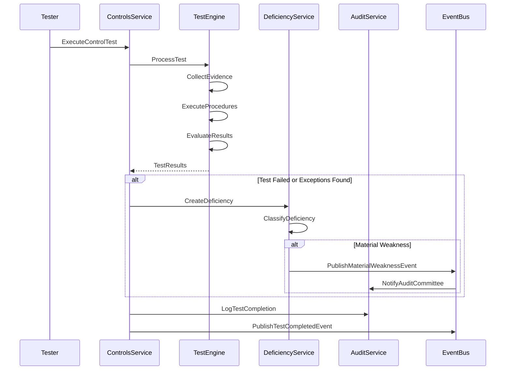
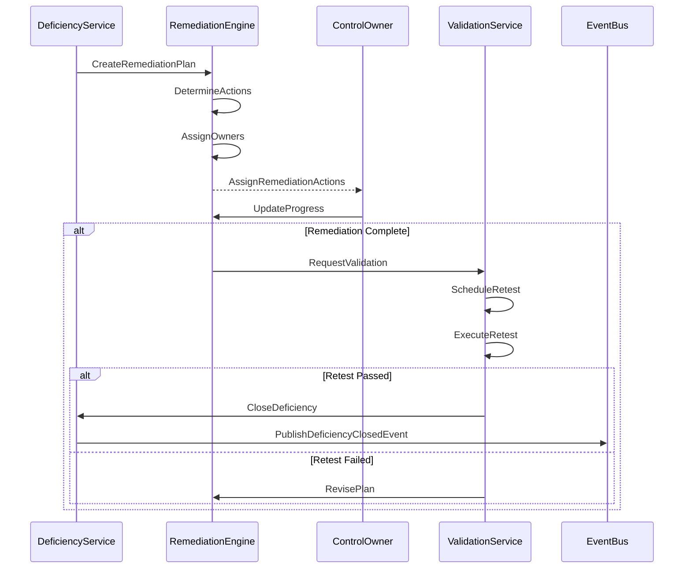

# Controls Service Specification

## Service Overview

**Service Name**: Controls Service (Internal Controls & SOX Compliance)
**Port**: 3040
**Phase**: 5 - Governance Domain (Internal Controls & SOX)
**Story Points**: 35
**Dependencies**: Identity Service, Organization Service, Audit Service, Risk Service (3033), Ethics Service
**Technology Stack**: NestJS, MongoDB, InfluxDB (metrics), Neo4j (control-risk mapping), Redis, Python (ML)
**Business Criticality**: CRITICAL - SOX Compliance & Internal Control

### Service Context

The Controls Service is the internal controls management and SOX compliance platform for Clenergize V3, providing comprehensive control framework implementation, control testing, deficiency tracking, and SOX 404 compliance capabilities. As internal controls become critical for ESG governance (especially under COSO 2013 framework and CSRD ESRS G1), this service enables organizations to demonstrate robust control environments and meet regulatory requirements.

### Business Value

- **SOX 404 Compliance**: Meet Sarbanes-Oxley Section 404 internal control requirements
- **Control Framework**: Implement COSO 2013 Internal Control framework (5 components, 17 principles)
- **Continuous Control Monitoring**: Automated control monitoring and exception detection
- **Deficiency Management**: Track material weaknesses and significant deficiencies
- **Management Certifications**: CEO/CFO certifications and sub-certifications
- **ESG Governance**: Demonstrate strong governance for CSRD ESRS G1
- **Audit Support**: Streamline internal audit and external audit processes

## Core Requirements

### Functional Requirements

#### COSO 2013 Framework Implementation
- Five control components (Control Environment, Risk Assessment, Control Activities, Information & Communication, Monitoring)
- 17 principles of internal control
- Control objective definition
- Control design documentation
- Control operating effectiveness
- Control environment assessment
- Tone at the top evaluation

#### Control Library Management
- Control catalog maintenance
- Control types (preventive, detective, corrective)
- Control nature (manual, automated, IT-dependent manual)
- Control frequency (continuous, daily, weekly, monthly, quarterly, annual)
- Control key/non-key classification
- IT General Controls (ITGCs)
- Application controls
- Entity-level controls
- Process-level controls
- Transaction-level controls

#### SOX 404 Scoping
- Scoping methodology (quantitative and qualitative)
- Significant account determination
- Relevant assertion mapping (existence, completeness, accuracy, rights & obligations, presentation)
- Key control identification
- In-scope process determination
- Location scoping
- Anti-fraud controls identification
- Control rationalization

#### Control Testing
- Test of design (TOD)
- Test of operating effectiveness (TOE)
- Walkthrough procedures
- Sampling methodology (statistical and judgmental)
- Sample size calculation
- Test procedures documentation
- Test evidence collection
- Test results evaluation
- Reperformance procedures
- Inquiry and observation

#### Deficiency Management
- Deficiency identification
- Deficiency classification (control deficiency, significant deficiency, material weakness)
- Severity assessment
- Root cause analysis
- Impact analysis
- Compensating controls identification
- Remediation action planning
- Corrective Action Plan (CAP) tracking
- Retest scheduling
- Deficiency aging analysis

#### Continuous Control Monitoring (CCM)
- Automated control execution monitoring
- Exception detection
- Control KPIs and metrics
- Control performance trending
- Real-time alerting
- Data analytics integration
- Anomaly detection
- Control dashboards
- Predictive control failure analysis

#### Management Certifications
- CEO/CFO quarterly certifications
- Annual management assessment of ICFR (Internal Control over Financial Reporting)
- Sub-certification cascade
- Business unit certifications
- Process owner certifications
- Control owner certifications
- Certification tracking and reminders
- Certification evidence collection
- Certification repository

#### Risk-to-Control Mapping
- Risk identification alignment
- Control coverage analysis
- Gap identification
- Control effectiveness against risks
- Risk-based testing prioritization
- Risk heat maps
- Control-to-risk traceability
- Unmitigated risk identification

#### Control Change Management
- Control design changes
- Control ownership changes
- Control frequency changes
- Control retirement
- Control versioning
- Change impact analysis
- Change approval workflow
- Change communication

#### Compliance Reporting
- SOX 404 management report
- SOX 404 disclosure preparation
- Audit committee reporting
- Board of directors reporting
- Internal audit reporting
- External audit support
- Deficiency trend reporting
- Control effectiveness reporting

### Non-Functional Requirements

#### Performance
- Control dashboard load time < 3 seconds
- Control test creation < 2 seconds
- Deficiency report generation < 15 seconds
- API response time < 200ms (p95)
- Continuous monitoring alert < 5 seconds
- Batch control testing execution < 10 minutes for 1,000 controls

#### Security
- SOC 2 Type II compliance
- Encryption for control documentation at rest and in transit
- Role-based access control (segregation of duties)
- Audit trail for all control operations
- Secure API authentication (service-to-service)
- Evidence immutability

#### Scalability
- Support for 10,000+ controls
- 100,000+ control tests per year
- 50+ business processes
- 100+ locations
- 1,000+ control owners
- Multi-tenant architecture

#### Reliability
- 99.95% uptime for control monitoring
- Zero data loss for control test evidence
- Automated failover for critical alerts
- Disaster recovery with < 4 hour RTO
- Point-in-time recovery for all control data

## Data Models

### Core Entities

```typescript
// Control Entity
interface Control {
  id: string;
  organizationId: string;
  controlId: string; // Internal control ID (e.g., "CTL-FIN-001")

  // Basic Information
  controlName: string;
  controlDescription: string;
  controlObjective: string;

  // COSO Framework
  cosoComponent: COSOComponent;
  cosoPrinciple: COSOPrinciple[];

  // Classification
  controlType: ControlType;
  controlNature: ControlNature;
  controlFrequency: ControlFrequency;
  keyControl: boolean; // Key vs. non-key
  antifraudControl: boolean;

  // SOX Classification
  soxRelevant: boolean;
  soxScope: SOXScope;
  controlLevel: ControlLevel;

  // Process & Risk
  businessProcess: string;
  subProcess?: string;
  activity?: string;
  relatedRisks: string[]; // Risk IDs from Risk Service
  significantAccount?: string[];
  relevantAssertions: RelevantAssertion[];

  // Control Design
  controlOwner: string;
  backupOwner?: string;
  controlPerformer: string;
  controlReviewer?: string;

  // Procedures
  controlProcedure: string;
  evidenceOfPerformance: string;
  evidenceOfReview?: string;
  controlLimitations?: string;

  // Dependencies
  systemsUsed: string[];
  dataSourcesUsed: string[];
  itDependencies: ITDependency[];
  upstreamControls?: string[];
  downstreamControls?: string[];

  // Automation
  automationLevel: AutomationLevel;
  automationTool?: string;
  automationScript?: string;
  monitoringEnabled: boolean;

  // Effectiveness
  designEffectiveness: DesignEffectiveness;
  operatingEffectiveness: OperatingEffectiveness;
  lastAssessmentDate: Date;
  nextAssessmentDate: Date;

  // Deficiencies
  hasDeficiencies: boolean;
  currentDeficiencies: string[]; // Deficiency IDs
  historicalDeficiencies: string[];

  // Status & Lifecycle
  status: ControlStatus;
  implementationDate: Date;
  retirementDate?: Date;
  lastModifiedDate: Date;
  versionNumber: number;
  changeHistory: ControlChange[];

  // Testing
  testingFrequency: TestingFrequency;
  lastTestDate?: Date;
  nextTestDate?: Date;
  testResults: string[]; // Test result IDs

  // Documentation
  attachments: Attachment[];
  policies: string[];
  procedures: string[];

  // Metadata
  createdAt: Date;
  createdBy: string;
  updatedAt: Date;
  updatedBy: string;
  tags: string[];
  notes?: string;
}

// COSO Component
enum COSOComponent {
  CONTROL_ENVIRONMENT = 'Control Environment',
  RISK_ASSESSMENT = 'Risk Assessment',
  CONTROL_ACTIVITIES = 'Control Activities',
  INFORMATION_COMMUNICATION = 'Information & Communication',
  MONITORING_ACTIVITIES = 'Monitoring Activities'
}

// COSO Principle (17 principles)
enum COSOPrinciple {
  // Control Environment
  P1_INTEGRITY_VALUES = 'P1: Demonstrates Commitment to Integrity and Ethical Values',
  P2_BOARD_OVERSIGHT = 'P2: Exercises Oversight Responsibility',
  P3_STRUCTURE_AUTHORITY = 'P3: Establishes Structure, Authority, and Responsibility',
  P4_COMPETENCE = 'P4: Demonstrates Commitment to Competence',
  P5_ACCOUNTABILITY = 'P5: Enforces Accountability',

  // Risk Assessment
  P6_OBJECTIVES = 'P6: Specifies Suitable Objectives',
  P7_IDENTIFY_RISKS = 'P7: Identifies and Analyzes Risk',
  P8_FRAUD_ASSESSMENT = 'P8: Assesses Fraud Risk',
  P9_CHANGES = 'P9: Identifies and Analyzes Significant Change',

  // Control Activities
  P10_CONTROL_ACTIVITIES = 'P10: Selects and Develops Control Activities',
  P11_TECHNOLOGY_CONTROLS = 'P11: Selects and Develops General Controls over Technology',
  P12_POLICIES_PROCEDURES = 'P12: Deploys through Policies and Procedures',

  // Information & Communication
  P13_INFORMATION = 'P13: Uses Relevant Information',
  P14_INTERNAL_COMMUNICATION = 'P14: Communicates Internally',
  P15_EXTERNAL_COMMUNICATION = 'P15: Communicates Externally',

  // Monitoring Activities
  P16_ONGOING_EVALUATIONS = 'P16: Conducts Ongoing and/or Separate Evaluations',
  P17_DEFICIENCIES = 'P17: Evaluates and Communicates Deficiencies'
}

// Control Type
enum ControlType {
  PREVENTIVE = 'Preventive',
  DETECTIVE = 'Detective',
  CORRECTIVE = 'Corrective'
}

// Control Nature
enum ControlNature {
  MANUAL = 'Manual',
  AUTOMATED = 'Automated',
  IT_DEPENDENT_MANUAL = 'IT-Dependent Manual',
  HYBRID = 'Hybrid'
}

// Control Frequency
enum ControlFrequency {
  CONTINUOUS = 'Continuous',
  DAILY = 'Daily',
  WEEKLY = 'Weekly',
  MONTHLY = 'Monthly',
  QUARTERLY = 'Quarterly',
  ANNUALLY = 'Annually',
  AD_HOC = 'Ad Hoc'
}

// SOX Scope
enum SOXScope {
  IN_SCOPE = 'In Scope',
  OUT_OF_SCOPE = 'Out of Scope',
  PENDING_ASSESSMENT = 'Pending Assessment'
}

// Control Level
enum ControlLevel {
  ENTITY_LEVEL = 'Entity-Level',
  PROCESS_LEVEL = 'Process-Level',
  TRANSACTION_LEVEL = 'Transaction-Level',
  IT_GENERAL_CONTROL = 'IT General Control',
  APPLICATION_CONTROL = 'Application Control'
}

// Relevant Assertion (PCAOB AS 5)
enum RelevantAssertion {
  EXISTENCE_OCCURRENCE = 'Existence/Occurrence',
  COMPLETENESS = 'Completeness',
  ACCURACY_VALUATION = 'Accuracy/Valuation',
  RIGHTS_OBLIGATIONS = 'Rights and Obligations',
  PRESENTATION_DISCLOSURE = 'Presentation and Disclosure'
}

// IT Dependency
interface ITDependency {
  systemName: string;
  dependencyType: 'Data Source' | 'Calculation' | 'Report' | 'Access Control' | 'Workflow';
  itgcReliance: boolean;
  itgcControls?: string[]; // ITGC control IDs
  criticalDependency: boolean;
}

// Automation Level
enum AutomationLevel {
  FULLY_MANUAL = 'Fully Manual',
  SEMI_AUTOMATED = 'Semi-Automated',
  FULLY_AUTOMATED = 'Fully Automated'
}

// Design Effectiveness
enum DesignEffectiveness {
  EFFECTIVE = 'Effective',
  INEFFECTIVE = 'Ineffective',
  NOT_TESTED = 'Not Tested',
  PENDING_ASSESSMENT = 'Pending Assessment'
}

// Operating Effectiveness
enum OperatingEffectiveness {
  EFFECTIVE = 'Effective',
  INEFFECTIVE = 'Ineffective',
  NOT_TESTED = 'Not Tested',
  PENDING_ASSESSMENT = 'Pending Assessment'
}

// Control Status
enum ControlStatus {
  ACTIVE = 'Active',
  INACTIVE = 'Inactive',
  RETIRED = 'Retired',
  DRAFT = 'Draft',
  UNDER_REVIEW = 'Under Review'
}

// Testing Frequency
enum TestingFrequency {
  QUARTERLY = 'Quarterly',
  SEMI_ANNUALLY = 'Semi-Annually',
  ANNUALLY = 'Annually',
  ON_DEMAND = 'On Demand'
}

// Control Change
interface ControlChange {
  changeDate: Date;
  changeType: 'Design' | 'Owner' | 'Frequency' | 'Procedure' | 'Status' | 'Other';
  changeDescription: string;
  changedBy: string;
  approvedBy?: string;
  approvalDate?: Date;
  impactAssessment: string;
}

// Control Test Entity
interface ControlTest {
  id: string;
  organizationId: string;
  testId: string; // Internal test ID (e.g., "TEST-2025-Q1-001")

  // Test Information
  controlId: string;
  controlName: string;
  testType: TestType;
  testPeriod: TestPeriod;

  // Test Planning
  testObjective: string;
  testProcedures: string;
  testAttributes: TestAttribute[];
  sampleSize?: number;
  samplingMethodology?: SamplingMethodology;
  sampleSelectionCriteria?: string;

  // Test Execution
  tester: string;
  testStartDate: Date;
  testCompletionDate?: Date;
  testStatus: TestStatus;

  // Test Evidence
  evidenceObtained: TestEvidence[];
  observationsNoted: string;
  workpaperReference?: string;

  // Test Results
  testResult: TestResult;
  exceptionsFound: number;
  exceptionDetails?: Exception[];
  deficiencyIdentified: boolean;
  deficiencyId?: string;

  // Conclusions
  designConclusion?: DesignEffectiveness;
  operatingConclusion?: OperatingEffectiveness;
  overallConclusion: string;
  recommendations?: string;

  // Review
  reviewer?: string;
  reviewDate?: Date;
  reviewStatus: ReviewStatus;
  reviewComments?: string;

  // Metadata
  createdAt: Date;
  createdBy: string;
  updatedAt: Date;
  updatedBy: string;
  attachments: Attachment[];
}

// Test Type
enum TestType {
  DESIGN_TEST = 'Test of Design (TOD)',
  OPERATING_TEST = 'Test of Operating Effectiveness (TOE)',
  WALKTHROUGH = 'Walkthrough',
  COMBINED_TEST = 'Combined (Design + Operating)'
}

// Test Period
interface TestPeriod {
  periodStart: Date;
  periodEnd: Date;
  fiscalQuarter?: string;
  fiscalYear: number;
}

// Test Attribute
interface TestAttribute {
  attribute: string; // e.g., "Accuracy of calculation"
  testProcedure: string;
  expectedResult: string;
  actualResult?: string;
  passed: boolean;
}

// Sampling Methodology
enum SamplingMethodology {
  JUDGMENTAL = 'Judgmental Sampling',
  STATISTICAL_RANDOM = 'Statistical Random Sampling',
  SYSTEMATIC = 'Systematic Sampling',
  STRATIFIED = 'Stratified Sampling',
  MONETARY_UNIT = 'Monetary Unit Sampling',
  COMPLETE_POPULATION = 'Complete Population (No Sampling)'
}

// Test Status
enum TestStatus {
  NOT_STARTED = 'Not Started',
  IN_PROGRESS = 'In Progress',
  UNDER_REVIEW = 'Under Review',
  COMPLETED = 'Completed',
  CANCELLED = 'Cancelled'
}

// Test Result
enum TestResult {
  PASSED = 'Passed',
  PASSED_WITH_EXCEPTIONS = 'Passed with Exceptions',
  FAILED = 'Failed',
  INCONCLUSIVE = 'Inconclusive'
}

// Exception
interface Exception {
  exceptionId: string;
  exceptionDescription: string;
  sampleItem: string;
  expectedOutcome: string;
  actualOutcome: string;
  rootCause?: string;
  severity: ExceptionSeverity;
  compensatingControls?: string[];
}

// Exception Severity
enum ExceptionSeverity {
  CRITICAL = 'Critical',
  HIGH = 'High',
  MEDIUM = 'Medium',
  LOW = 'Low'
}

// Review Status
enum ReviewStatus {
  PENDING_REVIEW = 'Pending Review',
  APPROVED = 'Approved',
  REJECTED = 'Rejected',
  REQUIRES_REVISION = 'Requires Revision'
}

// Test Evidence
interface TestEvidence {
  evidenceId: string;
  evidenceType: EvidenceType;
  evidenceDescription: string;
  evidenceDate: Date;
  evidenceSource: string;
  evidenceLocation: string; // File path or URL
  evidenceHash: string; // For integrity verification
  uploadedBy: string;
  uploadedAt: Date;
}

// Evidence Type
enum EvidenceType {
  SCREENSHOT = 'Screenshot',
  SYSTEM_REPORT = 'System Report',
  SIGNED_DOCUMENT = 'Signed Document',
  EMAIL_COMMUNICATION = 'Email Communication',
  APPROVAL_WORKFLOW = 'Approval Workflow',
  DATA_EXTRACT = 'Data Extract',
  CALCULATION_SPREADSHEET = 'Calculation Spreadsheet',
  OTHER = 'Other'
}

// Control Deficiency Entity
interface ControlDeficiency {
  id: string;
  organizationId: string;
  deficiencyId: string; // Internal ID (e.g., "DEF-2025-001")

  // Deficiency Information
  deficiencyTitle: string;
  deficiencyDescription: string;
  controlId: string;
  controlName: string;

  // Classification
  deficiencyClassification: DeficiencyClassification;
  severity: DeficiencySeverity;

  // Discovery
  discoveryDate: Date;
  discoveredBy: string;
  discoveryMethod: DiscoveryMethod;
  testId?: string; // If discovered during testing

  // Analysis
  rootCause: string;
  contributingFactors: string[];
  potentialImpact: string;
  actualImpact?: string;
  financialImpact?: number;

  // SOX Significance
  soxRelevant: boolean;
  significantAccount?: string[];
  assertionsAffected?: RelevantAssertion[];
  materialWeakness: boolean;
  significantDeficiency: boolean;

  // Compensating Controls
  compensatingControls: CompensatingControl[];
  adequateCompensation: boolean;

  // Remediation
  remediationRequired: boolean;
  remediationPlan?: RemediationPlan;
  remediationStatus: RemediationStatus;
  targetRemediationDate?: Date;
  actualRemediationDate?: Date;

  // Validation
  retestRequired: boolean;
  retestDate?: Date;
  retestResult?: TestResult;
  validatedBy?: string;
  validationDate?: Date;

  // Communication
  managementNotified: boolean;
  notificationDate?: Date;
  auditCommitteeNotified: boolean;
  externalAuditorNotified: boolean;

  // Status & Tracking
  status: DeficiencyStatus;
  ageInDays: number;
  escalationLevel: number;

  // Metadata
  createdAt: Date;
  createdBy: string;
  updatedAt: Date;
  updatedBy: string;
  closedAt?: Date;
  closedBy?: string;
  attachments: Attachment[];
}

// Deficiency Classification
enum DeficiencyClassification {
  CONTROL_DEFICIENCY = 'Control Deficiency',
  SIGNIFICANT_DEFICIENCY = 'Significant Deficiency',
  MATERIAL_WEAKNESS = 'Material Weakness'
}

// Deficiency Severity
enum DeficiencySeverity {
  CRITICAL = 'Critical',
  HIGH = 'High',
  MEDIUM = 'Medium',
  LOW = 'Low'
}

// Discovery Method
enum DiscoveryMethod {
  CONTROL_TESTING = 'Control Testing',
  CONTINUOUS_MONITORING = 'Continuous Monitoring',
  INTERNAL_AUDIT = 'Internal Audit',
  EXTERNAL_AUDIT = 'External Audit',
  MANAGEMENT_REVIEW = 'Management Review',
  SELF_ASSESSMENT = 'Self-Assessment',
  INCIDENT_INVESTIGATION = 'Incident Investigation'
}

// Compensating Control
interface CompensatingControl {
  controlId: string;
  controlName: string;
  controlDescription: string;
  effectiveness: 'Fully Compensating' | 'Partially Compensating' | 'Not Compensating';
  testDate?: Date;
  testResult?: TestResult;
}

// Remediation Plan
interface RemediationPlan {
  planId: string;
  planDescription: string;
  remediationActions: RemediationAction[];
  responsibleParty: string;
  targetDate: Date;
  budget?: number;
  approvedBy?: string;
  approvalDate?: Date;
  progress: number; // 0-100%
  blockers?: string[];
  updates: RemediationUpdate[];
}

// Remediation Action
interface RemediationAction {
  actionId: string;
  actionDescription: string;
  actionType: 'Control Redesign' | 'Process Change' | 'System Change' | 'Training' | 'Policy Update' | 'Other';
  assignedTo: string;
  dueDate: Date;
  status: 'Not Started' | 'In Progress' | 'Completed' | 'Blocked';
  completionDate?: Date;
  evidenceOfCompletion?: string;
}

// Remediation Update
interface RemediationUpdate {
  updateDate: Date;
  updatedBy: string;
  updateDescription: string;
  newProgress: number;
  issues?: string;
}

// Remediation Status
enum RemediationStatus {
  NOT_STARTED = 'Not Started',
  PLANNING = 'Planning',
  IN_PROGRESS = 'In Progress',
  PENDING_VALIDATION = 'Pending Validation',
  COMPLETED = 'Completed',
  CANCELLED = 'Cancelled'
}

// Deficiency Status
enum DeficiencyStatus {
  OPEN = 'Open',
  IN_REMEDIATION = 'In Remediation',
  PENDING_VALIDATION = 'Pending Validation',
  CLOSED = 'Closed',
  ACCEPTED = 'Accepted (Risk Accepted)'
}

// SOX Scoping Entity
interface SOXScoping {
  id: string;
  organizationId: string;
  scopingId: string;

  // Scoping Period
  fiscalYear: number;
  scopingDate: Date;
  approvedBy: string;
  approvalDate: Date;

  // Scoping Methodology
  methodology: ScopingMethodology;
  quantitativeThreshold: number; // % of total assets or revenue
  qualitativeFactors: string[];

  // Significant Accounts
  significantAccounts: SignificantAccount[];

  // In-Scope Processes
  inScopeProcesses: InScopeProcess[];

  // In-Scope Locations
  inScopeLocations: InScopeLocation[];

  // Control Summary
  totalControlsInScope: number;
  keyControlsInScope: number;
  itgcControlsInScope: number;
  entityLevelControlsInScope: number;

  // Scoping Rationale
  scopingRationale: string;
  changeFromPriorYear?: string;

  // Status
  status: 'Draft' | 'Approved' | 'Superseded';

  // Metadata
  createdAt: Date;
  createdBy: string;
  updatedAt: Date;
  updatedBy: string;
}

// Scoping Methodology
enum ScopingMethodology {
  QUANTITATIVE_ONLY = 'Quantitative Only',
  QUALITATIVE_ONLY = 'Qualitative Only',
  COMBINED = 'Combined (Quantitative + Qualitative)'
}

// Significant Account
interface SignificantAccount {
  accountName: string;
  accountBalance: number;
  percentOfTotalAssets?: number;
  percentOfRevenue?: number;
  qualitativeFactors: string[];
  relevantAssertions: RelevantAssertion[];
  relatedProcesses: string[];
}

// In-Scope Process
interface InScopeProcess {
  processName: string;
  processOwner: string;
  significantAccounts: string[];
  keyControls: string[];
  subProcesses?: string[];
  scopingRationale: string;
}

// In-Scope Location
interface InScopeLocation {
  locationName: string;
  locationId: string;
  countryCode: string;
  percentOfRevenue: number;
  percentOfAssets: number;
  significantActivities: string[];
  scopingRationale: string;
}

// Management Certification Entity
interface ManagementCertification {
  id: string;
  organizationId: string;
  certificationId: string;

  // Certification Period
  certificationPeriod: CertificationPeriod;

  // Certification Type
  certificationType: CertificationType;
  certificationLevel: CertificationLevel;

  // Certifying Officer
  certifyingOfficer: string;
  certifyingOfficerTitle: string;
  certifyingOfficerEmail: string;

  // Certification Statement
  certificationStatement: string;
  additionalDisclosures?: string;

  // Sub-Certifications
  subCertifications: SubCertification[];
  allSubCertificationsReceived: boolean;

  // Deficiencies Disclosed
  deficienciesDisclosed: boolean;
  disclosedDeficiencies?: string[]; // Deficiency IDs
  materialWeaknesses: number;
  significantDeficiencies: number;

  // Changes Disclosure
  changesInICFR: boolean;
  changeDescription?: string;

  // Signature & Submission
  signatureDate?: Date;
  submittedDate?: Date;
  submissionMethod: 'Electronic' | 'Physical' | 'Pending';

  // Evidence
  evidenceCollected: CertificationEvidence[];

  // Status
  status: CertificationStatus;
  dueDate: Date;
  remindersSent: number;

  // Metadata
  createdAt: Date;
  createdBy: string;
  updatedAt: Date;
  updatedBy: string;
}

// Certification Period
interface CertificationPeriod {
  periodStart: Date;
  periodEnd: Date;
  fiscalQuarter?: string;
  fiscalYear: number;
}

// Certification Type
enum CertificationType {
  CEO_CFO_QUARTERLY = 'CEO/CFO Quarterly Certification',
  CEO_CFO_ANNUAL = 'CEO/CFO Annual Certification',
  MANAGEMENT_ASSESSMENT_404 = 'SOX 404 Management Assessment',
  SUB_CERTIFICATION = 'Sub-Certification'
}

// Certification Level
enum CertificationLevel {
  EXECUTIVE = 'Executive (CEO/CFO)',
  BUSINESS_UNIT = 'Business Unit',
  PROCESS_OWNER = 'Process Owner',
  CONTROL_OWNER = 'Control Owner'
}

// Sub-Certification
interface SubCertification {
  subCertificationId: string;
  certifyingParty: string;
  certifyingPartyTitle: string;
  certifyingPartyEmail: string;
  scope: string; // e.g., "Revenue Process", "Asia Pacific Region"
  certificationStatement: string;
  deficienciesReported: boolean;
  deficiencyCount: number;
  signatureDate?: Date;
  status: 'Pending' | 'Submitted' | 'Overdue';
}

// Certification Evidence
interface CertificationEvidence {
  evidenceType: string;
  evidenceDescription: string;
  evidenceDate: Date;
  evidenceSource: string;
  evidenceLocation: string;
}

// Certification Status
enum CertificationStatus {
  NOT_STARTED = 'Not Started',
  IN_PROGRESS = 'In Progress',
  PENDING_SIGNATURE = 'Pending Signature',
  SUBMITTED = 'Submitted',
  OVERDUE = 'Overdue'
}

// Automated Control Monitoring Entity
interface AutomatedControlMonitoring {
  id: string;
  organizationId: string;
  monitoringId: string;

  // Control Information
  controlId: string;
  controlName: string;

  // Monitoring Configuration
  monitoringEnabled: boolean;
  monitoringFrequency: MonitoringFrequency;
  monitoringScript: string;
  dataSource: string;

  // Thresholds & Rules
  monitoringRules: MonitoringRule[];
  alertThresholds: AlertThreshold[];

  // Execution
  lastExecutionDate?: Date;
  nextExecutionDate?: Date;
  executionStatus: ExecutionStatus;
  executionHistory: MonitoringExecution[];

  // Results
  exceptionsDetected: number;
  lastExceptionDate?: Date;
  exceptionTrend: 'Increasing' | 'Stable' | 'Decreasing';

  // Alerting
  alertRecipients: string[];
  alertsGenerated: number;
  lastAlertDate?: Date;

  // Metadata
  createdAt: Date;
  createdBy: string;
  updatedAt: Date;
  updatedBy: string;
}

// Monitoring Frequency
enum MonitoringFrequency {
  REAL_TIME = 'Real-Time',
  HOURLY = 'Hourly',
  DAILY = 'Daily',
  WEEKLY = 'Weekly',
  MONTHLY = 'Monthly'
}

// Monitoring Rule
interface MonitoringRule {
  ruleId: string;
  ruleName: string;
  ruleDescription: string;
  ruleLogic: string; // SQL query, script logic, etc.
  expectedOutcome: string;
  severityIfFailed: ExceptionSeverity;
}

// Alert Threshold
interface AlertThreshold {
  metric: string;
  threshold: number;
  operator: '>' | '<' | '=' | '>=' | '<=';
  alertSeverity: 'Critical' | 'High' | 'Medium' | 'Low';
}

// Execution Status
enum ExecutionStatus {
  SUCCESSFUL = 'Successful',
  FAILED = 'Failed',
  WARNINGS = 'Warnings',
  PENDING = 'Pending'
}

// Monitoring Execution
interface MonitoringExecution {
  executionDate: Date;
  executionDuration: number; // milliseconds
  recordsProcessed: number;
  exceptionsFound: number;
  executionStatus: ExecutionStatus;
  errorMessage?: string;
  executionLog?: string;
}

// Control Metrics Entity
interface ControlMetrics {
  id: string;
  organizationId: string;
  period: {
    startDate: Date;
    endDate: Date;
    quarter?: string;
    year: number;
  };

  // Control Coverage
  totalControls: number;
  activeControls: number;
  keyControls: number;
  automatedControls: number;
  manualControls: number;

  // Control Testing
  controlsTested: number;
  testsPerformed: number;
  testsPassed: number;
  testsFailed: number;
  testPassRate: number; // %

  // Effectiveness
  controlsEffective: number;
  controlsIneffective: number;
  controlEffectivenessRate: number; // %
  designEffectiveControls: number;
  operatingEffectiveControls: number;

  // Deficiencies
  totalDeficiencies: number;
  newDeficiencies: number;
  openDeficiencies: number;
  closedDeficiencies: number;
  materialWeaknesses: number;
  significantDeficiencies: number;
  controlDeficiencies: number;

  // Remediation
  remediationsInProgress: number;
  remediationsCompleted: number;
  averageRemediationTime: number; // days
  overdueRemediations: number;

  // Continuous Monitoring
  monitoredControls: number;
  exceptionsDetected: number;
  alertsGenerated: number;

  // Certifications
  certificationsRequired: number;
  certificationsReceived: number;
  certificationCompletionRate: number; // %
  overdueCertifications: number;

  // SOX Compliance
  soxControlsInScope: number;
  soxControlsTested: number;
  soxControlsEffective: number;
  soxComplianceRate: number; // %

  // Metadata
  generatedAt: Date;
  generatedBy: string;
}
```

## API Endpoints

### Control Management

```typescript
// Control CRUD Operations
POST   /api/v1/controls                      // Create new control
GET    /api/v1/controls                      // List all controls
GET    /api/v1/controls/:id                  // Get control details
PUT    /api/v1/controls/:id                  // Update control
DELETE /api/v1/controls/:id                  // Delete control (admin only)

// Control Lifecycle
POST   /api/v1/controls/:id/activate         // Activate control
POST   /api/v1/controls/:id/deactivate       // Deactivate control
POST   /api/v1/controls/:id/retire           // Retire control
POST   /api/v1/controls/:id/version          // Create new version

// Control Assessment
POST   /api/v1/controls/:id/assess-design    // Assess design effectiveness
POST   /api/v1/controls/:id/assess-operating // Assess operating effectiveness
POST   /api/v1/controls/:id/risk-mapping     // Map to risks
GET    /api/v1/controls/:id/dependencies     // Get control dependencies

// Control Search and Filter
GET    /api/v1/controls/search               // Search controls
GET    /api/v1/controls/filter               // Filter controls
GET    /api/v1/controls/by-process/:process  // Get by business process
GET    /api/v1/controls/by-owner/:owner      // Get by control owner
GET    /api/v1/controls/key-controls         // Get key controls only
GET    /api/v1/controls/sox-scope            // Get SOX in-scope controls

// Control Monitoring
POST   /api/v1/controls/:id/enable-monitoring // Enable automated monitoring
POST   /api/v1/controls/:id/disable-monitoring // Disable monitoring
GET    /api/v1/controls/:id/monitoring-results // Get monitoring results
GET    /api/v1/controls/:id/exceptions        // Get exceptions detected
```

### Control Testing

```typescript
// Control Test CRUD
POST   /api/v1/control-tests                 // Create control test
GET    /api/v1/control-tests                 // List control tests
GET    /api/v1/control-tests/:id             // Get test details
PUT    /api/v1/control-tests/:id             // Update test
DELETE /api/v1/control-tests/:id             // Delete test

// Test Execution
POST   /api/v1/control-tests/:id/start       // Start test execution
POST   /api/v1/control-tests/:id/complete    // Complete test
POST   /api/v1/control-tests/:id/evidence    // Upload test evidence
POST   /api/v1/control-tests/:id/exceptions  // Record exceptions

// Test Review
POST   /api/v1/control-tests/:id/submit-review // Submit for review
POST   /api/v1/control-tests/:id/approve     // Approve test
POST   /api/v1/control-tests/:id/reject      // Reject test
POST   /api/v1/control-tests/:id/revise      // Request revisions

// Test Planning
POST   /api/v1/control-tests/generate-plan   // Generate test plan
GET    /api/v1/control-tests/schedule        // Get test schedule
POST   /api/v1/control-tests/calculate-sample // Calculate sample size
GET    /api/v1/control-tests/by-period/:period // Get tests by period

// Test Reporting
GET    /api/v1/control-tests/summary         // Test summary report
GET    /api/v1/control-tests/results         // Test results report
GET    /api/v1/control-tests/exceptions-report // Exceptions report
GET    /api/v1/control-tests/coverage        // Test coverage report
```

### Deficiency Management

```typescript
// Deficiency CRUD
POST   /api/v1/deficiencies                  // Create deficiency
GET    /api/v1/deficiencies                  // List deficiencies
GET    /api/v1/deficiencies/:id              // Get deficiency details
PUT    /api/v1/deficiencies/:id              // Update deficiency
DELETE /api/v1/deficiencies/:id              // Delete deficiency

// Deficiency Classification
POST   /api/v1/deficiencies/:id/classify     // Classify deficiency
POST   /api/v1/deficiencies/:id/assess-severity // Assess severity
POST   /api/v1/deficiencies/:id/root-cause   // Document root cause
POST   /api/v1/deficiencies/:id/impact       // Assess impact

// Remediation
POST   /api/v1/deficiencies/:id/remediation-plan // Create remediation plan
PUT    /api/v1/deficiencies/:id/remediation-plan // Update plan
POST   /api/v1/deficiencies/:id/remediation-action // Add remediation action
PUT    /api/v1/deficiencies/actions/:actionId // Update action status
POST   /api/v1/deficiencies/:id/progress     // Update progress

// Validation
POST   /api/v1/deficiencies/:id/validate     // Validate remediation
POST   /api/v1/deficiencies/:id/retest       // Schedule retest
POST   /api/v1/deficiencies/:id/close        // Close deficiency
POST   /api/v1/deficiencies/:id/accept-risk  // Accept risk (no remediation)

// Deficiency Search and Filter
GET    /api/v1/deficiencies/search           // Search deficiencies
GET    /api/v1/deficiencies/open             // Get open deficiencies
GET    /api/v1/deficiencies/material-weaknesses // Get material weaknesses
GET    /api/v1/deficiencies/significant      // Get significant deficiencies
GET    /api/v1/deficiencies/overdue          // Get overdue remediations

// Deficiency Reporting
GET    /api/v1/deficiencies/aging            // Deficiency aging report
GET    /api/v1/deficiencies/trends           // Deficiency trends
GET    /api/v1/deficiencies/by-control       // Deficiencies by control
GET    /api/v1/deficiencies/by-process       // Deficiencies by process
```

### SOX Scoping

```typescript
// SOX Scoping CRUD
POST   /api/v1/sox-scoping                   // Create SOX scoping
GET    /api/v1/sox-scoping                   // List scoping documents
GET    /api/v1/sox-scoping/:id               // Get scoping details
PUT    /api/v1/sox-scoping/:id               // Update scoping
DELETE /api/v1/sox-scoping/:id               // Delete scoping

// Scoping Analysis
POST   /api/v1/sox-scoping/:id/significant-accounts // Define significant accounts
POST   /api/v1/sox-scoping/:id/processes     // Define in-scope processes
POST   /api/v1/sox-scoping/:id/locations     // Define in-scope locations
POST   /api/v1/sox-scoping/:id/controls      // Identify in-scope controls

// Scoping Approval
POST   /api/v1/sox-scoping/:id/submit        // Submit for approval
POST   /api/v1/sox-scoping/:id/approve       // Approve scoping
POST   /api/v1/sox-scoping/:id/reject        // Reject scoping

// Scoping Reporting
GET    /api/v1/sox-scoping/:id/summary       // Scoping summary
GET    /api/v1/sox-scoping/:id/controls-list // In-scope controls list
GET    /api/v1/sox-scoping/comparison        // Compare with prior year
```

### Management Certifications

```typescript
// Certification CRUD
POST   /api/v1/certifications                // Create certification
GET    /api/v1/certifications                // List certifications
GET    /api/v1/certifications/:id            // Get certification details
PUT    /api/v1/certifications/:id            // Update certification
DELETE /api/v1/certifications/:id            // Delete certification

// Certification Workflow
POST   /api/v1/certifications/:id/request-subcerts // Request sub-certifications
GET    /api/v1/certifications/:id/subcerts   // Get sub-certification status
POST   /api/v1/certifications/:id/collect-evidence // Collect evidence
POST   /api/v1/certifications/:id/sign       // Sign certification
POST   /api/v1/certifications/:id/submit     // Submit certification

// Sub-Certification Management
POST   /api/v1/certifications/subcerts/:subId/submit // Submit sub-cert
GET    /api/v1/certifications/subcerts/pending // Get pending sub-certs
POST   /api/v1/certifications/subcerts/:subId/reminder // Send reminder

// Certification Reporting
GET    /api/v1/certifications/status         // Certification status report
GET    /api/v1/certifications/completion-rate // Completion rate
GET    /api/v1/certifications/overdue        // Overdue certifications
GET    /api/v1/certifications/:id/package    // Generate certification package
```

### Continuous Control Monitoring

```typescript
// Monitoring Configuration
POST   /api/v1/monitoring/configure          // Configure monitoring
GET    /api/v1/monitoring/configurations     // List configurations
GET    /api/v1/monitoring/configurations/:id // Get configuration
PUT    /api/v1/monitoring/configurations/:id // Update configuration
DELETE /api/v1/monitoring/configurations/:id // Delete configuration

// Monitoring Execution
POST   /api/v1/monitoring/execute/:controlId // Execute monitoring
POST   /api/v1/monitoring/execute-batch      // Execute batch monitoring
GET    /api/v1/monitoring/executions         // Get execution history
GET    /api/v1/monitoring/executions/:id     // Get execution details

// Exception Management
GET    /api/v1/monitoring/exceptions         // List exceptions
GET    /api/v1/monitoring/exceptions/:id     // Get exception details
POST   /api/v1/monitoring/exceptions/:id/investigate // Investigate exception
POST   /api/v1/monitoring/exceptions/:id/resolve // Resolve exception

// Monitoring Alerts
GET    /api/v1/monitoring/alerts             // List alerts
POST   /api/v1/monitoring/alerts/:id/acknowledge // Acknowledge alert
POST   /api/v1/monitoring/alerts/configure   // Configure alert thresholds

// Monitoring Analytics
GET    /api/v1/monitoring/dashboard          // Monitoring dashboard
GET    /api/v1/monitoring/trends             // Exception trends
GET    /api/v1/monitoring/effectiveness      // Monitoring effectiveness
```

### Control Metrics & Reporting

```typescript
// Metrics Generation
POST   /api/v1/metrics/generate              // Generate metrics report
GET    /api/v1/metrics/current               // Current period metrics
GET    /api/v1/metrics/historical            // Historical metrics
GET    /api/v1/metrics/trends                // Metric trends

// Control Metrics
GET    /api/v1/metrics/controls              // Control metrics
GET    /api/v1/metrics/control-coverage      // Control coverage
GET    /api/v1/metrics/control-effectiveness // Control effectiveness
GET    /api/v1/metrics/control-testing       // Testing metrics

// Deficiency Metrics
GET    /api/v1/metrics/deficiencies          // Deficiency metrics
GET    /api/v1/metrics/deficiency-aging      // Deficiency aging
GET    /api/v1/metrics/remediation-progress  // Remediation progress

// SOX Metrics
GET    /api/v1/metrics/sox-compliance        // SOX compliance metrics
GET    /api/v1/metrics/sox-testing           // SOX testing metrics
GET    /api/v1/metrics/sox-readiness         // SOX readiness score

// Board & Audit Committee Reporting
GET    /api/v1/reporting/board-report        // Board report
GET    /api/v1/reporting/audit-committee     // Audit committee report
GET    /api/v1/reporting/sox-404-management  // SOX 404 management report
GET    /api/v1/reporting/sox-404-disclosure  // SOX 404 disclosure
GET    /api/v1/reporting/quarterly-summary   // Quarterly summary

// ESG Disclosure
GET    /api/v1/reporting/csrd-esrs-g1        // CSRD ESRS G1 disclosure
GET    /api/v1/reporting/governance-metrics  // Governance metrics for ESG
```

### Dashboards & Analytics

```typescript
// Dashboards
GET    /api/v1/dashboards/executive          // Executive dashboard
GET    /api/v1/dashboards/control-owner      // Control owner dashboard
GET    /api/v1/dashboards/internal-audit     // Internal audit dashboard
GET    /api/v1/dashboards/sox-compliance     // SOX compliance dashboard

// Analytics
GET    /api/v1/analytics/control-heatmap     // Control risk heatmap
GET    /api/v1/analytics/deficiency-hotspots // Deficiency hotspots
GET    /api/v1/analytics/testing-coverage    // Testing coverage analysis
POST   /api/v1/analytics/predict-deficiencies // Predictive deficiency analysis
GET    /api/v1/analytics/benchmarking        // Industry benchmarking
```

## Service Architecture

### Component Structure

```
controls-service/
├── src/
│   ├── domain/
│   │   ├── entities/
│   │   │   ├── control.entity.ts
│   │   │   ├── control-test.entity.ts
│   │   │   ├── control-deficiency.entity.ts
│   │   │   ├── sox-scoping.entity.ts
│   │   │   ├── management-certification.entity.ts
│   │   │   ├── automated-monitoring.entity.ts
│   │   │   └── control-metrics.entity.ts
│   │   ├── value-objects/
│   │   │   ├── coso-principle.vo.ts
│   │   │   ├── test-result.vo.ts
│   │   │   ├── deficiency-classification.vo.ts
│   │   │   └── remediation-plan.vo.ts
│   │   ├── events/
│   │   │   ├── control-created.event.ts
│   │   │   ├── test-completed.event.ts
│   │   │   ├── deficiency-identified.event.ts
│   │   │   ├── material-weakness.event.ts
│   │   │   └── certification-submitted.event.ts
│   │   └── services/
│   │       ├── control-management.service.ts
│   │       ├── test-planning.service.ts
│   │       ├── deficiency-analyzer.service.ts
│   │       └── sox-scoping.service.ts
│   │
│   ├── application/
│   │   ├── commands/
│   │   │   ├── create-control.command.ts
│   │   │   ├── test-control.command.ts
│   │   │   ├── create-deficiency.command.ts
│   │   │   ├── remediate-deficiency.command.ts
│   │   │   └── submit-certification.command.ts
│   │   ├── queries/
│   │   │   ├── get-controls.query.ts
│   │   │   ├── get-open-deficiencies.query.ts
│   │   │   ├── get-control-metrics.query.ts
│   │   │   └── get-sox-compliance-status.query.ts
│   │   ├── services/
│   │   │   ├── control.service.ts
│   │   │   ├── control-testing.service.ts
│   │   │   ├── deficiency-management.service.ts
│   │   │   ├── sox-compliance.service.ts
│   │   │   ├── certification.service.ts
│   │   │   ├── continuous-monitoring.service.ts
│   │   │   └── control-metrics.service.ts
│   │   └── dto/
│   │       ├── create-control.dto.ts
│   │       ├── test-control.dto.ts
│   │       ├── deficiency-filter.dto.ts
│   │       └── metrics-params.dto.ts
│   │
│   ├── infrastructure/
│   │   ├── persistence/
│   │   │   ├── repositories/
│   │   │   │   ├── control.repository.ts
│   │   │   │   ├── control-test.repository.ts
│   │   │   │   ├── deficiency.repository.ts
│   │   │   │   └── certification.repository.ts
│   │   │   ├── schemas/
│   │   │   │   ├── control.schema.ts
│   │   │   │   ├── control-test.schema.ts
│   │   │   │   ├── deficiency.schema.ts
│   │   │   │   └── metrics.schema.ts
│   │   │   └── migrations/
│   │   ├── timeseries/
│   │   │   ├── influxdb.service.ts
│   │   │   ├── control-metrics.repository.ts
│   │   │   └── queries/
│   │   ├── graph/
│   │   │   ├── neo4j.service.ts
│   │   │   ├── control-risk-graph.repository.ts
│   │   │   └── queries/
│   │   ├── ml/
│   │   │   ├── deficiency-prediction.model.ts
│   │   │   ├── control-risk-scoring.model.ts
│   │   │   └── anomaly-detection.model.ts
│   │   ├── integrations/
│   │   │   ├── risk-service.client.ts
│   │   │   ├── audit-service.client.ts
│   │   │   └── erp-integration.client.ts
│   │   └── messaging/
│   │       ├── event-publisher.ts
│   │       └── event-handlers/
│   │
│   ├── interfaces/
│   │   ├── rest/
│   │   │   ├── controllers/
│   │   │   │   ├── control.controller.ts
│   │   │   │   ├── control-test.controller.ts
│   │   │   │   ├── deficiency.controller.ts
│   │   │   │   ├── sox-scoping.controller.ts
│   │   │   │   ├── certification.controller.ts
│   │   │   │   ├── monitoring.controller.ts
│   │   │   │   └── metrics.controller.ts
│   │   │   └── middleware/
│   │   ├── graphql/
│   │   │   ├── resolvers/
│   │   │   └── schemas/
│   │   └── websocket/
│   │       ├── gateways/
│   │       └── handlers/
│   │
│   └── shared/
│       ├── constants/
│       │   ├── coso-framework.ts
│       │   ├── sox-requirements.ts
│       │   └── control-types.ts
│       ├── exceptions/
│       ├── utils/
│       │   ├── sample-size-calculator.ts
│       │   ├── deficiency-classifier.ts
│       │   └── remediation-tracker.ts
│       └── types/
│
├── test/
│   ├── unit/
│   ├── integration/
│   └── e2e/
│
├── docs/
│   ├── api/
│   ├── architecture/
│   └── guides/
│
└── package.json
```

## Implementation Details

### Control Testing Engine

```typescript
export class ControlTestingService {
  // Plan control testing
  async planControlTesting(
    organizationId: string,
    fiscalYear: number
  ): Promise<ControlTestPlan> {
    // Get SOX scoping
    const scoping = await this.getSOXScoping(organizationId, fiscalYear);

    // Get in-scope controls
    const controls = await this.getInScopeControls(scoping);

    // Determine testing frequency based on control type
    const testPlan: ControlTestPlan = {
      fiscalYear,
      controls: [],
      totalTests: 0,
      quarterlyTests: 0,
      annualTests: 0
    };

    for (const control of controls) {
      const testingFrequency = this.determineTestingFrequency(control);
      const testsPerYear = this.calculateTestsPerYear(testingFrequency);

      testPlan.controls.push({
        controlId: control.id,
        controlName: control.controlName,
        testingFrequency,
        testsPerYear,
        testDates: this.scheduleTestDates(testingFrequency, fiscalYear)
      });

      testPlan.totalTests += testsPerYear;

      if (testingFrequency === TestingFrequency.QUARTERLY) {
        testPlan.quarterlyTests += testsPerYear;
      } else if (testingFrequency === TestingFrequency.ANNUALLY) {
        testPlan.annualTests += testsPerYear;
      }
    }

    return testPlan;
  }

  // Determine testing frequency based on control characteristics
  private determineTestingFrequency(control: Control): TestingFrequency {
    // Key controls tested quarterly (SOX requirement)
    if (control.keyControl && control.soxRelevant) {
      return TestingFrequency.QUARTERLY;
    }

    // High-risk non-key controls tested semi-annually
    if (this.isHighRiskControl(control)) {
      return TestingFrequency.SEMI_ANNUALLY;
    }

    // All other controls tested annually
    return TestingFrequency.ANNUALLY;
  }

  // Calculate sample size for control testing
  async calculateSampleSize(
    control: Control,
    testPeriod: TestPeriod,
    confidenceLevel: number = 0.95,
    tolerableDeviation: number = 0.05
  ): Promise<SampleSizeResult> {
    // Get population size
    const populationSize = await this.getPopulationSize(control, testPeriod);

    // For automated controls or controls with large populations
    if (control.automationLevel === AutomationLevel.FULLY_AUTOMATED ||
        populationSize > 1000) {
      // Use statistical sampling
      return this.calculateStatisticalSample(
        populationSize,
        confidenceLevel,
        tolerableDeviation
      );
    }

    // For manual controls with smaller populations
    if (populationSize <= 25) {
      // Test all items
      return {
        sampleSize: populationSize,
        methodology: SamplingMethodology.COMPLETE_POPULATION,
        populationSize,
        justification: 'Complete population tested due to small size'
      };
    }

    // For manual controls with moderate populations (26-1000)
    // Use judgmental sampling with minimum sample sizes
    return this.calculateJudgmentalSample(control, populationSize);
  }

  // Statistical sampling calculation (attribute sampling)
  private calculateStatisticalSample(
    populationSize: number,
    confidenceLevel: number,
    tolerableDeviation: number
  ): SampleSizeResult {
    // Confidence level to Z-score mapping
    const zScores: Record<number, number> = {
      0.90: 1.645,
      0.95: 1.96,
      0.99: 2.576
    };

    const zScore = zScores[confidenceLevel] || 1.96;

    // Expected population deviation rate (conservative: 0%)
    const expectedDeviation = 0;

    // Initial sample size (infinite population)
    const n0 = Math.pow(zScore, 2) *
               (tolerableDeviation * (1 - tolerableDeviation)) /
               Math.pow(tolerableDeviation - expectedDeviation, 2);

    // Finite population correction
    const sampleSize = Math.ceil(
      n0 / (1 + (n0 - 1) / populationSize)
    );

    return {
      sampleSize: Math.min(sampleSize, populationSize),
      methodology: SamplingMethodology.STATISTICAL_RANDOM,
      populationSize,
      confidenceLevel,
      tolerableDeviation,
      justification: `Statistical sampling with ${confidenceLevel * 100}% confidence level`
    };
  }

  // Judgmental sampling (rule of thumb: square root of population, min 25)
  private calculateJudgmentalSample(
    control: Control,
    populationSize: number
  ): SampleSizeResult {
    let sampleSize: number;

    if (control.keyControl) {
      // Key controls: higher sample size
      sampleSize = Math.max(
        Math.ceil(Math.sqrt(populationSize)),
        25
      );
    } else {
      // Non-key controls: standard sample size
      sampleSize = Math.max(
        Math.ceil(Math.sqrt(populationSize) * 0.8),
        15
      );
    }

    return {
      sampleSize: Math.min(sampleSize, populationSize),
      methodology: SamplingMethodology.JUDGMENTAL,
      populationSize,
      justification: `Judgmental sampling based on control key status and population size`
    };
  }

  // Execute control test
  async executeControlTest(
    testId: string,
    testProcedures: TestProcedure[]
  ): Promise<ControlTest> {
    const test = await this.getControlTest(testId);

    // Update test status
    await this.updateTestStatus(testId, TestStatus.IN_PROGRESS);

    // Execute each test procedure
    const results: TestAttribute[] = [];
    let exceptionsFound = 0;
    const exceptions: Exception[] = [];

    for (const procedure of testProcedures) {
      const result = await this.executeProcedure(test, procedure);
      results.push(result);

      if (!result.passed) {
        exceptionsFound++;
        exceptions.push({
          exceptionId: uuidv4(),
          exceptionDescription: `Failed: ${procedure.attribute}`,
          sampleItem: result.sampleItem,
          expectedOutcome: result.expectedResult,
          actualOutcome: result.actualResult,
          severity: this.assessExceptionSeverity(result)
        });
      }
    }

    // Determine test result
    const testResult = this.determineTestResult(
      results.length,
      exceptionsFound,
      test.controlId
    );

    // Update test with results
    await this.updateTestResults(testId, {
      testAttributes: results,
      testResult,
      exceptionsFound,
      exceptionDetails: exceptions,
      testCompletionDate: new Date()
    });

    // Check if deficiency should be created
    if (testResult === TestResult.FAILED ||
        (testResult === TestResult.PASSED_WITH_EXCEPTIONS &&
         this.shouldCreateDeficiency(exceptionsFound, test))) {
      await this.createDeficiency(test, exceptions);
    }

    // Update test status
    await this.updateTestStatus(testId, TestStatus.UNDER_REVIEW);

    // Publish event
    await this.eventBus.publish(new ControlTestCompletedEvent(test));

    return this.getControlTest(testId);
  }

  // Determine test result based on exceptions
  private determineTestResult(
    totalSamples: number,
    exceptionsFound: number,
    controlId: string
  ): TestResult {
    const exceptionRate = exceptionsFound / totalSamples;

    // No exceptions - Passed
    if (exceptionsFound === 0) {
      return TestResult.PASSED;
    }

    // Exception rate > 5% - Failed
    if (exceptionRate > 0.05) {
      return TestResult.FAILED;
    }

    // Exception rate 0-5% - Passed with Exceptions
    // (requires evaluation of compensating controls)
    return TestResult.PASSED_WITH_EXCEPTIONS;
  }

  // Assess operating effectiveness based on test results
  async assessOperatingEffectiveness(
    controlId: string,
    fiscalPeriod: { fiscalYear: number; quarter?: string }
  ): Promise<OperatingEffectiveness> {
    // Get all tests for the period
    const tests = await this.getTestsForPeriod(controlId, fiscalPeriod);

    if (tests.length === 0) {
      return OperatingEffectiveness.NOT_TESTED;
    }

    // Check for any failed tests
    const failedTests = tests.filter(t => t.testResult === TestResult.FAILED);

    if (failedTests.length > 0) {
      return OperatingEffectiveness.INEFFECTIVE;
    }

    // Check exception rates across all tests
    const totalExceptions = tests.reduce((sum, t) => sum + t.exceptionsFound, 0);
    const totalSamples = tests.reduce((sum, t) => sum + (t.sampleSize || 0), 0);
    const overallExceptionRate = totalExceptions / totalSamples;

    // Exception rate > 3% = Ineffective
    if (overallExceptionRate > 0.03) {
      return OperatingEffectiveness.INEFFECTIVE;
    }

    // All tests passed or passed with minor exceptions
    return OperatingEffectiveness.EFFECTIVE;
  }
}
```

### Deficiency Classification Engine

```typescript
export class DeficiencyClassificationService {
  // Classify deficiency (Control Deficiency vs Significant Deficiency vs Material Weakness)
  async classifyDeficiency(
    deficiency: ControlDeficiency
  ): Promise<DeficiencyClassification> {
    // Get control details
    const control = await this.getControl(deficiency.controlId);

    // Assess magnitude of potential misstatement
    const magnitudeAssessment = await this.assessMagnitude(deficiency, control);

    // Assess likelihood of misstatement
    const likelihoodAssessment = await this.assessLikelihood(deficiency, control);

    // Check for compensating controls
    const compensatingControlsAdequate = await this.assessCompensatingControls(
      deficiency.compensatingControls
    );

    // Classification logic per PCAOB AS 5

    // Material Weakness: Reasonable possibility of MATERIAL misstatement
    if (magnitudeAssessment.material &&
        likelihoodAssessment >= 'Reasonably Possible' &&
        !compensatingControlsAdequate) {
      return DeficiencyClassification.MATERIAL_WEAKNESS;
    }

    // Significant Deficiency: More than remote likelihood of
    // MORE THAN INCONSEQUENTIAL misstatement
    if (magnitudeAssessment.moreThanInconsequential &&
        likelihoodAssessment >= 'More Than Remote' &&
        !compensatingControlsAdequate) {
      return DeficiencyClassification.SIGNIFICANT_DEFICIENCY;
    }

    // Control Deficiency: All others
    return DeficiencyClassification.CONTROL_DEFICIENCY;
  }

  // Assess magnitude (qualitative and quantitative)
  private async assessMagnitude(
    deficiency: ControlDeficiency,
    control: Control
  ): Promise<MagnitudeAssessment> {
    // Get significant accounts affected
    const significantAccounts = control.significantAccount || [];

    // Get account balances
    const accountBalances = await this.getAccountBalances(significantAccounts);

    // Calculate potential misstatement
    let potentialMisstatement = 0;

    if (deficiency.financialImpact) {
      potentialMisstatement = deficiency.financialImpact;
    } else {
      // Estimate based on control scope
      potentialMisstatement = this.estimatePotentialMisstatement(
        control,
        accountBalances
      );
    }

    // Get materiality thresholds
    const materiality = await this.getMateriality();

    return {
      potentialMisstatement,
      material: potentialMisstatement >= materiality.overall,
      moreThanInconsequential: potentialMisstatement >= materiality.inconsequential,
      qualitativeFactors: this.assessQualitativeFactors(deficiency, control)
    };
  }

  // Assess likelihood
  private async assessLikelihood(
    deficiency: ControlDeficiency,
    control: Control
  ): Promise<string> {
    // Factors influencing likelihood:
    // 1. Control frequency
    // 2. Control automation
    // 3. Control complexity
    // 4. Historical performance
    // 5. Compensating controls

    let likelihoodScore = 0;

    // High-frequency controls: higher likelihood if deficient
    if (control.controlFrequency === ControlFrequency.CONTINUOUS ||
        control.controlFrequency === ControlFrequency.DAILY) {
      likelihoodScore += 3;
    }

    // Manual controls: higher likelihood of error
    if (control.controlNature === ControlNature.MANUAL) {
      likelihoodScore += 2;
    }

    // Complex controls: higher likelihood
    if (this.isComplexControl(control)) {
      likelihoodScore += 2;
    }

    // Historical deficiencies: higher likelihood
    if (control.historicalDeficiencies.length > 0) {
      likelihoodScore += 1;
    }

    // No compensating controls: higher likelihood
    if (deficiency.compensatingControls.length === 0) {
      likelihoodScore += 2;
    }

    // Map score to likelihood assessment
    if (likelihoodScore >= 7) {
      return 'Reasonably Possible';
    } else if (likelihoodScore >= 4) {
      return 'More Than Remote';
    } else {
      return 'Remote';
    }
  }

  // Create remediation plan for deficiency
  async createRemediationPlan(
    deficiencyId: string,
    planDetails: RemediationPlanInput
  ): Promise<RemediationPlan> {
    const deficiency = await this.getDeficiency(deficiencyId);
    const control = await this.getControl(deficiency.controlId);

    // Determine target remediation date based on classification
    let targetDate: Date;

    if (deficiency.materialWeakness) {
      // Material weaknesses: 30-60 days
      targetDate = new Date(Date.now() + 45 * 24 * 60 * 60 * 1000);
    } else if (deficiency.significantDeficiency) {
      // Significant deficiencies: 60-90 days
      targetDate = new Date(Date.now() + 75 * 24 * 60 * 60 * 1000);
    } else {
      // Control deficiencies: 90-120 days
      targetDate = new Date(Date.now() + 105 * 24 * 60 * 60 * 1000);
    }

    // Create remediation plan
    const plan: RemediationPlan = {
      planId: uuidv4(),
      planDescription: planDetails.description,
      remediationActions: planDetails.actions.map(action => ({
        actionId: uuidv4(),
        actionDescription: action.description,
        actionType: action.type,
        assignedTo: action.assignedTo,
        dueDate: action.dueDate || targetDate,
        status: 'Not Started'
      })),
      responsibleParty: planDetails.responsibleParty || control.controlOwner,
      targetDate,
      budget: planDetails.budget,
      progress: 0,
      updates: []
    };

    // Update deficiency with remediation plan
    await this.updateDeficiencyRemediationPlan(deficiencyId, plan);

    // Publish event
    await this.eventBus.publish(new RemediationPlanCreatedEvent(deficiency, plan));

    return plan;
  }
}
```

### SOX 404 Compliance Engine

```typescript
export class SOX404ComplianceService {
  // Assess overall SOX 404 compliance status
  async assessSOX404Compliance(
    organizationId: string,
    fiscalYear: number
  ): Promise<SOX404ComplianceStatus> {
    // Get SOX scoping
    const scoping = await this.getSOXScoping(organizationId, fiscalYear);

    // Get all in-scope controls
    const controls = await this.getInScopeControls(scoping);

    // Get control testing results
    const testingResults = await this.getTestingResults(controls, fiscalYear);

    // Get deficiencies
    const deficiencies = await this.getDeficiencies(organizationId, fiscalYear);

    // Count material weaknesses and significant deficiencies
    const materialWeaknesses = deficiencies.filter(d => d.materialWeakness);
    const significantDeficiencies = deficiencies.filter(d => d.significantDeficiency);

    // Assess control effectiveness
    const controlEffectiveness = this.assessControlEffectiveness(
      controls,
      testingResults
    );

    // Determine overall conclusion
    let overallConclusion: SOXConclusion;

    if (materialWeaknesses.length > 0) {
      // Material weaknesses exist - ICFR NOT effective
      overallConclusion = SOXConclusion.INEFFECTIVE;
    } else if (significantDeficiencies.length > 0) {
      // Significant deficiencies exist (but no MWs) - May still be effective
      overallConclusion = this.evaluateWithSignificantDeficiencies(
        significantDeficiencies,
        controlEffectiveness
      );
    } else if (controlEffectiveness.effectiveRate >= 0.95) {
      // No material weaknesses or significant deficiencies,
      // and >95% controls effective
      overallConclusion = SOXConclusion.EFFECTIVE;
    } else {
      // Controls not sufficiently tested or too many control deficiencies
      overallConclusion = SOXConclusion.REQUIRES_IMPROVEMENT;
    }

    return {
      fiscalYear,
      overallConclusion,
      totalControlsInScope: controls.length,
      controlsTested: testingResults.tested,
      controlsEffective: testingResults.effective,
      controlEffectivenessRate: testingResults.effectivenessRate,
      materialWeaknesses: materialWeaknesses.length,
      significantDeficiencies: significantDeficiencies.length,
      controlDeficiencies: deficiencies.length - materialWeaknesses.length - significantDeficiencies.length,
      testingComplete: testingResults.complete,
      readinessScore: this.calculateReadinessScore(
        controls,
        testingResults,
        deficiencies
      ),
      generatedAt: new Date()
    };
  }

  // Generate SOX 404 Management Report
  async generateSOX404ManagementReport(
    organizationId: string,
    fiscalYear: number
  ): Promise<SOX404ManagementReport> {
    const complianceStatus = await this.assessSOX404Compliance(
      organizationId,
      fiscalYear
    );

    const deficiencies = await this.getDeficiencies(organizationId, fiscalYear);
    const scoping = await this.getSOXScoping(organizationId, fiscalYear);

    return {
      fiscalYear,
      reportDate: new Date(),

      // Management's Assessment
      managementConclusion: this.generateManagementConclusion(complianceStatus),

      // Scope of Assessment
      scope: {
        framework: 'COSO Internal Control - Integrated Framework (2013)',
        significantAccounts: scoping.significantAccounts.map(a => a.accountName),
        inScopeProcesses: scoping.inScopeProcesses.map(p => p.processName),
        inScopeLocations: scoping.inScopeLocations.map(l => l.locationName),
        controlsEvaluated: complianceStatus.totalControlsInScope
      },

      // Testing Summary
      testingSummary: {
        controlsTested: complianceStatus.controlsTested,
        testsPassed: complianceStatus.controlsEffective,
        testsFailed: complianceStatus.controlsTested - complianceStatus.controlsEffective,
        effectivenessRate: complianceStatus.controlEffectivenessRate
      },

      // Deficiencies
      deficiencies: {
        materialWeaknesses: this.summarizeMaterialWeaknesses(
          deficiencies.filter(d => d.materialWeakness)
        ),
        significantDeficiencies: this.summarizeSignificantDeficiencies(
          deficiencies.filter(d => d.significantDeficiency)
        ),
        remediationPlans: this.summarizeRemediationPlans(deficiencies)
      },

      // Changes from Prior Year
      changes: await this.identifyChanges(organizationId, fiscalYear),

      // Certifications
      certifications: {
        ceoSigned: false,
        cfoSigned: false,
        signatureDate: null
      },

      generatedBy: 'system'
    };
  }

  // Generate SOX 404 Disclosure (for 10-K filing)
  async generateSOX404Disclosure(
    organizationId: string,
    fiscalYear: number
  ): Promise<string> {
    const complianceStatus = await this.assessSOX404Compliance(
      organizationId,
      fiscalYear
    );

    const managementReport = await this.generateSOX404ManagementReport(
      organizationId,
      fiscalYear
    );

    // Generate disclosure text based on status
    let disclosure = '';

    // Standard opening
    disclosure += `Management's Report on Internal Control over Financial Reporting\n\n`;
    disclosure += `The management of [Company Name] is responsible for establishing and maintaining adequate internal control over financial reporting as defined in Rules 13a-15(f) and 15d-15(f) under the Securities Exchange Act of 1934.\n\n`;

    // Framework statement
    disclosure += `Our internal control over financial reporting is a process designed to provide reasonable assurance regarding the reliability of financial reporting and the preparation of financial statements for external purposes in accordance with generally accepted accounting principles.\n\n`;

    disclosure += `Management has evaluated the effectiveness of our internal control over financial reporting as of December 31, ${fiscalYear}, based on the criteria established in Internal Control - Integrated Framework (2013) issued by the Committee of Sponsoring Organizations of the Treadway Commission (COSO).\n\n`;

    // Conclusion
    if (complianceStatus.overallConclusion === SOXConclusion.EFFECTIVE) {
      disclosure += `Based on this evaluation, management has concluded that our internal control over financial reporting was effective as of December 31, ${fiscalYear}.\n\n`;
    } else {
      disclosure += `Based on this evaluation, management has concluded that our internal control over financial reporting was NOT effective as of December 31, ${fiscalYear}, due to the following material weaknesses:\n\n`;

      // List material weaknesses
      const materialWeaknesses = managementReport.deficiencies.materialWeaknesses;
      materialWeaknesses.forEach((mw, index) => {
        disclosure += `${index + 1}. ${mw.title}: ${mw.description}\n`;
      });

      disclosure += `\nManagement's remediation plans for these material weaknesses are as follows:\n\n`;

      // List remediation plans
      const remediationPlans = managementReport.deficiencies.remediationPlans;
      remediationPlans.forEach((plan, index) => {
        disclosure += `${index + 1}. ${plan.deficiencyTitle}: ${plan.planDescription}\n`;
        disclosure += `   Target completion: ${plan.targetDate.toLocaleDateString()}\n\n`;
      });
    }

    // External auditor statement
    disclosure += `[External Auditor Name], our independent registered public accounting firm, has issued an attestation report on our internal control over financial reporting, which is included in this Annual Report.\n`;

    return disclosure;
  }
}
```

### Continuous Control Monitoring Engine

```typescript
export class ContinuousControlMonitoringService {
  // Execute automated control monitoring
  async executeMonitoring(
    monitoringConfigId: string
  ): Promise<MonitoringExecution> {
    const config = await this.getMonitoringConfig(monitoringConfigId);
    const control = await this.getControl(config.controlId);

    const executionStart = Date.now();
    let recordsProcessed = 0;
    let exceptionsFound = 0;
    const exceptions: MonitoringException[] = [];

    try {
      // Execute monitoring script/query
      const monitoringData = await this.executeMonitoringScript(
        config.monitoringScript,
        config.dataSource
      );

      recordsProcessed = monitoringData.length;

      // Apply monitoring rules
      for (const rule of config.monitoringRules) {
        const ruleResults = await this.applyMonitoringRule(
          rule,
          monitoringData
        );

        if (ruleResults.failed.length > 0) {
          exceptionsFound += ruleResults.failed.length;

          // Create exceptions
          for (const failedItem of ruleResults.failed) {
            exceptions.push({
              exceptionId: uuidv4(),
              ruleId: rule.ruleId,
              ruleName: rule.ruleName,
              recordId: failedItem.id,
              recordData: failedItem.data,
              expectedOutcome: rule.expectedOutcome,
              actualOutcome: failedItem.actualOutcome,
              severity: rule.severityIfFailed,
              detectedAt: new Date()
            });
          }
        }
      }

      // Check alert thresholds
      for (const threshold of config.alertThresholds) {
        if (this.thresholdExceeded(threshold, exceptionsFound, recordsProcessed)) {
          await this.generateAlert(config, threshold, exceptionsFound);
        }
      }

      // Store execution results
      const execution: MonitoringExecution = {
        executionDate: new Date(),
        executionDuration: Date.now() - executionStart,
        recordsProcessed,
        exceptionsFound,
        executionStatus: exceptionsFound > 0 ? ExecutionStatus.WARNINGS : ExecutionStatus.SUCCESSFUL,
        errorMessage: null,
        executionLog: `Processed ${recordsProcessed} records, found ${exceptionsFound} exceptions`
      };

      await this.storeMonitoringExecution(monitoringConfigId, execution);

      // If exceptions found, update control status
      if (exceptionsFound > 0) {
        await this.updateControlStatus(control.id, exceptions);
      }

      // Publish event
      await this.eventBus.publish(new MonitoringCompletedEvent(
        config,
        execution,
        exceptions
      ));

      return execution;

    } catch (error) {
      // Log error
      const execution: MonitoringExecution = {
        executionDate: new Date(),
        executionDuration: Date.now() - executionStart,
        recordsProcessed,
        exceptionsFound,
        executionStatus: ExecutionStatus.FAILED,
        errorMessage: error.message,
        executionLog: error.stack
      };

      await this.storeMonitoringExecution(monitoringConfigId, execution);

      throw error;
    }
  }

  // Apply monitoring rule to data
  private async applyMonitoringRule(
    rule: MonitoringRule,
    data: any[]
  ): Promise<{ passed: any[]; failed: any[] }> {
    const passed: any[] = [];
    const failed: any[] = [];

    for (const record of data) {
      // Execute rule logic
      const ruleResult = await this.evaluateRuleLogic(rule.ruleLogic, record);

      if (ruleResult.passed) {
        passed.push(record);
      } else {
        failed.push({
          id: record.id,
          data: record,
          actualOutcome: ruleResult.actualOutcome
        });
      }
    }

    return { passed, failed };
  }

  // Predictive control failure analysis using ML
  async predictControlFailures(
    organizationId: string,
    lookAheadDays: number = 30
  ): Promise<ControlFailurePrediction[]> {
    // Get historical control testing data
    const historicalData = await this.getHistoricalTestingData(organizationId);

    // Get current control status
    const controls = await this.getActiveControls(organizationId);

    // Features for ML model:
    // - Control type, frequency, automation level
    // - Historical test results
    // - Exception trends
    // - Deficiency history
    // - Process complexity
    // - Control owner changes

    const predictions: ControlFailurePrediction[] = [];

    for (const control of controls) {
      const features = await this.extractFeatures(control, historicalData);

      // Use ML model to predict failure probability
      const prediction = await this.mlModel.predict(features);

      if (prediction.failureProbability > 0.3) {
        predictions.push({
          controlId: control.id,
          controlName: control.controlName,
          failureProbability: prediction.failureProbability,
          riskFactors: prediction.riskFactors,
          recommendedActions: this.generateRecommendations(control, prediction),
          predictedFailureDate: this.estimateFailureDate(
            control,
            prediction.failureProbability,
            lookAheadDays
          )
        });
      }
    }

    // Sort by failure probability (highest first)
    predictions.sort((a, b) => b.failureProbability - a.failureProbability);

    return predictions;
  }
}
```

## Event Flows

### Control Testing Event Flow



### Deficiency Remediation Event Flow



## Integration Points

### Risk Service Integration

```typescript
interface RiskServiceIntegration {
  // Risk-to-control mapping
  async mapControlsToRisks(controlIds: string[]): Promise<RiskControlMapping[]>;

  // Control coverage analysis
  async analyzeControlCoverage(riskId: string): Promise<ControlCoverage>;

  // Risk mitigation assessment
  async assessRiskMitigation(riskId: string): Promise<MitigationAssessment>;

  // Unmitigated risk identification
  async identifyUnmitigatedRisks(organizationId: string): Promise<Risk[]>;
}
```

### Audit Service Integration

```typescript
interface AuditServiceIntegration {
  // Audit trail for all control operations
  async logControlOperation(operation: ControlOperation): Promise<void>;

  // Audit evidence management
  async storeAuditEvidence(evidence: AuditEvidence): Promise<void>;

  // Audit committee reporting
  async generateAuditCommitteeReport(period: Period): Promise<AuditCommitteeReport>;

  // External auditor access
  async provideAuditorAccess(auditorId: string, scope: string[]): Promise<AuditorAccess>;
}
```

### ERP Integration

```typescript
interface ERPIntegration {
  // Financial data for control testing
  async getAccountBalances(accountIds: string[]): Promise<AccountBalance[]>;

  // Transaction data for sampling
  async getTransactions(filters: TransactionFilter): Promise<Transaction[]>;

  // Materiality thresholds
  async getMaterialityThresholds(): Promise<MaterialityThresholds>;

  // Significant accounts
  async getSignificantAccounts(threshold: number): Promise<Account[]>;
}
```

## Security Considerations

### Data Security

```typescript
interface ControlsDataSecurity {
  // Encryption
  encryptionAtRest: 'AES-256-GCM';
  encryptionInTransit: 'TLS 1.3';

  // Access Control
  rbac: {
    roles: [
      'ControlAdmin',
      'ControlOwner',
      'InternalAuditor',
      'ExternalAuditor',
      'ComplianceOfficer',
      'ControlTester',
      'ControlViewer'
    ];
    permissions: Map<string, Permission[]>;
  };

  // Data Classification
  classification: {
    public: ['Control summaries', 'Control metrics'];
    internal: ['Control procedures', 'Testing schedules'];
    confidential: ['Test evidence', 'Deficiencies', 'Remediation plans'];
    restricted: ['Material weaknesses', 'SOX 404 assessments', 'CEO/CFO certifications'];
  };

  // Audit Requirements
  audit: {
    allOperations: boolean;
    retention: '7 years'; // SOX requirement
    immutable: boolean;
    evidenceIntegrity: 'SHA-256 hashing';
  };
}
```

### Compliance Requirements

- **SOX 404**: Internal control over financial reporting (ICFR)
- **COSO 2013**: Internal Control - Integrated Framework
- **PCAOB AS 5**: Audit of Internal Control Over Financial Reporting
- **CSRD ESRS G1**: Business Conduct (governance disclosure)
- **ISO 19011**: Guidelines for auditing management systems
- **GRI 2-27**: Compliance with laws and regulations

## Performance Optimization

### Caching Strategy

```typescript
interface ControlsCachingStrategy {
  // Redis caching
  cacheLayer: {
    controlDetails: { ttl: 600 }; // 10 minutes
    testResults: { ttl: 300 }; // 5 minutes
    deficiencySummary: { ttl: 300 }; // 5 minutes
    dashboards: { ttl: 180 }; // 3 minutes
    complianceStatus: { ttl: 1800 }; // 30 minutes
    soxScoping: { ttl: 3600 }; // 1 hour (rarely changes)
  };

  // Database indexes
  indexes: [
    'control.organizationId',
    'control.soxRelevant',
    'control.keyControl',
    'control.controlOwner',
    'control.status',
    'control_test.controlId',
    'control_test.testPeriod.fiscalYear',
    'control_test.testResult',
    'deficiency.deficiencyClassification',
    'deficiency.status',
    'deficiency.materialWeakness'
  ];

  // Time-series optimization (InfluxDB)
  timeseriesRetention: {
    raw: '90 days',
    daily: '7 years'
  };
}
```

### Scalability Patterns

```typescript
interface ScalabilityPatterns {
  // Horizontal scaling
  microserviceArchitecture: true;
  loadBalancing: 'round-robin';
  autoScaling: {
    minInstances: 2;
    maxInstances: 8;
    targetCPU: 70;
  };

  // Data partitioning
  sharding: {
    strategy: 'organization';
    replication: 3;
  };

  // Async processing
  queueing: 'AWS SQS';
  batchProcessing: true;
  eventDriven: true;
}
```

## Monitoring & Observability

### Metrics

```typescript
interface ControlsServiceMetrics {
  // Business metrics
  totalControls: Gauge;
  keyControls: Gauge;
  openDeficiencies: Gauge;
  materialWeaknesses: Gauge;
  significantDeficiencies: Gauge;
  controlEffectivenessRate: Gauge;
  testCompletionRate: Gauge;

  // Performance metrics
  controlTestExecutionTime: Histogram;
  deficiencyClassificationTime: Histogram;
  remediationPlanCreationTime: Histogram;
  apiResponseTime: Histogram;

  // System metrics
  errorRate: Counter;
  requestRate: Counter;
  cpuUtilization: Gauge;
  memoryUsage: Gauge;
}
```

### Logging

```typescript
interface LoggingStrategy {
  // Structured logging
  format: 'JSON';
  fields: {
    timestamp: Date;
    level: string;
    service: 'controls-service';
    correlationId: string;
    userId: string;
    action: string;
    controlId?: string;
    testId?: string;
    deficiencyId?: string;
    duration?: number;
  };

  // Log levels
  levels: {
    error: 'System failures, critical errors';
    warn: 'Material weaknesses identified, SLA breaches';
    info: 'Controls tested, deficiencies created, certifications submitted';
    debug: 'Test execution details, classification logic';
  };
}
```

## Testing Strategy

### Test Coverage Requirements

```yaml
unit_tests:
  coverage: 85%
  focus:
    - Control testing logic
    - Deficiency classification
    - Sample size calculation
    - Remediation tracking
    - SOX compliance assessment

integration_tests:
  coverage: 80%
  focus:
    - Database operations
    - Event publishing
    - Risk service integration
    - Audit service integration
    - API endpoints

e2e_tests:
  scenarios:
    - Complete control testing workflow
    - Deficiency identification to closure
    - SOX 404 compliance assessment
    - Management certification process
    - Continuous control monitoring
    - Quarterly testing cycle

performance_tests:
  targets:
    - Control dashboard: <3s
    - Control test creation: <2s
    - Deficiency classification: <1s
    - SOX report generation: <15s
    - API response: <200ms (p95)
```

## Deployment Configuration

```yaml
# kubernetes/controls-service.yaml
apiVersion: apps/v1
kind: Deployment
metadata:
  name: controls-service
  namespace: governance
spec:
  replicas: 3
  strategy:
    type: RollingUpdate
    rollingUpdate:
      maxSurge: 1
      maxUnavailable: 0
  template:
    spec:
      containers:
      - name: controls-service
        image: clenergize/controls-service:latest
        ports:
        - containerPort: 3040
        env:
        - name: SERVICE_PORT
          value: "3040"
        - name: MONGODB_URI
          valueFrom:
            secretKeyRef:
              name: mongodb-secret
              key: uri
        - name: INFLUXDB_URI
          valueFrom:
            secretKeyRef:
              name: influxdb-secret
              key: uri
        - name: NEO4J_URI
          valueFrom:
            secretKeyRef:
              name: neo4j-secret
              key: uri
        - name: REDIS_URL
          valueFrom:
            secretKeyRef:
              name: redis-secret
              key: url
        resources:
          requests:
            memory: "1Gi"
            cpu: "500m"
          limits:
            memory: "2Gi"
            cpu: "1000m"
        livenessProbe:
          httpGet:
            path: /health
            port: 3040
          initialDelaySeconds: 30
          periodSeconds: 10
        readinessProbe:
          httpGet:
            path: /ready
            port: 3040
          initialDelaySeconds: 5
          periodSeconds: 5
```

## Development Timeline

### Phase 5 - Sprint Plan (35 Story Points)

**Sprint 5.1 (7 points)**
- Control entity and domain model
- COSO framework implementation
- Control library CRUD operations
- Initial database schema

**Sprint 5.2 (7 points)**
- Control testing framework
- Sample size calculation
- Test execution engine
- Test evidence management

**Sprint 5.3 (7 points)**
- Deficiency management
- Deficiency classification (PCAOB AS 5 logic)
- Remediation planning and tracking
- Compensating controls assessment

**Sprint 5.4 (7 points)**
- SOX 404 scoping
- Management certifications
- CEO/CFO certification workflow
- Sub-certification cascade

**Sprint 5.5 (7 points)**
- Continuous control monitoring
- Automated exception detection
- Control metrics and reporting
- SOX 404 compliance assessment
- Complete integration testing

## Documentation Requirements

### API Documentation
- OpenAPI 3.0 specification
- Postman collection
- GraphQL schema documentation
- WebSocket event documentation

### User Guides
- Control Owner Guide
- Internal Auditor Guide
- SOX Compliance Guide
- Testing Procedures Guide
- Deficiency Management Guide

### Technical Documentation
- Architecture overview
- COSO framework implementation
- Deficiency classification methodology
- SOX 404 compliance process
- Integration guide
- Deployment guide
- Monitoring guide

## Compliance & Validation

### Framework Alignment
- **COSO 2013**: Complete implementation of 5 components and 17 principles
- **SOX 404**: Internal control over financial reporting
- **PCAOB AS 5**: Audit standards for internal control
- **CSRD ESRS G1**: Governance disclosure
- **ISO 19011**: Auditing management systems
- **GRI 2-27**: Compliance with laws and regulations

### Audit Requirements
- Complete audit trail for all control operations
- Immutable test evidence storage
- CEO/CFO certification documentation
- Material weakness disclosure documentation
- Remediation plan tracking
- SOX 404 management report archive

## Support & Maintenance

### SLA Requirements
- Availability: 99.95%
- Response time: <200ms (p95)
- Recovery time: <4 hours
- Data retention: 7 years (SOX requirement)
- Support hours: 24/7 for critical deficiencies

### Maintenance Windows
- Planned: Quarterly, 2-hour window
- Emergency: As needed with notification
- Updates: Blue-green deployment
- Backups: Daily with point-in-time recovery

---

**Document Version**: 1.0
**Last Updated**: 2025-11-22
**Author**: Claude Agent (Controls Service Specialist)
**Review Status**: Ready for Technical Review
**Approved By**: Pending
