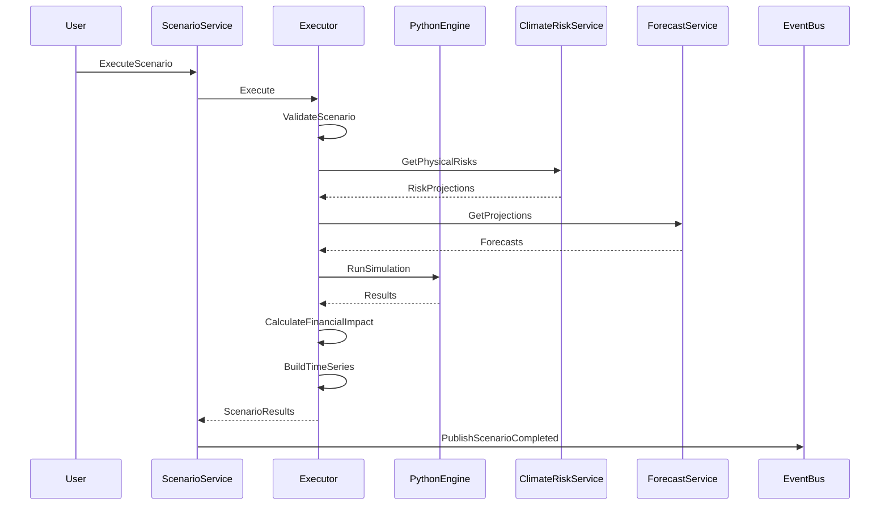
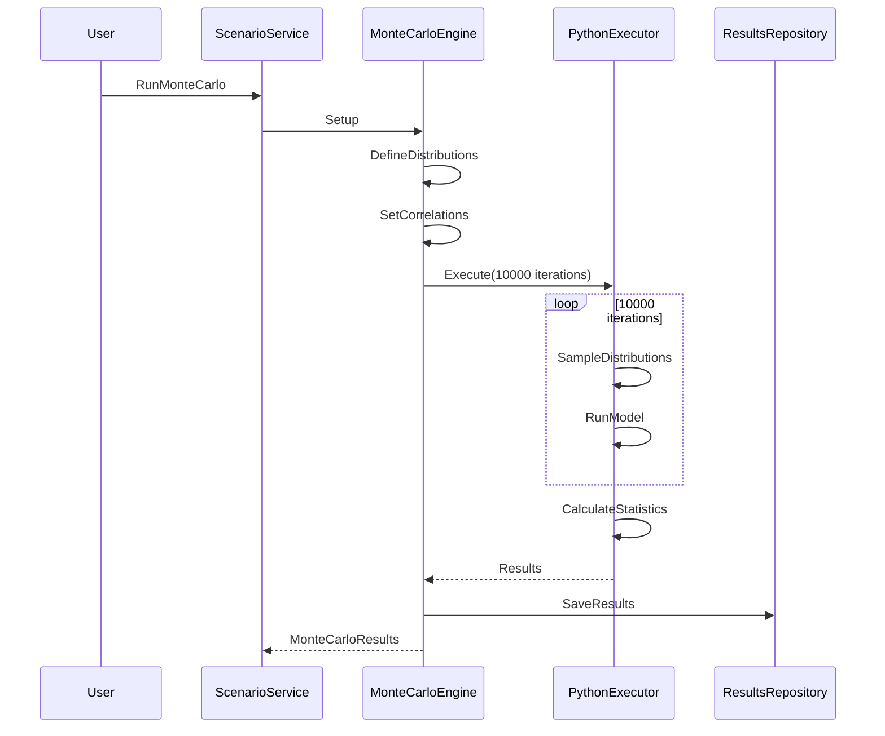

# Scenario Service Specification

## Service Overview

**Service Name**: Scenario Service
**Port**: 3048
**Phase**: 6 - Analytics & ML Domain (Scenario Analysis & Modeling)
**Story Points**: 40
**Dependencies**: Climate Risk Service, Forecast Service, Strategy Service, Carbon Service, ML Service
**Technology Stack**: NestJS, Python (NumPy, SciPy, pandas), MongoDB, InfluxDB (time-series), Redis, TensorFlow (ML models)
**Business Criticality**: HIGH - Strategic Planning & TCFD Compliance

### Service Context

The Scenario Service is the scenario analysis and modeling platform for Clenergize V3, providing comprehensive what-if analysis, climate scenario modeling, stress testing, and strategic planning capabilities. As scenario analysis becomes a critical requirement for TCFD disclosure and strategic ESG planning, this service enables organizations to model multiple futures, assess risks and opportunities, and develop resilient strategies.

### Business Value

- **Climate Scenario Analysis**: TCFD-aligned climate scenarios (NGFS, IEA, IPCC pathways)
- **Strategic Planning**: Business scenario modeling for ESG strategy development
- **What-If Analysis**: Parameter sensitivity and impact analysis
- **Stress Testing**: Extreme scenario and worst-case analysis
- **Pathway Modeling**: Decarbonization pathway and mitigation strategy modeling
- **Risk Assessment**: Multi-scenario risk quantification
- **Financial Impact**: Revenue, cost, and investment impact modeling under different scenarios
- **Compliance**: TCFD scenario analysis disclosure requirements

## Core Requirements

### Functional Requirements

#### Climate Scenario Analysis
- TCFD-aligned climate scenarios (NGFS, IEA, IPCC)
- Temperature pathway scenarios (1.5°C, 2°C, 3°C, 4°C warming)
- Transition risk scenarios (orderly, disorderly, hot house world)
- Physical risk scenarios (chronic and acute hazards)
- Carbon pricing scenarios (carbon tax, ETS evolution)
- Policy scenario modeling (regulatory changes)
- Technology scenario modeling (breakthrough innovations)
- Sector-specific climate scenarios

#### Business Scenario Modeling
- Growth scenarios (base, optimistic, pessimistic)
- Market scenarios (expansion, contraction, disruption)
- Competitive scenarios (market share changes)
- Technology disruption scenarios
- Regulatory change scenarios
- Supply chain disruption scenarios
- Macroeconomic scenarios (recession, inflation, etc.)
- ESG investment scenarios

#### What-If Analysis
- Parameter sensitivity analysis
- Multi-parameter variation modeling
- Tornado diagrams (variable impact ranking)
- Spider plots (sensitivity visualization)
- Threshold analysis (tipping points)
- Scenario branching and dependencies
- Custom parameter ranges
- Interactive scenario exploration

#### Stress Testing
- Extreme scenario analysis
- Worst-case modeling
- Black swan event simulation
- Compound risk scenarios
- System resilience testing
- Recovery pathway modeling
- Breaking point analysis
- Tail risk quantification

#### Decarbonization Pathway Modeling
- Net-zero pathway scenarios
- SBTi-aligned reduction scenarios
- Technology transition pathways
- Renewable energy adoption scenarios
- Carbon removal scenarios (CDR, CCUS)
- Interim target scenarios (2025, 2030, 2035, 2040)
- Sectoral decarbonization pathways
- Investment requirement modeling

#### Mitigation Strategy Modeling
- Intervention effectiveness modeling
- Cost-benefit analysis of mitigation measures
- Portfolio optimization (intervention mix)
- Timing and sequencing analysis
- Resource allocation scenarios
- Technology adoption scenarios
- Behavioral change scenarios
- Policy intervention scenarios

#### Financial Impact Modeling
- Revenue impact modeling
- Cost impact modeling (OpEx, CapEx)
- Carbon pricing impact
- Investment requirement modeling
- Stranded asset analysis
- Opportunity cost modeling
- ROI under different scenarios
- NPV and IRR sensitivity

#### Monte Carlo Simulation
- Probabilistic scenario analysis
- Multi-variate Monte Carlo
- Distribution fitting (normal, lognormal, triangular, etc.)
- Confidence intervals and percentiles
- Risk distribution modeling
- Correlation handling
- Convergence analysis
- 10,000+ iteration simulations

#### Scenario Comparison
- Side-by-side scenario comparison
- Divergence point analysis
- Sensitivity comparison
- Risk-return trade-off analysis
- Optimal scenario identification
- Scenario ranking and scoring
- Visual comparison dashboards
- Decision support matrices

#### Scenario Library Management
- Pre-built scenario templates
- Custom scenario creation
- Scenario versioning and history
- Scenario sharing and collaboration
- Scenario archiving
- Scenario cloning and modification
- Scenario metadata and tagging
- Scenario approval workflows

### Non-Functional Requirements

#### Performance
- Scenario run completion < 30 seconds (standard scenario)
- Monte Carlo simulation < 60 seconds (10,000 iterations)
- What-if analysis < 5 seconds (single parameter)
- Scenario comparison < 10 seconds (up to 10 scenarios)
- Dashboard load time < 2 seconds
- API response time < 200ms (metadata queries)
- Concurrent scenario execution support (10+ users)
- Large-scale scenario batching (100+ scenarios)

#### Security
- SOC 2 Type II compliance
- Encryption for scenario data (sensitive business assumptions)
- Role-based access control (scenario visibility)
- Audit trail for all scenario operations
- Secure API authentication (service-to-service)
- Data lineage tracking (assumptions → results)

#### Scalability
- Support for 10,000+ scenarios per organization
- 1,000+ parameters per scenario
- 50-year projection horizon
- Multi-dimensional analysis (5+ dimensions)
- Large organization modeling (10,000+ locations)
- Parallel scenario execution

#### Reliability
- 99.9% uptime for scenario service
- Scenario result persistence (no data loss)
- Graceful degradation for complex scenarios
- Automatic retry for failed simulations
- Point-in-time scenario recovery

## Data Models

### Core Entities

```typescript
// Scenario Entity
interface Scenario {
  id: string;
  organizationId: string;
  scenarioId: string; // Human-readable ID (e.g., "SCEN-2025-NET-ZERO")

  // Basic Information
  name: string;
  description: string;
  type: ScenarioType;
  category: ScenarioCategory;
  purpose: string;

  // Scenario Metadata
  baseYear: number;
  targetYear: number;
  projectionHorizon: number; // years
  geographicScope: GeographicScope;
  operationalScope: string[];

  // Climate Scenario (if applicable)
  climateScenario?: ClimateScenario;
  temperaturePathway?: TemperaturePathway;
  transitionRiskType?: TransitionRiskType;
  physicalRiskLevel?: PhysicalRiskLevel;

  // Business Scenario (if applicable)
  businessScenario?: BusinessScenario;
  growthAssumption?: GrowthAssumption;
  marketConditions?: MarketConditions;

  // Parameters
  parameters: ScenarioParameter[];
  assumptions: ScenarioAssumption[];
  variables: ScenarioVariable[];

  // Dependencies
  baselineScenarioId?: string; // Scenario used as baseline for comparison
  parentScenarioId?: string; // For scenario variants
  linkedScenarios: string[]; // Related scenarios

  // Execution
  executionStatus: ScenarioExecutionStatus;
  lastRunAt?: Date;
  executionDuration?: number; // milliseconds
  convergenceStatus?: ConvergenceStatus;

  // Results
  results?: ScenarioResults;
  outputMetrics: ScenarioMetric[];
  keyFindings: KeyFinding[];
  risks: ScenarioRisk[];
  opportunities: ScenarioOpportunity[];

  // Analysis
  sensitivityAnalysis?: SensitivityAnalysis;
  monteCarloResults?: MonteCarloResults;
  stressTestResults?: StressTestResults;

  // Validation
  validated: boolean;
  validatedBy?: string;
  validatedAt?: Date;
  validationNotes?: string;

  // Approval
  approvalStatus: ApprovalStatus;
  approvedBy?: string;
  approvedAt?: Date;
  approvalNotes?: string;

  // Collaboration
  owner: string;
  contributors: string[];
  sharedWith: string[];
  visibility: 'Private' | 'Team' | 'Organization' | 'Public';

  // Versioning
  version: number;
  versionHistory: ScenarioVersion[];
  clonedFrom?: string;

  // Metadata
  createdAt: Date;
  createdBy: string;
  updatedAt: Date;
  updatedBy: string;
  tags: string[];
  attachments: Attachment[];
}

// Scenario Type
enum ScenarioType {
  CLIMATE = 'Climate Scenario',
  BUSINESS = 'Business Scenario',
  COMBINED = 'Combined Scenario',
  STRESS_TEST = 'Stress Test',
  WHAT_IF = 'What-If Analysis',
  PATHWAY = 'Decarbonization Pathway',
  MITIGATION = 'Mitigation Strategy',
  MONTE_CARLO = 'Monte Carlo Simulation',
  CUSTOM = 'Custom Scenario'
}

// Scenario Category
enum ScenarioCategory {
  TCFD_DISCLOSURE = 'TCFD Disclosure',
  STRATEGIC_PLANNING = 'Strategic Planning',
  RISK_ASSESSMENT = 'Risk Assessment',
  TARGET_SETTING = 'Target Setting',
  INVESTMENT_PLANNING = 'Investment Planning',
  REGULATORY_COMPLIANCE = 'Regulatory Compliance',
  STAKEHOLDER_ENGAGEMENT = 'Stakeholder Engagement',
  INTERNAL_ANALYSIS = 'Internal Analysis'
}

// Climate Scenario
interface ClimateScenario {
  framework: 'NGFS' | 'IEA' | 'IPCC' | 'Custom';
  scenarioName: string;
  narrative: string;

  // NGFS Scenarios
  ngfsScenario?: NGFSScenario;

  // IEA Scenarios
  ieaScenario?: IEAScenario;

  // IPCC Scenarios
  ipccScenario?: IPCCScenario;

  // Temperature
  temperaturePathway: TemperaturePathway;
  peakWarmingYear?: number;
  endOfCenturyWarming: number; // degrees Celsius above pre-industrial

  // Carbon Budget
  remainingCarbonBudget: number; // GtCO2
  netZeroYear?: number;

  // Physical Risks
  physicalRisks: PhysicalRiskProjection[];

  // Transition Risks
  transitionRisks: TransitionRiskProjection[];
}

// NGFS Scenarios (Network for Greening the Financial System)
enum NGFSScenario {
  ORDERLY_NET_ZERO_2050 = 'Net Zero 2050',
  ORDERLY_BELOW_2C = 'Below 2°C',
  DISORDERLY_DELAYED_TRANSITION = 'Delayed Transition',
  DISORDERLY_DIVERGENT_NET_ZERO = 'Divergent Net Zero',
  HOT_HOUSE_CURRENT_POLICIES = 'Current Policies',
  HOT_HOUSE_NDC = 'NDCs'
}

// IEA Scenarios (International Energy Agency)
enum IEAScenario {
  NET_ZERO_2050 = 'Net Zero Emissions by 2050',
  ANNOUNCED_PLEDGES = 'Announced Pledges Scenario',
  STATED_POLICIES = 'Stated Policies Scenario'
}

// IPCC Scenarios
enum IPCCScenario {
  SSP1_1_9 = 'SSP1-1.9 (1.5°C)',
  SSP1_2_6 = 'SSP1-2.6 (Well below 2°C)',
  SSP2_4_5 = 'SSP2-4.5 (Middle of the road)',
  SSP3_7_0 = 'SSP3-7.0 (Regional rivalry)',
  SSP5_8_5 = 'SSP5-8.5 (High emissions)'
}

// Temperature Pathway
enum TemperaturePathway {
  ONE_FIVE_C = '1.5°C',
  TWO_C = '2°C',
  THREE_C = '3°C',
  FOUR_C = '4°C',
  FOUR_PLUS_C = '4°C+'
}

// Transition Risk Type
enum TransitionRiskType {
  ORDERLY = 'Orderly Transition',
  DISORDERLY = 'Disorderly Transition',
  HOT_HOUSE = 'Hot House World'
}

// Physical Risk Level
enum PhysicalRiskLevel {
  LOW = 'Low',
  MODERATE = 'Moderate',
  HIGH = 'High',
  EXTREME = 'Extreme'
}

// Physical Risk Projection
interface PhysicalRiskProjection {
  riskType: PhysicalRiskType;
  hazard: string;
  currentSeverity: number; // 0-100
  projectedSeverity: number; // 0-100
  year: number;
  probability: number; // 0-1
  impact: string;
  locations: string[];
  financialImpact?: number;
  currency?: string;
}

// Physical Risk Type
enum PhysicalRiskType {
  // Acute Risks
  TROPICAL_CYCLONE = 'Tropical Cyclone',
  FLOOD = 'Flood',
  WILDFIRE = 'Wildfire',
  DROUGHT = 'Drought',
  EXTREME_HEAT = 'Extreme Heat',
  EXTREME_COLD = 'Extreme Cold',

  // Chronic Risks
  SEA_LEVEL_RISE = 'Sea Level Rise',
  TEMPERATURE_RISE = 'Temperature Rise',
  PRECIPITATION_CHANGE = 'Precipitation Change',
  WATER_STRESS = 'Water Stress',
  ECOSYSTEM_COLLAPSE = 'Ecosystem Collapse'
}

// Transition Risk Projection
interface TransitionRiskProjection {
  riskType: TransitionRiskCategory;
  driver: string;
  currentImpact: number; // 0-100
  projectedImpact: number; // 0-100
  year: number;
  probability: number; // 0-1
  description: string;
  financialImpact?: number;
  currency?: string;
}

// Transition Risk Category
enum TransitionRiskCategory {
  POLICY_REGULATORY = 'Policy & Regulatory',
  TECHNOLOGY = 'Technology',
  MARKET = 'Market',
  REPUTATION = 'Reputation'
}

// Business Scenario
interface BusinessScenario {
  name: string;
  narrative: string;
  growthAssumption: GrowthAssumption;
  marketConditions: MarketConditions;
  competitiveEnvironment: CompetitiveEnvironment;
  regulatoryEnvironment: RegulatoryEnvironment;
  technologyTrends: TechnologyTrend[];
  macroeconomicAssumptions: MacroeconomicAssumptions;
}

// Growth Assumption
interface GrowthAssumption {
  revenueGrowthRate: number; // annual %
  marketShareChange: number; // annual %
  volumeGrowthRate: number; // annual %
  pricingAssumption: number; // annual %
  geographicExpansion: string[];
  productLineExpansion: string[];
}

// Market Conditions
interface MarketConditions {
  demandTrend: 'Growing' | 'Stable' | 'Declining';
  competitionLevel: 'Low' | 'Moderate' | 'High' | 'Intense';
  priceElasticity: number;
  customerPreferences: string[];
  regulatoryPressure: 'Low' | 'Moderate' | 'High';
  sustainabilityTrend: 'Increasing' | 'Stable' | 'Decreasing';
}

// Scenario Parameter
interface ScenarioParameter {
  id: string;
  name: string;
  description: string;
  category: ParameterCategory;
  dataType: 'Number' | 'Percentage' | 'Currency' | 'Text' | 'Boolean' | 'Date';

  // Value
  baseValue: any;
  scenarioValue: any;
  unit?: string;

  // Range (for sensitivity analysis)
  minValue?: any;
  maxValue?: any;
  step?: number;

  // Distribution (for Monte Carlo)
  distribution?: ProbabilityDistribution;

  // Relationships
  dependencies: ParameterDependency[];

  // Validation
  validationRules: ValidationRule[];

  // Metadata
  source: string;
  confidence: 'Low' | 'Medium' | 'High';
  lastUpdated: Date;
  updatedBy: string;
}

// Parameter Category
enum ParameterCategory {
  CLIMATE = 'Climate',
  CARBON_PRICE = 'Carbon Pricing',
  ENERGY = 'Energy',
  FINANCIAL = 'Financial',
  OPERATIONAL = 'Operational',
  MARKET = 'Market',
  REGULATORY = 'Regulatory',
  TECHNOLOGY = 'Technology',
  BEHAVIORAL = 'Behavioral'
}

// Probability Distribution
interface ProbabilityDistribution {
  type: DistributionType;
  parameters: { [key: string]: number };
  min?: number;
  max?: number;
  mean?: number;
  stdDev?: number;
  mode?: number; // For triangular distribution
}

// Distribution Type
enum DistributionType {
  NORMAL = 'Normal',
  LOGNORMAL = 'Lognormal',
  UNIFORM = 'Uniform',
  TRIANGULAR = 'Triangular',
  BETA = 'Beta',
  EXPONENTIAL = 'Exponential',
  CUSTOM = 'Custom'
}

// Parameter Dependency
interface ParameterDependency {
  parameterId: string;
  relationship: 'Linear' | 'Exponential' | 'Logarithmic' | 'Custom';
  formula?: string;
  correlationCoefficient?: number; // For Monte Carlo
}

// Scenario Results
interface ScenarioResults {
  executionId: string;
  executedAt: Date;
  executionDuration: number; // milliseconds

  // Time Series Results
  timeSeries: TimeSeriesResult[];

  // Summary Metrics
  summaryMetrics: { [metric: string]: SummaryMetric };

  // Financial Results
  financialResults: FinancialResults;

  // Environmental Results
  environmentalResults: EnvironmentalResults;

  // Risk Results
  riskResults: RiskResults;

  // Convergence (for iterative simulations)
  convergence: {
    converged: boolean;
    iterations: number;
    tolerance: number;
  };
}

// Time Series Result
interface TimeSeriesResult {
  metric: string;
  unit: string;
  values: TimeSeriesDataPoint[];
  trend: 'Increasing' | 'Decreasing' | 'Stable' | 'Volatile';
  compoundAnnualGrowthRate?: number; // %
}

// Time Series Data Point
interface TimeSeriesDataPoint {
  year: number;
  value: number;
  confidence?: {
    lower: number; // p10
    upper: number; // p90
  };
}

// Summary Metric
interface SummaryMetric {
  value: number;
  unit: string;
  changeFromBaseline?: number; // %
  changeFromPrevious?: number; // %
  trend: 'Increasing' | 'Decreasing' | 'Stable';
}

// Financial Results
interface FinancialResults {
  // Revenue Impact
  revenueImpact: {
    baselineRevenue: number;
    scenarioRevenue: number;
    change: number; // %
    npv: number;
    currency: string;
  };

  // Cost Impact
  costImpact: {
    baselineCost: number;
    scenarioCost: number;
    change: number; // %
    breakdown: { [category: string]: number };
    currency: string;
  };

  // Carbon Pricing Impact
  carbonPriceImpact?: {
    carbonPrice: number; // per tCO2e
    totalEmissions: number; // tCO2e
    totalCost: number;
    currency: string;
  };

  // Investment Requirements
  investmentRequirements: {
    capex: number;
    opex: number;
    total: number;
    breakdown: { [category: string]: number };
    currency: string;
  };

  // ROI
  roi: {
    irr: number; // %
    npv: number;
    paybackPeriod: number; // years
    benefitCostRatio: number;
  };
}

// Environmental Results
interface EnvironmentalResults {
  // Emissions
  emissions: {
    scope1: number;
    scope2: number;
    scope3: number;
    total: number;
    changeFromBaseline: number; // %
    netZeroYear?: number;
    unit: 'tCO2e';
  };

  // Energy
  energy?: {
    totalConsumption: number;
    renewableShare: number; // %
    unit: 'MWh';
  };

  // Water
  water?: {
    totalConsumption: number;
    unit: 'm3';
  };

  // Waste
  waste?: {
    totalGenerated: number;
    recyclingRate: number; // %
    unit: 'tonnes';
  };
}

// Risk Results
interface RiskResults {
  // Overall Risk Score
  overallRiskScore: number; // 0-100
  riskLevel: 'Low' | 'Medium' | 'High' | 'Critical';

  // Risk Breakdown
  transitionRisks: RiskScore[];
  physicalRisks: RiskScore[];

  // Financial Risk
  valueAtRisk: {
    var95: number; // 95th percentile
    var99: number; // 99th percentile
    cvar: number; // Conditional VaR
    currency: string;
  };

  // Stranded Assets
  strandedAssets?: {
    totalValue: number;
    assetTypes: { [type: string]: number };
    currency: string;
  };
}

// Risk Score
interface RiskScore {
  riskType: string;
  score: number; // 0-100
  probability: number; // 0-1
  impact: number; // 0-100
  financialImpact?: number;
  mitigationPotential: number; // 0-100
}

// Sensitivity Analysis
interface SensitivityAnalysis {
  id: string;
  executedAt: Date;

  // Single Parameter Sensitivity
  parameterSensitivities: ParameterSensitivity[];

  // Tornado Diagram Data
  tornadoDiagram: TornadoData[];

  // Spider Plot Data
  spiderPlot: SpiderPlotData;

  // Threshold Analysis
  thresholds: ThresholdAnalysis[];
}

// Parameter Sensitivity
interface ParameterSensitivity {
  parameterId: string;
  parameterName: string;
  baseValue: number;

  // Sensitivity Results
  results: SensitivityResult[];

  // Elasticity
  elasticity: number; // % change in output / % change in input

  // Rank
  sensitivityRank: number; // 1 = most sensitive
}

// Sensitivity Result
interface SensitivityResult {
  parameterValue: number;
  outputValue: number;
  changeFromBase: number; // %
}

// Tornado Data (for tornado diagram)
interface TornadoData {
  parameterId: string;
  parameterName: string;
  lowValue: number;
  lowOutput: number;
  highValue: number;
  highOutput: number;
  range: number; // highOutput - lowOutput
}

// Spider Plot Data
interface SpiderPlotData {
  centerValue: number; // baseline
  parameters: SpiderParameter[];
}

// Spider Parameter
interface SpiderParameter {
  parameterId: string;
  parameterName: string;
  variations: SpiderVariation[];
}

// Spider Variation
interface SpiderVariation {
  percentChange: number; // e.g., -20, -10, 0, +10, +20
  outputValue: number;
}

// Threshold Analysis
interface ThresholdAnalysis {
  parameterId: string;
  parameterName: string;
  thresholdValue: number;
  thresholdType: 'Break-even' | 'Tipping Point' | 'Constraint';
  description: string;
  sensitivity: number;
}

// Monte Carlo Results
interface MonteCarloResults {
  id: string;
  executedAt: Date;
  iterations: number;
  convergenceStatus: ConvergenceStatus;

  // Output Distribution
  outputDistribution: {
    metric: string;
    mean: number;
    median: number;
    stdDev: number;
    min: number;
    max: number;
    percentiles: {
      p10: number;
      p25: number;
      p50: number;
      p75: number;
      p90: number;
      p95: number;
      p99: number;
    };
    histogram: HistogramBin[];
  }[];

  // Probability Analysis
  probabilityAnalysis: {
    targetValue: number;
    probabilityAbove: number; // %
    probabilityBelow: number; // %
    probabilityWithin: number; // % (within confidence interval)
  }[];

  // Correlation Analysis
  correlationMatrix: { [param1: string]: { [param2: string]: number } };

  // Risk Metrics
  riskMetrics: {
    valueAtRisk95: number;
    valueAtRisk99: number;
    conditionalVaR: number;
    probabilityOfLoss: number; // %
  };
}

// Convergence Status
interface ConvergenceStatus {
  converged: boolean;
  iterations: number;
  targetIterations: number;
  tolerance: number;
  actualTolerance: number;
}

// Histogram Bin
interface HistogramBin {
  binStart: number;
  binEnd: number;
  count: number;
  frequency: number; // %
}

// Stress Test Results
interface StressTestResults {
  id: string;
  stressTestName: string;
  executedAt: Date;

  // Stress Scenarios
  stressScenarios: StressScenario[];

  // Breaking Points
  breakingPoints: BreakingPoint[];

  // Recovery Analysis
  recoveryAnalysis: RecoveryAnalysis;

  // Resilience Score
  resilienceScore: number; // 0-100
}

// Stress Scenario
interface StressScenario {
  name: string;
  description: string;
  severity: 'Moderate' | 'Severe' | 'Extreme';

  // Stress Parameters
  stressedParameters: {
    parameterId: string;
    baseValue: number;
    stressedValue: number;
    shock: number; // %
  }[];

  // Results
  outputValue: number;
  changeFromBaseline: number; // %
  financialImpact: number;
  survived: boolean;
}

// Breaking Point
interface BreakingPoint {
  parameterId: string;
  parameterName: string;
  breakingValue: number;
  baseValue: number;
  shockRequired: number; // %
  description: string;
  mitigationOptions: string[];
}

// Recovery Analysis
interface RecoveryAnalysis {
  recoveryTime: number; // years
  recoveryPath: RecoveryPathPoint[];
  recoveryProbability: number; // %
  residualImpact: number; // %
}

// Recovery Path Point
interface RecoveryPathPoint {
  year: number;
  recoveryProgress: number; // % of full recovery
}

// Scenario Comparison
interface ScenarioComparison {
  id: string;
  name: string;
  description: string;
  scenarioIds: string[];

  // Comparison Metrics
  comparisonMetrics: ComparisonMetric[];

  // Divergence Analysis
  divergencePoints: DivergencePoint[];

  // Ranking
  scenarioRanking: ScenarioRank[];

  // Decision Matrix
  decisionMatrix: DecisionMatrixEntry[];

  // Generated At
  generatedAt: Date;
  generatedBy: string;
}

// Comparison Metric
interface ComparisonMetric {
  metricName: string;
  unit: string;
  scenarioValues: { [scenarioId: string]: number };
  bestScenarioId: string;
  worstScenarioId: string;
  range: number;
  varianceCoefficient: number; // %
}

// Divergence Point
interface DivergencePoint {
  year: number;
  metric: string;
  scenarios: { [scenarioId: string]: number };
  divergence: number; // max - min
  significanceLevel: 'Low' | 'Medium' | 'High';
  explanation: string;
}

// Scenario Rank
interface ScenarioRank {
  scenarioId: string;
  rank: number;
  score: number; // 0-100
  criteria: { [criterion: string]: number };
  strengths: string[];
  weaknesses: string[];
}

// Decision Matrix Entry
interface DecisionMatrixEntry {
  criterion: string;
  weight: number; // 0-1
  scenarioScores: { [scenarioId: string]: number }; // 0-100
  weightedScores: { [scenarioId: string]: number };
}

// Scenario Execution Status
enum ScenarioExecutionStatus {
  DRAFT = 'Draft',
  QUEUED = 'Queued',
  RUNNING = 'Running',
  COMPLETED = 'Completed',
  FAILED = 'Failed',
  CANCELLED = 'Cancelled'
}

// Approval Status
enum ApprovalStatus {
  PENDING = 'Pending Approval',
  APPROVED = 'Approved',
  REJECTED = 'Rejected',
  NOT_REQUIRED = 'Not Required'
}

// Scenario Version
interface ScenarioVersion {
  version: number;
  createdAt: Date;
  createdBy: string;
  changes: string;
  snapshot: Partial<Scenario>; // Snapshot of key fields
}
```

## API Endpoints

### Scenario Management

```typescript
// Scenario CRUD
POST   /api/v1/scenarios                    // Create scenario
GET    /api/v1/scenarios                    // List scenarios
GET    /api/v1/scenarios/:id                // Get scenario details
PUT    /api/v1/scenarios/:id                // Update scenario
DELETE /api/v1/scenarios/:id                // Delete scenario

// Scenario Templates
GET    /api/v1/scenarios/templates          // Get scenario templates
GET    /api/v1/scenarios/templates/:type    // Get templates by type
POST   /api/v1/scenarios/from-template      // Create from template

// Scenario Versioning
GET    /api/v1/scenarios/:id/versions       // Get version history
POST   /api/v1/scenarios/:id/versions       // Create new version
GET    /api/v1/scenarios/:id/versions/:ver  // Get specific version
POST   /api/v1/scenarios/:id/revert/:ver    // Revert to version

// Scenario Cloning
POST   /api/v1/scenarios/:id/clone          // Clone scenario
POST   /api/v1/scenarios/:id/clone-and-modify // Clone with modifications
```

### Climate Scenario Modeling

```typescript
// Climate Scenarios
POST   /api/v1/climate-scenarios            // Create climate scenario
GET    /api/v1/climate-scenarios/frameworks // Get available frameworks (NGFS, IEA, IPCC)
GET    /api/v1/climate-scenarios/templates  // Get climate scenario templates
POST   /api/v1/climate-scenarios/tcfd       // Create TCFD-aligned scenario

// Temperature Pathways
GET    /api/v1/climate-scenarios/pathways   // Get temperature pathways
POST   /api/v1/climate-scenarios/pathway/:temp // Model specific pathway

// Physical Risks
POST   /api/v1/climate-scenarios/:id/physical-risks // Model physical risks
GET    /api/v1/climate-scenarios/:id/hazards        // Get hazard projections

// Transition Risks
POST   /api/v1/climate-scenarios/:id/transition-risks // Model transition risks
GET    /api/v1/climate-scenarios/:id/carbon-pricing  // Get carbon price scenarios
```

### Business Scenario Modeling

```typescript
// Business Scenarios
POST   /api/v1/business-scenarios           // Create business scenario
GET    /api/v1/business-scenarios           // List business scenarios
PUT    /api/v1/business-scenarios/:id       // Update business scenario

// Growth Scenarios
POST   /api/v1/business-scenarios/growth    // Model growth scenarios
POST   /api/v1/business-scenarios/market    // Model market scenarios
POST   /api/v1/business-scenarios/competitive // Model competitive scenarios

// Macroeconomic Scenarios
POST   /api/v1/business-scenarios/macro     // Model macroeconomic scenarios
GET    /api/v1/business-scenarios/assumptions // Get economic assumptions
```

### Scenario Execution

```typescript
// Execute Scenarios
POST   /api/v1/scenarios/:id/execute        // Execute scenario
GET    /api/v1/scenarios/:id/status         // Get execution status
POST   /api/v1/scenarios/:id/cancel         // Cancel execution
POST   /api/v1/scenarios/batch-execute      // Execute multiple scenarios

// Results
GET    /api/v1/scenarios/:id/results        // Get scenario results
GET    /api/v1/scenarios/:id/results/time-series // Get time series results
GET    /api/v1/scenarios/:id/results/summary     // Get summary metrics
GET    /api/v1/scenarios/:id/results/financial   // Get financial results
GET    /api/v1/scenarios/:id/results/environmental // Get environmental results
```

### What-If Analysis

```typescript
// What-If Analysis
POST   /api/v1/what-if/analyze              // Run what-if analysis
POST   /api/v1/what-if/single-parameter     // Single parameter variation
POST   /api/v1/what-if/multi-parameter      // Multi-parameter variation

// Sensitivity Analysis
POST   /api/v1/sensitivity/analyze          // Run sensitivity analysis
GET    /api/v1/sensitivity/:id/results      // Get sensitivity results
GET    /api/v1/sensitivity/:id/tornado      // Get tornado diagram data
GET    /api/v1/sensitivity/:id/spider       // Get spider plot data

// Threshold Analysis
POST   /api/v1/threshold/analyze            // Find thresholds
GET    /api/v1/threshold/:id/breaking-points // Get breaking points
```

### Stress Testing

```typescript
// Stress Tests
POST   /api/v1/stress-tests                 // Create stress test
GET    /api/v1/stress-tests                 // List stress tests
POST   /api/v1/stress-tests/:id/execute     // Execute stress test

// Stress Scenarios
POST   /api/v1/stress-tests/:id/scenarios   // Add stress scenario
GET    /api/v1/stress-tests/:id/scenarios   // Get stress scenarios
PUT    /api/v1/stress-tests/scenarios/:sid  // Update stress scenario

// Results
GET    /api/v1/stress-tests/:id/results     // Get stress test results
GET    /api/v1/stress-tests/:id/resilience  // Get resilience score
GET    /api/v1/stress-tests/:id/recovery    // Get recovery analysis
```

### Monte Carlo Simulation

```typescript
// Monte Carlo Setup
POST   /api/v1/monte-carlo/setup            // Setup Monte Carlo simulation
POST   /api/v1/monte-carlo/distributions    // Define parameter distributions
POST   /api/v1/monte-carlo/correlations     // Define parameter correlations

// Execute
POST   /api/v1/monte-carlo/:id/execute      // Execute simulation
GET    /api/v1/monte-carlo/:id/status       // Get execution status
GET    /api/v1/monte-carlo/:id/convergence  // Check convergence

// Results
GET    /api/v1/monte-carlo/:id/results      // Get simulation results
GET    /api/v1/monte-carlo/:id/distribution // Get output distribution
GET    /api/v1/monte-carlo/:id/percentiles  // Get percentiles
GET    /api/v1/monte-carlo/:id/var          // Get Value at Risk
GET    /api/v1/monte-carlo/:id/correlation-matrix // Get correlation matrix
```

### Decarbonization Pathway Modeling

```typescript
// Pathways
POST   /api/v1/pathways/net-zero            // Create net-zero pathway
POST   /api/v1/pathways/sbti                // Create SBTi-aligned pathway
POST   /api/v1/pathways/custom              // Create custom pathway

// Pathway Analysis
GET    /api/v1/pathways/:id/trajectory      // Get emissions trajectory
GET    /api/v1/pathways/:id/milestones      // Get interim milestones
GET    /api/v1/pathways/:id/investments     // Get investment requirements
GET    /api/v1/pathways/:id/feasibility     // Assess pathway feasibility

// Mitigation Strategies
POST   /api/v1/pathways/:id/interventions   // Add mitigation interventions
GET    /api/v1/pathways/:id/interventions   // Get interventions
POST   /api/v1/pathways/:id/optimize        // Optimize intervention mix
```

### Scenario Comparison

```typescript
// Comparison
POST   /api/v1/comparisons                  // Create comparison
GET    /api/v1/comparisons/:id              // Get comparison results
POST   /api/v1/comparisons/:id/add-scenario // Add scenario to comparison
DELETE /api/v1/comparisons/:id/scenarios/:sid // Remove scenario

// Analysis
GET    /api/v1/comparisons/:id/metrics      // Get comparison metrics
GET    /api/v1/comparisons/:id/divergence   // Get divergence points
GET    /api/v1/comparisons/:id/ranking      // Get scenario ranking
GET    /api/v1/comparisons/:id/decision-matrix // Get decision matrix

// Visualization
GET    /api/v1/comparisons/:id/chart/time-series // Time series comparison
GET    /api/v1/comparisons/:id/chart/waterfall   // Waterfall chart
GET    /api/v1/comparisons/:id/chart/spider      // Spider/radar chart
```

### Parameter Management

```typescript
// Parameters
POST   /api/v1/parameters                   // Create parameter
GET    /api/v1/parameters                   // List parameters
GET    /api/v1/parameters/:id               // Get parameter details
PUT    /api/v1/parameters/:id               // Update parameter
DELETE /api/v1/parameters/:id               // Delete parameter

// Parameter Library
GET    /api/v1/parameters/library           // Get parameter library
GET    /api/v1/parameters/categories        // Get parameter categories
POST   /api/v1/parameters/import            // Import parameters

// Dependencies
POST   /api/v1/parameters/:id/dependencies  // Define dependencies
GET    /api/v1/parameters/:id/dependencies  // Get dependencies
GET    /api/v1/parameters/:id/impact-tree   // Get dependency tree
```

### Approval & Collaboration

```typescript
// Approval Workflow
POST   /api/v1/scenarios/:id/submit-approval // Submit for approval
POST   /api/v1/scenarios/:id/approve        // Approve scenario
POST   /api/v1/scenarios/:id/reject         // Reject scenario
GET    /api/v1/scenarios/pending-approval   // Get pending approvals

// Collaboration
POST   /api/v1/scenarios/:id/share          // Share scenario
POST   /api/v1/scenarios/:id/comment        // Add comment
GET    /api/v1/scenarios/:id/comments       // Get comments
POST   /api/v1/scenarios/:id/contributors   // Add contributors
```

### Reporting & Export

```typescript
// Reports
GET    /api/v1/reports/scenario/:id         // Generate scenario report
GET    /api/v1/reports/comparison/:id       // Generate comparison report
GET    /api/v1/reports/tcfd/:id             // Generate TCFD scenario report
GET    /api/v1/reports/sensitivity/:id      // Generate sensitivity report

// Export
GET    /api/v1/export/scenario/:id/excel    // Export to Excel
GET    /api/v1/export/scenario/:id/pdf      // Export to PDF
GET    /api/v1/export/scenario/:id/csv      // Export results to CSV
POST   /api/v1/export/scenarios/batch       // Batch export
```

### Dashboards & Analytics

```typescript
// Dashboards
GET    /api/v1/dashboards/scenarios         // Scenario overview dashboard
GET    /api/v1/dashboards/climate           // Climate scenario dashboard
GET    /api/v1/dashboards/stress-tests      // Stress test dashboard
GET    /api/v1/dashboards/pathways          // Pathway dashboard

// Analytics
GET    /api/v1/analytics/scenario-usage     // Scenario usage analytics
GET    /api/v1/analytics/popular-scenarios  // Most used scenarios
GET    /api/v1/analytics/parameter-impact   // Parameter impact analysis
POST   /api/v1/analytics/meta-analysis      // Cross-scenario analysis
```

## Service Architecture

### Component Structure

```
scenario-service/
├── src/
│   ├── domain/
│   │   ├── entities/
│   │   │   ├── scenario.entity.ts
│   │   │   ├── climate-scenario.entity.ts
│   │   │   ├── business-scenario.entity.ts
│   │   │   ├── parameter.entity.ts
│   │   │   ├── scenario-results.entity.ts
│   │   │   └── scenario-comparison.entity.ts
│   │   ├── value-objects/
│   │   │   ├── temperature-pathway.vo.ts
│   │   │   ├── probability-distribution.vo.ts
│   │   │   ├── risk-score.vo.ts
│   │   │   └── time-series.vo.ts
│   │   ├── events/
│   │   │   ├── scenario-created.event.ts
│   │   │   ├── scenario-executed.event.ts
│   │   │   ├── scenario-completed.event.ts
│   │   │   └── scenario-approved.event.ts
│   │   └── services/
│   │       ├── climate-scenario.service.ts
│   │       ├── scenario-executor.service.ts
│   │       ├── sensitivity-analyzer.service.ts
│   │       └── scenario-comparator.service.ts
│   │
│   ├── application/
│   │   ├── commands/
│   │   │   ├── create-scenario.command.ts
│   │   │   ├── execute-scenario.command.ts
│   │   │   ├── run-sensitivity.command.ts
│   │   │   ├── run-monte-carlo.command.ts
│   │   │   └── compare-scenarios.command.ts
│   │   ├── queries/
│   │   │   ├── get-scenario-results.query.ts
│   │   │   ├── get-sensitivity-results.query.ts
│   │   │   ├── get-comparison.query.ts
│   │   │   └── get-tcfd-scenarios.query.ts
│   │   ├── services/
│   │   │   ├── scenario-management.service.ts
│   │   │   ├── what-if-analysis.service.ts
│   │   │   ├── stress-test.service.ts
│   │   │   ├── monte-carlo.service.ts
│   │   │   └── pathway-modeling.service.ts
│   │   └── dto/
│   │       ├── create-scenario.dto.ts
│   │       ├── execute-scenario.dto.ts
│   │       ├── sensitivity-params.dto.ts
│   │       └── comparison-params.dto.ts
│   │
│   ├── infrastructure/
│   │   ├── persistence/
│   │   │   ├── repositories/
│   │   │   │   ├── scenario.repository.ts
│   │   │   │   ├── parameter.repository.ts
│   │   │   │   └── results.repository.ts
│   │   │   ├── schemas/
│   │   │   │   ├── scenario.schema.ts
│   │   │   │   ├── parameter.schema.ts
│   │   │   │   └── results.schema.ts
│   │   │   └── migrations/
│   │   ├── timeseries/
│   │   │   ├── influxdb.service.ts
│   │   │   ├── timeseries.repository.ts
│   │   │   └── queries/
│   │   ├── computation/
│   │   │   ├── python-executor.service.ts
│   │   │   ├── numpy-service.ts
│   │   │   ├── scipy-service.ts
│   │   │   └── monte-carlo-engine.py
│   │   ├── ml/
│   │   │   ├── forecast-model.service.ts
│   │   │   ├── scenario-optimizer.model.ts
│   │   │   └── climate-projection.model.ts
│   │   ├── integrations/
│   │   │   ├── climate-risk-client.ts
│   │   │   ├── forecast-client.ts
│   │   │   ├── carbon-client.ts
│   │   │   └── strategy-client.ts
│   │   └── messaging/
│   │       ├── event-publisher.ts
│   │       └── event-handlers/
│   │
│   ├── interfaces/
│   │   ├── rest/
│   │   │   ├── controllers/
│   │   │   │   ├── scenario.controller.ts
│   │   │   │   ├── climate-scenario.controller.ts
│   │   │   │   ├── sensitivity.controller.ts
│   │   │   │   ├── monte-carlo.controller.ts
│   │   │   │   └── comparison.controller.ts
│   │   │   └── middleware/
│   │   ├── graphql/
│   │   │   ├── resolvers/
│   │   │   └── schemas/
│   │   └── websocket/
│   │       ├── gateways/
│   │       └── handlers/
│   │
│   └── shared/
│       ├── constants/
│       │   ├── climate-scenarios.ts
│       │   ├── distributions.ts
│       │   └── frameworks.ts
│       ├── exceptions/
│       ├── utils/
│       │   ├── statistical-utils.ts
│       │   ├── interpolation-utils.ts
│       │   └── convergence-checker.ts
│       └── types/
│
├── python/
│   ├── monte_carlo/
│   │   ├── engine.py
│   │   ├── distributions.py
│   │   └── convergence.py
│   ├── sensitivity/
│   │   ├── analyzer.py
│   │   └── tornado.py
│   ├── optimization/
│   │   ├── pathway_optimizer.py
│   │   └── intervention_mix.py
│   └── climate/
│       ├── physical_risks.py
│       └── transition_risks.py
│
├── test/
│   ├── unit/
│   ├── integration/
│   └── e2e/
│
├── docs/
│   ├── api/
│   ├── architecture/
│   └── guides/
│
└── package.json
```

## Implementation Details

### Climate Scenario Engine

```typescript
export class ClimateScenarioService {
  // Create TCFD-aligned climate scenario
  async createTCFDScenario(
    organizationId: string,
    framework: 'NGFS' | 'IEA' | 'IPCC',
    scenarioName: string
  ): Promise<Scenario> {
    // Get climate scenario template
    const template = await this.getClimateTemplate(framework, scenarioName);

    // Create scenario
    const scenario: Scenario = {
      id: uuidv4(),
      organizationId,
      scenarioId: this.generateScenarioId(scenarioName),
      name: `${framework} - ${scenarioName}`,
      description: template.narrative,
      type: ScenarioType.CLIMATE,
      category: ScenarioCategory.TCFD_DISCLOSURE,
      purpose: 'TCFD climate scenario analysis',
      baseYear: new Date().getFullYear(),
      targetYear: 2050,
      projectionHorizon: 30,
      geographicScope: GeographicScope.GLOBAL,
      operationalScope: ['All operations'],
      climateScenario: {
        framework,
        scenarioName,
        narrative: template.narrative,
        temperaturePathway: template.temperaturePathway,
        endOfCenturyWarming: template.endOfCenturyWarming,
        remainingCarbonBudget: template.carbonBudget,
        netZeroYear: template.netZeroYear,
        physicalRisks: await this.modelPhysicalRisks(template),
        transitionRisks: await this.modelTransitionRisks(template)
      },
      parameters: await this.initializeClimateParameters(template),
      executionStatus: ScenarioExecutionStatus.DRAFT,
      outputMetrics: [],
      keyFindings: [],
      risks: [],
      opportunities: [],
      validated: false,
      approvalStatus: ApprovalStatus.NOT_REQUIRED,
      owner: 'system',
      contributors: [],
      sharedWith: [],
      visibility: 'Organization',
      version: 1,
      versionHistory: [],
      createdAt: new Date(),
      createdBy: 'system',
      updatedAt: new Date(),
      updatedBy: 'system',
      tags: ['TCFD', 'Climate', framework]
    };

    await this.scenarioRepository.save(scenario);

    // Publish event
    await this.eventBus.publish(new ScenarioCreatedEvent(scenario));

    return scenario;
  }

  // Model physical risks
  private async modelPhysicalRisks(
    template: ClimateTemplate
  ): Promise<PhysicalRiskProjection[]> {
    const organizationLocations = await this.getOrganizationLocations();
    const projections: PhysicalRiskProjection[] = [];

    for (const location of organizationLocations) {
      // Get climate hazard data for location
      const hazards = await this.climateRiskClient.getHazards(
        location.coordinates,
        template.temperaturePathway
      );

      for (const hazard of hazards) {
        projections.push({
          riskType: this.mapHazardToRiskType(hazard.type),
          hazard: hazard.name,
          currentSeverity: hazard.currentSeverity,
          projectedSeverity: hazard.projectedSeverity,
          year: 2050,
          probability: hazard.probability,
          impact: hazard.impact,
          locations: [location.name],
          financialImpact: await this.estimateFinancialImpact(hazard, location),
          currency: 'USD'
        });
      }
    }

    return projections;
  }

  // Model transition risks
  private async modelTransitionRisks(
    template: ClimateTemplate
  ): Promise<TransitionRiskProjection[]> {
    const projections: TransitionRiskProjection[] = [];

    // Policy & Regulatory Risks
    const carbonPrice = this.getCarbonPriceScenario(template);
    projections.push({
      riskType: TransitionRiskCategory.POLICY_REGULATORY,
      driver: 'Carbon Pricing',
      currentImpact: 0,
      projectedImpact: 80,
      year: 2030,
      probability: 0.9,
      description: `Carbon price reaches $${carbonPrice} per tCO2e by 2030`,
      financialImpact: await this.calculateCarbonPriceImpact(carbonPrice),
      currency: 'USD'
    });

    // Technology Risks
    const renewableShare = this.getRenewableEnergyScenario(template);
    projections.push({
      riskType: TransitionRiskCategory.TECHNOLOGY,
      driver: 'Renewable Energy Transition',
      currentImpact: 20,
      projectedImpact: 70,
      year: 2040,
      probability: 0.85,
      description: `Renewable energy reaches ${renewableShare}% of energy mix`,
      financialImpact: await this.calculateRenewableTransitionImpact(renewableShare),
      currency: 'USD'
    });

    // Market Risks
    projections.push({
      riskType: TransitionRiskCategory.MARKET,
      driver: 'Customer Preferences',
      currentImpact: 30,
      projectedImpact: 75,
      year: 2035,
      probability: 0.75,
      description: 'Shift to low-carbon products and services',
      financialImpact: await this.calculateMarketShiftImpact(),
      currency: 'USD'
    });

    return projections;
  }

  // Get carbon price scenario
  private getCarbonPriceScenario(template: ClimateTemplate): number {
    // NGFS carbon price scenarios
    const carbonPriceMap: { [key: string]: number } = {
      [NGFSScenario.ORDERLY_NET_ZERO_2050]: 250,
      [NGFSScenario.ORDERLY_BELOW_2C]: 200,
      [NGFSScenario.DISORDERLY_DELAYED_TRANSITION]: 350,
      [NGFSScenario.DISORDERLY_DIVERGENT_NET_ZERO]: 300,
      [NGFSScenario.HOT_HOUSE_CURRENT_POLICIES]: 50,
      [NGFSScenario.HOT_HOUSE_NDC]: 100
    };

    return carbonPriceMap[template.ngfsScenario!] || 150;
  }
}
```

### Scenario Execution Engine

```typescript
export class ScenarioExecutor {
  // Execute scenario
  async execute(scenarioId: string): Promise<ScenarioResults> {
    const scenario = await this.scenarioRepository.findById(scenarioId);

    if (!scenario) {
      throw new NotFoundException(`Scenario ${scenarioId} not found`);
    }

    // Update status
    scenario.executionStatus = ScenarioExecutionStatus.RUNNING;
    await this.scenarioRepository.save(scenario);

    const startTime = Date.now();

    try {
      // Execute scenario based on type
      let results: ScenarioResults;

      switch (scenario.type) {
        case ScenarioType.CLIMATE:
          results = await this.executeClimateScenario(scenario);
          break;
        case ScenarioType.BUSINESS:
          results = await this.executeBusinessScenario(scenario);
          break;
        case ScenarioType.COMBINED:
          results = await this.executeCombinedScenario(scenario);
          break;
        case ScenarioType.STRESS_TEST:
          results = await this.executeStressTest(scenario);
          break;
        case ScenarioType.MONTE_CARLO:
          results = await this.executeMonteCarlo(scenario);
          break;
        default:
          results = await this.executeCustomScenario(scenario);
      }

      const executionDuration = Date.now() - startTime;

      // Update scenario with results
      scenario.results = results;
      scenario.executionStatus = ScenarioExecutionStatus.COMPLETED;
      scenario.lastRunAt = new Date();
      scenario.executionDuration = executionDuration;

      await this.scenarioRepository.save(scenario);

      // Publish event
      await this.eventBus.publish(new ScenarioCompletedEvent(scenario));

      return results;
    } catch (error) {
      scenario.executionStatus = ScenarioExecutionStatus.FAILED;
      await this.scenarioRepository.save(scenario);
      throw error;
    }
  }

  // Execute climate scenario
  private async executeClimateScenario(
    scenario: Scenario
  ): Promise<ScenarioResults> {
    const baseYear = scenario.baseYear;
    const targetYear = scenario.targetYear;
    const horizon = targetYear - baseYear;

    // Get baseline emissions
    const baselineEmissions = await this.carbonClient.getEmissions(
      scenario.organizationId,
      baseYear
    );

    // Project emissions under climate scenario
    const emissionsProjection = await this.projectEmissions(
      baselineEmissions,
      scenario.climateScenario!,
      horizon
    );

    // Calculate financial impacts
    const financialImpact = await this.calculateFinancialImpact(
      scenario,
      emissionsProjection
    );

    // Calculate environmental results
    const environmentalResults: EnvironmentalResults = {
      emissions: {
        scope1: emissionsProjection[horizon].scope1,
        scope2: emissionsProjection[horizon].scope2,
        scope3: emissionsProjection[horizon].scope3,
        total: emissionsProjection[horizon].total,
        changeFromBaseline: this.calculateChange(
          baselineEmissions.total,
          emissionsProjection[horizon].total
        ),
        netZeroYear: this.findNetZeroYear(emissionsProjection),
        unit: 'tCO2e'
      }
    };

    // Calculate risks
    const riskResults = await this.assessRisks(scenario);

    // Build time series
    const timeSeries: TimeSeriesResult[] = this.buildTimeSeries(
      emissionsProjection,
      financialImpact
    );

    return {
      executionId: uuidv4(),
      executedAt: new Date(),
      executionDuration: 0, // Will be set by caller
      timeSeries,
      summaryMetrics: this.buildSummaryMetrics(
        emissionsProjection,
        financialImpact
      ),
      financialResults: financialImpact,
      environmentalResults,
      riskResults,
      convergence: {
        converged: true,
        iterations: 1,
        tolerance: 0.01
      }
    };
  }

  // Project emissions
  private async projectEmissions(
    baseline: EmissionsData,
    climateScenario: ClimateScenario,
    horizon: number
  ): Promise<EmissionsProjection[]> {
    const projection: EmissionsProjection[] = [];

    // Get reduction pathway based on temperature target
    const reductionRate = this.getReductionRate(
      climateScenario.temperaturePathway
    );

    for (let year = 0; year <= horizon; year++) {
      const yearlyReduction = Math.pow(1 - reductionRate, year);

      projection.push({
        year: baseline.year + year,
        scope1: baseline.scope1 * yearlyReduction,
        scope2: baseline.scope2 * yearlyReduction,
        scope3: baseline.scope3 * yearlyReduction,
        total: baseline.total * yearlyReduction
      });
    }

    return projection;
  }

  // Get reduction rate based on temperature pathway
  private getReductionRate(pathway: TemperaturePathway): number {
    // Annual reduction rates to achieve temperature targets
    const reductionRates: { [key: string]: number } = {
      [TemperaturePathway.ONE_FIVE_C]: 0.07, // 7% annual reduction
      [TemperaturePathway.TWO_C]: 0.05,      // 5% annual reduction
      [TemperaturePathway.THREE_C]: 0.03,    // 3% annual reduction
      [TemperaturePathway.FOUR_C]: 0.01,     // 1% annual reduction
      [TemperaturePathway.FOUR_PLUS_C]: 0.005 // 0.5% annual reduction
    };

    return reductionRates[pathway] || 0.05;
  }

  // Calculate financial impact
  private async calculateFinancialImpact(
    scenario: Scenario,
    emissionsProjection: EmissionsProjection[]
  ): Promise<FinancialResults> {
    const carbonPrice = this.getCarbonPrice(scenario.climateScenario!);
    const horizon = scenario.targetYear - scenario.baseYear;

    // Calculate carbon pricing impact
    const carbonPriceImpact = {
      carbonPrice,
      totalEmissions: emissionsProjection[horizon].total,
      totalCost: emissionsProjection[horizon].total * carbonPrice,
      currency: 'USD'
    };

    // Calculate mitigation investment requirements
    const investmentRequirements = await this.calculateInvestmentRequirements(
      scenario,
      emissionsProjection
    );

    // Calculate ROI
    const roi = this.calculateROI(
      carbonPriceImpact.totalCost,
      investmentRequirements.total
    );

    return {
      revenueImpact: {
        baselineRevenue: 0, // To be calculated from business data
        scenarioRevenue: 0,
        change: 0,
        npv: 0,
        currency: 'USD'
      },
      costImpact: {
        baselineCost: 0,
        scenarioCost: carbonPriceImpact.totalCost,
        change: 0,
        breakdown: {
          carbonPricing: carbonPriceImpact.totalCost
        },
        currency: 'USD'
      },
      carbonPriceImpact,
      investmentRequirements,
      roi
    };
  }
}
```

### Monte Carlo Engine (Python)

```python
# python/monte_carlo/engine.py
import numpy as np
from scipy import stats
from typing import Dict, List, Tuple

class MonteCarloEngine:
    """Monte Carlo simulation engine for scenario analysis"""

    def __init__(self, iterations: int = 10000, random_seed: int = 42):
        self.iterations = iterations
        self.random_seed = random_seed
        np.random.seed(random_seed)

    def run_simulation(
        self,
        parameters: Dict[str, Dict],
        model_function: callable,
        correlation_matrix: np.ndarray = None
    ) -> Dict:
        """
        Run Monte Carlo simulation

        Args:
            parameters: Dict of parameter definitions with distributions
            model_function: Function that takes parameter values and returns output
            correlation_matrix: Optional correlation matrix for parameters

        Returns:
            Dict with simulation results
        """
        # Generate parameter samples
        samples = self._generate_samples(parameters, correlation_matrix)

        # Run model for each iteration
        outputs = []
        for i in range(self.iterations):
            param_values = {name: samples[name][i] for name in parameters.keys()}
            output = model_function(param_values)
            outputs.append(output)

        outputs = np.array(outputs)

        # Calculate statistics
        results = {
            'iterations': self.iterations,
            'mean': float(np.mean(outputs)),
            'median': float(np.median(outputs)),
            'std_dev': float(np.std(outputs)),
            'min': float(np.min(outputs)),
            'max': float(np.max(outputs)),
            'percentiles': {
                'p10': float(np.percentile(outputs, 10)),
                'p25': float(np.percentile(outputs, 25)),
                'p50': float(np.percentile(outputs, 50)),
                'p75': float(np.percentile(outputs, 75)),
                'p90': float(np.percentile(outputs, 90)),
                'p95': float(np.percentile(outputs, 95)),
                'p99': float(np.percentile(outputs, 99))
            },
            'histogram': self._generate_histogram(outputs),
            'convergence': self._check_convergence(outputs),
            'value_at_risk': {
                'var_95': float(np.percentile(outputs, 5)),
                'var_99': float(np.percentile(outputs, 1)),
                'cvar': float(np.mean(outputs[outputs <= np.percentile(outputs, 5)]))
            }
        }

        return results

    def _generate_samples(
        self,
        parameters: Dict[str, Dict],
        correlation_matrix: np.ndarray = None
    ) -> Dict[str, np.ndarray]:
        """Generate parameter samples from distributions"""
        samples = {}

        if correlation_matrix is not None:
            # Generate correlated samples using Cholesky decomposition
            uncorrelated = self._generate_uncorrelated_samples(parameters)
            L = np.linalg.cholesky(correlation_matrix)

            # Convert to array
            param_names = list(parameters.keys())
            uncorr_array = np.array([uncorrelated[name] for name in param_names])

            # Apply correlation
            corr_array = L @ uncorr_array

            # Convert back to dict
            for i, name in enumerate(param_names):
                samples[name] = corr_array[i]
        else:
            samples = self._generate_uncorrelated_samples(parameters)

        return samples

    def _generate_uncorrelated_samples(
        self,
        parameters: Dict[str, Dict]
    ) -> Dict[str, np.ndarray]:
        """Generate uncorrelated samples for each parameter"""
        samples = {}

        for name, config in parameters.items():
            dist_type = config['distribution']['type']
            params = config['distribution']['parameters']

            if dist_type == 'normal':
                samples[name] = np.random.normal(
                    params['mean'],
                    params['std_dev'],
                    self.iterations
                )
            elif dist_type == 'lognormal':
                samples[name] = np.random.lognormal(
                    params['mean'],
                    params['std_dev'],
                    self.iterations
                )
            elif dist_type == 'uniform':
                samples[name] = np.random.uniform(
                    params['min'],
                    params['max'],
                    self.iterations
                )
            elif dist_type == 'triangular':
                samples[name] = np.random.triangular(
                    params['min'],
                    params['mode'],
                    params['max'],
                    self.iterations
                )
            elif dist_type == 'beta':
                samples[name] = np.random.beta(
                    params['alpha'],
                    params['beta'],
                    self.iterations
                )
            else:
                raise ValueError(f"Unsupported distribution type: {dist_type}")

        return samples

    def _generate_histogram(
        self,
        outputs: np.ndarray,
        bins: int = 50
    ) -> List[Dict]:
        """Generate histogram data"""
        counts, bin_edges = np.histogram(outputs, bins=bins)
        histogram = []

        for i in range(len(counts)):
            histogram.append({
                'bin_start': float(bin_edges[i]),
                'bin_end': float(bin_edges[i + 1]),
                'count': int(counts[i]),
                'frequency': float(counts[i] / self.iterations * 100)
            })

        return histogram

    def _check_convergence(
        self,
        outputs: np.ndarray,
        window: int = 1000
    ) -> Dict:
        """Check if simulation has converged"""
        if self.iterations < window * 2:
            return {'converged': False, 'reason': 'Insufficient iterations'}

        # Calculate running mean
        running_mean = []
        for i in range(window, self.iterations, window):
            running_mean.append(np.mean(outputs[:i]))

        # Check stability of recent means
        recent_means = running_mean[-5:]
        tolerance = 0.01  # 1% tolerance
        max_change = max(abs((recent_means[i] - recent_means[i-1]) / recent_means[i-1])
                        for i in range(1, len(recent_means)))

        converged = max_change < tolerance

        return {
            'converged': converged,
            'iterations': self.iterations,
            'tolerance': tolerance,
            'actual_tolerance': float(max_change)
        }

# Example usage
def emission_cost_model(params):
    """Example model: Calculate emission costs"""
    emissions = params['emissions']
    carbon_price = params['carbon_price']
    reduction_cost = params['reduction_cost']
    reduction_rate = params['reduction_rate']

    reduced_emissions = emissions * (1 - reduction_rate)
    carbon_cost = reduced_emissions * carbon_price
    total_cost = carbon_cost + (emissions * reduction_rate * reduction_cost)

    return total_cost
```

### Sensitivity Analysis Engine

```typescript
export class SensitivityAnalyzer {
  // Run sensitivity analysis
  async analyze(
    scenario: Scenario,
    parameters: string[], // Parameter IDs to analyze
    range: number = 0.2 // ±20% by default
  ): Promise<SensitivityAnalysis> {
    const sensitivities: ParameterSensitivity[] = [];

    // Analyze each parameter
    for (const paramId of parameters) {
      const param = scenario.parameters.find(p => p.id === paramId);
      if (!param) continue;

      const sensitivity = await this.analyzeParameter(
        scenario,
        param,
        range
      );

      sensitivities.push(sensitivity);
    }

    // Rank parameters by sensitivity
    sensitivities.sort((a, b) =>
      Math.abs(b.elasticity) - Math.abs(a.elasticity)
    );

    sensitivities.forEach((s, index) => {
      s.sensitivityRank = index + 1;
    });

    // Generate tornado diagram data
    const tornadoDiagram = this.generateTornadoData(sensitivities);

    // Generate spider plot data
    const spiderPlot = this.generateSpiderPlotData(sensitivities);

    // Threshold analysis
    const thresholds = await this.analyzeThresholds(scenario, sensitivities);

    return {
      id: uuidv4(),
      executedAt: new Date(),
      parameterSensitivities: sensitivities,
      tornadoDiagram,
      spiderPlot,
      thresholds
    };
  }

  // Analyze single parameter
  private async analyzeParameter(
    scenario: Scenario,
    parameter: ScenarioParameter,
    range: number
  ): Promise<ParameterSensitivity> {
    const baseValue = parameter.scenarioValue;
    const results: SensitivityResult[] = [];

    // Test parameter at different values
    const testPoints = [-range, -range/2, 0, range/2, range];

    for (const point of testPoints) {
      const testValue = baseValue * (1 + point);

      // Create modified scenario
      const modifiedScenario = this.modifyParameter(
        scenario,
        parameter.id,
        testValue
      );

      // Execute scenario
      const result = await this.scenarioExecutor.execute(modifiedScenario.id);

      // Get output metric (e.g., total cost)
      const outputValue = this.extractOutputMetric(result);

      results.push({
        parameterValue: testValue,
        outputValue,
        changeFromBase: point * 100
      });
    }

    // Calculate elasticity
    const baseOutput = results.find(r => r.changeFromBase === 0)!.outputValue;
    const elasticity = this.calculateElasticity(results, baseValue, baseOutput);

    return {
      parameterId: parameter.id,
      parameterName: parameter.name,
      baseValue,
      results,
      elasticity,
      sensitivityRank: 0 // Will be set later
    };
  }

  // Calculate elasticity
  private calculateElasticity(
    results: SensitivityResult[],
    baseParamValue: number,
    baseOutputValue: number
  ): number {
    // Use numerical derivative
    const positivePoint = results.find(r => r.changeFromBase > 0 && r.changeFromBase < 50);
    const negativePoint = results.find(r => r.changeFromBase < 0 && r.changeFromBase > -50);

    if (!positivePoint || !negativePoint) return 0;

    const deltaOutput = (positivePoint.outputValue - negativePoint.outputValue) / baseOutputValue;
    const deltaParam = (positivePoint.parameterValue - negativePoint.parameterValue) / baseParamValue;

    return deltaOutput / deltaParam;
  }

  // Generate tornado diagram data
  private generateTornadoData(
    sensitivities: ParameterSensitivity[]
  ): TornadoData[] {
    return sensitivities.map(s => {
      const minResult = s.results.reduce((min, r) =>
        r.outputValue < min.outputValue ? r : min
      );
      const maxResult = s.results.reduce((max, r) =>
        r.outputValue > max.outputValue ? r : max
      );

      return {
        parameterId: s.parameterId,
        parameterName: s.parameterName,
        lowValue: minResult.parameterValue,
        lowOutput: minResult.outputValue,
        highValue: maxResult.parameterValue,
        highOutput: maxResult.outputValue,
        range: maxResult.outputValue - minResult.outputValue
      };
    }).sort((a, b) => b.range - a.range); // Sort by impact range
  }
}
```

## Event Flows

### Scenario Execution Flow



### Monte Carlo Simulation Flow



## Integration Points

### Climate Risk Service Integration

```typescript
interface ClimateRiskIntegration {
  // Physical risk data
  async getPhysicalRisks(
    location: Coordinates,
    temperaturePathway: TemperaturePathway,
    year: number
  ): Promise<PhysicalRiskProjection[]>;

  // Hazard projections
  async getHazardProjections(
    location: Coordinates,
    hazardType: PhysicalRiskType,
    scenario: string
  ): Promise<HazardProjection>;

  // Asset vulnerability assessment
  async assessAssetVulnerability(
    assetId: string,
    scenario: ClimateScenario
  ): Promise<VulnerabilityAssessment>;
}
```

### Forecast Service Integration

```typescript
interface ForecastIntegration {
  // Emissions forecast
  async forecastEmissions(
    organizationId: string,
    horizon: number,
    scenario?: Scenario
  ): Promise<EmissionsForecast>;

  // Financial forecast
  async forecastFinancials(
    organizationId: string,
    horizon: number,
    assumptions: BusinessAssumptions
  ): Promise<FinancialForecast>;

  // Market forecast
  async forecastMarket(
    sector: string,
    horizon: number,
    scenario: BusinessScenario
  ): Promise<MarketForecast>;
}
```

### Strategy Service Integration

```typescript
interface StrategyIntegration {
  // Get strategic targets
  async getTargets(organizationId: string): Promise<StrategicTarget[]>;

  // Validate pathway against targets
  async validatePathway(
    pathway: DecarbonizationPathway,
    targets: StrategicTarget[]
  ): Promise<ValidationResult>;

  // Optimize intervention mix
  async optimizeInterventions(
    interventions: Intervention[],
    constraints: Constraint[]
  ): Promise<OptimalMix>;
}
```

## Security Considerations

### Data Security

```typescript
interface ScenarioDataSecurity {
  // Encryption
  encryptionAtRest: 'AES-256-GCM';
  encryptionInTransit: 'TLS 1.3';

  // Access Control
  rbac: {
    roles: [
      'ScenarioAdmin',
      'ScenarioAnalyst',
      'ScenarioContributor',
      'ScenarioViewer'
    ];
    permissions: Map<string, Permission[]>;
  };

  // Data Classification
  classification: {
    public: ['Scenario templates', 'Climate scenarios'];
    internal: ['Scenario assumptions', 'Results summaries'];
    confidential: ['Business scenarios', 'Financial projections'];
    restricted: ['Strategic plans', 'Competitive scenarios'];
  };

  // Audit Requirements
  audit: {
    allOperations: boolean;
    retention: '7 years';
    immutable: boolean;
  };
}
```

### Compliance Requirements

- **TCFD**: Climate scenario analysis disclosure
- **CDP**: Climate scenario reporting
- **CSRD ESRS E1**: Climate change scenario analysis
- **ISO 14091**: Adaptation to climate change using scenarios
- **Financial modeling standards**: Transparent assumptions, documented methodology

## Performance Optimization

### Caching Strategy

```typescript
interface ScenarioCachingStrategy {
  // Redis caching
  cacheLayer: {
    scenarioMetadata: { ttl: 300 }; // 5 minutes
    scenarioResults: { ttl: 3600 }; // 1 hour
    climateScenarios: { ttl: 86400 }; // 24 hours
    parameterLibrary: { ttl: 3600 }; // 1 hour
    comparisonResults: { ttl: 1800 }; // 30 minutes
  };

  // Database indexes
  indexes: [
    'scenario.organizationId',
    'scenario.type',
    'scenario.category',
    'scenario.executionStatus',
    'scenario.createdAt',
    'parameter.category',
    'results.executionId'
  ];

  // Time-series optimization (InfluxDB)
  timeseriesRetention: {
    raw: '90 days',
    hourly: '5 years',
    yearly: 'indefinite'
  };
}
```

### Computation Optimization

```typescript
interface ComputationOptimization {
  // Parallel execution
  parallelScenarios: true;
  maxParallelExecutions: 10;

  // Result memoization
  memoization: {
    enabled: true;
    cacheSize: 1000;
    ttl: 3600; // 1 hour
  };

  // Python subprocess pooling
  pythonPool: {
    minProcesses: 2;
    maxProcesses: 8;
    recycleAfter: 100; // executions
  };

  // Monte Carlo optimization
  monteCarlo: {
    adaptiveIterations: true;
    minIterations: 1000;
    maxIterations: 100000;
    convergenceThreshold: 0.01;
  };
}
```

## Monitoring & Observability

### Metrics

```typescript
interface ScenarioServiceMetrics {
  // Business metrics
  totalScenarios: Counter;
  scenariosExecuted: Counter;
  avgExecutionTime: Histogram;
  monteCarloIterations: Counter;
  sensitivityAnalyses: Counter;

  // Performance metrics
  scenarioExecutionDuration: Histogram;
  monteCarloExecutionDuration: Histogram;
  sensitivityAnalysisDuration: Histogram;
  pythonExecutionTime: Histogram;
  apiResponseTime: Histogram;

  // System metrics
  errorRate: Counter;
  requestRate: Counter;
  pythonProcesses: Gauge;
  queuedScenarios: Gauge;
}
```

### Logging

```typescript
interface LoggingStrategy {
  // Structured logging
  format: 'JSON';
  fields: {
    timestamp: Date;
    level: string;
    service: 'scenario-service';
    correlationId: string;
    userId: string;
    action: string;
    scenarioId?: string;
    executionId?: string;
    duration?: number;
  };

  // Log levels
  levels: {
    error: 'Execution failures, system errors';
    warn: 'Long execution times, convergence issues';
    info: 'Scenarios created, executions completed';
    debug: 'Parameter variations, intermediate calculations';
  };
}
```

## Testing Strategy

### Test Coverage Requirements

```yaml
unit_tests:
  coverage: 85%
  focus:
    - Climate scenario logic
    - Financial calculations
    - Sensitivity analysis
    - Statistical functions
    - Parameter validation

integration_tests:
  coverage: 80%
  focus:
    - Scenario execution workflow
    - Python integration
    - Service integrations (Climate Risk, Forecast)
    - Database operations
    - API endpoints

e2e_tests:
  scenarios:
    - Complete TCFD scenario analysis
    - Monte Carlo simulation (1000 iterations)
    - Sensitivity analysis
    - Pathway modeling
    - Scenario comparison

performance_tests:
  targets:
    - Scenario execution: <30s
    - Monte Carlo (10K iterations): <60s
    - Sensitivity analysis: <10s
    - Scenario comparison: <5s
    - API response: <200ms
```

## Deployment Configuration

```yaml
# kubernetes/scenario-service.yaml
apiVersion: apps/v1
kind: Deployment
metadata:
  name: scenario-service
  namespace: analytics
spec:
  replicas: 3
  strategy:
    type: RollingUpdate
    rollingUpdate:
      maxSurge: 1
      maxUnavailable: 0
  template:
    spec:
      containers:
      - name: scenario-service
        image: clenergize/scenario-service:latest
        ports:
        - containerPort: 3048
        env:
        - name: SERVICE_PORT
          value: "3048"
        - name: MONGODB_URI
          valueFrom:
            secretKeyRef:
              name: mongodb-secret
              key: uri
        - name: INFLUXDB_URI
          valueFrom:
            secretKeyRef:
              name: influxdb-secret
              key: uri
        - name: REDIS_URL
          valueFrom:
            secretKeyRef:
              name: redis-secret
              key: url
        - name: PYTHON_POOL_SIZE
          value: "4"
        resources:
          requests:
            memory: "2Gi"
            cpu: "1000m"
          limits:
            memory: "4Gi"
            cpu: "2000m"
        livenessProbe:
          httpGet:
            path: /health
            port: 3048
          initialDelaySeconds: 30
          periodSeconds: 10
        readinessProbe:
          httpGet:
            path: /ready
            port: 3048
          initialDelaySeconds: 5
          periodSeconds: 5
```

## Development Timeline

### Phase 6 - Sprint Plan (40 Story Points)

**Sprint 6.1 (8 points)**
- Scenario entity and domain model
- Basic scenario CRUD operations
- Scenario templates library
- Database schema

**Sprint 6.2 (8 points)**
- Climate scenario engine
- TCFD scenario templates
- Physical and transition risk modeling
- Integration with Climate Risk Service

**Sprint 6.3 (8 points)**
- Scenario execution engine
- Business scenario modeling
- Financial impact calculations
- Time series projection

**Sprint 6.4 (8 points)**
- Sensitivity analysis engine
- Tornado diagrams
- Spider plots
- Threshold analysis

**Sprint 6.5 (8 points)**
- Monte Carlo simulation (Python)
- Stress testing
- Pathway modeling
- Scenario comparison
- Complete integration testing

## Documentation Requirements

### API Documentation
- OpenAPI 3.0 specification
- Postman collection
- GraphQL schema documentation
- Python API documentation

### User Guides
- TCFD Scenario Analysis Guide
- Pathway Modeling Guide
- Sensitivity Analysis Guide
- Monte Carlo Simulation Guide
- Scenario Comparison Guide

### Technical Documentation
- Architecture overview
- Climate scenario methodology
- Statistical methods
- Python integration guide
- Deployment guide
- Monitoring guide

## Compliance & Validation

### Framework Alignment
- TCFD recommendations (scenario analysis)
- CDP Climate Change questionnaire
- CSRD ESRS E1 (Climate Change)
- ISO 14091:2021 (Climate adaptation)
- SBTi Net-Zero Standard

### Audit Requirements
- Complete scenario documentation
- Assumption documentation
- Methodology transparency
- Result validation
- Version control
- Approval workflows

## Support & Maintenance

### SLA Requirements
- Availability: 99.9%
- Response time: <30s (scenario execution)
- Monte Carlo: <60s (10K iterations)
- Data retention: 7 years
- Support hours: 8x5 (standard), 24x7 (critical issues)

### Maintenance Windows
- Planned: Monthly, 2-hour window
- Emergency: As needed with notification
- Updates: Blue-green deployment
- Backups: Daily with point-in-time recovery

---

**Document Version**: 1.0
**Last Updated**: 2025-11-22
**Author**: Claude Code Agent (Scenario Service Specialist)
**Review Status**: Ready for Technical Review
**Approved By**: Pending
