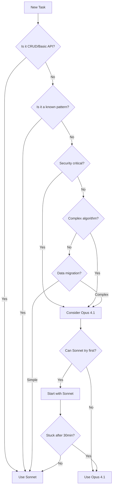

# Opus 4.1 Usage Guide & Tracking

## Executive Summary

This guide helps you decide when to use Claude Opus 4.1 versus Claude Sonnet for the Clenergize V3 project. Opus 4.1 should be used sparingly, only for high-complexity tasks requiring advanced reasoning.

## Quick Decision Tree



## Task Categories

### ✅ Use SONNET for These Tasks (95% of work)

#### Standard Development
- CRUD operations
- REST API endpoints
- Database queries
- Event publishers/consumers
- Error handling
- Logging setup
- Configuration management
- Unit tests
- Integration tests
- Documentation

#### Frontend Development
- React components
- Redux actions/reducers
- Form validations
- API integration
- Styling/CSS
- Accessibility features

#### DevOps & Infrastructure
- Docker configuration
- CI/CD pipelines
- Environment setup
- Deployment scripts
- Monitoring setup
- Health checks

#### Bug Fixes & Maintenance
- Debugging issues
- Performance tuning (basic)
- Code refactoring
- Dependency updates
- Code reviews

### 🧠 Use OPUS 4.1 for These Tasks (5% of work)

#### Critical Security Architecture
```yaml
Examples:
  - Task: Design JWT verification with JWKS (Fix OLD jwt.decode issue)
    Complexity: High - Multiple crypto considerations
    Duration: 1-2 hours
    OLD Issue: C1 from DESIGN-REVIEW.md
    
  - Task: Replace hardcoded secrets with AWS Secrets Manager
    Complexity: High - No default fallbacks allowed
    Duration: 1-2 hours
    OLD Issue: Multiple hardcoded 'default-secret-key'
    
  - Task: Multi-tenant data isolation strategy
    Complexity: High - Security boundaries
    Duration: 1-2 hours
    
  - Task: Encryption key rotation mechanism
    Complexity: High - Zero-downtime requirement
    Duration: 1-2 hours
```

#### Complex System Design
```yaml
Examples:
  - Task: Resolve circular service dependencies
    Complexity: High - Architectural refactoring
    Duration: 1-2 hours
    
  - Task: Design event sourcing for audit trail
    Complexity: High - Consistency guarantees
    Duration: 2-3 hours
    
  - Task: Distributed transaction patterns
    Complexity: High - SAGA implementation
    Duration: 2-3 hours
```

#### Advanced Algorithms
```yaml
Examples:
  - Task: Carbon emission calculation optimization
    Complexity: High - Multi-variable formulas
    Duration: 2-3 hours
    
  - Task: Hierarchical data aggregation
    Complexity: High - Recursive algorithms
    Duration: 1-2 hours
    
  - Task: Real-time rollup calculations
    Complexity: High - Performance critical
    Duration: 2-3 hours
```

#### Complex Data Migrations
```yaml
Examples:
  - Task: Hierarchy cloning to references (OLD to NEW)
    Complexity: High - Data structure change from cloned to referenced
    Duration: 3-4 hours
    OLD Issue: C3 from DESIGN-REVIEW.md
    
  - Task: Multi-phase migration orchestration
    Complexity: High - Zero-downtime requirement
    Duration: 2-3 hours
    
  - Task: Schema normalization strategy
    Complexity: High - Data consistency
    Duration: 2-3 hours
    OLD Issue: C4 - Denormalized companyName
    
  - Task: Permission model transformation
    Complexity: High - Nested object to normalized
    Duration: 2-3 hours
    OLD Issue: C9 from DESIGN-REVIEW.md
```

## Sprint-by-Sprint Opus Budget

### Sprint 0.1-0.2: Foundation (10-15 hours total)
```yaml
Planned Opus Tasks:
  - JWT/JWKS architecture design: 2-3 hours
  - Security threat modeling: 2-3 hours
  - Service boundary definitions: 2-3 hours
  - Database schema optimization: 2-3 hours
  - Event bus pattern selection: 1-2 hours
```

### Sprint 1.1-1.4: Core MVP (8-12 hours total)
```yaml
Planned Opus Tasks:
  - Complex authorization flows: 2-3 hours
  - Multi-tenant isolation: 2-3 hours
  - Performance optimization: 2-3 hours
  - Integration patterns: 2-3 hours
```

### Sprint 2.1-2.4: Calculation Engine (15-20 hours total)
```yaml
Planned Opus Tasks:
  - Emission calculation algorithms: 5-6 hours
  - Aggregation optimization: 3-4 hours
  - Formula parsing engine: 3-4 hours
  - Parallel processing design: 2-3 hours
  - Edge case handling: 2-3 hours
```

### Sprint 3.1-3.4: Migration & Reporting (12-15 hours total)
```yaml
Planned Opus Tasks:
  - Data transformation logic: 4-5 hours
  - Migration orchestration: 3-4 hours
  - Validation algorithms: 2-3 hours
  - Rollback strategies: 2-3 hours
  - Report optimization: 1-2 hours
```

## Usage Tracking Template

### Daily Opus Usage Log

```markdown
## Date: [YYYY-MM-DD]
## Sprint: [X.Y]
## Agent: [Agent Name]

### Opus 4.1 Session
**Start Time**: [HH:MM]
**End Time**: [HH:MM]
**Duration**: [X hours Y minutes]

**Task**: [Brief description]
**JIRA Ticket**: [CLNZ-XXX]

**Justification** (Why Opus was needed):
- [ ] Novel problem without patterns
- [ ] Security-critical implementation
- [ ] Complex algorithm design
- [ ] Multi-step reasoning required
- [ ] Performance optimization
- [ ] Data loss prevention

**Outcome**:
- Solution: [Brief description]
- Artifacts: [Files created/modified]
- Follow-up: [Can Sonnet handle implementation?]

**Lessons Learned**:
- [Key insight that can be reused]
- [Pattern that can be templated]

### Cost-Benefit Analysis
- Could Sonnet have done this? [Yes/No/Partially]
- Time saved by using Opus: [Estimated hours]
- Reusability of solution: [High/Medium/Low]
```

## Opus Escalation Protocol

### Before Using Opus 4.1

1. **Try Sonnet First** (30 minutes)
   - Attempt the task with Sonnet
   - Document where you get stuck
   - Identify specific complexity

2. **Check Pattern Library**
   - Review existing solutions
   - Look for similar problems solved
   - Check ADRs for decisions

3. **Consult Team**
   - Post in Slack for ideas
   - Check if another agent solved similar
   - Review documentation

4. **Make Decision**
   - If still blocked → Use Opus 4.1
   - Document why Opus is needed
   - Set clear success criteria

### During Opus 4.1 Session

1. **Maximize Value**
   - Batch related complex questions
   - Get complete solution design
   - Create reusable patterns
   - Document decision rationale

2. **Create Artifacts**
   - Write detailed implementation guide
   - Create templates for Sonnet
   - Document edge cases
   - Build test scenarios

3. **Knowledge Transfer**
   - Create ADR for decisions
   - Update pattern library
   - Write implementation checklist
   - Enable Sonnet follow-up

### After Opus 4.1 Session

1. **Implementation Handoff**
   - Return to Sonnet for coding
   - Follow the Opus design
   - Use created templates

2. **Track Usage**
   - Log time spent
   - Document outcomes
   - Calculate ROI
   - Update estimates

## Red Flags: When NOT to Use Opus

### Don't Use Opus 4.1 For:

❌ **Standard Patterns**
- Basic CRUD operations
- Simple API endpoints
- Standard authentication
- Common database queries

❌ **Known Solutions**
- Documented patterns
- Solved problems
- Library implementations
- Framework features

❌ **Time Pressure**
- Quick fixes
- Hotfixes
- Minor changes
- Urgent patches
> Better to do simple solution with Sonnet

❌ **Learning/Exploration**
- Understanding new libraries
- Reading documentation
- Exploring options
> Use Sonnet for exploration, Opus for decisions

## Cost Optimization Strategies

### 1. Pattern Creation Strategy
```
Opus 4.1 (1 hour) → Creates Pattern
    ↓
Sonnet (20 hours) → Implements Pattern 20x
    ↓
ROI: 20:1
```

### 2. Batch Processing Strategy
```
Collect 5 related complex problems
    ↓
Single Opus 4.1 session (2 hours)
    ↓
Solve all 5 systematically
    ↓
Cost: 0.4 hours per problem
```

### 3. Progressive Enhancement Strategy
```
Sonnet creates basic solution (2 hours)
    ↓
Opus 4.1 optimizes critical path (30 min)
    ↓
Sonnet implements optimization (1 hour)
    ↓
Total Opus: 30 min vs 3.5 hours
```

## Weekly Review Checklist

### Every Friday - Opus Usage Review

- [ ] Total Opus hours used this week
- [ ] Number of Opus sessions
- [ ] Average session duration
- [ ] Tasks completed with Opus
- [ ] Patterns created for reuse
- [ ] Sonnet success rate after Opus design
- [ ] Budget remaining for sprint
- [ ] Adjustments for next week

### Monthly Metrics

```yaml
Target Metrics:
  - Opus usage: < 50 hours/month
  - Opus sessions: < 30/month
  - Pattern creation: > 10/month
  - Reuse rate: > 80%
  - Sonnet independence: > 95%
  
Tracking:
  - Actual Opus hours: ___
  - Cost per story point: ___
  - Problems solved: ___
  - Patterns created: ___
  - Team velocity impact: ___
```

## Emergency Opus Usage

### When to Break the Rules

Sometimes you need Opus 4.1 immediately:

1. **Production Crisis**
   - Data corruption risk
   - Security breach
   - System-wide failure

2. **Blocking Issue**
   - Team blocked > 2 hours
   - Sprint goal at risk
   - Integration deadline

3. **Customer Impact**
   - Data loss possibility
   - Security vulnerability
   - Compliance violation

### Emergency Protocol
1. Use Opus 4.1 immediately
2. Document in emergency log
3. Review in retrospective
4. Add to pattern library
5. Update guidelines

## Conclusion

Remember: **Opus 4.1 is a precision tool, not a everyday hammer**

- 95% of tasks = Sonnet
- 5% of tasks = Opus 4.1
- Always try Sonnet first
- Document Opus decisions
- Create reusable patterns
- Track usage carefully

Success = Solving complex problems efficiently while minimizing Opus usage through pattern creation and knowledge transfer.
