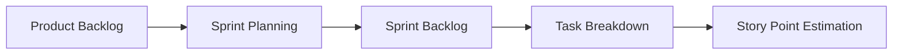
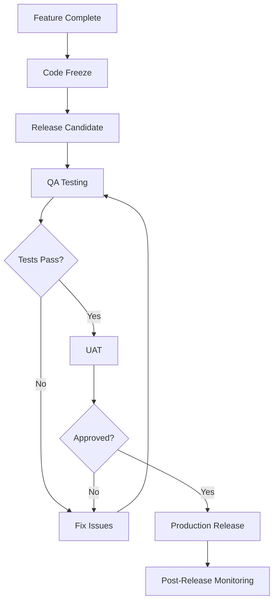

# SDLC & Quality Strategy - Clenergize V3 Rebuild

## Executive Summary

This document defines the Software Development Life Cycle (SDLC) approach and quality assurance strategy for the Clenergize V3 rebuild project. We adopt an **Agile methodology with DevOps practices**, emphasizing **continuous integration, test automation, and shift-left security**.

## SDLC Methodology

### Approach: Agile with Scrum Framework

**Core Principles**:
- Iterative and incremental delivery
- Continuous feedback and adaptation
- Cross-functional collaboration
- Working software over comprehensive documentation
- Respond to change over following a plan

**Scrum Implementation**:
- **Sprint Duration**: 2 weeks
- **Roles**: Product Owner, Scrum Master (Tech Lead), Development Team
- **Ceremonies**: Planning, Daily Standups, Review, Retrospective
- **Artifacts**: Product Backlog, Sprint Backlog, Increment

## Development Workflow

### 1. Planning Phase



**Activities**:
- Refine user stories with acceptance criteria
- Estimate story points using Planning Poker
- Define sprint goals and commitment
- Create technical tasks from stories
- Identify dependencies and risks

**Deliverables**:
- Sprint backlog in Jira
- Technical design documents (for complex features)
- Risk mitigation plans
- Sprint goal statement

### 2. Design Phase

**Activities**:
- API contract design (OpenAPI spec)
- Database schema design
- Event schema definition
- Solution architecture review
- Security threat modeling

**Design Standards**:
- API-first design approach
- Domain-driven design principles
- Event-driven architecture patterns
- Security by design

**Deliverables**:
- API specifications
- Data model diagrams
- Sequence diagrams
- Architecture Decision Records (ADRs)

### 3. Implementation Phase

**Development Standards**:

```typescript
// Code Style Configuration
{
  "eslint": "@nestjs/eslint-config",
  "prettier": {
    "semi": true,
    "singleQuote": true,
    "tabWidth": 2,
    "printWidth": 100
  },
  "commitlint": "conventional-commits"
}
```

**Branching Strategy** (GitFlow):
```
main
  ├── develop
  │   ├── feature/JIRA-123-user-authentication
  │   ├── feature/JIRA-456-hierarchy-management
  │   └── feature/JIRA-789-calculation-engine
  ├── release/v1.0.0
  └── hotfix/JIRA-999-security-patch
```

**Commit Standards**:
```
feat(identity): implement JWT authentication
fix(calculation): correct emission factor selection
docs(api): update swagger documentation
test(e2e): add integration tests for login flow
refactor(hierarchy): optimize tree traversal
```

**Code Review Process**:
1. Create feature branch from develop
2. Implement feature with tests
3. Self-review checklist completion
4. Create Pull Request with description
5. Automated checks (linting, tests, security)
6. Peer review (minimum 1 reviewer)
7. Address feedback
8. Merge to develop (squash and merge)

### 4. Testing Phase

**Test Pyramid**:
```
         ╱╲
        ╱E2E╲       (5%) - Critical user journeys
       ╱ Tests╲
      ╱────────╲
     ╱Integration╲   (15%) - Service integration
    ╱   Tests     ╲
   ╱───────────────╲
  ╱  Unit Tests     ╲ (80%) - Business logic
 ╱───────────────────╲
```

**Testing Standards**:
- Test-Driven Development (TDD) encouraged
- Minimum 80% code coverage for unit tests
- Integration tests for all API endpoints
- E2E tests for critical user flows
- Performance testing for SLO validation

### 5. Deployment Phase

**CI/CD Pipeline**:
```yaml
Pipeline Stages:
  1. Source:
     - Trigger on PR/merge
     - Checkout code

  2. Build:
     - Install dependencies
     - Compile TypeScript
     - Build Docker image

  3. Test:
     - Run unit tests
     - Run integration tests
     - Code coverage check
     - Security scan (SAST)

  4. Quality:
     - SonarQube analysis
     - Dependency check
     - License compliance

  5. Deploy (Staging):
     - Push to ECR
     - Deploy to ECS staging
     - Run smoke tests

  6. Deploy (Production):
     - Manual approval gate
     - Blue-green deployment
     - Health checks
     - Rollback ready
```

**Deployment Environments**:
1. **Development**: Continuous deployment from develop branch
2. **Staging**: Deployment from release branches
3. **Production**: Deployment after approval, from main branch

### 6. Monitoring Phase

**Observability Stack**:
- **Metrics**: CloudWatch Metrics, Custom KPIs
- **Logs**: CloudWatch Logs, Structured JSON
- **Traces**: AWS X-Ray, OpenTelemetry
- **Alerts**: CloudWatch Alarms, PagerDuty

**Key Metrics**:
- API latency (p50, p95, p99)
- Error rates (4xx, 5xx)
- Throughput (requests/second)
- Business metrics (calculations/day, active users)

## Quality Assurance Strategy

### QA Principles

1. **Shift-Left Testing**: Test early and often
2. **Automation First**: Automate repetitive tests
3. **Risk-Based Testing**: Focus on high-risk areas
4. **Continuous Testing**: Integrate testing in CI/CD
5. **Quality is Everyone's Responsibility**

### Testing Types & Coverage

#### 1. Unit Testing

**Framework**: Jest
**Coverage Target**: 80% minimum

```typescript
describe('EmissionCalculator', () => {
  it('should calculate CO2 emissions correctly', () => {
    const result = calculator.calculate({
      quantity: 100,
      unit: 'kg',
      factor: 2.5
    });
    expect(result.emissions).toBe(250);
    expect(result.unit).toBe('kg CO2e');
  });
});
```

**What to Test**:
- Business logic
- Data transformations
- Validation rules
- Error handling
- Edge cases

#### 2. Integration Testing

**Framework**: Supertest + Jest
**Coverage**: All API endpoints

```typescript
describe('POST /api/v1/activities', () => {
  it('should create activity with valid data', async () => {
    const response = await request(app)
      .post('/api/v1/activities')
      .set('Authorization', `Bearer ${token}`)
      .send(validActivityData);

    expect(response.status).toBe(201);
    expect(response.body).toHaveProperty('activityId');
  });
});
```

**What to Test**:
- API contracts
- Database operations
- Service interactions
- Authentication/authorization
- Error responses

#### 3. End-to-End Testing

**Framework**: Cypress / Playwright
**Coverage**: Critical user journeys

```typescript
describe('User Registration Flow', () => {
  it('should complete registration and login', () => {
    cy.visit('/register');
    cy.get('[data-testid=email]').type('test@example.com');
    cy.get('[data-testid=password]').type('SecurePassword123!');
    cy.get('[data-testid=submit]').click();
    cy.url().should('include', '/dashboard');
  });
});
```

**Critical Flows to Test**:
- User registration/login
- Project creation
- Activity data import
- Calculation execution
- Report generation

#### 4. Performance Testing

**Tool**: K6 / Artillery
**Targets**: Based on NFRs

```javascript
export default function() {
  let response = http.post(`${BASE_URL}/api/v1/auth/login`, {
    email: 'test@example.com',
    password: 'password'
  });

  check(response, {
    'status is 200': (r) => r.status === 200,
    'response time < 500ms': (r) => r.timings.duration < 500
  });
}
```

**Performance Scenarios**:
- Load testing (normal traffic)
- Stress testing (peak traffic)
- Spike testing (sudden increase)
- Soak testing (extended duration)

#### 5. Security Testing

**Tools**: OWASP ZAP, Snyk, npm audit

**Security Checklist**:
- [ ] Input validation
- [ ] SQL/NoSQL injection
- [ ] XSS prevention
- [ ] CSRF protection
- [ ] Authentication bypass
- [ ] Authorization flaws
- [ ] Sensitive data exposure
- [ ] Security headers
- [ ] Dependency vulnerabilities
- [ ] Rate limiting

### Test Data Management

**Strategy**:
- Seed data for consistent testing
- Test data isolation per environment
- Data anonymization for production copies
- Cleanup after test execution

```typescript
// Test Data Factory
class TestDataFactory {
  static createUser(overrides = {}) {
    return {
      email: faker.internet.email(),
      firstName: faker.name.firstName(),
      lastName: faker.name.lastName(),
      ...overrides
    };
  }

  static createActivity(projectId, overrides = {}) {
    return {
      projectId,
      quantity: faker.datatype.number(),
      unit: 'kg',
      date: faker.date.recent(),
      ...overrides
    };
  }
}
```

### Defect Management

**Defect Lifecycle**:
```
New → In Analysis → Ready for Dev → In Progress →
Ready for Test → Testing → Verified → Closed
```

**Severity Levels**:
1. **Critical**: System down, data loss, security breach
2. **High**: Major feature broken, significant performance issue
3. **Medium**: Minor feature issue, workaround available
4. **Low**: Cosmetic issue, enhancement request

**SLA for Fixes**:
- Critical: 4 hours
- High: 1 day
- Medium: 1 sprint
- Low: Next release

## Code Quality Standards

### Static Code Analysis

**Tools**:
- ESLint (linting)
- Prettier (formatting)
- SonarQube (code quality)
- CodeQL (security)

**Quality Gates**:
```yaml
sonarqube:
  qualityGates:
    - coverage: ">= 80%"
    - duplications: "< 3%"
    - maintainability: "A"
    - reliability: "A"
    - security: "A"
    - bugs: 0
    - vulnerabilities: 0
    - code_smells: "< 10"
```

### Documentation Standards

**Required Documentation**:
1. **README.md** per service
2. **API documentation** (OpenAPI/Swagger)
3. **Architecture diagrams** (C4 model)
4. **Runbooks** for operations
5. **ADRs** for decisions

**Code Documentation**:
```typescript
/**
 * Calculates CO2 emissions based on activity data
 * @param activity - The activity record containing quantity and unit
 * @param factor - The emission factor to apply
 * @returns Calculated emissions with traceability information
 * @throws {ValidationError} If inputs are invalid
 * @example
 * const result = calculate(activity, factor);
 * console.log(result.emissions); // 250 kg CO2e
 */
export function calculateEmissions(
  activity: ActivityRecord,
  factor: EmissionFactor
): CalculationResult {
  // Implementation
}
```

## Release Management

### Versioning Strategy

**Semantic Versioning**: MAJOR.MINOR.PATCH

- **MAJOR**: Breaking changes
- **MINOR**: New features (backward compatible)
- **PATCH**: Bug fixes

**Examples**:
- `1.0.0` - Initial release
- `1.1.0` - Add new calculation methodology
- `1.1.1` - Fix calculation bug
- `2.0.0` - New API version with breaking changes

### Release Process



**Release Checklist**:
- [ ] All planned features complete
- [ ] All tests passing
- [ ] Security scan clean
- [ ] Performance benchmarks met
- [ ] Documentation updated
- [ ] Release notes prepared
- [ ] Rollback plan ready
- [ ] Stakeholders notified

### Rollback Strategy

**Automated Rollback Triggers**:
- Health check failures (3 consecutive)
- Error rate > 5%
- Response time > SLO for 5 minutes

**Manual Rollback Process**:
1. Identify issue in production
2. Assess impact and severity
3. Decision to rollback
4. Execute rollback (< 5 minutes)
5. Verify system stability
6. Post-mortem analysis

## Continuous Improvement

### Metrics & KPIs

**Development Metrics**:
- Sprint velocity trend
- Defect escape rate
- Code coverage trend
- Technical debt ratio
- Mean time to recovery (MTTR)

**Quality Metrics**:
- Defect density (defects/KLOC)
- Test automation percentage
- First-time pass rate
- Customer reported defects
- SLA compliance

### Retrospective Actions

**Sprint Retrospectives**:
- What went well?
- What didn't go well?
- What can we improve?
- Action items with owners

**Quality Reviews** (Monthly):
- Defect trend analysis
- Test coverage review
- Performance analysis
- Security posture assessment

### Knowledge Sharing

**Practices**:
- Pair programming sessions
- Code review as learning
- Tech talks (bi-weekly)
- Documentation days
- Post-mortem reviews (blameless)

## Risk Management in SDLC

### Technical Risks

| Risk | Mitigation in SDLC |
|------|-------------------|
| Code quality degradation | Automated quality gates, code reviews |
| Security vulnerabilities | SAST/DAST scanning, security reviews |
| Performance regression | Performance testing in CI/CD |
| Integration failures | Contract testing, integration tests |
| Knowledge silos | Pair programming, documentation |

### Process Risks

| Risk | Mitigation in SDLC |
|------|-------------------|
| Scope creep | Sprint planning, change control |
| Delayed delivery | Velocity tracking, buffer time |
| Quality compromise | Definition of Done, quality gates |
| Communication gaps | Daily standups, documentation |

## Compliance & Audit

### Regulatory Compliance

**Standards**:
- OWASP Top 10
- GDPR (data privacy)
- SOC 2 Type II (future)
- ISO 27001 (future)

**Compliance Activities**:
- Security assessments (quarterly)
- Dependency scanning (continuous)
- Access reviews (monthly)
- Audit logging (all changes)
- Data retention compliance

### Audit Trail

**What to Audit**:
- Code commits
- Deployments
- Configuration changes
- Access patterns
- Data modifications

**Audit Log Format**:
```json
{
  "timestamp": "2024-01-01T10:00:00Z",
  "actor": "user@example.com",
  "action": "deployment",
  "resource": "identity-service:v1.2.3",
  "environment": "production",
  "result": "success",
  "metadata": {
    "commit": "abc123",
    "pipeline": "build-456"
  }
}
```

## Training & Onboarding

### Developer Onboarding

**Week 1**:
- Architecture overview
- Development environment setup
- Code walkthrough
- First bug fix

**Week 2**:
- First feature implementation
- Code review participation
- Testing practices
- Deployment process

### Continuous Learning

**Resources**:
- Internal wiki (Confluence)
- Video recordings of tech talks
- External training budget
- Conference attendance
- Certification support

## Conclusion

This SDLC and Quality Strategy ensures that the Clenergize V3 rebuild maintains high standards of quality, security, and reliability throughout the development lifecycle. By combining Agile methodologies with DevOps practices and comprehensive testing, we create a robust framework for delivering value continuously while managing risk effectively.

The strategy emphasizes automation, continuous improvement, and team collaboration to achieve our quality goals while maintaining development velocity. Regular reviews and adaptations ensure the process remains effective as the project evolves.