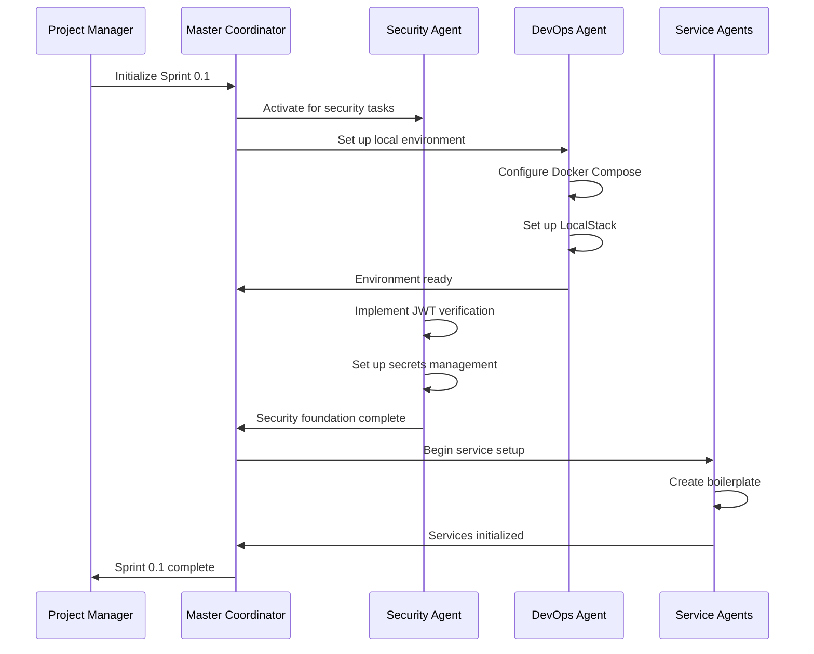

# Claude Multi-Agent Development Strategy for Clenergize V3

## Executive Summary

This strategy outlines an optimal multi-agent Claude configuration for developing the Clenergize V3 enterprise carbon footprint management platform. The approach leverages Claude's 200K context window per agent, specialized sub-agents for different bounded contexts, MCP servers for tool integration, and custom skills for development efficiency.

## Project Complexity Analysis

### Scope Metrics
- **Architecture**: Microservices (7 services + frontend)
- **Total Story Points**: 563 across 16 sprints
- **Timeline**: 8 months
- **Tech Stack**: NestJS, Next.js, MongoDB, Redis, AWS
- **Code Size**: ~295KB documentation, estimated 500K+ LOC
- **Complexity**: High (distributed systems, security critical, data migrations)

## Multi-Agent Architecture

### Agent Distribution Strategy

Given the 200K context window per agent and the project's modular architecture, I recommend **12 specialized sub-agents** plus a coordinator:

```
┌─────────────────────────────────────────────────────────┐
│            MASTER COORDINATOR AGENT                      │
│         (Project Context & Orchestration)                │
│                  [Claude Opus 4.5]                       │
└─────────────────────────────────────────────────────────┘
                            │
        ┌───────────────────┼───────────────────┐
        │                   │                   │
┌───────────────┐   ┌───────────────┐   ┌───────────────┐
│  ARCHITECTURE  │   │   SECURITY    │   │  DEVOPS/INFRA │
│   AGENT        │   │   AGENT       │   │    AGENT      │
│  [Opus 4.5]    │   │  [Opus 4.5]   │   │  [Opus 4.5]   │
└───────────────┘   └───────────────┘   └───────────────┘
                            │
    ┌───────────────────────┼───────────────────────┐
    │                       │                       │
┌────────────────────────────────────────────────────────┐
│              CORE SERVICE AGENTS (7)                    │
├──────────────────────────────────────────────────────┤
│ • Identity Service Agent     (Port 3001) [Opus 4.5]   │
│ • Organization Service Agent (Port 3002) [Opus 4.5]   │
│ • Reference Service Agent    (Port 3003) [Opus 4.5]   │
│ • Activity Service Agent     (Port 3004) [Opus 4.5]   │
│ • Calculation Service Agent  (Port 3005) [Opus 4.5]   │
│ • Reporting Service Agent    (Port 3006) [Opus 4.5]   │
│ • Audit Service Agent        (Port 3007) [Opus 4.5]   │
└────────────────────────────────────────────────────────┘
                            │
        ┌───────────────────┼───────────────────┐
        │                   │                   │
┌───────────────┐   ┌───────────────┐   ┌───────────────┐
│   FRONTEND     │   │   TESTING     │   │  MIGRATION    │
│    AGENT       │   │    AGENT      │   │    AGENT      │
│  [Opus 4.5]    │   │  [Opus 4.5]   │   │  [Opus 4.5]   │
└───────────────┘   └───────────────┘   └───────────────┘

All agents use Claude Opus 4.5 - no usage restrictions
```

## Agent Specifications

### 1. Master Coordinator Agent
**Model**: Claude Opus 4.5
**Context Allocation**: 
- Project architecture docs (50KB)
- Sprint planning & backlog (40KB)
- Integration points map (20KB)
- Agent communication protocols (10KB)
- Active sprint status (80KB buffer)

**Responsibilities**:
- Cross-service coordination
- Sprint planning and task allocation
- Architecture decision records
- Integration point management
- Progress tracking and reporting
- OLD to NEW migration oversight

**MCP Servers**:
- Jira MCP (project management)
- GitHub MCP (repository overview)
- Slack MCP (team communication)

**Key Files**:
- PROJECT_STRUCTURE_GUIDE.md (directory organization)
- OLD_TO_NEW_MIGRATION_GUIDE.md (migration patterns)

### 2. Architecture Agent
**Model**: Claude Opus 4.5

**Context Allocation**:
- Target architecture (25KB)
- Current architecture analysis (15KB)
- DDD bounded contexts (25KB)
- API contracts (50KB)
- Architecture decision records (85KB)

**Responsibilities**:
- System design decisions
- API contract definitions
- Service boundary definitions
- Event schema design
- Technical debt analysis

### 3. Security Agent
**Model**: Claude Opus 4.5

**Context Allocation**:
- Security requirements (30KB)
- OWASP guidelines (40KB)
- AWS security best practices (30KB)
- Threat models (50KB)
- Security test cases (50KB)

**Responsibilities**:
- JWT/JWKS implementation
- Secrets management
- Security testing
- Vulnerability assessment
- Compliance verification

### 4-10. Service-Specific Agents (7 agents)
**Model**: Claude Opus 4.5

**Context per Agent**:
- Service specification (30KB)
- API contracts (20KB)
- Database schemas (20KB)
- Business logic (80KB)
- Test suites (50KB)

**OLD Code Reference**:
- Identity: `OLD/clenergizeV3-user-management-ms-dev/`
- Organization: `OLD/clenergizeV3-project-management-ms-dev/`
- Reference: `OLD/clenergizeV3-master-data-ms-dev/`
- Activity: `OLD/clenergizeV3-carbon-footprint-ms-dev/` (partial)
- Calculation: `OLD/clenergizeV3-carbon-footprint-ms-dev/` (partial)
- Reporting: `OLD/clenergizeV3-backend-ms-dev/` (RESULT-REPORT)
- Audit: No OLD equivalent (new service)

**Responsibilities**:
- Service implementation
- Unit/integration testing
- Database migrations
- Event publishing/consuming
- Service documentation

### 11. Frontend Agent
**Model**: Claude Opus 4.5
**Context Allocation**:
- Component library (40KB)
- State management (30KB)
- UI/UX specifications (30KB)
- API integration layer (50KB)
- Test suites (50KB)

**Responsibilities**:
- React component development
- Redux state management
- API integration
- Accessibility compliance
- Frontend testing

### 12. Testing Agent
**Model**: Claude Opus 4.5
**Context Allocation**:
- Test strategies (20KB)
- E2E test scenarios (50KB)
- Performance benchmarks (30KB)
- Test data management (50KB)
- CI/CD pipelines (50KB)

**Responsibilities**:
- Test strategy implementation
- E2E test development
- Performance testing
- Test data generation
- Quality metrics tracking

### 13. Migration Agent
**Model**: Claude Opus 4.5

**Context Allocation**:
- Current data models (50KB)
- Target data models (50KB)
- Migration scripts (50KB)
- Rollback procedures (25KB)
- Validation rules (25KB)

**Responsibilities**:
- Data migration planning
- Script development
- Data validation
- Rollback procedures
- Migration testing
- OLD to NEW structure transformation
- Hierarchy cloning to references conversion

**Critical OLD Issues to Fix**:
- Convert cloned hierarchies to references (70% data reduction)
- Fix denormalized fields (companyName, userName)
- Transform nested permissions to normalized structure
- Migrate V1 folder duplications to versioned algorithms

## MCP Server Configuration

### Required MCP Servers

```yaml
mcp_servers:
  # Development Environment
  mongodb:
    - name: identity-db
      connection: mongodb://localhost:27017/identity
    - name: organization-db
      connection: mongodb://localhost:27017/organization
    - name: reference-db
      connection: mongodb://localhost:27017/reference
    - name: activity-db
      connection: mongodb://localhost:27017/activity
    - name: calculation-db
      connection: mongodb://localhost:27017/calculation
    - name: reporting-db
      connection: mongodb://localhost:27017/reporting
    - name: audit-db
      connection: mongodb://localhost:27017/audit

  redis:
    - name: cache-server
      connection: redis://localhost:6379/0
    - name: pubsub-server
      connection: redis://localhost:6379/1

  # Project Management
  jira:
    - name: project-tracker
      project: CLNZ
      url: https://yourcompany.atlassian.net

  github:
    - name: source-control
      repo: clenergize-v3-rebuild
      org: yourcompany

  # AWS Services (LocalStack for dev)
  aws:
    - name: localstack
      endpoint: http://localhost:4566
      services: [secretsmanager, sqs, s3, cognito]

  # Documentation
  confluence:
    - name: documentation
      space: CLNZ-DOCS

  # Monitoring (for later phases)
  datadog:
    - name: monitoring
      api_key: ${DATADOG_API_KEY}
      
  slack:
    - name: team-communication
      channel: clenergize-rebuild
```

## Custom Skills Development

### Priority 1 Skills (Immediate)

#### 1. NestJS Service Generator
```typescript
// skill: nestjs-microservice-generator
Purpose: Generate consistent NestJS microservice boilerplate
Templates:
  - Service structure
  - Controller templates
  - Repository patterns
  - Event publishers
  - Test scaffolding
```

#### 2. MongoDB Schema Migrator
```typescript
// skill: mongodb-migration-tool
Purpose: Handle complex data migrations
Features:
  - Schema versioning
  - Rollback support
  - Data validation
  - Progress tracking
```

#### 3. API Contract Validator
```typescript
// skill: openapi-contract-validator
Purpose: Ensure API consistency
Features:
  - OpenAPI spec generation
  - Contract testing
  - Breaking change detection
  - Mock server generation
```

### Priority 2 Skills (Sprint 2+)

#### 4. Security Audit Scanner
```typescript
// skill: security-vulnerability-scanner
Purpose: Automated security checking
Features:
  - OWASP compliance
  - Dependency scanning
  - Secret detection
  - JWT validation
```

#### 5. Performance Profiler
```typescript
// skill: performance-optimization-tool
Purpose: Identify bottlenecks
Features:
  - Query optimization
  - N+1 detection
  - Memory profiling
  - Load testing
```

## Slash Commands

### Essential Slash Commands

```bash
# Project Management
/sprint-status         # Current sprint progress
/create-task          # Create Jira ticket
/assign-agent         # Assign task to agent
/blocker-report       # List current blockers

# Development
/generate-service     # Create new microservice
/test-integration     # Run integration tests
/deploy-local        # Deploy to local Docker
/migrate-data        # Run data migrations

# Code Quality
/security-scan       # Run security checks
/performance-check   # Check performance metrics
/code-review        # Request code review
/tech-debt-report   # Technical debt analysis

# Documentation
/update-api-docs    # Generate API documentation
/architecture-diagram # Update architecture diagrams
/decision-record    # Create ADR
```

## Context Window Management Strategy

### Per-Agent Context Allocation

```yaml
Agent Context Budget (200KB total):
  Core Documentation: 30-50KB
    - Service specifications
    - API contracts
    - Business rules
  
  Active Development: 100-120KB
    - Current sprint code
    - Related test files
    - Integration points
  
  Reference Material: 30-50KB
    - Best practices
    - Design patterns
    - Security guidelines
  
  Buffer: 20-30KB
    - Runtime decisions
    - Debug information
    - Communication logs
```

### Context Optimization Techniques

1. **Incremental Loading**
   - Load only relevant service specs
   - Lazy-load test files
   - Cache frequently used patterns

2. **Context Compression**
   - Use references instead of duplication
   - Summarize completed work
   - Archive resolved issues

3. **Smart Context Switching**
   - Save agent state between sessions
   - Maintain decision logs
   - Track integration points

## Development Workflow

### Sprint 0.1 Agent Activation Sequence



### Daily Development Flow

```yaml
Morning Sync:
  1. Master Coordinator reviews overnight CI/CD
  2. Distribute tasks to specialized agents
  3. Update Jira tickets
  4. Check for blockers

Development Cycle:
  1. Service agents implement features
  2. Testing agent validates changes
  3. Security agent reviews code
  4. Architecture agent ensures compliance

Evening Wrap-up:
  1. Commit code to feature branches
  2. Update progress in Jira
  3. Document decisions
  4. Plan next day priorities
```

## Risk Mitigation

### Context Window Overflow
- **Risk**: Agent runs out of context space
- **Mitigation**: 
  - Modular documentation structure
  - Context compression techniques
  - Regular context cleanup

### Agent Coordination Issues
- **Risk**: Conflicting implementations
- **Mitigation**:
  - Clear API contracts
  - Master coordinator oversight
  - Integration testing focus

### Knowledge Transfer
- **Risk**: Loss of context between sessions
- **Mitigation**:
  - Comprehensive ADRs
  - Session summaries
  - Shared knowledge base

## Success Metrics

### Phase 0 (Foundation) - Sprint 0.1-0.2
- ✅ Local development environment operational
- ✅ All critical security vulnerabilities fixed
- ✅ JWT verification implemented
- ✅ 100% test coverage on security modules

### Phase 1 (Core MVP) - Sprint 1.1-1.4
- ✅ Identity & Organization services complete
- ✅ Basic CRUD operations working
- ✅ Event bus operational
- ✅ 80% API coverage

### Phase 2 (Calculation Engine) - Sprint 2.1-2.4
- ✅ All calculation modules migrated
- ✅ Reference data service complete
- ✅ Activity data ingestion working
- ✅ Performance benchmarks met

### Phase 3 (Full System) - Sprint 3.1-3.4
- ✅ All services deployed
- ✅ Data migration complete
- ✅ Integration tests passing
- ✅ Security audit passed

## Implementation Checklist

### Week 1 - Environment Setup
- [ ] Configure Claude projects with all agents
- [ ] Set up MCP servers (MongoDB, Redis, LocalStack)
- [ ] Create custom skills (priority 1)
- [ ] Configure slash commands
- [ ] Initialize Jira project

### Week 2 - Sprint 0.1 Execution
- [ ] Activate Security Agent for JWT work
- [ ] Activate DevOps Agent for Docker setup
- [ ] Begin service agent initialization
- [ ] Implement testing framework
- [ ] Document decisions in ADRs

### Week 3-4 - Sprint 0.2 Execution
- [ ] Complete security foundation
- [ ] Implement base service templates
- [ ] Set up CI/CD pipelines
- [ ] Begin data migration planning
- [ ] Performance baseline establishment

## Model Configuration

All agents use **Claude Opus 4.5** as the standard model. Opus 4.5 is available without usage limits or cost restrictions, making it the ideal choice for all development tasks - from simple CRUD operations to complex security architecture and emission calculations.

### Benefits
- **No Model Selection Overhead**: All tasks receive consistent high-quality reasoning
- **Simplified Configuration**: All agents use `model: opus`
- **No Cost Tracking Required**: Unlimited usage eliminates budget concerns
- **Consistent Quality**: Advanced reasoning capabilities for all tasks

## Conclusion

This multi-agent strategy provides a scalable, efficient approach to developing the Clenergize V3 platform. The 12-agent configuration balances specialization with coordination overhead, while the MCP servers and custom skills accelerate development velocity. With proper context management and clear agent responsibilities, this setup can maintain consistency across the 8-month development timeline while ensuring high code quality and security standards.
