# Complete Platform Architecture Diagrams - All 50 Services

> **Document Type**: Architecture Diagrams (Mermaid)
> **Version**: 1.0.0
> **Last Updated**: November 22, 2025
> **Platform Scope**: Complete ESG Platform (50 microservices)

---

## 📋 Table of Contents

1. [System Architecture Overview](#system-architecture-overview)
2. [Service Dependency Map](#service-dependency-map)
3. [Phase 1: Carbon Footprint Services](#phase-1-carbon-footprint-services)
4. [Phase 2: Strategic ESG Services](#phase-2-strategic-esg-services)
5. [Phase 3: Environmental Services](#phase-3-environmental-services)
6. [Phase 4: Social Services](#phase-4-social-services)
7. [Phase 5: Governance Services](#phase-5-governance-services)
8. [Phase 6: Analytics & ML Services](#phase-6-analytics-ml-services)
9. [Data Flow Architecture](#data-flow-architecture)
10. [Deployment Architecture](#deployment-architecture)

---

## System Architecture Overview

### High-Level Platform Architecture (All 50 Services)

```mermaid
graph TB
    subgraph "Client Layer"
        WEB[Web Application<br/>Next.js 14]
        MOBILE[Mobile App<br/>React Native]
        API_DOCS[API Documentation<br/>Swagger UI]
    end

    subgraph "API Gateway Layer - Port 3000"
        GATEWAY[API Gateway<br/>Kong/NGINX<br/>JWT Verification]
    end

    subgraph "Phase 1: Carbon Footprint Services - Ports 3001-3007"
        IDENTITY[Identity Service<br/>3001<br/>Auth, Users, Roles]
        ORG[Organization Service<br/>3002<br/>Projects, Hierarchy]
        REF[Reference Service<br/>3003<br/>Emission Factors]
        ACTIVITY[Activity Service<br/>3004<br/>Activity Data]
        CALC[Calculation Service<br/>3005<br/>Emissions Calc]
        REPORT[Reporting Service<br/>3006<br/>Reports, Export]
        AUDIT[Audit Service<br/>3007<br/>Audit Trail]
    end

    subgraph "Phase 2: Strategic ESG Services - Ports 3008-3010, 3037-3044"
        NOTIF[Notification Service<br/>3008<br/>Email, SMS, Push]
        WORKFLOW[Workflow Service<br/>3009<br/>Temporal, Approvals]
        INTEG[Integration Service<br/>3010<br/>SAP, Workday, etc.]
        POLICY[Policy Service<br/>3037<br/>Policies, Attestation]
        STAKE[Stakeholder Service<br/>3038<br/>Engagement]
        MATER[Materiality Service<br/>3041<br/>Double Materiality]
        STRAT[Strategy Service<br/>3042<br/>Targets, Initiatives]
        REPORT2[Reporting Enhanced<br/>3044<br/>Multi-framework]
    end

    subgraph "Phase 3: Environmental Services - Ports 3012-3020"
        WATER[Water Service<br/>3012<br/>Consumption, Stress]
        WASTE[Waste Service<br/>3013<br/>Waste, Circular Economy]
        BIO[Biodiversity Service<br/>3014<br/>TNFD, SBTN]
        ENERGY[Energy Service<br/>3015<br/>Energy, RE100]
        POLL[Pollution Service<br/>3016<br/>Air, Water, Soil]
        RES[Resource Service<br/>3017<br/>Materials, Minerals]
        CLIMATE[Climate Risk Service<br/>3018<br/>TCFD, Scenarios]
        GREEN[Green Finance Service<br/>3019<br/>Green Bonds]
        ENV_SC[Env Supply Chain<br/>3020<br/>Scope 3 Upstream]
    end

    subgraph "Phase 4: Social Services - Ports 3021-3030"
        WORK[Workforce Service<br/>3021<br/>Demographics, Talent]
        SAFETY[Safety Service<br/>3022<br/>OSHA, Incidents]
        LABOR[Labor Service<br/>3023<br/>Living Wage, ILO]
        COMM[Community Service<br/>3024<br/>FPIC, Indigenous]
        PROD[Product Service<br/>3025<br/>Safety, Privacy]
        SOC_SC[Social Supply Chain<br/>3026<br/>Modern Slavery]
        HR[Human Rights Service<br/>3027<br/>UNGPs, HRIA]
        DIV[Diversity Service<br/>3028<br/>DEI, Pay Equity]
        WELL[Wellbeing Service<br/>3029<br/>Mental Health]
        TRAIN[Training Service<br/>3030<br/>Skills Development]
    end

    subgraph "Phase 5: Governance Services - Ports 3031-3036, 3039-3040"
        BOARD[Board Service<br/>3031<br/>Governance, Diversity]
        ETHICS[Ethics Service<br/>3032<br/>Hotline, Corruption]
        RISK[Risk Service<br/>3033<br/>ERM, COSO]
        PRIV[Privacy Service<br/>3034<br/>GDPR, DSR]
        CYBER[Cybersecurity Service<br/>3035<br/>NIST CSF, Incidents]
        CONDUCT[Business Conduct<br/>3036<br/>Lobbying, Tax]
        TRANS[Transparency Service<br/>3039<br/>Assurance, Lineage]
        CONTROL[Controls Service<br/>3040<br/>SOX 404, COSO]
    end

    subgraph "Phase 6: Analytics & ML Services - Ports 3045-3050"
        ANALYTICS[Analytics Service<br/>3045<br/>Dashboards, OLAP]
        ML[ML Service<br/>3046<br/>Python, TensorFlow]
        FORECAST[Forecast Service<br/>3047<br/>Time Series, SBTi]
        SCENARIO[Scenario Service<br/>3048<br/>Monte Carlo]
        RATING[Rating Service<br/>3049<br/>ESG Scores]
        INSIGHTS[Insights Service<br/>3050<br/>AI, NLG]
    end

    subgraph "Infrastructure Layer"
        MONGO[(MongoDB<br/>Document Store)]
        REDIS[(Redis<br/>Cache & PubSub)]
        INFLUX[(InfluxDB<br/>Time Series)]
        NEO4J[(Neo4j<br/>Graph DB)]
        CLICK[(ClickHouse<br/>OLAP)]
        KAFKA[Apache Kafka<br/>Event Streaming]
        TEMPORAL[Temporal<br/>Workflows]
        S3[(AWS S3<br/>Object Storage)]
    end

    subgraph "External Integrations"
        ERP[ERP Systems<br/>SAP, Oracle]
        HRIS[HRIS<br/>Workday, SF]
        ESG_DATA[ESG Data Providers<br/>MSCI, CDP]
        LLM[LLM APIs<br/>GPT-4, Claude]
        IOT[IoT Platforms<br/>CEMS, Meters]
    end

    %% Client connections
    WEB --> GATEWAY
    MOBILE --> GATEWAY
    API_DOCS --> GATEWAY

    %% Gateway to services
    GATEWAY --> IDENTITY
    GATEWAY --> ORG
    GATEWAY --> ACTIVITY
    GATEWAY --> REPORT

    %% Phase 1 internal connections
    IDENTITY -.-> MONGO
    ORG -.-> MONGO
    REF -.-> MONGO
    ACTIVITY -.-> MONGO
    CALC -.-> MONGO
    REPORT -.-> MONGO
    AUDIT -.-> MONGO

    ACTIVITY --> KAFKA
    CALC --> KAFKA
    KAFKA --> REPORT

    %% Phase 2 connections
    WORKFLOW -.-> TEMPORAL
    INTEG --> ERP
    INTEG --> HRIS

    %% Phase 3 connections
    CLIMATE -.-> NEO4J
    ENV_SC -.-> NEO4J

    %% Phase 4 connections
    SOC_SC -.-> NEO4J
    WORK --> HRIS
    SAFETY -.-> MONGO

    %% Phase 5 connections
    RISK -.-> MONGO
    PRIV -.-> MONGO
    TRANS -.-> NEO4J

    %% Phase 6 connections
    ANALYTICS -.-> CLICK
    ML -.-> S3
    INSIGHTS --> LLM
    FORECAST --> ML

    %% External integrations
    WATER --> IOT
    ENERGY --> IOT
    POLL --> IOT

    %% Shared infrastructure
    NOTIF -.-> REDIS
    CALC -.-> REDIS
    ANALYTICS --> KAFKA

    style GATEWAY fill:#ff6b6b
    style IDENTITY fill:#4ecdc4
    style ORG fill:#4ecdc4
    style REF fill:#4ecdc4
    style ACTIVITY fill:#4ecdc4
    style CALC fill:#4ecdc4
    style REPORT fill:#4ecdc4
    style AUDIT fill:#4ecdc4
    style ML fill:#95e1d3
    style INSIGHTS fill:#95e1d3
    style ANALYTICS fill:#95e1d3
```

---

## Service Dependency Map

### Inter-Service Dependencies (50 Services)

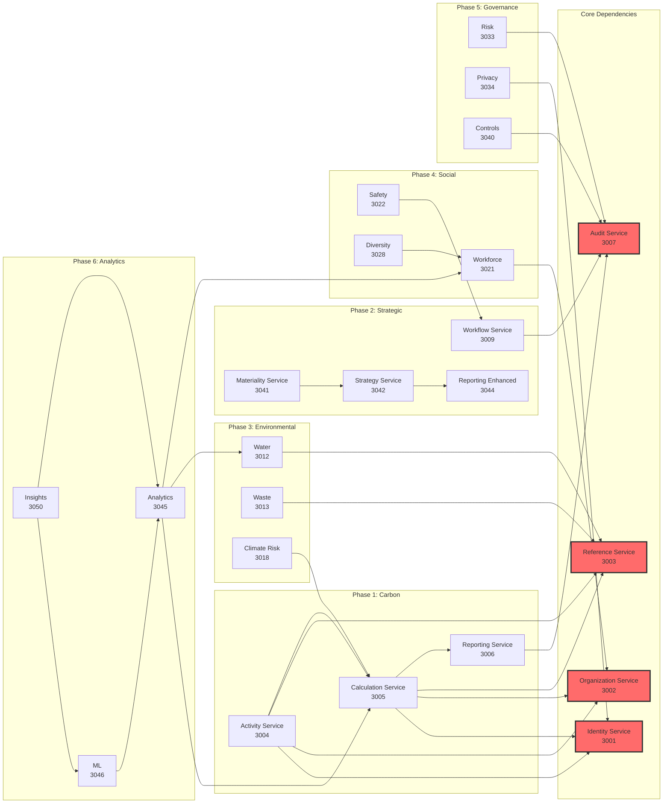

---

## Phase 1: Carbon Footprint Services

### Phase 1 Detailed Architecture (Ports 3000-3007)

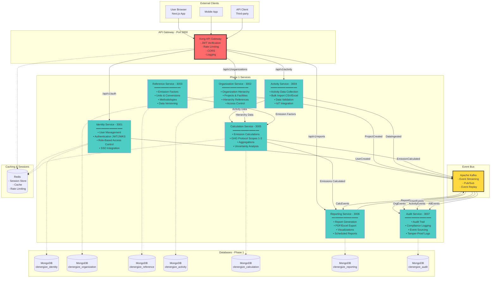

---

## Phase 2: Strategic ESG Services

### Phase 2 Architecture (Ports 3008-3010, 3037-3044)

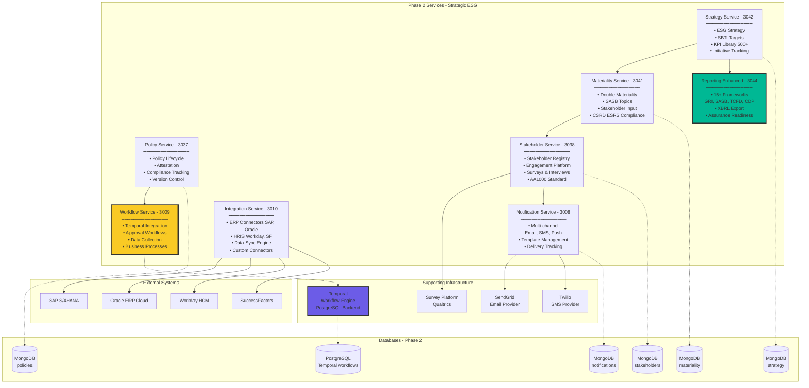

---

## Phase 3: Environmental Services

### Phase 3 Architecture (Ports 3012-3020)

```mermaid
graph TB
    subgraph "Phase 3 Services - Environmental"
        WATER[Water Service - 3012<br/>━━━━━━━━━━━━━━━━<br/>• Multi-source Tracking<br/>• WRI Aqueduct<br/>• CDP Water<br/>• 1M+ IoT Readings/day]

        WASTE[Waste Service - 3013<br/>━━━━━━━━━━━━━━━━<br/>• Waste Streams<br/>• Circular Economy<br/>• MCI Calculation<br/>• Zero Waste Cert]

        BIO[Biodiversity Service - 3014<br/>━━━━━━━━━━━━━━━━<br/>• TNFD LEAP<br/>• SBTN Targets<br/>• IBAT Integration<br/>• Species Tracking]

        ENERGY[Energy Service - 3015<br/>━━━━━━━━━━━━━━━━<br/>• Energy Consumption<br/>• RE100 Tracking<br/>• ISO 50001<br/>• Renewable %]

        POLL[Pollution Service - 3016<br/>━━━━━━━━━━━━━━━━<br/>• Air Quality NOx, SOx<br/>• Water Pollutants<br/>• CEMS Integration<br/>• EPA TRI]

        RES[Resource Service - 3017<br/>━━━━━━━━━━━━━━━━<br/>• Critical Minerals<br/>• Conflict Minerals<br/>• Material Circularity<br/>• Responsible Sourcing]

        CLIMATE[Climate Risk - 3018<br/>━━━━━━━━━━━━━━━━<br/>• TCFD Framework<br/>• Physical + Transition<br/>• NGFS Scenarios<br/>• Financial Impact]

        GREEN[Green Finance - 3019<br/>━━━━━━━━━━━━━━━━<br/>• Green Bonds GBP<br/>• SLL Tracking<br/>• EU Taxonomy<br/>• Impact Reporting]

        ENV_SC[Env Supply Chain - 3020<br/>━━━━━━━━━━━━━━━━<br/>• Scope 3 Upstream<br/>• Supplier Performance<br/>• Green Procurement<br/>• Multi-tier Mapping]
    end

    subgraph "External Environmental Data"
        WRI[WRI Aqueduct<br/>Water Stress API]
        IBAT[IBAT<br/>Biodiversity Data]
        IUCN[IUCN Red List<br/>Species Status]
        NGFS[NGFS<br/>Climate Scenarios]
        SENTINEL[Sentinel Hub<br/>Satellite Imagery]
    end

    subgraph "IoT & Real-time Data"
        WATER_METERS[Smart Water Meters]
        ENERGY_METERS[Smart Energy Meters]
        CEMS[CEMS<br/>Continuous Emission<br/>Monitoring Systems]
        SCADA[SCADA Systems<br/>Industrial Control]
    end

    subgraph "Specialized Databases"
        INFLUX[(InfluxDB<br/>Time-series Data<br/>IoT Readings)]
        NEO4J_ENV[(Neo4j<br/>Supply Chain Graph<br/>Multi-tier Suppliers)]
        MONGO_ENV[(MongoDB<br/>Environmental Data)]
    end

    %% External API connections
    WATER --> WRI
    BIO --> IBAT
    BIO --> IUCN
    CLIMATE --> NGFS
    BIO --> SENTINEL

    %% IoT connections
    WATER --> WATER_METERS
    ENERGY --> ENERGY_METERS
    POLL --> CEMS
    ENERGY --> SCADA

    %% Time-series data
    WATER -.-> INFLUX
    ENERGY -.-> INFLUX
    POLL -.-> INFLUX

    %% Graph database
    ENV_SC -.-> NEO4J_ENV
    CLIMATE -.-> NEO4J_ENV

    %% Document database
    WASTE -.-> MONGO_ENV
    RES -.-> MONGO_ENV
    GREEN -.-> MONGO_ENV

    %% Service dependencies
    CLIMATE --> WATER
    CLIMATE --> ENERGY
    GREEN --> CLIMATE

    style INFLUX fill:#e74c3c,stroke:#333,stroke-width:3px
    style NEO4J_ENV fill:#9b59b6,stroke:#333,stroke-width:3px
    style CLIMATE fill:#e67e22,stroke:#333,stroke-width:3px
```

---

## Phase 4: Social Services

### Phase 4 Architecture (Ports 3021-3030)

```mermaid
graph TB
    subgraph "Phase 4 Services - Social"
        WORK[Workforce Service - 3021<br/>━━━━━━━━━━━━━━━━<br/>• Demographics ANON<br/>• Talent Management<br/>• Engagement Surveys<br/>• ZERO PII Storage]

        SAFETY[Safety Service - 3022<br/>━━━━━━━━━━━━━━━━<br/>• OSHA 300 Log<br/>• TRIR Calculation<br/>• Incident Management<br/>• ISO 45001]

        LABOR[Labor Service - 3023<br/>━━━━━━━━━━━━━━━━<br/>• Living Wage<br/>• ILO Conventions<br/>• Freedom of Association<br/>• Grievance Mechanisms]

        COMM[Community Service - 3024<br/>━━━━━━━━━━━━━━━━<br/>• FPIC Process<br/>• Indigenous Rights<br/>• Local Impact<br/>• IFC PS7]

        PROD[Product Service - 3025<br/>━━━━━━━━━━━━━━━━<br/>• Product Safety<br/>• Customer Privacy<br/>• Greenwashing Detection<br/>• RoHS, REACH]

        SOC_SC[Social Supply Chain - 3026<br/>━━━━━━━━━━━━━━━━<br/>• Modern Slavery<br/>• Social Audits<br/>• Multi-tier Mapping<br/>• UK MSA Statement]

        HR[Human Rights - 3027<br/>━━━━━━━━━━━━━━━━<br/>• UNGPs Framework<br/>• Salient Issues<br/>• HRIA<br/>• Remedy Mechanisms]

        DIV[Diversity Service - 3028<br/>━━━━━━━━━━━━━━━━<br/>• DEI Metrics<br/>• Pay Equity k=10<br/>• Board Diversity<br/>• Intersectionality]

        WELL[Wellbeing Service - 3029<br/>━━━━━━━━━━━━━━━━<br/>• Mental Health<br/>• EAP Integration<br/>• Burnout Screening<br/>• HIPAA Compliance]

        TRAIN[Training Service - 3030<br/>━━━━━━━━━━━━━━━━<br/>• Training Catalog<br/>• Skills Development<br/>• ISO 9001/45001<br/>• Aggregated Data Only]
    end

    subgraph "HRIS Integration"
        WORKDAY_HCM[Workday HCM]
        SAP_SF[SAP SuccessFactors]
        BAMBOO[BambooHR]
    end

    subgraph "External Social Data"
        MIT_WAGE[MIT Living Wage<br/>Calculator]
        WAGE_IND[WageIndicator]
        SEDEX[Sedex<br/>Social Audits]
        ECOVADIS[EcoVadis<br/>Supplier CSR]
        WALK_FREE[Walk Free<br/>Slavery Index]
    end

    subgraph "Privacy-First Architecture"
        ANON[Anonymization Layer<br/>k-anonymity Enforcement<br/>ZERO PII Storage]
        ENCRYPT[Field-Level Encryption<br/>AES-256<br/>Compensation, Health Data]
    end

    subgraph "Databases - Phase 4"
        MONGO_SOC[(MongoDB<br/>Social Data<br/>Encrypted, Anonymized)]
        NEO4J_SOC[(Neo4j<br/>Supply Chain Graph<br/>Modern Slavery Risk)]
    end

    %% HRIS connections (ANONYMIZED data only)
    WORK --> ANON
    ANON --> WORKDAY_HCM
    ANON --> SAP_SF
    ANON --> BAMBOO

    %% Pay equity (encrypted)
    DIV --> ENCRYPT
    ENCRYPT --> WORKDAY_HCM

    %% External data sources
    LABOR --> MIT_WAGE
    LABOR --> WAGE_IND
    SOC_SC --> SEDEX
    SOC_SC --> ECOVADIS
    SOC_SC --> WALK_FREE

    %% Graph database (multi-tier suppliers)
    SOC_SC -.-> NEO4J_SOC
    HR -.-> NEO4J_SOC

    %% Document database
    WORK -.-> MONGO_SOC
    SAFETY -.-> MONGO_SOC
    DIV -.-> MONGO_SOC

    %% Service dependencies
    DIV --> WORK
    WELL --> WORK
    SOC_SC --> HR

    style ANON fill:#e74c3c,stroke:#333,stroke-width:4px
    style ENCRYPT fill:#c0392b,stroke:#333,stroke-width:4px
    style SOC_SC fill:#e67e22,stroke:#333,stroke-width:3px
```

---

## Phase 5: Governance Services

### Phase 5 Architecture (Ports 3031-3036, 3039-3040)

```mermaid
graph TB
    subgraph "Phase 5 Services - Governance"
        BOARD[Board Service - 3031<br/>━━━━━━━━━━━━━━━━<br/>• Board Composition<br/>• ESG Oversight<br/>• Nasdaq Diversity<br/>• CEO Pay Ratio]

        ETHICS[Ethics Service - 3032<br/>━━━━━━━━━━━━━━━━<br/>• Code of Conduct<br/>• Ethics Hotline<br/>• Anti-corruption<br/>• ISO 37001]

        RISK[Risk Service - 3033<br/>━━━━━━━━━━━━━━━━<br/>• COSO ERM<br/>• Risk Register 30+<br/>• Monte Carlo 100K<br/>• Three Lines of Defense]

        PRIV[Privacy Service - 3034<br/>━━━━━━━━━━━━━━━━<br/>• GDPR Art. 30 ROPA<br/>• DSR Management<br/>• Breach <72hr<br/>• ISO 27701]

        CYBER[Cybersecurity - 3035<br/>━━━━━━━━━━━━━━━━<br/>• NIST CSF<br/>• Incident Response<br/>• SEC Disclosure<br/>• CVSS 3.1]

        CONDUCT[Business Conduct - 3036<br/>━━━━━━━━━━━━━━━━<br/>• Anti-competitive<br/>• Lobbying, Tax<br/>• CbCR OECD BEPS<br/>• Sanctions OFAC]

        TRANS[Transparency - 3039<br/>━━━━━━━━━━━━━━━━<br/>• Disclosure Management<br/>• Assurance ISAE 3000<br/>• Data Lineage Neo4j<br/>• Transparency Index]

        CONTROL[Controls Service - 3040<br/>━━━━━━━━━━━━━━━━<br/>• COSO 2013<br/>• SOX 404<br/>• Continuous Monitoring<br/>• Material Weakness]
    end

    subgraph "Security Infrastructure"
        SIEM[SIEM<br/>Splunk/QRadar<br/>Security Monitoring]
        VULN[Vulnerability Scanner<br/>Nessus/Qualys]
        EDR[EDR Platform<br/>CrowdStrike]
    end

    subgraph "Compliance Tools"
        HOTLINE[Ethics Hotline<br/>Navex/EthicsPoint<br/>Anonymous, Encrypted]
        DPO[Data Protection Officer<br/>Legal Counsel]
        ASSURANCE[Assurance Providers<br/>Big 4<br/>ISAE 3000/3410]
    end

    subgraph "External Compliance Data"
        OFAC_API[OFAC Sanctions<br/>Real-time API]
        UN_SANCTIONS[UN Sanctions List]
        EU_SANCTIONS[EU Sanctions List]
    end

    subgraph "Databases - Phase 5"
        MONGO_GOV[(MongoDB<br/>Governance Data)]
        NEO4J_GOV[(Neo4j<br/>Data Lineage Graph<br/>Disclosure → Evidence)]
        PG_CONTROL[(PostgreSQL<br/>SOX Controls<br/>Audit Trails)]
    end

    %% Cybersecurity integrations
    CYBER --> SIEM
    CYBER --> VULN
    CYBER --> EDR

    %% Ethics hotline
    ETHICS --> HOTLINE

    %% Privacy compliance
    PRIV --> DPO

    %% Transparency assurance
    TRANS --> ASSURANCE

    %% Sanctions screening
    CONDUCT --> OFAC_API
    CONDUCT --> UN_SANCTIONS
    CONDUCT --> EU_SANCTIONS

    %% Graph database (data lineage)
    TRANS -.-> NEO4J_GOV

    %% Document database
    BOARD -.-> MONGO_GOV
    ETHICS -.-> MONGO_GOV
    RISK -.-> MONGO_GOV
    PRIV -.-> MONGO_GOV

    %% Relational database (SOX controls)
    CONTROL -.-> PG_CONTROL

    %% Service dependencies
    RISK --> CONTROL
    PRIV --> ETHICS
    TRANS --> CONTROL

    style SIEM fill:#e74c3c,stroke:#333,stroke-width:3px
    style HOTLINE fill:#c0392b,stroke:#333,stroke-width:3px
    style NEO4J_GOV fill:#9b59b6,stroke:#333,stroke-width:3px
```

---

## Phase 6: Analytics & ML Services

### Phase 6 Architecture (Ports 3045-3050)

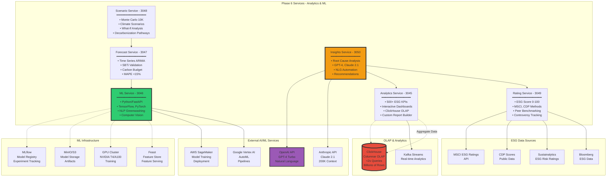

---

## Data Flow Architecture

### End-to-End Data Flow (User → Report)

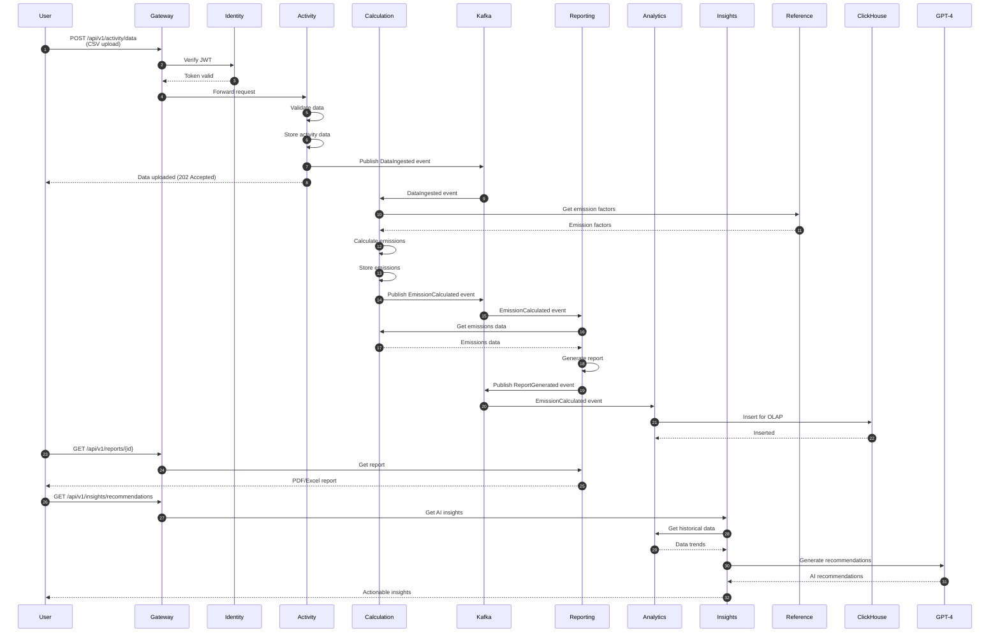

---

## Deployment Architecture

### AWS Cloud Deployment (Production)

```mermaid
graph TB
    subgraph "AWS Cloud - Production Environment"
        subgraph "Edge Layer"
            CF[CloudFront CDN<br/>Static Assets<br/>Next.js Frontend]
            R53[Route 53<br/>DNS<br/>Geo-routing]
        end

        subgraph "Load Balancing"
            ALB[Application Load Balancer<br/>HTTPS/TLS 1.3<br/>WAF Enabled]
        end

        subgraph "Compute Layer - ECS Fargate"
            ECS_CLUSTER[ECS Cluster<br/>Auto-scaling Groups]

            subgraph "Phase 1 Services (7)"
                ECS_P1[ECS Tasks<br/>Identity, Org, Ref<br/>Activity, Calc, Report, Audit]
            end

            subgraph "Phase 2 Services (8)"
                ECS_P2[ECS Tasks<br/>Notification, Workflow<br/>Integration, Policy, etc.]
            end

            subgraph "Phase 3 Services (9)"
                ECS_P3[ECS Tasks<br/>Water, Waste, Bio<br/>Energy, Poll, etc.]
            end

            subgraph "Phase 4 Services (10)"
                ECS_P4[ECS Tasks<br/>Workforce, Safety<br/>Labor, Community, etc.]
            end

            subgraph "Phase 5 Services (8)"
                ECS_P5[ECS Tasks<br/>Board, Ethics, Risk<br/>Privacy, Cyber, etc.]
            end

            subgraph "Phase 6 Services (6)"
                ECS_P6[ECS Tasks<br/>Analytics, ML<br/>Forecast, Insights, etc.]
            end
        end

        subgraph "Data Layer"
            DOCDB[(Amazon DocumentDB<br/>MongoDB-compatible<br/>Multi-AZ)]

            ELASTICACHE[(Amazon ElastiCache<br/>Redis-compatible<br/>Cluster Mode)]

            TIMESTREAM[(Amazon Timestream<br/>Time-series Data<br/>IoT Readings)]

            NEPTUNE[(Amazon Neptune<br/>Graph Database<br/>Supply Chain, Lineage)]

            RDS_PG[(Amazon RDS PostgreSQL<br/>Temporal Workflows<br/>SOX Controls)]
        end

        subgraph "Event Streaming"
            MSK[Amazon MSK<br/>Managed Kafka<br/>3+ Brokers]
        end

        subgraph "Object Storage"
            S3_DATA[(S3 Buckets<br/>• ML Models<br/>• Reports<br/>• Backups)]
        end

        subgraph "ML Infrastructure"
            SAGEMAKER_TRAIN[SageMaker Training<br/>GPU Instances<br/>Spot Instances]

            SAGEMAKER_DEPLOY[SageMaker Endpoints<br/>Real-time Inference<br/>Auto-scaling]
        end

        subgraph "Monitoring & Logging"
            CW[CloudWatch<br/>Metrics, Logs, Alarms]

            XRAY[X-Ray<br/>Distributed Tracing]

            CLOUDTRAIL[CloudTrail<br/>Audit Logs<br/>Compliance]
        end

        subgraph "Security"
            SECRETS[Secrets Manager<br/>Credentials<br/>API Keys]

            KMS[KMS<br/>Encryption Keys<br/>Field-level Encryption]

            WAF_SHIELD[WAF + Shield<br/>DDoS Protection<br/>Bot Detection]
        end
    end

    %% External connections
    Internet[Internet Users] --> R53
    R53 --> CF
    R53 --> ALB
    CF --> S3_DATA
    ALB --> ECS_CLUSTER

    %% ECS to databases
    ECS_P1 --> DOCDB
    ECS_P1 --> ELASTICACHE
    ECS_P2 --> RDS_PG
    ECS_P3 --> TIMESTREAM
    ECS_P3 --> NEPTUNE
    ECS_P4 --> NEPTUNE
    ECS_P5 --> NEPTUNE
    ECS_P6 --> S3_DATA

    %% Event streaming
    ECS_P1 --> MSK
    ECS_P2 --> MSK
    ECS_P6 --> MSK

    %% ML infrastructure
    ECS_P6 --> SAGEMAKER_TRAIN
    ECS_P6 --> SAGEMAKER_DEPLOY
    SAGEMAKER_TRAIN --> S3_DATA

    %% Monitoring
    ECS_CLUSTER --> CW
    ECS_CLUSTER --> XRAY
    ALB --> CW

    %% Security
    ECS_CLUSTER --> SECRETS
    DOCDB --> KMS
    S3_DATA --> KMS
    ALB --> WAF_SHIELD
    CloudTrail --> S3_DATA

    style CF fill:#ff6b6b,stroke:#333,stroke-width:3px
    style ALB fill:#f39c12,stroke:#333,stroke-width:3px
    style ECS_CLUSTER fill:#3498db,stroke:#333,stroke-width:3px
    style DOCDB fill:#27ae60,stroke:#333,stroke-width:3px
    style MSK fill:#e74c3c,stroke:#333,stroke-width:3px
```

---

## Database Architecture

### Multi-Database Strategy (5 Database Types)

```mermaid
graph TB
    subgraph "50 Microservices"
        SERVICES[All 50 Services<br/>Identity, Org, Activity<br/>Water, Safety, Risk<br/>Analytics, ML, etc.]
    end

    subgraph "MongoDB (Document Store)"
        MONGO_CLUSTER[(MongoDB Cluster<br/>Replica Set: 3 nodes<br/>━━━━━━━━━━━━━━━━)]

        subgraph "Databases (50 databases, 1 per service)"
            DB_IDENTITY[(clenergize_identity)]
            DB_ORG[(clenergize_organization)]
            DB_ACTIVITY[(clenergize_activity)]
            DB_CALC[(clenergize_calculation)]
            DB_WATER[(clenergize_water)]
            DB_WASTE[(clenergize_waste)]
            DB_SAFETY[(clenergize_safety)]
            DB_RISK[(clenergize_risk)]
            DB_MORE[(... 42 more databases ...)]
        end
    end

    subgraph "Redis (Cache & PubSub)"
        REDIS_CLUSTER[(Redis Cluster<br/>6 nodes 3 masters, 3 replicas<br/>━━━━━━━━━━━━━━━━)]

        subgraph "Redis Databases"
            REDIS_CACHE[(DB 0: Cache<br/>Session Store<br/>API Response Cache)]
            REDIS_PUBSUB[(DB 1: PubSub<br/>Real-time Notifications<br/>WebSocket Broadcast)]
            REDIS_QUEUE[(DB 2: Queue<br/>Background Jobs<br/>Rate Limiting)]
        end
    end

    subgraph "InfluxDB (Time-Series)"
        INFLUX[(InfluxDB 2.x<br/>━━━━━━━━━━━━━━━━)]

        subgraph "Measurements"
            INFLUX_WATER[Water IoT Readings<br/>1M+ points/day]
            INFLUX_ENERGY[Energy Meter Data<br/>500K+ points/day]
            INFLUX_POLL[CEMS Pollution Data<br/>100K+ points/day]
            INFLUX_METRICS[Service Metrics<br/>Prometheus-style]
        end
    end

    subgraph "Neo4j (Graph Database)"
        NEO4J[(Neo4j 5.x<br/>━━━━━━━━━━━━━━━━)]

        subgraph "Graph Models"
            GRAPH_SUPPLY[Supply Chain Graph<br/>Multi-tier Suppliers<br/>Modern Slavery Risk]
            GRAPH_LINEAGE[Data Lineage Graph<br/>Disclosure → Evidence<br/>Transparency]
            GRAPH_RISK[Risk Relationships<br/>Climate → Financial<br/>Cascading Risks]
        end
    end

    subgraph "ClickHouse (OLAP Analytics)"
        CLICKHOUSE[(ClickHouse Cluster<br/>4 shards, 2 replicas<br/>━━━━━━━━━━━━━━━━)]

        subgraph "Tables"
            CLICK_EMISSIONS[Emissions Fact Table<br/>Billions of rows<br/>Sub-second queries]
            CLICK_SOCIAL[Social Metrics<br/>Aggregated, Anonymized<br/>k-anonymity enforced]
            CLICK_GOVERNANCE[Governance Metrics<br/>Risk, Controls, Incidents]
        end
    end

    subgraph "PostgreSQL (Relational)"
        POSTGRES[(PostgreSQL 15<br/>━━━━━━━━━━━━━━━━)]

        subgraph "Schemas"
            PG_TEMPORAL[Temporal Workflows<br/>State Management<br/>Event History]
            PG_CONTROLS[SOX 404 Controls<br/>Control Matrix<br/>Test Results]
        end
    end

    %% MongoDB connections (each service has own database)
    SERVICES --> MONGO_CLUSTER
    MONGO_CLUSTER --> DB_IDENTITY
    MONGO_CLUSTER --> DB_ORG
    MONGO_CLUSTER --> DB_ACTIVITY
    MONGO_CLUSTER --> DB_MORE

    %% Redis connections (shared, separated by DB number)
    SERVICES --> REDIS_CLUSTER
    REDIS_CLUSTER --> REDIS_CACHE
    REDIS_CLUSTER --> REDIS_PUBSUB
    REDIS_CLUSTER --> REDIS_QUEUE

    %% InfluxDB connections (time-series services)
    SERVICES --> INFLUX
    INFLUX --> INFLUX_WATER
    INFLUX --> INFLUX_ENERGY
    INFLUX --> INFLUX_POLL

    %% Neo4j connections (graph services)
    SERVICES --> NEO4J
    NEO4J --> GRAPH_SUPPLY
    NEO4J --> GRAPH_LINEAGE

    %% ClickHouse connections (analytics)
    SERVICES --> CLICKHOUSE
    CLICKHOUSE --> CLICK_EMISSIONS
    CLICKHOUSE --> CLICK_SOCIAL

    %% PostgreSQL connections (specific services)
    SERVICES --> POSTGRES
    POSTGRES --> PG_TEMPORAL
    POSTGRES --> PG_CONTROLS

    style MONGO_CLUSTER fill:#4ecdc4,stroke:#333,stroke-width:3px
    style REDIS_CLUSTER fill:#e74c3c,stroke:#333,stroke-width:3px
    style INFLUX fill:#f39c12,stroke:#333,stroke-width:3px
    style NEO4J fill:#9b59b6,stroke:#333,stroke-width:3px
    style CLICKHOUSE fill:#e67e22,stroke:#333,stroke-width:3px
    style POSTGRES fill:#3498db,stroke:#333,stroke-width:3px
```

---

## Service Port Allocation

### Complete Port Mapping (Ports 3000-3050)

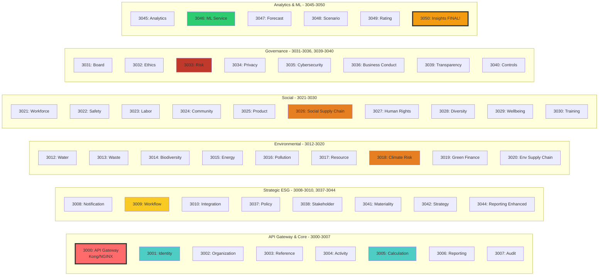

---

## Technology Stack Summary

### Complete Technology Matrix

| Layer | Technology | Purpose | Services Using |
|-------|------------|---------|----------------|
| **Frontend** | Next.js 14, React 18 | Web Application | All (API consumers) |
| **API Gateway** | Kong/NGINX | Routing, Auth, Rate Limiting | Port 3000 |
| **Backend Framework** | NestJS (TypeScript) | Microservices | 44 services |
| **ML Framework** | Python 3.11, FastAPI | Machine Learning | ML Service (3046) |
| **Document DB** | MongoDB 7.x | Primary data store | All 50 services (separate DBs) |
| **Cache** | Redis 7.x | Caching, PubSub, Sessions | All services |
| **Time-Series DB** | InfluxDB 2.x | IoT sensor data | Water, Energy, Pollution (3012, 3015, 3016) |
| **Graph DB** | Neo4j 5.x | Supply chain, Data lineage | Env SC (3020), Social SC (3026), Transparency (3039) |
| **OLAP DB** | ClickHouse | Analytics, OLAP queries | Analytics Service (3045) |
| **Relational DB** | PostgreSQL 15 | Temporal, SOX controls | Workflow (3009), Controls (3040) |
| **Event Streaming** | Apache Kafka / AWS MSK | Event-driven architecture | All services (pub/sub) |
| **Workflow Engine** | Temporal | Business process automation | Workflow Service (3009) |
| **ML Platform** | TensorFlow 2.14, PyTorch 2.1 | Deep learning models | ML Service (3046) |
| **ML Lifecycle** | MLflow | Model registry, tracking | ML Service (3046) |
| **LLM APIs** | OpenAI GPT-4, Anthropic Claude 2.1 | Natural language generation | Insights Service (3050) |
| **Object Storage** | AWS S3 / MinIO | ML models, reports, backups | All services |
| **Container** | Docker | Service packaging | All 50 services |
| **Orchestration** | Kubernetes / AWS ECS Fargate | Container orchestration | Production deployment |
| **IaC** | Terraform | Infrastructure as Code | All infrastructure |
| **CI/CD** | GitHub Actions, ArgoCD | Continuous deployment | All services |
| **Monitoring** | Prometheus, Grafana | Metrics, dashboards | All services |
| **Logging** | ELK Stack / AWS CloudWatch | Centralized logging | All services |
| **Tracing** | OpenTelemetry, Jaeger | Distributed tracing | All services |

---

## Performance Targets

### Service-Level Performance Requirements

| Service | Response Time (p95) | Throughput | Notes |
|---------|---------------------|------------|-------|
| API Gateway | <50ms | 10,000 req/s | Routing overhead only |
| Identity Service | <100ms | 5,000 req/s | JWT verification cached |
| Calculation Service | <200ms | 1,000 calc/s | Complex emission calculations |
| Reporting Service | <10s | 100 reports/s | Full sustainability report generation |
| Analytics Service | <2s | 500 dashboards/s | ClickHouse OLAP, 50+ widgets |
| ML Service (inference) | <100ms | 10,000 predictions/s | Batch: 1,000+ records/sec |
| Climate Risk Service | <30s | 10 simulations/s | Monte Carlo 100K iterations |
| Scenario Service | <30s | 10 scenarios/s | Monte Carlo 10K iterations |
| Insights Service (NLG) | <10s | 100 insights/s | GPT-4/Claude API latency |
| Notification Service | N/A | 100,000 notif/hr | Email, SMS, push delivery |
| Workflow Service | <500ms | 1,000 workflows/s | Temporal overhead |
| All Services (avg) | <200ms | Varies | 99.9% uptime SLA |

---

**Document Version**: 1.0.0
**Last Updated**: November 22, 2025
**Total Services Documented**: 50 microservices
**Total Diagrams**: 13 Mermaid diagrams
**Coverage**: Complete ESG Platform (Environmental, Social, Governance, Analytics/ML)

---

**Next Steps**:
1. Review diagrams with architecture team
2. Validate service dependencies (no circular dependencies)
3. Update deployment scripts with port allocations
4. Generate high-resolution images from Mermaid diagrams (PDF, PNG)
5. Include diagrams in technical presentations and documentation
