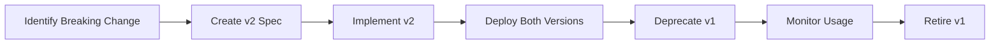

# API Versioning Strategy - Clenergize V3

> **Version**: 1.0.0
> **Status**: APPROVED
> **Critical**: Required for backward compatibility
> **Owner**: Architecture Agent

---

## Executive Summary

This document defines the comprehensive API versioning strategy for the Clenergize V3 platform, ensuring backward compatibility, smooth transitions, and zero-downtime deployments across 50+ microservices.

---

## Versioning Principles

### 1. Semantic Versioning

```yaml
Version Format: /v{major}.{minor}
Examples:
  - /v1 - Initial stable release
  - /v2 - Breaking changes
  - /v1.1 - New features (backward compatible)
  - /v1.2 - Bug fixes (backward compatible)

Rules:
  - Major: Breaking changes (new version required)
  - Minor: New features (backward compatible)
  - Patch: Bug fixes (internal, not exposed in URL)
```

### 2. API Lifecycle

```
┌──────────┐    ┌──────────┐    ┌──────────────┐    ┌────────────┐
│ Preview  │ →  │  Stable  │ →  │  Deprecated  │ →  │  Retired   │
│ (Alpha)  │    │  (GA)    │    │  (Sunset)    │    │  (Removed) │
└──────────┘    └──────────┘    └──────────────┘    └────────────┘
   3 months        ∞              6 months            Archived
```

---

## URL Structure

### External APIs (Client-Facing)

```yaml
Pattern: /api/v{major}/resource
Examples:
  - /api/v1/users
  - /api/v1/companies
  - /api/v2/activities  # Breaking change in v2

Headers:
  - Accept: application/vnd.clenergize.v1+json
  - X-API-Version: 1 (optional override)
```

### Internal APIs (Service-to-Service)

```yaml
Pattern: /internal/v{major}/resource
Examples:
  - /internal/v1/users/{id}
  - /internal/v1/calculations/request

Headers:
  - X-Service-Name: identity-service
  - X-Service-Version: 1.2.3
  - X-Correlation-Id: uuid-v4
```

---

## Versioning Implementation

### 1. Controller-Level Versioning

```typescript
// NestJS Implementation
@Controller('api')
export class ApiController {
  // Version 1
  @Version('1')
  @Get('users')
  async getUsersV1(@Query() query: GetUsersV1Dto): Promise<UserV1[]> {
    return this.userService.findAll(query);
  }

  // Version 2 with breaking changes
  @Version('2')
  @Get('users')
  async getUsersV2(@Query() query: GetUsersV2Dto): Promise<UserV2[]> {
    // New response structure
    return this.userService.findAllV2(query);
  }
}
```

### 2. Service-Level Versioning

```typescript
// Service Implementation
@Injectable()
export class UserService {
  // Version-specific methods
  async findAll(query: GetUsersV1Dto): Promise<UserV1[]> {
    const users = await this.userRepository.find(query);
    return users.map(u => this.toV1Response(u));
  }

  async findAllV2(query: GetUsersV2Dto): Promise<UserV2[]> {
    const users = await this.userRepository.findV2(query);
    return users.map(u => this.toV2Response(u));
  }

  // Response transformers
  private toV1Response(user: User): UserV1 {
    return {
      id: user.id,
      email: user.email,
      name: `${user.firstName} ${user.lastName}` // Combined in v1
    };
  }

  private toV2Response(user: User): UserV2 {
    return {
      id: user.id,
      email: user.email,
      firstName: user.firstName, // Separate in v2
      lastName: user.lastName,
      metadata: user.metadata // New field in v2
    };
  }
}
```

---

## Breaking Change Definition

### What Constitutes a Breaking Change

```yaml
Breaking Changes (Require Major Version):
  ❌ Removing a field from response
  ❌ Changing field type (string → number)
  ❌ Changing field semantics
  ❌ Removing an endpoint
  ❌ Changing authentication method
  ❌ Changing error codes/format
  ❌ Changing pagination structure

Non-Breaking Changes (Minor Version):
  ✅ Adding optional fields to response
  ✅ Adding new endpoints
  ✅ Adding optional query parameters
  ✅ Expanding enum values
  ✅ Performance improvements
  ✅ Bug fixes
```

### Breaking Change Process



---

## Deprecation Policy

### Timeline

```yaml
Preview (Alpha):
  - Duration: 3 months maximum
  - Breaking changes allowed
  - No SLA guarantees
  - Clear "alpha" marking

Stable (GA):
  - Duration: Indefinite
  - No breaking changes
  - Full SLA guarantees
  - Production ready

Deprecated:
  - Duration: 6 months minimum
  - Still functional
  - Sunset-Date header included
  - Migration guide provided

Retired:
  - Returns 410 Gone
  - Redirect to newer version docs
  - Archived documentation available
```

### Deprecation Headers

```http
HTTP/1.1 200 OK
Sunset-Date: Sat, 31 Dec 2025 23:59:59 GMT
Deprecation: true
Link: </api/v2/users>; rel="successor-version"
Warning: 299 - "This API version is deprecated and will be retired on 2025-12-31"
```

### Client Notification

```typescript
class DeprecationMiddleware implements NestMiddleware {
  use(req: Request, res: Response, next: NextFunction) {
    const version = this.extractVersion(req.path);

    if (this.isDeprecated(version)) {
      res.setHeader('Sunset-Date', this.getSunsetDate(version));
      res.setHeader('Deprecation', 'true');
      res.setHeader('Link', this.getSuccessorLink(version));
      res.setHeader('Warning', this.getWarningMessage(version));

      // Log client usage for monitoring
      this.metrics.recordDeprecatedApiUsage({
        version,
        client: req.headers['x-client-id'],
        endpoint: req.path,
        timestamp: new Date()
      });
    }

    next();
  }
}
```

---

## API Gateway Configuration

### Version Routing

```yaml
# Kong/NGINX Configuration
routes:
  - name: users-v1
    paths:
      - /api/v1/users
    service: identity-service
    plugins:
      - name: rate-limiting
        config:
          minute: 100

  - name: users-v2
    paths:
      - /api/v2/users
    service: identity-service-v2
    plugins:
      - name: rate-limiting
        config:
          minute: 200  # Higher limit for v2
```

### Version Discovery

```typescript
// Version discovery endpoint
@Controller('api')
export class VersionController {
  @Get('versions')
  getAvailableVersions(): VersionInfo[] {
    return [
      {
        version: 'v1',
        status: 'deprecated',
        sunsetDate: '2025-12-31',
        endpoints: ['/api/v1/users', '/api/v1/companies']
      },
      {
        version: 'v2',
        status: 'stable',
        endpoints: ['/api/v2/users', '/api/v2/companies', '/api/v2/activities']
      },
      {
        version: 'v3',
        status: 'preview',
        endpoints: ['/api/v3/calculations']
      }
    ];
  }
}
```

---

## Consumer-Driven Contracts

### Pact Implementation

```typescript
// Consumer Test (Organization Service)
describe('Identity Service API Contract', () => {
  describe('GET /internal/v1/users/:id', () => {
    it('should return user details', async () => {
      await provider.addInteraction({
        state: 'user exists',
        uponReceiving: 'a request for user details',
        withRequest: {
          method: 'GET',
          path: '/internal/v1/users/123',
          headers: {
            'X-Service-Name': 'organization-service',
            'X-Service-Version': '1.0.0'
          }
        },
        willRespondWith: {
          status: 200,
          headers: {
            'Content-Type': 'application/json'
          },
          body: {
            id: '123',
            email: 'user@example.com',
            roles: ['admin']
          }
        }
      });

      const response = await identityClient.getUser('123');
      expect(response.email).toBe('user@example.com');
    });
  });
});
```

### Contract Compatibility Matrix

```yaml
Service Compatibility Matrix:
  Identity Service:
    v1:
      - Organization Service: v1, v2 ✅
      - Activity Service: v1 ✅
      - Reporting Service: v1 ✅
    v2:
      - Organization Service: v2, v3 ✅
      - Activity Service: v2 ✅
      - Reporting Service: v2 ✅

  Organization Service:
    v1:
      - Identity Service: v1 ✅
      - Activity Service: v1 ✅
    v2:
      - Identity Service: v1, v2 ✅
      - Activity Service: v1, v2 ✅
```

---

## Version Migration Tools

### Client SDKs

```typescript
// TypeScript SDK with version support
class ClenergizeClient {
  constructor(
    private baseUrl: string,
    private version: string = 'v1',
    private options?: ClientOptions
  ) {}

  async getUsers(params?: GetUsersParams): Promise<User[]> {
    const url = `${this.baseUrl}/api/${this.version}/users`;
    const response = await this.http.get(url, { params });

    // Handle deprecation warnings
    if (response.headers['deprecation']) {
      console.warn(`API version ${this.version} is deprecated. Sunset: ${response.headers['sunset-date']}`);
    }

    return response.data;
  }

  // Version-specific method variants
  async getUsersV2(params?: GetUsersV2Params): Promise<UserV2[]> {
    const client = new ClenergizeClient(this.baseUrl, 'v2', this.options);
    return client.getUsers(params) as Promise<UserV2[]>;
  }
}
```

### Migration Scripts

```typescript
// Automated migration script generator
class MigrationGenerator {
  async generateMigrationGuide(fromVersion: string, toVersion: string): Promise<MigrationGuide> {
    const changes = await this.detectBreakingChanges(fromVersion, toVersion);

    return {
      fromVersion,
      toVersion,
      breakingChanges: changes,
      migrationSteps: this.generateSteps(changes),
      codeExamples: this.generateExamples(changes),
      estimatedEffort: this.estimateEffort(changes)
    };
  }

  private async detectBreakingChanges(v1: string, v2: string): Promise<BreakingChange[]> {
    const v1Schema = await this.loadOpenAPISchema(v1);
    const v2Schema = await this.loadOpenAPISchema(v2);

    return this.compareSchemas(v1Schema, v2Schema);
  }
}
```

---

## Monitoring & Analytics

### Version Usage Metrics

```yaml
Metrics to Track:
  - API version distribution
  - Deprecated version usage
  - Client migration progress
  - Error rates by version
  - Performance by version
  - Feature adoption rates
```

### Grafana Dashboard

```json
{
  "dashboard": {
    "title": "API Version Analytics",
    "panels": [
      {
        "title": "Version Distribution",
        "query": "sum by (version) (rate(api_requests_total[5m]))"
      },
      {
        "title": "Deprecated API Usage",
        "query": "sum by (client_id, version) (api_deprecated_requests_total)"
      },
      {
        "title": "Migration Progress",
        "query": "api_version_migration_progress"
      }
    ]
  }
}
```

---

## OpenAPI Documentation

### Multi-Version Swagger

```yaml
openapi: 3.0.0
info:
  title: Clenergize API
  version: 2.0.0
  x-api-versions:
    - version: v1
      status: deprecated
      sunsetDate: 2025-12-31
    - version: v2
      status: stable
    - version: v3
      status: preview

servers:
  - url: https://api.clenergize.com/api/v1
    description: Version 1 (Deprecated)
  - url: https://api.clenergize.com/api/v2
    description: Version 2 (Stable)
  - url: https://api.clenergize.com/api/v3
    description: Version 3 (Preview)

paths:
  /users:
    get:
      operationId: getUsers
      x-available-versions: [v1, v2, v3]
      x-deprecated-in: v1
      responses:
        200:
          description: Success
          content:
            application/json:
              schema:
                oneOf:
                  - $ref: '#/components/schemas/UserV1'
                  - $ref: '#/components/schemas/UserV2'
                  - $ref: '#/components/schemas/UserV3'
```

---

## Testing Strategy

### Version Compatibility Tests

```typescript
describe('API Version Compatibility', () => {
  test('v1 client can call v2 API with compatibility layer', async () => {
    const v1Client = new ClenergizeClient(baseUrl, 'v1');
    const v2Server = new MockServer('v2');

    const response = await v1Client.getUsers();
    expect(response).toMatchV1Schema();
  });

  test('v2 API maintains backward compatibility for non-breaking changes', async () => {
    const v1Response = await fetchV1('/users');
    const v2Response = await fetchV2('/users');

    // V2 should have all V1 fields
    expect(v2Response).toMatchObject(v1Response);
  });
});
```

---

## Implementation Checklist

```yaml
Phase 1 - Foundation:
  ☐ Version routing in API Gateway
  ☐ Deprecation headers middleware
  ☐ Version discovery endpoint
  ☐ OpenAPI multi-version docs

Phase 2 - Tooling:
  ☐ Client SDKs with version support
  ☐ Migration guide generator
  ☐ Contract testing setup
  ☐ Version compatibility matrix

Phase 3 - Monitoring:
  ☐ Version usage metrics
  ☐ Deprecation monitoring
  ☐ Client migration tracking
  ☐ Performance comparison

Phase 4 - Automation:
  ☐ Automated compatibility testing
  ☐ Breaking change detection
  ☐ Client notification system
  ☐ Migration script generation
```

---

## Success Criteria

```yaml
Metrics:
  ✅ Zero unplanned breaking changes
  ✅ 100% backward compatibility for minor versions
  ✅ 6-month deprecation notice maintained
  ✅ <5% clients on deprecated versions
  ✅ Migration guides for all breaking changes
  ✅ Contract tests for all service interactions
```

---

**Document Status**: COMPLETE
**Next Review**: Quarterly
**Owner**: Architecture Agent