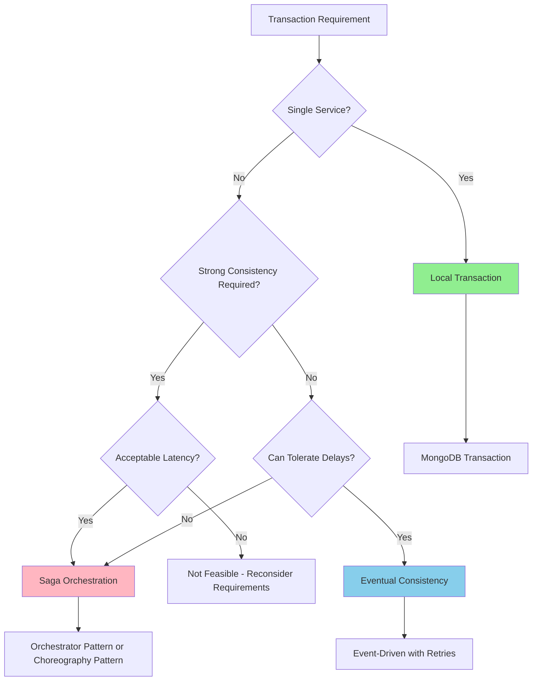

# Transaction Boundary Specification

**Project**: Clenergize V3 Rebuild
**Version**: 1.0.0
**Last Updated**: November 19, 2025
**Status**: ACTIVE
**Priority**: CRITICAL

---

## Executive Summary

This document defines transaction boundaries for all use cases in the Clenergize V3 microservices architecture. It specifies when to use:
- **Local Transactions** (MongoDB ACID transactions within a single service)
- **Saga Orchestration** (distributed transactions across multiple services)
- **Eventual Consistency** (asynchronous event-driven updates with no immediate consistency guarantee)

**Key Principle**: Use the **simplest transaction strategy** that meets business requirements. Prefer local transactions over sagas, and sagas over eventual consistency.

---

## Table of Contents

1. [Transaction Strategy Decision Matrix](#transaction-strategy-decision-matrix)
2. [Local Transactions (Within Service)](#local-transactions-within-service)
3. [Saga Orchestration (Cross-Service)](#saga-orchestration-cross-service)
4. [Eventual Consistency (Asynchronous)](#eventual-consistency-asynchronous)
5. [Use Case Catalog](#use-case-catalog)
6. [Saga Implementation Patterns](#saga-implementation-patterns)
7. [Rollback & Compensation](#rollback--compensation)
8. [Error Handling Strategies](#error-handling-strategies)

---

## 1. Transaction Strategy Decision Matrix

### 1.1 Decision Tree



### 1.2 Strategy Selection Criteria

| Criteria | Local Transaction | Saga Orchestration | Eventual Consistency |
|----------|------------------|-------------------|---------------------|
| **Services Involved** | 1 service | 2+ services | 2+ services |
| **Consistency Requirement** | ACID | Eventually consistent (seconds) | Eventually consistent (minutes-hours) |
| **Latency** | <50ms | 200-500ms | Asynchronous (no wait) |
| **Complexity** | Low | High | Medium |
| **Rollback** | Automatic | Manual compensation | Idempotent retries |
| **Failure Handling** | Rollback entire transaction | Compensating transactions | Retry until success or DLQ |
| **Use When** | Single database write | Cross-service write with immediate consistency | Cross-service write with delayed consistency |

---

## 2. Local Transactions (Within Service)

### 2.1 When to Use

Use **local transactions** when:
- ✅ All data modifications are within a **single service's database**
- ✅ ACID guarantees are required
- ✅ No cross-service communication needed
- ✅ Rollback can be handled by database transaction abort

### 2.2 MongoDB Transaction Pattern

```typescript
// src/application/commands/create-user.handler.ts
import { Injectable } from '@nestjs/common';
import { InjectConnection } from '@nestjs/mongoose';
import { Connection, ClientSession } from 'mongoose';

@Injectable()
export class CreateUserCommandHandler {
  constructor(
    @InjectConnection() private readonly connection: Connection,
    private readonly userRepository: UserRepository,
    private readonly eventBus: EventBusService,
    private readonly logger: LoggerService
  ) {}

  async execute(command: CreateUserCommand): Promise<UserCreatedResult> {
    const session: ClientSession = await this.connection.startSession();

    try {
      // Start transaction
      await session.startTransaction();

      // Step 1: Create user document
      const user = await this.userRepository.create({
        email: command.email,
        firstName: command.firstName,
        lastName: command.lastName,
        roles: command.roles,
        status: 'ACTIVE'
      }, { session });

      // Step 2: Create user profile document (same database)
      const profile = await this.profileRepository.create({
        userId: user.id,
        bio: '',
        avatar: null
      }, { session });

      // Step 3: Create user preferences document (same database)
      const preferences = await this.preferencesRepository.create({
        userId: user.id,
        theme: 'light',
        notifications: true
      }, { session });

      // Commit transaction
      await session.commitTransaction();

      this.logger.info('User created successfully', {
        userId: user.id,
        correlationId: command.correlationId
      });

      // Publish event AFTER successful commit
      await this.eventBus.publish({
        type: 'identity.user.created.v1',
        aggregateId: user.id,
        data: {
          userId: user.id,
          email: user.email,
          firstName: user.firstName,
          lastName: user.lastName,
          roles: user.roles
        }
      });

      return { success: true, userId: user.id };

    } catch (error) {
      // Rollback transaction
      await session.abortTransaction();

      this.logger.error('User creation failed, transaction rolled back', {
        error: error.message,
        correlationId: command.correlationId
      });

      throw new UserCreationFailedError('Failed to create user', error);

    } finally {
      // Always end session
      await session.endSession();
    }
  }
}
```

### 2.3 Local Transaction Checklist

Before using a local transaction, verify:
- [ ] All writes are to the **same MongoDB database**
- [ ] Transaction duration will be **< 1 second** (MongoDB limitation)
- [ ] No cross-service HTTP calls within transaction
- [ ] Event publishing happens **AFTER** transaction commits

---

## 3. Saga Orchestration (Cross-Service)

### 3.1 When to Use

Use **saga orchestration** when:
- ✅ Multiple services must participate in a transaction
- ✅ Strong consistency is required (within seconds)
- ✅ Immediate feedback to user is needed
- ✅ Compensating actions can be defined for each step

### 3.2 Orchestrator Pattern

**Pattern**: Central orchestrator service coordinates all steps.

**Advantages**:
- Clear workflow visibility
- Centralized error handling
- Easy to add/modify steps

**Disadvantages**:
- Single point of failure (mitigate with high availability)
- Orchestrator becomes complex

**Implementation**:

```typescript
// src/application/sagas/create-project-saga.orchestrator.ts
import { Injectable } from '@nestjs/common';

@Injectable()
export class CreateProjectSagaOrchestrator {
  constructor(
    private readonly organizationService: OrganizationServiceClient,
    private readonly referenceService: ReferenceServiceClient,
    private readonly activityService: ActivityServiceClient,
    private readonly eventBus: EventBusService,
    private readonly logger: LoggerService
  ) {}

  async execute(command: CreateProjectCommand): Promise<CreateProjectResult> {
    const sagaId = uuidv4();
    const compensations: CompensationAction[] = [];

    this.logger.info('Starting CreateProject saga', {
      sagaId,
      correlationId: command.correlationId
    });

    try {
      // Step 1: Create project in Organization Service
      const project = await this.organizationService.createProject({
        companyId: command.companyId,
        projectName: command.projectName,
        year: command.year
      });

      compensations.push({
        action: () => this.organizationService.deleteProject(project.id),
        description: 'Delete project'
      });

      this.logger.info('Saga step 1 complete: Project created', {
        sagaId,
        projectId: project.id
      });

      // Step 2: Create hierarchy in Organization Service
      const hierarchy = await this.organizationService.createHierarchy({
        projectId: project.id,
        templateId: command.hierarchyTemplateId
      });

      compensations.push({
        action: () => this.organizationService.deleteHierarchy(hierarchy.id),
        description: 'Delete hierarchy'
      });

      this.logger.info('Saga step 2 complete: Hierarchy created', {
        sagaId,
        hierarchyId: hierarchy.id
      });

      // Step 3: Validate emission factors exist in Reference Service
      const factorsExist = await this.referenceService.validateFactors({
        year: command.year,
        parameterIds: command.parameterIds
      });

      if (!factorsExist) {
        throw new SagaStepFailedError('Emission factors not found for year');
      }

      this.logger.info('Saga step 3 complete: Emission factors validated', {
        sagaId
      });

      // Step 4: Initialize activity data collections in Activity Service
      await this.activityService.initializeCollections({
        projectId: project.id,
        year: command.year,
        parameters: command.parameterIds
      });

      compensations.push({
        action: () => this.activityService.deleteCollections(project.id),
        description: 'Delete activity collections'
      });

      this.logger.info('Saga step 4 complete: Activity collections initialized', {
        sagaId
      });

      // SUCCESS: All steps completed
      this.logger.info('CreateProject saga completed successfully', {
        sagaId,
        projectId: project.id
      });

      // Publish success event
      await this.eventBus.publish({
        type: 'organization.project.created.v1',
        aggregateId: project.id,
        data: {
          projectId: project.id,
          companyId: command.companyId,
          projectName: command.projectName,
          year: command.year
        }
      });

      return { success: true, projectId: project.id };

    } catch (error) {
      // FAILURE: Execute compensating transactions in reverse order
      this.logger.error('CreateProject saga failed, executing compensations', {
        sagaId,
        error: error.message,
        compensationCount: compensations.length
      });

      await this.executeCompensations(compensations.reverse(), sagaId);

      // Publish failure event
      await this.eventBus.publish({
        type: 'organization.project.creation-failed.v1',
        data: {
          sagaId,
          companyId: command.companyId,
          error: error.message
        }
      });

      throw new ProjectCreationFailedError('Project creation saga failed', error);
    }
  }

  private async executeCompensations(
    compensations: CompensationAction[],
    sagaId: string
  ): Promise<void> {
    for (const compensation of compensations) {
      try {
        await compensation.action();
        this.logger.info('Compensation executed successfully', {
          sagaId,
          description: compensation.description
        });
      } catch (compensationError) {
        // Log compensation failure but continue with other compensations
        this.logger.error('Compensation failed', {
          sagaId,
          description: compensation.description,
          error: compensationError.message
        });
      }
    }
  }
}

interface CompensationAction {
  action: () => Promise<void>;
  description: string;
}
```

### 3.3 Choreography Pattern

**Pattern**: Each service reacts to events and triggers the next step.

**Advantages**:
- No central orchestrator needed
- Services loosely coupled
- Scales well

**Disadvantages**:
- Harder to debug (distributed workflow)
- No single point of workflow visibility

**Implementation**:

```typescript
// Organization Service: Publishes project.created event
await this.eventBus.publish({
  type: 'organization.project.created.v1',
  data: { projectId, companyId, year }
});

// Activity Service: Consumes project.created, initializes collections, publishes activity.initialized
@EventPattern('organization.project.created.v1')
async handleProjectCreated(event: ProjectCreatedEvent) {
  await this.activityService.initializeCollections(event.data.projectId);
  await this.eventBus.publish({
    type: 'activity.collections.initialized.v1',
    data: { projectId: event.data.projectId }
  });
}

// Calculation Service: Consumes activity.initialized, creates calculation stubs
@EventPattern('activity.collections.initialized.v1')
async handleActivityInitialized(event: ActivityInitializedEvent) {
  await this.calculationService.createCalculationStubs(event.data.projectId);
}
```

---

## 4. Eventual Consistency (Asynchronous)

### 4.1 When to Use

Use **eventual consistency** when:
- ✅ Asynchronous updates are acceptable (minutes to hours)
- ✅ User doesn't need immediate feedback
- ✅ Retries can handle temporary failures
- ✅ Idempotency is ensured

### 4.2 Event-Driven Pattern

```typescript
// Publisher: Identity Service publishes user.created event
await this.eventBus.publish({
  type: 'identity.user.created.v1',
  data: {
    userId: user.id,
    email: user.email,
    firstName: user.firstName,
    lastName: user.lastName
  }
});

// Consumer: Organization Service caches user details (asynchronous)
@EventPattern('identity.user.created.v1')
async handleUserCreated(event: UserCreatedEvent) {
  // Cache user details in Redis for 5 minutes
  await this.redis.set(
    `user:${event.data.userId}`,
    JSON.stringify({
      email: event.data.email,
      firstName: event.data.firstName,
      lastName: event.data.lastName
    }),
    'EX',
    300  // 5 minutes TTL
  );

  this.logger.info('User details cached', {
    userId: event.data.userId,
    correlationId: event.correlationId
  });
}
```

### 4.3 Idempotency Pattern

**Critical**: Ensure event handlers are idempotent (can be retried without side effects).

```typescript
@EventPattern('calculation.emission.calculated.v1')
async handleEmissionCalculated(event: EmissionCalculatedEvent) {
  const { emissionId, projectId, value } = event.data;

  // Check if already processed using unique event ID
  const processed = await this.redis.get(`processed:${event.id}`);
  if (processed) {
    this.logger.warn('Event already processed, skipping', {
      eventId: event.id,
      emissionId
    });
    return;  // Idempotent: Skip duplicate events
  }

  // Process event
  await this.reportingService.updateReport({
    projectId,
    emissionId,
    value
  });

  // Mark as processed (TTL 7 days to prevent replay attacks)
  await this.redis.set(`processed:${event.id}`, 'true', 'EX', 7 * 24 * 60 * 60);

  this.logger.info('Emission calculated event processed', {
    eventId: event.id,
    emissionId
  });
}
```

---

## 5. Use Case Catalog

### 5.1 Identity Service Use Cases

| Use Case | Strategy | Services Involved | Justification |
|----------|----------|-------------------|---------------|
| **Create User** | Local Transaction | Identity (single DB) | User + Profile + Preferences in same database |
| **Authenticate User** | Local Transaction | Identity (single DB) | Update last login + create session in same database |
| **Update User Email** | Local Transaction | Identity (single DB) | Update user document only |
| **Delete User** | Eventual Consistency | Identity → Organization, Activity, Calculation, Reporting | Asynchronous cascade delete acceptable (publish `user.deleted.v1` event) |
| **Assign Role** | Local Transaction | Identity (single DB) | Update roles array in user document |

---

### 5.2 Organization Service Use Cases

| Use Case | Strategy | Services Involved | Justification |
|----------|----------|-------------------|---------------|
| **Create Company** | Local Transaction | Organization (single DB) | Company document only |
| **Create Project** | Saga Orchestration | Organization + Reference + Activity | Must validate emission factors exist + initialize activity collections atomically |
| **Update Project Hierarchy** | Saga Orchestration | Organization + Activity + Calculation | Must propagate hierarchy changes to activity data + recalculate rollups |
| **Delete Project** | Eventual Consistency | Organization → Activity, Calculation, Reporting | Asynchronous cascade delete acceptable (publish `project.deleted.v1` event) |
| **Assign User to Project** | Local Transaction | Organization (single DB) | User assignment document only |
| **Lock Project Year** | Saga Orchestration | Organization + Activity + Calculation | Must prevent new data entry + finalize calculations atomically |

---

### 5.3 Reference Service Use Cases

| Use Case | Strategy | Services Involved | Justification |
|----------|----------|-------------------|---------------|
| **Create Emission Factor** | Local Transaction | Reference (single DB) | Emission factor document only |
| **Update Emission Factor** | Eventual Consistency | Reference → Activity, Calculation | Recalculations can happen asynchronously (publish `factor.updated.v1` event) |
| **Create Parameter** | Local Transaction | Reference (single DB) | Parameter document only |
| **Seed Reference Data** | Local Transaction | Reference (single DB) | Batch insert emission factors in single transaction |

---

### 5.4 Activity Service Use Cases

| Use Case | Strategy | Services Involved | Justification |
|----------|----------|-------------------|---------------|
| **Ingest Activity Data** | Saga Orchestration | Activity + Calculation | Must trigger calculation immediately (user expects instant feedback) |
| **Bulk Import Excel** | Eventual Consistency | Activity → Calculation | Long-running import can trigger calculations asynchronously (publish `bulk-import.completed.v1` event) |
| **Update Activity Data** | Saga Orchestration | Activity + Calculation | Must recalculate emissions immediately |
| **Delete Activity Data** | Saga Orchestration | Activity + Calculation | Must remove calculation results immediately |
| **Upload Evidence File** | Local Transaction | Activity (S3 + DB) | S3 upload + document update in single operation (with compensation if S3 fails) |

---

### 5.5 Calculation Service Use Cases

| Use Case | Strategy | Services Involved | Justification |
|----------|----------|-------------------|---------------|
| **Calculate Emissions** | Local Transaction | Calculation (single DB) | Emission calculation + result storage in same database |
| **Rollup Calculations** | Local Transaction | Calculation (single DB) | Aggregate child emissions into parent in same database |
| **Recalculate on Factor Update** | Eventual Consistency | Calculation (triggered by Reference) | Asynchronous recalculation acceptable (triggered by `factor.updated.v1` event) |
| **Recalculate on Hierarchy Change** | Eventual Consistency | Calculation (triggered by Organization) | Asynchronous recalculation acceptable (triggered by `hierarchy.updated.v1` event) |

---

### 5.6 Reporting Service Use Cases

| Use Case | Strategy | Services Involved | Justification |
|----------|----------|-------------------|---------------|
| **Generate Report** | Eventual Consistency | Reporting (triggered by Calculation) | Report generation can happen asynchronously (triggered by `emission.calculated.v1` event) |
| **Schedule Report** | Local Transaction | Reporting (single DB) | Schedule document only |
| **Download Report** | Local Transaction | Reporting (S3 + DB) | Fetch from S3 + log download in DB |
| **Email Report** | Eventual Consistency | Reporting → Identity → SES | Email delivery asynchronous (publish `report.sent.v1` event after success) |

---

### 5.7 Audit Service Use Cases

| Use Case | Strategy | Services Involved | Justification |
|----------|----------|-------------------|---------------|
| **Log Event** | Local Transaction | Audit (single DB) | Audit log document + hash chain update in same database |
| **Verify Hash Chain** | Local Transaction | Audit (single DB) | Read audit logs + compute hashes in memory |
| **Generate Compliance Report** | Local Transaction | Audit (single DB) | Query audit logs only |

---

## 6. Saga Implementation Patterns

### 6.1 Saga State Machine

**Pattern**: Model saga as finite state machine with explicit states.

```typescript
enum CreateProjectSagaState {
  STARTED = 'STARTED',
  PROJECT_CREATED = 'PROJECT_CREATED',
  HIERARCHY_CREATED = 'HIERARCHY_CREATED',
  FACTORS_VALIDATED = 'FACTORS_VALIDATED',
  ACTIVITY_INITIALIZED = 'ACTIVITY_INITIALIZED',
  COMPLETED = 'COMPLETED',
  FAILED = 'FAILED',
  COMPENSATING = 'COMPENSATING',
  COMPENSATED = 'COMPENSATED'
}

interface SagaInstance {
  sagaId: string;
  state: CreateProjectSagaState;
  projectId?: string;
  hierarchyId?: string;
  completedSteps: string[];
  compensatedSteps: string[];
  error?: string;
  startedAt: Date;
  completedAt?: Date;
}
```

### 6.2 Saga Persistence

**Pattern**: Persist saga state to enable recovery after crashes.

```typescript
class SagaRepository {
  async saveSagaState(saga: SagaInstance): Promise<void> {
    await this.db.collection('saga_instances').updateOne(
      { sagaId: saga.sagaId },
      { $set: saga },
      { upsert: true }
    );
  }

  async getSagaState(sagaId: string): Promise<SagaInstance | null> {
    return await this.db.collection('saga_instances').findOne({ sagaId });
  }

  async getActiveSagas(): Promise<SagaInstance[]> {
    return await this.db.collection('saga_instances').find({
      state: { $nin: ['COMPLETED', 'FAILED', 'COMPENSATED'] }
    }).toArray();
  }
}
```

### 6.3 Saga Recovery

**Pattern**: Recover in-progress sagas after service restart.

```typescript
@Injectable()
export class SagaRecoveryService implements OnModuleInit {
  async onModuleInit() {
    // Recover active sagas on service startup
    const activeSagas = await this.sagaRepository.getActiveSagas();

    for (const saga of activeSagas) {
      this.logger.info('Recovering saga', { sagaId: saga.sagaId, state: saga.state });

      // Resume saga from last completed step
      await this.sagaOrchestrator.resume(saga);
    }
  }
}
```

---

## 7. Rollback & Compensation

### 7.1 Compensation Action Design

**Principle**: Design compensating actions that **semantically undo** the original action.

**Examples**:

| Original Action | Compensating Action | Notes |
|----------------|---------------------|-------|
| Create Project | Delete Project | Hard delete (before any user data added) |
| Create Hierarchy | Delete Hierarchy | Cascade delete all child entities |
| Initialize Activity Collections | Delete Activity Collections | Remove all activity data documents |
| Lock Project Year | Unlock Project Year | Re-enable data entry |
| Send Email | (No compensation) | Cannot unsend email - compensate by sending "correction" email |

### 7.2 Compensation Idempotency

**Critical**: Compensating actions MUST be idempotent (safe to retry).

```typescript
async compensateCreateProject(projectId: string): Promise<void> {
  // Check if project exists (idempotent check)
  const project = await this.projectRepository.findById(projectId);

  if (!project) {
    this.logger.warn('Project already deleted, compensation skipped', { projectId });
    return;  // Idempotent: Skip if already compensated
  }

  // Delete project
  await this.projectRepository.delete(projectId);

  this.logger.info('Project deleted (compensated)', { projectId });
}
```

### 7.3 Compensation Failures

**Handling**: If compensation fails, log to dead letter queue for manual intervention.

```typescript
private async executeCompensations(
  compensations: CompensationAction[],
  sagaId: string
): Promise<void> {
  for (const compensation of compensations) {
    try {
      await compensation.action();
      this.logger.info('Compensation executed successfully', {
        sagaId,
        description: compensation.description
      });
    } catch (compensationError) {
      // CRITICAL: Compensation failure
      this.logger.error('Compensation failed - manual intervention required', {
        sagaId,
        description: compensation.description,
        error: compensationError.message
      });

      // Send to dead letter queue for manual intervention
      await this.dlqService.send({
        type: 'SAGA_COMPENSATION_FAILED',
        sagaId,
        compensation: compensation.description,
        error: compensationError.message,
        timestamp: new Date().toISOString()
      });

      // Continue with other compensations (don't fail entire rollback)
    }
  }
}
```

---

## 8. Error Handling Strategies

### 8.1 Retry with Exponential Backoff

**Pattern**: Retry transient failures with increasing delays.

```typescript
async function retryWithBackoff<T>(
  operation: () => Promise<T>,
  maxRetries: number = 3,
  baseDelay: number = 1000
): Promise<T> {
  for (let attempt = 1; attempt <= maxRetries; attempt++) {
    try {
      return await operation();
    } catch (error) {
      if (attempt === maxRetries) {
        throw error;  // Final attempt failed
      }

      // Exponential backoff: 1s, 2s, 4s, 8s, ...
      const delay = baseDelay * Math.pow(2, attempt - 1);

      this.logger.warn('Operation failed, retrying', {
        attempt,
        maxRetries,
        delay,
        error: error.message
      });

      await new Promise(resolve => setTimeout(resolve, delay));
    }
  }
}
```

### 8.2 Circuit Breaker Pattern

**Pattern**: Prevent cascading failures by failing fast when a service is unhealthy.

```typescript
import CircuitBreaker from 'opossum';

const organizationServiceCircuit = new CircuitBreaker(
  async (params) => {
    return await this.httpClient.post(
      `${ORGANIZATION_SERVICE_URL}/v1/projects`,
      params
    );
  },
  {
    timeout: 5000,                    // Timeout after 5 seconds
    errorThresholdPercentage: 50,     // Open circuit if 50% of requests fail
    resetTimeout: 30000,              // Try again after 30 seconds
    rollingCountTimeout: 10000,       // Rolling window of 10 seconds
    rollingCountBuckets: 10           // 10 buckets of 1 second each
  }
);

// Handle circuit open event
organizationServiceCircuit.on('open', () => {
  this.logger.error('Circuit breaker opened for Organization Service');
  // Publish alert event
});

// Handle circuit closed event
organizationServiceCircuit.on('close', () => {
  this.logger.info('Circuit breaker closed for Organization Service');
});

// Use circuit breaker
try {
  const project = await organizationServiceCircuit.fire({ projectName: 'Test' });
} catch (error) {
  if (error.message === 'Breaker is open') {
    throw new ServiceUnavailableError('Organization Service is currently unavailable');
  }
  throw error;
}
```

### 8.3 Dead Letter Queue (DLQ)

**Pattern**: Move failed events to DLQ after max retries for manual intervention.

```typescript
@EventPattern('activity.data.ingested.v1')
async handleDataIngested(event: DataIngestedEvent, retryCount: number = 0) {
  const maxRetries = 3;

  try {
    await this.calculationService.calculate(event.data);
  } catch (error) {
    if (retryCount < maxRetries) {
      // Retry with delay
      await this.retryWithDelay(event, retryCount + 1);
    } else {
      // Move to dead letter queue after max retries
      await this.dlqService.send({
        originalEvent: event,
        error: error.message,
        retryCount,
        timestamp: new Date().toISOString()
      });

      this.logger.error('Event moved to DLQ after max retries', {
        eventId: event.id,
        retryCount
      });
    }
  }
}
```

---

## 9. Summary

### 9.1 Transaction Strategy Summary

| Strategy | Services | Consistency | Latency | Complexity | Use When |
|----------|----------|-------------|---------|------------|----------|
| **Local Transaction** | 1 | ACID | <50ms | Low | Single database write |
| **Saga Orchestration** | 2+ | Eventual (seconds) | 200-500ms | High | Cross-service write with immediate consistency |
| **Eventual Consistency** | 2+ | Eventual (minutes-hours) | Async | Medium | Cross-service write with delayed consistency |

### 9.2 Key Takeaways

1. ✅ **Prefer Local Transactions**: Simplest, fastest, most reliable
2. ✅ **Use Sagas Sparingly**: Only when cross-service atomicity is required
3. ✅ **Leverage Eventual Consistency**: When asynchronous updates are acceptable
4. ✅ **Design Compensations**: All saga steps must have compensating actions
5. ✅ **Ensure Idempotency**: All event handlers and compensations must be idempotent
6. ✅ **Implement Circuit Breakers**: Prevent cascading failures
7. ✅ **Use Dead Letter Queues**: Handle persistent failures gracefully

### 9.3 Critical Use Cases Requiring Sagas

| Use Case | Services | Reason |
|----------|----------|--------|
| Create Project with Hierarchy | Organization + Reference + Activity | Must validate emission factors + initialize collections atomically |
| Update Project Hierarchy | Organization + Activity + Calculation | Must propagate changes + recalculate rollups atomically |
| Lock Project Year | Organization + Activity + Calculation | Must prevent data entry + finalize calculations atomically |
| Ingest Activity Data | Activity + Calculation | User expects immediate emission calculation feedback |

All other use cases use **local transactions** or **eventual consistency**.

---

**Document Version**: 1.0.0
**Last Reviewed**: November 19, 2025
**Next Review**: Sprint 0.2
**Approved By**: Architecture Agent

